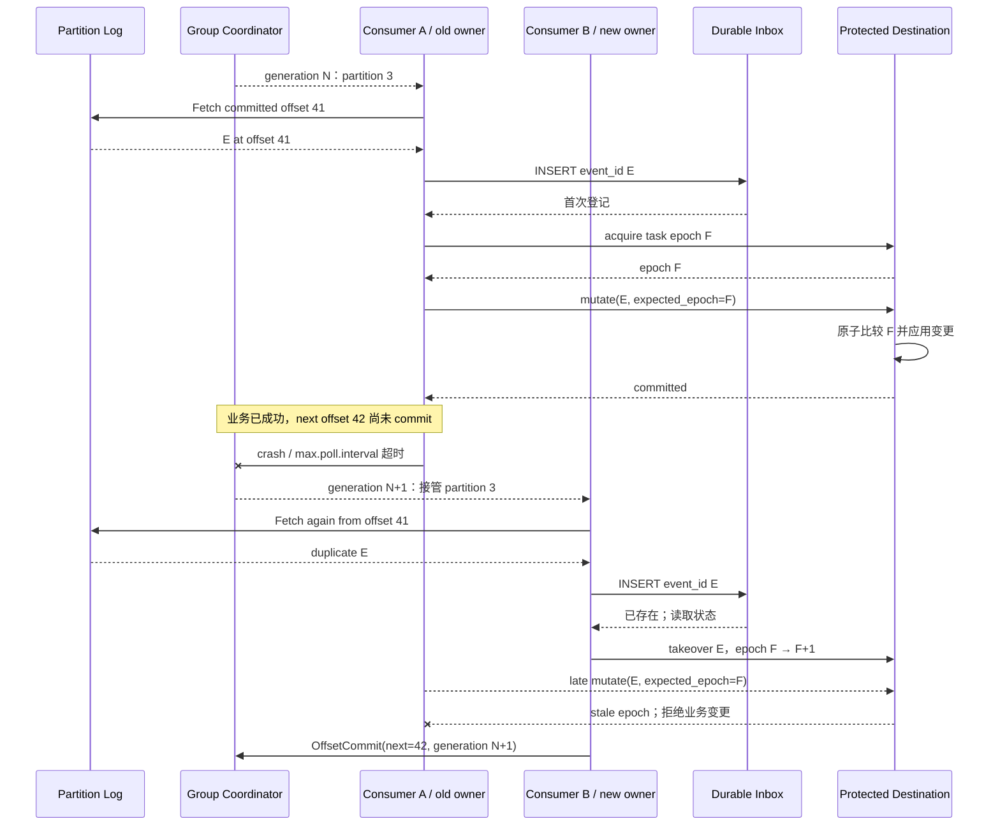

# Apache Kafka Consumer Groups：用分区所有权组织可重放的 Agent 工作

rebalance 把 partition 3 从 Consumer A 转给 Consumer B 时，A 发出的 HTTP 请求可能仍在执行。Kafka 能阻止失去 assignment 的成员继续用旧 generation 提交 offset，却不会撤回这个请求，也不会替业务数据库选择哪次写入有效。

Consumer Group 的可迁移价值，正是把“取数所有权”和“业务动作所有权”拆开。partition assignment、offset 与 retained log 支撑接管和重放；inbox、幂等键、lease、fencing 与对账才负责处理在途工作的重叠。

**证据范围**：本文以 Apache Kafka 4.3.1 文档和 `apache/kafka@ebac341b28d4224c296ada31eb45122176e8b27b` 为截面，重点讨论默认仍为 `classic` 的 consumer group protocol。必须先记住：partition 内顺序不等于跨 partition 全局顺序；Kafka transaction 也不等于任意数据库、邮件、支付和工具调用的通用事务。

## 学习问题

1. partition、offset 与 retained log 如何共同定义恢复位置？
2. classic rebalance 转移 partition 时，为什么旧 owner 的在途动作仍可能完成？
3. position、committed offset 与业务完成状态为何是三件事？
4. partition key 怎样交换局部顺序、并行度、公平性与热点风险？
5. Agent 平台如何用 inbox、fencing、背压和 replay 管住重复处理？

## 一页摘要

**已证实事实**：Kafka topic 分成 partitions，事件追加到其中一个 partition。相同 key 的事件进入同一 partition；consumer 按 topic-partition 内的写入顺序读取。该保证是 partition-local，不提供跨 partition 的全局顺序。

同一 `group.id` 内，一个 partition 在当前 assignment 中交给一个 consumer。classic 协议由 broker coordinator 管理成员、generation 和状态；被选为 leader 的客户端执行 assignor，再通过 SyncGroup 让 coordinator 保存并传播 assignment。

consumer position 是下一次 `poll()` 返回的位置，committed offset 是失败或 rebalance 后的恢复位置。业务动作成功而 offset 未提交时进程失败，接管者会从旧 offset 重读。这是 at-least-once 的重复窗口。

**个人分析**：partition assignment 只决定谁能继续取数。长时 Agent 应先把事件耐久登记为 work item，再由具有独立 lease 和 epoch 的 worker 执行；最终目的地必须以幂等键或原子 fencing 拒绝旧 owner 的迟到写。

| Kafka 边界 | 它实际保证什么 | 不能推出什么 |
| --- | --- | --- |
| partition-local order | 同一 partition 按日志顺序读取 | 跨 partition 的 global order |
| one partition / one group member | 当前 assignment 的取数 owner | 单任务锁、旧 worker 已停止 |
| committed offset | 重启与 rebalance 的恢复游标 | 前序副作用已成功且只发生一次 |
| retained log + seek/reset | 保留范围内重放输入 | 无限历史、确定性 Agent 输出 |
| Kafka transaction | Kafka 输出与输入 offset 的原子边界 | 任意外部系统的通用 transaction |

应保留的结论是：顺序域、取数所有权、恢复游标和业务事务各有边界，不能用“Kafka 已经 exactly-once”把它们合并。

## 事实边界

**已证实事实**：consumer 数量超过 partition 数量时，多出的成员不能增加该 topic 的分区并行度。成员崩溃、加入、离开或订阅出现新 partition 时会 rebalance；heartbeat、`session.timeout.ms` 和持续 `poll()` 共同维持 classic group 活性。

**已证实事实**：`max.poll.records` 限制一次返回给应用的记录数，不限制底层 fetch 缓存。`pause`/`resume` 只控制已分配 partition 的后续返回，不会让 producer 停止写入。

**已证实事实**：producer idempotence 针对 producer retry 写 Kafka，并受单个 producer session 边界限制。Kafka transaction 可原子提交 Kafka 输出与 consumer offsets，配合 `read_committed` 形成 Kafka-to-Kafka 边界；任意外部系统仍需自己配合。

**基于证据的推断**：group generation 能拒绝 stale member 提交 offset，却不能 fence 已发送的业务请求。目标存储必须比较更高层 ownership epoch，并在同一原子操作中决定是否应用业务变更。

**个人分析**：Kafka offset 不是完整审计快照。重放只恢复输入字节和顺序，不恢复模型、prompt、工具、知识、权限与外部世界的历史版本；这些版本需要独立账本。

  
证据：版本、协议与历史材料范围

  - **当前文档：** Apache Kafka 4.3.1；consumer 配置支持 `classic` 与 `consumer`，默认仍为 `classic`。
  - **新协议边界：** `consumer` protocol 自 Kafka 4.0 起 GA，且不依赖 classic 的全局同步屏障；本文不把两套状态机混写。
  - **排除项：** 不把 Kafka 4.3 share group 的逐记录 acquisition、delivery attempt 或 reject 语义倒推到 consumer group。
  - **固定源码：** `apache/kafka@ebac341b28d4224c296ada31eb45122176e8b27b`。
  - **历史来源：** LinkedIn 2011 原始工程文章用于确认 NetDB ’11 论文；论文 PDF 由 Microsoft Research 托管。
  - **时间边界：** 来源访问与分析日期为 2026-07-22。

## 架构图

下面跟踪 ownership 转移最危险的时间窗：业务动作已经提交，offset 还没提交，rebalance 又让新 consumer 接管。Kafka generation 与应用 work epoch 故意画成两个变量，因为前者不会自动保护外部目的地。

若目的地不能把 epoch 比较和业务变更原子绑定，这个设计就不是真正的 fencing。此时只能依赖幂等键、单写 dispatcher、补偿与对账来降低重复副作用。

## 控制权与任务流

**说明性场景**：Consumer A 在 generation N 拥有 partition 3。它从 offset 41 读取任务 E，调用外部工具后尚未提交 next offset 42；长调用使它超过 `max.poll.interval.ms`，group 开始 rebalance，Consumer B 在 generation N+1 接管 partition 3。

B 从 committed offset 41 再次读到 E。A 并不会因此被 Kafka 强制终止，它发出的请求也可能迟到完成。若目的地只检查“请求来自合法 consumer”，A 与 B 都可能造成副作用；若目标端原子比较 work epoch，只有当前 epoch 的变更生效。

这个场景是对官方 at-least-once 与 group ownership 机制的说明性组合，不是一次真实事故。它揭示了恢复协议的分界：Kafka 负责重新交付，应用负责判定重复动作能否生效。

classic JoinGroup 收集成员协议与订阅，coordinator 选 leader 和共同 protocol。leader 客户端运行 assignor，SyncGroup 把 member-to-partition mapping 交回 broker，再由 coordinator 传播。rebalance 是 assignment 转移，不是暂停所有在途业务的事务。

处理同一 partition 的并发任务时，只能提交连续完成前缀的下一 offset。若 43 已完成、42 仍失败，提交 44 会跳过 42；可以保持 partition 内串行，或维护无缺口完成水位。

长时 Agent 不应占住 poll 活性。consumer 可以校验 schema、写 durable inbox/work ledger，然后提交“已耐久登记”的 offset；独立 worker 再以 lease、deadline、attempt、epoch 和幂等键执行。若仍在 consumer 内处理，就限制 `max.poll.records`、暂停繁忙 partition，并继续及时 poll。

重放也需要独立所有权。临时定位可 `seek`；批量 backfill 应新建专用 group，从明确时间或 offset 读取，不改写生产组游标。执行前核对 log start offset、retention 余量、下游限额和副作用模式。

## 关键源码导读

最短阅读路径从 classic group 状态与 Join/Sync 开始，再沿 leader assignment、offset commit 和 fetch position 前进。这样可以直接回答：谁算 assignment、谁传播 assignment、offset 证明了什么、记录何时推进本地 position。

**已证实事实**：`ClassicGroup` 声明 assignment 由客户端驱动；状态经过 `EMPTY → PREPARING_REBALANCE → COMPLETING_REBALANCE → STABLE`。leader 客户端执行 assignor，coordinator 保存并传播结果。

**已证实事实**：OffsetMetadataManager 校验并生成 offset coordinator record，但不调用用户数据库，也不检查 Agent 结果。客户端则从 fetch buffer 解析已分配 partition 的记录并推进 next offset；提交与业务完成仍由应用负责。

  
证据：固定提交中的 classic assignment、offset 与 fetch 源码接缝

  - [`KafkaApis.scala` 1389–1440](https://github.com/apache/kafka/blob/ebac341b28d4224c296ada31eb45122176e8b27b/core/src/main/scala/kafka/server/KafkaApis.scala#L1389-L1440)：JoinGroup/SyncGroup 先检查 group 的 `READ` 权限；OffsetCommit 与 Fetch 还会检查对应 group/topic 权限，再进入 coordinator 或 fetch 后端。
  - [`ClassicGroup.java` 72–154](https://github.com/apache/kafka/blob/ebac341b28d4224c296ada31eb45122176e8b27b/group-coordinator/src/main/java/org/apache/kafka/coordinator/group/classic/ClassicGroup.java#L72-L154) 与 [`ClassicGroupState.java` 29–126](https://github.com/apache/kafka/blob/ebac341b28d4224c296ada31eb45122176e8b27b/group-coordinator/src/main/java/org/apache/kafka/coordinator/group/classic/ClassicGroupState.java#L29-L126)：成员、leader、generation 与状态迁移。
  - [`GroupMetadataManager.classicGroupJoin` 6822–6946](https://github.com/apache/kafka/blob/ebac341b28d4224c296ada31eb45122176e8b27b/group-coordinator/src/main/java/org/apache/kafka/coordinator/group/GroupMetadataManager.java#L6822-L6946) 与 [`prepareRebalance` 7648–7732](https://github.com/apache/kafka/blob/ebac341b28d4224c296ada31eb45122176e8b27b/group-coordinator/src/main/java/org/apache/kafka/coordinator/group/GroupMetadataManager.java#L7648-L7732)：join、等待与 generation 推进。
  - [`ConsumerCoordinator.onLeaderElected` 655–715](https://github.com/apache/kafka/blob/ebac341b28d4224c296ada31eb45122176e8b27b/clients/src/main/java/org/apache/kafka/clients/consumer/internals/ConsumerCoordinator.java#L655-L715) 与 [`onJoinComplete` 379–474](https://github.com/apache/kafka/blob/ebac341b28d4224c296ada31eb45122176e8b27b/clients/src/main/java/org/apache/kafka/clients/consumer/internals/ConsumerCoordinator.java#L379-L474)：cooperative 路径先调用 `onPartitionsRevoked`；分配路径先执行 `subscriptions.assignFromSubscribed(...)`，再调用 `onPartitionsAssigned`。
  - [`GroupMetadataManager` 7757–7833](https://github.com/apache/kafka/blob/ebac341b28d4224c296ada31eb45122176e8b27b/group-coordinator/src/main/java/org/apache/kafka/coordinator/group/GroupMetadataManager.java#L7757-L7833)：assignment 保存与传播。
  - [`OffsetMetadataManager.commitOffset` 620–693](https://github.com/apache/kafka/blob/ebac341b28d4224c296ada31eb45122176e8b27b/group-coordinator/src/main/java/org/apache/kafka/coordinator/group/OffsetMetadataManager.java#L620-L693)：提交者校验与 coordinator record。
  - [`ClassicKafkaConsumer.pollForFetches` 700–771](https://github.com/apache/kafka/blob/ebac341b28d4224c296ada31eb45122176e8b27b/clients/src/main/java/org/apache/kafka/clients/consumer/internals/ClassicKafkaConsumer.java#L700-L771)、[`FetchCollector.collectFetch` 91–190](https://github.com/apache/kafka/blob/ebac341b28d4224c296ada31eb45122176e8b27b/clients/src/main/java/org/apache/kafka/clients/consumer/internals/FetchCollector.java#L91-L190) 与 [`CompletedFetch.fetchRecords` 257–329](https://github.com/apache/kafka/blob/ebac341b28d4224c296ada31eb45122176e8b27b/clients/src/main/java/org/apache/kafka/clients/consumer/internals/CompletedFetch.java#L257-L329)：poll/fetch、assignment 检查、position 推进与 poison deserialization。
  - **证明边界：** 这些位置证明 Kafka 的 group 与 offset 控制流，不证明用户 handler 或外部写具备 exactly-once。

## 架构决策与权衡

Partition key 决定顺序域、热点和并行上限。增加 partition 后，同一 key 的未来映射可能变化，历史记录不会重分区；因此 partition 数量与 key 变化都是顺序协议迁移。

| key | 获得的局部顺序 | 优点 | 代价与边界 |
| --- | --- | --- | --- |
| `user_id` | 用户内事件 | 偏好、权限、通知去重直观 | 大用户热点，跨用户无序 |
| `tenant_id` | 租户内事件 | 租户审计与串行治理 | 并行度低，noisy neighbor |
| `task_id` | 单任务 plan/attempt/result | 任务间并行、重放边界清楚 | 跨任务政策需额外版本化 |
| `conversation_id` | 会话内消息与派生任务 | 适合聊天因果与人工轮次 | 长会话热点，fork/merge 要显式 |

默认可用 `task_id` 作为执行 topic key，把 conversation、user、tenant 保留为索引和策略字段。只有业务不变量要求会话严格串行时，才用 `conversation_id`。任何选择都不提供跨 partition 全局顺序。

offset 提交也取决于业务边界。外部数据库可用 inbox 唯一约束，或把业务结果与恢复游标放在同库事务；Kafka-to-Kafka 处理可用 transactional producer 与 `read_committed`。邮件、支付和工具调用仍需外部幂等、dispatcher 或补偿。

Poison event 不能无限阻塞 partition，也不能静默跳过。quarantine 至少保存 topic/partition/offset、原始数据或受控地址、schema、异常、attempt、tenant 与处置状态；若事件是同 key 后续不变量的前置条件，应暂停并升级。

## 生产化分析

partition 数只给出一组的活跃 consumer 上限，不代表有效 Agent 并行度。按工作类型维护处理时长和并发预算；用 `max.poll.records` 控制暴露量，对下游拥塞 partition `pause`。不要把 poll 出来的记录无限堆入内存 executor。

lag 是症状，不是业务完成量。结合 `records-lag-max`、消费速率、poll 间隔、assigned partitions、commit 错误和 rebalance 指标，再看 oldest-event age、lease age、tool latency、duplicate suppression、DLQ age、tenant backlog 与 drain ETA。

生产者用 transactional outbox 避免“数据库已有事实，Kafka 无事件”。消费者在数据库事务中登记稳定 `event_id`，业务成功后再提交 offset。对于外部调用，继续传 idempotency key 并保存 request/result hash；inbox 单独不能消除“外部成功、落库前崩溃”的重复窗口。

fencing 必须由权威目的地原子执行。所有状态写带 `(task_id, epoch)`；旧 epoch 影响零行后停止。若只能先读 epoch 再单独写，中间 takeover 会形成 TOCTOU，这不是真 fencing。

retention 应覆盖最长中断、检测、修复和 replay 窗口。业务审计另存 event ID、输入 hash、schema、producer、topic/partition/offset、模型/prompt/tool 版本、attempt、epoch、结果、offset commit 与人工决策。日志保留策略不能替代合规删除与密钥治理。

  
证据：retention 与 offset 恢复窗口的精确配置

  - **Topic 日志：** `retention.ms` 与 `retention.bytes` 共同约束事件日志可重放窗口；达到任一边界都可能让旧记录离开可用范围。
  - **Consumer offset：** `offsets.retention.minutes` 约束 group offset 元数据保留期，不等同于 topic 日志保留。
  - **边界：** replay 能否进行要同时核对 log start offset、topic retention 与 group offset；这些配置都不能替代业务审计存储。

  
证据：consumer 监控字段与 Kafka transaction 接缝

  - **客户端指标：** `records-consumed-rate`、`time-between-poll-max` 与 `last-poll-seconds-ago` 分别帮助判断吞吐和 poll 活性。
  - **操作入口：** `kafka-consumer-groups.sh --describe` 用于查看 group assignment、offset 与 lag；它不证明业务 handler 已完成。
  - **提交接缝：** `commitAsync` 保证提交请求与 callback 的调用顺序；应用仍不能在旧 callback 中回写倒退的业务水位。
  - **事务接缝：** transactional producer 的 `sendOffsetsToTransaction` 把消费 offset 与 Kafka 输出纳入同一 Kafka transaction，不覆盖数据库、邮件、支付或任意工具调用。
  - **边界：** 这些字段与 API 支持定位 poll、lag、commit 与 Kafka-to-Kafka 事务，不提供外部副作用 exactly-once。

生产集群应启用 TLS、SASL 与 ACL，限制 producer topic、consumer topic/group，以及 offset reset、group delete、topic alter 与 DLQ replay 权限。长期事件中不要放 provider secret、访问令牌或完整敏感 prompt。

**不可隐藏的非等价边界**：partition order 不是 global order，assignment 不是业务锁，offset 不是逐记录业务 ack，Kafka transaction 也不是跨任意外部系统的通用事务。Agent 架构必须逐项补足，而不能用一个“exactly-once”标签覆盖。

## 可迁移经验

### 可直接复用的机制

1. 用稳定 key 把需要串行的不变量放进同一 partition。
2. 用不同 group 分隔在线执行、审计、索引和 backfill。
3. 把 committed offset 当恢复游标，保存 next offset 与业务结果引用。
4. 用 lag/age、poll、rebalance、commit、DLQ 和去重构建端到端信号。
5. 为 replay 预留 retention、专用 group、限速、dry-run 与对账。

### 只能有限类比的部分

1. partition assignment 可类比 work ownership，但只控制取数。
2. replay 恢复输入流，不恢复模型的确定性内部状态。
3. group failover 接管未提交工作，新旧 worker 仍可能在外部重叠。
4. Kafka transaction 精确覆盖 Kafka offset 与 Kafka output，不自动覆盖任意目的地。

### 不应照搬的部分

1. 不要为不需要的总顺序把大 tenant 全放进一个 partition。
2. 不要在 poll 线程无界等待长时模型、工具或人工。
3. 不要先 commit 再执行高价值动作，也不要把 auto commit 当业务 ack。
4. 不要把 DLQ 当垃圾桶后无条件推进同 key 后续状态。
5. 不要宣称 Kafka 提供 global order、handler exactly-once 或通用分布式事务。

## 来源

**官方文档与 API（已证实事实）**

- [Apache Kafka Introduction](https://kafka.apache.org/intro/) 与 [Kafka 4.3 Design](https://kafka.apache.org/43/design/design/)：topic、partition、key、position、delivery semantics、transaction 与外部系统边界。
- [KafkaConsumer 4.3.1 Javadoc](https://kafka.apache.org/43/javadoc/org/apache/kafka/clients/consumer/KafkaConsumer.html) 与 [KafkaProducer 4.3.1 Javadoc](https://kafka.apache.org/43/javadoc/org/apache/kafka/clients/producer/KafkaProducer.html)：assignment、commit、seek、pause/resume、producer idempotence 与 transaction。
- [Consumer Configs](https://kafka.apache.org/43/configuration/consumer-configs/) 与 [Consumer Rebalance Protocol](https://kafka.apache.org/43/operations/consumer-rebalance-protocol/)：classic/consumer protocol、poll/session timeout 与新协议差异。
- [Topic Configs](https://kafka.apache.org/43/configuration/topic-configs/) 与 [Broker Configs](https://kafka.apache.org/43/configuration/broker-configs/)：log retention 与 offset retention。
- [Basic Operations](https://kafka.apache.org/43/operations/basic-kafka-operations/)、[Monitoring](https://kafka.apache.org/43/operations/monitoring/) 与 [Security](https://kafka.apache.org/43/security/security-overview/)：group/offset/lag 操作、指标及 TLS/SASL/ACL。

**经典论文与原始工程资料（已证实事实）**

- Kreps, Narkhede, Rao, [Kafka: a Distributed Messaging System for Log Processing](https://www.microsoft.com/en-us/research/wp-content/uploads/2017/09/Kafka.pdf), NetDB ’11：原始日志、partition、consumer group 与显式 offset 设计。
- LinkedIn, [Open-sourcing Kafka](https://www.linkedin.com/blog/member/archive/open-source-linkedin-kafka), 2011-01-11，与 [Project Kafka reaches v0.6](https://www.linkedin.com/blog/engineering/open-source/project-kafka-distributed-publish-subscribe-messaging-system-reaches-v06), 2011-06-16：公开背景、早期语义与论文链接。
- Jay Kreps, [The Log](https://www.linkedin.com/blog/engineering/distributed-systems/log-what-every-software-engineer-should-know-about-real-time-datas-unifying), 2013：append-only log、partition 内全序与 partition 间无 global order。

**固定源码（已证实事实）**

- [`apache/kafka@ebac341b28d4224c296ada31eb45122176e8b27b`](https://github.com/apache/kafka/tree/ebac341b28d4224c296ada31eb45122176e8b27b)：本文唯一源码截面。
- [`ClassicGroup` / `ClassicGroupState`](https://github.com/apache/kafka/blob/ebac341b28d4224c296ada31eb45122176e8b27b/group-coordinator/src/main/java/org/apache/kafka/coordinator/group/classic/ClassicGroup.java)：membership、generation、leader 与状态机。
- [`GroupMetadataManager`](https://github.com/apache/kafka/blob/ebac341b28d4224c296ada31eb45122176e8b27b/group-coordinator/src/main/java/org/apache/kafka/coordinator/group/GroupMetadataManager.java) 与 [`OffsetMetadataManager`](https://github.com/apache/kafka/blob/ebac341b28d4224c296ada31eb45122176e8b27b/group-coordinator/src/main/java/org/apache/kafka/coordinator/group/OffsetMetadataManager.java)：join/rebalance/sync/assignment 与 offset record。
- [`ConsumerCoordinator`](https://github.com/apache/kafka/blob/ebac341b28d4224c296ada31eb45122176e8b27b/clients/src/main/java/org/apache/kafka/clients/consumer/internals/ConsumerCoordinator.java)：classic leader assignor 与 callbacks。
- [`ClassicKafkaConsumer`](https://github.com/apache/kafka/blob/ebac341b28d4224c296ada31eb45122176e8b27b/clients/src/main/java/org/apache/kafka/clients/consumer/internals/ClassicKafkaConsumer.java)、[`FetchCollector`](https://github.com/apache/kafka/blob/ebac341b28d4224c296ada31eb45122176e8b27b/clients/src/main/java/org/apache/kafka/clients/consumer/internals/FetchCollector.java) 与 [`CompletedFetch`](https://github.com/apache/kafka/blob/ebac341b28d4224c296ada31eb45122176e8b27b/clients/src/main/java/org/apache/kafka/clients/consumer/internals/CompletedFetch.java)：poll/fetch、position 与 poison seam。
- [`KafkaApis.scala`](https://github.com/apache/kafka/blob/ebac341b28d4224c296ada31eb45122176e8b27b/core/src/main/scala/kafka/server/KafkaApis.scala)：broker API、安全与后端入口。

**证据边界说明**：官方与固定源码支持 Kafka 机制；Agent task、approval、tool call、compensation、inbox 和业务 fencing 是本文迁移设计。访问与截断日期均为 **2026-07-22**。
