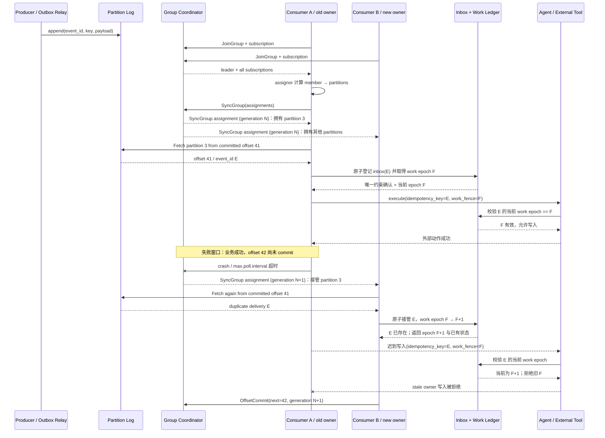

# Apache Kafka Consumer Groups：用分区所有权组织可重放的 Agent 工作

Kafka Consumer Group 最值得 Agent 平台借鉴的不是“接入一个消息中间件”，而是把并行工作约束为一组可说明的分区所有权：事件先进入可保留的分区日志；同一消费组内，一个分区在任一时刻只交给一个成员；处理者以 offset 表达下一次恢复位置；成员变化时，协调器重新分配分区。这个模型把任务归属、恢复与扩缩容连在一起，也把两个事实暴露得很清楚：处理完成与 offset 提交之间存在失败窗口，rebalance 期间旧持有者的外部副作用不会被 Kafka 自动撤销。

本案例以 Apache Kafka 4.3.1 官方文档和 `apache/kafka@ebac341b28d4224c296ada31eb45122176e8b27b` 为当前证据截面，重点阅读 classic consumer group。Kafka 4.3 同时提供新的 `consumer` group protocol，且默认客户端配置仍是 `classic`；本文不把两套协议混成一个状态机，也不讨论 share group 的逐记录获取语义。历史部分以 LinkedIn 2011 年原始工程文章确认 NetDB ’11 论文，再引用 Microsoft Research 当前托管的原论文 PDF。

## 学习问题

1. append-only、partition 与 offset 怎样把 Agent 输入从“发完即失”变成可检查、可重放的工作日志？
2. classic group 的 coordinator、leader、assignor 和普通 member 分别拥有哪部分控制权，为什么 partition assignment 不是业务锁？
3. `poll()` 的当前位置与 committed offset 有何区别，哪个失败窗口会产生 at-least-once 重复执行？
4. rebalance 为什么既能恢复失败成员的分区，也会放大长时 Agent 调用、状态迁移和外部副作用的风险？
5. user、tenant、task、conversation 四种 partition key 分别牺牲什么顺序、并行度、公平性与隔离性？
6. lag、`max.poll.interval.ms`、`max.poll.records`、`pause`/`resume` 如何共同表达背压，为什么消息条数不足以衡量 Agent 工作量？
7. poison event、重放、retention、幂等 consumer、outbox/inbox 和 fencing 怎样组成可审计的重复处理边界？

## 一页摘要

**已证实事实**：Kafka topic 被切成多个 partition；新事件追加到其中一个 partition。相同 key 的事件进入同一 partition，给定 topic-partition 的消费者按写入顺序读取。这个顺序保证是 **partition-local**：Kafka 不提供跨 partition 的全局顺序。LinkedIn 的日志文章也明确说明，每个 partition 是全序日志，而 partition 之间没有全局顺序。

**已证实事实**：一个 `group.id` 标识一个消费组。组内成员共同订阅 topic，Kafka 把每个 partition 分给组内恰好一个 consumer；成员崩溃、加入、离开或订阅匹配到新 partition 时会 rebalance。classic 协议下，broker group coordinator 管理成员、generation 与状态；被选为 group leader 的客户端收集订阅，用选定 assignor 计算 member → partition 映射，再通过 SyncGroup 让 coordinator 持久化并传播 assignment。

**已证实事实**：consumer position 是下一条将由 `poll()` 返回的 offset，会随取数前进；committed position 是失败重启或 rebalance 后恢复使用的 offset。若应用先完成数据库写入、工具调用或消息发送，再提交 offset，进程在二者之间失败，接管者会从旧 committed offset 再读并重复执行。这正是默认 at-least-once 的重复窗口。

**基于证据的推断**：对于 Agent 工作，partition assignment 只决定“哪个 consumer 可以继续从这条分区日志取数”，不证明旧 consumer 已停止推理、终止 HTTP 请求或撤销工具副作用。高风险动作要在业务存储中使用 `event_id`/`task_id` 幂等键、inbox 唯一约束和可递增 fencing token，拒绝被 rebalance 淘汰的旧执行者迟到写入。

**个人分析**：Agent 平台应让消费循环快速完成一个可耐久状态转移，而不是在 `poll()` 线程里等待几十分钟的模型/人工/工具链。长任务可以先把事件登记为 inbox/work item，再由受租约约束的 worker 执行；只有登记与去重已持久化后才提交 offset。lag 是背压症状，不是业务完成量；应同时观察最老待处理事件年龄、各 key 的处理时长、活跃租约、重试/DLQ 率和预计清空时间。

| Kafka 边界 | 对 Agent 工作的含义 | 不能推出的保证 |
| --- | --- | --- |
| partition-local order | 同一 key 的状态变化可交给一个分区顺序读取 | 跨用户、跨任务或跨 partition 的全局顺序 |
| one partition / one group member | 在当前 generation 内限制组内取数所有者 | 单条任务锁、旧执行者已停止、外部写 exactly-once |
| committed offset | rebalance/重启后的恢复位置 | offset 之前的业务副作用都成功且只发生一次 |
| retained log + `seek`/reset | 在仍保留的 offset 范围内重放 | 无限历史、确定性 Agent 输出、自动审计还原 |
| Kafka transaction | 可原子写 Kafka 输出与消费 offset | 任意数据库、邮件、支付和工具调用的通用分布式事务 |

## 事实边界

**已证实事实**

- Kafka 官方介绍把事件描述为 key、value、timestamp 与 headers，并把事件追加到 topic 的某个 partition。相同 key 进入同一 partition；顺序保证针对给定 topic-partition。
- 2013 年 LinkedIn 工程文章把 log 定义为 append-only 的有序记录序列，并在 Kafka 分区一节明确说明：partition 内全序，partition 之间没有全局顺序。本文据此明确否认“一个 topic 就是一条全局有序队列”。
- 同一 `group.id` 的进程构成 consumer group。组内每个 partition 分给恰好一个 consumer；consumer 数量超过 partition 数量时，额外成员不能增加该 topic 的分区级并行度。
- Kafka 4.3 的 consumer 配置支持 `classic` 与 `consumer` 两种 group protocol，默认是 `classic`。官方迁移文档说明新协议从 Kafka 4.0 起 GA，并且不再依赖全局同步屏障；因此本文的 JoinGroup/SyncGroup 状态分析只适用于 classic 路径。
- 固定源码中 `ClassicGroup` 直接声明 assignment 由客户端驱动；状态按 `EMPTY → PREPARING_REBALANCE → COMPLETING_REBALANCE → STABLE` 演进。join 阶段选出 leader 并提升 generation，leader 客户端执行 assignor，coordinator 收到 SyncGroup assignment 后传播给成员并进入 `STABLE`。
- consumer 以 heartbeat 和持续 `poll()` 维持组内活性。classic 配置下，超过 `session.timeout.ms` 没有 heartbeat 会被移出；超过 `max.poll.interval.ms` 没有再次 poll，会被视为失败并触发 partition 重分配。
- `max.poll.records` 限制一次 `poll()` 返回给应用的记录数，但不限制底层 fetch 缓存；`pause`/`resume` 可以暂停或恢复已分配 partition 的后续返回。它们是消费侧流量控制原语，不会让 producer 自动停止写入。
- `poll()` 后的内存 position 与 committed offset 是不同状态。committed offset 应是“下一条要处理的记录”；自动或手动 commit 只把 offset 提交给 Kafka，不会提交外部数据库事务、模型结果或工具副作用。
- consumer 可 `seek` 到更早或更晚 offset，也可用 group reset 工具改写恢复点；前提是目标记录仍在 retention 范围。topic 的 `retention.ms`/`retention.bytes` 是消费者必须及时读取的 SLA，group committed offsets 还受独立的 `offsets.retention.minutes` 约束。
- 官方 delivery semantics 将“先处理、后保存 position”归为 at-least-once：在输出成功而 offset 未保存时崩溃，会再次处理。固定客户端源码也先从 fetch buffer 解析记录并推进 position，之后是否提交由应用决定。
- producer idempotence 针对 producer retry 写入 Kafka 的重复，并且官方 Javadoc 明确限制在单个 producer session；它不去重应用主动重发，也不去重 consumer 的业务 handler。
- Kafka transaction 可把 Kafka 输出记录与 consumer offset 放在同一 transaction 中，配合 `read_committed` 形成 Kafka topic → Kafka topic 的 read-process-write 原子边界。写任意外部系统仍需要该系统配合，例如把结果与 offset 放进同一个数据库事务。

**基于证据的推断**

- group coordinator 的 generation/member 校验能拒绝失去 assignment 的成员继续提交 offset，却不能 fence 已发往外部系统的请求。业务写入需要携带更高层的 ownership epoch，并由目标存储比较 epoch 后接受或拒绝。
- committed offset 是恢复游标，不是逐记录 ack。一次提交越过一个 batch 后，Kafka 不再知道 batch 中每条 Agent 动作是否分别成功；若需要逐任务审计，应用必须保存 inbox/result 状态。
- replay 只重放输入字节和顺序，不重建模型、prompt、工具、知识库、权限与外部世界的历史版本。要审计 Agent 决策，应在事件或结果账本中保存这些版本引用，而不是把 Kafka offset 当完整执行快照。
- lag 增长表示消费位置落后于日志尾部，但同样 100 条事件可能分别代表毫秒级路由或小时级调查。Agent 容量规划应把 record lag 转成 age lag、预计服务时间和每个 key 的排队时间。

**个人分析与未知项**

- 本文研究传统 consumer group，不把 Kafka 4.3 share group 的逐记录 acquisition lock、delivery attempt 计数或 reject 语义倒推到 consumer group。
- Kafka 没有为 Agent 定义 task、conversation、approval、tool call 或 compensation；这些都是应用协议。partition key 只是路由与局部顺序决策。
- Kafka 不提供跨 partition 的全局顺序，也不提供覆盖 Kafka、任意业务数据库、LLM provider、邮件、支付和第三方工具的通用分布式事务。
- 来源访问与分析日期为 **2026-07-22**；动态文档为 Kafka 4.3.1，源码固定在 `ebac341b28d4224c296ada31eb45122176e8b27b`。后续默认 protocol、rebalance 状态机或 share group 行为变化不在本文事实范围内。

## 架构图

下图把 Agent 工作的 partition ownership、offset 与重复窗口放在同一条时间线上。红色语义由应用补充，不是 Kafka 自动提供。

文字等价描述：producer 只负责把带稳定 `event_id` 与 partition key 的事实追加到日志；classic group 的 leader client 计算 assignment，broker coordinator 管理 Kafka generation 并传播结果。consumer 在应用自己的 durable inbox/work ledger 中原子登记事件并取得 work epoch `F`，外部目的地写入前校验该 epoch。若旧 owner 在外部动作成功后死亡，新 owner 会从旧 committed offset 重读，并在 work ledger 原子取得 `F+1`；此后旧 owner 携带 `F` 的迟到写会被目的地拒绝。Kafka generation `N/N+1` 只出现在 group 协议与 OffsetCommit 校验中，不充当外部业务 fence；最后才提交下一 offset。

## 控制权与任务流

**从日志到所有权。** Producer 按 key 选择 partition，Kafka 给 partition 中的记录分配 offset。consumer group 不是把每条消息随机发给任意 worker，而是先分配 partition；一个 member 可拥有多个 partition，一个 partition 在同一组当前 assignment 中只有一个 owner。不同 group 可以独立读取同一份日志，因此在线执行、审计、索引与离线评估应使用不同 group，而不是共享 offset 互相推进。

**classic rebalance。** JoinGroup 收集成员支持的协议与订阅；coordinator 选出 leader 和共同 protocol。leader 在 [`ConsumerCoordinator.onLeaderElected`](https://github.com/apache/kafka/blob/ebac341b28d4224c296ada31eb45122176e8b27b/clients/src/main/java/org/apache/kafka/clients/consumer/internals/ConsumerCoordinator.java#L655-L715) 中运行 assignor、序列化 assignment；broker 在 SyncGroup 路径保存并向每个成员传播。成员收到新 assignment 后，cooperative 路径会对被撤销 partition 先调用 `onPartitionsRevoked`，再改变 assignment；分配路径则先执行 `subscriptions.assignFromSubscribed(...)` 更新本地 assignment，随后才调用用户的 `onPartitionsAssigned`。rebalance 是所有权转移协议，不是暂停世界的事务。

**处理与提交。** 对每个 partition，应用应只提交已经连续完成的最高 offset 的下一位置。若把同一 partition 的记录并发交给多个线程，offset 43 先完成而 42 仍失败时，直接提交 44 会永久跳过 42；要么保持 partition 内串行，要么维护完成水位，只有无缺口前缀可 commit。Kafka 保证多次 `commitAsync` 按调用顺序发送，对应 callback 也按调用顺序触发；风险不来自 Kafka 调乱 callback，而来自应用在较旧提交失败的 callback 中重新提交旧 offset，或在 callback 外异步更新外部进度账本，使旧状态晚到覆盖新状态。关停或 rebalance 前应使用可确认且不会倒退水位的 commit 策略。

**长时 Agent。** 直接在 poll 线程执行模型链会让处理时间撞上 `max.poll.interval.ms`；简单调大超时会延长真实故障的接管时间。更稳妥的边界是：consumer 校验 schema、写入 inbox/work ledger、提交该耐久登记对应的 offset；独立 worker 以 lease、deadline、attempt、fence 和幂等键推进任务。若必须在 consumer 内处理，就限制 `max.poll.records`、对繁忙 partition `pause`、继续及时 poll，并确保提交不越过未完成记录。

**重放。** 临时排障可 `seek`；批量 backfill 更适合新建专用 `group.id`，从时间点或明确 offset 读取，避免改写生产组恢复点。重放计划要先比较目标 offset 与 log start offset、retention headroom、下游限额和副作用模式；生产 offset reset 必须审批、预演、记录操作者与 before/after offset。

## 关键源码导读

建议按“请求入口 → classic group 状态 → leader assignment → offset → record delivery”阅读固定提交：

1. [`KafkaApis.scala`](https://github.com/apache/kafka/blob/ebac341b28d4224c296ada31eb45122176e8b27b/core/src/main/scala/kafka/server/KafkaApis.scala#L1389-L1440)：JoinGroup/SyncGroup 先检查 group 的 `READ` 权限，再交给 group coordinator。OffsetCommit 还检查 group 与 topic 权限；Fetch 对普通 consumer 检查每个 topic 的 `READ` 权限。这里是网络请求、安全与 coordinator/storage 的分界。
2. [`ClassicGroup.java`](https://github.com/apache/kafka/blob/ebac341b28d4224c296ada31eb45122176e8b27b/group-coordinator/src/main/java/org/apache/kafka/coordinator/group/classic/ClassicGroup.java#L72-L154) 与 [`ClassicGroupState.java`](https://github.com/apache/kafka/blob/ebac341b28d4224c296ada31eb45122176e8b27b/group-coordinator/src/main/java/org/apache/kafka/coordinator/group/classic/ClassicGroupState.java#L29-L126)：前者说明 classic assignment 完全由客户端驱动并保存 member、leader、generation、pending join/sync；后者定义合法状态和成员失败、join、sync 引起的迁移。
3. [`GroupMetadataManager.classicGroupJoin`](https://github.com/apache/kafka/blob/ebac341b28d4224c296ada31eb45122176e8b27b/group-coordinator/src/main/java/org/apache/kafka/coordinator/group/GroupMetadataManager.java#L6822-L6946) 与 [`prepareRebalance`](https://github.com/apache/kafka/blob/ebac341b28d4224c296ada31eb45122176e8b27b/group-coordinator/src/main/java/org/apache/kafka/coordinator/group/GroupMetadataManager.java#L7648-L7732)：观察 coordinator 怎样创建/查找 classic group、接纳新旧成员、进入 `PREPARING_REBALANCE`，等待成员重 join 或 timeout，再推进 generation。
4. [`ConsumerCoordinator.onLeaderElected`](https://github.com/apache/kafka/blob/ebac341b28d4224c296ada31eb45122176e8b27b/clients/src/main/java/org/apache/kafka/clients/consumer/internals/ConsumerCoordinator.java#L655-L715) 与 [`onJoinComplete`](https://github.com/apache/kafka/blob/ebac341b28d4224c296ada31eb45122176e8b27b/clients/src/main/java/org/apache/kafka/clients/consumer/internals/ConsumerCoordinator.java#L379-L474)：leader 反序列化所有 subscription、执行 assignor、生成映射；成员收到结果后，cooperative revoke callback 在 assignment 变更前执行，而 `subscriptions.assignFromSubscribed(...)` 先于用户的 assigned callback。这证明“broker 管协调、classic leader client 算分配”，也给出两类 callback 的准确时序。
5. [`GroupMetadataManager` 的 assignment 传播](https://github.com/apache/kafka/blob/ebac341b28d4224c296ada31eb45122176e8b27b/group-coordinator/src/main/java/org/apache/kafka/coordinator/group/GroupMetadataManager.java#L7757-L7833)：coordinator 把 leader 提交的结果设置到各 member，完成等待中的 SyncGroup future 并重排 heartbeat；成功后 group 才能稳定。
6. [`OffsetMetadataManager.commitOffset`](https://github.com/apache/kafka/blob/ebac341b28d4224c296ada31eb45122176e8b27b/group-coordinator/src/main/java/org/apache/kafka/coordinator/group/OffsetMetadataManager.java#L620-L693)：逐 partition 校验提交者与 metadata，生成 offset commit coordinator record。它没有调用用户数据库或检查 Agent 结果，因此 offset 不是业务事务证明。
7. [`ClassicKafkaConsumer.pollForFetches`](https://github.com/apache/kafka/blob/ebac341b28d4224c296ada31eb45122176e8b27b/clients/src/main/java/org/apache/kafka/clients/consumer/internals/ClassicKafkaConsumer.java#L700-L771)、[`FetchCollector.collectFetch`](https://github.com/apache/kafka/blob/ebac341b28d4224c296ada31eb45122176e8b27b/clients/src/main/java/org/apache/kafka/clients/consumer/internals/FetchCollector.java#L91-L190) 与 [`CompletedFetch.fetchRecords`](https://github.com/apache/kafka/blob/ebac341b28d4224c296ada31eb45122176e8b27b/clients/src/main/java/org/apache/kafka/clients/consumer/internals/CompletedFetch.java#L257-L329)：客户端从 buffer 收集可 fetch 的 assigned partition，按 `max.poll.records` 解析记录并推进 next offset；deserialization poison 会在当前 offset 重复抛错，源码提示显式 seek past 才能继续。

## 架构决策与权衡

Partition key 决定顺序域、热点和可扩展上限。它不是纯性能参数；topic 增加 partition 后，同一 key 的未来映射可能变化，历史记录不会重新分区，因此变更 partition 数量要作为顺序协议迁移处理。

| key | 获得的局部顺序 | 优点 | 主要代价与适用边界 |
| --- | --- | --- | --- |
| `user_id` | 同一用户的所有 Agent 事件 | 适合用户级偏好、权限变化和通知去重 | 大客户/机器人用户可能热点；跨用户协作无序；删除与隐私范围扩大 |
| `tenant_id` | 租户内所有事件 | tenant 级审计与串行治理直观 | 粗粒度导致并行度低、头部租户热点和 noisy neighbor；通常只适合低流量控制流 |
| `task_id` | 单任务的 plan/attempt/result | 最大化任务间并行，失败与重放边界清楚 | 同一 conversation 的多个 task 可乱序；跨任务额度/权限变化需另行版本化 |
| `conversation_id` | 同一会话的消息与任务派生 | 适合聊天因果、轮次和 human-in-the-loop | 超长会话热点；fork/merge 语义必须显式；租户公平性仍需调度层 |

默认建议以 `task_id` 作为执行 topic 的 key，把 `conversation_id`、`user_id`、`tenant_id` 保留为索引与策略字段；若业务不变量要求同一 conversation 严格串行，再选择 `conversation_id`。不要为了“看起来完整”选择 `tenant_id` 并牺牲整个租户的并行度，也不要声称任何选择能提供跨 partition 的全局顺序。

| 决策 | 推荐 | 代价 |
| --- | --- | --- |
| offset 提交 | 处理后提交；外部 DB 用 inbox 唯一约束，或结果与 offset 同库原子保存 | 故障时可能重读，必须幂等 |
| poison event | 原始 bytes + schema/version + error + offset 写 quarantine/DLQ，按审批策略跳过 | 破坏“主流内所有事件都成功”的简单叙事，需要补偿队列 |
| 慢任务 | durable work ledger + 独立 lease worker；consumer 只登记 | 多一个状态机，但不会用 poll 活性冒充业务活性 |
| replay | 新 group、只读预演、限速、明确起止 offset | 额外资源与结果对账成本 |
| Kafka-to-Kafka exactly-once | transactional producer + offsets in transaction + `read_committed` | 只覆盖 Kafka transaction 边界，异常处理与 rewind 仍需正确 |

Poison event 不应无限阻塞一个 partition，也不应静默 `seek`。quarantine 记录至少包含 topic/partition/offset、原始 payload 或受控对象地址、schema 版本、exception、首次/最近失败时间、attempt、tenant、correlation ID 和处置状态。若事件已能反序列化但业务不可处理，使用稳定 `event_id` 将其标为 rejected；若跳过会破坏同 key 的后续不变量，则暂停该 key/partition 并升级人工，而不是让后续状态越过它。

## 生产化分析

**背压与容量。** partition 数量给出单组活跃 consumer 的上限，却不等于有效 Agent 并行度。为每类工作建立处理时长分布和并发预算；使用 `max.poll.records` 限制每轮暴露量，对下游拥塞的 partition `pause`，在容量恢复后 `resume`。不要把 poll 后的记录无限堆进内存 executor；否则 position 继续前进、真实完成滞后，commit 很容易越过未完成工作。必要时在 producer 侧做 tenant 配额、低优先级 topic 分流和 admission control。

**可观测性。** 官方监控建议观察 consumer max lag 与最小 fetch rate；生产仪表盘还应组合 `records-lag-max`、`records-consumed-rate`、`time-between-poll-max`、`last-poll-seconds-ago`、assigned partitions、commit latency/error、rebalance latency/rate/failure。注意客户端 `records-lag-max` 基于 current position，不是 committed offset；用 `kafka-consumer-groups.sh --describe` 的 CURRENT-OFFSET/LOG-END-OFFSET 补充恢复 lag。Agent 层另看 oldest-event age、queue wait、lease age、tool latency、重复抑制次数、poison/DLQ age、每 tenant backlog 与 `drain ETA = remaining work / sustainable completion rate`。

**幂等与 outbox/inbox。** 生产者若在业务事务提交后单独发送 Kafka，崩溃会造成数据库有事实而日志无事件；应在同一数据库事务写业务行与 outbox，再由 relay/CDC 发送。消费者在一个数据库事务内以 `event_id` 写 inbox 唯一行并推进业务状态；事务成功后提交 Kafka offset。若数据库成功而 commit 前崩溃，重放命中 inbox 并读取已存结果。对邮件、支付、工单和工具调用继续传外部 idempotency key，并保存 request/result hash；仅有 inbox 不能阻止“外部成功、结果落库前崩溃”的第二次调用。

**fencing 与取消。** work ledger 为每次 owner/attempt 提升 epoch；所有状态写携带 `(task_id, epoch)` 条件更新，旧 epoch 影响零行即停止。对不支持幂等或 fencing 的外部系统，使用单独 side-effect dispatcher、审批或 reconciliation。rebalance callback 可以停止接收、flush 安全进度和释放本地资源，但无法强杀已发出的 HTTP 请求；取消必须是协作式，并由最终状态对账。

**retention 与审计。** retention 要覆盖最长中断、检测时间、修复时间和预期 replay 窗口，并为流量峰值留容量。业务审计不能只依赖会按策略删除或 compact 的 topic；把不可变 `event_id`、输入 hash、schema、producer identity、topic/partition/offset、模型/prompt/tool 版本、attempt、owner epoch、结果 hash、offset commit 与人工决策写入受控账本。对 PII 设置数据分类、字段级最小化、删除/加密密钥策略，不能用“日志不可变”回避合规删除。

**安全。** Kafka 安全能力是可选配置；生产集群应启用 TLS、SASL 身份和 ACL。producer 只写允许的 input/outbox topic；consumer principal 只读所需 topic、只访问自己的 group，并把 offset reset、group delete、topic alter 与 DLQ replay 留给受审计的运维角色。按 tenant 或敏感级别拆 topic/cluster 取决于隔离要求；无论如何都不要把 provider secret、访问令牌或完整敏感 prompt 直接放入长期保留事件，可发送短期对象引用并在读取端再次授权。

**运行手册。** lag 上升时先区分 producer surge、单 key 热点、下游限流、poison、GC/网络、rebalance storm 和处理变慢；不要先盲目加 consumer，因为 partition 上限与热点可能使扩容无效。rebalance 频繁时检查 `max.poll.interval.ms`、处理分位数、heartbeat、deploy churn 和静态 membership；poison 时冻结证据再 quarantine；retention 逼近时优先保护未处理输入、限流 replay 与低优先级生产，不能假设过期 offset 仍可恢复。

## 可迁移经验

### 可直接复用的机制

- 用稳定 key 把需要串行的不变量放进同一 partition，并把“没有跨 partition 全局顺序”写进接口契约。
- 用独立 consumer group 分隔在线执行、审计、索引与 backfill，各自拥有 offset 和容量预算。
- 把 committed offset 当恢复游标；处理完成后提交，并保存 next offset、leader epoch 与业务结果引用。
- 用 lag/age、poll 活性、rebalance、commit、DLQ 和 duplicate suppression 构建端到端运维信号。
- 为 replay 预留 retention、专用 group、限速、dry-run、对账与可回滚的结果命名空间。

### 只能有限类比的部分

- partition assignment 可类比 Agent work ownership，但它只控制取数；业务 lease、deadline、取消和 stale writer fencing 仍由应用实现。
- offset replay 可恢复输入流，不能恢复模型的确定性内部状态；prompt、model、tool、知识与权限版本必须另外快照。
- consumer group 的 failover 可接管未提交工作，但新旧 worker 可能在外部系统短暂重叠；只能以幂等键、fence 和 reconciliation 控制结果。
- Kafka transaction 可精确覆盖 Kafka 输入 offset 与 Kafka 输出，不自动覆盖 Agent 调用的任意目的地。

### 不应照搬的部分

- 不要把一个大 tenant 全部放进单 partition，只为获得并不需要的总顺序。
- 不要在 poll 线程里无界等待长时模型、工具或人工，然后靠无限增大 `max.poll.interval.ms` 维持表面稳定。
- 不要先 commit 再执行高价值动作，也不要把 auto commit 当业务 ack；前者可能丢工作，后者可能把内存中未完成 batch 标成已消费。
- 不要把 DLQ 当垃圾桶后直接推进所有后续状态；poison 事件可能是同 key 后续不变量的前置条件。
- 不要宣称 Kafka 提供跨 partition 全局顺序、consumer handler 恰好执行一次，或为 Agent 世界提供通用分布式事务。

## 来源

**官方文档与 API**

- [Apache Kafka Introduction](https://kafka.apache.org/intro/)：topic、partition、key、retention 与 partition-local order。
- [Kafka 4.3 Design](https://kafka.apache.org/43/design/design/)：consumer position、static membership、delivery semantics、transactions 及外部系统 exactly-once 的合作边界。
- [KafkaConsumer 4.3.1 Javadoc](https://kafka.apache.org/43/javadoc/org/apache/kafka/clients/consumer/KafkaConsumer.html)：group assignment、failure detection、manual commit、at-least-once 重复窗口、seek、pause/resume 与 position/committed position。
- [KafkaProducer 4.3.1 Javadoc](https://kafka.apache.org/43/javadoc/org/apache/kafka/clients/producer/KafkaProducer.html)：producer idempotence 的 session 边界、transactional producer 与 `sendOffsetsToTransaction`。
- [Consumer Configs](https://kafka.apache.org/43/configuration/consumer-configs/) 与 [Consumer Rebalance Protocol](https://kafka.apache.org/43/operations/consumer-rebalance-protocol/)：classic/consumer protocol 范围、poll/session timeout 与新协议差异。
- [Topic Configs](https://kafka.apache.org/43/configuration/topic-configs/) 与 [Broker Configs](https://kafka.apache.org/43/configuration/broker-configs/)：topic log retention、offset retention 和 durable write 配置。
- [Basic Kafka Operations](https://kafka.apache.org/43/operations/basic-kafka-operations/)、[Monitoring](https://kafka.apache.org/43/operations/monitoring/) 与 [Security Overview](https://kafka.apache.org/43/security/security-overview/)：group/offset/lag 操作、consumer 指标、TLS/SASL/ACL 能力及安全默认边界。

**经典论文与原始工程资料**

- Kreps, Narkhede, Rao, [Kafka: a Distributed Messaging System for Log Processing](https://www.microsoft.com/en-us/research/wp-content/uploads/2017/09/Kafka.pdf), NetDB ’11：Kafka 的原始日志、partition、consumer group 与显式 offset 设计。论文身份由 LinkedIn 2011 年 6 月工程文章链接及 NetDB ’11 program 交叉确认。
- LinkedIn, [Open-sourcing Kafka, LinkedIn's distributed message queue](https://www.linkedin.com/blog/member/archive/open-source-linkedin-kafka), 2011-01-11：最早公开发布背景与设计目标。
- LinkedIn, [Project Kafka reaches v0.6](https://www.linkedin.com/blog/engineering/open-source/project-kafka-distributed-publish-subscribe-messaging-system-reaches-v06), 2011-06-16：明确链接 NetDB ’11 原论文，并给出按 member ID 语义分区的早期例子。
- Jay Kreps, [The Log](https://www.linkedin.com/blog/engineering/distributed-systems/log-what-every-software-engineer-should-know-about-real-time-datas-unifying), 2013：append-only log、partition 内全序与 partition 间无全局顺序的工程说明。

**固定源码**

- [`apache/kafka@ebac341b28d4224c296ada31eb45122176e8b27b`](https://github.com/apache/kafka/tree/ebac341b28d4224c296ada31eb45122176e8b27b)：本文所有源码判断的唯一提交截面。
- [`ClassicGroup` / `ClassicGroupState`](https://github.com/apache/kafka/blob/ebac341b28d4224c296ada31eb45122176e8b27b/group-coordinator/src/main/java/org/apache/kafka/coordinator/group/classic/ClassicGroup.java)：classic membership、generation、leader、pending join/sync 与状态机。
- [`GroupMetadataManager`](https://github.com/apache/kafka/blob/ebac341b28d4224c296ada31eb45122176e8b27b/group-coordinator/src/main/java/org/apache/kafka/coordinator/group/GroupMetadataManager.java) 与 [`OffsetMetadataManager`](https://github.com/apache/kafka/blob/ebac341b28d4224c296ada31eb45122176e8b27b/group-coordinator/src/main/java/org/apache/kafka/coordinator/group/OffsetMetadataManager.java)：join/rebalance/sync/assignment 传播、offset 校验与 coordinator record。
- [`ConsumerCoordinator`](https://github.com/apache/kafka/blob/ebac341b28d4224c296ada31eb45122176e8b27b/clients/src/main/java/org/apache/kafka/clients/consumer/internals/ConsumerCoordinator.java)：classic leader 的 assignor 执行和成员 assignment callback。
- [`ClassicKafkaConsumer`](https://github.com/apache/kafka/blob/ebac341b28d4224c296ada31eb45122176e8b27b/clients/src/main/java/org/apache/kafka/clients/consumer/internals/ClassicKafkaConsumer.java)、[`FetchCollector`](https://github.com/apache/kafka/blob/ebac341b28d4224c296ada31eb45122176e8b27b/clients/src/main/java/org/apache/kafka/clients/consumer/internals/FetchCollector.java) 与 [`CompletedFetch`](https://github.com/apache/kafka/blob/ebac341b28d4224c296ada31eb45122176e8b27b/clients/src/main/java/org/apache/kafka/clients/consumer/internals/CompletedFetch.java)：poll/fetch、assignment 检查、position 推进与 poison deserialization 接缝。
- [`KafkaApis.scala`](https://github.com/apache/kafka/blob/ebac341b28d4224c296ada31eb45122176e8b27b/core/src/main/scala/kafka/server/KafkaApis.scala)：JoinGroup、SyncGroup、OffsetCommit 与 Fetch 的 broker API、安全和后端调用入口。
