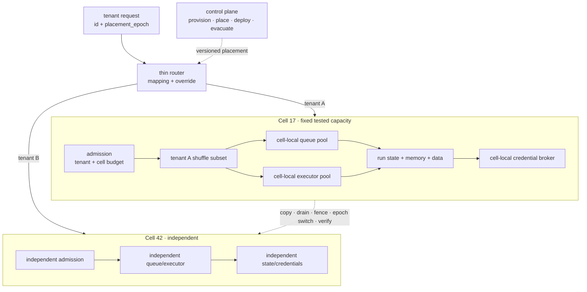

# AWS Cell Architecture + Shuffle Sharding：把失控智能体限制在可计算的故障半径内

一个租户触发 poison prompt、无界工具循环或异常上下文时，最坏结果不应是全平台模型额度、executor 和队列一起耗尽。cell architecture 先把完整工作负载切成固定容量的独立 bulkheads；shuffle sharding 再让 cell 内租户只接触共享池的一小组资源。

这两层处理不同故障。cell 拥有应用逻辑、状态、容量和恢复边界；shuffle shard 只降低共享资源的重叠。若所有 cell 仍共用一个不可分模型 quota、数据库、credential broker 或全局 retry queue，组合数学不会创造隔离。

**证据范围与依赖边界**：AWS 当前 guidance 支撑 cellular 与 shuffle-sharding 原则。`awslabs/route53-infima` 已于 **2024-06-06** 归档只读；本文只用固定提交 `cabce497698e41d610a949e8a5e4a0528170382b` 解释历史算法，不推荐把它作为新依赖，也不声称它代表 AWS 当前 Route 53 实现。

## 学习问题

1. 为什么一个 noisy 或 failing tenant 不应消耗全系统 failure budget？
2. 固定 cell 容量、薄路由与 control/data plane 分离怎样限制故障半径？
3. cell 与 shuffle shard 为什么不能互相替代或跨 cell 混用？
4. `1/C(n,k)` 说明什么，又隐藏了哪些相关故障与部分重叠？
5. 发布、过载、疏散和租户迁移如何保持状态与所有权边界？

## 一页摘要

**已证实事实**：AWS 把 cell 定义为完整、独立的 workload 实例，每个 cell 服务整体 workload 的一个子集，并不与其他 cell 共享状态。router 只把 partition key 映射到正确 cell；control plane 负责 provision、move、migrate、update、remove、deploy 与 monitor。

cell 具有固定最大容量。达到上限后新增 cell，而不是继续抬高单 cell；这样最大负载可压测，单 cell 事故范围也可估计。cell 越小，故障半径通常越小，但副本、缓冲、发布波次和运维对象更多。

shuffle sharding 在 cell 内把租户映射到 `n` 个资源中的 `k` 个。Builders’ Library 的 8 选 2 例子有 `C(8,2)=28` 个组合；普通四组二副本 sharding 只有四个隔离组。该收益依赖租户能容忍 shard 内部分资源失败。

**个人分析**：Agent 平台应同时扣减 tenant budget 与 cell budget。重试只能留在 tenant shard 内，不能因“必须完成目标”逃到全 fleet；达到水位后，系统先拒绝或降级新工作，保留查询、取消和事故控制容量。

| 边界 | 隔离对象 | noisy tenant 最多消耗 | 仍需单独保证 |
| --- | --- | --- | --- |
| cell | 应用、状态、队列、执行、凭证与容量 | 一个固定、已压测 cell 的预算 | 薄路由、发布、备份、恢复 |
| tenant | quota、公平性、授权与审计 | 自身预算和 cell 内小资源组合 | 身份、数据 ACL、幂等 |
| run | 模型、工具、deadline 与副作用 | 一次 run 的显式预算 | 状态机、fencing、补偿 |
| shuffle shard | cell 内 worker/queue/slot 重叠 | k 个候选的容量 | 健康检查、部分失败容忍 |

结论不是“组合越多越安全”，而是把失败预算逐层封闭，并确保最宽的共享依赖也被纳入边界。

## 事实边界

**已证实事实**：cell router 是跨 cell 的共享层，因此应薄、简单、可横向扩展。control plane 管理 cell 生命周期和放置；static stability 要求控制面故障时，router 与 cell 数据面依靠已发布状态继续服务已有资源。

**已证实事实**：AWS 建议为所有映射方案保留 override table，以隔离特别重、受攻击或有合规要求的 partition key。发布应逐 cell 或小组 cell 推进，首个 cell 可作 canary；发现异常就停止后续波次并回滚。

**已证实事实**：AWS FAQ 区分 cell 与 shuffle sharding。cell 自包含且不共享状态；shuffle shard 可用在一个 cell 内，不应跨 cell 选 endpoint，尤其不能以此拆散有状态组件。

**已证实事实**：均匀、独立、无重复的 k 元集合完整重叠概率为 `1/C(n,k)`；恰好重叠 j 个的概率为 `C(k,j)C(n-k,k-j)/C(n,k)`。这不是总体故障率或可用性承诺。

**基于证据的推断**：固定容量必须由 admission control 执行。水位超限后仍接纳 tenant，或让 run 无界重试，只会把“cell capacity”变成 dashboard 注释。

**个人分析**：动态模型推理不能修改 cell 上限、placement、credential scope 或 evacuation gate。容量与放置是确定性控制面协议；模型只能在 cell 内已批准的预算和资源集合中执行。

  
证据：当前 AWS guidance、历史源码与失效来源

  - **当前依据：** AWS Well-Architected cellular guidance、AWS Solutions reference architecture、Builders’ Library 与 Architecture Blog。
  - **历史源码：** `awslabs/route53-infima@cabce497698e41d610a949e8a5e4a0528170382b`，提交日期 2020-10-20。
  - **归档状态：** GitHub 记录该仓库于 2024-06-06 archived/read-only；最后提交早于归档近四年。
  - **失效来源：** 任务给定的 Prescriptive Guidance URL 在 2026-07-22 返回 HTTP 404；本文保留 URL 作来源状态记录，不从失效页面造事实。
  - **时间边界：** 访问与分析日期为 2026-07-22。
  - **证明边界：** 归档源码只解释公开历史思路，不是受维护依赖，也不能证明 AWS 当前内部实现。

## 架构图

先看 noisy tenant 的资源路径。请求只进入一个 cell；cell admission 同时检查 tenant 与 cell 预算；shuffle placement 只从该 cell 的 pool 选择候选。控制面可以发布新 placement，但已有请求不应每次同步依赖控制面。

图中没有从 Cell 17 的 shuffle subset 指向 Cell 42。若重试可逃到其他 cell，poison work 会再次共享全系统 failure budget，cell 边界也就失效。

## 控制权与任务流

**说明性场景**：tenant A 的 prompt 让工具调用持续失败并重试。请求先由 router 稳定映射到 Cell 17；cell admission 同时扣减 tenant A 的模型/工具/写入预算和 Cell 17 的总预算，再允许 run 进入该 tenant 的 queue/executor subset。

当 subset 中一个 endpoint 失败，重试只在剩余候选内发生，并受 deadline、jitter 与 retry budget 限制。tenant A 耗尽自身预算后进入拒绝、降级或人工终态；Cell 17 达到软水位后停止低优先级新 run，但保留状态查询、取消和事故通道。Cell 42 不为 A 借额度或执行资源。

该场景只组合了文档支持的 cell、fixed capacity 与 shuffle-sharding 机制，不是生产事故。它表达的架构判断是：noisy tenant 的 failure budget 必须先被 tenant boundary 截断，再被 cell boundary 截断。

租户创建属于控制面。它读取每个 cell 的 `admission_state`、安全水位、版本、地域/合规标签与 tenant profile，写 `{tenant_id, cell_id, placement_epoch}`。控制面短时不可用时，已有 placement 继续工作；新 tenant 暂停注册，不随机进入默认 cell。

router 只验证身份、解析 partition key、查询/计算 cell 并附加 epoch。cell 在关键写入核对自己仍拥有 tenant epoch；过期请求被拒绝、重定向或转为只读对账，不能让迁移两侧同时写。

cell 内分配器以 canonical tenant ID、算法版本与 pool epoch 计算 k 个候选。queue dispatcher 和 executor scheduler 都只能使用相应 subset。run state、memory、data 与 credential broker 仍保持 cell-local。

  
证据：cell admission、placement 与副作用合同字段

  - **Admission budget：** `max_model_requests`、`max_tokens`、`max_tool_calls`、`max_external_writes`、`max_queue_age`、`deadline` 与并发数必须由确定性 admission 原子扣减。
  - **Placement：** `tenant_id`、`cell_id`、`placement_epoch` 与 `admission_state` 共同说明请求应去哪里，以及当前 cell 是否仍有接纳权。
  - **副作用：** `run_id`、`operation_id` 与 `placement_epoch` 要随外部写传递，并由目标端结合幂等或 fencing 语义校验。
  - **边界：** 这些字段把预算与迁移写成运行合同；模型不能修改字段上限，也不能把耗尽的预算换名后继续使用。

发布使用同一不可变 artifact，先到 synthetic/canary cell，再逐小组扩散。每波有 bake time 和自动 stop condition；异常只回滚已触达 cells。schema 要保持前后兼容，直到回滚窗口关闭。

疏散先把源 cell 标记为 `DRAINING`，停止新 tenant/run，并为目标预留最坏负载 headroom。复制 state 后排空或 fence 旧执行者，提升 placement epoch、切流、验证，再保留 tombstone。只有路由切换而没有 state/fence，不是迁移。

## 关键源码导读

这里只阅读 Infima 的历史固定提交，用来辨认三类设计：共享故障维度、stateless 概率放置、stateful 最大 overlap 搜索。它们不构成新系统的依赖选型。

**已证实事实**：`Lattice` 描述 AZ、软件版本和底层数据存储等故障维度。`SimpleSignatureShuffleSharder` 以 identifier 与 seed 进行概率哈希；`StatefulSearchingShuffleSharder` 通过外部 `FragmentStore` 记录片段并回溯，无法满足 `maximumOverlap` 时拒绝分配。

**个人分析**：固定 stateless 代码用 MD5 派生 `java.util.Random` seed。现代实现至少应使用明确的 keyed hash/PRF、canonical identifier、secret rotation、algorithm/pool epoch 与分布/相关性测试。直接复制代码会把历史示例的技术选择带入新的安全边界。

  
证据：归档 Infima 固定提交中的算法源码接缝

  - [`Lattice.java` 18–32](https://github.com/awslabs/route53-infima/blob/cabce497698e41d610a949e8a5e4a0528170382b/src/main/java/com/amazonaws/services/route53/infima/Lattice.java#L18-L32)：共享故障维度建模；不证明自动发现真实依赖。
  - [`SimpleSignatureShuffleSharder.java` 18–57](https://github.com/awslabs/route53-infima/blob/cabce497698e41d610a949e8a5e4a0528170382b/src/main/java/com/amazonaws/services/route53/infima/SimpleSignatureShuffleSharder.java#L18-L57) 与 [81–157](https://github.com/awslabs/route53-infima/blob/cabce497698e41d610a949e8a5e4a0528170382b/src/main/java/com/amazonaws/services/route53/infima/SimpleSignatureShuffleSharder.java#L81-L157)：完整重叠直觉、seed、hash 与 lattice 选取；不证明 endpoint 变化后 assignment 稳定。
  - [`StatefulSearchingShuffleSharder.java` 30–33](https://github.com/awslabs/route53-infima/blob/cabce497698e41d610a949e8a5e4a0528170382b/src/main/java/com/amazonaws/services/route53/infima/StatefulSearchingShuffleSharder.java#L30-L33)：外部 store 与 maximum overlap 契约；不证明并发分配已解决。
  - [`StatefulSearchingShuffleSharder.java` 69–124](https://github.com/awslabs/route53-infima/blob/cabce497698e41d610a949e8a5e4a0528170382b/src/main/java/com/amazonaws/services/route53/infima/StatefulSearchingShuffleSharder.java#L69-L124)：`FragmentStore` 保存 `maximumOverlap + 1` 片段；找不到合法组合时需要显式 `NoCapacity/NoShardAvailable` 结果，不能假设 store 可用性和组合耗尽已经解决。
  - [`StatefulSearchingShuffleSharder.java` 127–210](https://github.com/awslabs/route53-infima/blob/cabce497698e41d610a949e8a5e4a0528170382b/src/main/java/com/amazonaws/services/route53/infima/StatefulSearchingShuffleSharder.java#L127-L210)：递归回溯与 overlap 检查；不证明大规模 pool 有固定低延迟。
  - **依赖结论：** repository archived；这些源码是历史证据，不是当前 AWS 实现或新依赖推荐。

## 架构决策与权衡

cell 上限要由满载与故障压测共同确定。测试 executor subset 丢失、provider 限流、queue 变慢、memory 恢复与 credential broker 降级时，保留 headroom 是否仍能服务关键租户。

| 决策 | 较小 cell | 较大 cell | 判据 |
| --- | --- | --- | --- |
| 故障半径 | 受影响租户少 | 受影响租户多 | 可接受的最大受影响范围 |
| 容量缓冲 | 多份碎片化 buffer | 利用率较高 | 失去关键 subset 后仍满足 SLO |
| 可测试性 | 易达到最大负载 | 全尺寸测试昂贵 | 预生产可复现上限 |
| 运维对象 | cells 与波次更多 | 数量少、单次风险大 | 自动化能否承受规模 |
| 大租户 | dedicated cell 或拆分 | 容纳热点更容易 | 避免制造跨 cell 事务 |

shuffle shard 的 k 越小，完整重叠少，但单 endpoint 故障占 tenant 容量比例更高；k 越大，局部冗余更多，却扩大部分重叠与 poison work 传播面。k 要同时满足失去 f 个 endpoint 后仍服务，以及单租户最大并发不能压垮 k-f。

| `n, k` | `C(n,k)` | 完整重叠 | 至少共享 1 个 | 判断 |
| --- | ---: | ---: | ---: | --- |
| `8,2` | 28 | 3.5714% | 46.4286% | 完全重叠低，不代表部分重叠少 |
| `20,4` | 4,845 | 0.02064% | 62.4355% | 任意重叠仍很常见 |
| `50,4` | 230,300 | 0.000434% | 29.1424% | 仍需实测权重与相关故障 |

风险评审应报告完整、`J≥1`、`J≥k-f` 和容量加权重叠。若 endpoint 共用一个数据库或 provider account，executor 组合就不是主导故障域。

stateless keyed placement 易重算，却只能统计约束分布；stateful search 可限制已知组合 overlap，却引入 store、一致性、并发、耗尽和恢复问题。普通 tenant 可用 keyed deterministic placement，高风险 tenant 用 override 或 dedicated cell。

## 生产化分析

真正的 cell 要切断共享依赖，而不只是复制 deployment：

| 资源 | cell 级边界 | tenant/shuffle 边界 | 耗尽信号 | 禁止捷径 |
| --- | --- | --- | --- | --- |
| 模型 quota | 独立 account/project/key 或可强制子额度 | tenant token/request/cost bucket | RPM/TPM、429、费用斜率 | 不可分全局 quota |
| executor | cell-local fleet 与并发 | tenant 只进入 k 个 subset | active、queued、OOM、saturation | 失败后逃到全 fleet |
| queue | cell-local namespace 与容量 | tenant → k queues、公平调度 | depth、oldest age、DLQ | 全局 backlog 或 retry queue |
| memory/data | cell-local service/store 与恢复 | tenant namespace、ACL、epoch | IO、lag、ACL denial | 跨 cell 可写数据库 |
| credentials | cell-local broker 与 kill switch | tenant/action-scoped 短期 token | issuance、denial、revoke latency | 全局管理员 token |

每个 cell 发布机器可读 `CellCapacitySpec`：硬上限、软水位、headroom、资源单位、压测版本、降级模式和 `NoCapacity`。未知容量按不可用处理，模型不能把 token、工具调用或写入从一个预算维度折算到另一个维度。

过载时先停止新 tenant，再拒绝或降级低优先级 run，最后保留查询、取消、审批和事故通道。重试响应携带 `retry_after` 与 jitter；router 不把 cell-local `Overloaded` 自动解释为“换 cell”，否则 sticky placement、数据 locality 与隔离都会失效。

观测至少携带 `cell_id`、`cell_version`、隐私处理后的 `tenant_id`、`placement_epoch`、`shard_algorithm_version`、`queue_shard_ids`、`executor_shard_ids`、`run_id` 与 budget class。先看 cell-local dashboard，再汇总 fleet；全局平均会稀释单 cell 事故。

发布闸门逐波比较 canary 与 control cells 的 success、p99、queue age、budget exhaustion、tool error、data latency、credential denial 与 tenant fairness。任何单 cell 回归都阻止下一波；回滚还要验证 schema/placement 兼容。

疏散演练覆盖 router cache stale、控制面不可用、目标容量不足、state copy 中断、旧 executor 迟到写与 credential revoke 延迟。成功必须证明无双 owner、外部副作用可对账、tombstone 生效，且目标仍有 headroom。

安全设计使用服务端 secret 的 keyed hash，避免攻击者挑 key 搜索 overlap；rotation 通过双读与迁移 epoch 完成。shuffle sharding 不替代认证、授权、输入验证、内容安全或 DDoS 防护。

**不可违反的边界**：run 不跨 cell 借 quota、executor、queue、memory、data 或 credential；retry 不逃出 tenant shard；迁移不只有路由切换；归档 Infima 不得被写成当前 AWS 实现或新依赖建议。

## 可迁移经验

### 可直接复用的机制

1. 建立固定最大容量、可满载测试、可独立运行的 cells，以新增 cell 扩展。
2. 用 tenant/workspace 等天然 grain 放置，router 只做映射，control plane 管生命周期。
3. 控制面故障时让已有 placement 静态稳定；新注册和迁移可以暂停。
4. 只在 cell 内对适合共享的 executor、queue、limiter 或 cache slot 做 shuffle sharding。
5. 用组合公式与实测共同审计完整、部分、容量加权重叠和相关故障轴。
6. 逐 cell canary、分波发布、自动停止与回滚。
7. 把 evacuation 做成复制、drain/fence、epoch 切换、验证、tombstone 和清理协议。

### 只能有限类比的部分

1. AWS 的 cell grain、账户与 Route 53 参数属于特定服务；Agent 平台需按模型、工具、数据和合规重选。
2. shuffle sharding 最适合无状态或可部分降级 worker；有状态组件仍需复制与迁移协议。
3. `1/C(n,k)` 是理想完整重叠概率，真实系统还受权重、热点、相关故障与共享下游影响。
4. per-cell model quota 取决于供应商能否强制分割；共享全局账户必须被承认为跨 cell 故障域。
5. 固定容量是确定性设施合同；动态 Agent 只能在合同内选动作。

### 不应照搬的部分

1. 不要把 shuffle sharding 当 cell architecture，也不要跨 cell 组成一个 shard。
2. 不要只隔离 executor，却共享全局 queue、数据库、memory、credential broker 或模型 quota。
3. 不要用 fleet 平均指标替代 cell-local telemetry 和水位。
4. 不要在过载时把 sticky tenant 临时路由到任意 cell。
5. 不要复制 Infima 的 MD5、`java.util.Random`、回溯 store 或依赖；仓库已归档。
6. 不要用组合数量替代 per-tenant quota、授权、发布闸门与恢复演练。

## 来源

**AWS 当前官方 guidance（已证实事实）**

- [What is a cell-based architecture?](https://docs.aws.amazon.com/wellarchitected/latest/reducing-scope-of-impact-with-cell-based-architecture/what-is-a-cell-based-architecture.html)、[Why use a cell-based architecture?](https://docs.aws.amazon.com/wellarchitected/latest/reducing-scope-of-impact-with-cell-based-architecture/why-to-use-a-cell-based-architecture.html) 与 [Cell sizing](https://docs.aws.amazon.com/wellarchitected/latest/reducing-scope-of-impact-with-cell-based-architecture/cell-sizing.html)：bulkhead、partition key、独立 cell、固定最大尺寸与 scale-out。
- [Control plane and data plane](https://docs.aws.amazon.com/wellarchitected/latest/reducing-scope-of-impact-with-cell-based-architecture/control-plane-and-data-plane.html)、[Cell routing](https://docs.aws.amazon.com/wellarchitected/latest/reducing-scope-of-impact-with-cell-based-architecture/cell-routing.html)：管理动作、static stability 与薄 router。
- [Mapping warning](https://docs.aws.amazon.com/wellarchitected/latest/reducing-scope-of-impact-with-cell-based-architecture/a-warning-for-all-mapping-approaches.html)、[Migration](https://docs.aws.amazon.com/wellarchitected/latest/reducing-scope-of-impact-with-cell-based-architecture/cell-migration.html)、[Deployment](https://docs.aws.amazon.com/wellarchitected/latest/reducing-scope-of-impact-with-cell-based-architecture/cell-deployment.html)、[Observability](https://docs.aws.amazon.com/wellarchitected/latest/reducing-scope-of-impact-with-cell-based-architecture/cell-observability.html)：override、迁移、逐 cell 发布与 telemetry。
- [FAQ: What about shuffle-sharding?](https://docs.aws.amazon.com/wellarchitected/latest/reducing-scope-of-impact-with-cell-based-architecture/faq.html)：cell 与 shuffle sharding 的差异及 cell 内使用边界。
- [Guidance for Cell-Based Architecture on AWS](https://docs.aws.amazon.com/solutions/cell-based-architecture-on-aws/)：固定独立 cell、user mapping、每 cell 监控、canary 与 rebalancer。
- 旧 [Prescriptive Guidance URL](https://docs.aws.amazon.com/prescriptive-guidance/latest/cell-based-architecture/welcome.html) 于 2026-07-22 返回 HTTP 404；本文保留该状态，不从页面推导事实。

**Builders’ Library 与 Architecture Blog（已证实事实）**

- [Workload isolation using shuffle-sharding](https://aws.amazon.com/builders-library/workload-isolation-using-shuffle-sharding/)：普通 shard、8 选 2 的 28 个组合、partial-failure tolerance 与 Route 53 2048 选 4 案例；原 URL 当前重定向至 Builder Center，[官方 PDF](https://d1.awsstatic.com/builderslibrary/pdfs/workload-isolation-using-shuffle-sharding.pdf) 保留快照。
- [Shuffle Sharding: Massive and Magical Fault Isolation](https://aws.amazon.com/blogs/architecture/shuffle-sharding-massive-and-magical-fault-isolation/)（2014-04-14）：stateless/stateful shuffle sharding 与 fault dimensions。本文采用 `C(n,k)`，不沿用早期博客对 8 选 2 写出的 56。

**归档源码（历史证据，不是推荐依赖）**

- [`awslabs/route53-infima@cabce497698e41d610a949e8a5e4a0528170382b`](https://github.com/awslabs/route53-infima/tree/cabce497698e41d610a949e8a5e4a0528170382b)：固定 master，提交于 2020-10-20；2024-06-06 archived/read-only。
- [`Lattice.java`](https://github.com/awslabs/route53-infima/blob/cabce497698e41d610a949e8a5e4a0528170382b/src/main/java/com/amazonaws/services/route53/infima/Lattice.java)、[`SimpleSignatureShuffleSharder.java`](https://github.com/awslabs/route53-infima/blob/cabce497698e41d610a949e8a5e4a0528170382b/src/main/java/com/amazonaws/services/route53/infima/SimpleSignatureShuffleSharder.java) 与 [`StatefulSearchingShuffleSharder.java`](https://github.com/awslabs/route53-infima/blob/cabce497698e41d610a949e8a5e4a0528170382b/src/main/java/com/amazonaws/services/route53/infima/StatefulSearchingShuffleSharder.java)：fault lattice、概率哈希、fragment store、maximum overlap 与组合耗尽路径。

**证据边界说明**：访问与截断日期为 **2026-07-22**。shuffle sharding 只降低指定共享资源的重叠风险，不提供 cell 独立、数据授权、配额、发布控制或副作用恢复的完整保证。
