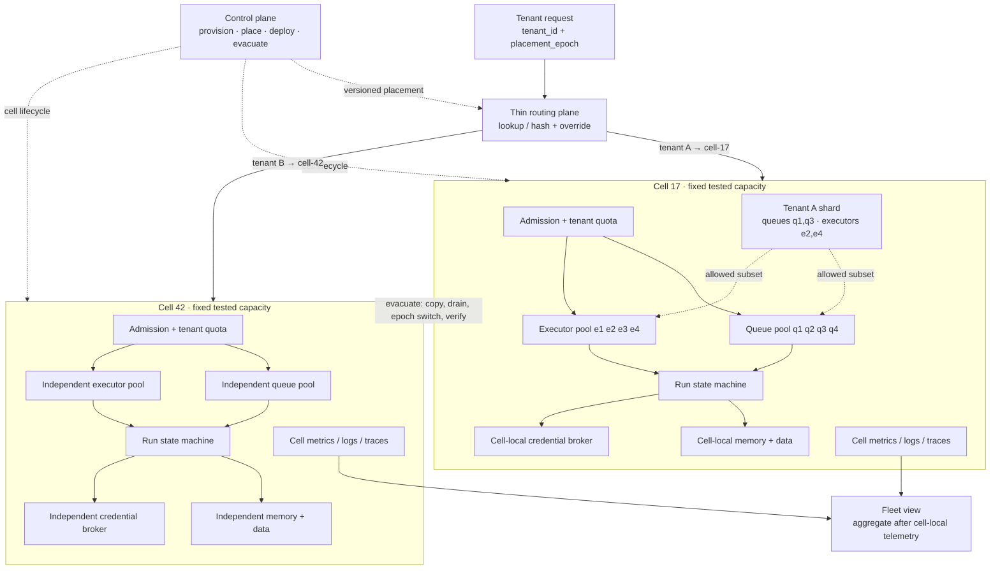

# AWS Cell Architecture + Shuffle Sharding：把失控智能体限制在可计算的故障半径内

多租户 Agent 平台最危险的扩展方式，是让所有租户共享同一组模型额度、executor、队列、长期记忆、业务数据和工具凭证，再把“每租户限流”当作完整隔离。一条 poison prompt、一次无界工具循环、一份异常大的上下文或一个错误发布，都可能沿共享依赖扩散。AWS 的 cell architecture 提供第一层边界：把完整工作负载复制成固定最大容量、互不共享状态的 cell，并用很薄的路由层把 partition key 稳定映射到 cell。shuffle sharding 提供第二层边界：在一个 cell 内，让租户只接触资源池的一个小组合，以降低 noisy neighbor 与 poison workload 完全重叠的概率。

这两层不能互相替代。cell 是拥有应用逻辑与状态的 bulkhead；shuffle shard 是共享资源池内的组合分配。AWS 当前 FAQ 明确指出，cell 应自包含且不跨 cell 共享状态，shuffle sharding 可以用在 cell 内，但跨 cell 使用会破坏 cell 定义。本文因此把“cell 级硬边界、cell 内组合隔离、租户级策略边界”分别设计，也明确否认 shuffle sharding 单独提供数据、权限、容量、发布和恢复的全部隔离。

> **历史实现边界**：`awslabs/route53-infima` 已于 **2024-06-06** 被仓库所有者归档并设为只读；本文只用固定提交 `cabce497698e41d610a949e8a5e4a0528170382b` 解释 2013–2020 年间公开的 Lattice 与两种 shuffle sharder 思路。它不是推荐依赖，也不能证明 AWS 当前 Route 53 的内部实现。生产系统应自行实现并验证适合自身威胁模型、哈希、放置、并发与迁移语义的分配器。

## 学习问题

1. 为什么 cell 必须有固定最大容量，为什么“每个 cell 内继续无限扩容”会失去可测试的故障半径？
2. 路由面、数据面和控制面各自拥有什么状态，控制面故障时已有租户为什么仍应能继续请求？
3. tenant、workspace、agent run、resource 哪个适合作 partition key，跨 cell 交互如何侵蚀 bulkhead？
4. 普通 sharding 与 shuffle sharding 分别把租户映射到什么资源集合，重叠概率怎样计算？
5. 为什么 `1 / C(n, k)` 只表示两个均匀独立 k 元集合完全重叠的概率，而不是总体故障概率或可用性承诺？
6. 模型 quota、executor、queue、memory、data 与 tool credentials 应在哪些边界分开，哪些只能共享后做二级隔离？
7. 如何逐 cell 发布、停止扩散、回滚、排空与迁移租户，同时防止双写、旧路由和在途工具调用？
8. cell-aware observability 如何同时回答“哪个 cell 坏了”“哪些租户重叠”“哪种资源先耗尽”和“是否仍能安全疏散”？

## 一页摘要

**已证实事实**：AWS 当前 cellular guidance 把 cell 定义为完整、独立的工作负载实例；每个 cell 处理整体 workload 的一个子集，不与其他 cell 共享状态。partition key 应贴合服务天然可分割的粒度，cell router 只负责把请求送到正确 cell，control plane 则负责 provision、move、migrate、update、remove、deploy 与 monitor cell。

**已证实事实**：cell 不是任意大小的逻辑标签。AWS 建议给 cell 设置固定最大尺寸，在达到上限后通过增加 cell 横向扩展。固定尺寸使最大规模可压测、配额与隐藏争用点可发现、单 cell 故障影响可估计。cell 越小，故障半径通常越小，但副本、空闲缓冲、发布与运维对象越多；cell 越大，利用率和运维数量更好，却放大单次事故并更接近账户、Region 或服务配额悬崖。

**已证实事实**：AWS Builders’ Library 用 8 个 worker、每租户选 2 个的例子说明，普通 4 个二副本 shard 只产生 4 个隔离组，而二元组合有 `C(8,2)=28` 个 virtual shard。其他租户即使共享一个受损 worker，只要客户端或调度方能在自己的 shard 内绕过部分失败，仍可使用另一个 worker。Route 53 案例描述 2048 个 virtual name server、每域名 4 个，并控制任意两个域名最多共享两个。

**基于证据的推断**：Agent 平台应先按 tenant/workspace 把状态与执行放进一个 cell，再在该 cell 内分别对 executor、queue 或模型并发 slot 做 shuffle sharding。数据与工具凭证不能因为计算资源做了 shuffle shard 就继续全局共享；它们需要独立访问控制、存储分区、加密密钥或账户边界。否则一个错误 credential broker、全局向量索引或共享 quota manager 仍能跨越所有组合。

**个人分析**：最小安全单元应是“可以单独停止接收新任务、保持已有状态可读、排空在途动作、测量剩余容量、回滚版本并迁移租户”的 cell。动态 Agent 推理只决定 cell 内经过策略批准的任务步骤；它不能决定增加 cell 上限、重写租户放置、借用其他 cell 凭证或绕过 evacuation gate。容量与放置是确定性控制面协议，不是给模型自由推理的提示词。

| 层级 | 主要故障 | 必要隔离 | shuffle sharding 能补充什么 | 仍需单独保证什么 |
| --- | --- | --- | --- | --- |
| cell | 坏发布、存储损坏、账户/Region 配额、全 cell 过载 | 完整应用、状态与容量的 bulkhead | 只宜在 cell 内降低共享 worker 重叠 | cell 独立、固定上限、路由、发布、备份与恢复 |
| tenant | poison prompt、循环调用、突发流量、超大上下文 | quota、队列、公平性与授权策略 | 把租户限制在少量 executor/queue/slot 组合 | per-tenant budget、身份、数据 ACL、幂等与审计 |
| run | 非确定推理、重试风暴、工具超时 | deadline、attempt、token/tool/write budget | 可减少同一租户多 run 对全池扩散 | 状态机、fencing、补偿、审批与终止协议 |
| resource | GPU、队列、cache、rate limiter 争用 | 明确 pool 与容量计数 | 组合分配降低完全共毁概率 | 健康检查、部分失败容忍、背压与过载拒绝 |

## 事实边界

**已证实事实**

- AWS 把 bulkhead 类比为船舶水密隔舱：fault isolation boundary 把失败限制在有限组件内。cell 是完整 workload 的独立实例；理想情况下不知道其他 cell、不共享数据库、对象存储或跨 cell API，甚至建议以不同 AWS account 增强边界。
- cell router 是跨 cell 的共享层，因此应尽可能薄、简单、水平可扩展，只保留 partition key → cell 的映射与请求分发。复杂业务逻辑放进 router 会把新的多 cell 故障域移到入口。
- control plane 承担 cell 创建、删除、迁移、更新、部署和监控等管理动作；router 与 cell 数据面承担已有请求。AWS 的 static stability 建议是：控制面失效时，数据面保留已下发状态并继续服务已有资源。
- 每个 cell 有固定最大容量；超过单 cell 尺寸后增加 cell。容量不是单一 CPU 百分比，而应按服务 grain 定义，例如 TPS、tenant 数、存储量、网络吞吐、队列长度或其他可压测上限。
- tenant placement 可以是全量映射、范围/前缀、取模或一致性哈希。AWS 对所有映射方式都建议保留 override table，以支持测试、隔离和特别重的 partition key；把新 tenant 注册到 cell 属于控制面任务。
- AWS 当前指导建议逐 cell 或逐组 cell 波次发布；第一 cell 可充当 canary。发现异常时停止后续波次并回滚，只让有限租户暴露于坏版本。观测系统必须增加 `cell_id` 维度，能按单 cell 查看并追踪每个请求去向。
- AWS 当前 FAQ 明确区分 cell 与 shuffle sharding：cell 自包含且不共享状态；shuffle sharding 可以用于一个 cell 内，但不应跨 cell 组成一个 shard，尤其是有状态组件更难处理。
- shuffle sharding 将每个 identifier 分到 `n` 个资源中的 `k` 个。若所有 k 元子集等可能且两个租户独立分配，完整重叠概率是 `1 / C(n,k)`；恰好重叠 `j` 个的概率是 `C(k,j) × C(n-k,k-j) / C(n,k)`。
- Builders’ Library 的隔离效果依赖请求方能容忍部分 worker 失败，例如经过测试的短超时、重试或健康路由。若一次请求必须同时得到 shard 内全部 worker 的成功，部分重叠也可能直接传播故障。
- 固定 Infima 提交公开了两条历史路径：`SimpleSignatureShuffleSharder` 以 identifier 与 seed 做概率哈希；`StatefulSearchingShuffleSharder` 借助外部 `FragmentStore` 记录片段并回溯搜索，拒绝超过 `maximumOverlap` 的新组合。Lattice 则描述 AZ、软件版本、底层数据存储等共享故障维度。
- GitHub 仓库页面记录 Infima 于 2024-06-06 归档为只读；master 当前固定为 `cabce497698e41d610a949e8a5e4a0528170382b`，该提交日期为 2020-10-20。因此它是历史公开证据，不是当前受维护组件。

**基于证据的推断**

- 固定容量必须用 admission control 执行。若 cell 达到安全水位后仍接受新 tenant 或允许 run 无界增长，只在 dashboard 上标一条“capacity exceeded”，则 fixed-capacity 只是文档，不是边界。
- cell 路由状态需要版本与缓存。请求携带 `tenant_id`，router 返回 `cell_id`、endpoint 与 `placement_epoch`；cell 在关键写入时校验 epoch，可防止迁移后旧路由继续写旧 cell。只改 DNS 或映射表不能 fence 已在途执行。
- shuffle shard 的 pool 应由同一故障等级、相近容量且经过健康检查的资源组成。若不同 endpoint 实际共享同一个全局 queue、数据库连接池、凭证代理或模型账户额度，组合数量会夸大真实独立性。
- stateful overlap search 可限制已知组合间最大交集，但它引入强状态、并发分配和耗尽问题；stateless hashing 易重算，却只提供概率分布。二者都需要版本化算法、稳定 canonical key、扩容迁移计划和分布测试。
- cell evacuation 是业务迁移，不是把流量瞬间指向另一个 cell。必须复制或重建 tenant state、冻结或双重校验写入、排空旧 run、更新 placement epoch、验证新 cell、切流，再保留旧 cell 的拒绝/重定向墓碑。

**个人分析与未知项**

- AWS 公开资料描述架构原则和 Route 53 案例，但没有给出适用于任意 Agent 平台的 cell 尺寸、tenant key、模型配额合同、memory schema 或工具授权协议；这些必须由平台按实际负载测定。
- `1 / C(n,k)` 不是“任意两个租户同时受影响”的通用概率。它只对应均匀、独立、无重复的 k 元集合完全相同；热点放置、权重、资源相关故障、恶意选择、共享下游和部分重叠的性能退化都会改变结果。
- 公开材料不能证明 AWS 当前 Route 53 使用 Infima 的 Java 类、MD5 选择、`java.util.Random` 或相同参数。本文不会把归档源码反推成当前 AWS 实现。
- 来源访问与分析日期为 **2026-07-22**。任务指定的旧 Prescriptive Guidance URL 此时返回 HTTP 404；本文保留该 URL 作为来源状态记录，并以 AWS 当前 Well-Architected cellular guidance 与 AWS Solutions reference architecture 承接事实。

## 架构图

下图把硬 cell、薄路由/控制面以及 cell 内 shuffle-sharded 资源分开。虚线迁移路径由控制面发起，但已有任务的数据面不应在每个请求上依赖控制面在线。

文字等价描述：请求携带 tenant identity 与可选 placement epoch。薄 router 只做稳定映射或 override lookup，把一个 tenant 送到一个 cell。每个 cell 有独立 admission、queue、executor、run state、memory/data、credential broker 与观测栈，并以压测得到的上限拒绝超额工作。tenant A 在 cell 17 内还会被映射到 queue 与 executor 的小组合；该组合不包含 cell 42 的资源。控制面异步创建 cell、更新放置、逐 cell 发布和迁移。疏散需要复制状态、排空、提升 epoch、切换与验证，不能只改变入口箭头。

## 控制权与任务流

**租户创建。** 控制面读取每个 cell 的 `admission_state`、安全水位、版本、Region/合规标签和 tenant profile，选择仍有足够 headroom 的 cell，写入 `{tenant_id, cell_id, placement_epoch}`。如果使用 hash/range 映射，override table 仍可把超大或被攻击 tenant 放进 quarantine/dedicated cell。router 消费已发布的 placement snapshot；控制面短时不可用时，已有映射继续工作，新 tenant 暂停注册，而不是把所有新租户随机塞进默认 cell。

**请求路由。** router 验证身份后只解析 partition key、查询/计算 cell、附加 `cell_id` 与 epoch、转发请求。它不规划 Agent、不读取 conversation、不调用模型，也不根据模型文本临时改变 cell。cell 在入口核对自己仍拥有该 tenant epoch；过期请求被重定向、拒绝或进入只读对账，不允许双边继续写。

**cell 内 admission。** cell 先原子扣减 tenant budget 与 cell budget，再创建 run。预算至少覆盖 `max_model_requests`、`max_tokens`、`max_tool_calls`、`max_external_writes`、`max_queue_age`、`deadline` 和并发数。cell 高于软水位时拒绝新 run 或降低低优先级并发；超过硬水位时停止接纳新 tenant。Agent 自己不能通过“任务很重要”修改这些计数。

**shuffle placement。** 对适合共享的 pool，分配器用稳定 `tenant_id`、算法版本与 pool epoch 得到 k 个候选。queue dispatcher 只把该 tenant 的任务放入候选 queues，executor scheduler 也只从对应 subset 取数。partial failure 时，重试只能在 tenant shard 内换 endpoint，并受 deadline、jitter 和 retry budget 约束，不能逃逸到整个 pool，否则 poison work 会再次级联。

**状态与工具。** run state、memory、tenant data 保持 cell-local。工具调用从 cell-local credential broker 取得 tenant-scoped、action-scoped、短期 credential，并由 policy engine 检查资源范围。请求不能携带任意 credential ID，也不能借用另一 cell 的共享管理员 token。副作用携带 `run_id`、`operation_id`、`placement_epoch` 与 idempotency/fencing 信息，迁移或人工接管后旧执行者迟到写入会被目标端拒绝。

**发布。** 构建一次不可变 artifact，先部署 synthetic/canary cell，观察 cell-local SLO、容量斜率、队列年龄、工具错误、模型预算和跨租户公平性。通过后逐小组 cell 扩散，每波设 bake time 与自动 stop condition。坏版本只回滚已触达 cells；禁止“一边滚全 fleet，一边等待全局指标显著变化”。schema 变更要保持前后版本兼容，直到所有 cell 完成且回滚窗口关闭。

**疏散。** 先把源 cell 标为 `DRAINING` 并停止新 tenant/run，再为目标 cell 预留最坏负载 headroom。复制 durable state 后冻结 tenant 写入，等待在途安全点或通过 fencing epoch 淘汰旧 owner；验证数据与权限，再原子提升 placement epoch 并更新路由。旧 cell 保留 tombstone/redirect 与审计期，确认无旧写后才清理。若工具副作用无法 fence，必须先对账或人工处理，不能自动宣布迁移完成。

## 关键源码导读

本节只阅读归档 Infima 的固定提交，以识别算法思想与实现边界，不把它作为依赖建议。

| 固定源码 | 可观察机制 | 对 Agent 平台的启发 | 不能据此声称 |
| --- | --- | --- | --- |
| [`Lattice.java` 18–32](https://github.com/awslabs/route53-infima/blob/cabce497698e41d610a949e8a5e4a0528170382b/src/main/java/com/amazonaws/services/route53/infima/Lattice.java#L18-L32) | 以 AZ 等共享依赖维度描述 endpoint compartment，并模拟某维失败 | pool catalog 不能只列实例 ID，还要列 AZ、软件版本、模型 provider/account、queue cluster、数据存储和 credential broker 等相关故障轴 | Lattice 自动发现真实依赖或替代故障演练 |
| [`SimpleSignatureShuffleSharder.java` 18–57](https://github.com/awslabs/route53-infima/blob/cabce497698e41d610a949e8a5e4a0528170382b/src/main/java/com/amazonaws/services/route53/infima/SimpleSignatureShuffleSharder.java#L18-L57) | 描述 `1 / C(N,K)` 完全重叠直觉、部分失败容忍前提与 per-application seed | stateless placement 应稳定、可重算、带域隔离 seed 与算法版本 | 该概率等于端到端可用性；固定代码的 MD5/Random 适合当前安全设计 |
| [`SimpleSignatureShuffleSharder.java` 81–157](https://github.com/awslabs/route53-infima/blob/cabce497698e41d610a949e8a5e4a0528170382b/src/main/java/com/amazonaws/services/route53/infima/SimpleSignatureShuffleSharder.java#L81-L157) | hash identifier 后在各维度洗牌并从 lattice sector 选 endpoint | 分配算法需保证故障维度分散，并对 pool 变化做确定性迁移测试 | endpoint 增减时旧 tenant assignment 自动保持稳定 |
| [`StatefulSearchingShuffleSharder.java` 30–33](https://github.com/awslabs/route53-infima/blob/cabce497698e41d610a949e8a5e4a0528170382b/src/main/java/com/amazonaws/services/route53/infima/StatefulSearchingShuffleSharder.java#L30-L33) | 外部 datastore 记录既有 shard，约束新 shard 最大 overlap | 高价值 tenant 可用有状态 placement 给出显式 overlap 上限 | store 一致性、并发分配和可用组合耗尽已被解决 |
| [`StatefulSearchingShuffleSharder.java` 69–124](https://github.com/awslabs/route53-infima/blob/cabce497698e41d610a949e8a5e4a0528170382b/src/main/java/com/amazonaws/services/route53/infima/StatefulSearchingShuffleSharder.java#L69-L124) | `FragmentStore` 保存 `maximumOverlap + 1` 片段；无合法组合时抛异常 | placement 是可能失败的有界资源分配，API 必须有 `NoCapacity/NoShardAvailable` 结果 | 任意 tenant 数都能满足固定 overlap 约束 |
| [`StatefulSearchingShuffleSharder.java` 127–210](https://github.com/awslabs/route53-infima/blob/cabce497698e41d610a949e8a5e4a0528170382b/src/main/java/com/amazonaws/services/route53/infima/StatefulSearchingShuffleSharder.java#L127-L210) | 递归回溯枚举 cell/endpoint 组合并检查碰撞片段 | 严格 overlap 约束可能有高分配成本，应离线/控制面执行，不进入请求热路径 | 搜索在大规模 pool 上有固定低延迟 |

**已证实事实**：固定代码的 stateless 实现使用 MD5 派生 `java.util.Random` seed；仓库最后提交早于归档近四年。**个人分析**：现代实现至少要使用明确的 keyed hash/PRF、规范化 identifier、防选择碰撞的 secret rotation、算法/pool epoch、分布与相关性测试，并记录每次 placement 的可解释证据。直接复制归档代码会把历史示例的技术选择带入新的安全边界。

## 架构决策与权衡

**cell 大小。** 容量上限应由满载压测与故障压测共同给出，不是平均利用率推算。测试在一个 executor subset 丢失、模型 provider 限流、queue partition 变慢、memory store 恢复和 credential broker 降级时，cell 是否仍能在保留 headroom 内服务关键租户。建议把新 tenant 停止水位设在硬上限之前，给疏散、重试与控制面故障留下静态缓冲。

| 决策 | 小 cell | 大 cell | 推荐判据 |
| --- | --- | --- | --- |
| 故障半径 | 单 cell 影响租户少 | 单 cell 影响租户多 | 以可接受最大受影响 tenant/收入/任务数设上限 |
| 容量缓冲 | 多份碎片化 buffer | 共享 buffer 利用率高 | 在失去一个关键 subset 后仍满足关键 SLO |
| 可测试性 | 容易推到最大负载 | 全尺寸测试昂贵或不可达 | CI/预生产必须能复现最大 cell |
| 运维对象 | cells、dashboard、发布波次更多 | 数量少、单次操作风险大 | 自动化必须先于扩展 cell 数量 |
| 大租户适配 | 可能需要 dedicated cell 或拆分 | 更容易容纳热点 tenant | partition grain 不能制造大量跨 cell 事务 |

**放置算法。** full mapping 最灵活并支持精确迁移，但读写映射表成为关键依赖；hash/range 简单且易缓存，却在 pool 改变时需要稳定迁移策略。生产方案可用 consistent/stable hashing 生成默认 cell，加 versioned override 处理热点、合规和隔离。任何方案都要测试新旧 router 并存、cache stale、mapping publish 失败和 rollback。

**shuffle shard 尺寸。** k 越小，完整重叠概率越低、tenant 可触达资源越少，但单 endpoint 故障占 tenant 容量的比例越高；k 越大，局部冗余和突发吞吐越好，却让每个 tenant 接触更多 pool，增加部分重叠、成本与 poison work 扩散面。k 必须同时满足“允许失去 f 个 endpoint 后仍服务”和“单租户最大合法并发不能压垮 k-f 个 endpoint”。

| `n` 个资源、每租户 `k` 个 | 组合数 `C(n,k)` | 两租户完整重叠概率 | 两租户至少共享 1 个概率 | 解释 |
| --- | ---: | ---: | ---: | --- |
| `8, 2` | 28 | 3.5714% | 46.4286% | Builders’ Library 小例子；共享一个很常见，容忍部分失败是关键 |
| `20, 4` | 4,845 | 0.02064% | 62.4355% | 完全重叠很低，但“有任何重叠”并不低 |
| `50, 4` | 230,300 | 0.000434% | 29.1424% | 组合空间大；仍需验证实际 weighted placement 与共享下游 |

上述概率使用 `P(J=j)=C(k,j)C(n-k,k-j)/C(n,k)`。**个人分析**：风险评审应至少同时报告完整重叠、`J≥1`、`J≥k-f` 和容量加权重叠，而不是只展示最漂亮的 `1/C(n,k)`。若一次故障能击穿整个 cell 的共享数据库，那么 executor overlap 表不再是主导风险。

**stateless 还是 stateful。** stateless 分配没有 placement store 热依赖，适合大量普通 tenant，但只能以统计检验约束分布；stateful search 可对已分配 tenant 保证最大 overlap，适合少量高价值/高风险 tenant，却需要串行化或事务化分配、容量耗尽处理、备份与恢复。两者可以分层：默认 tenant 用 keyed deterministic placement，高风险 tenant 用显式 override/dedicated cell，而非把全量 tenant 都放进昂贵回溯搜索。

## 生产化分析

**六类边界映射。** cell 的目标不是把一个 deployment 复制多份，而是阻断实际共享依赖。下面每一行都必须回答“一个 tenant 失控时最多消耗什么”“一个 cell 失效时其他 cell 还依赖什么”。

| Agent 资源 | cell 级硬边界 | tenant/shuffle 边界 | 必须监控的耗尽信号 | 禁止的捷径 |
| --- | --- | --- | --- | --- |
| 模型 quota | 独立 provider account/project、API key 或可强制的 cell 子额度 | tenant token/request/cost bucket；可把租户分到 model gateway slot 组合 | RPM/TPM、429、排队时间、费用斜率、剩余额度 | 所有 cell 共用一个不可分 quota，再声称 executor 已隔离 |
| executor | cell-local fleet 与最大并发 | tenant 只进入 k 个 executor subset；run 有 deadline/fence | active/queued、OOM、crash loop、poison fingerprint、subset saturation | 失败后逃逸重试全 fleet |
| queue | cell-local broker/namespace 与容量 | tenant → k queues；per-tenant fair scheduling 和 age limit | depth、oldest age、redelivery、DLQ、partition skew | 共享一个全局 backlog 或无界 retry queue |
| memory | cell-local memory service/cache/vector namespace | tenant/workspace namespace、容量与 TTL | bytes/items、retrieval latency、index lag、cross-tenant denial | 仅靠 prompt 中的 tenant name 过滤共享索引 |
| data | cell-local database/account/schema 与备份恢复 | tenant row/partition ACL、encryption context、placement epoch | hot key、storage/IO、replica lag、ACL denial、restore proof | 跨 cell 共享可写数据库，或迁移时无 fence 双写 |
| tool credentials | cell-local broker、root of trust 与 kill switch | tenant/action-scoped short-lived token、审批与 resource allowlist | issuance/use/denial、scope、age、外部写计数、revoke latency | 全局管理员 token、模型选择 credential ID、仅在应用层隐藏密钥 |

**容量合同。** 每个 cell 发布机器可读的 `CellCapacitySpec`：硬上限、软 admission 水位、保留 headroom、每类资源测量单位、压测版本、允许降级模式和 `NoCapacity` 响应。控制面只按已验证余量放置 tenant；未知容量按不可用处理。动态模型推理不得修改 spec，也不能把 token、工具调用或外部写从一个预算维度“折算”成另一个维度继续执行。

**过载行为。** 先拒绝新 tenant，再拒绝/降级低优先级新 run，最后保持状态查询、取消、审批和事故控制通道。读路径与控制通道应预留独立 capacity。重试返回明确 `retry_after` 并带 jitter；router 不应把 cell-local `Overloaded` 自动解释为“换一个 cell”，否则 sticky placement、数据 locality 和隔离都会被破坏。

**可观测性。** metric、log、trace、audit event 至少带 `cell_id`、`cell_version`、`tenant_id`（经过隐私处理）、`placement_epoch`、`shard_algorithm_version`、`queue_shard_ids`、`executor_shard_ids`、`run_id` 与 budget class。先有 cell-local dashboard 和告警，再聚合 fleet view；仅看全局平均会把单 cell 的严重事故稀释。观测 pipeline 本身应避免成为同步共享依赖，cell 本地缓冲后异步汇总。

**发布闸门。** 每一波比较 canary 与 control cells 的 success、p99、queue age、budget exhaustion、tool error、memory/data latency、credential denial 和 tenant fairness。stop condition 是自动且版本化的；任何单 cell 显著回归都阻止下一波。回滚也逐 cell 执行，并验证 schema/placement 仍兼容，而不是只检查 deployment 状态为 green。

**疏散演练。** 定期选择一个非关键 cell，模拟 router cache stale、控制面不可用、目标 cell 容量不足、state copy 中断、旧 executor 迟到写和 credential revoke 延迟。成功条件包括：未迁移 tenant 无影响；迁移 tenant 的 RPO/RTO 达标；没有双重 owner；所有外部副作用可对账；旧 cell tombstone 生效；目标 cell 仍保有 headroom。没有演练证据就不能把 evacuation 写成恢复承诺。

**安全与滥用。** 攻击者可能选择 tenant/resource key 寻找 overlap，或制造高成本 prompt 迫使 shard 内重试。placement 应使用服务端 secret 的 keyed hash，外部不可预测；seed rotation 需要双读/迁移 epoch。每 tenant 仍要有 rate/cost/tool policy，poison signature 隔离与 quarantine cell。shuffle sharding 降低资源相遇概率，不替代认证、授权、输入验证、内容安全或 DDoS 防护。

**不可违反的边界。** 一个 Agent run 不得跨 cell 借用模型额度、executor、queue、memory、data 或 credential 来“完成目标”；一个 cell 不得因控制面短暂不可用而丢失已有 placement；一个 retry 不得逃出 tenant shard；一个迁移不得只有路由切换而没有 state/fence；一个归档库不得被描述为 AWS 当前实现或生产建议。

## 可迁移经验

### 可直接复用的机制

- 把服务拆成可独立运行、固定最大容量、可满载测试的 cell；以新增 cell 横向扩展，而不是持续抬高单 cell 上限。
- 用 tenant/workspace 等天然 grain 作为 partition key；router 只做稳定映射与转发，control plane 负责 provisioning、placement、deployment 和 migration。
- 让已有数据面在控制面故障时依靠已发布 placement 继续运行；新租户、迁移和扩容可以停，已有请求不应同步依赖管理 API。
- 对适合共享的 executor、queue、rate limiter 或 cache slot 在 cell 内做 shuffle sharding；重试留在 shard 内并验证 partial-failure tolerance。
- 用组合公式与实测分布同时审计 overlap；报告完整、部分和容量加权重叠，并把 AZ、版本、provider account、datastore 等相关故障轴纳入 placement。
- 逐 cell canary、分波发布、自动停止与回滚；观测数据带 cell、tenant、placement/shard epoch，既能单 cell 诊断也能 fleet 聚合。
- 把 evacuation 做成有状态协议：预留目标容量、停止接纳、复制、排空/fence、提升 placement epoch、切流、验证、保留 tombstone、最后清理。

### 只能有限类比的部分

- AWS 的 cell 粒度、账户边界、Route 53 DNS 和 virtual name server 参数属于特定服务；Agent 平台要按模型延迟、token、工具副作用、memory/data locality 和合规重新选择 grain。
- shuffle sharding 对无状态或可部分降级的 worker 最直接；有状态 memory、database 和长期 conversation 需要复制、一致性、归属与迁移协议，不能只重新计算一个组合。
- `1/C(n,k)` 是理想化的完整重叠概率。真实系统有权重、热点、相关故障、扩缩容、恶意 key、shared downstream 和排队非线性，必须通过仿真、故障注入和运行数据校准。
- per-cell model quota 取决于供应商是否提供可强制分割的 account/project/key 额度；如果只能共享全局账户，必须承认该依赖仍是跨 cell 故障域，并设计保留额度与外部断路器。
- 固定容量是确定性设施合同；Agent 推理是动态且非确定的业务执行。可以让模型在预算内选工具，不能让模型决定绕过 admission、改变 placement 或扩大授权。

### 不应照搬的部分

- 不要把 shuffle sharding 当成 cell architecture；不要跨多个 cell 选择 endpoint 组成一个 shard，从而重新引入跨 cell 状态与故障传播。
- 不要只隔离 executor，却继续共享一个全局 queue、数据库、memory index、credential broker 或模型 quota；隔离强度取决于最宽的共享故障域。
- 不要用全局平均指标判断 cell 健康，也不要在没有 cell-local telemetry、容量水位和 tenant overlap 视图时自动疏散。
- 不要在 cell 过载时把 sticky tenant 临时路由到任意 cell；先背压、拒绝或受控迁移，避免数据错位和 poison workload 级联。
- 不要把历史 Infima 的 MD5、`java.util.Random`、回溯 store 或 Maven 依赖直接带入新系统；仓库已归档，且公开代码不代表 AWS 当前内部实现。
- 不要宣称“组合足够多所以租户已隔离”。没有 per-tenant quota、部分失败容忍、身份授权、数据隔离、发布波次和恢复演练，组合数学只是一张漂亮的概率表。

## 来源

**AWS 官方文档与 reference architecture（已证实事实）**

- [What is a cell-based architecture?](https://docs.aws.amazon.com/wellarchitected/latest/reducing-scope-of-impact-with-cell-based-architecture/what-is-a-cell-based-architecture.html)：bulkhead、partition key、thin cell router、独立 cell 与 control plane 职责。访问与截断日期：2026-07-22。
- [Why use a cell-based architecture?](https://docs.aws.amazon.com/wellarchitected/latest/reducing-scope-of-impact-with-cell-based-architecture/why-to-use-a-cell-based-architecture.html) 与 [Cell sizing](https://docs.aws.amazon.com/wellarchitected/latest/reducing-scope-of-impact-with-cell-based-architecture/cell-sizing.html)：固定最大尺寸、scale-out、容量/配额、可测试性，以及大小 cell 的运维与故障半径权衡。访问与截断日期：2026-07-22。
- [Control plane and data plane](https://docs.aws.amazon.com/wellarchitected/latest/reducing-scope-of-impact-with-cell-based-architecture/control-plane-and-data-plane.html) 与 [Cell routing](https://docs.aws.amazon.com/wellarchitected/latest/reducing-scope-of-impact-with-cell-based-architecture/cell-routing.html)：管理动作、数据面 static stability、router 共享边界与简化要求。访问与截断日期：2026-07-22。
- [A warning for all mapping approaches](https://docs.aws.amazon.com/wellarchitected/latest/reducing-scope-of-impact-with-cell-based-architecture/a-warning-for-all-mapping-approaches.html)、[Cell migration](https://docs.aws.amazon.com/wellarchitected/latest/reducing-scope-of-impact-with-cell-based-architecture/cell-migration.html)、[Cell deployment](https://docs.aws.amazon.com/wellarchitected/latest/reducing-scope-of-impact-with-cell-based-architecture/cell-deployment.html) 与 [Cell observability](https://docs.aws.amazon.com/wellarchitected/latest/reducing-scope-of-impact-with-cell-based-architecture/cell-observability.html)：override、迁移、逐 cell 波次发布和 cell-aware telemetry。访问与截断日期：2026-07-22。
- [FAQ: What about shuffle-sharding?](https://docs.aws.amazon.com/wellarchitected/latest/reducing-scope-of-impact-with-cell-based-architecture/faq.html)：明确 cell 与 shuffle sharding 不同，并说明 shuffle sharding 可用于 cell 内、不应跨 cell。访问与截断日期：2026-07-22。
- [Guidance for Cell-Based Architecture on AWS](https://docs.aws.amazon.com/solutions/cell-based-architecture-on-aws/)：当前 AWS Solutions reference architecture 展示固定大小独立 cell、user-to-cell mapping、每 cell 监控、canary cell、自动恢复和 rebalancer。访问与截断日期：2026-07-22。
- 任务指定的 `https://docs.aws.amazon.com/prescriptive-guidance/latest/cell-based-architecture/welcome.html` 在 2026-07-22 返回 HTTP 404。本文不从失效页面伪造事实，改用上列同主题 AWS 当前官方 guidance；该状态保留用于来源可追溯性。

**AWS Builders’ Library 与 Architecture Blog（已证实事实）**

- [Workload isolation using shuffle-sharding](https://aws.amazon.com/builders-library/workload-isolation-using-shuffle-sharding/)：原 URL 当前重定向到 AWS Builder Center；文章给出普通 shard、8 选 2 的 28 个组合、partial-failure tolerance，以及 Route 53 2048 选 4 的公开案例。访问与截断日期：2026-07-22。[官方 PDF](https://d1.awsstatic.com/builderslibrary/pdfs/workload-isolation-using-shuffle-sharding.pdf) 保留文章快照。
- [Shuffle Sharding: Massive and Magical Fault Isolation](https://aws.amazon.com/blogs/architecture/shuffle-sharding-massive-and-magical-fault-isolation/)（2014-04-14）：普通 sharding、bulkhead、stateless/stateful shuffle sharding、overlap 与跨 fault dimension 选择。本文的组合数采用 Builders’ Library 与数学组合 `C(n,k)`，不沿用早期博客对 8 选 2 写出的 56。

**归档上游源码（历史证据，不是推荐依赖）**

- [`awslabs/route53-infima@cabce497698e41d610a949e8a5e4a0528170382b`](https://github.com/awslabs/route53-infima/tree/cabce497698e41d610a949e8a5e4a0528170382b)：固定 master，提交时间 2020-10-20；仓库页面记录 **2024-06-06 archived/read-only**。本文只用它解释公开历史设计，不声称它是 AWS 当前实现。
- [`Lattice.java`](https://github.com/awslabs/route53-infima/blob/cabce497698e41d610a949e8a5e4a0528170382b/src/main/java/com/amazonaws/services/route53/infima/Lattice.java)、[`SimpleSignatureShuffleSharder.java`](https://github.com/awslabs/route53-infima/blob/cabce497698e41d610a949e8a5e4a0528170382b/src/main/java/com/amazonaws/services/route53/infima/SimpleSignatureShuffleSharder.java) 与 [`StatefulSearchingShuffleSharder.java`](https://github.com/awslabs/route53-infima/blob/cabce497698e41d610a949e8a5e4a0528170382b/src/main/java/com/amazonaws/services/route53/infima/StatefulSearchingShuffleSharder.java)：fault-dimension lattice、概率哈希、外部 fragment store、最大 overlap 和组合耗尽路径。

**证据边界说明**：正文用“已证实事实”标记可由 AWS 官方页面或固定提交直接定位的陈述；“基于证据的推断”是从这些机制推导的 Agent 架构含义；“个人分析”是容量、权限、运行与迁移方面的生产建议。shuffle sharding 降低特定共享资源上的重叠风险，不提供 cell 独立、数据授权、配额执行、发布控制或副作用恢复的完整保证。
