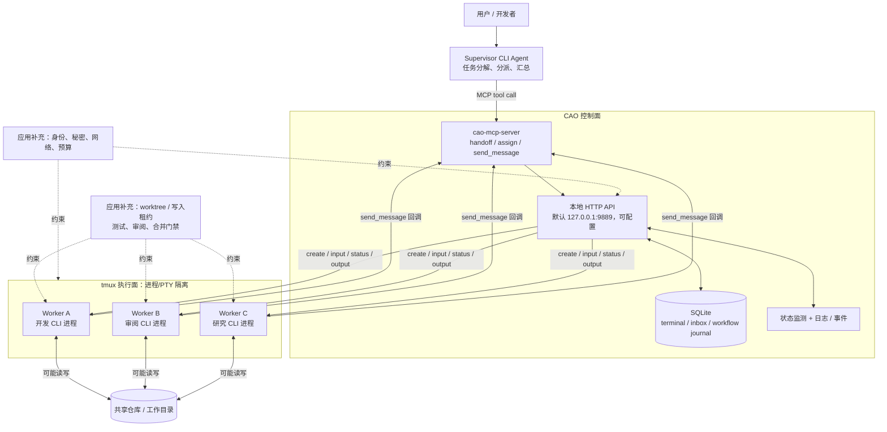
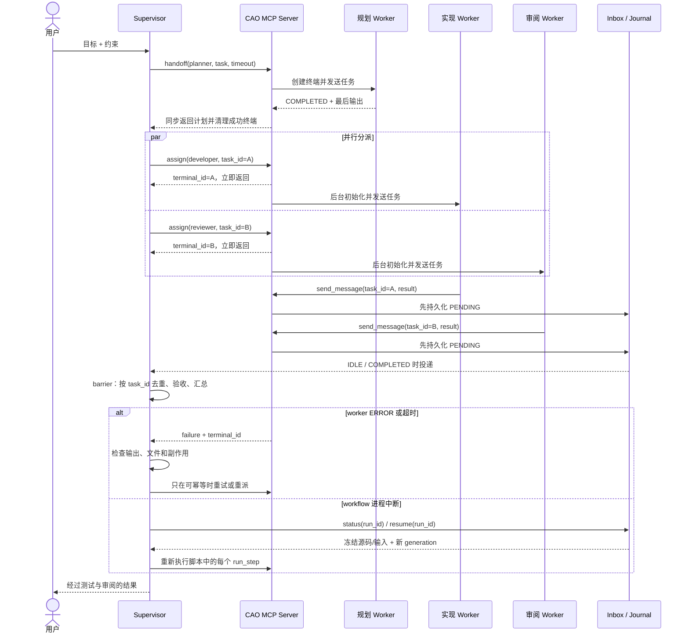

# AWS Labs CLI Agent Orchestrator：以终端为执行边界的 Supervisor–Worker 编排

CLI Agent Orchestrator（CAO）不是一个通用企业多智能体参考架构，也不是把模型 API 包成统一 Agent 接口的 SDK。它解决的是更具体的问题：怎样让已有的 AI 编程 CLI 继续作为完整进程运行，同时由一个 supervisor 通过 `handoff`、`assign` 和 `send_message` 协调多个 worker。

这个案例的价值正在于它的具体。每个 worker 都是真实 CLI、PTY 与 tmux 窗口，因而保留各 provider 的登录态、交互界面和原生能力；代价是调度器必须面对终端状态识别、消息投递、共享工作目录、进程崩溃和人工介入。本文把这些约束视为架构主体，而不是实现细节。

## 学习问题

1. CAO 的 supervisor–worker 拓扑把任务控制权、会话上下文与文件所有权分别放在哪里？
2. `handoff`、`assign` 与 `send_message` 的同步、异步和回调语义有何不同，怎样组合成串行与并行协作？
3. tmux 隔离了哪些东西，又为什么没有自动隔离文件系统、Git 工作树、凭证和外部副作用？
4. CAO 怎样借助 MCP 暴露编排原语，并在本地 HTTP、MCP client/server 与真实 CLI 进程之间转换？
5. 终端状态、超时、取消、日志快照和 workflow journal 能恢复什么，不能恢复什么？
6. 面向生产使用时，怎样补齐安全边界、并发写控制、可观测性和业务幂等？

## 一页摘要

**已证实事实**：CAO 采用分层 supervisor–worker 模式。supervisor 通过 in-session MCP server 调用 `handoff`、`assign` 和 `send_message`；服务端经本地 HTTP API 创建或操作终端，每个 agent 作为完整 CLI 进程运行在自己的 tmux 窗口中，并以 `CAO_TERMINAL_ID` 识别发送方和回调关系。

**已证实事实**：`handoff` 是阻塞式调用：创建 worker、发送任务、等待完成、提取最后输出，并在成功时清理终端。`assign` 创建 worker 后立即返回，worker 完成后用 `send_message` 回调；多个 `assign` 可形成并行 fan-out。`send_message` 面向已存在终端，通过持久化 inbox 排队，默认在接收端进入 `IDLE` 或 `COMPLETED` 后投递。

**已证实事实**：所谓“隔离”主要是独立终端、CLI 进程、上下文窗口和 PTY。worker 默认继承 supervisor 当前工作目录；即使显式传入不同目录，CAO 也没有创建容器、沙箱或 Git worktree。两个可写 worker 指向同一仓库时，仍可能同时修改同一文件、覆盖未提交变更、争用构建产物或执行重复的外部操作。

**已证实事实**：工具限制由 agent profile 的 `role` / `allowedTools` 描述，并尽量翻译到 provider 原生机制。官方文档把 Claude Code、Kiro CLI、Copilot CLI 列为硬限制，把 Codex、Kimi CLI 的系统提示约束列为软限制；`@cao-mcp-server` 还是意图标记，不能按单个 MCP tool 做 provider 级阻断，`--yolo` 会移除限制。因此 profile 不是跨 provider 等价的安全沙箱。

**已证实事实**：CAO 当前还提供 workflow script 层，以冻结脚本源码与输入、稳定 `run_id` / `step_id`、SQLite journal、generation fencing、取消和 resume 支持长流程。固定 commit 中，resume 会从冻结脚本重新启动，并重新执行其中的每个 `run_step`；`lookup_replay` 虽已存在于 journal 层，却仍是未接入 run-step 路由的保留原语。普通终端删除快照只能恢复 scrollback 到一个普通 shell，进程崩溃本身不保存快照。

**已证实事实**：CAO HTTP API 默认监听可配置的 `127.0.0.1:9889`，其 OAuth 2.1 / RFC 9728 认证默认关闭。配置 IdP 后，API 可验证 RS256 签名、issuer、audience 与 expiry；所有 mutating routes 需要 `cao:write` / `cao:admin`，`/events`、`/events/history` 等特定读端点至少需要 `cao:read`。内部 MCP → API 调用可转发 `CAO_AUTH_LOCAL_TOKEN`，但 PTY WebSocket 仍未认证，只按 loopback/client IP allowlist 限制。

**基于证据的推断**：CAO 最适合作为“可信开发机上的多 CLI 编程工作台”。它擅长把研究、实现、审阅和汇总分派给不同 CLI agent，并让人随时 attach 观察；若要进入共享服务或高风险生产环境，应启用 CAO 内建 HTTP OAuth，并在外部补齐 tenant/terminal ownership、PTY 认证、仓库写入租约、worktree/container 隔离、秘密代理、审计存储和业务幂等账本。

| 维度 | CAO 已提供 | 必须额外设计 |
| --- | --- | --- |
| 控制 | supervisor、三类原语、终端状态、workflow | 业务级任务契约、审批、优先级与公平调度 |
| 执行 | 多 provider CLI、独立 tmux 窗口、PTY | 容器/VM、资源配额、网络和凭证隔离 |
| 协作 | 同步 handoff、异步 assign、inbox 消息 | 去重回调、结果 schema、barrier 与部分失败策略 |
| 文件 | 可选择 working directory | worktree/副本、写入租约、合并与冲突处理 |
| 恢复 | 日志、终端快照、workflow journal/resume | 外部副作用去重、补偿、灾备与跨主机恢复 |
| 安全 | profile 工具限制、路径校验、启动确认、可选 OAuth scope 门禁 | tenant/terminal ownership、细粒度 MCP tool 授权、PTY 强认证 |

一句话决策：**把 CAO 用于“多个真实编程 CLI 在一台受信任机器上协作”；不要把 tmux 会话隔离误认为代码、秘密或生产资源的安全隔离。**

## 事实边界

### 已证实事实

- 官方 README 将 CAO 定义为面向 AI coding CLI 的开源多智能体编排框架，支持 Claude Code、Codex CLI、Kiro CLI 等 provider。每个 agent 是完整 CLI 进程，而非一次无状态模型 API 调用。
- CAO 的默认拓扑是一个 supervisor 委派多个专业 worker。终端由唯一八位十六进制 ID 标识，运行状态包括 `UNKNOWN`、`IDLE`、`PROCESSING`、`COMPLETED`、`WAITING_USER_ANSWER` 和 `ERROR`。
- `handoff` 阻塞等待单个 worker，默认最长等待参数为 600 秒；当前实现区分 terminal `ERROR` 与超时，并把仍存活的 terminal ID 返回给调用方检查。成功路径会提取最后一条 agent 消息并删除临时 worker。
- `assign` 走延迟初始化路径：先同步创建 tmux 窗口和数据库记录，再在后台初始化 provider 并发送首条消息，因而适合在同一 supervisor turn 中启动多个 worker。返回成功只表示任务已被接受并开始初始化，不表示业务工作完成。
- `send_message` 先把消息写入 SQLite inbox。立即投递和后台检查都经过终端状态门禁；默认只在 `IDLE` / `COMPLETED` 投递。可选 eager delivery 还要求全局开关与 provider capability 同时成立。
- worker 默认进入 supervisor 的当前工作目录；开启配置后可传 `working_directory`。路径会做 realpath 规范化并拒绝若干系统目录，但“路径允许”不是“目录只属于该 worker”。
- tmux 为每个 agent 提供独立窗口、PTY、环境和可 attach 的交互表面。仓库没有声称自动创建文件副本、Git worktree、容器、用户命名空间或网络沙箱。
- profile 可设置 `role` 和 `allowedTools`。显式 `allowedTools` 覆盖 role，`--yolo` 覆盖所有限制。不同 provider 的强制方式不同；Codex 与 Kimi CLI 当前是提示级软约束。
- 官方工具限制文档指出：MCP 编排工具目前不能按单个 tool 在 provider 层阻断；允许 `@cao-mcp-server` 也不能只开放 `send_message` 而禁止 `assign`。
- workflow script 通过独立进程调用 `cao_workflow` shim；脚本需先 validate，并用预先声明的 `run_id` 启动。并发 `run_step` 必须使用稳定显式 `step_id`，让状态、取消、generation fence 和未来 replay 集成始终指向同一业务步骤。
- workflow resume 会从 journal 中的冻结源码和冻结输入重新启动脚本，并提升 generation 以拒绝旧 runner 的迟到调用。固定 commit 的 run-step 路由没有调用 `lookup_replay`，所以已完成的 `run_step` 也会重新执行；journal 保存步骤状态、fingerprint 与输出，并不等于已经实现 step-result replay。
- 固定 commit 的 `docs/workflows.md` 仍宣称 resume 会回放已完成步骤，只重跑剩余步骤；这与同 commit 的 `workflow_journal.py`、`script_runner.py` 实现和注释不一致。本文以源码实现为事实边界，把文档表述视为版本内漂移。
- HTTP API 默认绑定 `127.0.0.1:9889`，可用 `CAO_API_HOST` / `CAO_API_PORT` 改变。OAuth 2.1 / RFC 9728 auth 在未配置 `AUTH0_DOMAIN` / `CAO_AUTH_JWKS_URI` 时关闭，此时授权依赖可信 loopback；启用后，FastAPI 路由按 `cao:read` / `cao:write` / `cao:admin` scope 执行门禁。
- 启用 auth 后，token 校验固定为 RS256，并校验 `iss`、`aud` 与 `exp`；内部 MCP → API HTTP 调用可把 `CAO_AUTH_LOCAL_TOKEN` 作为 Bearer token 转发。PTY WebSocket 端点仍没有 token authentication，只依靠默认 loopback 和 `CAO_WS_ALLOWED_CLIENTS` 客户端 IP allowlist。
- 单独删除 terminal 时会保存 scrollback 与 metadata；`cao terminal restore` 只新建普通 shell 并回放旧输出，不会重启原 provider 或恢复模型上下文。session 级 shutdown 和进程 crash 不生成该快照。
- MCP 官方架构把 host、client、server 分开：host 管理多个 client，每个 client 与一个 server 保持连接，server 暴露 tools/resources/prompts。CAO 的 in-session MCP server 是其中一个具体 server，背后再调用本地 CAO HTTP 服务。

### 基于证据的推断

- `CAO_TERMINAL_ID` 适合做本地路由关联键，不应直接当成跨用户认证凭证。即使启用了 HTTP OAuth scope，固定版本的 `caller_id`、tenant/terminal ownership 和 PTY WebSocket 也没有形成端到端多租户授权边界。
- 独立 tmux 窗口能降低 prompt/context 相互污染，也让挂起和人工介入更可见；它不能阻止一个被授权执行 shell 的 worker 读取同一用户可访问的文件、环境变量或凭证。
- `assign` 返回 terminal ID 后需要一个应用级任务表来记录“已派发、已确认、执行中、已回调、已验收、已清理”。只根据终端状态判断业务完成，会把 provider UI 状态与交付物验收混为一谈。
- inbox 的 PENDING/DELIVERED 更接近本地投递状态，不是 exactly-once 业务处理证明。接收端可能在收到消息后崩溃，发送端也可能因超时重发；回调应携带稳定 `task_id` 和幂等键。
- durable workflow 把“哪些 agent step 已完成”保存下来，仍需应用把外部副作用放进带唯一约束的账本或可补偿操作中。否则恢复时无法证明文件写入或外部 API 调用是否已经生效。

### 个人分析与未知项

- 本案例未把 CAO 视为 AWS 云服务。仓库位于 `awslabs` 组织，但固定版本的核心运行拓扑是本地 Python 服务、SQLite、tmux、MCP 与第三方编程 CLI。
- CAO 不替团队定义 Git 分支策略、同文件写入互斥、秘密发放、网络出口、tenant 模型、SLO、RPO/RTO、审批权限或成本预算。
- 固定 commit 中源码与文档个别注释可能呈现演进痕迹。例如工具继承函数的 docstring 使用“intersection”措辞，实际分支和用户文档则让子 profile 决定自身工具集合。安全判断应以运行测试和目标版本实际启动参数为准。
- 本文访问日期与来源截断日期均为 **2026-07-20**。CAO 固定在 `bae80071a17e001380367c461b32d64bc6b54433`，MCP 上游仓库固定在 `46fa5192d4969f51ecea9896f7211a67d147f803`；后续状态机、provider 支持与限制变化不在本文事实范围内。

## 架构图

下图先展示 CAO 的本地控制与执行边界。它是对固定版本源码和文档的结构化重绘，不表示 tmux 提供了容器级安全隔离。



文字等价描述：

1. 用户只与 supervisor 协作，supervisor 决定拆分、worker profile、同步或异步模式以及最终汇总。
2. supervisor 调用 in-session MCP server；MCP server 把操作转换为对本地 CAO HTTP API 的请求，API 管理 SQLite 状态、tmux 终端和 provider 生命周期。
3. 每个 worker 是独立 CLI 进程与 PTY，因此上下文和交互循环分开；worker 仍可能以同一操作系统用户进入同一仓库。
4. 若多个 worker 都能写，应用必须另建 worktree、目录副本或写入租约，并在合并前执行测试与审阅。图中的 Gate 和 Policy 是生产化补充，不是 CAO 自动生成的组件。

下图展示三类原语怎样形成串行、并行与消息回调，以及失败时控制权停在哪里。



文字等价描述：

1. `handoff` 适合串行关键路径：supervisor 必须先得到规划结果，才能继续分派。成功输出由调用返回，不要求 worker 再发回调。
2. `assign` 适合 fan-out：调用先返回 terminal ID，worker 后台初始化和执行。两个 assign 的接收顺序、完成顺序与回调顺序都不能当成业务顺序。
3. worker 使用 `send_message` 把结果放入 inbox；supervisor 结束当前 turn、回到可接收状态后再获得消息。聚合器按 `task_id` 建 barrier，而不是凭“收到两段自然语言”猜测完整性。
4. ERROR、timeout 与 workflow restart 是不同故障。前两者要求检查活终端和外部副作用；固定版本 workflow resume 从冻结源码/输入重新驱动整个脚本，每个 `run_step` 都可能再次产生文件或外部副作用。generation fencing 只阻止旧 runner 继续驱动，不能提供副作用 exactly-once。

## 控制权与任务流

### Supervisor 拥有什么

**已证实事实**：内置 supervisor profile 的职责是调用编排 MCP 工具、读取上下文并选择 worker。`handoff` 与 `assign` 创建的 worker 会记录 `caller_id`，`assign` 默认还在任务文本中注入 supervisor terminal ID 和回调说明。

**个人分析**：supervisor 应拥有全局任务图、预算、deadline、完成定义、worker 名单与最终交付权；它不应亲自承担所有代码修改。worker 应拥有一个边界清晰、可独立验收的子任务，并返回文件路径、commit、测试结果或结构化发现。没有明确交付物时，多个 CLI 只是在并行生成难以合并的文字。

### 三个原语的语义

| 原语 | 返回时机 | 结果通道 | 适合 | 主要风险 |
| --- | --- | --- | --- | --- |
| `handoff` | worker 完成、失败或超时后 | tool result 中的最后输出 | 必须阻塞的规划、审阅、生成 | 占用调用周期；host timeout；失败后副作用不明 |
| `assign` | terminal 建立并开始后台初始化后 | worker 后续 `send_message` | 独立研究、并行实现/审阅 | “已接受”被误判成“已完成”；遗留终端 |
| `send_message` | 消息入队/尝试投递后 | receiver inbox | 回调、补充指令、swarm 协作 | 重复、延迟、接收后崩溃；顺序不可当业务事务 |

**基于证据的推断**：`handoff` 是调用栈式控制，`assign` 是任务队列式控制，`send_message` 是地址化消息控制。三者组合已足以表达常见拓扑，但 CAO 不会自动创建 DAG barrier。supervisor 必须记录预期 task 集合，例如 `expected={research, implementation, review}`，只有每个唯一 task 都达到验收状态才汇总。

### 串行与并行

串行流程可以连续 `handoff`，也可以使用 workflow script 连续 `run_step`。前一步输出应压缩成下一步明确输入，避免把完整 terminal scrollback 当作隐式共享上下文。

并行流程应优先 `assign` 独立工作单元，或在 workflow script 中使用受限的 executor。固定版本官方指南要求并发 `run_step` 显式给出稳定 `step_id`，并对输入排序，使恢复时 item 到 step 的映射不随线程调度改变。

**个人分析**：代码库并行工作还需要选择一种文件策略：

- 只读 fan-out：所有 worker 可共享仓库，返回审阅结论，不写文件。
- 分区写入：每个 worker 只拥有不重叠目录，supervisor 在派发前写明 write scope。
- 独立 worktree：每个 worker 在单独 Git worktree/branch 修改，随后由 supervisor 合并。
- 单写者：研究和审阅 worker 只返回建议，唯一 developer worker 落盘。

CAO 只负责把 worker 放进指定 working directory；上述写入协议由使用者实现。

### 建议的应用级任务状态

终端状态是 UI/进程状态，不足以表达业务验收。可在 supervisor 侧增加一个小型状态机：

```text
planned -> dispatched -> acknowledged -> running
        -> result_received -> validated -> merged -> closed
                         \-> failed / timed_out / cancelled
```

每次状态转移至少记录 `run_id`、`task_id`、`terminal_id`、`agent_profile`、`working_directory`、输入 hash、允许写入范围、deadline、attempt、结果 hash 和副作用引用。这样即使 terminal 已被清理，也能解释“谁在什么版本上做了什么”。

### MCP 在架构中的位置

**已证实事实**：MCP 的标准边界是 host–client–server。CAO 为 session 内 agent 暴露 `cao-mcp-server`，提供编排 tools；另有 `cao-ops-mcp` 供外部 MCP-capable agent 管理 session。两者最终都调用 CAO 默认位于 `127.0.0.1:9889`、可由环境变量改址的 HTTP API，而 worker 本身仍由各 provider CLI 启动。启用 HTTP auth 后，MCP server 可用 `CAO_AUTH_LOCAL_TOKEN` 为内部 HTTP hop 添加 Bearer credential。

**基于证据的推断**：MCP 统一的是 tool schema、调用和返回，不会自动统一 OS 用户、provider 登录、working directory、Git 权限和云凭证。把 tool 暴露给 agent 之前仍要做最小权限与信任判断；尤其固定版本无法逐个禁用 CAO MCP tool，不能把 `allowedTools` 当成完整 MCP authorization layer。

## 关键源码导读

推荐按“产品定位 → 控制平面 → 三类原语 → 终端状态 → 恢复 → MCP 上游契约”的顺序阅读：

1. 固定版本 [`README.md`](https://github.com/awslabs/cli-agent-orchestrator/blob/bae80071a17e001380367c461b32d64bc6b54433/README.md)：先理解 CAO 面向 coding CLI、supervisor–worker、tmux session isolation 和三类 MCP 原语。重点区分 in-session MCP 与 ops MCP。
2. [`CODEBASE.md`](https://github.com/awslabs/cli-agent-orchestrator/blob/bae80071a17e001380367c461b32d64bc6b54433/CODEBASE.md)：沿 CLI/MCP → FastAPI → services → tmux/SQLite/provider 阅读。Inbox Message Flow 和 Handoff Flow 给出比架构图更精确的调用链。
3. [`mcp_server/server.py`](https://github.com/awslabs/cli-agent-orchestrator/blob/bae80071a17e001380367c461b32d64bc6b54433/src/cli_agent_orchestrator/mcp_server/server.py)：阅读 `_handoff_impl`、`_assign_impl`、`send_message` 和 child tools 解析。注意 handoff 的单 HTTP seam、assign 的 deferred init、callback 注入和 timeout/error 区分。
4. [`services/agent_step.py`](https://github.com/awslabs/cli-agent-orchestrator/blob/bae80071a17e001380367c461b32d64bc6b54433/src/cli_agent_orchestrator/services/agent_step.py)：观察 create → ready → input → wait → extract → teardown 的 canonical step。重点看稳定 IDLE 判断、`ERROR`/timeout、`cancel_event` 和失败时保留 terminal ID。
5. [`models/terminal.py`](https://github.com/awslabs/cli-agent-orchestrator/blob/bae80071a17e001380367c461b32d64bc6b54433/src/cli_agent_orchestrator/models/terminal.py) 与 [`docs/inbox-delivery.md`](https://github.com/awslabs/cli-agent-orchestrator/blob/bae80071a17e001380367c461b32d64bc6b54433/docs/inbox-delivery.md)：对照 terminal 状态与 inbox PENDING/DELIVERED，理解为什么 receiver busy 时消息等待，以及 reconciliation sweep 仍不是 exactly-once 处理。
6. [`docs/working-directory.md`](https://github.com/awslabs/cli-agent-orchestrator/blob/bae80071a17e001380367c461b32d64bc6b54433/docs/working-directory.md)：阅读默认继承 CWD、显式目录和路径校验。然后回到架构图，明确它没有创建工作区副本。
7. [`docs/tool-restrictions.md`](https://github.com/awslabs/cli-agent-orchestrator/blob/bae80071a17e001380367c461b32d64bc6b54433/docs/tool-restrictions.md)：比较 role、allowedTools、`--auto-approve` 和 `--yolo`，再看各 provider 的 hard/soft enforcement 与 MCP tool 限制。
8. [`docs/terminal-lifecycle.md`](https://github.com/awslabs/cli-agent-orchestrator/blob/bae80071a17e001380367c461b32d64bc6b54433/docs/terminal-lifecycle.md)：核对 handoff/assign 的清理差异、快照保留和 restore 限制。restore 是取证工具，不是 agent continuation。
9. [`docs/workflows.md`](https://github.com/awslabs/cli-agent-orchestrator/blob/bae80071a17e001380367c461b32d64bc6b54433/docs/workflows.md)、[`services/workflow_journal.py`](https://github.com/awslabs/cli-agent-orchestrator/blob/bae80071a17e001380367c461b32d64bc6b54433/src/cli_agent_orchestrator/services/workflow_journal.py) 与 [`services/script_runner.py`](https://github.com/awslabs/cli-agent-orchestrator/blob/bae80071a17e001380367c461b32d64bc6b54433/src/cli_agent_orchestrator/services/script_runner.py)：理解 validate、run/status/cancel/resume、冻结源码/输入和 generation fence。特别核对版本内文档漂移：文档描述 completed-step replay，源码明确 `lookup_replay` 尚未接入，当前 resume 会重新执行所有 `run_step`。
10. [`docs/configuration.md`](https://github.com/awslabs/cli-agent-orchestrator/blob/bae80071a17e001380367c461b32d64bc6b54433/docs/configuration.md)、[`docs/mcp-apps.md`](https://github.com/awslabs/cli-agent-orchestrator/blob/bae80071a17e001380367c461b32d64bc6b54433/docs/mcp-apps.md) 与 [`security/auth.py`](https://github.com/awslabs/cli-agent-orchestrator/blob/bae80071a17e001380367c461b32d64bc6b54433/src/cli_agent_orchestrator/security/auth.py)：区分默认关闭的 HTTP OAuth scope enforcement、MCP → API service token 与仍未认证的 PTY WebSocket。
11. MCP 上游固定版本 [`modelcontextprotocol/modelcontextprotocol`](https://github.com/modelcontextprotocol/modelcontextprotocol/tree/46fa5192d4969f51ecea9896f7211a67d147f803) 与 [2025-06-18 架构规范](https://modelcontextprotocol.io/specification/2025-06-18/architecture)：最后把 CAO 的实现映射回 host/client/server、连接和 capability negotiation，避免把一个 MCP server 的应用语义误当协议全局语义。

阅读源码时建议同步维护四张表：原语与阻塞关系、terminal/task 状态映射、profile 与实际 provider 启动参数、文件/外部副作用与幂等策略。CAO 的关键决策跨越 MCP、HTTP、SQLite、tmux 与 provider adapter，只看 README 会漏掉失败路径。

## 架构决策与权衡

### 为什么保留完整 CLI 进程

| 选择 | 收益 | 代价 |
| --- | --- | --- |
| 完整 CLI + tmux | 保留 provider 登录、PTY、原生工具与人工 attach；跨 provider 混用 | 状态识别依赖 TUI/provider adapter；资源较重；恢复困难 |
| 直接模型/agent API | 结构化事件和超时更易控制；更适合服务化 | 需要重建工具、登录、上下文与 provider 特性 |
| 单进程内 subagent | 低启动开销，共享 runtime 状态 | 隔离和人工观察较弱；框架绑定更强 |

**个人分析**：当团队已经依赖多个成熟 coding CLI 时，CAO 的进程级适配比重写 agent runtime 更经济。若目标是高吞吐、多租户、无头服务或强一致业务流程，直接 API/runtime 通常更容易建立身份、配额和结构化恢复。

### handoff 还是 assign

选择 `handoff` 的信号：后续步骤依赖返回值、结果规模可控、预计耗时不超过调用链 timeout、失败时需要马上处理。选择 `assign` 的信号：任务彼此独立、需要 fan-out、supervisor 可以结束 turn 等待回调、应用已有 task registry 和清理机制。

不要用 `handoff` 模拟长时间批处理。官方 workflow 文档提醒 MCP host 可能比 CAO 自身更早终止一个长 blocking tool call；长流程应后台运行并用稳定 run ID 查询。也不要把 `assign` 当无责任的 fire-and-forget：它留下 terminal、回调与资源清理责任。

### 共享目录还是独立 worktree

| 场景 | 推荐目录策略 | 理由 |
| --- | --- | --- |
| 多 worker 只读分析 | 共享只读仓库 | 最少复制，冲突面小 |
| 不同 package 的独立修改 | 明确不重叠 write scope | 简单，但仍共享 Git index/构建缓存风险 |
| 同一代码库并行实现 | 每 worker 独立 worktree/branch | 隔离未提交修改，便于审阅合并 |
| 高风险或不可信代码 | container/VM + 临时凭证 | worktree 不隔离进程、网络与秘密 |

**个人分析**：working directory 参数只是寻址，不是隔离。即使不同 worker 使用不同子目录，`git`、构建系统或脚本仍可能向仓库根、全局缓存和用户目录写入。需要安全或强重现性时，应把 execution root、credential scope 和 network policy 一起隔离。

### 终端状态还是 durable workflow

临时一次性协作可直接用三类原语与 terminal status；需要冻结源码/输入、可查询 run ID、generation fencing 或取消/重启入口时，可使用 workflow journal。但固定版本的 script resume 会再次执行每个 `run_step`，不能把它当作 completed-step cache。两者都不替代业务事务：journal 记录运行状态，业务数据库记录外部事实与去重结果。

### 工具限制还是执行沙箱

profile 工具限制适合减少误操作和表达角色意图。provider 原生 deny 机制比系统提示更强，但仍需验证覆盖范围；MCP tool 细粒度限制是固定版本已知缺口。处理不可信输入、真实凭证或生产写操作时，应把 agent 放进独立 OS/container 边界，并把实际权限落实到文件 ACL、短期凭证和网络策略，而不是只依靠 prompt。

## 生产化分析

### 安全边界

**已证实事实**：CAO server 默认绑定 `127.0.0.1:9889`，host/port 可由 `CAO_API_HOST` / `CAO_API_PORT` 修改。未配置 IdP 时，OAuth 认证默认关闭，HTTP 请求获得完整 scope 集合，因而安全姿态是“可信 loopback”，不是匿名公网服务。working directory 验证拒绝系统敏感路径，但允许用户 home、外部卷和其他有效目录；`--yolo` 允许任意工具并跳过确认。

**已证实事实**：配置 `AUTH0_DOMAIN` 或 `CAO_AUTH_JWKS_URI` 后，内建 HTTP auth 会验证 RS256、issuer、audience 与 expiry，并把 token scope 映射为 `cao:read`、`cao:write`、`cao:admin`。固定源码保证所有 mutating routes 需要 `cao:write` / `cao:admin`，并让 `/events`、`/events/history` 等特定读端点至少需要 `cao:read`；这不表示每一个 HTTP GET 都受 read scope 保护。MCP server 可通过 `CAO_AUTH_LOCAL_TOKEN` 为内部 HTTP 调用转发 Bearer token。这个保护不覆盖 PTY WebSocket：该端点仍未认证，只接受默认 loopback 或显式 `CAO_WS_ALLOWED_CLIENTS` 中的来源。

**个人分析**：共享机器或服务化部署至少补齐：

- 默认保持 loopback；如需改址或反向代理，先启用 IdP、正确设置 issuer/audience 和最小 scope 的 `CAO_AUTH_LOCAL_TOKEN`，并测试所有 HTTP 路由门禁；
- 为每个 session/terminal 增加 owner 与 tenant 授权；不要把 `cao:read/write/admin` 三档 scope 误当资源级 ownership；
- 不把未认证 PTY WebSocket 暴露给非可信网络；client-IP allowlist 不是用户身份认证，远程访问应另加受认证代理或隧道；
- 为 MCP 编排原语增加更细粒度授权，区分只发消息、创建 worker、删除 terminal 与运行 workflow；
- supervisor 和 worker 分开的短期凭证，按 repo、云账号、环境和操作 scope 发放；
- 默认拒绝网络与生产写入，高风险 tool 经独立 policy gateway 和人工审批；
- prompt、terminal scrollback、inbox、journal、环境变量与日志的秘密脱敏、加密和保留策略；
- provider 原生限制的启动参数审计，拒绝在敏感任务中使用仅软约束的 profile。

### 并发写冲突

tmux 隔离不防止两个 worker 同时写同一路径。典型冲突包括：同文件覆盖、一个 worker 格式化另一个 worker 的未提交代码、并发修改 lockfile、共享构建目录、Git index lock、数据库迁移号冲突以及重复发布。

推荐把 `task_id -> worktree -> branch -> write_scope` 作为显式登记；每个 worker 只在自己的 worktree 修改，由 supervisor 顺序执行 rebase/merge、测试和审阅。若必须共享目录，则使用单写者或文件租约，写前检查版本 hash，写后记录变更清单。自然语言“不要碰别人的文件”只能作为提示，不能替代冲突检测。

### 取消与超时

**已证实事实**：handoff 有明确 timeout；agent step 区分超时与 terminal ERROR。workflow run 支持 cooperative cancel，当前 step wait 可由 cancel event 打断并清理它创建的 terminal。长 MCP tool call 还受 host 自己的 timeout 影响，host 放弃等待时服务端 run 可能继续。

**基于证据的推断**：应有三层 deadline：用户请求总 deadline、每 task deadline、provider/tool deadline。取消先停止继续派发，再请求终止活 terminal，最后等待有限清理时间；若外部操作已经提交，则转入补偿而不是声称“已取消”。所有 timeout 响应都返回 `run_id` / `task_id` / `terminal_id`，让运维能查询真实状态。

### 崩溃恢复

恢复能力要按层拆开：

| 故障 | 固定版本可用证据 | 不能假设 |
| --- | --- | --- |
| handoff worker ERROR/timeout | 返回/保留 terminal ID，可读输出后清理 | 自动安全重试、文件回滚 |
| 已删除 terminal | scrollback + snapshot metadata，可 restore 普通 shell | 恢复原 CLI、模型上下文或任务 |
| CAO/session 进程 crash | 可能仍有 SQLite、日志和 tmux 状态；workflow 可查 journal | crash 自动生成 terminal snapshot |
| workflow runner 中断 | 冻结源码/输入、journal 状态、generation fence；resume 重新启动脚本 | completed-step replay；每个 `run_step` 都会重新执行，副作用可能重复 |
| 主机丢失 | 取决于备份 | 自动跨主机迁移与灾备 |

**个人分析**：重试或 resume 前先做 reconciliation：检查目标文件 hash、Git status、外部 API 的 idempotency key、inbox 回调和 journal step。由于固定版本 resume 会重跑所有 `run_step`，每一步都应先查询业务去重账本，再决定复用已有结果、执行补偿还是安全重做。无法判定时进入人工审核，不要让另一个 worker 盲目覆盖现场。

### 可观测性

CAO 已有 terminal status、scrollback、日志、inbox、事件与 workflow status，但生产排障需要统一关联。建议每个日志/指标/trace 带 `run_id`、`task_id`、`terminal_id`、`caller_id`、provider、profile、attempt、working directory hash 与 commit SHA。

核心指标包括：terminal 启动时延、ready 等待、step 执行时长、timeout/ERROR 率、inbox PENDING 年龄、重复回调、活 terminal 数、孤儿 terminal、resume 次数、token/费用、写冲突与人工接管次数。对 terminal 内容做采样时必须先脱敏；scrollback 是高价值调试材料，也是高敏感数据源。

### 幂等与交付验收

MCP tool 成功、terminal `COMPLETED` 或 inbox `DELIVERED` 都不能证明业务副作用 exactly-once。建议：

- supervisor 为每个派发生成稳定 `task_id`，重试与 workflow resume 沿用同一业务幂等键并增加 attempt；不能依赖 journal 自动跳过 completed step；
- worker 结果包含 input hash、base commit、output hash、changed files、tests 与外部 effect IDs；
- 文件写入通过独立 worktree/branch 合并，外部 API 使用 provider 支持的 idempotency key；
- 每个可能产生副作用的 `run_step` 先查业务账本/receipt；把“已提交 effect”与“agent 返回文本”分开记录，使整个脚本重跑时能复用或补偿；
- 回调表对 `(run_id, task_id, result_version)` 建唯一约束；
- supervisor 验证 schema、测试、diff 和来源后才把 task 标记为 validated/merged；
- 无法回滚的操作放在最后一个审批门之后，并记录补偿负责人。

### 容量与成本

每个 worker 都是完整 CLI 与 tmux 进程，并可能加载自己的上下文和工具。fan-out 上限应同时考虑 CPU、内存、PTY/provider 稳定性、API rate limit、模型并发和费用。队列需要 bounded concurrency 和背压；“多开 agent”不保证线性加速，重型步骤可能争用机器和下游配额。

## 可迁移经验

1. **把现有 CLI 当 worker 是一种有效适配策略。** 它保留原生登录、工具与交互，但必须接受进程编排、状态识别和资源成本。
2. **同步、异步和消息原语要分开建模。** `handoff`、`assign`、`send_message` 分别对应调用栈、任务派发和持续协作；不要用一个模糊的“delegate”覆盖不同失败语义。
3. **进程隔离不等于工作区隔离。** 任何多 agent coding 系统都应单独回答：prompt/context、process、filesystem、Git、credential、network 和 side effect 分别如何隔离。
4. **状态机应表达业务任务，而不只表达 agent UI。** `PROCESSING` 与 `COMPLETED` 是调度信号，`validated` 与 `merged` 才是交付信号。
5. **异步回调必须有 task identity 和 barrier。** terminal ID 用于路由，稳定 task ID 用于去重、重试、汇总和审计。
6. **恢复入口不等于结果 replay。** 固定版本会以冻结源码/输入和新 generation 重启脚本，却重新执行全部 `run_step`；确定性 ID 用于关联和 fencing，业务幂等账本负责避免重复副作用。
7. **日志恢复与执行恢复不同。** 回放 scrollback 有助取证，却不能恢复模型内存；恢复设计要明确重新执行、继续执行、人工接管和补偿的边界。
8. **工具白名单不是万能沙箱。** 必须核对每个 provider 的实际强制机制，并把秘密、文件和网络权限下沉到执行环境。
9. **Supervisor 应是协调者，不是超级用户。** 最小权限 supervisor 负责计划和合并，高风险动作由窄 worker 或 policy gateway 执行，能减少一个上下文被提示注入后横向扩散的范围。
10. **专门案例比通用口号更适合学习权衡。** CAO 展示了 coding-agent 协作的真实工程面：PTY、tmux、inbox、CWD、provider timeout 和 Git 冲突。把这些经验迁移到其他领域时，应保留问题框架，而不是照搬终端实现。

个人练习建议：先让一个 supervisor 只读地 `assign` 两个 reviewer，验证回调、barrier 与清理；再引入独立 worktree 的 developer；最后故意制造 worker timeout、重复 callback 和 CAO restart，检查 task registry、journal 与外部副作用能否一致解释现场。不要把第一次实验连接到生产凭证或真实发布流程。

## 来源

以下来源均为官方或上游材料。GitHub 链接固定到本文核对的 commit，便于日后复现；网页规范可能继续演进。

推荐阅读顺序：

1. [CAO 固定版本仓库](https://github.com/awslabs/cli-agent-orchestrator/tree/bae80071a17e001380367c461b32d64bc6b54433) 与 [README](https://github.com/awslabs/cli-agent-orchestrator/blob/bae80071a17e001380367c461b32d64bc6b54433/README.md)：建立产品边界、supervisor–worker 模式、三类原语与 provider 范围。
2. [CODEBASE.md](https://github.com/awslabs/cli-agent-orchestrator/blob/bae80071a17e001380367c461b32d64bc6b54433/CODEBASE.md)：理解 MCP/CLI、FastAPI、service、tmux、SQLite 与 provider 的分层及数据流。
3. [MCP server 实现](https://github.com/awslabs/cli-agent-orchestrator/blob/bae80071a17e001380367c461b32d64bc6b54433/src/cli_agent_orchestrator/mcp_server/server.py) 与 [agent step 实现](https://github.com/awslabs/cli-agent-orchestrator/blob/bae80071a17e001380367c461b32d64bc6b54433/src/cli_agent_orchestrator/services/agent_step.py)：核对 handoff/assign/send_message、terminal 状态、timeout、error、cancel 与 cleanup 的真实语义。
4. [Working Directory](https://github.com/awslabs/cli-agent-orchestrator/blob/bae80071a17e001380367c461b32d64bc6b54433/docs/working-directory.md)、[Tool Restrictions](https://github.com/awslabs/cli-agent-orchestrator/blob/bae80071a17e001380367c461b32d64bc6b54433/docs/tool-restrictions.md) 与 [Inbox Delivery](https://github.com/awslabs/cli-agent-orchestrator/blob/bae80071a17e001380367c461b32d64bc6b54433/docs/inbox-delivery.md)：分别核对路径、权限与消息可靠性边界。
5. [Terminal Lifecycle](https://github.com/awslabs/cli-agent-orchestrator/blob/bae80071a17e001380367c461b32d64bc6b54433/docs/terminal-lifecycle.md)、[Workflows 文档](https://github.com/awslabs/cli-agent-orchestrator/blob/bae80071a17e001380367c461b32d64bc6b54433/docs/workflows.md)、[Workflow Journal 源码](https://github.com/awslabs/cli-agent-orchestrator/blob/bae80071a17e001380367c461b32d64bc6b54433/src/cli_agent_orchestrator/services/workflow_journal.py) 与 [Script Runner 源码](https://github.com/awslabs/cli-agent-orchestrator/blob/bae80071a17e001380367c461b32d64bc6b54433/src/cli_agent_orchestrator/services/script_runner.py)：区分快照取证、journal、generation fence 与真正的 step replay；固定 commit 事实以源码中“reserved, not wired”为准。
6. [Configuration](https://github.com/awslabs/cli-agent-orchestrator/blob/bae80071a17e001380367c461b32d64bc6b54433/docs/configuration.md)、[MCP Apps 安全说明](https://github.com/awslabs/cli-agent-orchestrator/blob/bae80071a17e001380367c461b32d64bc6b54433/docs/mcp-apps.md) 与 [OAuth 实现](https://github.com/awslabs/cli-agent-orchestrator/blob/bae80071a17e001380367c461b32d64bc6b54433/src/cli_agent_orchestrator/security/auth.py)：核对默认 loopback、default-off auth、scope、token validation、内部 Bearer forwarding 与 PTY WebSocket 缺口。
7. [MCP 上游固定版本仓库](https://github.com/modelcontextprotocol/modelcontextprotocol/tree/46fa5192d4969f51ecea9896f7211a67d147f803) 与 [MCP 2025-06-18 架构规范](https://modelcontextprotocol.io/specification/2025-06-18/architecture)：把 CAO MCP server 放回 host–client–server 和 capability negotiation 的协议上下文。

证据标注规则：文中“已证实事实”来自以上固定源码或官方文档；“基于证据的推断”是对实现边界的工程推导；“个人分析”是面向生产落地的建议，不代表 AWS Labs、CAO 或 MCP 官方承诺。
