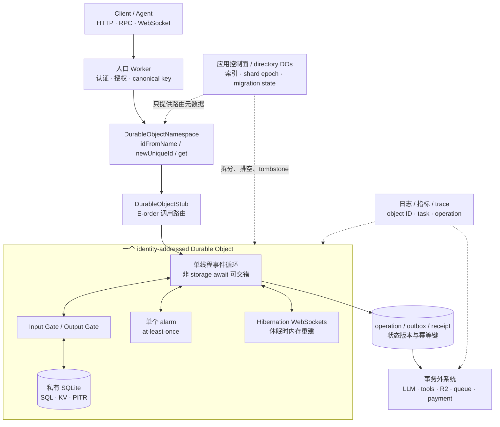

# Cloudflare Durable Objects + workerd：把边缘协调收敛到身份寻址的状态单元

把同一业务 key 的请求送到一个 Durable Object，可以把许多并发冲突收敛为一个对象内的串行判定。代价是这个 key 也定义了热点：一个房间、租户或任务若承载过多连接、外呼和状态，平台不会自动把同一 ID 拆成多个协调者。

Cloudflare Durable Objects（DO）把全局可寻址身份、事件循环、私有持久存储、alarm 和长连接入口组合成一个状态单元。不同对象可并行扩展；同一对象只适合承载必须共同判定的最小状态。单线程不消除异步竞态，存储事务也不覆盖模型、工具或付款。

本文依据截至 2026-07-22 的官方文档和固定 `workerd` 快照。开源 `workerd` 能解释 runtime、I/O gates 与本地 Durable Object 存储，却不等于 Cloudflare 全球生产放置实现；托管环境的首次放置、故障迁移、复制和 storage control plane 不能从本地源码反推。

## 学习问题

1. ID、namespace 与 stub 如何把同一业务 key 路由到同一协调单元？
2. 每对象单线程保证什么，非 storage `await` 为什么仍会产生交错？
3. Input/Output Gate 与 SQLite 事务的原子性在哪里停止？
4. alarm、hibernation 和对象重启要求怎样的幂等恢复？
5. session、task、tenant 与 entity key 如何改变热点和重分片成本？
6. `workerd` 本地行为、location hint 与 Cloudflare 全球生产放置之间边界何在？

## 一页摘要

**已证实事实**：一个 Durable Object class 对应一个 namespace，每个对象有自己的 ID、活动实例和私有持久存储。`idFromName(name)` 从稳定名称得到 ID，`newUniqueId()` 生成随机 ID，`get(id)` 返回 stub；`getByName(name)` 是更短的等价入口。真正调用时才路由并懒创建。stub 是远程 client，不是对象本身，失败后应重新获取。

**已证实事实**：单个对象固有单线程，但事件可在异步边界交错。异步 storage 默认受 Input Gate 保护，同步 SQLite 不让出事件循环；`fetch()` 等非存储 I/O 会允许其他请求运行。因此“读状态 → 外呼 → 写状态”仍会竞态，长时间模型推理也不应放进 `blockConcurrencyWhile()`。

**已证实事实**：SQLite-backed 对象提供 SQL、同步/异步 KV、事务与 PITR。Input Gate 控制 storage await 期间的输入交错，Output Gate 延迟写入后的外发消息，直到 durable write 确认。

若写入失败，排队的外发消息会被丢弃、对象重置、调用方收到错误。这能阻止“未持久化却已宣告成功”，但不会撤销写入前已发出的 HTTP 请求，也不会把 LLM、R2、队列、付款或邮件纳入对象事务。

**基于证据的推断**：Agent 平台可把 session、task 或 entity key 映射为一个协调对象，让它持有 run 状态、审批版本、WebSocket 与 alarm。alarm 至少执行一次，hibernation 会丢失普通内存；模型和工具又位于事务外。端到端恢复因此需要 operation ID、状态版本、outbox/receipt、重试预算和补偿。

| 关键决策 | 推荐默认 | 原因 | 退出信号 |
| --- | --- | --- | --- |
| 身份 | 服务端派生 canonical key，`idFromName()` / `getByName()` | 无需另存随机 ID 映射，所有调用汇聚同对象 | key 含敏感信息、可被租户碰撞或生命周期不稳定 |
| 存储 | 新 namespace 用 SQLite；同步 SQL/KV 放在短事务 | 当前官方推荐，支持 SQL、同步 KV 与 PITR | 单对象接近容量/吞吐边界，或需要跨对象查询事务 |
| 粒度 | 选择最小“必须共同串行判定”的 session/task/entity | 多对象横向并行，缩小热点与授权半径 | 一个对象长期排队、overloaded、状态或连接持续增长 |
| 外部副作用 | 先登记 operation/outbox，再外呼，再对账落 receipt | 非存储 await 会交错，DO 事务不覆盖外部系统 | 下游无幂等键且副作用不可补偿，需人工门禁 |
| 长连接 | 服务端 Hibernation WebSocket + durable/attachment 恢复 | 空闲可休眠，连接仍保持 | 需要 outgoing WebSocket、强零断线承诺或超大连接态 |

## 事实边界

本案例的证据截止日为 **2026-07-22**。官方产品文档用于说明托管 Durable Objects 合同，固定 `workerd` 快照只用于解释公开 runtime 接缝。两者不能合并成“本地运行结果等于全球生产行为”的证据。

  
证据：runtime 快照、存储版本与重试参数

- **固定快照：** `git ls-remote https://github.com/cloudflare/workerd.git HEAD` 返回 [`14894eccbb339da199d772fcadd337b6d0902128`](https://github.com/cloudflare/workerd/tree/14894eccbb339da199d772fcadd337b6d0902128)。
- **提交信息：** `Release 2026-07-22`，时间为 2026-07-22 00:59:49 UTC。README 说明日期版本对应最大 compatibility date。
- **新建 namespace：** 当前新 `exports` namespace 只能选择 SQLite backend。2026-07-09 changelog 的 legacy `migrations` 例外，仅允许已有 KV-backed namespace 的账户继续用 `new_classes` 新建 KV namespace；已有 KV namespace 继续受支持。
- **SQLite 合同：** 支持 SQL、同步/异步 KV 与 PITR。`transactionSync()` 仅 SQLite 可用且回调必须同步；SQLite 下 `transaction()` 的 `txn` 参数已 obsolete，直接使用 `ctx.storage`。连续且无中间 `await` 的写会自动合并并原子提交。
- **alarm：** 每对象同时只有一个已安排 alarm；handler 至少执行一次。未捕获异常从 2 秒开始指数退避，最多 6 次 retry。
- **边界：** 这些固定参数支持本文的版本与恢复分析，不承诺后续平台行为，也不证明有限重试后外部动作必然完成。

**已证实事实**：`workerd` 是与 Cloudflare Workers 同源的开源 JavaScript/Wasm server runtime，可用于 self-host 和本地开发。README 警告它不是 hardened sandbox。固定 `workerd.capnp` 则说明本地 Durable Objects 当前位于单个 runtime instance，并为跨 cluster 分布保留 TODO。

**边界。已证实事实**：源码能支持 I/O gate、actor cache、SQLite、本地 ID namespace 和事件循环方面的陈述。它不能证明托管服务怎样执行全球首次放置、故障迁移、复制、法域约束或负载调度。本文也不从 local-disk 布局反推生产存储实现。

**已证实事实**：官方 Data location 当前称对象创建后不会改变 location；默认靠近首次 `get()` 的请求，`locationHint` 只在该对象第一次 `get()` 时考虑，而且是 best effort、不是保证。jurisdiction 则是运行和持久化区域的约束，但 Worker 仍可从世界其他位置访问对象，且 ID 会因计费/调试在 jurisdiction 外记录。

location、host 与内存生命周期不可混为一谈：对象仍会因更新、空闲或 runtime 决策被重启或换 host。

**已证实事实**：官方 known issues 对“全局唯一”还给出重要限定：唯一性在新事件开始和访问 storage 时执行；一个长事件若从不再访问 storage，遇到网络分区或软件更新时可能已经不是 current instance。若之后访问 storage 会得到异常。故障安全设计必须依赖持久 checkpoint、幂等重试和新 stub，而不是把某个内存实例永久当作 owner。

**个人分析**：Durable Object ID 应被视为路由身份，不是认证令牌、tenant ACL 或永不变化的业务主键。外部 API 仍要认证主体，服务端派生 namespace/key，并在对象内再次校验 tenant、resource 与动作；日志可以记录 ID 或不可逆 tenant hash，但不要把用户可控 name 直接当授权事实。

## 架构图

先检查图中的串行边界是否画得足够小：只有同一业务 key 的状态进入一个对象，模型、工具、队列和跨对象索引仍留在事务外。目录控制面可以帮助找对象，却不应成为每次数据请求都必须经过的全局热点。

文字等价描述：客户端不能直接把任意 tenant/resource 字符串当作对象权限。入口 Worker 先认证主体并生成 canonical key，再通过 namespace 得到 ID 和 stub；stub 把调用路由到唯一协调单元。对象内的 storage 操作受 Input/Output Gate 约束，但外部模型和工具位于事务外。

应用控制面只保存索引、shard epoch 与迁移状态，不进入每个数据请求的同步路径。热点拆分需要它显式迁移 key，平台不会自动把一个对象切开。

## 控制权与任务流

**说明性场景**：一个 Agent 任务在等待模型结果时收到取消请求，随后旧模型结果迟到。这个场景用已证实的事件交错和 storage gate 机制说明恢复设计，不代表 Cloudflare 官方事故或生产测量。

1. **认证与 key 派生。** 入口验证用户/Agent token，读取可信 tenant、workspace、session、task 或 entity ID，做规范化与长度限制，再组合版本化 key，例如 `v2:tenant-17:task-42`。不要直接采用 query string 作为 `idFromName()` 输入，更不要把“知道 name/ID”当作已授权。

2. **选择 ID 策略。** 稳定且可重算的业务实体使用 `idFromName()` 或 `getByName()`；不可预测的新会话可用 `newUniqueId()`。“原子保存”只表示目录对象能在它自己的私有 storage transaction 中保存 ID string 和目录记录，不会让目录对象与目标对象的首次初始化形成跨对象原子事务。目标对象的初始化必须以稳定 receipt / initialization key 做幂等检查；调用超时或重试后，系统通过目录记录、目标对象 receipt 和 reconciliation 收敛。若把 ID string 返回给已认证客户端，也不能把它当授权凭证。ID 只在原 namespace 有效，`idFromString()` 会拒绝其他 namespace 生成的 ID。

3. **取得并调用 stub。** `get()` 立即返回 client；真正 RPC/HTTP 调用才建立连接并懒创建对象。按调用方和业务协议携带 `request_id` / `operation_id`，不要仅靠 stub E-order 代替跨调用方全局顺序。stub 抛错后重建 stub，再依据 receipt 判断是否重试。

4. **对象内判定。** 同步 SQLite 读写在当前事件循环内执行；异步 KV storage 默认通过 Input Gate 防止 storage await 期间其他事件交错。连续无 `await` 写入可自动 coalesce；需要明确同步原子区时使用 `transactionSync()`，需要兼容异步 storage API 时使用 `transaction()`。

5. **外部调用。** 在调用 LLM/tool 前把 `operation_id`、input hash、state version、deadline、attempt 与 `PENDING` 写入对象 storage；提交后再发外部请求。`await fetch()` 会允许其他事件交错，返回时必须重新读取/检查版本和 ownership，再把 receipt 原子写回。若另一个请求已经取消或接管任务，迟到结果只作为候选记录，不覆盖 current state。

6. **响应与 Output Gate。** storage write 后的响应或后续 fetch 默认等待写盘确认；失败会阻止外界看到“已提交”消息。但在写入前已经发出的副作用不会被撤销，设置 `allowUnconfirmed` 也会主动放弃默认可见性保护。高风险流程不使用它。

7. **alarm 与 WebSocket。** alarm payload/进度存 storage，handler 先按稳定 operation key 去重，再执行可重入步骤；`retryCount` 只说明平台 retry attempt，不证明外部动作未发生。WebSocket 使用 `acceptWebSocket()` 进入 hibernation API；必要的会话态写 storage，小型连接态可用 attachment，唤醒 constructor 只重建 cache。

8. **故障恢复。** 对象没有 shutdown hook，持续写 checkpoint。遇到对象 reset、overloaded、stub error、alarm retry 或客户端重连时，先查询 durable state 与外部 receipt；不能判断时转人工。客户端使用退避、deadline 和幂等键，禁止无界重试制造热点。

**基于证据的推断**：Agent task DO 的最小状态机可为 `created -> running -> waiting_external -> result_received -> validated -> completed`，另有 `cancel_requested / failed / manual_review`。每个状态转移带单调 `state_version`；外部 worker 的回调必须同时匹配 `task_id`、`operation_id`、attempt 和 base version。

**个人分析**：不要在 `blockConcurrencyWhile()` 里等待模型或人类审批。它会把对象所有其他事件挡住，并受 30 秒 reset 边界影响。更稳妥的是先提交 `waiting_external`，释放事件循环，让取消、查询和其他合法更新继续处理；外部结果回来后做乐观版本检查。

## 关键源码导读

最短源码路径是 I/O gate、actor cache、SQLite actor storage 与本地 namespace 配置。它们证明 storage await、写入可见性、事务和本地 ID 的 runtime 关系；它们不公开 Cloudflare 托管控制面如何选择全球 host、复制或迁移数据。

本节固定在 2026-07-22 runtime snapshot。这个 release 范围约束本地 runtime 接缝，不扩展为托管平台实现承诺。

  
证据：I/O gates、actor storage 与本地 namespace 接缝

- **固定提交：** [`cloudflare/workerd@14894eccbb339da199d772fcadd337b6d0902128`](https://github.com/cloudflare/workerd/tree/14894eccbb339da199d772fcadd337b6d0902128)，提交题为 `Release 2026-07-22`，时间为 2026-07-22 00:59:49 UTC。

| 固定源码 | 可观察事实 | 可以支持的结论 | 不能支持的结论 |
| --- | --- | --- | --- |
| [`README.md`](https://github.com/cloudflare/workerd/blob/14894eccbb339da199d772fcadd337b6d0902128/README.md) | `workerd` 与 Workers 同源，可 self-host/本地开发；版本号对应最大 compatibility date；自身不是 hardened sandbox | 本地运行、兼容日期和 runtime 安全边界 | 托管 Workers 的全部防御、全球网络或服务 SLO |
| [`src/workerd/io/io-gate.h`](https://github.com/cloudflare/workerd/blob/14894eccbb339da199d772fcadd337b6d0902128/src/workerd/io/io-gate.h) | Input Gate 阻止 storage outstanding 时其他 incoming I/O；Output Gate 阻止可观察未确认写的 outgoing message | storage await 的门控与 durable write 可见性 | 所有 `await` 都串行；外部系统加入 storage transaction |
| [`src/workerd/io/io-context.c++`](https://github.com/cloudflare/workerd/blob/14894eccbb339da199d772fcadd337b6d0902128/src/workerd/io/io-context.c%2B%2B) | actor context 监控 input/output gate broken；actor requests 共享一个 I/O context | gate failure 会使当前 actor context 不再安全 | 失败后业务副作用自动补偿 |
| [`src/workerd/io/actor-cache.h`](https://github.com/cloudflare/workerd/blob/14894eccbb339da199d772fcadd337b6d0902128/src/workerd/io/actor-cache.h) | actor cache 假定自己是底层 storage 唯一 client；写先入 cache，并让 Output Gate 等待确认 | 私有 storage、写 buffer 与 output gating 的实现关系 | 生产 storage 的复制拓扑、物理磁盘布局或跨对象事务 |
| [`src/workerd/io/actor-sqlite.c++`](https://github.com/cloudflare/workerd/blob/14894eccbb339da199d772fcadd337b6d0902128/src/workerd/io/actor-sqlite.c%2B%2B) | SQLite actor storage 维护 implicit/explicit transaction、savepoint 与 alarm metadata | 本地 SQLite 事务和 alarm 状态有 runtime 实现 | Cloudflare 全球 storage control plane 使用同一文件/提交协议 |
| [`src/workerd/server/workerd.capnp`](https://github.com/cloudflare/workerd/blob/14894eccbb339da199d772fcadd337b6d0902128/src/workerd/server/workerd.capnp) | namespace `uniqueKey` 参与 ID 派生；改 class name 只要 key 稳定可保留 storage；本地 DO 数据可 in-memory/localDisk；对象当前只在单 runtime instance | class/namespace/ID 在 local runtime 的稳定连接，workerd 的本地范围 | 自动跨 cluster placement、migration、replication 或 production parity |

**边界：** 本卡只验证开源 runtime 合同。Cloudflare 全球生产 placement、migration、replication、SLO 与 storage control plane 不在这些源码的证明范围内。

**已证实事实**：固定 `workerd.capnp` 说明 Durable Object ID 与稳定 namespace `uniqueKey` 关联，class name 变化不必破坏既有 storage。Cloudflare 当前托管配置则用 `exports` 对 provisioned namespace 做 create/delete/rename/transfer reconciliation。

两个证据都说明 class lifecycle 与单个对象 ID 不是同一概念，但本地 `uniqueKey` 不是用户在 Cloudflare 控制面手工操作的迁移 API。

**边界。个人分析**：源码审阅应停止在 runtime contract。Cloudflare 如何选择生产 host、维护全球 location cache、处理分区、移动底层数据或执行 namespace transfer，是公开 `workerd` 未给出的服务实现；无法从类名、local SQLite 文件名或 I/O gate 推导出来。

## 架构决策与权衡

最重要的设计不是“要不要 DO”，而是 **哪个 key 代表必须共享同一串行判定与私有存储的原子协调单元**。

| 对象粒度 | 推荐 key / ID | 适合状态 | 热点与吞吐 | 拆分、迁移与权限代价 |
| --- | --- | --- | --- | --- |
| object-per-session / room | `tenant:session` 的 `idFromName()`；不公开原始敏感字段 | 对话、多人协作、连接集合、短期 presence、会话 checkpoint | 大房间或高频 WebSocket 消息集中到一个单线程对象；需批量消息 | 按 channel/topic 子分片；跨房间查询外置；成员 ACL 每次连接/消息复核 |
| object-per-task / run | `newUniqueId()` + 受控目录，或稳定 `tenant:task` | task 状态机、attempt、barrier、alarm、operation receipt | 大量独立任务天然并行；单个 fan-in 巨大任务仍会排队 | 子任务另建对象，父对象只聚合摘要；目录写入和删除策略必须幂等 |
| object-per-tenant | 服务端 canonical tenant ID | quota、租户配置、全局租户协调、小型索引 | 大租户所有会话/任务共享一个热点和 10 GB/软 1,000 rps 等边界 | 最难重分片；用 tenant + bucket/resource 拆分，tenant DO 只作 directory/control plane |
| object-per-entity / aggregate | `tenant:type:entity` | 订单、设备、文档、账号等领域 invariant | 通常最贴近真正的冲突域，可水平扩展 | 跨实体原子性不存在；需要 saga/outbox/补偿和版本化引用 |

**已证实事实**：官方 limits 给单对象约 1,000 requests/s 的 soft limit，实际吞吐取决于解析、storage 和业务工作；过载后排队仍无法吸收时会返回 overloaded error。官方 reference architecture 因此建议数据面按资源一个对象横向分片，控制面只做创建、列举、删除和索引，并在需要时继续把 control plane 分片。

**基于证据的推断**：热点对象不会因达到 soft limit 自动拆成两个保持同一 ID 的协调者。重分片必须由应用实施：冻结旧对象的新写或提升 `shard_epoch`，创建目标对象，复制/checkpoint 状态，切换 directory，旧对象保留 redirect/tombstone 并拒绝旧 epoch，最后排空清理。这个流程没有跨对象事务，迁移期间应保持双版本读兼容和单一写 owner。

**个人分析**：Agent 平台通常采用两层键更稳妥：tenant directory DO 保存 shard map、预算摘要和迁移状态；每个 session/task/entity DO 承担高频数据面。directory 不参与每条消息和每次模型 token 流，否则它会重新成为全租户瓶颈。跨对象聚合使用普通索引、队列或分析存储，不要 fan-in 到一个“全球 DO”。

**已证实事实**：当前 class lifecycle 以 `exports` 为主，legacy `migrations` 仍受支持但二者不可混用。rename 把 provisioned namespace 和数据移动到新 class name；delete 永久删除 namespace 与数据；storage backend 创建后不可原地更换。

lifecycle change 只能 `wrangler deploy`，不能 gradual rollout，rollback 也不能跨越该 change。普通代码更新仍可能让新 Worker 暂时调用旧 DO 版本，API 要前后兼容。

**个人分析**：把 schema/data migration 与 class lifecycle 分开。先发布兼容读写和可重复 schema migration，记录 per-object schema version 与 migration receipt；再执行 class rename/transfer；最后移除旧接口。

回滚计划必须在 lifecycle change 前准备数据 checkpoint 和前向修复，因为平台禁止简单退回跨越该边界的旧版本。

## 生产化分析

生产控制应围绕对象粒度来组织：身份决定谁被路由到同一串行单元，容量决定这个单元何时成为热点，恢复协议决定迟到结果和外部副作用怎样对账。对象数量可以增长，并不意味着单个对象的吞吐会自动增长。

  
证据：生产控制、观测字段与故障处置

**来源锚点：** [Durable Objects limits](https://developers.cloudflare.com/durable-objects/platform/limits/) 与 [Metrics and analytics](https://developers.cloudflare.com/durable-objects/observability/metrics-and-analytics/) 提供平台容量和观测边界；表中的 outbox、shard epoch 与人工升级属于应用设计。

| 生产维度 | 最小控制 | 关键观测 | 故障处置 |
| --- | --- | --- | --- |
| 身份与租户隔离 | 入口认证；服务端 canonical key；tenant/resource/action ACL 在入口与对象双检；ID/name 不作 bearer secret | allow/deny、tenant hash、namespace、object ID/name、actor、policy version | 拒绝客户端自报跨租户 key；撤销连接；隔离错误 namespace/binding |
| 热点与容量 | object-per-atom；per-object admission、消息批量、queue/deadline、外呼并发与 token/tool budget | req/s、overloaded、queue age、CPU、storage latency/bytes、WebSocket 数和消息率 | 背压/拒绝新工作；拆 entity/bucket；禁止 retry 逃到同一热点 |
| storage 与事务 | 新 namespace SQLite；短同步事务；无 `await` 写 coalescing；外部 I/O 不进 transaction | transaction latency/rollback、SQLITE_FULL、PITR bookmark、write failure、Output Gate error | 保持读/删能力；压缩/归档/拆分；从 PITR/业务 checkpoint 验证恢复 |
| 异步交错 | storage 依赖 Input Gate；外部 fetch 前后检查 state version；仅短初始化用 `blockConcurrencyWhile()` | version conflict、stale result、critical-section reset/timeout、allowConcurrency 使用 | 迟到结果降为 proposal；重读重算；不要用长锁阻塞取消与查询 |
| alarm 与幂等 | 单 alarm；stable operation ID；状态检查；有限 retry 后显式 reschedule/人工升级 | scheduled time、retryCount/isRetry、handler latency、duplicate/receipt、retry exhausted | 查询外部真实结果；复用 receipt、补偿或人工；不能假设未执行 |
| WebSocket / hibernation | 使用 server hibernation API；重要态入 storage；attachment 只存小型连接态；客户端 reconnect/resume | active/hibernated、消息大小/频率、wake/cold start、attachment version、disconnect | constructor 重建 cache；按 session version 恢复；关闭后 attachment 不可作为 durable record |
| 部署与迁移 | 前后兼容 RPC；schema version；class `exports` 三阶段安全 rename；shard epoch/tombstone | code/class/schema version、reconciliation、old/new API error、旧 epoch write | 停止 rollout；前向修复；lifecycle change 前备份，因 rollback 不能跨界 |
| 故障恢复 | 增量 checkpoint、无 shutdown-hook 假设；stub error 后重建；客户端有界退避 | object reset/restart、storage exception、in-flight age、orphan operation、reconnect | 先 reconcile storage/outbox/downstream；无法判定转人工，禁止盲重放 |
| 可观测性 | 官方 namespace/per-object metrics + Workers logs/traces；统一 task/operation/version 字段 | `$workers.durableObjectId`、invocation/storage/subrequest/WebSocket metrics、cost、deny rate | 从热点 object drill-down；保护 PII；为 control/data plane 分开 SLO |

**边界：** 表中 canonical key、outbox、shard epoch、人工升级和跨系统对账属于应用设计，不是 Durable Objects 自动提供的 workflow 能力。

**安全。已证实事实**：每个对象的 attached storage 是私有的，其他对象不能直接访问。官方 Data security 说明全部 Durable Object 数据及其 metadata 都会自动静态加密，Worker / Cloudflare network node 与 Durable Object 之间的传输由 TLS/SSL 保护。

官方 best practices 把 Worker 放在认证、校验和响应格式层；这些平台能力不等于应用授权。

**安全。个人分析**：生产系统还应限制 key 长度与基数、RPC payload、WebSocket 消息、SQL 查询、外部连接和每主体成本，并让高风险 tool credential 只在实际调用时按 tenant/action 发放。

**可靠性。已证实事实**：对象会因部署、空闲和 runtime 决策重启，没有 shutdown hook；访问 storage 的 in-flight 请求在 shutdown 时可能被停止以保持唯一性。Hibernation 会丢内存，普通 shutdown 也可能终止 WebSocket。客户端必须支持重连、恢复 token/state version 与重复结果，不能把“连接曾经建立”当交付证明。

**可观测性。基于证据的推断**：官方图表允许按 namespace 和单个 ID/name 过滤，但业务诊断仍要记录 `tenant_hash`、`session_id/task_id`、`operation_id`、state/schema/class version、alarm retry、shard epoch、stub attempt 和 downstream receipt。聚合指标找趋势，per-object 视图找热点，审计日志解释谁获准做了什么。

**非目标。个人分析**：Durable Objects 不应被描述成自动 Agent workflow engine、模型 sandbox、全局消息队列、向量数据库、跨对象 ACID 数据库、exactly-once effect processor 或自动 rebalancer。它提供一个很强的身份寻址协调原语；任务编排、语义验证、资源授权、跨对象索引、重分片和补偿仍由应用设计。

## 可迁移经验

### 可直接复用的机制

- **identity-addressed coordinator**：把稳定、服务端派生的 session/task/entity key 映射到一个对象，所有需要共同串行判定的请求都经过同一 stub 目标。
- **私有持久状态 + 内存 cache**：状态真相在 SQLite/KV，内存只加速当前实例；constructor、hibernation 和 reset 后可重建。
- **Input/Output Gate 思维**：storage await 期间控制输入交错，durable write 确认前控制外发可见性；在架构评审中分别问“谁能进来”和“谁能看见”。
- **alarm 作为 per-entity wake-up**：把 deadline、租约检查、延迟重试和周期维护安排给对象自己的单 alarm，但 handler 按 at-least-once 设计。
- **Hibernation WebSocket**：会话/房间对象集中连接，空闲时丢内存但保持网络连接；用 storage/attachment 恢复所需状态。
- **control/data plane 分离**：目录对象管理资源与 shard map，数据对象直达实体；高频请求不经过全局目录协调者。
- **显式热点拆分**：监控单对象吞吐、队列、连接和 storage，提前定义 bucket/sub-entity key、shard epoch 与 tombstone 迁移协议。

### 只能有限类比的部分

- Agent 会话可类比 chat room，task 可类比 entity，但 LLM 推理时间、token 成本、工具权限和不可逆副作用比普通消息更复杂；外部 await 前后必须做版本与授权复核。
- 每对象单线程可类比 single-writer boundary，却只覆盖事件循环当前执行段和 storage gate；非 storage await 允许交错，且故障时内存 owner 会被替换。
- Output Gate 能阻止未确认 storage write 的后续网络消息被观察，却不能回滚已发出的 tool call，也不证明下游 exactly-once。outbox/receipt 只是应用补充，不是 DO 自动生成的组件。
- object-per-tenant 简化 quota 与配置，但大租户会把全部会话和任务压到一个对象。通常只让 tenant DO 管 directory/control state，细粒度对象承载数据面。
- `locationHint` 可帮助首次放置靠近用户，不能作为特定城市、机房、延迟、容灾或合规承诺；合规约束应评估 jurisdiction 及完整数据流。
- class rename/transfer 迁移 namespace lifecycle，不会替应用迁移业务 key、拆热点对象或升级每个对象内的 schema。

### 不应照搬的部分

- 不要把“单线程”简化为“无竞态”。`fetch()`、R2 和其他非 storage I/O 都能让请求交错；长模型调用尤其需要状态版本和迟到结果处理。
- 不要把 `transaction()`、`transactionSync()`、自动 write coalescing 或 Output Gate 扩展成跨 LLM、queue、payment、email 或其他 Durable Object 的事务。
- 不要建立一个 global/tenant mega-object 承接所有请求，再期待平台自动扩容单对象。吞吐随工作量变化，热点必须从 key 设计和应用重分片解决。
- 不要允许客户端自由选择 tenant/object name，或把 ID、stub、private storage 和平台加密误当应用 ACL。认证与资源授权必须显式执行。
- 不要依赖 constructor、内存变量、WebSocket attachment 或 shutdown hook 保存唯一状态。重要进度持续写 storage，连接关闭后 attachment 也会消失。
- 不要把 alarm 当 exactly-once scheduler。它至少执行一次、只有有限自动 retry，外部 effect 需要稳定幂等键、receipt、对账与人工升级。
- 不要用 `workerd` 解释 Cloudflare 生产全球 placement、migration、replication 或 storage control plane。它是开源本地 runtime/Workers engine，固定源码明确仍是单 runtime instance 的对象模型。

## 来源

**Cloudflare Durable Objects 官方文档（已证实事实，访问与截断日期 2026-07-22）**

- [Durable Objects overview](https://developers.cloudflare.com/durable-objects/) 与 [What are Durable Objects?](https://developers.cloudflare.com/durable-objects/concepts/what-are-durable-objects/)：身份寻址、单点协调、私有 storage、WebSocket 与 alarm 的产品边界。
- [Namespace](https://developers.cloudflare.com/durable-objects/api/namespace/)、[ID](https://developers.cloudflare.com/durable-objects/api/id/) 与 [Stub](https://developers.cloudflare.com/durable-objects/api/stub/)：`idFromName`、`newUniqueId`、`idFromString`、`get/getByName`、懒创建、E-order、stub failure 与 namespace 限制。
- [Rules of Durable Objects](https://developers.cloudflare.com/durable-objects/best-practices/rules-of-durable-objects/)、[State](https://developers.cloudflare.com/durable-objects/api/state/) 与 [Known issues](https://developers.cloudflare.com/durable-objects/platform/known-issues/)：单线程的异步交错、Input Gate、非 storage I/O 竞态、`blockConcurrencyWhile`、global uniqueness 限定与代码版本兼容。
- [SQLite-backed storage](https://developers.cloudflare.com/durable-objects/api/sqlite-storage-api/)：SQLite/legacy KV 能力矩阵、同步/异步 KV、PITR、自动事务、`transaction/transactionSync`、write coalescing、Output Gate 与 alarm metadata。
- [Alarms](https://developers.cloudflare.com/durable-objects/api/alarms/)：单 alarm、at-least-once、2 秒起指数退避、最多 6 次 retry、retry info 与有限重试边界。
- [WebSockets](https://developers.cloudflare.com/durable-objects/best-practices/websockets/) 与 [Lifecycle](https://developers.cloudflare.com/durable-objects/concepts/durable-object-lifecycle/)：server-side hibernation、constructor 重跑、内存丢失、attachment、重启、shutdown 与无 hook 恢复。
- [Data location](https://developers.cloudflare.com/durable-objects/reference/data-location/)：jurisdiction、首次 `get()`、best-effort `locationHint`、当前 location 不动态变更及其非保证边界。
- [Data security](https://developers.cloudflare.com/durable-objects/reference/data-security/)：attached storage 的对象私有边界、全部数据及 metadata 的静态加密，以及 Worker / Cloudflare network node 与对象间的 TLS/SSL 传输保护。
- [Durable Object class exports](https://developers.cloudflare.com/durable-objects/reference/durable-objects-migrations/) 与 [Durable Objects changelog](https://developers.cloudflare.com/changelog/product/durable-objects/)：当前 `exports` 与 legacy migrations、create/delete/rename/transfer、storage backend immutability、gradual deployment 和 rollback 限制；2026-07-09 条目限定了哪些账户仍可通过 `new_classes` 新建 KV-backed namespace。
- [Limits](https://developers.cloudflare.com/durable-objects/platform/limits/) 与 [Metrics and analytics](https://developers.cloudflare.com/durable-objects/observability/metrics-and-analytics/)：单对象 soft throughput、overload、storage/CPU/WebSocket 边界、namespace/per-object 指标与 `$workers.durableObjectId`。

**Cloudflare 官方 reference architecture（已证实事实，访问与截断日期 2026-07-22）**

- [Control and data plane architectural pattern for Durable Objects](https://developers.cloudflare.com/reference-architecture/diagrams/storage/durable-object-control-data-plane-pattern/)：控制对象管理资源元数据，资源对象直达数据面；按资源继续分片以避免单对象限制。

**Cloudflare 固定上游源码（已证实事实）**

- [`cloudflare/workerd@14894eccbb339da199d772fcadd337b6d0902128`](https://github.com/cloudflare/workerd/tree/14894eccbb339da199d772fcadd337b6d0902128)：2026-07-22 核对的 HEAD，提交题为 `Release 2026-07-22`，提交时间 2026-07-22 00:59:49 UTC。
- [`README.md`](https://github.com/cloudflare/workerd/blob/14894eccbb339da199d772fcadd337b6d0902128/README.md)、[`io-gate.h`](https://github.com/cloudflare/workerd/blob/14894eccbb339da199d772fcadd337b6d0902128/src/workerd/io/io-gate.h)、[`actor-cache.h`](https://github.com/cloudflare/workerd/blob/14894eccbb339da199d772fcadd337b6d0902128/src/workerd/io/actor-cache.h)、[`actor-sqlite.c++`](https://github.com/cloudflare/workerd/blob/14894eccbb339da199d772fcadd337b6d0902128/src/workerd/io/actor-sqlite.c%2B%2B) 与 [`workerd.capnp`](https://github.com/cloudflare/workerd/blob/14894eccbb339da199d772fcadd337b6d0902128/src/workerd/server/workerd.capnp)：runtime 定位、gate、cache、SQLite、namespace unique key、本地存储和单 runtime 边界。

**证据边界说明**：Agent 会话/任务状态机、canonical key、outbox/receipt、shard epoch、tenant directory、迁移 tombstone、资源预算和人工升级是依据官方原语形成的“基于证据的推断”或“个人分析”，不是 Cloudflare 对 Agent 平台的官方承诺。

Cloudflare 托管服务未公开的全球 placement/migration/storage control plane，以及 2026-07-22 之后的文档和 `workerd` 变化，均不在本案例结论范围内。
