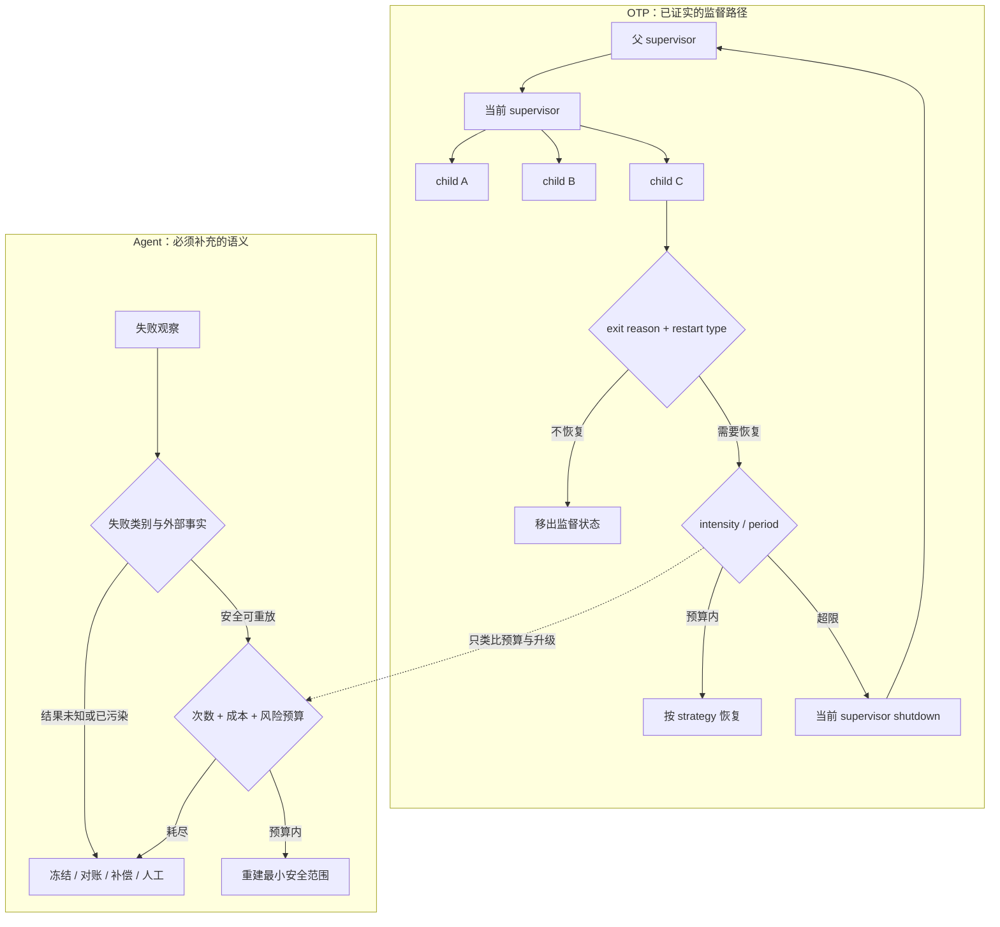

# Erlang/OTP Supervision Tree：把失败恢复设计成层级控制协议

一个 child 崩溃并不可怕。真正危险的是它被不断拉起、不断失败，而当前控制层始终不肯承认自己已经无法恢复。OTP 的答案不是“更努力地重试”，而是给局部恢复设置窗口预算；预算耗尽后，当前 supervisor 连同自己的子树退出，把故障所有权交给父层。

这套机制值得迁移的部分，是执行、监督与升级的明确分工。它不意味着 LLM Agent 可以像 BEAM 进程一样廉价重建：Agent 可能消耗昂贵模型额度，状态散落在 durable store，并且已经发送消息、付款或修改数据库。

**证据范围**：本文依据 Erlang/OTP 29.0.3 在线文档与上游固定提交 `295c7737d1b25a270e3fc6fa2b7ec7ad4779cf17`。版本、源码入口与逐项 seam 放入证据卡；机制、失败路径和迁移边界留在正文。

## 学习问题

1. child 反复失败时，OTP 怎样从局部重启走到向上升级？
2. restart type、restart strategy 与 restart intensity 分别拥有哪一个决定？
3. 启动顺序、关闭顺序和恢复范围怎样共同表达依赖？
4. Agent 平台怎样把 crash、质量失败、工具失败和外部状态污染分开？
5. 为什么 BEAM 进程的重建语义不能直接套在有成本、有 durable state、有外部副作用的 Agent 上？

## 一页摘要

**已证实事实**：supervisor 启动、停止并监控 worker 或下级 supervisor。child specification 定义启动函数、restart type、shutdown 与 child 类型；supervisor flags 定义 strategy、`intensity` 和 `period`。进程退出后，restart type 先决定是否恢复，预算再决定当前层是否仍有恢复权，strategy 最后决定重建一个、全部或依赖后缀。

一次重启超过局部窗口预算时，OTP 不会留在原地无限循环。当前 supervisor 会终止子进程并以 `shutdown` 退出；父 supervisor 随后决定重建这个子树，还是继续把失败向上交出。

**个人分析**：Agent 系统可以复用“局部恢复有预算，预算耗尽就升级”的协议，却不能复用“重启等于恢复”的假设。外部写入结果未知时，应先对账；状态已污染时，应先冻结、补偿或交给人。

这张表回答三个容易混淆的配置分别控制什么：

| 决策 | OTP 输入 | 控制的问题 | Agent 迁移所需补充 |
| --- | --- | --- | --- |
| 是否重启 | exit reason + restart type | 此类退出值不值得恢复吗 | 质量、合规和业务终态分类 |
| 重启多大范围 | strategy + child order | 哪些兄弟共享不变量 | durable state、依赖图与补偿边界 |
| 还能否重启 | `intensity` + `period` | 当前层是否仍有恢复权 | 次数、费用、时限、配额与风险总预算 |
| 预算耗尽后谁接手 | supervisor exit | 哪一层拥有更大恢复范围 | 结构化证据包与人工接管责任 |

应保留的判断是：恢复类型、恢复范围和恢复预算是三个正交问题；把它们混成一个“最多重试三次”会隐藏故障所有权。

## 事实边界

**已证实事实**：普通静态 children 按 specification 从左到右启动、从右到左终止。`one_for_one` 只重启退出者；`one_for_all` 先终止其余 children，再重启全部；`rest_for_one` 终止退出 child 之后启动的 children，并从退出位置向后重启。

**已证实事实**：`permanent` 无论退出原因都重启；`transient` 只在非 `normal`、`shutdown`、`{shutdown, Term}` 的退出后重启；`temporary` 从不重启。`intensity`/`period` 的默认值为 1/5；最近 `MaxT` 秒内超过 `MaxR` 次重启时，supervisor 关闭 children 并以 `shutdown` 退出。

**基于证据的推断**：`one_for_all` 适合不能保留部分旧成员的协作组，`rest_for_one` 适合有明确线性依赖的流水线。OTP 只执行声明的范围，不会自动识别共享状态或依赖图，所以策略正确性仍由设计者负责。

**个人分析**：进程正常退出不代表答案正确。幻觉、越权或格式正确但事实错误的结果，需要确定性规则、评估器或人工明确产出业务失败信号；OTP supervisor 本身不理解模型置信度、外部事务或审批。

  
证据：固定版本与监督语义范围

  - **文档截面：** Erlang/OTP 29.0.3 的 `Supervisor Behaviour` 与 STDLIB `supervisor` 页面。
  - **源码截面：** `erlang/otp@295c7737d1b25a270e3fc6fa2b7ec7ad4779cf17`，集中阅读 `lib/stdlib/src/supervisor.erl`。
  - **时间边界：** 访问与来源截断日期均为 2026-07-22；之后行为变化不在本文结论内。
  - **证明边界：** 这些证据证明 OTP 的进程监督语义，不证明它原生支持跨节点长期工作流、分布式事务、模型质量判断或副作用补偿。

## 架构图

先看故障所有权如何移动：child 失败先交给当前 supervisor；只有“应重启且预算仍在”才进入局部 strategy；预算耗尽则整层退出。右侧是迁移到 Agent 平台后必须插入的语义闸门。

图中按默认 `auto_shutdown=never` 建模，因此“不恢复”只表示 child 不再重启。关键边界是：OTP 升级的是进程失败，Agent 升级事件还必须携带任务版本、状态快照、工具调用、外部资源、评估证据和预算消耗。

## 控制权与任务流

**说明性场景**：一个 `rest_for_one` supervisor 依次启动会话 child、规划 child 和发布 child。发布 child 异常退出；它是 `permanent`，因此当前 supervisor 先把这次失败记入强度窗口，再重启发布 child。它重新启动后立即因同一配置错误退出，新的重启使窗口超限。

当前层此时不再尝试第三种“更聪明”的恢复。它终止自己的 children，并以 `shutdown` 退出。父 supervisor 看见这个子树失败，可以从更大范围重建配置和整棵子树；如果父层预算也耗尽，失败继续上移。

这个场景只组合了官方支持的机制，没有声称发生过真实事故。它说明局部 supervisor 的权力是有限的：它能按声明重建，却不能无限占有恢复权。

一次退出实际经过五个所有权检查：

1. 当前 supervisor 用 `Pid` 找到 child specification。
2. restart type 与退出原因决定是否需要恢复。
3. `intensity`/`period` 决定当前层是否仍有恢复权。
4. strategy 与 child order 决定恢复范围。
5. 当前层退出后，父层接过更大范围的恢复或终止权。

启动和关闭也受同一所有权约束。先启动的基础 child 最后关闭，后启动的消费者先停止；child 的 `shutdown` 可设为 `brutal_kill`、毫秒超时或 `infinity`。超时模式先发送 `shutdown`，再以 `kill` 收尾；worker 默认 5000 毫秒，supervisor 默认 `infinity`。

Agent 平台对应的 drain 不能把“强杀计算”解释为“外部动作失败”。应先停止新工具调用与结果发布，再等待在途动作；超时后把未知写入标记为 `unknown` 并对账，不能立即重放。

## 关键源码导读

最短阅读路径只需要回答三件事：EXIT 在哪里进入、重启预算在哪里记账、预算耗尽如何变成 supervisor 退出。顺着 `handle_info/2` → `restart_child/3` / `do_restart/3` → `restart/2` / `add_restart/1` 即可看到完整控制流。

**已证实事实**：`handle_info({'EXIT', Pid, Reason}, State)` 把退出交给 `restart_child/3`；`do_restart/3` 先按 restart type 与原因分流；`restart/2` 在执行 strategy 前调用 `add_restart/1`，超限时返回 `shutdown`。重启启动失败会把 child 标记为 `restarting` 并通过 cast 再试，控制权会还给 `gen_server`，且每次再试仍受强度记账约束。

另一个实现边界是时间：强度窗口使用 `erlang:monotonic_time(second)`，不是墙上时钟。Agent 的 durable 预算跨进程、跨机器、跨重启存在时，必须定义持久时间与单调时间的关系，不能照抄内存时间戳。

  
证据：固定提交中的源码控制流

  - [`supervisor.erl` 50–113](https://github.com/erlang/otp/blob/295c7737d1b25a270e3fc6fa2b7ec7ad4779cf17/lib/stdlib/src/supervisor.erl#L50-L113)：child 顺序、三种 strategy 与重启强度契约。
  - [`init/1`、`init_children/2` 949–980](https://github.com/erlang/otp/blob/295c7737d1b25a270e3fc6fa2b7ec7ad4779cf17/lib/stdlib/src/supervisor.erl#L949-L980) 与 [`start_children/2` 993–1017](https://github.com/erlang/otp/blob/295c7737d1b25a270e3fc6fa2b7ec7ad4779cf17/lib/stdlib/src/supervisor.erl#L993-L1017)：`trap_exit`、部分启动失败清理、启动/终止顺序。
  - [`handle_info/2` 1275–1310](https://github.com/erlang/otp/blob/295c7737d1b25a270e3fc6fa2b7ec7ad4779cf17/lib/stdlib/src/supervisor.erl#L1275-L1310) 与 [`do_restart/3` 1418–1470](https://github.com/erlang/otp/blob/295c7737d1b25a270e3fc6fa2b7ec7ad4779cf17/lib/stdlib/src/supervisor.erl#L1418-L1470)：`EXIT` 入口与 restart type 分流。
  - [`restart/2` 及 strategy 1472–1562](https://github.com/erlang/otp/blob/295c7737d1b25a270e3fc6fa2b7ec7ad4779cf17/lib/stdlib/src/supervisor.erl#L1472-L1562)：先记账；超限时报告 `reached_max_restart_intensity` 并 shutdown，再区分一个、后缀或全部恢复。
  - [`terminate_children/2`、`shutdown/1` 1571–1657](https://github.com/erlang/otp/blob/295c7737d1b25a270e3fc6fa2b7ec7ad4779cf17/lib/stdlib/src/supervisor.erl#L1571-L1657) 与 [`add_restart/1` 2248–2290](https://github.com/erlang/otp/blob/295c7737d1b25a270e3fc6fa2b7ec7ad4779cf17/lib/stdlib/src/supervisor.erl#L2248-L2290)：超时关闭等待 `DOWN` 再 kill；强度窗口使用单调时钟、裁剪过期记录，并明确处理 `intensity = 0`。
  - **证明边界：** 这些 seam 证明实现怎样维护进程恢复协议，不证明任一 Agent 业务恢复策略安全。

## 架构决策与权衡

**策略不是可靠性等级。** `one_for_all` 范围最大，却会主动终止健康兄弟；`one_for_one` 成本最小，却可能保留与新 child 不兼容的旧状态；`rest_for_one` 简洁地编码线性依赖，却不能表达一般 DAG。选择依据是共享不变量，而不是“越大越稳”。

| 条件 | OTP 选择 | 代价 | Agent 中的有限映射 |
| --- | --- | --- | --- |
| children 独立 | `one_for_one` | 必须证明无隐式共享状态 | 只重跑失败的检索分片 |
| 协作组不能保留部分旧成员 | `one_for_all` | 健康成员也重建 | 未提交的协议阶段整体重建 |
| child order 就是依赖顺序 | `rest_for_one` | 顺序成为架构契约 | 按版本化依赖图重建失败点后继 |
| 不可逆副作用已发生 | 三者都不直接适用 | 需查证、冻结或补偿 | 支付已提交但响应丢失 |
| 进程正常、结果低质量 | 三者都不自动触发 | 需显式质量信号 | 验收失败后进入业务恢复 |

**预算必须从顶层分配。** OTP 文档警告多层 supervisor 的可重启次数会相乘。Agent 还会叠加模型回合、工具重试、工作流重启与人工退回；各层都“重试三次”会放大成本和风险。应以全局任务 ID 汇总 token、金额、延迟、写入次数和供应商配额。

**人工接管是合法终态。** 可重建纯计算、只读工具和具备幂等键的写入可在预算内自动恢复。权限升级、外部状态未知、连续质量失败或高风险动作应进入有负责人、有截止时间、有证据包的人工队列，而不是无主死信箱。

## 生产化分析

生产设计首先要回答：同一名 child 为何再次失败？至少区分运行时 crash、模型质量失败、工具失败和外部状态污染。工具“超时”可能表示未执行，也可能表示已提交但响应丢失；分类必须携带证据与置信度。

自动恢复应同时满足：输入可重放、模型/提示/工具版本可固定、外部写可证明幂等或尚未发生、凭证仍有效、预算尚余、风险级别允许。任一条件未知时，先查询事实或升级。

OTP child 可由 `{M,F,A}` 重新调用；Agent 的可重建运行契约还要固定任务输入、模型参数、工具 schema、知识快照、权限、检查点、已完成步骤与外部资源 ID。敏感凭证只能通过短期引用重新获取，不能复制进升级证据包。

运行时退出原因不能直接充当业务终态。确定性验收至少区分 `succeeded`、`retryable_failed`、`non_retryable_failed` 与 `needs_review`，再由控制层决定是否重建、冻结或升级。

升级事件则应记录 `task_id`、失败类别、组件、尝试次数、首末时间、策略、预算消耗、输入与检查点版本、工具调用及幂等键、外部状态、评估证据、建议动作与所需审批。父层和人工必须基于同一组事实接管。

可观测性不能只看最终成功率。至少跟踪自动恢复成功率、恢复耗时、重启放大系数、重复副作用、未知外部状态停留时间、升级率、人工等待时间和每个成功任务的恢复成本。

演练应覆盖配置错误导致的连续 crash、格式合法但事实错误、工具 429、响应丢失、部分写入和 supervisor 自身崩溃。门禁验证恢复范围、预算、关闭顺序、证据包和人工队列；新策略按任务版本灰度，不修改进行中任务的恢复语义。

**不可隐藏的非等价边界**：BEAM 进程便宜、隔离并可由 supervisor 从规格重建；LLM Agent 往往昂贵、非确定、状态外置且能造成真实副作用。预算、幂等、权限、补偿和质量验收必须由确定性控制层执行，不能期待“重新启动后它会更谨慎”。

## 可迁移经验

### 可直接复用的机制

1. **监督与执行分离。** 控制层拥有生命周期、预算与升级，执行者只在授权范围内工作。
2. **恢复范围显式化。** 为单任务、协作组与依赖后缀分别定义策略。
3. **窗口化预算。** 同时约束 burst 与长期失败速率，并从顶层统一核算多层消耗。
4. **层级升级。** 当前层预算耗尽时，把结构化证据交给拥有更大恢复范围的一层。
5. **有序启动与反向关闭。** 把依赖、drain 和超时写进运行契约并测试。

### 只能有限类比的部分

1. **restart type。** 可映射到业务终态，但不能只看进程退出原因。
2. **`rest_for_one`。** 后继失效思想可复用，线性顺序不能代替一般依赖图。
3. **child specification。** 可作为重建契约，但必须扩展版本、权限、预算、状态与副作用。
4. **supervisor escalation。** 可映射为上层编排或人工接管，但应成为 durable 事件。
5. **shutdown timeout。** 可借鉴先优雅停止再强杀计算，不能借此推断外部命令已撤销。

### 不应照搬的部分

1. **不要把 BEAM 进程等同于 LLM Agent。**
2. **不要把 crash 当成全部失败。** 质量、合规和业务错误经常正常返回。
3. **不要默认重放工具调用。** 响应丢失必须先对账或依赖幂等键。
4. **不要假设重启清空 durable state 或撤销外部副作用。**
5. **不要逐层独立设置重试次数。** 预算会乘法放大。
6. **不要用进程树替代跨节点长期工作流、补偿与审批。**
7. **不要让人工接管成为没有负责人和 SLA 的死信箱。**

## 来源

**官方架构与 API（已证实事实）**

- [Supervisor Behaviour — OTP Design Principles](https://www.erlang.org/doc/system/sup_princ.html)：监督原则、三种 strategy、最大重启强度、向上升级、child specification 与停止顺序；在线页面核对版本为 Erlang/OTP 29.0.3。
- [`supervisor` — STDLIB](https://www.erlang.org/doc/apps/stdlib/supervisor.html)：supervisor flags、restart type、shutdown 语义、默认值与公开 API。

**固定源码（已证实事实）**

- [Erlang/OTP 上游固定提交](https://github.com/erlang/otp/tree/295c7737d1b25a270e3fc6fa2b7ec7ad4779cf17)：本文源码证据基线。
- [`lib/stdlib/src/supervisor.erl`](https://github.com/erlang/otp/blob/295c7737d1b25a270e3fc6fa2b7ec7ad4779cf17/lib/stdlib/src/supervisor.erl)：EXIT 处理、restart type、strategy、重启强度、child 顺序与 shutdown 实现。

**证据边界说明**：访问日期与来源截断日期均为 **2026-07-22**。`已证实事实` 只陈述文档或固定源码直接支持的行为；`基于证据的推断` 解释依赖与故障域；`个人分析` 给出 Agent 迁移所需的质量、幂等、补偿和人工接管机制。
