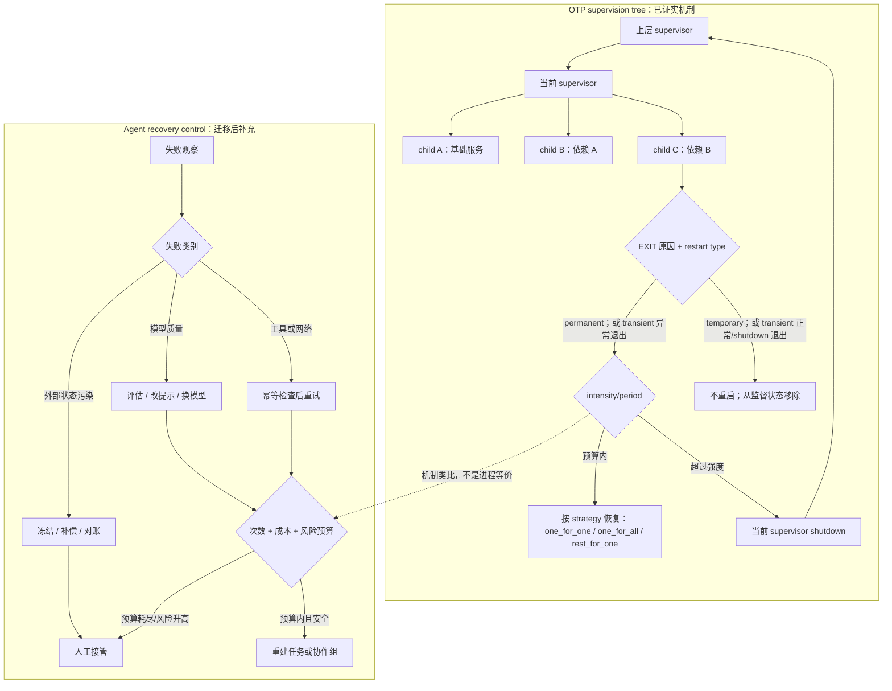

# Erlang/OTP Supervision Tree：把失败恢复设计成层级控制协议

Erlang/OTP 的监督树不是“遇错重试”技巧，而是一套把进程所有权、失败分类、恢复范围、重启预算和向上升级组合起来的控制协议。它最值得 Agent 系统借鉴的不是 BEAM 语法，而是：执行者不自行决定无限恢复，监督者也不会把所有失败都当成同一种崩溃。

本案例以 Erlang/OTP 29.0.3 在线文档和 Erlang/OTP 上游仓库提交 `295c7737d1b25a270e3fc6fa2b7ec7ad4779cf17` 为证据截面。源码阅读集中在 `lib/stdlib/src/supervisor.erl`，并明确区分 OTP 已实现的行为、可由证据推导的 Agent 设计，以及本文作者的迁移判断。

## 学习问题

1. OTP 为什么把业务 worker 与负责启动、停止、监控的 supervisor 分开，而不是让 worker 自行无限重试？
2. `one_for_one`、`one_for_all`、`rest_for_one` 分别表达什么依赖假设，如何改变故障爆炸半径？
3. `permanent`、`transient`、`temporary` 与 `intensity`、`period` 各自回答哪一类恢复问题？
4. 子进程为何按声明顺序启动、按相反顺序关闭，源码如何维持这个顺序？
5. 超出重启强度后，失败如何从当前 supervisor 升级到更高层，而不是继续原地循环？
6. 当失败来自模型质量、工具依赖或已经污染的外部状态时，哪些 OTP 机制只能类比，哪些必须换成显式补偿和人工接管？

## 一页摘要

**已证实事实**：OTP supervisor 负责启动、停止和监控子进程。子规格声明启动函数、重启类型、关闭方式与 worker/supervisor 类型；监督标志声明重启策略和最大重启强度。普通静态子进程按规格列表从左到右启动、从右到左终止。一个子进程退出后，`permanent` 总会重启，`transient` 只在异常退出时重启，`temporary` 从不重启。超过 `MaxR`/`MaxT` 窗口允许的重启次数时，supervisor 终止其子进程并以 `shutdown` 退出，上一级 supervisor 再决定重启它还是继续终止。

**基于证据的推断**：监督树的核心抽象是“故障域的层级所有权”。每一层只处理自己能安全恢复的范围；恢复失败或预算耗尽时，扩大上下文，让更高层重新建立更大的不变量。`rest_for_one` 尤其说明，恢复范围应由依赖顺序决定，而不是由“谁报错”单独决定。

**个人分析**：Agent 系统可以复用层级所有权、恢复策略、预算和升级协议，但不能把 LLM 调用伪装成 BEAM 进程。BEAM 进程便宜、隔离、可由 supervisor 重建；LLM Agent 往往成本更高、状态来自多个存储，并可能已经发邮件、付款、改数据库或调用真实设备。进程重新启动不等于语义恢复，更不等于撤销外部副作用。

| OTP 概念 | 它控制的问题 | Agent 系统中的有限映射 | 必须补上的语义 |
| --- | --- | --- | --- |
| child specification | 谁拥有子进程，怎样启动、重启、关闭 | 任务/Agent 运行契约 | 输入快照、模型/提示/工具版本、权限与副作用级别 |
| restart type | 哪些退出原因值得重启 | 按失败类别决定重试/结束 | 质量失败与基础设施失败的独立分类器 |
| restart strategy | 一个失败影响哪些兄弟 | 单任务、协作组、依赖后缀恢复 | durable state、幂等键、补偿条件 |
| intensity + period | 何时停止局部恢复 | 时间窗内尝试/成本预算 | token、金额、延迟、供应商限额与风险预算 |
| supervisor escalation | 谁拥有更大范围的恢复 | 上层编排器、事故队列、人工值守 | 可解释证据包、审批权限、接管 SLA |

## 事实边界

**已证实事实**

- 官方 `Supervisor Behaviour` 文档把 supervisor 定义为负责启动、停止和监控子进程的进程；子进程可以是 worker，也可以是另一个 supervisor，从而形成层级监督树。
- 静态子进程由有序 child specification 列表定义。普通 supervisor 启动时按列表从左到右启动，终止时按相反顺序从右到左关闭。
- `one_for_one` 只重启退出的子进程；`one_for_all` 终止其余子进程后重启全部；`rest_for_one` 终止退出子进程之后启动的子进程，再从退出位置向后重启。
- `permanent` 子进程无论退出原因都会重启；`transient` 只在退出原因不是 `normal`、`shutdown` 或 `{shutdown, Term}` 时重启；`temporary` 永不重启，即使它因兄弟失败被 `one_for_all` 或 `rest_for_one` 终止。
- `intensity` 与 `period` 约束时间窗内允许的重启。官方语义是：最近 `MaxT` 秒内发生超过 `MaxR` 次重启时，supervisor 终止全部子进程并以 `shutdown` 退出；默认值分别是 `1` 和 `5`。
- 官方设计原则明确写出：当前 supervisor 因强度超限退出后，更高一层 supervisor 会采取行动，要么重启该 supervisor，要么也终止自己。这是故障向上升级，而不是当前层继续无限重试。
- child specification 的 `shutdown` 可以是 `brutal_kill`、毫秒超时或 `infinity`。超时模式先发送 `shutdown` 退出信号；超时后再发送 `kill`。worker 默认 `5000` 毫秒，supervisor 默认 `infinity`。
- 上游源码中的 `handle_info({'EXIT', Pid, Reason}, State)` 将子进程退出交给 `restart_child/3`；`do_restart/3` 按重启类型与退出原因分流；`restart/2` 先调用 `add_restart/1`，强度超限时返回 `{shutdown, ...}`。

**基于证据的推断**

- `one_for_all` 适合共享不可分割内存状态或协议阶段的协作组；`rest_for_one` 适合存在明确启动依赖的流水线。官方描述的是进程动作，“共享不可分割状态”与“流水线”是从动作范围推导出的选择条件，不是 OTP 自动识别的依赖。
- `intensity`/`period` 同时限制瞬时 burst 和长期失败速率。官方调优章节说明同一平均速率可能有不同 burst 行为，并警告多层 supervisor 的可重启次数会相乘，因此预算必须按整棵树校验，而不是每层独立拍值。
- supervisor 与 worker 的分离意味着恢复策略不应嵌入业务循环。源码让 supervisor 统一接收 `EXIT`、记账和升级，因此监控、策略与业务执行可以独立演进。
- 关闭顺序不是礼仪，而是依赖协议：先启动的基础子进程最后关闭，后启动的消费者先停止。Agent 系统若存在会话、工具代理和结果发布器的依赖，也需要明确的 drain/close 顺序。

**个人分析与未知项**

- 本案例将 OTP 监督语义迁移到 Agent 运行控制，不主张 BEAM 进程等同于 LLM Agent，也不主张 OTP supervisor 原生理解模型置信度、事实正确性、外部事务或人工审批。
- OTP supervisor 依据进程退出原因工作；一个进程即使产出幻觉、违反业务规则或返回低质量答案，也可能“正常退出”。质量失败必须由评估器、业务规则或人工反馈显式产生，不能等同于 crash。
- 工具调用失败可能是可重试的超时，也可能是已提交但响应丢失。后者若直接重放会制造重复副作用，必须先查询外部事实或使用幂等键，不能照搬“重启子进程”。
- 已污染的数据库、已发送的消息和已执行的支付不会因 Agent 进程退出自动回滚。恢复前需要补偿、冻结、对账或人工裁决。
- OTP 监督树主要表达有链接关系的本地进程层级；它不是跨节点 Agent 发现、分布式事务或长期工作流引擎。将其归入经典分布式案例，是借鉴其容错控制机制，不是宣称一棵 supervisor tree 自动解决所有分布式故障。
- 本分析访问与截断日期均为 2026-07-22；上游 `master` 当日固定为提交 `295c7737d1b25a270e3fc6fa2b7ec7ad4779cf17`。之后的文档和实现变化不在结论范围内。

## 架构图

下图左侧是 OTP 已实现的监督路径，右侧是迁移到 Agent 平台时必须增加的语义闸门。虚线表示有限类比，不表示两者运行时等价。

左侧流程按默认 `auto_shutdown=never` 建模，因此“不重启”分支只表达 child 不再恢复，没有把 significant child 的自动关闭混入 restart type 判断。

图中 OTP 的升级事件是 supervisor 自身退出；Agent 平台中的升级不应只是一条异常。它至少要携带任务版本、输入与状态快照、已执行工具调用、外部资源标识、尝试历史、评估结果、费用与风险预算，才能让更高层或人工安全接管。

## 控制权与任务流

**Worker 与 supervisor 的职责分离。** OTP worker 承担业务行为，supervisor 持有 child specification、处理退出信号、选择重启范围并执行关闭。子进程通过 `start` 指定的函数被创建并与 supervisor 建立链接；supervisor 设置 `trap_exit` 后把退出信号作为消息处理。业务进程不拥有“我还能重启几次”的最终决定权。

**五层决策顺序。** 一次退出不是直接进入某种 strategy。实际逻辑先找到退出的 child，再用 restart type 与退出原因决定是否需要重启；只有需要重启时才记入强度窗口，随后应用 `one_for_one`、`one_for_all` 或 `rest_for_one`。如果记账结果已超限，则不再进入局部策略，而是让当前 supervisor 退出。

| 决策层 | 输入 | OTP 动作 | Agent 迁移问题 |
| --- | --- | --- | --- |
| 1. 识别对象 | `Pid` | 找到对应 child spec | 哪个任务、Agent、工具调用或协作组失败？ |
| 2. 判断是否恢复 | exit reason + restart type | 进入重启路径或从监督状态移除 | 这是 crash、质量失败、工具失败还是业务拒绝？ |
| 3. 检查局部预算 | `intensity` + `period` | 允许重启或当前层 shutdown | 是否还满足次数、费用、时限、配额和风险预算？ |
| 4. 选择恢复范围 | strategy + child order | 单个、全部或依赖后缀 | 哪些状态共享同一不变量，哪些结果已可安全保留？ |
| 5. 向上升级 | supervisor exit | 父 supervisor 重启或继续退出 | 上层是否能扩大恢复范围，还是必须交给人？ |

**三种策略的依赖含义。** `one_for_one` 假设兄弟彼此独立，单个 child 可从 child spec 重建；`one_for_all` 假设协作组不能保留部分旧成员；`rest_for_one` 把声明顺序用作依赖顺序，只重建故障点及其后继。若团队无法说清依赖关系，就不应通过“看起来更稳”来选择更大的重启范围。

**启动和关闭顺序。** 源码注释显示，内部 children 容器在启动后保存为终止顺序。`start_children/2` 依规格启动，`terminate_children/2` 按内部终止顺序处理，然后返回可再次启动的顺序。对 Agent 系统，相应协议应是：先停结果发布与新工具调用，再 drain 执行者，最后关闭共享会话/租约；恢复时反向建立基础设施、会话、执行者和发布端。

**向上升级。** 当前 supervisor 不知道如何修复整个应用，它只在局部预算内行动。达到最大重启强度后，它终止并让父层看到新的失败；父层拥有更大的子树和更多上下文，可以重启整个子系统，或继续退出到应用边界。Agent 系统应把“人工接管”设计成监督层级的合法终点，而不是无穷层级之后的临时补丁。

## 关键源码导读

以下位置均指向固定提交 `295c7737d1b25a270e3fc6fa2b7ec7ad4779cf17`，避免 `master` 漂移。

| 源码 seam | 已证实行为 | 阅读价值 |
| --- | --- | --- |
| [`supervisor.erl` 50–113](https://github.com/erlang/otp/blob/295c7737d1b25a270e3fc6fa2b7ec7ad4779cf17/lib/stdlib/src/supervisor.erl#L50-L113) | 文档内嵌了子进程顺序、三种策略与重启强度语义 | 先建立公开契约，再读实现 |
| [`init/1` 与 `init_children/2` 949–980](https://github.com/erlang/otp/blob/295c7737d1b25a270e3fc6fa2b7ec7ad4779cf17/lib/stdlib/src/supervisor.erl#L949-L980) | supervisor 设置 `trap_exit`，校验 flags/spec，启动失败时终止已启动 children 并退出 | 初始化本身也遵循“部分失败要清理” |
| [`start_children/2` 993–1017](https://github.com/erlang/otp/blob/295c7737d1b25a270e3fc6fa2b7ec7ad4779cf17/lib/stdlib/src/supervisor.erl#L993-L1017) | 注释明确输入是启动顺序、返回容器是反向终止顺序；任一启动失败会中止 | 顺序是数据结构不变量，不是文档口号 |
| [`handle_info/2` 1275–1310](https://github.com/erlang/otp/blob/295c7737d1b25a270e3fc6fa2b7ec7ad4779cf17/lib/stdlib/src/supervisor.erl#L1275-L1310) | `EXIT` 进入 `restart_child/3`；返回 `shutdown` 时 `gen_server` 停止；terminate 回调关闭 children | 退出、重启与 supervisor 自身终止是一条完整控制流 |
| [`do_restart/3` 1418–1470](https://github.com/erlang/otp/blob/295c7737d1b25a270e3fc6fa2b7ec7ad4779cf17/lib/stdlib/src/supervisor.erl#L1418-L1470) | `permanent` 总重启；正常退出的非 permanent child 被删除；`transient` 异常时重启；`temporary` 被删除 | restart type 在 strategy 之前过滤 |
| [`restart/2` 与策略分支 1472–1562](https://github.com/erlang/otp/blob/295c7737d1b25a270e3fc6fa2b7ec7ad4779cf17/lib/stdlib/src/supervisor.erl#L1472-L1562) | 先 `add_restart`；超限报告 `reached_max_restart_intensity` 并返回 shutdown；三个策略分别实现单 child、分割后缀和全组恢复 | 恢复预算与恢复范围是正交维度 |
| [`terminate_children/2` 与 `shutdown/1` 1571–1657](https://github.com/erlang/otp/blob/295c7737d1b25a270e3fc6fa2b7ec7ad4779cf17/lib/stdlib/src/supervisor.erl#L1571-L1657) | 按终止顺序逐个关闭；超时先等待 `DOWN`，再 `kill`；异常关闭原因会报告 | 停止也需要协议、超时和可观测性 |
| [`add_restart/1` 2248–2290](https://github.com/erlang/otp/blob/295c7737d1b25a270e3fc6fa2b7ec7ad4779cf17/lib/stdlib/src/supervisor.erl#L2248-L2290) | 用单调时钟记录窗口内重启；`intensity = 0` 直接拒绝；过期记录被裁剪 | 预算实现应抗系统时钟跳变，并精确定义边界 |

一个容易漏掉的细节是“重启启动失败”。策略分支不是同步死循环调用 start：失败 child 被标记为 `restarting`，随后通过 cast 把控制权还给 `gen_server` 再尝试，因此 supervisor 仍可处理关闭等消息。但每次重试仍会再次经过强度记账，最终可以升级，避免永久占住控制循环。

另一个细节是强度窗口使用 `erlang:monotonic_time(second)`，而不是墙上时钟。Agent 平台若把恢复预算实现为 durable 记录，需要定义单进程单调时间与跨进程/跨机器持久时间之间的转换；仅照抄内存时间戳无法支撑跨重启的长期任务。

## 架构决策与权衡

**策略选择不是可靠性等级。** `one_for_all` 的恢复范围更大，但不必然更可靠；它会主动杀死仍健康的兄弟，放大延迟和成本。`one_for_one` 范围最小，却可能保留与新 child 不兼容的旧状态。决策依据应是共享不变量与依赖图。

| 条件 | 首选策略 | 代价 | Agent 示例 |
| --- | --- | --- | --- |
| 子任务状态独立、输出可分别验证 | `one_for_one` | 必须证明没有隐式共享状态 | 独立检索分片失败，只重跑该分片 |
| 所有成员共同维护一次协议阶段 | `one_for_all` | 健康成员也被重建，成本最高 | 多角色共同生成一个未提交草稿，任一成员状态损坏后全组重建 |
| child 顺序就是依赖顺序 | `rest_for_one` | 规格顺序变成架构契约 | 会话 → 规划 → 执行 → 发布，规划失效后重建规划及后继 |
| 失败已产生不可逆副作用 | 三者都不直接适用 | 必须先查证、冻结或补偿 | 支付已提交但响应丢失 |
| 失败是低质量但进程正常 | 三者都不自动触发 | 需要显式评估信号 | 答案格式正确但事实错误 |

**restart type 与业务终态。** `temporary` 很适合“完成后不再回来”的一次性进程；但 Agent 任务的“模型回答完成”不等于业务成功。迁移时应让确定性验收产生 `succeeded`、`retryable_failed`、`non_retryable_failed`、`needs_review` 等业务终态，再映射到是否重建，不能直接用运行时退出码替代。

**强度与成本预算。** OTP 官方警告多层 intensity 会相乘。Agent 任务还会叠加模型回合数、工具重试、工作流重启与人工退回，若每层各允许三次，总调用量可能呈乘法增长。预算应从顶层向下分配，并以全局任务 ID 汇总 token、金额、时间、外部写次数和供应商配额。

**顺序还是显式依赖图。** `rest_for_one` 用线性 child order 编码依赖，简单且确定，但复杂 Agent 工作流往往是 DAG。可以借鉴“只重建失败点之后的依赖者”，但实现应根据版本化依赖图计算失效集合，而不是为了模仿 OTP 强行压成一条列表。

**自动恢复还是人工接管。** 可重建的纯计算、只读工具和带幂等键的写操作可以在预算内自动恢复；权限升级、外部状态不确定、连续质量失败或高风险动作应进入人工队列。人工接管需要明确所有者和截止时间，否则只是把无限重试换成无限等待。

## 生产化分析

**失败分类必须先于恢复。** 建议至少区分四类：运行时 crash（进程/容器异常）、模型质量失败（不符合事实或业务标准）、工具失败（超时、限流、认证、确定性拒绝）和外部状态污染（重复提交、部分写入、越权变更）。同一个表面错误可能落入不同类别，例如工具超时既可能“未执行”，也可能“已执行但响应丢失”。分类结果必须带证据和置信度。

**恢复前置条件。** 自动重试必须同时满足：输入可重放、依赖版本可固定、外部写可证明幂等或尚未发生、凭证仍有效、预算尚余、风险等级允许。若任一条件未知，先查询事实或升级，不把“再试一次”当默认安全动作。

**durable state 与重建边界。** OTP child 可以由 `{M,F,A}` 重新调用；Agent 的可重建规格应至少固定任务输入、提示版本、模型与参数、工具 schema、知识库快照/版本、权限、检查点、已完成步骤和外部资源 ID。敏感凭证应通过短期引用重新获取，不能被复制进接管证据包。

**关闭与 drain。** 生产系统需要类似 OTP shutdown 的两阶段语义：先停止接收新工作并发送取消/关闭请求，在截止时间内等待运行中工具调用结束；超时后终止计算资源，但把结果标记为 `unknown` 而非自动认定失败。对未知结果的写调用必须对账，不能马上重放。

**升级证据包。** 每次从局部 supervisor 升级，应生成机器可读事件：`task_id`、失败类别、失败组件、尝试次数、首末时间、策略、预算消耗、输入/检查点版本、工具调用与幂等键、外部状态、评估证据、建议动作和所需审批权限。上层与人类都应基于同一份事实工作。

**可观测性与 SLO。** 除 crash count，应跟踪每类失败的自动恢复成功率、恢复耗时、重启放大系数、重复副作用数、未知外部状态停留时间、升级率、人工接管等待时间与每个成功任务的恢复成本。单独看“最终成功率”会掩盖昂贵的重试风暴。

**演练与发布门禁。** 在预发布环境注入模型超时、错误但格式合法的答案、工具 429、响应丢失、部分写入和 supervisor 崩溃；验证恢复范围、预算、关闭顺序、证据包与人工队列。新策略上线应灰度，并允许按任务版本回滚，而不是修改所有进行中任务的语义。

**安全与滥用边界。** 重启会重新触发模型和工具权限，攻击者可能用恶意输入制造成本放大或重复副作用。预算、幂等、最小权限、参数校验和速率限制必须在确定性控制层执行；不能依赖重启后的模型“记得谨慎”。

一个可操作的生产判定顺序是：先阻止新副作用，再确认外部事实；能安全重放则在剩余预算内选择最小恢复范围；不能确认则冻结并升级；只有更高层能重新建立不变量时才扩大恢复范围；超过风险阈值直接进入人工接管。

## 可迁移经验

### 可直接复用的机制

1. **监督与执行分离。** 让确定性控制层拥有生命周期、预算和升级，Agent 只在授权范围内执行。
2. **显式恢复范围。** 为单任务、协作组和依赖后缀分别定义策略，不把所有错误都变成全局重跑。
3. **窗口化重启预算。** 同时限制 burst 与长期失败速率，并让多层预算从顶层统一核算。
4. **层级升级。** 当前层只能处理局部不变量；预算耗尽时把结构化证据交给拥有更大上下文的一层。
5. **有序启动与反向关闭。** 把依赖顺序写入运行契约，并测试部分启动失败和超时关闭。
6. **失败恢复可观测。** 每次关闭、重建、重试和升级都形成可关联事件，而不是只留下最终异常。

### 只能有限类比的部分

1. **restart type。** 可映射到业务终态，但 Agent 需要质量评估和外部事实，不能只看进程退出原因。
2. **`rest_for_one`。** “只重建依赖后继”可复用，线性列表不适合表达所有 DAG。
3. **child specification。** 可作为可重建运行契约，但必须扩展版本、状态、权限、预算和副作用信息。
4. **supervisor escalation。** 可映射为上层编排与人工接管；在 Agent 系统中升级应是 durable 事件，不应依赖单机链接仍然存在。
5. **shutdown timeout。** 可借鉴先优雅停止再强制终止，但强杀计算不会撤销已经发出的外部命令。

### 不应照搬的部分

1. **不要把 BEAM 进程等同于 LLM Agent。** 两者在成本、确定性、状态位置与副作用模型上不同。
2. **不要把 crash 当成全部失败。** 幻觉、合规违规和低质量结果常以“正常返回”结束。
3. **不要默认重放工具调用。** 响应丢失可能发生在外部提交之后，必须使用幂等键或先对账。
4. **不要假设重启清空状态。** durable memory、数据库和外部系统可能保留污染，甚至扩大不一致。
5. **不要逐层独立设置三次重试。** 层级预算会乘法放大调用量、成本和风险。
6. **不要用进程树替代长期工作流。** 跨节点恢复、检查点、补偿、审批和多日任务需要额外的 durable orchestration。
7. **不要让人工接管成为无主死信箱。** 必须定义负责人、证据、权限、SLA 与恢复/终止动作。

## 来源

以下均为 Erlang/OTP 官方或上游一手来源。访问日期与来源截断日期：**2026-07-22**。上游仓库 HEAD 当日解析并固定为 `295c7737d1b25a270e3fc6fa2b7ec7ad4779cf17`。

- [Supervisor Behaviour — OTP Design Principles](https://www.erlang.org/doc/system/sup_princ.html) — 监督原则、三种策略、最大重启强度、向上升级、child specification、自动关闭与停止顺序。在线页面核对版本为 Erlang/OTP 29.0.3。
- [`supervisor` — STDLIB](https://www.erlang.org/doc/apps/stdlib/supervisor.html) — supervisor flags、restart type、shutdown 语义、默认值和公开 API 契约。
- [Erlang/OTP 上游仓库固定提交](https://github.com/erlang/otp/tree/295c7737d1b25a270e3fc6fa2b7ec7ad4779cf17) — 本案例的源码证据基线。
- [`lib/stdlib/src/supervisor.erl` 固定版本](https://github.com/erlang/otp/blob/295c7737d1b25a270e3fc6fa2b7ec7ad4779cf17/lib/stdlib/src/supervisor.erl) — `EXIT` 处理、restart type 分流、strategy 实现、重启强度记账、子进程顺序和 shutdown 实现。

证据标签说明：`已证实事实` 仅陈述上述官方文档或固定源码直接支持的行为；`基于证据的推断` 把这些行为解释为依赖、故障域与预算设计；`个人分析` 给出迁移到 LLM Agent 系统时需要新增的质量、幂等、补偿和人工接管机制。
