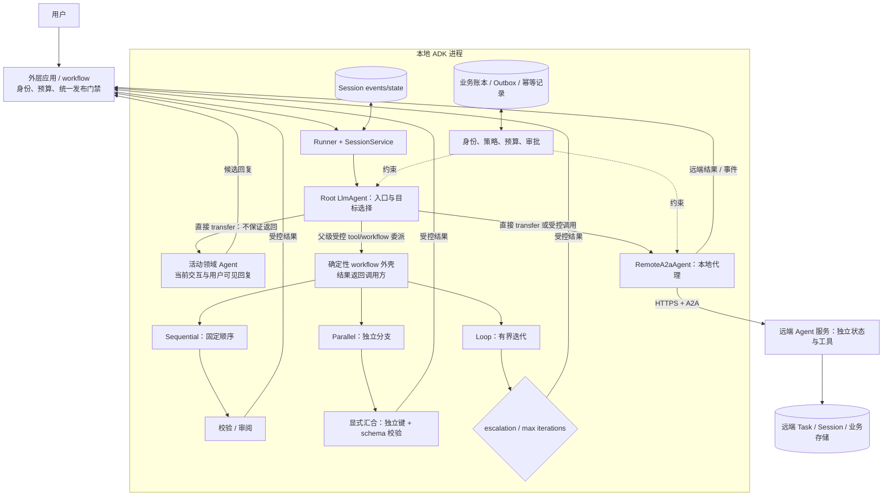
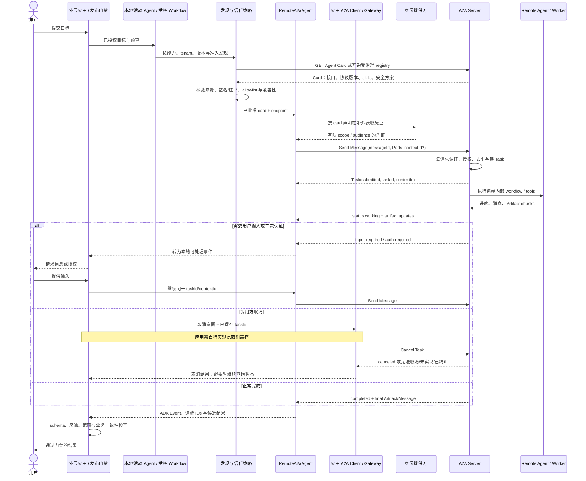

# Google ADK 与 A2A：从本地层级编排到跨系统智能体协作

把 `RemoteA2aAgent` 放进本地 `sub_agents` 列表，只统一了调用接口，没有把远端服务变成本地对象。网络、身份、版本、任务状态和部分失败仍然存在，只是被代理对象包在同一棵 agent tree 里。

因此要先拆开两类边界。本地 ADK 用父子树、workflow 和 Session 组织同一应用；A2A 用 Agent Card、Message、Task 与 Artifact 连接独立系统。MCP 又位于工具与数据边界，不能替 A2A 持有远端 agent 的任务生命周期。

版本与源码入口由固定证据截面核验。沿着一次本地委派跨到远端服务时，正文持续追问信任、取消、工具副作用和人工对账由谁承担。

## 学习问题

1. ADK 的父子智能体树怎样约束所有权，LLM 驱动的 `transfer_to_agent` 又转移了什么、没有转移什么？
2. `SequentialAgent`、`ParallelAgent`、`LoopAgent` 的确定性外壳与 LLM 动态路由应怎样组合，何时应直接采用新一代 workflow/graph？
3. `Session`、`state`、`InvocationContext`、`temp:`、`user:` 与 `app:` 分别是什么作用域，本地共享上下文怎样避免并发写冲突？
4. 一个本地 ADK 子智能体变成 `RemoteA2aAgent` 后，Agent Card、Message、Task、Artifact 和 `contextId` 怎样形成跨系统通信边界？
5. A2A 与 MCP 分别解决 agent-to-agent 和 agent/application-to-tool/data 的什么问题，为什么两者可以共存但不能互相提供信任或分布式事务？

## 一页摘要

先看调用是否跨越独立部署和所有权。若没有，函数、tool、本地子智能体或 workflow 已能表达控制；只有远端系统真正拥有自己的任务与演进节奏时，A2A 才增加价值。

**已证实事实**：本地 `BaseAgent` 以 `sub_agents` 形成单父树。`transfer_to_agent` 让目标 agent 成为当前 interaction 的活动处理者并产生用户可见回复，不保证控制回到父 agent。只有 tool、workflow 或应用 wrapper 形式的受控委派，才把结果返回调用方继续聚合。

Session 保存本地事件与 state；无前缀、`user:`、`app:` 和 `temp:` 对应不同作用域。持久性取决于 SessionService，共享 invocation 也不提供并发事务。

A2A 跨服务发送 Message，远端可以直接答复，也可以创建有状态 Task。Agent Card 声明接口、版本、能力、skills 与安全方案；Task 用 status 和 Artifact 表达进度、等待输入与交付物。

**基于证据的推断**：本地层级与 A2A 联邦是两个治理层。直接 transfer 把当前回复权交给目标 agent；父级受控委派才保留调用方聚合权。若系统需要统一发布门禁，它应位于外层应用或 workflow，而不能假定 Root 总会重新取得控制。远端服务仍拥有自己的任务、工具和恢复。

| 边界 | 调用对象 | 控制与状态所有者 | 适合场景 | 不自动保证 |
| --- | --- | --- | --- | --- |
| 本地函数/工具 | 确定性能力 | 调用 agent / host | 短操作、结构化输入输出、低开销 | 领域推理、长任务协议 |
| 直接 `transfer_to_agent` | 同进程或远端代理 agent | 目标成为当前活动 agent，负责当前交互与可见回复 | 用户应直接切换到领域处理者 | 自动返回父 agent、统一聚合 |
| 父级受控 tool/workflow 委派 | 本地或远端能力 | 调用方保留流程控制并接收结果 | 比较、汇合、统一回答与门禁 | 子智能体正确性、业务 exactly-once |
| A2A remote agent | 独立 agent 服务 | 本地只持代理；远端持任务与内部实现 | 跨进程、团队、语言、框架 | 信任、可用性、全局事务、自动版本兼容 |
| MCP server | 工具、资源、prompt 等能力 | host 管理 client 与上下文边界 | agent/application 访问工具和数据 | 对等 agent 的任务协商与生命周期 |

**个人分析**：同一进程先用函数、tool 或本地子智能体，固定骨架用 workflow。独立部署和互操作边界真实存在时才引入 A2A；工具与数据连接继续使用 MCP。

## 事实边界

事实必须分别落在本地运行时、A2A 协议和具体适配器三层。协议包含一项操作，不等于固定 ADK adapter 已经实现；本地代理能挂进树，也不等于远端状态变成本地 Session。

### 已证实事实

ADK 建议多数项目从单 agent 开始。Agent name 在树中唯一，一个实例只有一个 parent；description 参与委派选择。`disallow_transfer_to_parent` 和 `disallow_transfer_to_peers` 只限制路径，不是授权系统。

Sequential 共享 InvocationContext 并按顺序运行。Parallel 创建分支 context，要求分支独立且结果顺序可能不稳定；Loop 必须以 `max_iterations` 或 escalation 终止。

来源截断时，ADK 2.0 已用 graph/dynamic workflow 取代模板 workflow 的推荐位置，Python 三个模板类也有 deprecation 标记。旧系统仍需理解其语义，新项目不能假设 API 长期稳定。

Session 以 app、user、session 标识对话，保存 events 和可序列化 state。状态应通过 Context 或 Event delta 更新；直接修改读出的 `Session.state` 可能绕过追踪并丢失数据。

InMemorySessionService 重启即丢失，DatabaseSessionService 与 VertexAiSessionService 提供持久化。持久 session 仍不是业务事务、消息队列或灾备保证。

`RemoteA2aAgent` 是本地代理，请求实际经过 A2A client 与网络。它解析 Agent Card，在 ADK Event 与 A2A Message/Task 间转换，并把远端 task/context ID 保存在事件 metadata。

Agent Card 是 JSON 元数据，包含 supported interfaces、binding/version、capabilities、skills 和 security schemes。发现可用 well-known 路径、受治理 registry 或直接配置；规范没有统一 curated registry API。

Send Message 可返回 Message 或 Task。`contextId` 关联连续交互，`taskId` 继续特定任务；Message 表达 turn，Artifact 表达交付物，Part 承载文本、文件或结构化数据。

A2A 1.x 把 canonical model、operations 与 JSON-RPC/gRPC/HTTP+JSON binding 分层。客户端必须按 Agent Card 选择兼容接口，不能假设统一路径和序列化。

Cancel Task 只要求尝试取消。Cancel 操作幂等，Send Message 只可能借助 `messageId` 去重；push notification 至少一次，接收端必须处理重复。

固定 ADK Python A2A executor 的 `cancel()` 仍抛出 `NotImplementedError`。协议包含取消，不等于这项 adapter 已实现端到端取消。

A2A 面向独立 agent 协作，MCP 的 host-client-server 面向 tools、resources 与 prompts。两者互补，但安全与状态边界各自独立。

### 基于证据的推断

静态父子树是本地能力目录，dynamic transfer 是树上的控制指针变化。父 agent 能转移到远端代理，不代表拥有远端 state、tools 或 memory。

共享 InvocationContext 适合顺序传值，不是并行事务。Parallel 应写独立 key 后确定性汇合；共享可变对象要依靠外部并发控制。

Agent Card 是自我声明，不是信任证明。客户端仍需验证来源、证书/签名、准入和撤销状态。

A2A Task 是远端协议状态机，不是跨系统 saga。Task completed 不能证明本地数据库、MCP 工具和第三方系统原子提交；业务仍需幂等、outbox、补偿和人工对账。

### 个人分析与未知项

ADK 不替应用决定 tenant 映射、Card 信任根、OAuth audience/scope、数据驻留、远端 SLO、重试预算、业务幂等或补偿。A2A 统一 envelope，不统一领域 ontology、质量标准和错误语义。

  
证据：固定 ADK、文档与 A2A 协议快照

  - **来源截断：** `2026-07-20`
  - **分支：** ADK Python 核对时为 `main`
  - **ADK Python：** `google/adk-python@be5828f317c7430411df29974cd9ccfa875e90de`
  - **ADK 文档：** `google/adk-docs@3e6ee758f2a642abf42b6a92682bb113e7fb0743`
  - **A2A：** `a2aproject/A2A@af112d9491c1fd4b2a568ac65755af4a62790490`
  - **边界：** 固定快照不支持外推后续 release、弃用状态、默认值或字段语义。

## 架构图

下面两张图故意不合并。本地图回答“谁能在同一应用里委派”，A2A 图回答“两个独立系统怎样交换任务”；它们是生产化组合，不是 ADK 自动部署拓扑。

### 本地层级与确定性工作流

文字等价描述：

1. 外层应用完成身份、预算与发布策略检查，Runner 再从 SessionService 装载会话并启动根 `LlmAgent`。
2. 直接 transfer 让目标 agent 接管当前 interaction 和用户可见回复，不保证返回 Root。父级受控 tool/workflow 委派才让调用方继续聚合；Sequential、Parallel 与 Loop 分别固定顺序、汇合和终止边界。
3. `RemoteA2aAgent` 在本地仍是一个子节点，但它只是一段协议适配器；真正的 remote agent 在另一服务中拥有自己的任务、会话、工具和存储。
4. 身份、授权、成本、审批与副作用幂等不能交给 transfer 自动决定。统一发布门禁属于外层应用/workflow；远端实际行动还要再次授权，业务账本记录权威事实。

### 跨系统 A2A 请求与任务生命周期

文字等价描述：

1. 客户端从受治理 registry、可信配置或 well-known endpoint 取得 Agent Card，并在模型看见候选之前检查来源、签名/证书、协议版本、binding、媒体类型和安全策略；公开 URL 不能直接变成可信依赖。
2. 凭证在 A2A payload 之外通过标准 HTTP/OAuth 等机制取得和发送。远端服务对每次请求重新认证并按 skill、数据和动作授权。
3. 客户端发送带唯一 `messageId` 的 Message。远端可立即返回 Message，或创建 `taskId` / `contextId` 并发送状态和 Artifact 更新。
4. `input-required` 与 `auth-required` 是可继续的中断状态；completed、failed、canceled、rejected 是终态。图中的 Cancel Task 由应用自建、支持取消的 A2A client/gateway 发出，不是固定版本 `RemoteA2aAgent` 的现成功能。该代理没有把本地取消意图端到端映射为协议操作，而固定版本 ADK 服务端 executor 的 `cancel()` 也可能未实现；即使服务实现了取消，调用者仍必须接受“无法取消或已经完成”的结果。
5. 远端结果进入外层应用/workflow 后仍要经过 schema、来源、策略和业务一致性检查。两侧分别持久化，图中没有全局 commit 点。

## 控制权与任务流

**说明性场景｜外层应用完成确定性校验，Root 随后把当前 interaction 直接 transfer 给远端 agent。** 该场景只组合 ADK tree、Session 和 A2A Message/Task 机制，不代表真实客户或生产事故。

外层应用先校验用户、预算和远端 skill allowlist，再启动 Root。Root 调用 `transfer_to_agent` 后，`RemoteA2aAgent` 成为当前 interaction 的活动处理者；它产生用户可见回复，控制不保证自动回到 Root。

远端可以返回 Message，也可以创建 Task 并进入 working、input-required 或 auth-required。此时本地 Session 只保存远端 ID 映射，Task 的真实状态、内部工具与恢复策略仍归远端服务。

如果改用 tool、workflow 或应用 wrapper 做父级受控委派，远端结果才返回调用方继续聚合。无论哪条路径，外层应用/workflow 都要校验来源、schema 和业务状态；用户取消等待不代表远端停止，缺少端到端取消时必须查询、补偿或转人工。

### 父子层级：所有权先于路由

**已证实事实**：父 agent 构造 `sub_agents` 时，ADK 为每个子对象设置唯一 `parent_agent`；已归属于另一个父对象的实例不能再次添加。`root_agent` 通过 parent 链上溯，`find_agent()` 从根向下查找。这个对象模型让可委派目标成为一个显式、可枚举的树，而不是任意网络目录。

**基于证据的推断**：一个节点只能有一个父对象，适合表达“谁配置它、哪些目标可达”。它不保证 direct transfer 后回到父节点。需要父级聚合时，应把能力封装成 tool、workflow 或应用 wrapper；跨团队复用也可通过 A2A 建独立服务。

### Transfer 的实际含义

`transfer_to_agent` 是 LLM 可调用的控制工具。运行时把后续执行交给树中命名 agent；父、子和 peer 是否可达由树结构与 `disallow_transfer_*` 配置共同决定。它不会自动：

- 把本地用户 token 换成目标服务可用的凭证；
- 复制所有业务 state 或持久化 remote task；
- 让目标 agent 获得超出自己 tool policy 的权限；
- 保证目标最终会 transfer 回来；
- 为跨服务副作用建立回滚事务。

**个人分析**：把 transfer 看成“当前活动处理者指针”最安全。目标 agent 接管当前交互和可见回复，父 agent 不一定恢复；全局预算、统一发布和升级策略应由外层应用/workflow 持有。高风险 action 还必须在工具或服务边界确定性授权。

### 确定性 workflow 与 LLM 路由

| 机制 | 下一步由谁决定 | 确定的部分 | 仍不确定的部分 | 推荐约束 |
| --- | --- | --- | --- | --- |
| Sequential | 代码中的列表顺序 | 调用先后 | 每个 LLM 子步骤的内容与工具选择 | schema、每步 timeout、失败停止/跳过策略 |
| Parallel | 代码并发启动全部声明分支 | 扇出集合 | 完成顺序、内容、部分失败 | 独立输入、并发上限、join、稳定排序 |
| Loop | 代码重复子序列 | 每轮顺序 | evaluator 判断、迭代内容 | `max_iterations`、总 token/deadline、无改进退出 |
| LLM transfer | 模型选择允许目标 | 候选集合与硬禁用路径 | 选择、回转和调用次数 | 路由 eval、最大 transfer、fallback |
| 代码 router / graph | 程序或结构化分类器 | 可验证边与门禁 | 局部分类/生成 | 枚举校验、默认拒绝、版本化 |

**个人分析**：优先采用“确定性骨架 + 局部 LLM 判断”。付款前审批、数据写入顺序、最大循环与跨域委派必须写进代码；开放式意图识别、候选生成和领域推理可以交给模型。来源截断时的新 ADK 项目还应优先评估 graph/dynamic workflows，而不是继续扩大已弃用模板类的使用面。

### 本地共享上下文

Sequential 的共享 context 让前一步通过 `output_key` 或 state 写结果，后一步再读取。这种便捷只适用于有明确顺序的状态转换。Parallel 分支应使用 `research.result`、`risk.result` 之类独立键，汇合后按 schema 读取；不要让多个分支原地追加同一 list，并期待稳定顺序。

推荐把状态拆成四类：

- `temp:`：当前 invocation 的中间结果、分支完成标记，不跨下一轮；
- session 无前缀：当前对话的任务进度、当前选择和恢复引用；
- `user:` / `app:`：确实需要跨 session 的用户偏好或应用配置，写入前要明确租户和访问控制；
- 业务数据库：订单、支付、配额、幂等键、审批与审计等权威事实。

前两类是 agent 运行上下文，最后一类才是业务记录。把订单状态只写进 `session.state` 会把对话便利机制误当成事务系统。

### 本地和远端是部署选择，不是能力等级

本地 sub-agent 更快、共享对象容易、版本一起发布，适合紧耦合模块。Remote agent 可独立扩缩、跨语言/团队演进，并隐藏内部实现，但新增网络时延、认证、兼容矩阵、部分失败和治理成本。远端不比本地“更智能”，本地也不比远端“更可信”；信任来自身份、代码供应链、策略、运营记录和评估证据。

## 关键源码导读

源码阅读应先确认边界跨越的位置。最短路径是 `base_agent.py` 看本地树，`remote_a2a_agent.py` 看代理转换，再到 executor 与 A2A 规范核对远端 Task 和取消。

四个 ID 要始终分开：ADK `session_id` 表示本地对话，`invocation_id` 表示一次本地请求，A2A `contextId` 表示远端交互分组，`taskId` 表示远端有状态工作。映射不等于身份或授权。

  
证据：本地 ADK 到远端 A2A 的完整阅读路径

1. [`src/google/adk/agents/base_agent.py`](https://github.com/google/adk-python/blob/be5828f317c7430411df29974cd9ccfa875e90de/src/google/adk/agents/base_agent.py)：看 `name`、`parent_agent`、`sub_agents`、唯一名称校验、单父约束、`root_agent` 与 `find_agent()`。这是本地层级所有权的事实入口。
2. [`src/google/adk/agents/llm_agent.py`](https://github.com/google/adk-python/blob/be5828f317c7430411df29974cd9ccfa875e90de/src/google/adk/agents/llm_agent.py)：看 `disallow_transfer_to_parent`、`disallow_transfer_to_peers`、`_get_subagent_to_resume()` 与根树查找。重点区分 LLM 路由与静态父子所有权。
3. [`sequential_agent.py`](https://github.com/google/adk-python/blob/be5828f317c7430411df29974cd9ccfa875e90de/src/google/adk/agents/sequential_agent.py)、[`parallel_agent.py`](https://github.com/google/adk-python/blob/be5828f317c7430411df29974cd9ccfa875e90de/src/google/adk/agents/parallel_agent.py)、[`loop_agent.py`](https://github.com/google/adk-python/blob/be5828f317c7430411df29974cd9ccfa875e90de/src/google/adk/agents/loop_agent.py)：对照顺序循环、branch context、`TaskGroup` 合并、`max_iterations` / escalation 与当前 deprecation 注释。
4. [`docs/agents/workflow-agents`](https://github.com/google/adk-docs/tree/3e6ee758f2a642abf42b6a92682bb113e7fb0743/docs/agents/workflow-agents)：先读总览中的确定性定义和 ADK 2.0 迁移提示，再读 Sequential 的共享 invocation、Parallel 的独立分支、Loop 的终止条件。
5. [`docs/sessions/state.md`](https://github.com/google/adk-docs/blob/3e6ee758f2a642abf42b6a92682bb113e7fb0743/docs/sessions/state.md) 与 [`docs/sessions/session/index.md`](https://github.com/google/adk-docs/blob/3e6ee758f2a642abf42b6a92682bb113e7fb0743/docs/sessions/session/index.md)：理解事件历史、state prefix、Context 更新方式与 SessionService 的持久化选择。
6. [`src/google/adk/agents/remote_a2a_agent.py`](https://github.com/google/adk-python/blob/be5828f317c7430411df29974cd9ccfa875e90de/src/google/adk/agents/remote_a2a_agent.py)：看 Agent Card 解析、ADK/A2A 转换、`message_id` 生成、远端 `task_id` / `context_id` 如何写入事件 metadata，以及 stateless history 选项。
7. [`src/google/adk/a2a/utils/agent_to_a2a.py`](https://github.com/google/adk-python/blob/be5828f317c7430411df29974cd9ccfa875e90de/src/google/adk/a2a/utils/agent_to_a2a.py)：看 `to_a2a()` 如何组合 Starlette、Runner、Agent Card、task store 与 push config store。注意默认 Runner 和 store 使用内存实现，只适合开发起点。
8. [`src/google/adk/a2a/executor/a2a_agent_executor_impl.py`](https://github.com/google/adk-python/blob/be5828f317c7430411df29974cd9ccfa875e90de/src/google/adk/a2a/executor/a2a_agent_executor_impl.py)：沿 submitted → working → completed/failed 事件看协议映射，并核对 `cancel()` 当前未实现的边界。
9. [`specification/a2a.proto`](https://github.com/a2aproject/A2A/blob/af112d9491c1fd4b2a568ac65755af4a62790490/specification/a2a.proto) 与 [`docs/specification.md`](https://github.com/a2aproject/A2A/blob/af112d9491c1fd4b2a568ac65755af4a62790490/docs/specification.md)：前者是 canonical data objects 与请求/响应的规范源，后者解释 operations、bindings、版本、幂等、任务状态和安全语义。
  10. [`docs/topics/agent-discovery.md`](https://github.com/a2aproject/A2A/blob/af112d9491c1fd4b2a568ac65755af4a62790490/docs/topics/agent-discovery.md)、[`life-of-a-task.md`](https://github.com/a2aproject/A2A/blob/af112d9491c1fd4b2a568ac65755af4a62790490/docs/topics/life-of-a-task.md)、[`a2a-and-mcp.md`](https://github.com/a2aproject/A2A/blob/af112d9491c1fd4b2a568ac65755af4a62790490/docs/topics/a2a-and-mcp.md)：最后建立发现、任务生命周期和协议分工的整体图。

  - **本地符号：** `BaseAgent.name`、`LlmAgent.description`、`Session.events`、`Session.state`、`app_name`、`SessionService`、`InMemorySessionService`、`DatabaseSessionService`、`VertexAiSessionService`。
  - **A2A 符号：** `/.well-known/agent-card.json`、`Send Message`、`NotImplementedError('Cancellation is not supported')`。
  - **仓库：** `google/adk-python`、`google/adk-docs`、`a2aproject/A2A`。
  - **边界：** 源码证明固定 adapter 的转换与限制，不证明远端服务可信、可用或具备业务事务。

## 架构决策与权衡

每项决策都先判断是否跨越独立所有权。层级、workflow 和 A2A 不是能力等级，而是不同范围的控制合同。

### 层级还是扁平能力表

树结构让配置所有者和候选集清楚，也能用不同 instructions 和 tools 隔离领域上下文；它不保证 direct transfer 的返回路径。只有两三个稳定能力时，根 agent 加普通 tools 或一个扁平 router 更简单；需要父级汇合时优先显式 tool/workflow 委派。

### 模板 workflow 还是新 graph/dynamic workflow

经典 Sequential/Parallel/Loop 易读，适合解释和维护既有系统。当前 ADK 2.0 已把更复杂的新工作推荐到 graph/dynamic workflow，说明拓扑演进、分支、恢复和组合需求超出了三个模板的表达力。迁移时要先锁定事件顺序、state key、循环终止和恢复语义；不能只把类名机械替换。

### 本地还是 A2A

只有当独立部署、跨团队所有权、跨语言/框架或正式协议契约是真实需求时，A2A 的成本才合理。若组件同库同进程、需要纳秒/毫秒级调用、频繁共享可变上下文，A2A 会增加序列化、网络和运维负担。反过来，把独立供应商 agent 当本地函数会掩盖身份、版本与故障边界。

### A2A 与 MCP 的清晰边界

**已证实事实**：A2A 处理 agent-to-agent 协作：能力发现、对话 Message、有状态 Task、进度、Artifact、长运行和继续交互。MCP 处理 application/agent-to-tool/data context：host 管理 client，server 提供 tools/resources/prompts，并通过能力协商保持连接隔离。

**个人分析**：判断标准不是“接口是否智能”，而是对方是否拥有自己的目标、状态和多轮协作责任。一个天气查询函数应是 MCP tool；一个会澄清日期、协调供应商并维护预订任务的旅行服务更像 A2A agent。两者可以共存：ADK agent 通过 A2A 委派给远端 agent，远端 agent 再通过 MCP 使用数据库和工具。不要把 MCP server 自动称为 peer agent，也不要把简单 API 包成 A2A Task。

### 发现、信任与兼容

动态发现提升可替换性，但把错误或恶意 Agent Card 纳入模型候选会扩大攻击面。生产 registry 应做供应商准入、card 签名/来源校验、版本与 binding allowlist、skill 级授权、健康与评估门禁。缓存 card 时使用 HTTP cache/ETag，并为撤销和紧急下线保留短路机制。

A2A 版本兼容应在连接前完成：读取 `supportedInterfaces`，选择双方支持的 binding 与 `protocolVersion`，验证所需 capability（streaming、push notification、extended card 等），再校验输入/输出媒体类型和应用 schema。协议兼容只证明 envelope 可交换；领域字段仍需独立 schema version 与契约测试。

## 生产化分析

生产化必须在本地和远端各设一套门禁。任何一个协议 ID 都只能关联任务，不能替代认证、授权或副作用去重。

### 安全、认证与信任边界

- 只允许 HTTPS；验证 TLS server identity。跨组织高敏场景可叠加 mTLS、网络策略与 API gateway。
- Agent Card 声明 security schemes，但凭证通过带外流程获取并放在标准 header 中。服务端必须每请求认证；认证成功后仍要按 tenant、skill、资源和动作授权。
- A2A payload 不应被当成身份来源。`user_id`、`session_id`、`contextId` 和 `taskId` 都是关联标识，不是访问凭证。
- 公开 card 只披露必要技能；敏感细节使用受认证的 extended card 或受治理 registry。签名必须锚定到外部信任根与撤销机制。
- remote agent 是不透明执行边界。客户端必须把其文本、结构化数据、文件 URL 和 Artifact 都当作不可信输入，做 schema、MIME、大小、恶意内容和引用地址校验。
- MCP 连接也保持独立安全边界。remote agent 通过 MCP 获得工具并不意味着 A2A 调用者继承该工具权限；远端必须在实际工具调用处再次授权。

### 取消、重试、幂等与事务

**已证实事实**：A2A Cancel Task 只要求服务尝试取消，取消可能不受支持或任务已终止；Send Message 仅 MAY 通过 `messageId` 去重。固定版本 `RemoteA2aAgent` 没有把本地取消意图映射到 A2A Cancel Task 的端到端 client 路径，ADK 服务端 executor 的 `cancel()` 还直接抛出 `NotImplementedError`。

**基于证据的推断**：因此超时关闭 HTTP 连接、用户点击“停止”和远端副作用停止是三件不同的事。需要取消时，应用必须自建支持该操作的 A2A client/gateway，并在接入时验证远端实现。

生产建议：

1. 为每个业务动作生成稳定 `operation_id`，并在 A2A Message metadata/structured Part 与远端业务数据库中传播；传输重试复用相同 `messageId`，业务重试复用相同 `operation_id`。
2. 只有网络错误、明确可重试状态和未产生外部副作用的阶段才自动重试；使用指数退避、jitter、总 deadline 和 retry budget。
3. 通过应用自建 client/gateway 发出 Cancel 后，继续轮询或订阅直到得到明确终态；若本地 adapter 或远端 executor 不支持 cancel，标记为“本地停止等待，远端可能继续”，并触发对账。
4. Push notification 按至少一次投递设计。A2A 1.0 没有内建通用的 event ID 或 event version 字段；若要用 `taskId + event_id/version` 去重，`event_id` 或单调 `version` 必须由应用写入 metadata。Artifact chunk 可用协议内建 `artifactId` 配合 metadata 中应用自定义的 `chunk_sequence` 去重和排序，并结合 `append` / `lastChunk` 判断拼接语义。
5. 跨本地 state、A2A Task 和 MCP/业务工具的操作使用 saga、outbox、补偿和人工修复队列。不要声称 A2A 提供全局 exactly-once 或两阶段提交。

### 可观测性与评估

ADK Event 的 `invocation_id` 可关联一次本地交互，A2A 提供 `taskId` / `contextId`，HTTP 可传播 W3C trace context。建议在本地 root、RemoteA2aAgent、A2A gateway、remote executor 和 MCP/tool span 中统一记录：

| 维度 | 最小字段/指标 | 目的 |
| --- | --- | --- |
| 关联 | trace ID、ADK session/invocation、A2A context/task、messageId、operation_id | 跨边界重建一次任务 |
| 路由 | 候选 card/version、选择原因、transfer 次数、fallback | 检测误路由与循环 |
| 可靠性 | 各 task state 时长、重试/取消结果、重复通知、部分失败 | 验证恢复与幂等设计 |
| 成本时延 | 本地/远端模型 token、网络、队列、tool span P50/P95/P99 | 找出 federation 真实成本 |
| 安全 | card 校验、认证失败、skill 拒绝、敏感数据策略、Artifact 拒绝 | 证明策略在边界执行 |
| 质量 | 任务成功、tool trajectory、最终回答、Artifact schema、人工纠正 | 区分“协议成功”和“任务成功” |

ADK 官方 evaluation 支持 tool trajectory、reference response、rubric、groundedness、安全和多轮 trajectory 等判据。

A2A 场景还应加入契约与对抗数据集：旧/new card 版本、错误 MIME、重复 Message、乱序 Artifact、长时间 working、input-required 后恢复、取消竞态、远端返回 prompt injection、远端 completed 但业务账本未提交。

### 典型生产失败模式

| 失败模式 | 表现 | 遏制方式 |
| --- | --- | --- |
| 树内误 transfer | 错专家、来回转移、最终答案责任不明 | 限定候选、禁用不必要 parent/peer 路径、最大 transfer、路由 eval |
| Parallel 状态冲突 | 丢写、覆盖、结果乱序 | 独立 key、不可变事件、显式 join、稳定排序、外部并发控制 |
| Loop 无界 | token、成本和延迟持续增长 | `max_iterations`、deadline、预算、无改进退出和人工升级 |
| 内存服务误入生产 | 重启丢 session/task/artifact | 持久化 SessionService、TaskStore、ArtifactStore 与恢复演练 |
| Agent Card 被污染或过期 | 请求发往恶意 endpoint、版本不匹配 | 可信 registry、签名/证书、allowlist、ETag/TTL、撤销 |
| A2A schema 漂移 | 解析失败、字段枚举变化、binding 路径不匹配 | pin 版本、能力协商、消费者契约测试、双版本迁移窗口 |
| 网络超时后盲重试 | 重复下单或重复远端任务 | 稳定 messageId + operation_id、先 Get/List Task、幂等业务写 |
| 取消被误认为完成 | UI 已停止但远端继续执行 | 区分请求/确认/终态；能力检查；对账和补偿 |
| Artifact 注入或外链攻击 | 恶意文件、SSRF、超大 payload | MIME/大小/哈希校验、URL allowlist、隔离扫描、最小权限下载 |
| 只看 HTTP 200 | 协议成功但 task failed 或结果错误 | 校验 Task state、Artifact schema、业务账本和质量 eval |
| 远端级联故障 | 一个 agent 拖垮父流程和下游 | bulkhead、并发上限、circuit breaker、部分结果与降级策略 |

### 发布门禁

上线前至少验证：本地树中名称和所有权唯一；每条 direct transfer 有允许矩阵并接受“不自动返回”，父级聚合改用显式受控委派；统一发布门禁位于外层应用/workflow。其余还包括 deadline、state 作用域、Card 准入与兼容、副作用补偿、取消实测、跨协议 trace 和对抗契约测试。

## 可迁移经验

迁移时先决定控制是否仍在一个运行时内，再决定是否需要协议联邦。

### 可直接复用的机制

1. **先画控制权。** 标出谁选下一步、谁拥有最终答案、谁能执行副作用、失败回到哪里。
2. **分开 direct transfer 与父级受控委派。** 前者转移当前交互与可见回复，后者把结果返回调用方聚合。
3. **把确定性放在可证明处。** 顺序、审批、预算、并发、循环终止和统一发布由外层应用/workflow 控制。
4. **发现先过信任门。** Agent Card 进入模型候选前，经过 registry、签名/证书、allowlist、评估与撤销检查。

### 只能有限类比的部分

1. **共享 invocation 方便传值。** 顺序步骤可用 state，Parallel 仍需独立输出、显式汇合和外部一致性。
2. **RemoteA2aAgent 统一本地 API。** 它不会消除远端身份、延迟、失败、版本与数据治理。
3. **A2A 与 MCP 可以叠加。** A2A 连接独立 agent，MCP 连接 tools/resources/context；两套权限分别执行。
4. **协议成功、任务成功与业务成功分层。** Envelope 可解析、Task completed 和业务唯一提交是三个检查点。

### 不应照搬的部分

1. **不要把 Agent Card 当信任证明。** 能发现只说明可寻址，不能证明供应商、endpoint 或 skill 已获准。
2. **不要把取消请求当远端终止。** 固定 adapter 可能不支持 cancel；继续查询，对账副作用，必要时补偿或人工处理。
3. **不要声称 A2A 提供全局事务。** 重试复用标识，通知去重，副作用使用幂等键、outbox、saga 和补偿。
4. **不要跨过不必要的边界。** 单 agent、普通 tool 或同进程 workflow 能满足时，不引入多层 tree、registry 和远端 Task。

实用选择顺序是：普通函数 → MCP/本地 tool → 单 agent → 本地子智能体 → 确定性 workflow → A2A remote agent。只有上一层无法满足所有权、上下文、扩缩、互操作或治理需求时，才进入下一层。

## 来源

### 官方阅读顺序

1. [ADK Agents 总览](https://adk.dev/agents/)：先确认单 agent 默认起点和升级 workflow 的条件。
2. [ADK Template workflow agents](https://adk.dev/agents/workflow-agents/)：理解 Sequential/Parallel/Loop 的确定性外壳与 ADK 2.0 迁移提示。
3. [ADK Session state](https://adk.dev/sessions/state/) 与 [Session](https://adk.dev/sessions/session/)：建立本地 session、invocation 和持久化边界。
4. [ADK A2A introduction](https://adk.dev/a2a/intro/)：先判断本地 sub-agent 与 remote A2A agent 的适用条件。
5. [ADK consuming](https://adk.dev/a2a/quickstart-consuming/) 与 [exposing](https://adk.dev/a2a/quickstart-exposing/)：追踪 `RemoteA2aAgent`、Agent Card、client proxy 与 server executor。
6. [A2A 规范](https://a2a-protocol.org/latest/specification/)：核对 Agent Card、Message/Task/Artifact、operations、bindings、幂等、安全和版本语义。
7. [A2A discovery](https://a2a-protocol.org/latest/topics/agent-discovery/)、[task lifecycle](https://a2a-protocol.org/latest/topics/life-of-a-task/) 与 [A2A/MCP comparison](https://a2a-protocol.org/latest/topics/a2a-and-mcp/)：补齐发现、长任务和协议分工。
8. [MCP Architecture（2025-06-18 版）](https://modelcontextprotocol.io/specification/2025-06-18/architecture)：只用于界定 host/client/server 与 tools/resources/context 边界，不用来声称 Google 的 A2A 实现行为。
9. [ADK observability](https://adk.dev/observability/traces/) 与 [evaluation](https://adk.dev/evaluate/)：把运行轨迹与质量验证连接起来。

### 固定版本证据

- [google/adk-python @ `be5828f317c7430411df29974cd9ccfa875e90de`](https://github.com/google/adk-python/tree/be5828f317c7430411df29974cd9ccfa875e90de)
- [google/adk-docs @ `3e6ee758f2a642abf42b6a92682bb113e7fb0743`](https://github.com/google/adk-docs/tree/3e6ee758f2a642abf42b6a92682bb113e7fb0743)
- [a2aproject/A2A @ `af112d9491c1fd4b2a568ac65755af4a62790490`](https://github.com/a2aproject/A2A/tree/af112d9491c1fd4b2a568ac65755af4a62790490)

### 证据说明

- **已证实事实**只使用上述 Google ADK、A2A 项目与 MCP 官方规范/源码。
- **基于证据的推断**把可复查实现行为连接到生产架构结论，并明确不确定性。
- **个人分析**是迁移、选型和运维建议，不代表 Google、A2A 项目或 MCP 规范的官方保证。
- 访问日期与来源截断日期均为 **2026-07-20**。A2A、MCP 的规范和 ADK/A2A 适配实现持续演进；生产采用前必须重新核对正式 release、目标语言实现、Agent Card、protocol version、binding 和具体 adapter 的支持矩阵。

本地编排决定一棵树怎样行动，A2A 只决定两套系统怎样互相描述任务。把这条边界保留下来，才知道何处校验权限、何处等待终态，以及哪一侧负责修复副作用。
