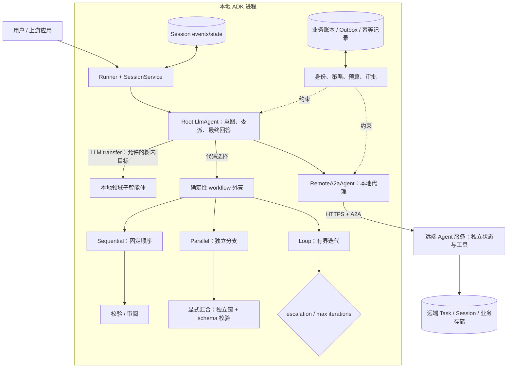
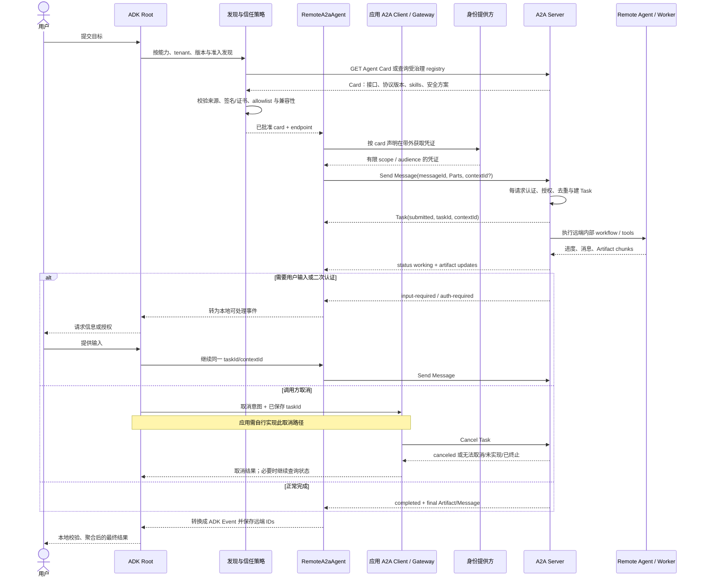

# Google ADK 与 A2A：从本地层级编排到跨系统智能体协作

Google Agent Development Kit（ADK）把“多个智能体”拆成两个不同层次的问题：应用内部可以用父子智能体、确定性工作流和共享会话状态组织协作；跨进程、跨团队或跨框架时，则可用 Agent2Agent（A2A）协议发现并调用一个远程、内部实现不透明的智能体。两层能够组合，但不能混为一谈：把 `RemoteA2aAgent` 放进本地 `sub_agents` 列表，并不会消除网络、身份、版本和部分失败边界。

本文以 2026-07-20 为访问与来源截断日期。ADK、A2A 和 MCP 的规范及实现都仍在演进；尤其 ADK 2.0 文档已提示 Python/Go 的 `SequentialAgent`、`ParallelAgent`、`LoopAgent` 模板工作流被更灵活的 graph/dynamic workflow 取代，当前 Python 源码也标记这些类将来移除。因此本文分析这些原语所表达的控制模型，同时要求新项目在采用前核对目标语言、ADK 版本和迁移路径。

## 学习问题

1. ADK 的父子智能体树怎样约束所有权，LLM 驱动的 `transfer_to_agent` 又转移了什么、没有转移什么？
2. `SequentialAgent`、`ParallelAgent`、`LoopAgent` 的确定性外壳与 LLM 动态路由应怎样组合，何时应直接采用新一代 workflow/graph？
3. `Session`、`state`、`InvocationContext`、`temp:`、`user:` 与 `app:` 分别是什么作用域，本地共享上下文怎样避免并发写冲突？
4. 一个本地 ADK 子智能体变成 `RemoteA2aAgent` 后，Agent Card、Message、Task、Artifact 和 `contextId` 怎样形成跨系统通信边界？
5. A2A 与 MCP 分别解决 agent-to-agent 和 agent/application-to-tool/data 的什么问题，为什么两者可以共存但不能互相提供信任或分布式事务？

## 一页摘要

**已证实事实**：ADK 的 `BaseAgent` 以 `sub_agents` 形成一棵树。一个 agent 实例只能被添加为一次子智能体，子智能体名称在树中必须唯一；父对象初始化时设置 `parent_agent`。`LlmAgent` 可由模型触发 `transfer_to_agent`，默认能在树中把控制转给子、父或 peer，应用可用 `disallow_transfer_to_parent` 与 `disallow_transfer_to_peers` 收窄路径。这里转移的是下一段 agent loop 的执行控制，不是数据库所有权、用户授权或跨服务事务。

**已证实事实**：经典模板工作流的外部调度不咨询模型：Sequential 按声明顺序运行，Parallel 并发启动分支，Loop 按顺序重复并由最大次数或子智能体 escalation 退出。子智能体内部仍可调用 LLM，因此“流程顺序确定”不等于“输出确定”。ADK 2.0 的当前文档和 Python 源码已经把这些模板标为被 workflow/graph 取代或弃用；既有系统仍需理解其行为，新系统应优先检查新的图工作流能力。

**已证实事实**：`Session` 以 `app_name`、`user_id`、`session_id` 标识一条对话，保存事件历史与状态。无前缀键属于当前 session，`user:` 跨该用户的 sessions，`app:` 跨该应用的用户和 sessions，`temp:` 只属于当前 invocation。是否跨进程重启持久化取决于 `SessionService`：内存实现不持久化，数据库和 Vertex AI 实现持久化。父子调用共享 invocation ID 和 `temp:` 作用域，但 Parallel 的分支并不因此自动获得安全的实时协作；并发共享写仍要使用独立键、汇合步骤或外部一致性机制。

**已证实事实**：A2A 让 client agent 与 remote agent 通过独立服务边界通信。Agent Card 描述身份、服务接口、协议版本、能力、skills 与安全方案；一次调用发送 Message，服务可直接返回 Message，或创建有状态 Task。Task 可经历 submitted、working、input-required、auth-required、completed、failed、canceled、rejected 等状态，并通过 status update 与 artifact update 传递进度和交付物。ADK 的 `RemoteA2aAgent` 负责解析卡片、转换 ADK Event 与 A2A Message/Task，并把远端 `task_id` / `context_id` 保存在本地事件元数据中。

**基于证据的推断**：本地层级与 A2A 联邦应是两个治理层。根 agent 只拥有本地工作流、最终回答和本地预算；远端服务拥有自己的任务状态、内部工具和恢复策略。A2A 对二者提供可互操作的消息与任务契约，但不会证明远端 agent 值得信任，也不会把本地 session、远端 task 和 MCP 工具副作用合并成一个全局事务。

| 边界 | 调用对象 | 控制与状态所有者 | 适合场景 | 不自动保证 |
| --- | --- | --- | --- | --- |
| 本地函数/工具 | 确定性能力 | 调用 agent / host | 短操作、结构化输入输出、低开销 | 领域推理、长任务协议 |
| 本地 ADK 子智能体 | 同进程 agent | 父子树 + 同一 Runner / SessionService | 共享上下文、紧耦合模块化 | 并发一致性、输出确定性 |
| 本地 workflow | 多个 node/agent | 代码定义的流程 | 固定顺序、并行、循环、门禁 | 子智能体正确性、业务 exactly-once |
| A2A remote agent | 独立 agent 服务 | 本地只持代理；远端持任务与内部实现 | 跨进程、团队、语言、框架 | 信任、可用性、全局事务、自动版本兼容 |
| MCP server | 工具、资源、prompt 等能力 | host 管理 client 与上下文边界 | agent/application 访问工具和数据 | 对等 agent 的任务协商与生命周期 |

一句话决策：**同一进程先用函数、工具或本地子智能体；明确的执行骨架用 workflow；只有独立部署和互操作边界真实存在时才引入 A2A；工具与数据连接继续使用 MCP。**

## 事实边界

### 已证实事实

- ADK 把 agent 定义为包含模型、指令和可选工具的自包含执行单元，并建议多数项目先从单 agent 开始；只有指令可靠性、上下文限制、代码模块化或确定性与非确定性任务混合等需求出现时，才升级为 workflow。
- `BaseAgent.name` 必须是 Python identifier 且在 agent tree 中唯一。一个 agent 实例只能有一个父 agent；若要在两个位置复用相同配置，应创建两个名称不同的实例，而不是让同一对象多归属。
- `LlmAgent.description` 会参与模型的委派选择。`transfer_to_agent` 产生控制事件，运行时从 root agent 搜索目标名称；`disallow_transfer_to_parent` 与 `disallow_transfer_to_peers` 是路径限制，不是授权系统。
- Sequential 给每个子智能体传递同一个 `InvocationContext` 并按列表顺序执行，适合通过 `output_key` / state 把前一步结果交给后一步。Parallel 为每个子智能体创建分支 context 并并发合并事件；官方文档明确要求分支独立，结果顺序可能不确定。Loop 依次执行子智能体并重复，必须用 `max_iterations` 或 escalation 等终止机制防止无限循环。
- 当前 ADK 2.0 文档称模板 workflow 已被 graph-based 与 dynamic workflows 取代；当前 Python `main` 的三个模板类都有 deprecation 标记。这是来源截断时的版本事实，不能据旧示例假设长期 API 稳定。
- `Session.events` 是事件历史，`Session.state` 是可序列化键值状态。框架推荐通过 Context 或追加 Event 产生 state delta；直接修改从 `SessionService` 读取的 `Session.state` 可能绕开事件追踪并造成数据丢失。
- `InMemorySessionService` 在进程重启后丢失数据；`DatabaseSessionService` 与 `VertexAiSessionService` 提供持久化选择。持久化 session 不等于业务事务、队列语义或自动灾备。
- ADK 官方将本地 sub-agent 定义为同应用进程内的组件，将 A2A remote agent 定义为独立服务。`RemoteA2aAgent` 是本地代理对象，可像其他 `BaseAgent` 一样挂进树，但请求实际经过 A2A client 与网络。
- A2A 规范的 Agent Card 是 JSON 元数据，包含 supported interfaces、协议 binding/version、capabilities、skills 与 security schemes。常见发现路径是 `/.well-known/agent-card.json`，也可经受治理的 registry 或直接配置；当前规范没有规定统一的 curated registry API。
- A2A 的 `Send Message` 可返回直接 Message 或 Task。Task 是服务端生成 ID 的有状态工作单元；`contextId` 可把多个 Task/Message 归为连续交互，`taskId` 用来继续特定任务。Message 承载对话 turn，Artifact 承载具体交付物，两者都由 Part 表示文本、文件引用/字节或结构化数据。
- A2A 1.x 把 canonical data model、抽象 operations 和 JSON-RPC/gRPC/HTTP+JSON bindings 分层。客户端必须根据 Agent Card 的 supported interfaces、protocol binding 与 protocol version 选择兼容接口，不能假设所有 A2A 服务都使用同一路径或序列化形式。
- A2A 的 Cancel Task 是“尝试取消”，成功不保证。规范规定 Cancel 操作幂等，而 Send Message 只可能借助 `messageId` 实现幂等。Push notification 至少尝试投递一次，重复可能发生，接收端应幂等处理。
- 来源截断时，ADK Python 的新 A2A executor 对 `cancel()` 仍直接抛出 `NotImplementedError('Cancellation is not supported')`。因此协议包含取消操作，不等于该具体适配器已经实现端到端取消。
- MCP 官方架构是 host-client-server：host 管理多个 client、权限和上下文聚合；每个 client 与一个 server 建立有状态连接；server 暴露 tools、resources、prompts 等专用能力。A2A 官方将其与 A2A 定位为互补关系：A2A 面向独立 agent 的协作，MCP 面向应用/agent 访问工具与数据上下文。

### 基于证据的推断

- ADK 的静态父子关系是能力目录和运行导航结构；动态 transfer 是这棵树上的控制指针变化。父 agent 没有因为能转移到远端代理就获得远端内部 state、tools 或 memory 的所有权。
- 本地共享 `InvocationContext` 适合顺序传值，却不是并行共享内存事务。Parallel 分支应写不同 state key，随后由确定性汇合节点读取；若必须共享可变对象，应使用支持并发控制的外部存储，并明确冲突与重试语义。
- Agent Card 只说明服务自我声明的能力和安全要求。即使卡片有签名，客户端仍需从可信渠道取得验证密钥、检查证书/签名、供应商准入和撤销状态；“能发现”不推出“可信任”。
- A2A Task 是远端服务的协议状态机，不是跨系统 saga 引擎。一次远端 Task completed 也不能证明本地数据库提交、MCP 工具写入和第三方付款都原子完成。需要业务幂等键、outbox、补偿动作和人工对账。

### 个人分析与未知项

- ADK 不替应用决定 tenant 映射、Agent Card 信任根、OAuth audience/scope、数据驻留、远端 SLO、重试预算、业务幂等键或补偿策略。
- A2A 定义互操作语言，但不会统一不同 agent 的领域 ontology、质量标准或决策政策。两个服务都“兼容 A2A”仍可能在 skill、schema、媒体类型和错误语义上不兼容。
- 本文核对的 commit 为：`google/adk-python` `be5828f317c7430411df29974cd9ccfa875e90de`、`google/adk-docs` `3e6ee758f2a642abf42b6a92682bb113e7fb0743`、`a2aproject/A2A` `af112d9491c1fd4b2a568ac65755af4a62790490`。后续发布、弃用、默认值和协议字段变化不在本文事实范围内。

## 架构图

下面两张图分别表示本地控制平面和跨系统协议边界。它们是基于官方原语的生产化组合，不是 ADK 自动生成的部署拓扑。

### 本地层级与确定性工作流

文字等价描述：

1. Runner 从 SessionService 装载本地会话，根 `LlmAgent` 拥有用户入口和最终回答责任。
2. 根 agent 可以让模型在允许的父子树中 transfer，也可以把固定步骤交给代码定义的 workflow。Sequential 严格串行；Parallel 只并发独立分支并在显式 join 后聚合；Loop 必须有 escalation 或最大迭代数。
3. `RemoteA2aAgent` 在本地仍是一个子节点，但它只是一段协议适配器；真正的 remote agent 在另一服务中拥有自己的任务、会话、工具和存储。
4. 身份、授权、成本、审批与副作用幂等不能交给 transfer 自动决定。策略层应在本地委派前和远端实际行动前分别执行，业务账本记录权威事实。

### 跨系统 A2A 请求与任务生命周期

文字等价描述：

1. 客户端从受治理 registry、可信配置或 well-known endpoint 取得 Agent Card，并在模型看见候选之前检查来源、签名/证书、协议版本、binding、媒体类型和安全策略；公开 URL 不能直接变成可信依赖。
2. 凭证在 A2A payload 之外通过标准 HTTP/OAuth 等机制取得和发送。远端服务对每次请求重新认证并按 skill、数据和动作授权。
3. 客户端发送带唯一 `messageId` 的 Message。远端可立即返回 Message，或创建 `taskId` / `contextId` 并发送状态和 Artifact 更新。
4. `input-required` 与 `auth-required` 是可继续的中断状态；completed、failed、canceled、rejected 是终态。图中的 Cancel Task 由应用自建、支持取消的 A2A client/gateway 发出，不是固定版本 `RemoteA2aAgent` 的现成功能。该代理没有把本地取消意图端到端映射为协议操作，而固定版本 ADK 服务端 executor 的 `cancel()` 也可能未实现；即使服务实现了取消，调用者仍必须接受“无法取消或已经完成”的结果。
5. 远端结果回到本地后仍要经过 schema、来源、策略和业务一致性检查。两侧分别持久化，图中没有全局 commit 点。

## 控制权与任务流

### 父子层级：所有权先于路由

**已证实事实**：父 agent 构造 `sub_agents` 时，ADK 为每个子对象设置唯一 `parent_agent`；已归属于另一个父对象的实例不能再次添加。`root_agent` 通过 parent 链上溯，`find_agent()` 从根向下查找。这个对象模型让可委派目标成为一个显式、可枚举的树，而不是任意网络目录。

**基于证据的推断**：一个节点只能有一个父对象，适合表达“谁配置它、谁负责聚合、谁能限制返回路径”。若业务能力要被多个团队复用，优先复制轻量 agent 配置、封装成 tool，或通过 A2A 建独立服务；不要用共享可变 agent 实例制造隐式多父图。

### Transfer 的实际含义

`transfer_to_agent` 是 LLM 可调用的控制工具。运行时把后续执行交给树中命名 agent；父、子和 peer 是否可达由树结构与 `disallow_transfer_*` 配置共同决定。它不会自动：

- 把本地用户 token 换成目标服务可用的凭证；
- 复制所有业务 state 或持久化 remote task；
- 让目标 agent 获得超出自己 tool policy 的权限；
- 保证目标最终会 transfer 回来；
- 为跨服务副作用建立回滚事务。

**个人分析**：把 transfer 看成“当前活动处理者指针”最安全。父 agent 应保留全局预算、最终发布和升级策略；领域 agent 只拥有领域内推理。对高风险 action，不应仅靠 agent description 引导模型，必须在工具或服务边界做确定性授权。

### 确定性 workflow 与 LLM 路由

| 机制 | 下一步由谁决定 | 确定的部分 | 仍不确定的部分 | 推荐约束 |
| --- | --- | --- | --- | --- |
| Sequential | 代码中的列表顺序 | 调用先后 | 每个 LLM 子步骤的内容与工具选择 | schema、每步 timeout、失败停止/跳过策略 |
| Parallel | 代码并发启动全部声明分支 | 扇出集合 | 完成顺序、内容、部分失败 | 独立输入、并发上限、join、稳定排序 |
| Loop | 代码重复子序列 | 每轮顺序 | evaluator 判断、迭代内容 | `max_iterations`、总 token/deadline、无改进退出 |
| LLM transfer | 模型选择允许目标 | 候选集合与硬禁用路径 | 选择、回转和调用次数 | 路由 eval、最大 transfer、fallback |
| 代码 router / graph | 程序或结构化分类器 | 可验证边与门禁 | 局部分类/生成 | 枚举校验、默认拒绝、版本化 |

**个人分析**：优先采用“确定性骨架 + 局部 LLM 判断”。付款前审批、数据写入顺序、最大循环与跨域委派必须写进代码；开放式意图识别、候选生成和领域推理可以交给模型。来源截断时的新 ADK 项目还应优先评估 graph/dynamic workflows，而不是继续扩大已弃用模板类的使用面。

### 本地共享上下文

Sequential 的共享 context 让前一步通过 `output_key` 或 state 写结果，后一步再读取。这种便捷只适用于有明确顺序的状态转换。Parallel 分支应使用 `research.result`、`risk.result` 之类独立键，汇合后按 schema 读取；不要让多个分支原地追加同一 list，并期待稳定顺序。

推荐把状态拆成四类：

- `temp:`：当前 invocation 的中间结果、分支完成标记，不跨下一轮；
- session 无前缀：当前对话的任务进度、当前选择和恢复引用；
- `user:` / `app:`：确实需要跨 session 的用户偏好或应用配置，写入前要明确租户和访问控制；
- 业务数据库：订单、支付、配额、幂等键、审批与审计等权威事实。

前两类是 agent 运行上下文，最后一类才是业务记录。把订单状态只写进 `session.state` 会把对话便利机制误当成事务系统。

### 本地和远端是部署选择，不是能力等级

本地 sub-agent 更快、共享对象容易、版本一起发布，适合紧耦合模块。Remote agent 可独立扩缩、跨语言/团队演进，并隐藏内部实现，但新增网络时延、认证、兼容矩阵、部分失败和治理成本。远端不比本地“更智能”，本地也不比远端“更可信”；信任来自身份、代码供应链、策略、运营记录和评估证据。

## 关键源码导读

建议按“树 → 流程 → 状态 → A2A 代理 → A2A 服务端 → 规范”的顺序阅读。以下 GitHub 链接都固定在来源截断日核对的提交。

1. [`src/google/adk/agents/base_agent.py`](https://github.com/google/adk-python/blob/be5828f317c7430411df29974cd9ccfa875e90de/src/google/adk/agents/base_agent.py)：看 `name`、`parent_agent`、`sub_agents`、唯一名称校验、单父约束、`root_agent` 与 `find_agent()`。这是本地层级所有权的事实入口。
2. [`src/google/adk/agents/llm_agent.py`](https://github.com/google/adk-python/blob/be5828f317c7430411df29974cd9ccfa875e90de/src/google/adk/agents/llm_agent.py)：看 `disallow_transfer_to_parent`、`disallow_transfer_to_peers`、`_get_subagent_to_resume()` 与根树查找。重点区分 LLM 路由与静态父子所有权。
3. [`sequential_agent.py`](https://github.com/google/adk-python/blob/be5828f317c7430411df29974cd9ccfa875e90de/src/google/adk/agents/sequential_agent.py)、[`parallel_agent.py`](https://github.com/google/adk-python/blob/be5828f317c7430411df29974cd9ccfa875e90de/src/google/adk/agents/parallel_agent.py)、[`loop_agent.py`](https://github.com/google/adk-python/blob/be5828f317c7430411df29974cd9ccfa875e90de/src/google/adk/agents/loop_agent.py)：对照顺序循环、branch context、`TaskGroup` 合并、`max_iterations` / escalation 与当前 deprecation 注释。
4. [`docs/agents/workflow-agents`](https://github.com/google/adk-docs/tree/3e6ee758f2a642abf42b6a92682bb113e7fb0743/docs/agents/workflow-agents)：先读总览中的确定性定义和 ADK 2.0 迁移提示，再读 Sequential 的共享 invocation、Parallel 的独立分支、Loop 的终止条件。
5. [`docs/sessions/state.md`](https://github.com/google/adk-docs/blob/3e6ee758f2a642abf42b6a92682bb113e7fb0743/docs/sessions/state.md) 与 [`docs/sessions/session/index.md`](https://github.com/google/adk-docs/blob/3e6ee758f2a642abf42b6a92682bb113e7fb0743/docs/sessions/session/index.md)：理解事件历史、state prefix、Context 更新方式与 SessionService 的持久化选择。
6. [`src/google/adk/agents/remote_a2a_agent.py`](https://github.com/google/adk-python/blob/be5828f317c7430411df29974cd9ccfa875e90de/src/google/adk/agents/remote_a2a_agent.py)：看 Agent Card 解析、ADK/A2A 转换、`message_id` 生成、远端 `task_id` / `context_id` 如何写入事件 metadata，以及 stateless history 选项。
7. [`src/google/adk/a2a/utils/agent_to_a2a.py`](https://github.com/google/adk-python/blob/be5828f317c7430411df29974cd9ccfa875e90de/src/google/adk/a2a/utils/agent_to_a2a.py)：看 `to_a2a()` 如何组合 Starlette、Runner、Agent Card、task store 与 push config store。注意默认 Runner 和 store 使用内存实现，只适合开发起点。
8. [`src/google/adk/a2a/executor/a2a_agent_executor_impl.py`](https://github.com/google/adk-python/blob/be5828f317c7430411df29974cd9ccfa875e90de/src/google/adk/a2a/executor/a2a_agent_executor_impl.py)：沿 submitted → working → completed/failed 事件看协议映射，并核对 `cancel()` 当前未实现的边界。
9. [`specification/a2a.proto`](https://github.com/a2aproject/A2A/blob/af112d9491c1fd4b2a568ac65755af4a62790490/specification/a2a.proto) 与 [`docs/specification.md`](https://github.com/a2aproject/A2A/blob/af112d9491c1fd4b2a568ac65755af4a62790490/docs/specification.md)：前者是 canonical data objects 与请求/响应的规范源，后者解释 operations、bindings、版本、幂等、任务状态和安全语义。
10. [`docs/topics/agent-discovery.md`](https://github.com/a2aproject/A2A/blob/af112d9491c1fd4b2a568ac65755af4a62790490/docs/topics/agent-discovery.md)、[`life-of-a-task.md`](https://github.com/a2aproject/A2A/blob/af112d9491c1fd4b2a568ac65755af4a62790490/docs/topics/life-of-a-task.md)、[`a2a-and-mcp.md`](https://github.com/a2aproject/A2A/blob/af112d9491c1fd4b2a568ac65755af4a62790490/docs/topics/a2a-and-mcp.md)：最后建立发现、任务生命周期和协议分工的整体图。

**个人分析**：阅读时应同时维护四个 ID：ADK `session_id` 表示本地对话，`invocation_id` 表示一次本地用户请求，A2A `contextId` 表示远端连续交互分组，`taskId` 表示一项远端有状态工作。实现可以保存映射，但绝不能把它们当成同一个身份或授权键。

## 架构决策与权衡

### 层级还是扁平能力表

树结构让父级责任、候选集与返回路径清楚，也能用不同 instructions 和 tools 隔离领域上下文；代价是能力复用可能被单父约束绑住，深层 transfer 难以理解。只有两三个稳定能力时，根 agent 加普通 tools 或一个扁平 router 更简单。多层团队仅在子团队确实有独立上下文、预算、所有者和汇合规则时成立。

### 模板 workflow 还是新 graph/dynamic workflow

经典 Sequential/Parallel/Loop 易读，适合解释和维护既有系统。当前 ADK 2.0 已把更复杂的新工作推荐到 graph/dynamic workflow，说明拓扑演进、分支、恢复和组合需求超出了三个模板的表达力。迁移时要先锁定事件顺序、state key、循环终止和恢复语义；不能只把类名机械替换。

### 本地还是 A2A

只有当独立部署、跨团队所有权、跨语言/框架或正式协议契约是真实需求时，A2A 的成本才合理。若组件同库同进程、需要纳秒/毫秒级调用、频繁共享可变上下文，A2A 会增加序列化、网络和运维负担。反过来，把独立供应商 agent 当本地函数会掩盖身份、版本与故障边界。

### A2A 与 MCP 的清晰边界

**已证实事实**：A2A 处理 agent-to-agent 协作：能力发现、对话 Message、有状态 Task、进度、Artifact、长运行和继续交互。MCP 处理 application/agent-to-tool/data context：host 管理 client，server 提供 tools/resources/prompts，并通过能力协商保持连接隔离。

**个人分析**：判断标准不是“接口是否智能”，而是对方是否拥有自己的目标、状态和多轮协作责任。一个天气查询函数应是 MCP tool；一个会澄清日期、协调供应商并维护预订任务的旅行服务更像 A2A agent。两者可以共存：ADK agent 通过 A2A 委派给远端 agent，远端 agent 再通过 MCP 使用数据库和工具。不要把 MCP server 自动称为 peer agent，也不要把简单 API 包成 A2A Task。

### 发现、信任与兼容

动态发现提升可替换性，但把错误或恶意 Agent Card 纳入模型候选会扩大攻击面。生产 registry 应做供应商准入、card 签名/来源校验、版本与 binding allowlist、skill 级授权、健康与评估门禁。缓存 card 时使用 HTTP cache/ETag，并为撤销和紧急下线保留短路机制。

A2A 版本兼容应在连接前完成：读取 `supportedInterfaces`，选择双方支持的 binding 与 `protocolVersion`，验证所需 capability（streaming、push notification、extended card 等），再校验输入/输出媒体类型和应用 schema。协议兼容只证明 envelope 可交换；领域字段仍需独立 schema version 与契约测试。

## 生产化分析

### 安全、认证与信任边界

- 只允许 HTTPS；验证 TLS server identity。跨组织高敏场景可叠加 mTLS、网络策略与 API gateway。
- Agent Card 声明 security schemes，但凭证通过带外流程获取并放在标准 header 中。服务端必须每请求认证；认证成功后仍要按 tenant、skill、资源和动作授权。
- A2A payload 不应被当成身份来源。`user_id`、`session_id`、`contextId` 和 `taskId` 都是关联标识，不是访问凭证。
- 公开 card 只披露必要技能；敏感细节使用受认证的 extended card 或受治理 registry。签名必须锚定到外部信任根与撤销机制。
- remote agent 是不透明执行边界。客户端必须把其文本、结构化数据、文件 URL 和 Artifact 都当作不可信输入，做 schema、MIME、大小、恶意内容和引用地址校验。
- MCP 连接也保持独立安全边界。remote agent 通过 MCP 获得工具并不意味着 A2A 调用者继承该工具权限；远端必须在实际工具调用处再次授权。

### 取消、重试、幂等与事务

**已证实事实**：A2A Cancel Task 只要求服务尝试取消，取消可能不受支持或任务已终止；Send Message 仅 MAY 通过 `messageId` 去重。固定版本 `RemoteA2aAgent` 没有把本地取消意图映射到 A2A Cancel Task 的端到端 client 路径，ADK 服务端 executor 的 `cancel()` 还直接抛出 `NotImplementedError`。因此超时关闭 HTTP 连接、用户点击“停止”和远端副作用停止是三件不同的事；需要取消时，应用必须自建支持该操作的 A2A client/gateway，并在接入时验证远端实现。

生产建议：

1. 为每个业务动作生成稳定 `operation_id`，并在 A2A Message metadata/structured Part 与远端业务数据库中传播；传输重试复用相同 `messageId`，业务重试复用相同 `operation_id`。
2. 只有网络错误、明确可重试状态和未产生外部副作用的阶段才自动重试；使用指数退避、jitter、总 deadline 和 retry budget。
3. 通过应用自建 client/gateway 发出 Cancel 后，继续轮询或订阅直到得到明确终态；若本地 adapter 或远端 executor 不支持 cancel，标记为“本地停止等待，远端可能继续”，并触发对账。
4. Push notification 按至少一次投递设计。A2A 1.0 没有内建通用的 event ID 或 event version 字段；若要用 `taskId + event_id/version` 去重，`event_id` 或单调 `version` 必须由应用写入 metadata。Artifact chunk 可用协议内建 `artifactId` 配合 metadata 中应用自定义的 `chunk_sequence` 去重和排序，并结合 `append` / `lastChunk` 判断拼接语义。
5. 跨本地 state、A2A Task 和 MCP/业务工具的操作使用 saga、outbox、补偿和人工修复队列。不要声称 A2A 提供全局 exactly-once 或两阶段提交。

### 可观测性与评估

ADK Event 的 `invocation_id` 可关联一次本地交互，A2A 提供 `taskId` / `contextId`，HTTP 可传播 W3C trace context。建议在本地 root、RemoteA2aAgent、A2A gateway、remote executor 和 MCP/tool span 中统一记录：

| 维度 | 最小字段/指标 | 目的 |
| --- | --- | --- |
| 关联 | trace ID、ADK session/invocation、A2A context/task、messageId、operation_id | 跨边界重建一次任务 |
| 路由 | 候选 card/version、选择原因、transfer 次数、fallback | 检测误路由与循环 |
| 可靠性 | 各 task state 时长、重试/取消结果、重复通知、部分失败 | 验证恢复与幂等设计 |
| 成本时延 | 本地/远端模型 token、网络、队列、tool span P50/P95/P99 | 找出 federation 真实成本 |
| 安全 | card 校验、认证失败、skill 拒绝、敏感数据策略、Artifact 拒绝 | 证明策略在边界执行 |
| 质量 | 任务成功、tool trajectory、最终回答、Artifact schema、人工纠正 | 区分“协议成功”和“任务成功” |

ADK 官方 evaluation 支持 tool trajectory、reference response、rubric、groundedness、安全和多轮 trajectory 等判据。A2A 场景还应加入契约与对抗数据集：旧/new card 版本、错误 MIME、重复 Message、乱序 Artifact、长时间 working、input-required 后恢复、取消竞态、远端返回 prompt injection、远端 completed 但业务账本未提交。

### 典型生产失败模式

| 失败模式 | 表现 | 遏制方式 |
| --- | --- | --- |
| 树内误 transfer | 错专家、来回转移、最终答案责任不明 | 限定候选、禁用不必要 parent/peer 路径、最大 transfer、路由 eval |
| Parallel 状态冲突 | 丢写、覆盖、结果乱序 | 独立 key、不可变事件、显式 join、稳定排序、外部并发控制 |
| Loop 无界 | token、成本和延迟持续增长 | `max_iterations`、deadline、预算、无改进退出和人工升级 |
| 内存服务误入生产 | 重启丢 session/task/artifact | 持久化 SessionService、TaskStore、ArtifactStore 与恢复演练 |
| Agent Card 被污染或过期 | 请求发往恶意 endpoint、版本不匹配 | 可信 registry、签名/证书、allowlist、ETag/TTL、撤销 |
| A2A schema 漂移 | 解析失败、字段枚举变化、binding 路径不匹配 | pin 版本、能力协商、消费者契约测试、双版本迁移窗口 |
| 网络超时后盲重试 | 重复下单或重复远端任务 | 稳定 messageId + operation_id、先 Get/List Task、幂等业务写 |
| 取消被误认为完成 | UI 已停止但远端继续执行 | 区分请求/确认/终态；能力检查；对账和补偿 |
| Artifact 注入或外链攻击 | 恶意文件、SSRF、超大 payload | MIME/大小/哈希校验、URL allowlist、隔离扫描、最小权限下载 |
| 只看 HTTP 200 | 协议成功但 task failed 或结果错误 | 校验 Task state、Artifact schema、业务账本和质量 eval |
| 远端级联故障 | 一个 agent 拖垮父流程和下游 | bulkhead、并发上限、circuit breaker、部分结果与降级策略 |

### 发布门禁

上线前至少验证：本地树中名称和所有权唯一；每条 transfer 有允许矩阵和返回策略；workflow 有 deadline、循环/并发上限；state key 有作用域与保留政策；Agent Card 经准入且版本/binding/capability 兼容；每个副作用有 operation id 与补偿；取消能力按具体实现实测；trace 能跨 ADK/A2A/MCP 关联；旧版本、重复、乱序、超时和恶意 Artifact 场景通过契约测试。

## 可迁移经验

1. **先画控制权，再画智能体数量。** 标出谁选择下一步、谁拥有最终答案、谁能执行副作用、失败回到哪里；若答案含糊，多 agent 只会放大问题。
2. **把父子树当作所有权结构，不当作组织结构图。** 一个实例一个父节点、名称唯一、可达路径受限，能减少隐式共享和不可解释 transfer。
3. **把确定性放在需要证明的地方。** 顺序、审批、预算、并发、循环终止和发布应由代码/workflow 控制；模型负责难以枚举的理解与生成。
4. **共享 invocation 不等于共享一致性。** 顺序步骤可用 state 传值，并行步骤用独立输出和显式汇合；权威业务事实放进事务存储。
5. **把 RemoteA2aAgent 当网络代理。** 它能融入本地 agent API，却不能抹掉远端身份、延迟、失败、版本和数据治理。
6. **发现先过信任门，再进入模型候选。** Agent Card 是能力声明，不是可信证明；registry、签名、证书、allowlist、评估和撤销共同形成准入。
7. **区分协议成功、任务成功与业务成功。** HTTP/JSON 可解析、A2A Task completed、订单已唯一提交是三个不同检查点。
8. **A2A 和 MCP 可叠加，不可混同。** A2A 连接独立 agent；MCP 连接 tools/resources/context。每个 agent 内部可以用 MCP，对外用 A2A。
9. **默认按至少一次和部分失败设计。** 重试复用标识，通知去重，取消等待确认，副作用幂等并可补偿。
10. **知道何时不需要层级或协议联邦。** 单 agent + 普通 tool 能完成、组件同进程且强共享上下文、任务只是短的结构化函数调用，或没有独立团队/部署边界时，不要引入多层 agent tree、A2A registry 与远端 Task。

一个实用的降级顺序是：普通函数 → MCP/本地 tool → 单 agent → 本地子智能体 → 确定性 workflow → A2A remote agent。只有当前一层无法满足清晰的所有权、上下文、扩缩、互操作或治理需求时，才进入下一层。

## 来源

### 官方阅读顺序

1. [ADK Agents 总览](https://adk.dev/agents/)：先确认单 agent 默认起点和升级 workflow 的条件。
2. [ADK Template workflow agents](https://adk.dev/agents/workflow-agents/)：理解 Sequential/Parallel/Loop 的确定性外壳与 ADK 2.0 迁移提示。
3. [ADK Session state](https://adk.dev/sessions/state/) 与 [Session](https://adk.dev/sessions/session/)：建立本地 session、invocation 和持久化边界。
4. [ADK A2A introduction](https://adk.dev/a2a/intro/)：先判断本地 sub-agent 与 remote A2A agent 的适用条件。
5. [ADK consuming](https://adk.dev/a2a/quickstart-consuming/) 与 [exposing](https://adk.dev/a2a/quickstart-exposing/)：追踪 `RemoteA2aAgent`、Agent Card、client proxy 与 server executor。
6. [A2A 规范](https://a2a-protocol.org/latest/specification/)：核对 Agent Card、Message/Task/Artifact、operations、bindings、幂等、安全和版本语义。
7. [A2A discovery](https://a2a-protocol.org/latest/topics/agent-discovery/)、[task lifecycle](https://a2a-protocol.org/latest/topics/life-of-a-task/) 与 [A2A/MCP comparison](https://a2a-protocol.org/latest/topics/a2a-and-mcp/)：补齐发现、长任务和协议分工。
8. [MCP Architecture（2025-06-18 版）](https://modelcontextprotocol.io/specification/2025-06-18/architecture)：只用于界定 host/client/server 与 tools/resources/context 边界，不用来声称 Google 的 A2A 实现行为。
9. [ADK observability](https://adk.dev/observability/traces/) 与 [evaluation](https://adk.dev/evaluate/)：把运行轨迹与质量验证连接起来。

### 固定版本证据

- [google/adk-python @ `be5828f317c7430411df29974cd9ccfa875e90de`](https://github.com/google/adk-python/tree/be5828f317c7430411df29974cd9ccfa875e90de)
- [google/adk-docs @ `3e6ee758f2a642abf42b6a92682bb113e7fb0743`](https://github.com/google/adk-docs/tree/3e6ee758f2a642abf42b6a92682bb113e7fb0743)
- [a2aproject/A2A @ `af112d9491c1fd4b2a568ac65755af4a62790490`](https://github.com/a2aproject/A2A/tree/af112d9491c1fd4b2a568ac65755af4a62790490)

### 证据说明

- **已证实事实**只使用上述 Google ADK、A2A 项目与 MCP 官方规范/源码。
- **基于证据的推断**把可复查实现行为连接到生产架构结论，并明确不确定性。
- **个人分析**是迁移、选型和运维建议，不代表 Google、A2A 项目或 MCP 规范的官方保证。
- 访问日期与来源截断日期均为 **2026-07-20**。A2A、MCP 的规范和 ADK/A2A 适配实现持续演进；生产采用前必须重新核对正式 release、目标语言实现、Agent Card、protocol version、binding 和具体 adapter 的支持矩阵。
