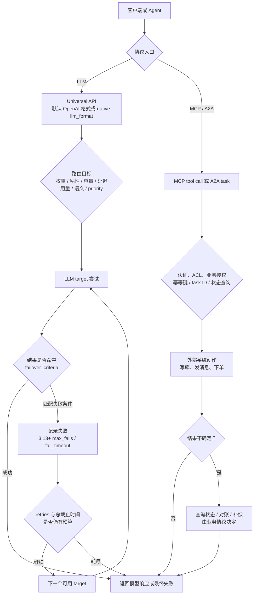

# Kong AI Gateway：把模型路由与副作用恢复分成两条控制链

一次模型请求超时后，换到另一个 provider 也许只是多付一笔推理费；一次订票工具超时后，透明重放却可能订出两张票。两者都经过 AI Gateway，不代表它们拥有相同的重试语义。

更可迁移的视角是先确定路由目标，再分类失败，最后把“可重复的模型推理”与“可能产生外部副作用的工具或 Agent 任务”拆成两条恢复链。网关能选择目标、执行 failover、隔离不健康目标并提供观测，但不能替业务协议推断一次写操作是否已经生效。

**证据范围**：本文以 2026-07-23 为截断日期，官方文档源码固定到 `Kong/developer.konghq.com@f144a33`。重点版本边界是 Gateway 3.10+ 的跨格式 fallback 与新增路由能力、3.13+ 的 AI 负载均衡健康/断路器；MCP 与 A2A 仅用于说明协议边界，不反向回填到旧版本。

## 学习问题

1. provider-agnostic API 与原生 provider 格式分别解耦了什么？
2. 七种路由算法优化的目标为何不能互相替代？
3. `failover_criteria`、`retries`、fallback 与 priority 各自控制哪一步？
4. 3.13+ 的健康与断路器状态如何改变后续请求，而不是撤销已发生的调用？
5. 观测数据怎样区分目标选择、尝试次数、模型费用与最终结果？
6. 为什么 MCP 工具调用和 A2A 任务不能继承模型推理的透明重试策略？

## 一页摘要

**已证实事实**：AI Proxy Advanced 可在一个插件配置中代理多个 provider 与模型，并用负载均衡算法选择 target。默认 OpenAI 格式会在网关内转换请求和响应；Gateway 3.10+ 也可设置原生 `llm_format`，此时保留对应 provider 的原生格式，而不是提供跨 provider 的统一载荷。

路由算法表达的是目标函数。权重轮询分配比例，一致性哈希保持粘性，最少连接偏向剩余容量，最低延迟偏向近期更快的目标。最低用量依据 token 或成本，语义路由匹配提示与模型描述，priority 则把正常路径与分层 fallback 写成显式顺序。

失败处理是第二个决策。默认 `failover_criteria` 只有 `error` 与 `timeout`；若要让 429、5xx 或非幂等 POST 进入 failover，必须显式配置。增加条件会提升恢复机会，也会增加重复推理、额外费用、尾延迟以及“不知道上游是否已处理”的不确定性。

下表回答每层控制能够承诺什么：

| 控制层 | 主要输入 | 直接决定 | 不能承诺 |
| --- | --- | --- | --- |
| API 格式层 | route type、`llm_format` | 是否转换 provider 请求/响应 | 不保证不同模型语义等价 |
| 路由算法 | 权重、哈希、连接、延迟、用量、语义、优先级 | 首个候选目标 | 不判断业务副作用 |
| failover | 失败类别、超时、重试次数 | 是否继续尝试 target | 不证明前一次未被处理 |
| 断路器 | 失败计数与时间窗 | 暂时排除 target | 不撤销已产生的调用或费用 |
| 观测层 | 日志、指标、trace | 还原 provider、model、延迟、token、成本 | 不自动建立端到端幂等 |
| MCP/A2A 业务层 | tool call、task ID、业务幂等键 | 业务恢复与对账 | 不应透明继承 LLM 重试 |

核心判断是：高可用不是把 `retries` 调大，而是让每一种失败只触发它有权触发的恢复动作。

## 事实边界

**已证实事实**：AI Proxy Advanced 插件最低版本为 Gateway 3.8，并属于 AI Gateway Enterprise、需要 AI License。本文讨论的跨不同 API 格式 fallback、priority 以及按成本统计的 lowest-usage 以 3.10+ 为边界；least-connections、AI 负载均衡健康/断路器与语义路由同描述目标的 fallback 以 3.13+ 为边界。

默认的 provider-agnostic 路径采用标准化 OpenAI 格式。3.10+ 原生格式模式会跳过载荷转换，并且只支持该格式对应的 provider 与 API；因此“统一入口”不等于任意 native SDK 请求都能在不同 provider 之间无损切换。

`failover_criteria` 默认是连接错误和超时。官方配置允许加入 403、404、429、500、502、503、504、无效响应头和非幂等条件；最后一项明确改变 POST 等请求的重试资格，必须按重复执行风险单独批准。

**个人分析**：模型 chat 请求通常没有传统数据库写入，但它仍可能计费、占用配额、生成不同答案或触发 provider 侧日志。网关超时只说明没有按时获得响应，不证明 provider 未执行；所以模型 failover 也需要尝试上限、总截止时间和重复费用观测。

  
证据：Gateway 3.10+ 与 3.13+ 的能力边界

  - **3.10+：** [AI 负载均衡文档](https://developer.konghq.com/ai-gateway/load-balancing/)标出跨不同 API 格式 fallback、priority 与 lowest-usage 的 cost 策略；[AI Proxy Advanced](https://developer.konghq.com/plugins/ai-proxy-advanced/)说明 native `llm_format` 从 3.10+ 可用。
  - **3.13+：** 同一负载均衡文档标出 least-connections、健康/断路器，以及语义路由中相同描述 target 的 fallback 行为。
  - **固定文档源码：** [`app/ai-gateway/load-balancing.md@f144a33`](https://github.com/Kong/developer.konghq.com/blob/f144a33379d5b599efaacf92642a2f9b41018fd6/app/ai-gateway/load-balancing.md)。
  - **证明边界：** 这些锚点证明文档在固定日期声明的最低版本，不证明所有 3.10.x/3.13.x 补丁都没有已知缺陷；生产部署仍应核对目标补丁版本的 changelog。

  
证据：Advanced 插件与商业授权边界

  - **插件边界：** [AI Proxy Advanced 插件页](https://developer.konghq.com/plugins/ai-proxy-advanced/)标注 `AI License Required`、最低 Gateway 3.8，并明确插件仅属于 AI Gateway Enterprise offering。
  - **能力边界：** 多 provider/model target 与本文讨论的 AI 模型负载均衡由 AI Proxy Advanced 提供；基础 [AI Proxy](https://developer.konghq.com/plugins/ai-proxy/)面向单个配置目标。
  - **官方仓库：** [`Kong/developer.konghq.com@f144a33`](https://github.com/Kong/developer.konghq.com/tree/f144a33379d5b599efaacf92642a2f9b41018fd6)固定本文使用的公开文档源码。
  - **证明边界：** 公开文档和源码可验证产品声明，不能替代商业合同、订阅 SKU 或法律意见；上线前须由组织确认有效授权。

## 架构图

先看一次请求在哪些位置改变控制所有者。图中特意把 LLM 推理与 MCP/A2A 动作分开：前者可由 AI 负载均衡器按策略尝试，后者必须回到协议和业务幂等层决定恢复。

这张图的结论是：断路器影响下一次选路，不能回滚当前 target；业务对账处理“不知道是否成功”，不能被另一个 target 的模型响应替代。

## 控制权与任务流

**说明性场景**：一个 Agent 先请求模型生成差旅方案，再调用 MCP 工具创建预订。模型路由使用 priority：主组为低成本模型，备用组为容量更充足的模型；`failover_criteria` 允许连接错误、超时和 429，重试次数与总截止时间均受限。

第一次推理在读取响应头前超时。该失败匹配条件，网关记录一次失败并选择仍可用的 target；若主组还有健康 target，priority 仍在主组内选择，只有该组不可用时才进入备用组。第二个模型返回成功，但两次尝试都可能已经计费，结果也不保证逐字一致。

Agent 随后调用 `create_booking`。AI MCP Proxy 可以把 MCP tool call 映射为 HTTP 请求，也能通过 AuthN 与 ACL 控制发现和调用；它不因此获得“创建预订可透明重放”的业务知识。若上游在写入后断连，Agent 应携带稳定幂等键查询既有结果，或进入对账/补偿流程，而不是让 LLM failover 策略重发工具调用。

如果请求改为 A2A `message/send`，AI A2A Proxy 3.14+ 可记录 task ID、状态、延迟并重写 Agent Card URL，但官方明确它不管理 task state，也不改变路由。恢复者应使用 A2A 的 task 标识与状态接口判断继续、取消或重新提交。

该场景只组合官方文档支持的机制，不代表真实事故或生产指标。它揭示的架构边界是：模型 target 的尝试历史属于网关，工具效果和 Agent task 的事实状态属于外部系统。

## 关键源码导读

本文无法用公开 `Kong/kong` 仓库验证 AI Proxy Advanced 的商业插件内部实现。因此最短可靠路径是固定官方文档源码：先读算法与失败状态机，再读配置 schema，最后读 MCP/A2A 的协议职责。公开材料足以验证配置契约，不足以推导未公开实现细节。

**已证实事实**：配置参考把 `retries` 定义为代理失败后的重试次数，默认值为 5；failover 条件默认是连接错误和超时。

`max_fails` 默认为 0，即关闭断路器。启用后，失败是否计数受 failover 条件影响，但 403/404 不计入失败，连接错误、超时与无效头总会计入。

这组字段形成三个不同时间尺度：timeout 约束单次 I/O 等待，retries 限制一次客户端请求内的再次尝试，`max_fails` 与 `fail_timeout` 改变跨请求 target 可用性。把三者压成一个“重试策略”会隐藏控制状态和排障入口。

  
证据：失败分类与断路器配置契约

  - **配置参考：** [AI Proxy Advanced Configuration Reference](https://developer.konghq.com/plugins/ai-proxy-advanced/reference/)列出 `retries`、三类 timeout、`failover_criteria`、`max_fails` 与 `fail_timeout` 的默认值、范围和允许值。
  - **行为说明：** [Load balancing with AI Proxy Advanced](https://developer.konghq.com/ai-gateway/load-balancing/)解释默认 error/timeout、retry/fallback 流程、失败总数而非连续失败的计数方式，以及所有 target 不健康时返回 HTTP 500。
  - **兼容性：** [Data Plane version compatibility](https://developer.konghq.com/gateway/data-plane-version-compatibility/)把 3.10 以下使用 `balancer.failover_criteria` 标为不受支持。
  - **证明边界：** 配置契约证明声明行为和默认值，不证明特定 provider 在半开连接、流式中断或自定义驱动下的所有边缘时序。

MCP 的最短阅读路径是插件运行位置与转换流程。官方文档明确它处于 MCP client 与 MCP server 之间，不属于 LLM request flow，并禁止在同一 Service/Route 与其他 AI 插件共同配置；转换模式把 tool call 映射为 HTTP 后再包装响应。

A2A 的最短阅读路径是透明代理声明。插件观测 JSON-RPC/REST、task state 和 SSE，但不聚合响应、不管理任务状态、不修改普通请求路由。这证明协议可观测性不是工作流编排权。

## 架构决策与权衡

**决策问题一：选择 API 抽象层**

**已证实事实**：默认 OpenAI 格式会转换 provider 请求与响应；native `llm_format` 保留对应供应商的原生格式，并绑定该格式支持的 provider 与 API。

**基于证据的推断**：标准格式让客户端与 provider API 解耦，便于跨 provider fallback；代价是只能使用网关支持映射的能力。原生格式保留供应商特性，却重新绑定对应 provider，迁移面和 fallback 兼容性都要单独验证。

**决策问题二：按业务目标选择算法**

**已证实事实**：权重轮询表达计划比例，一致性哈希提供会话或缓存粘性，least-connections 反映在途容量。最低延迟策略优化响应速度，最低用量策略依据 token 或成本，语义路由选择领域能力，priority 表达确定的服务层级。

**决策问题三：确定哪些失败进入 retry**

**已证实事实**：`failover_criteria` 默认包含连接错误和超时，也可显式加入 HTTP 状态码与非幂等条件；`retries` 决定代理失败后的再次尝试次数。

**基于证据的推断**：这些目标可能冲突。最低延迟不等于最低成本，最低用量不等于最好质量，粘性也会牺牲全局均衡；生产配置应为主目标与降级目标分别设验收条件。

连接错误和读取响应头超时属于传输不确定性；429 常表示容量或配额；500/502/503/504 代表不同上游失败。把它们全部加入 failover 可能提高成功率，却会放大调用、费用和尾延迟。

**决策问题四：组合 priority 与断路器**

**已证实事实**：priority 给出组间顺序，断路器把近期失败的 target 暂时移出候选集。所有 target 同时不健康时，文档声明请求失败为 HTTP 500，而不是绕过健康状态继续发送。

**个人分析**：组合两者的代价是每个数据平面的观测窗口、失败阈值和恢复探测都需要验证。模型推理与工具执行还应建立不同重试入口：模型层可以接受受限的重复生成；工具层只有在端到端幂等键、状态查询或补偿协议存在时才能恢复。网关不应替业务拥有这项判断。

## 生产化分析

**个人分析**：失败预算应同时限制尝试次数与墙钟时间。`retries`、连接/读/写 timeout、客户端 deadline 必须联合计算，否则多个慢 target 会把一次请求拖成长尾；流式响应已经向客户端发送字节后，还要验证是否具备再次尝试的合法边界。

**已证实事实**：3.13+ 的断路器按总失败数而非连续失败数计数。timeout 窗口内夹着一次成功不会清零；只有最后失败后的 `fail_timeout` 已过，随后一次成功才会清零并恢复健康。

**基于证据的推断**：断路器验收不能套用“成功一次立即闭合”的常见假设，而应覆盖上述窗口与清零条件。

**已证实事实**：AI 日志可包含 provider、请求/响应模型、token、延迟与成本；启用 payload 日志还会把正文带入日志或 trace。官方 Prometheus 指南说明 AI metrics 默认关闭，以避免高基数与性能问题；启用需要 Prometheus 插件的 `ai_metrics` 和 AI Proxy Advanced 的 `log_statistics`。

AI A2A Proxy 3.14+ 是透明观测与控制层，可以记录 task ID 与状态，但不拥有任务状态。

**个人分析**：观测应能回答四个问题：客户端请求是什么、算法选择了哪个 target、每次尝试为何结束、最终返回和累计成本是什么。payload 日志需要脱敏、访问控制与保留策略；指标只能证明网关观察到的流量，provider 账单仍需独立对账。

  
证据：LLM、MCP 与 A2A 的观测字段

  - **LLM 日志：** [AI Gateway audit log reference](https://developer.konghq.com/ai-gateway/ai-audit-log-reference/)列出请求/响应模型、provider、token、cost、LLM latency 与可选 payload 字段。
  - **LLM 指标：** [Monitor AI LLM metrics](https://developer.konghq.com/ai-gateway/monitor-ai-llm-metrics/)说明 AI metrics 默认关闭、启用条件与高基数风险。
  - **MCP/A2A 指标：** [Gen AI OpenTelemetry metrics](https://developer.konghq.com/ai-gateway/ai-otel-metrics/)区分 Gen AI、MCP 与 A2A 指标的插件开关；A2A 日志还包含 task state、task ID、TTFB 和 SSE 事件数。
  - **证明边界：** 这些字段支持网关侧诊断与计费对账，不证明上游 provider 或工具系统已采用相同 request ID，也不自动建立 exactly-once。

**个人分析**：MCP 工具应按副作用等级分组。纯查询可在确定未返回结果时有限重试；带幂等键的写入先查状态再重放；无法去重的支付、消息、资源创建等动作进入人工或补偿流程。ACL 解决谁能调用，不解决调用是否能重复。

A2A 生产链必须保留 task ID、context ID 与状态变化。重试 `message/send` 前应先查询或关联既有 task，取消也必须由 Agent/业务端确认结果。

## 可迁移经验

### 可直接复用的机制

1. 把 API 格式适配、目标选择、失败分类、再次尝试和跨请求健康状态拆成独立控制层。
2. 为路由算法写明唯一主目标，并用另外的机制处理成本、容量、延迟或粘性冲突。
3. 默认只让窄失败集合触发 failover；扩大集合时记录理由、重复成本与最坏墙钟时间。
4. 用 priority 表达服务层级，用断路器隔离近期失败 target，不把二者混为同一种 fallback。
5. 为每次客户端请求保留 attempt 级 provider、model、原因、延迟、token 和费用关联。
6. 把工具幂等键、A2A task ID、状态查询和补偿协议放在网关路由之外显式设计。

### 只能有限类比的部分

1. LLM 生成通常可接受语义不同的第二次答案；外部工具写入可能要求严格去重或顺序。
2. provider-agnostic API 解耦载荷形状，不保证模型质量、参数、内容政策与错误语义等价。
3. least-connections 观察在途请求，不能直接代表 token 工作量、GPU 队列或 provider 配额。
4. lowest-latency 的 EWMA 是历史观测，不是未来请求的延迟保证，也不适合所有长连接。
5. 断路器隔离 target 的近期失败，不能替代区域级容灾、provider 账户隔离或账单核对。
6. MCP/A2A 可复用 Gateway 的认证、限流和观测，但各自的状态与恢复协议仍属于上游系统。

### 不应照搬的部分

1. 不要把所有 429 和 5xx 无条件加入 failover，也不要把默认 `retries: 5` 当成生产推荐值。
2. 不要在未证明重复安全时启用 `non_idempotent`，尤其不能透明重放支付、消息、资源创建或审批。
3. 不要把模型成功响应当作先前超时尝试未计费、未记录或未生成的证明。
4. 不要宣称最低延迟、最低用量、语义匹配和最高优先级能由一个算法同时优化。
5. 不要把 3.10+ 的跨格式 fallback 与 native `llm_format` 混为“任意 provider 原生 API 可互换”。
6. 不要把 3.13+ 健康/断路器能力写成 3.8 插件基线，也不要忽略 `max_fails: 0` 默认关闭。
7. 不要把 MCP ACL 或 A2A 透明代理解释为端到端幂等、task 编排或 exactly-once。
8. 不要在缺少有效 AI Gateway Enterprise 授权时把 AI Proxy Advanced 当作开源基础插件部署。

## 来源

**官方架构与产品文档（已证实事实）**

- [Kong AI Gateway](https://developer.konghq.com/ai-gateway/)：Universal API、provider-agnostic 路由、治理与观测能力。访问与截断日期：2026-07-23。
- [Load balancing with AI Proxy Advanced](https://developer.konghq.com/ai-gateway/load-balancing/)：七种算法、retry/fallback、版本兼容与 3.13+ 断路器。访问与截断日期：2026-07-23。
- [AI Proxy Advanced](https://developer.konghq.com/plugins/ai-proxy-advanced/)及其[配置参考](https://developer.konghq.com/plugins/ai-proxy-advanced/reference/)：格式转换、native 格式、商业许可、字段默认值与失败条件。访问与截断日期：2026-07-23。
- [Data Plane version compatibility](https://developer.konghq.com/gateway/data-plane-version-compatibility/)：3.10 以下对 `failover_criteria` 与 cost token strategy 的兼容告警。访问与截断日期：2026-07-23。

**官方协议与观测文档（已证实事实）**

- [AI Gateway audit log reference](https://developer.konghq.com/ai-gateway/ai-audit-log-reference/)与[Monitor AI LLM metrics](https://developer.konghq.com/ai-gateway/monitor-ai-llm-metrics/)：LLM 日志、token/费用/延迟字段、指标启用与高基数边界。访问与截断日期：2026-07-23。
- [AI MCP Proxy](https://developer.konghq.com/plugins/ai-mcp-proxy/)：3.12+ MCP 请求链、HTTP 转换、3.13+ ACL 与不属于 LLM request flow 的边界。访问与截断日期：2026-07-23。
- [AI A2A Proxy](https://developer.konghq.com/plugins/ai-a2a-proxy/)：3.14+ 透明代理、Agent Card 重写、task 观测与不管理任务状态的边界。访问与截断日期：2026-07-23。

**固定官方文档源码（已证实事实）**

- [`Kong/developer.konghq.com@f144a33`](https://github.com/Kong/developer.konghq.com/tree/f144a33379d5b599efaacf92642a2f9b41018fd6)：本文在 2026-07-23 使用的不可变文档源码锚点。
- [`app/ai-gateway/load-balancing.md`](https://github.com/Kong/developer.konghq.com/blob/f144a33379d5b599efaacf92642a2f9b41018fd6/app/ai-gateway/load-balancing.md)：算法、失败处理、版本兼容和断路器说明的固定入口。
- [`app/_kong_plugins/ai-mcp-proxy/index.md`](https://github.com/Kong/developer.konghq.com/blob/f144a33379d5b599efaacf92642a2f9b41018fd6/app/_kong_plugins/ai-mcp-proxy/index.md)：MCP 插件运行位置、转换模式、ACL 与支持范围。
- [`app/_kong_plugins/ai-a2a-proxy/index.md`](https://github.com/Kong/developer.konghq.com/blob/f144a33379d5b599efaacf92642a2f9b41018fd6/app/_kong_plugins/ai-a2a-proxy/index.md)：A2A 透明代理、观测阶段与任务状态边界。

**证据边界说明**：`已证实事实` 来自 Kong 官方文档及其固定官方仓库；`基于证据的推断` 用于从机制推出适用性、目标冲突与失败分类；`个人分析` 用于提出重试预算、观测治理和 MCP/A2A 恢复建议。本文没有虚构客户、事故、指标、源码实现或生产保证，也不把模型 failover 扩展成 MCP 工具或 A2A 任务的透明重放。
