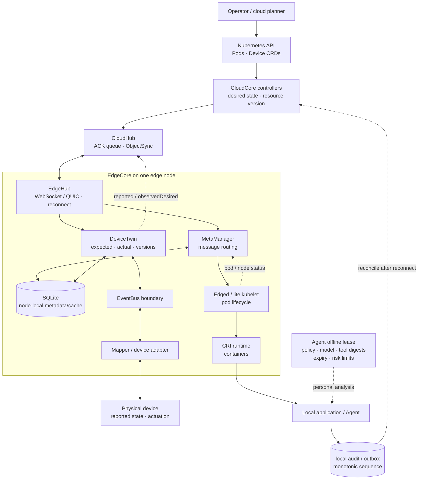

# KubeEdge Cloud-Edge Autonomy：在断网边界上划分规划权与执行权

云边连接消失时，真正的问题不是“进程还能不能跑”，而是边缘还被授权做什么。KubeEdge 能让已下发工作负载和节点局部状态继续工作，却不会把云端控制权完整复制到现场；新凭证、跨节点协调、集中审批和未缓存依赖仍可能停住。

KubeEdge 把 Kubernetes 期望和设备配置留在云端规划，把已下发工作负载、局部 metadata、设备交互和运行健康留在边缘执行。恢复连接后，CloudHub 与 EdgeHub 通过资源版本、确认消息、状态上报和同步控制器继续协调，而不是简单让最后到达的状态覆盖一切。

本文固定在 KubeEdge v1.20.0。迁移到物理 Agent 时，云边 Agent 离线自治必须有明确授权、风险预算、过期和回滚边界；离线权限租约、审计 outbox、反回滚和人工接管均标为应用设计，不冒充 KubeEdge 内建能力。

## 学习问题

1. CloudCore、CloudHub、EdgeHub 与 EdgeCore 分别拥有规划、传输和本地执行链中的哪一段？
2. MetaManager 的 SQLite metadata 能支撑哪些断网行为，为什么它不是 Kubernetes API Server 或完整权威数据库？
3. Edged 如何从本地 pod metadata 恢复并经 CRI 管理工作负载，DeviceTwin 又如何把 desired/reported 映射为 expected/actual？
4. CloudHub 的 ACK、ObjectSync 资源版本、EdgeHub 重连和本地状态上报如何协作，哪些消息仍可能重复、迟到或丢失？
5. 物理 Agent 的离线权限租约应怎样绑定策略、模型、工具、设备身份、时钟和风险等级？
6. 重连后怎样防止旧边缘结果覆盖新云端意图，并在冲突、回滚或无法判断时转人工？

## 一页摘要

**已证实事实**：CloudCore 以 Kubernetes API 与 controllers 形成规划入口，CloudHub 承担云边消息中介。EdgeHub 通过 WebSocket 或 QUIC 路由资源更新并上报节点、pod 和设备状态；读写或 keepalive 失败后，它关闭旧 client、发布 disconnected 状态并重连。

**已证实事实**：MetaManager 把节点 metadata 写入 SQLite，Edged 启动时查询本地 pod 并经 CRI 管理容器。断网后只可使用此前已同步且仍适用的 pod、ConfigMap、Secret 等数据。SQLite 是节点局部 cache，不是 Kubernetes API Server，也不承诺跨节点事务或任意离线创建资源。

**已证实事实**：Device CRD 用 `desired` 表达云端意图，以 `reported` 表达设备报告，并用 `observedDesired` 表示 Mapper 已观察到的期望；EdgeCore 内部仍使用 `expected/actual`。CloudHub ACK 只证明需确认资源已在 MetaManager 落地，NO-ACK 消息可丢；DeviceTwin 也没有完整离线 outbox。重连不等于 exactly-once 或语义冲突自动解决。

**基于证据的推断**：Agent 平台可把云端定义为 policy/model/tool bundle 签发者，把边缘定义为受租约约束的执行者。每个离线动作绑定 `lease_id`、策略和制品版本、设备身份、风险与预算；结果进入 append-only audit/outbox。重连后先对账再接单，迟到结果不能直接覆盖新意图。

| 关键决策 | 推荐默认 | 边界与退出信号 |
| --- | --- | --- |
| 云边权威 | 云端签发期望、策略与版本；边缘只执行已缓存且未过期的授权 | 需要新资源、新 Secret、跨节点协调或集中审批时暂停 |
| 离线工作负载 | 维持已有 pod、探针、重启与本地设备闭环 | 镜像/卷/配置未准备、依赖云 API 或资源压力失控时降级 |
| 设备状态 | desired/reported 分离，命令与观测带版本和时间 | reported 未证明命令唯一执行；危险设备动作需外部安全联锁 |
| 重连 | 版本比较、ACK、状态快照、outbox reconciliation | 冲突不可自动判定、效果不可逆或审计缺口时人工接管 |
| 缓存定位 | SQLite 是节点局部 metadata/cache | 不作全局真相、审计总账或跨节点事务数据库 |

## 事实边界

本文于 **2026-07-22** 选择稳定 release **KubeEdge v1.20.0**。架构与组件语义只采用 release-1.20 文档和同一 tag 的源码，不把默认官网或后续分支语义倒灌到结论中。

  
证据：v1.20.0 tag、提交与文档截断

- **固定 tag：** [`v1.20.0`](https://github.com/kubeedge/kubeedge/releases/tag/v1.20.0)。
- **完整提交：** `git ls-remote` 与本地精确 fetch 均解析为 [`bae61505d4919c404665f70347ad0646aaa98958`](https://github.com/kubeedge/kubeedge/tree/bae61505d4919c404665f70347ad0646aaa98958)。
- **提交信息：** 2025-01-21 12:40:26 UTC，更新 v1.20.0 版本；官方 release blog 同样记录 v1.20 于 2025-01-21 发布。
- **文档范围：** 只使用 [`release-1-20.docs.kubeedge.io`](https://release-1-20.docs.kubeedge.io/docs/)；默认官网和 `release-1.20` 分支后续修复不在本文范围。
- **边界：** 这些锚点固定版本语义，不证明迁移设计中的 Agent 租约、outbox 或反回滚是 KubeEdge API。

**已证实事实**：v1.20 Device API 源码明确区分 `desired`、`reported` 与 `observedDesired`；EdgeCore 内部 DeviceTwin 仍沿用 `expected/actual` 命名。本文在谈 Kubernetes CRD 时使用 desired/reported，在谈 EdgeCore 内部消息和 SQLite 时使用 expected/actual，避免把两个层次误写成同一字段。

**边界。已证实事实**：CloudHub dispatcher 的 ACK 说明只覆盖需要确认的资源消息，并以 MetaManager 成功存储为确认点；NO-ACK 路径允许丢失，DeviceTwin 成功点尚有 TODO。由此不能承诺任意云边消息、设备命令或物理副作用 exactly-once，也不能把 twin version 当作通用事务序号。

**个人分析**：本案例把“离线 Agent 权限租约、模型/工具 bundle、风险分级、审计 outbox、人工接管和反回滚”作为迁移设计。这些都不是 KubeEdge v1.20.0 开箱即用的 API；实现者必须另建签名、持久化、设备安全和治理机制。

## 架构图

先看规划权与执行权在哪里分开：云端持有 desired 和版本，边缘只持有运行现有工作负载、读取节点 cache 与驱动本地设备所需的状态。断网并不会把这条边界消除，只会迫使系统依据预先授权进入降级模式。

文字等价描述：云端 Operator 通过 Kubernetes API 修改 pod 或 Device CRD；CloudCore controllers 产生面向节点的期望状态，CloudHub 经 WebSocket/QUIC 连接把消息送到 EdgeHub。

EdgeCore 内 MetaManager 持久化节点局部 metadata，Edged 经 CRI 运行容器；DeviceTwin 保存 expected/actual，EventBus 或 DMI 边界把它交给 Mapper，Mapper 才与物理设备交互。

断网时云边虚线被切断，已运行应用只可依据未过期权限租约和本地 cache 执行，并写本地 outbox。重连后先上报和协调，不直接把离线结果当成云端新真相。

## 控制权与任务流

**说明性场景**：一个边缘 Agent 在断网期间依据未过期租约执行低风险设备调整，同时云端产生了新的 desired。场景只用于追踪已证实的云边机制和明确标注的应用层恢复设计，不是 KubeEdge 官方事故。

1. **云端规划。** Kubernetes API 保存 pod、Device 和相关期望；EdgeController/DeviceController 根据目标 node 与资源版本生成下行消息。Device `spec.properties[].desired` 是设备控制意图，`status.twins[].reported` 是观测结果，两者不能互换。

2. **CloudHub 下发。** CloudHub 把消息按 node ID 放入节点队列。需要 ACK 的资源消息必须带 resource version；EdgeCore 成功存入 MetaManager 后确认，超时会重试。ObjectSync/ClusterObjectSync 保存成功点，SyncController 周期比较云端对象版本，形成后续 reconciliation。

3. **EdgeHub 接收。** EdgeHub 从 WebSocket/QUIC 收取消息并按 group 路由到 MetaManager、DeviceTwin 或 EventBus。读、写或 heartbeat 错误会触发断开；连接状态广播给 meta/twin/bus group，随后等待恰好两个 heartbeat 周期再重连。因此恢复延迟受 heartbeat 配置约束，不能把断线重连视为即时切换。

4. **metadata 落地。** MetaManager 先把 insert/update/delete/response 写入节点 SQLite，再通知 Edged 或 DeviceTwin。Edged 查询 pod、ConfigMap、Secret 等时，在线且资源类型要求远端查询才会请求云端；断网或不需远端时读取本地 DB。

5. **工作负载执行。** Edged 启动后从 MetaManager 查询本地 pod 列表，向 lite kubelet 提交 `SET`，并通过 CRI 管理容器、探针和 pod lifecycle。它能维持已有工作负载，不代表能在离线时完成新的调度、镜像拉取、存储挂载、Secret 获取或跨节点编排。

6. **设备闭环。** 云端 desired 下发后，EdgeCore 内部转换为 DeviceTwin expected；Mapper 接收并对物理设备执行，采集 actual，再上报为 CRD reported，并回写 observedDesired 表明本轮已观察的期望。DeviceTwin SQLite 保存当前 twin 与版本并生成 delta，但物理效果是否发生仍要由 Mapper/设备回执与安全传感器验证。

7. **断网继续。** EdgeHub 标记 disconnected 后，本地 Edged、CRI、DeviceTwin、Mapper 和应用进程可以继续运行；本地查询使用已有 metadata。云端新意图到不了现场，边缘新状态也暂时上不去。任何依赖云 API、在线授权、远程 Secret 或跨站点共识的动作必须失败关闭或进入降级模式。

8. **重连协调。** EdgeHub 新建连接并广播 connected；需要 ACK 的资源继续按版本同步。Edged/lite kubelet 周期生成 pod status，并经 MetaManager 上报云端。DeviceTwin 从 disconnected 变为 connected 时会请求 membership detail；后续显式 twin sync 或新的设备报告可更新云端 reported/observedDesired，但断网期间被跳过的所有发云消息不会自动变成完整重放日志。重复和迟到消息必须按资源/twin/业务版本判定，不能按到达顺序覆盖。

9. **冲突处理。** 若断网期间云端 desired 已改变，而边缘 outbox 记录了旧授权下的结果，先保留两者：云端意图是当前规划候选，边缘记录是已发生事实候选。可逆低风险动作按策略重算；不可逆或无法证明的动作冻结并转人工，禁止盲重放。

**基于证据的推断**：对于 Agent，云端下发的不是一条无限期“自主运行”开关，而是一个可验证 bundle：`lease_id`、`policy_version`、`model_digest`、`tool_digest`、`device_set`、`risk_ceiling`、`not_before`、`expires_at`、`max_offline_duration`、预算和撤销 epoch。边缘只接受签名有效、版本不降级、设备身份匹配且仍在时间窗内的 bundle。

**个人分析**：每次本地动作先写 append-only audit/outbox，再调用工具或设备，随后追加 receipt，不原地改写历史。记录至少包含单调序号、boot ID、wall clock、monotonic elapsed、输入/输出 hash、策略判定、模型/工具版本、设备证书指纹、效果分类与操作者。

这个 outbox 是应用设计，不应假装成 MetaManager cache 或 DeviceTwin twin 表。

## 关键源码导读

最短源码路径沿一条消息走：EdgeHub 处理连接，CloudHub dispatcher 和 SyncController 确认可重试资源，MetaManager/Edged 负责节点 cache 与 pod 恢复，Device API 与 DeviceTwin 区分期望和观测。它能证明基础同步与恢复接缝，不能证明物理副作用 exactly-once。

本节只解释 KubeEdge v1.20.0 固定快照。release 范围决定组件、字段与重连语义，后续分支修复不倒灌到本文结论。

  
证据：连接、资源同步、本地 cache 与设备状态源码

- **固定提交：** [`kubeedge/kubeedge@bae61505d4919c404665f70347ad0646aaa98958`](https://github.com/kubeedge/kubeedge/tree/bae61505d4919c404665f70347ad0646aaa98958)，tag `v1.20.0`。

| 固定源码 | 可观察事实 | 支持的结论 | 不支持的结论 |
| --- | --- | --- | --- |
| [`edgehub.go`](https://github.com/kubeedge/kubeedge/blob/bae61505d4919c404665f70347ad0646aaa98958/edge/pkg/edgehub/edgehub.go) 与 [`process.go`](https://github.com/kubeedge/kubeedge/blob/bae61505d4919c404665f70347ad0646aaa98958/edge/pkg/edgehub/process.go) | client 初始化后广播 connected；读写/keepalive 错误触发 reconnect；断开广播给 meta/twin/bus groups | 连接状态显式化与自动重连 | 断网消息零丢失、零重复或语义冲突自动解决 |
| [`certmanager.go`](https://github.com/kubeedge/kubeedge/blob/bae61505d4919c404665f70347ad0646aaa98958/edge/pkg/edgehub/certificate/certmanager.go) | 本地加载 X.509 key pair；缺失时以 token 申请；可在证书生命周期约 70%–90% 抖动窗口轮换并重连 | 节点证书和轮换有实现接缝 | 业务设备身份、Agent tool credential 或离线撤销自动覆盖 |
| [`message_dispatcher.go`](https://github.com/kubeedge/kubeedge/blob/bae61505d4919c404665f70347ad0646aaa98958/cloud/pkg/cloudhub/dispatcher/message_dispatcher.go) 与 [`node_session.go`](https://github.com/kubeedge/kubeedge/blob/bae61505d4919c404665f70347ad0646aaa98958/cloud/pkg/cloudhub/session/node_session.go) | ACK 在 MetaManager 存储后返回；超时重试；NO-ACK 可丢；资源版本成功点写 ObjectSync | 资源消息可确认、去除旧版本并重试 | 所有消息/设备效果 exactly-once，或队列本身是业务审计日志 |
| [`synccontroller.go`](https://github.com/kubeedge/kubeedge/blob/bae61505d4919c404665f70347ad0646aaa98958/cloud/pkg/synccontroller/synccontroller.go) | 周期比较 ObjectSync 中已下发版本与 Kubernetes 当前对象，生成同步事件 | 重连后的资源收敛有版本化控制循环 | 多资源原子事务或应用级冲突自动合并 |
| [`metamanager/process.go`](https://github.com/kubeedge/kubeedge/blob/bae61505d4919c404665f70347ad0646aaa98958/edge/pkg/metamanager/process.go) 与 [`dao/meta.go`](https://github.com/kubeedge/kubeedge/blob/bae61505d4919c404665f70347ad0646aaa98958/edge/pkg/metamanager/dao/meta.go) | metadata 以 key/type/value 写 SQLite；在线时部分查询走云端，否则查本地 | 节点局部 metadata/cache 支撑恢复和离线读 | Kubernetes 全量权威副本、任意离线写或跨节点事务 |
| [`edged.go`](https://github.com/kubeedge/kubeedge/blob/bae61505d4919c404665f70347ad0646aaa98958/edge/pkg/edged/edged.go) | 启动时查询本地 pod 列表并向 lite kubelet 提交；kube client bridge 指向 MetaClient | 已同步 pod 可从本地 metadata 恢复并由 CRI 管理 | 未缓存依赖、云端调度或任意控制命令离线可用 |
| [`device_instance_types.go`](https://github.com/kubeedge/kubeedge/blob/bae61505d4919c404665f70347ad0646aaa98958/staging/src/github.com/kubeedge/api/apis/devices/v1beta1/device_instance_types.go) | `desired` 在 spec property；`reported/observedDesired` 在 status；注释明确 Mapper 执行设备命令 | 云端意图、Mapper 观察和设备报告分离 | reported 等于命令只执行一次，或 DeviceTwin 直接驱动物理设备 |
| [`twin.go`](https://github.com/kubeedge/kubeedge/blob/bae61505d4919c404665f70347ad0646aaa98958/edge/pkg/devicetwin/dtmanager/twin.go)、[`communicate.go`](https://github.com/kubeedge/kubeedge/blob/bae61505d4919c404665f70347ad0646aaa98958/edge/pkg/devicetwin/dtmanager/communicate.go) 与 [`types.go`](https://github.com/kubeedge/kubeedge/blob/bae61505d4919c404665f70347ad0646aaa98958/edge/pkg/devicetwin/dttype/types.go) | expected/actual 有 cloud/edge version；更新写 SQLite transaction，失败时从 SQLite 恢复上下文；断网跳过发云，重连请求 membership detail | twin 有局部版本、持久化恢复和连接生命周期反应 | twin 是不可变事务日志、通用 outbox、全量离线重放或物理副作用证明 |
| [`downstream.go`](https://github.com/kubeedge/kubeedge/blob/bae61505d4919c404665f70347ad0646aaa98958/cloud/pkg/devicecontroller/controller/downstream.go) 与 [`upstream.go`](https://github.com/kubeedge/kubeedge/blob/bae61505d4919c404665f70347ad0646aaa98958/cloud/pkg/devicecontroller/controller/upstream.go) | spec 变化下发设备消息；actual 映射 reported，expected 映射 observedDesired 并 patch status | desired 下行、reported 上行的完整控制链 | 业务安全、设备联锁和冲突政策由 DeviceController 自动决定 |

**边界：** 本卡证明连接、节点 metadata、资源版本和 twin 数据流，不证明设备动作唯一执行，也不证明 Agent 离线授权、审计或业务冲突裁决。

## 架构决策与权衡

**个人分析**：KubeEdge 给出了通信、cache 和 desired/reported 原语；Agent 离线权限必须在它们之上另加一个明确的 authority lease。推荐采用以下签名合同：

| 租约字段 | 必需控制 | 拒绝条件 |
| --- | --- | --- |
| 身份与范围 | `tenant/site/node/agent/device_set`，绑定节点证书和设备证书指纹 | 节点、设备或租户不匹配；证书无效或已知撤销 |
| 策略 | 不可变 `policy_version`、签名者、撤销 epoch、允许/禁止动作 | 未知签名者、旧 epoch、策略缺失或版本回退 |
| 模型与工具 | model/tool digest、prompt/schema version、工具 allowlist 和参数约束 | 本地制品 digest 不符、工具超范围、模式不兼容 |
| 时间 | `not_before/expires_at/max_offline_duration`，同时记录 wall clock 与 monotonic elapsed | 时钟回拨超阈值、boot 后无可信时间锚、任一截止已过 |
| 风险与预算 | risk ceiling、次数、能耗、token、速率、并发和累计物理位移/温度等预算 | 单次或累计预算超限；观测/联锁不可用 |
| 恢复 | supersedes、minimum accepted version、rollback target、recovery procedure | bundle 降到最低版本以下；回滚目标未签名或状态不兼容 |

**基于证据的推断**：时钟不能只信任设备 wall clock。在线时保存签名时间锚和本地 monotonic 起点；离线时以“签名截止时间”和“自最后在线起单调经过时长”两者更早者过期。重启导致 monotonic 纪元变化、RTC 明显倒退或时间不确定时，高风险租约立即失效，低风险只进入更窄的保守模式。

| 风险级别 | 离线允许 | 离线禁止 | 过期行为 |
| --- | --- | --- | --- |
| L0 观察 | 读取本地传感器、健康检查、缓存推理、写审计 | 修改设备、外发敏感数据、改变安全配置 | 可保留只读与本地告警 |
| L1 可逆局部 | 限速启停非关键任务、调整可回滚参数、重启已批准容器 | 新增权限、下载未知制品、跨设备协调 | 停止新动作，维持安全状态 |
| L2 受控物理 | 在硬联锁、双重传感器、幅度/次数预算内执行签名动作 | 越过安全包络、禁用联锁、无人批准的批量动作 | 立即进入设备定义的 fail-safe |
| L3 不可逆/高影响 | 无；只允许完成已进入的安全停止序列 | 固件刷写、密钥轮换、永久删除、付款、危险运动、策略自修改 | 冻结、告警、等待人工或云端批准 |

**个人分析**：回滚也必须受策略控制。bundle 包含单调 `security_epoch` 与 `minimum_accepted_version`；边缘保存最高已接受值和签名 receipt。普通回滚只能切到预先批准、schema 兼容、漏洞状态可接受的版本，不能覆盖更高安全 epoch。若旧模型/工具会误读新状态，先排空任务并运行显式状态迁移；无法安全降级时采用前向修复，而不是强制回滚。

**个人分析**：重连 reconciliation 按四步执行：上传 append-only outbox 与本地状态快照；下载当前云端 policy/model/tool/desired；按 `operation_id + device + base_version` 去重并分类为 accepted、stale、conflict、unknown-effect；最后才开放新任务。云端 desired 与已发生物理事实冲突时不能“最后写入者胜”，应由设备安全规则决定补偿、保持、隔离或人工接管。

## 生产化分析

生产设计的首要检查是：网络断开、租约过期或本地状态不可信时，边缘是否会自动缩权。节点身份、设备身份、策略版本、物理安全包络和审计容量必须分别可观测；“pod 仍在运行”不是继续执行高风险动作的充分条件。

  
证据：离线权限、设备安全与重连恢复清单

| 生产维度 | 最小控制 | 关键观测 | 故障与恢复 |
| --- | --- | --- | --- |
| 安全与设备身份 | EdgeHub mTLS；每设备独立身份/证书；租约绑定 site/node/device；工具调用点再授权 | 证书指纹、issuer、到期、deny 原因、异常设备切换 | 隔离未知设备；撤销 epoch；无法在线查撤销时缩短高风险离线期 |
| 证书与密钥轮换 | KubeEdge 节点证书按配置轮换；设备/Agent 密钥独立轮换；私钥硬件保护 | NotBefore/NotAfter、轮换失败、重连次数、旧 key 使用 | 提前轮换并保留短重叠窗；禁止永久 fallback 到旧 key |
| 离线权限 | 签名 lease、风险 ceiling、动作 allowlist、显式 deny、可信时间锚 | 剩余租期、离线时长、clock drift、budget consumption | 到期 fail-safe；时间不确定降权；L3 永不离线授权 |
| 模型/工具/策略版本 | content digest、兼容矩阵、minimum version、双槽制品、签名 manifest | 当前/目标/上次良好版本、加载/评估结果、反回滚拒绝 | 先 canary 后切换；失败回上次良好；安全 epoch 禁止降级 |
| 本地 metadata | SQLite 完整性检查、容量上限、备份/重建路径；cache 与权威标签分开 | DB size/latency/error、资源版本、cache age、miss | 损坏时停止依赖该状态的动作；从云端重建，不伪造全量真相 |
| 设备执行安全 | Mapper allowlist、参数包络、速率/幅度限额、硬联锁、双传感器确认 | command/receipt、desired/reported 差异、联锁状态、设备健康 | 立即停止/隔离；unknown effect 转人工；不可盲重放命令 |
| 资源限额 | CPU/内存/磁盘/PID、容器和模型并发、token/能耗/网络/outbox 配额 | pressure、OOM、disk fill、queue age、拒绝率、outbox 水位 | 背压与任务降级；保留安全控制与审计写入预算 |
| 本地审计/outbox | append-only、hash chain、单调 seq、boot ID、加密、幂等 operation ID | 缺号、hash mismatch、未确认 age、unknown-effect 数 | 停止高风险动作；分批上传；云端 receipt 后再归档 |
| 重连协调 | ACK/resource version + Agent base version；先对账后接单；限制重放速率 | reconnect duration、duplicate/stale/conflict、sync lag | 冲突隔离；补偿或人工；对账完成前保持离线风险上限 |
| 可观测性 | 云边分开 SLO；本地持久指标/日志/trace；统一 node/task/device/lease/version | heartbeat、连接状态、pod/twin sync、动作延迟、拒绝和人工接管 | 断网缓冲并控制基数；恢复后有界上传，避免挤占控制通道 |
| 故障恢复 | 已同步 pod 本地恢复；安全状态机；DB/outbox 恢复演练；灾难 runbook | restart、CRI/Mapper error、corruption、恢复点、演练结果 | 优先物理安全；重建 cache；核对实际设备后恢复自动化 |

**边界：** 表中的 lease、设备级身份、hash-chain outbox、模型/工具 digest、风险分级和人工接管是应用层治理，不是 KubeEdge v1.20.0 内建 API。

**安全。已证实事实**：v1.20 EdgeHub CertManager 加载节点 X.509 certificate/key，首次缺失时用 token 获取 CA 与边缘证书，开启 rotation 后在证书生命周期约 70%–90% 的抖动点申请新证书，并让 EdgeHub 重连使用新材料。这是节点到 CloudCore 的身份链，不是每台物理设备或每个 Agent 工具的自动身份。

**安全。个人分析**：设备身份应独立于 node identity，最好由 TPM/secure element 保护私钥；Mapper 建立会话时验证设备证书或硬件标识，并把设备指纹写入每条 command receipt。

工具凭证按动作即时派生、短期有效且不进入模型 prompt、SQLite metadata 或普通日志。断网撤销天然有传播延迟，所以高风险证书和租约必须更短，并配本地 denylist/epoch。

**容量与恢复。个人分析**：磁盘接近满载时，优先保留安全事件、租约、outbox 和最小运行 metadata，停止模型缓存扩张与低价值 telemetry。恢复测试要覆盖 CloudHub 不可达、EdgeCore 重启、SQLite 损坏、CRI 重启、Mapper 断连、设备 reported 停滞、证书轮换失败和 outbox 重复上传；“pod 还在跑”不等于物理流程安全。

**可观测性。基于证据的推断**：KubeEdge 的连接、resource version、pod status 和 twin version 只能说明基础同步状态。

Agent 还要记录 `lease_id/policy/model/tool/security_epoch`、offline duration、risk class、operation ID、device receipt、base/result version、clock uncertainty 和 human takeover reason，才能解释为什么一个离线动作被允许以及重连后如何裁决。

## 可迁移经验

### 可直接复用的机制

- **规划权与执行权分层**：云端管理 desired、策略和版本；边缘保存足够的本地 metadata 并运行既有执行器，不让短暂网络中断直接停止现场。
- **节点局部 cache**：按节点持久化真正需要的 workload/device metadata，启动从本地恢复；每条记录带来源、资源版本和 freshness，而不是复制完整云数据库。
- **连接状态显式广播**：通信模块把 connected/disconnected 作为本地输入，查询、同步和动作策略据此切换，不靠超时猜测所有组件状态。
- **desired/reported 分离**：命令意图、执行器已观察意图和设备真实报告分别存储；差异触发协调，不把发送成功当执行成功。
- **ACK 与版本化 reconciliation**：确认落点、资源版本、重试和周期比较组合使用；重复处理要求幂等，迟到消息要求版本门禁。
- **离线权限租约**：把允许动作、风险上限、模型/工具 digest、时钟和预算放进短期签名 bundle，过期自动缩权。
- **本地审计 outbox**：离线动作先持久记录再执行，重连后按 operation ID、base version 与设备 receipt 对账。

### 只能有限类比的部分

- MetaManager SQLite 能支撑节点 metadata 和缓存查询；Agent outbox 需要 append-only、hash chain、保留期和审计访问控制，不能直接把同一表当合规总账。
- KubeEdge resource version 与 DeviceTwin cloud/edge version 能帮助同步；Agent 的不可逆工具效果还需业务 operation ID、下游幂等键和真实 receipt。
- Edged 可维持 pod lifecycle；模型推理、工具调用和物理动作还受制品、能耗、传感器、安全联锁和现场设备状态约束。
- Device desired/reported 适合状态收敛；多步机器人任务、资金操作或安全审批不是一个 twin property 能表达的事务。
- CloudHub ACK 证明消息在 EdgeCore 的特定落点被处理，不证明 Mapper 已操作设备，更不证明物理世界达到 desired。
- 节点证书轮换保护云边连接；设备、用户、Agent 和工具仍需各自身份、最小权限和撤销机制。

### 不应照搬的部分

- 不要把“断网自治”写成边缘可执行任意控制操作。只有已授权、资源已准备、可观察且在风险预算内的动作才可继续。
- 不要把 SQLite cache 写成 Kubernetes API Server、全局数据库或跨节点权威状态；cache 缺失、陈旧或损坏必须显式暴露。
- 不要把 DeviceTwin 当事务日志、工作流历史或 exactly-once 命令总线；expected/actual 与版本只覆盖 twin 数据模型。
- 不要在重连时按最后到达覆盖。云端新 desired 与边缘已发生事实可能同时有效，必须按版本、效果和安全规则协调。
- 不要让离线 Agent 自行扩大 lease、修改 policy/model/tool digest、跳过设备联锁或延长过期时间。
- 不要用软件回滚绕过安全 epoch。旧版本若含已知漏洞或不兼容新状态，应前向修复、隔离或人工恢复。
- 不要把容器存活当业务安全或物理安全证明；必须同时观察设备 reported、联锁、资源压力、outbox 和人工接管状态。

## 来源

**KubeEdge v1.20 官方文档（已证实事实，访问与截断日期 2026-07-22）**

- [v1.20 Why KubeEdge](https://release-1-20.docs.kubeedge.io/docs/) 与 [v1.20 release blog](https://release-1-20.docs.kubeedge.io/blog/release-v1.20)：组件总览、edge autonomy 定位、稳定 release 日期和 v1.20 边界。
- [CloudHub](https://release-1-20.docs.kubeedge.io/docs/architecture/cloud/cloudhub/) 与 [EdgeHub](https://release-1-20.docs.kubeedge.io/docs/architecture/edge/edgehub/)：WebSocket/QUIC、云边路由、keepalive、连接状态和上下行职责。
- [MetaManager](https://release-1-20.docs.kubeedge.io/docs/architecture/edge/metamanager/) 与 [Edged](https://release-1-20.docs.kubeedge.io/docs/architecture/edge/edged/)：SQLite metadata、insert/update/delete/query、pod lifecycle、CRI、Secret/ConfigMap cache。
- [DeviceTwin](https://release-1-20.docs.kubeedge.io/docs/architecture/edge/devicetwin/) 与 [Device Controller](https://release-1-20.docs.kubeedge.io/docs/architecture/cloud/device_controller/)：设备 metadata/status、expected/actual、cloud-edge sync 和 Device CRD 控制链。

**KubeEdge v1.20.0 固定源码（已证实事实）**

- [`kubeedge/kubeedge@bae61505d4919c404665f70347ad0646aaa98958`](https://github.com/kubeedge/kubeedge/tree/bae61505d4919c404665f70347ad0646aaa98958)：tag `v1.20.0` 对应完整 SHA；访问日期 2026-07-22。
- [`edgehub.go`](https://github.com/kubeedge/kubeedge/blob/bae61505d4919c404665f70347ad0646aaa98958/edge/pkg/edgehub/edgehub.go)、[`edgehub/process.go`](https://github.com/kubeedge/kubeedge/blob/bae61505d4919c404665f70347ad0646aaa98958/edge/pkg/edgehub/process.go) 与 [`certmanager.go`](https://github.com/kubeedge/kubeedge/blob/bae61505d4919c404665f70347ad0646aaa98958/edge/pkg/edgehub/certificate/certmanager.go)：连接循环、状态广播、重连、限流、节点证书申请与轮换。
- [`message_dispatcher.go`](https://github.com/kubeedge/kubeedge/blob/bae61505d4919c404665f70347ad0646aaa98958/cloud/pkg/cloudhub/dispatcher/message_dispatcher.go)、[`node_session.go`](https://github.com/kubeedge/kubeedge/blob/bae61505d4919c404665f70347ad0646aaa98958/cloud/pkg/cloudhub/session/node_session.go) 与 [`synccontroller.go`](https://github.com/kubeedge/kubeedge/blob/bae61505d4919c404665f70347ad0646aaa98958/cloud/pkg/synccontroller/synccontroller.go)：ACK/NO-ACK、重试、ObjectSync 成功点和资源版本 reconciliation。
- [`metamanager/process.go`](https://github.com/kubeedge/kubeedge/blob/bae61505d4919c404665f70347ad0646aaa98958/edge/pkg/metamanager/process.go)、[`dao/meta.go`](https://github.com/kubeedge/kubeedge/blob/bae61505d4919c404665f70347ad0646aaa98958/edge/pkg/metamanager/dao/meta.go) 与 [`edged.go`](https://github.com/kubeedge/kubeedge/blob/bae61505d4919c404665f70347ad0646aaa98958/edge/pkg/edged/edged.go)：本地 metadata 写入/查询、在线远端查询条件、启动 pod 恢复和 lite kubelet/CRI 接缝。
- [`device_instance_types.go`](https://github.com/kubeedge/kubeedge/blob/bae61505d4919c404665f70347ad0646aaa98958/staging/src/github.com/kubeedge/api/apis/devices/v1beta1/device_instance_types.go)、[`twin.go`](https://github.com/kubeedge/kubeedge/blob/bae61505d4919c404665f70347ad0646aaa98958/edge/pkg/devicetwin/dtmanager/twin.go)、[`communicate.go`](https://github.com/kubeedge/kubeedge/blob/bae61505d4919c404665f70347ad0646aaa98958/edge/pkg/devicetwin/dtmanager/communicate.go)、[`types.go`](https://github.com/kubeedge/kubeedge/blob/bae61505d4919c404665f70347ad0646aaa98958/edge/pkg/devicetwin/dttype/types.go)、[`downstream.go`](https://github.com/kubeedge/kubeedge/blob/bae61505d4919c404665f70347ad0646aaa98958/cloud/pkg/devicecontroller/controller/downstream.go) 与 [`upstream.go`](https://github.com/kubeedge/kubeedge/blob/bae61505d4919c404665f70347ad0646aaa98958/cloud/pkg/devicecontroller/controller/upstream.go)：desired/reported/observedDesired、expected/actual、版本、连接生命周期与云边设备状态映射。

**证据边界说明**：离线 authority lease、风险分级、模型/工具 bundle、双时钟过期、append-only audit/outbox、设备级凭证、人工接管、业务冲突规则和反回滚保护，均是依据 KubeEdge v1.20.0 机制形成的“基于证据的推断”或“个人分析”，不是 KubeEdge 官方功能承诺。默认官网及 v1.20.0 之后的组件和语义不在本文结论范围内。
