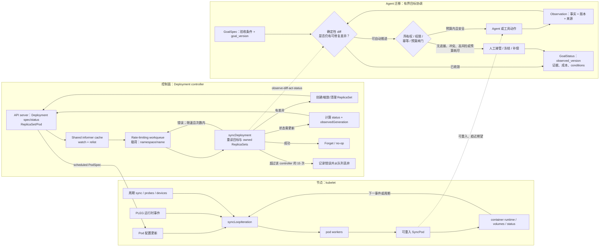

# Kubernetes Reconciliation Loop：让智能体围绕期望状态持续收敛

Kubernetes 的关键启发不是“用 YAML 管 Agent”，而是把一次性命令改写为可持续验证的期望状态：控制器反复观察真实世界，依据可重算的差异选择动作或安全地 no-op/等待，并把已观察版本、当前状态与失败证据写回共享控制面。系统不要求每条事件恰好处理一次；它要求同一个目标被重复处理后仍能恢复不变量并在有界窗口内趋于收敛。

本案例以 Kubernetes v1.36 在线架构文档和 `kubernetes/kubernetes` 上游提交 `39c618b5c30ced3969862e0b4b5acce7a7f8cecb` 为证据截面。源码阅读刻意分开两条实现缝隙：`kube-controller-manager` 内的 Deployment controller 使用 informer 与限速 workqueue；每个节点上的 kubelet 则运行多通道、周期触发的 sync loop，并把 Pod 交给 pod workers。二者共享“趋近目标”的思想，但绝不是一个通用控制器模板的两处复制。

## 学习问题

1. 为什么声明“最终要达到什么状态”比排入一串“接下来执行什么命令”更能承受进程重启、重复事件和暂时失联？
2. `spec`、`status` 与 `status.observedGeneration` 分别表达意图、观测和观测版本，为什么不能把三者压成一个 `state` 字段？
3. Deployment controller 的 informer、对象键 workqueue、`syncDeployment`、status update 与 requeue 如何组成一次可重复的协调？
4. kubelet 的 `syncLoop`、PLEG、周期 sync 和 `SyncPod` 与 Deployment controller 有何不同，为什么不能宣称 Kubernetes 只有一种控制循环实现？
5. owner reference、field manager、`resourceVersion` 与 leader election 分别解决对象、字段、版本和实例级的哪种所有权问题？
6. 当两个控制器争写同一目标、观察过期、动作有副作用或模型输出不确定时，Agent 平台如何设置收敛条件、预算与人工升级？

## 一页摘要

**已证实事实**：Kubernetes 对象是“意图记录”；`spec` 描述期望状态，`status` 由系统组件更新以描述当前状态。官方 controller 文档将控制器定义为观察集群状态并使当前状态更接近期望状态的控制循环。Kubernetes 使用多个分别管理某一方面状态的控制器，而不是一个相互缠绕的单体循环。

**已证实事实**：当前提交中的 Deployment controller 监听 Deployment、ReplicaSet 和部分 Pod 事件，把 `namespace/name` 键加入 typed rate-limiting queue；worker 取键后调用 `syncDeployment`。成功时 `Forget`，错误时最多按该 controller 的策略限速重排 15 次，之后从队列丢弃。它从 informer cache 重新读取该 controller 最新观察到的 Deployment，声明同一键不并发执行，并在需要时创建/缩放 ReplicaSet、计算并更新 Deployment status。

**已证实事实**：kubelet 不是上述 workqueue worker。它在节点上接收配置变更、PLEG 容器生命周期事件、周期 sync、探针与设备事件；`syncLoopIteration` 把需要协调的 Pod 分发给 handler/pod workers。`SyncPod` 的源码契约明确称它可重入：无错误返回表示 runtime 已与期望配置同步；若返回瞬时错误，则预期下一次调用继续取得进展。

**基于证据的推断**：一次 reconcile 可抽象为“观察 → 判差 → 行动 → 报告状态 → 由事件、周期或错误再次调度”。其中 workqueue 传递的最好是资源身份，不是已经过时的命令快照；真正行动前重新读取目标和当前事实，才能把重复事件与合并事件转化为安全重算。

**个人分析**：Agent 平台可以迁移声明式目标、版本化观测、单写者所有权、幂等动作和限速重排，但不能把 LLM 直接塞进永不终止的控制循环。模型输出是非确定的，调用有 token、费用和时间成本，工具还可能产生不可逆副作用；因此必须同时定义可判定的收敛条件、无进展检测、尝试/成本/时限/写操作预算，以及人工接管终态。

| 比较维度 | 命令队列 | 声明式目标 + reconcile | Agent 系统含义 |
| --- | --- | --- | --- |
| 队列载荷 | “调用 Agent B 写报告” | “报告达到验收条件 V3”对应的资源键 | 事件只提示重算，目标和事实从权威存储读取 |
| 重复处理 | 容易重复执行整条命令 | 重算差异；已满足时 no-op | 必须用幂等键、结果地址和验收状态抑制重复副作用 |
| 进程重启 | 依赖命令游标与恰好一次假设 | 从 `spec`、当前事实和 `status` 重建 | 恢复不依赖模型“记得上次说了什么” |
| 目标变更 | 旧命令可能继续执行 | 下一轮以最新 generation 为准 | 旧计划必须被 epoch/generation 取消或降权 |
| 完成判断 | 命令返回即完成 | 可验证不变量满足，status 标注已观察版本 | “模型返回文本”不等于业务收敛 |

## 事实边界

**已证实事实**

- 官方 controller 文档说明，控制器至少跟踪一种 Kubernetes 资源；资源 `spec` 表达期望状态，控制器负责让当前状态更接近该状态。控制器通常通过 API server 创建、更新或删除其他对象，直接控制外部系统的 controller 则在行动后把当前状态报告回 API server。
- 官方架构文档区分控制面与节点组件：`kube-controller-manager` 运行多个逻辑上独立的 controller；kubelet 运行在每个节点上，接收多种来源提供的 PodSpecs，确保描述的容器运行且健康。
- API watch 让客户端先取得某一 `resourceVersion` 的状态，再接收后续变更流。旧版本超出保留窗口时，客户端必须处理 `410 Gone`、清空本地缓存、重新 list/get，再从新的 `resourceVersion` 开始 watch。
- 更新对象时，API server 用客户端提交的 `resourceVersion` 检测 lost update；过期写会得到 `409 Conflict`。这证明“读取后行动”不是锁住世界，写入端仍要处理并发变化。
- owner reference 让 Kubernetes 不同部分避免干预不受自己控制的对象；Server-Side Apply 的 `managedFields` 把字段归属记录到 manager，**Apply** 修改其他 manager 所有且值不同的字段时默认冲突，字段所有权可以通过双方先声明相同值、再由一方放弃而协调转移。普通 `Update` 不会因 managed-field 冲突自动失败，因此 `managedFields` 是协调元数据，不是授权或 fencing。
- 高可用控制面使用 Lease 做 leader election，目标是让一个 controller-manager 实例活跃、其他实例待命；但固定提交中的 client-go 包注释明确说明，该实现不保证只有一个 client 正在充当 leader，也不提供 fencing。Lease 只用于候选实例协调，不能替代对象键去重、`resourceVersion`/CAS、RBAC/admission 或由写入目标校验的单调 fencing epoch。
- Deployment controller 的 `maxRetries = 15` 是该实现的错误处理选择；kubelet 对 runtime unavailable 使用从 100ms 增长到 5s 上限的指数退避，并在 runtime 恢复后重置。它们不是全 Kubernetes 通用的单一重试预算。

**基于证据的推断**

- `spec` 与 `status` 的分离不是把两个 JSON 对象逐字段相减。Deployment 当前状态要从 ReplicaSet/Pod 等下游资源归纳，kubelet 当前状态要从容器运行时、卷、探针等节点事实归纳；不同 controller 对“当前状态”有不同观测器和动作边界。
- workqueue 里的键允许多次事件合并为一次最新状态协调。事件是“某处可能变了”的触发器，而不是必须原样执行的业务命令；因此丢失单个重复提示不等于丢失目标，只要 watch/relist/periodic resync 能再次暴露差异。
- `status.observedGeneration` 是非常重要的时间语义：status 即使看起来健康，也可能只对应旧 spec。Agent 平台若没有 `observed_goal_version`，就无法区分“目标已满足”和“上一版目标曾满足”。
- Deployment 创建 ReplicaSet 遇到 `AlreadyExists` 时不会盲目当成功；它检查 owner UID 与 Pod template 是否匹配，否则把碰撞写入 status 并重排。这是一种“可重复动作 + 结果身份校验”，比单纯吞掉重复错误更接近语义幂等。

**个人分析与未知项**

- Kubernetes 不负责判断一篇报告是否真实、一次谈判是否合规，或一个规划是否足够好。把业务验收写成确定性 rule、评估器与人工审批，是迁移方的责任，不是 reconciliation 自动提供的能力。
- Kubernetes controller 常作用于可查询、可重复创建/更新/删除的 API 资源；邮件、支付、工单流转和真实设备动作可能无法撤回。此时“再 reconcile 一次”必须先查询外部结果、使用幂等键或进入补偿/人工流程。
- controller 最终可能长期运行，不等于单个目标允许无限尝试。集群基础控制器的可用性模型不能直接授权昂贵、非确定的模型在失败后永久重采样。
- 本文用 Deployment controller 作为 controller-manager 的具体实现样本，不宣称所有内置或第三方 controller 都有相同事件源、队列、重试次数、status 结构或收敛证明。

## 架构图

下图同时展示 Kubernetes 中两条不同协调路径，以及迁移到 Agent 控制面时新增的确定性闸门。实线表示当前提交中可定位的机制；虚线表示有限类比，不代表 kubelet、Deployment controller 与 LLM runtime 可以互换。

**个人分析**：Agent 路径故意把模型放在动作节点，而不是 diff、所有权和预算判定节点。模型可以提出候选计划或生成内容，但“是否收敛”“还能否继续”“谁能写哪个字段/调用哪个工具”应由可重放的确定性控制面决定。否则每次采样都可能重定义目标，循环就没有稳定的势函数。

## 控制权与任务流

**一次 Deployment 协调的控制流。** **已证实事实**：Deployment、ReplicaSet 事件和特定 Pod 删除事件调用 enqueue；队列保存对象键。worker `Get` 键后调用 `syncDeployment`，后者从 lister 读取当前 Deployment，deep copy 后再处理。它先解析 selector 和 owned ReplicaSets，再按删除、暂停、扩缩容、Recreate 或 RollingUpdate 分支行动。成功则 `Forget`；失败在该实现的次数范围内 `AddRateLimited`，超过上限后记录并 `Forget`。

**observe。** **基于证据的推断**：观察必须同时包含最新目标、下游对象和外部事实，而不能只读取旧事件。Deployment controller 用缓存提高读性能，但在收养 ReplicaSet 前通过 uncached quorum read 重查 Deployment 的 deletion timestamp 与 UID，防止基于过期缓存收养到已经删除/重建的 owner。Agent 平台也应在不可逆动作前绕过普通语义缓存，按 `goal_id + generation` 做 fresh read。

**diff。** **个人分析**：差异函数应输出结构化 invariant violation，例如“已验证证据 2/3”“缺少法务批准”“目标版本 8，但执行者只观察到版本 7”，而不是让模型自由回答“接下来做什么”。同一输入与政策版本应得到相同 diff；模型可为差异提出候选修复，但不能偷偷修改完成定义。

**act。** **已证实事实**：Deployment controller 并不自己运行 Pod；它创建或缩放 ReplicaSet，其他组件再继续协调。更精确地说，Deployment → ReplicaSet 是带 owner reference 的声明式委托，ReplicaSet controller → Pod 是下一层 owned-resource 委托，scheduler 的 Pod node binding 是放置决策而不是所有权转移，kubelet → container runtime 才是节点执行边界。Agent orchestrator 也应发布子目标和约束，把局部实现留给明确 owner，而不是向每个 worker 发送一长串不可恢复的命令。

**status。** **已证实事实**：`syncDeploymentStatus` 从 ReplicaSets 计算新 status；若与现有 status 深度相等则 no-op，否则调用 status subresource update。`calculateStatus` 把 `ObservedGeneration` 设置为当前 Deployment generation，并计算 replica、ready、available 等字段。**个人分析**：Agent status 至少应包含 `observed_goal_version`、conditions、最近成功差异缩减、外部副作用引用、评估证据、累计 token/金额/时长与下次允许重试时间。

**requeue。** **已证实事实**：重排来源不只错误。新的对象事件会 enqueue；某些分支可 `AddAfter`；kubelet 则由配置、运行时事件、探针和周期 tick 再次触发。**基于证据的推断**：requeue 是“未来重新观察”，不是“重放同一动作”。如果实现只是重新执行上次模型工具调用，它继承的是命令队列语义，不是 reconciliation。

**所有权与转交。** Kubernetes 同时存在不同粒度：Lease 协调哪个候选实例尝试主动工作，但不提供 fencing；Deployment controller 的该 workqueue 实例保证其 workers 不会对同一 key 并发调用 handler；owner reference 标明哪个上层对象控制 dependent；field manager 记录哪个 workflow 声明管理字段，但不是授权边界。SSA 的“先共享相同值、再由旧 manager 放弃”只适用于字段所有权 handoff，不能直接套到 leader、对象 owner 或节点执行边界。**个人分析**：Agent 平台需要 lease **加**单调递增 fencing epoch，且每次状态迁移和外部写都必须由目标端原子校验 epoch；另外还要独立定义 artifact/child-goal owner 与字段/动作 capability。不要让两个控制器通过轮流覆盖来“自然决定赢家”。

## 关键源码导读

以下链接全部固定到提交 `39c618b5c30ced3969862e0b4b5acce7a7f8cecb`。行号对应该提交，避免 `master` 漂移。

| 源码 seam | 已证实行为 | 对 Agent 架构的阅读价值 |
| --- | --- | --- |
| [`deployment_controller.go` 53–116](https://github.com/kubernetes/kubernetes/blob/39c618b5c30ced3969862e0b4b5acce7a7f8cecb/pkg/controller/deployment/deployment_controller.go#L53-L116) | 定义 15 次重试、lister/cache 成员与 typed rate-limiting queue | 重试策略属于具体 controller，不是“循环天然安全” |
| [`deployment_controller.go` 123–165](https://github.com/kubernetes/kubernetes/blob/39c618b5c30ced3969862e0b4b5acce7a7f8cecb/pkg/controller/deployment/deployment_controller.go#L123-L165) | Deployment/ReplicaSet/Pod informer 注册事件处理器，handler 把相关 owner 入队 | 事件应映射到需要重算的资源 owner |
| [`deployment_controller.go` 399–427](https://github.com/kubernetes/kubernetes/blob/39c618b5c30ced3969862e0b4b5acce7a7f8cecb/pkg/controller/deployment/deployment_controller.go#L399-L427) | 区分立即 enqueue、rate-limited enqueue 与 delayed enqueue | “何时再观察”与“观察后做什么”是两个决策 |
| [`deployment_controller.go` 479–519](https://github.com/kubernetes/kubernetes/blob/39c618b5c30ced3969862e0b4b5acce7a7f8cecb/pkg/controller/deployment/deployment_controller.go#L479-L519) | 该 Deployment controller 的 workers 对相同 key 不并发；成功 Forget；错误限速重排；超限记录并丢弃 | 需要明确 queue 实例范围的 key 串行化、成功去账与有界失败出口 |
| [`deployment_controller.go` 521–548](https://github.com/kubernetes/kubernetes/blob/39c618b5c30ced3969862e0b4b5acce7a7f8cecb/pkg/controller/deployment/deployment_controller.go#L521-L548) | 收养 ReplicaSet 前 fresh read owner 并核对 UID | 高风险所有权变化前验证观测新鲜度与身份 epoch |
| [`deployment_controller.go` 572–659](https://github.com/kubernetes/kubernetes/blob/39c618b5c30ced3969862e0b4b5acce7a7f8cecb/pkg/controller/deployment/deployment_controller.go#L572-L659) | 从对象键重读 Deployment，重建 owned 状态；rollback 分支明确不是 re-entrant，并等待后续 enqueue 清理后才继续 | reconcile 输入是当前事实，但具体分支仍须逐一证明可重入性 |
| [`sync.go` 220–299](https://github.com/kubernetes/kubernetes/blob/39c618b5c30ced3969862e0b4b5acce7a7f8cecb/pkg/controller/deployment/sync.go#L220-L299) | ReplicaSet 已存在时核对 owner UID 与 template；碰撞写 status 后重排 | 幂等不等于忽略重复；要验证既有结果的语义身份 |
| [`sync.go` 478–531](https://github.com/kubernetes/kubernetes/blob/39c618b5c30ced3969862e0b4b5acce7a7f8cecb/pkg/controller/deployment/sync.go#L478-L531) | status 无变化时 no-op；有变化才更新；记录 ObservedGeneration | status 是带目标版本的观测摘要，不是日志字符串 |
| [`kubelet.go` 2018–2067](https://github.com/kubernetes/kubernetes/blob/39c618b5c30ced3969862e0b4b5acce7a7f8cecb/pkg/kubelet/kubelet.go#L2018-L2067) | `SyncPod` 可重入；瞬时错误后由下次调用继续取得进展 | 动作函数要允许中断后重入，并在有界窗口内证明进展或安全退出 |
| [`kubelet.go` 2680–2725](https://github.com/kubernetes/kubernetes/blob/39c618b5c30ced3969862e0b4b5acce7a7f8cecb/pkg/kubelet/kubelet.go#L2680-L2725) | sync loop 合并多种配置源，周期同步；runtime error 指数退避到 5 秒 | 节点执行循环与 controller workqueue 是不同恢复边界 |
| [`kubelet.go` 2728–2877](https://github.com/kubernetes/kubernetes/blob/39c618b5c30ced3969862e0b4b5acce7a7f8cecb/pkg/kubelet/kubelet.go#L2728-L2877) | config、PLEG、sync、probe、device、housekeeping 事件分别分发；多 channel ready 时 select 无顺序保证 | 不应依赖事件到达顺序；应依赖当前状态和幂等 handler |
| [`leaderelection.go` 17–48](https://github.com/kubernetes/kubernetes/blob/39c618b5c30ced3969862e0b4b5acce7a7f8cecb/staging/src/k8s.io/client-go/tools/leaderelection/leaderelection.go#L17-L48) | client-go 明确不保证只有一个 client 正在当 leader，也不提供 fencing；时钟偏斜率容忍与可用性存在权衡 | 高风险写必须由资源端校验 fencing epoch，不能只检查 lease holder |

一个关键反例来自 kubelet 源码本身：`select` 在多个 channel 同时 ready 时按伪随机顺序选择，注释明确禁止假设 case 顺序。**基于证据的推断**：收敛正确性不能依赖“事件 A 一定先于事件 B 被处理”，而应依赖每次 handler 从当前事实恢复不变量。Agent 平台若要求角色严格轮流说话，应把轮次写进 versioned state machine，而不是指望消息到达顺序。

另一个关键细节是 `SyncPod` 的“transaction script”并不等于数据库事务。**已证实事实**：其中任一步错误都会返回，下一次 `SyncPod` 再重复；函数会生成 API status、准备 cgroups、数据目录、卷、pull secret，并调用 container runtime。Deployment 的 rollback 分支更直接写明自身不是 re-entrant，并用后续 enqueue 完成状态清理后再继续更新 ReplicaSet。**基于证据的推断**：reconcile 并不天然幂等；安全性来自把非重入转移隔离成可识别阶段、设置 sequencing guard，并在下一轮从可恢复状态继续。**个人分析**：Agent 工具链必须为每个子步骤保存 durable checkpoint 与外部结果 ID；仅把整个 prompt 再发一次不会产生事务语义。

## 架构决策与权衡

**核心决策：何时适合声明式协调。** reconciliation 最适合目标可表达、事实可观察、动作可验证、重复执行安全，且存在可判定距离函数的任务。若目标本身不断由模型重写、真实状态不可查询、动作无法去重或完成只凭主观感觉，强行套控制循环会把不确定性放大成昂贵振荡。

| 决策条件 | 推荐控制方式 | 关键保障 | 不满足时的出口 |
| --- | --- | --- | --- |
| 纯计算产物，可按 schema/测试/引用校验 | 自动 reconcile | content hash、版本化验收、确定性 evaluator | 连续无进展后换策略或人工审阅 |
| 只读检索，结果可按 source ID 去重 | 有界自动 reconcile | 查询预算、source cutoff、缓存与新鲜度 | 证据冲突/不足时标记 unknown |
| 可幂等写 API，外部支持 idempotency key | 自动 act + 事后观察 | operation ID、read-after-write、CAS | 状态不确定时冻结并对账 |
| 非幂等写但存在补偿 | 审批后 act | saga 记录、补偿条件、人工 owner | 补偿失败升级事故处理 |
| 付款、公开发布、权限提升或真实设备 | 不允许模型循环自行重试 | 单次授权、双人审批、明确超时 | 人工决定继续、撤销或终止 |
| 目标由开放式偏好构成，无稳定验收器 | 交互式协作，不建自治 reconcile | 人类选择、候选比较、版本冻结 | 保持草稿状态，不伪造“已收敛” |

**对象所有权还是字段所有权。** owner reference 适合一个 controller 管理整个 dependent 生命周期；field manager 适合多个 workflow 各自管理同一对象的不同字段。Agent 系统中，“研究 Agent 拥有 evidence 子资源”与“法务只拥有 approval 字段”是两个不同契约。若把字段级协作误作对象级独占，会阻塞合法并行；若把对象级责任拆得过细，则没有人负责最终不变量。

**强制覆盖还是显式转交。** Server-Side Apply 允许强制覆盖冲突，但官方也提供协调转移字段所有权的流程。**个人分析**：对低风险、控制器明确拥有的派生字段，可在版本核对后强制；对目标、审批和副作用字段，应拒绝自动抢占。旧 owner 与新 owner 应先对相同值/版本达成共享，再由旧 owner 放弃，这相当于带确认的 handoff。

**事件驱动还是周期扫描。** 事件驱动延迟低、成本小，但 watch 可能断线，旧 `resourceVersion` 可能 `410 Gone`；周期扫描能修复漏事件，却增加存储和执行负载。Kubernetes 两者组合。Agent 平台可用事件快速触发，再用低频 sweeper 检查“status 长时间未观察最新 generation”的目标；sweeper 只入队资源键，不能无条件重跑模型。

**乐观并发还是全局锁。** Kubernetes 用 `resourceVersion` 拒绝过期写，并在 owner adoption 等风险点 fresh read。Agent 状态也应以 compare-and-swap 提交 `observed_version → new_status`。全局锁看似消除冲突，却扩大故障域并阻碍不同字段的合法并行；无版本写则会让慢 Agent 覆盖新目标。

**逐层控制还是单体 orchestrator。** Deployment controller 通过 ReplicaSet/Pod 声明式资源逐层委托，scheduler 做放置，最终 kubelet协调节点运行时；这些边界不都是同一种“所有权转移”。逐层控制缩小知识和权限范围，但会增加 eventual consistency 与跨层诊断成本。Agent 平台应让每层拥有清晰输入、输出、status 和 owner，trace 通过统一 goal/operation ID 串联；不要让上层绕过中间层直接修改底层私有状态。

## 生产化分析

**定义势函数和终态。** **个人分析**：上线前应写出 `distance(current, desired)`，并证明允许的自动动作在有界观察窗口内通常使距离下降。单次 reconcile 可以因状态已经满足、等待外部条件或 sequencing guard 而 no-op；但窗口内若既未下降也未进入可解释的等待/终态，就必须判为无进展。距离可由未满足不变量数量、未验证证据数或差异字段集合构成，但不能只用模型自评分。终态至少包括 `Converged`、`Blocked`、`Degraded`、`NeedsHuman`、`Cancelled`；每个终态都要绑定 `observed_goal_version` 和证据。

**防止竞争控制器与振荡。** 官方 Server-Side Apply 文档用 Deployment `replicas` 从用户转交给 HPA 的例子说明，两个 actor 同时管理一个字段会冲突；若双方绕开冲突检测并交替写值，就会振荡。Agent 平台应监控同一字段/动作的 owner churn、单位时间反向变更次数和 distance 正负交替。当检测到 A 把值改成 x、B 又改回 y 时，停止自动执行，冻结字段并要求 policy owner 选择唯一权威或拆分目标。

**处理陈旧观测。** API 文档同时说明 watch/relist、`410 Gone` 与 `409 Conflict`：缓存可能过期，事件流也可能需要重建。生产 Agent 运行时应在 observation 中携带 source version、采集时间、TTL 和可信来源；行动提交必须带 expected goal generation 和 expected external version。冲突后重新观察并重算，绝不能把同一工具调用盲目重放。

**语义幂等。** 每个自动动作需要稳定的 `operation_id = hash(goal_id, generation, logical_step_id, canonical_action_intent)`；同一逻辑动作的重试复用该 ID，同一 generation 内针对同一 target 的不同合法动作则由稳定 step ID 与规范化意图区分。外部系统支持时把 operation ID 作为 idempotency key；不支持时先查询结果登记表。动作返回超时时状态应是 `Unknown`，不是 `Failed`；先对账，再决定补做。Kubernetes 创建 ReplicaSet 遇到 `AlreadyExists` 后检查 owner UID 与 template，正说明“同名存在”不足以证明目标动作已经正确完成。

**分层退避。** Deployment controller 的限速队列和 kubelet runtime backoff 处于不同层，Agent 系统也应分开：网络瞬时失败用短指数退避和 jitter；供应商限流遵守 `Retry-After`；模型质量无进展不应只延时后用相同输入重采样；外部状态不确定则立即冻结写操作。所有层的下次重试时间写入 status，避免多副本各自计时造成惊群。

**全局预算。** 单层“最多 15 次”不适合作为 Agent 安全模型。顶层 goal 应分配并原子扣减 `max_model_calls`、`max_tool_calls`、`max_tokens`、`max_cost`、`deadline`、`max_external_writes` 和 `max_no_progress_rounds`；子目标只能领取剩余额度，不能各自重置。预算耗尽后写入 condition 与完整证据包，再进入 `NeedsHuman`，而不是换一个 controller 名称继续循环。

**无进展与毒性目标。** 即使没有错误，循环也可能每轮都产出不同文本但没有缩小差异。应记录最近 N 轮 distance、action fingerprint 和 evaluator 结果；连续无下降、结果往返或同一冲突重复出现即触发 circuit breaker。目标自相矛盾、验收器不可达或权限不足时，标记 `Blocked`，不要把它伪装成暂时故障。

**人工升级是协议终点。** 人工队列需要明确 owner、SLA 和可操作证据：goal/spec 与 generation、最后可靠 observation、所有 actions 与 operation IDs、外部资源链接、冲突字段、累计预算、为何判定无进展，以及可选的继续/补偿/取消方案。人接管前必须先原子递增 goal 的 fencing epoch，并要求所有后续状态迁移与外部写在目标端校验该 epoch；暂停旧 controller 或撤销其 lease 只是降低并发概率的补充，不能 fence 已在途的旧写。

**不可违反的边界。** **个人分析**：绝不能运行一个没有收敛判据、成本上限、外部写上限和人工终态的非确定性 LLM reconcile loop。Kubernetes controller 可以长期守护集群，是因为其动作边界、资源身份和状态检查高度结构化；这不构成让模型永久“再想一次、再试一次”的依据。

**最小生产指标。** 每个 controller/goal 至少监控 reconcile rate、error/requeue/drop rate、队列深度、oldest item age、distance 变化、observed generation lag、owner conflict、no-op ratio、外部 Unknown 操作数、每次收敛的 token/费用/时长，以及 `NeedsHuman` 队列年龄。高 no-op ratio 可能是健康的周期校验，也可能是事件风暴；必须结合 generation lag 和队列年龄判断。

## 可迁移经验

### 可直接复用的机制

- 用 `GoalSpec` 保存版本化期望与确定性验收条件，用 `GoalStatus` 保存已观察版本、conditions、证据和预算，而不是把计划、执行日志和当前事实混成一段对话。
- 事件与队列只携带资源身份；worker 开始时重读最新目标与事实，按 observe-diff-act-status-requeue 协议处理。
- 同一资源键在单个 controller 的 workqueue 实例内串行；跨副本使用 lease 协调候选者，并用由每个写入目标校验的单调 fencing epoch 淘汰旧 writer；写入另用 version/CAS 检测过期观察。
- 动作可重入且语义幂等：稳定 operation ID、read-after-write、结果身份校验、status no-op 抑制与冲突后重新观察。
- 将对象、字段、实例和动作权限分层建模，转交时携带 generation、观察快照、预算余额和未决外部操作。
- 错误重排、周期扫描与业务升级分开；预算耗尽、无进展、冲突和高风险动作都有显式人工终态。

### 只能有限类比的部分

- Kubernetes `spec/status` 多为结构化资源状态；开放式知识工作需要额外的 verifier、source policy 和人工判断，不能只靠字段相等。
- informer cache、watch 与 `resourceVersion` 的具体一致性由 Kubernetes API 提供；自建 Agent 平台必须选择 durable store、事件日志、CAS 与 relist 机制，不能只复制函数名。
- Deployment controller 的 15 次重试和 kubelet 的 5 秒 backoff 上限只属于对应实现路径；Agent 预算必须按风险、成本和外部副作用重新设计。
- kubelet `SyncPod` 的可重入性建立在容器、卷和 runtime 的明确 API 上；多工具 Agent 若没有 checkpoint、幂等键与补偿，不具备同等语义。
- owner reference 与 field manager 能表达资源控制关系，却不会自动解决组织责任、审批 SLA 或语义冲突；这些仍需治理协议。

### 不应照搬的部分

- 不要把“控制循环不终止”解释成单个 Agent 目标可以无限调用模型、无限重试工具或无限产生外部写。
- 不要把事件 payload 当成必须执行的命令，也不要依赖消息顺序来保证正确；每轮都应基于当前权威状态重算。
- 不要让多个 Agent 争写同一目标字段，再期待最终一致性自动选出正确值；先划定 owner 或执行显式 handoff。
- 不要把进程成功、HTTP 200 或模型自评当成收敛；完成必须由版本化、不随采样漂移的验收条件证明。
- 不要对 timeout 的非幂等操作直接重放；先把结果标为 Unknown，查询外部事实，再补偿或人工裁决。
- 不要用 Kubernetes 的长期自愈叙事为无界、非确定的 LLM reconcile loop 背书。

## 来源

**官方文档（已证实事实）**

- [Controllers](https://kubernetes.io/docs/concepts/architecture/controller/)：控制循环、期望/当前状态、经 API server 或外部系统行动、状态回报，以及多个简单 controller 分工。访问与截断日期：2026-07-22；站点当前版本：v1.36。
- [Cluster Architecture](https://kubernetes.io/docs/concepts/architecture/)：控制面、`kube-controller-manager`、节点组件与 kubelet 的职责边界。访问与截断日期：2026-07-22。
- [Objects In Kubernetes](https://kubernetes.io/docs/concepts/overview/working-with-objects/)：对象作为意图记录，`spec` 表达期望、`status` 表达由系统维护的当前状态。访问与截断日期：2026-07-22。
- [Kubernetes API Concepts](https://kubernetes.io/docs/reference/using-api/api-concepts/)：list/watch、`resourceVersion`、`410 Gone` 重建观察、`409 Conflict` 防止 lost update。访问与截断日期：2026-07-22。
- [Owners and Dependents](https://kubernetes.io/docs/concepts/overview/working-with-objects/owners-dependents/)：`ownerReferences`、UID 校验、dependent 生命周期与避免不同组件干预非自有对象。访问与截断日期：2026-07-22。
- [Server-Side Apply](https://kubernetes.io/docs/reference/using-api/server-side-apply/)：field manager、冲突、controller 字段管理和 manager 之间的所有权转移。访问与截断日期：2026-07-22。
- [Leases](https://kubernetes.io/docs/concepts/architecture/leases/)：controller-manager/scheduler 高可用实例的 leader election。访问与截断日期：2026-07-22。

**上游源码（已证实事实）**

- [`kubernetes/kubernetes@39c618b5c30ced3969862e0b4b5acce7a7f8cecb`](https://github.com/kubernetes/kubernetes/tree/39c618b5c30ced3969862e0b4b5acce7a7f8cecb)：2026-07-22 解析的上游 `HEAD`；本文所有源码结论固定在此提交。
- [`pkg/controller/deployment/deployment_controller.go`](https://github.com/kubernetes/kubernetes/blob/39c618b5c30ced3969862e0b4b5acce7a7f8cecb/pkg/controller/deployment/deployment_controller.go)：informer handler、typed rate-limiting queue、对象键 worker、owner adoption fresh read、`syncDeployment` 与有界错误重排。
- [`pkg/controller/deployment/sync.go`](https://github.com/kubernetes/kubernetes/blob/39c618b5c30ced3969862e0b4b5acce7a7f8cecb/pkg/controller/deployment/sync.go)：ReplicaSet 创建的 `AlreadyExists`/身份校验、collision status/requeue、status no-op 与 `ObservedGeneration`。
- [`pkg/kubelet/kubelet.go`](https://github.com/kubernetes/kubernetes/blob/39c618b5c30ced3969862e0b4b5acce7a7f8cecb/pkg/kubelet/kubelet.go)：kubelet 多通道 sync loop、runtime backoff、事件无顺序保证与可重入 `SyncPod`。
- [`staging/src/k8s.io/client-go/tools/leaderelection/leaderelection.go`](https://github.com/kubernetes/kubernetes/blob/39c618b5c30ced3969862e0b4b5acce7a7f8cecb/staging/src/k8s.io/client-go/tools/leaderelection/leaderelection.go)：leader election 的非 fencing 边界、时钟偏斜率容忍与 availability 权衡。

**证据边界说明**：标为“已证实事实”的内容可直接由上述官方文档或固定提交定位；“基于证据的推断”是从机制推导的设计含义；“个人分析”是面向 Agent 系统的迁移决策。Kubernetes 项目没有声称其 reconciliation 自动解决 LLM 质量、token 成本、人工审批或不可逆工具副作用，这些约束由本文显式补充。
