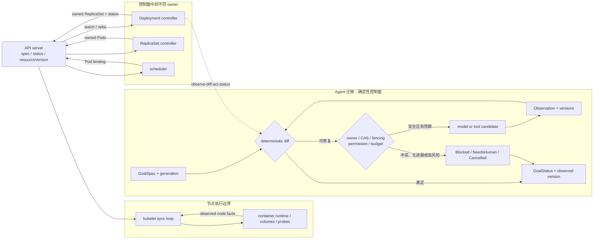

# Kubernetes Reconciliation Loop：让智能体围绕期望状态持续收敛

当期望状态已经更新，控制器看到的却仍是旧缓存，下游对象又被另一个控制器修改时，一条“照着事件执行命令”的流水线很容易做错事。Kubernetes 的做法是把事件降格为提醒：重新读取目标与事实，计算自己拥有的差异，只提交带版本条件的动作，然后等待下一次观察。

这套架构依赖多个控制器持续收敛，却不允许它们含糊地共享所有权。对象 owner、字段 manager、资源版本、候选实例 Lease 分别解决不同冲突；任何一项都不能替代其他项。

**证据范围**：本文依据 Kubernetes v1.36 在线文档和上游固定提交 `39c618b5c30ced3969862e0b4b5acce7a7f8cecb`。迁移时最重要的非等价边界是：确定性 reconcile 能对同一目标重算差异；非确定模型可能每轮改变计划、成本与副作用，不能被放进无界循环。

## 学习问题

1. desired 与 observed 分叉时，controller 怎样重新建立事实而不是重放旧命令？
2. `spec`、`status` 与 `observedGeneration` 为什么必须分开？
3. 多个 controller 如何划分对象、字段、版本与实例级所有权？
4. Deployment controller 与 kubelet 为什么共享收敛思想，却不是同一种循环模板？
5. Agent 平台如何给非确定动作增加幂等、预算、无进展与人工终态？

## 一页摘要

**已证实事实**：Kubernetes 对象记录意图。`spec` 表达期望状态，系统组件更新 `status` 表达观察；controller 持续让当前状态更接近期望状态。系统使用多个各自管理一部分状态的 controller，而不是一个全知循环。

事件并不携带必须原样执行的业务命令。Deployment controller 把 `namespace/name` 入队，worker 再从 informer cache 读取该 controller 当前观察到的 Deployment 和相关对象。写入时，API server 以 `resourceVersion` 检测过期更新；controller 随后从新事件、延迟调度或错误重排再次观察。

**个人分析**：Agent 平台可以复用“目标版本 + 当前事实 + owner + 条件写”的协议。模型只能提出候选动作或生成内容；差异、权限、预算、收敛和终态必须由可重放的确定性控制面判定。

下表说明一次 reconcile 在哪里吸收分叉：

| 阶段 | 读取或写入 | 分叉时的处理 | Agent 迁移边界 |
| --- | --- | --- | --- |
| observe | 最新目标、owned objects、外部事实 | cache 失效则 relist，风险点 fresh read | observation 带版本、来源、时间与 TTL |
| diff | 当前事实对版本化期望 | 只计算本 owner 负责的不变量 | 同输入与 policy 得到确定结果 |
| act | 创建、更新、删除或外部动作 | CAS 冲突后重新观察 | 幂等键、fencing、授权与副作用闸门 |
| status | 观测摘要与目标 generation | 旧 status 不冒充新目标已满足 | 写 `observed_goal_version` 与证据 |
| requeue | 对象键，而不是旧动作 | 以后重新观察 | 有界成本、无进展出口与人工接管 |

关键判断是：requeue 表示“未来再看一次”，不表示“把上一次工具调用再做一次”。

## 事实边界

**已证实事实**：API watch 让客户端从某个 `resourceVersion` 的状态继续接收变化。版本超出保留窗口时会出现 `410 Gone`，客户端需重建本地状态；过期更新则以 `409 Conflict` 拒绝，避免 lost update。

**已证实事实**：owner reference 描述 dependent 的对象级控制关系。Server-Side Apply 的 `managedFields` 记录字段 manager；Apply 修改他人拥有且值不同的字段时默认冲突，但普通 Update 不因 managed-field 冲突自动失败。因此字段所有权不是授权，也不是 fencing。

**已证实事实**：控制面可用 Lease 协调高可用候选实例，但固定源码明确说明 leader election 不保证任意时刻只有一个 client 自认 leader，也不提供 fencing。Lease 不能替代资源版本、RBAC/admission 或写入目标校验的单调 epoch。

**基于证据的推断**：`status.observedGeneration` 是时间边界。status 看似健康，也可能只对应旧 spec；没有 observed version，系统就无法区分“当前目标已满足”和“上一版目标曾满足”。

**个人分析**：Kubernetes 不判断报告是否真实、谈判是否合规或开放式规划是否足够好。Agent 平台必须自行提供稳定验收器、人工批准和副作用协议，不能把字段变化误称为语义收敛。

  
证据：版本截面与实现样本边界

  - **文档截面：** Kubernetes v1.36 架构、对象、API、owner、Server-Side Apply 与 Lease 文档。
  - **源码截面：** `kubernetes/kubernetes@39c618b5c30ced3969862e0b4b5acce7a7f8cecb`。
  - **样本：** Deployment controller 代表 controller-manager 内的一条具体路径；kubelet 代表节点上的多通道 sync loop。
  - **时间边界：** 访问与来源截断日期为 2026-07-22。
  - **证明边界：** 本文不宣称所有内置或第三方 controller 拥有相同事件源、队列、重试次数、status 或收敛证明。

## 架构图

先看多个 owner 如何围绕同一 API 状态协作。Deployment controller 管 Deployment 到 ReplicaSet 的差异；ReplicaSet controller 继续声明 Pod；scheduler 负责放置；kubelet 在节点上协调 runtime。它们共享资源状态，但不共享一个模糊的“全局写权限”。

模型位于动作候选节点，而不是 diff 或权限节点。否则同一状态可能因重新采样得到不同“差异”，控制循环便失去稳定目标。

## 控制权与任务流

**说明性场景**：Deployment 的 spec 从 generation 7 更新到 8。Deployment controller 收到事件并把键入队，但读取缓存时仍可能看到旧对象；与此同时 ReplicaSet 状态继续变化，另一个 manager 也可能申请修改某个字段。

worker 不执行事件里的旧命令。它从当前可见状态重建 Deployment 与 owned ReplicaSets，按删除、暂停、扩缩容或 rollout 分支处理。高风险 owner adoption 前，源码还会绕过普通缓存 fresh read Deployment 的 UID 与 deletion timestamp。

若写入碰到 `409 Conflict`，正确动作是重新观察 generation、owner 与下游事实，再计算差异。若 status 已正确反映 generation 8，则 no-op；若只反映 generation 7，即使数值看似健康，也不能宣布当前目标收敛。

该场景是对已证实机制的组合说明，不是生产事故记录。它表明事件顺序与缓存新鲜度都不是正确性的根基；版本化目标、当前事实、所有权和条件写才是。

Deployment controller 的 worker 成功时 `Forget`；错误时按该实现的限速策略最多重排 15 次，之后记录并从队列丢弃。新的对象事件仍可能再次入队。这个 15 次上限属于该 controller，不是 Kubernetes 的全局安全预算。

kubelet 走另一条路径。配置、PLEG、周期 sync、探针和设备事件进入 `syncLoopIteration`，再分发给 pod workers；`SyncPod` 的源码契约称其可重入，瞬时错误后由后续调用继续取得进展。多个 channel 同时 ready 时没有顺序保证，所以正确性必须来自当前事实与 handler，而不是“事件 A 必须先于 B”。

Agent 中的 owner 也要分层：任务 owner 负责最终不变量，artifact owner 负责子资源，字段 manager 只管理明确字段，动作 capability 决定谁能调用外部工具。实例 Lease 仅降低重复工作概率；每次状态迁移和外部写仍需目标端校验 fencing epoch。

## 关键源码导读

最短路径先读 Deployment controller 的 enqueue、worker 与 sync，再读 status/身份校验；最后用 kubelet 和 leader election 检查两个常被过度概括的边界：并非所有 reconcile 都是同一种 workqueue，Lease 也不是 fencing。

**已证实事实**：Deployment controller 对相同 key 不并发调用 handler；worker 从键重读对象，成功后 `Forget`，错误限速重排。ReplicaSet 已存在时，sync 还会核对 owner UID 与 Pod template；`AlreadyExists` 本身不等于语义成功。

**已证实事实**：`syncDeploymentStatus` 在 status 无变化时 no-op，变化时更新 `ObservedGeneration`。Deployment rollback 分支则明确不是 re-entrant，会等待后续 enqueue 完成清理；这提醒读者，reconcile 框架不会自动让每个动作幂等。

  
证据：固定提交中的 controller、kubelet 与 Lease seam

  - [`deployment_controller.go` 53–116](https://github.com/kubernetes/kubernetes/blob/39c618b5c30ced3969862e0b4b5acce7a7f8cecb/pkg/controller/deployment/deployment_controller.go#L53-L116)：`maxRetries = 15`、lister 与限速队列。
  - [`deployment_controller.go` 123–165](https://github.com/kubernetes/kubernetes/blob/39c618b5c30ced3969862e0b4b5acce7a7f8cecb/pkg/controller/deployment/deployment_controller.go#L123-L165)：Deployment、ReplicaSet 与 Pod informer handler。
  - [`deployment_controller.go` 399–427](https://github.com/kubernetes/kubernetes/blob/39c618b5c30ced3969862e0b4b5acce7a7f8cecb/pkg/controller/deployment/deployment_controller.go#L399-L427)：立即入队、`AddRateLimited` 与 `AddAfter` 三条重排接缝。
  - [`deployment_controller.go` 479–519](https://github.com/kubernetes/kubernetes/blob/39c618b5c30ced3969862e0b4b5acce7a7f8cecb/pkg/controller/deployment/deployment_controller.go#L479-L519)：同 key 串行及 success/error 路径。
  - [`deployment_controller.go` 521–548](https://github.com/kubernetes/kubernetes/blob/39c618b5c30ced3969862e0b4b5acce7a7f8cecb/pkg/controller/deployment/deployment_controller.go#L521-L548)：owner adoption 前的 fresh read。
  - [`deployment_controller.go` 572–659](https://github.com/kubernetes/kubernetes/blob/39c618b5c30ced3969862e0b4b5acce7a7f8cecb/pkg/controller/deployment/deployment_controller.go#L572-L659)：`syncDeployment` 重读 Deployment、重建 `ownerReferences` 约束下的 owned 状态，并暴露非 re-entrant rollback 边界。
  - [`sync.go` 220–299](https://github.com/kubernetes/kubernetes/blob/39c618b5c30ced3969862e0b4b5acce7a7f8cecb/pkg/controller/deployment/sync.go#L220-L299) 与 [`sync.go` 478–531](https://github.com/kubernetes/kubernetes/blob/39c618b5c30ced3969862e0b4b5acce7a7f8cecb/pkg/controller/deployment/sync.go#L478-L531)：ReplicaSet 身份校验、collision status、status no-op，以及 `calculateStatus` 写入 `ObservedGeneration` 的接缝。
  - [`kubelet.go` 2018–2067](https://github.com/kubernetes/kubernetes/blob/39c618b5c30ced3969862e0b4b5acce7a7f8cecb/pkg/kubelet/kubelet.go#L2018-L2067)：可重入 `SyncPod`。
  - [`kubelet.go` 2680–2725](https://github.com/kubernetes/kubernetes/blob/39c618b5c30ced3969862e0b4b5acce7a7f8cecb/pkg/kubelet/kubelet.go#L2680-L2725)：多配置源与 runtime 100ms 到 5s 退避。
  - [`kubelet.go` 2728–2877](https://github.com/kubernetes/kubernetes/blob/39c618b5c30ced3969862e0b4b5acce7a7f8cecb/pkg/kubelet/kubelet.go#L2728-L2877)：多事件 channel 与无处理顺序保证。
  - [`leaderelection.go` 17–48](https://github.com/kubernetes/kubernetes/blob/39c618b5c30ced3969862e0b4b5acce7a7f8cecb/staging/src/k8s.io/client-go/tools/leaderelection/leaderelection.go#L17-L48)：不保证单 leader，且不提供 fencing。
  - **证明边界：** 这些 seam 证明具体控制流及其限制，不证明任意外部动作或模型步骤可安全重入。

## 架构决策与权衡

声明式协调适合目标可表达、事实可观察、动作可验证、重复执行安全，且存在可判定距离函数的任务。目标若不断被模型重写、真实状态不可查询、动作无法去重，循环只会把不确定性放大为振荡。

| 条件 | 控制方式 | 保障 | 不满足时的出口 |
| --- | --- | --- | --- |
| 纯计算产物可由 schema、测试、引用校验 | 自动 reconcile | content hash、版本化验收 | 连续无进展后换策略或人工 |
| 只读检索可按 source ID 去重 | 有界自动 reconcile | 查询预算、cutoff、缓存新鲜度 | 证据冲突时标记 unknown |
| 写 API 支持 idempotency key | 自动 act + 事后观察 | operation ID、read-after-write、CAS | 结果未知时冻结并对账 |
| 非幂等写但存在补偿 | 审批后 act | saga 记录、补偿条件、明确 owner | 补偿失败升级 |
| 付款、公开发布、权限提升、真实设备 | 禁止模型循环自行重试 | 单次授权、双人审批、超时 | 人工继续、撤销或终止 |
| 开放式偏好没有稳定验收器 | 交互式协作 | 人类选择、版本冻结 | 保持草稿，不伪造收敛 |

对象所有权与字段所有权不能混用。一个 controller 管理 dependent 生命周期，和多个 workflow 分管同一对象字段，是两份不同契约。低风险派生字段可以在版本核对后转交；目标、审批和副作用字段不应被自动强制抢占。

事件驱动降低延迟，周期扫描修复漏事件与断 watch，但 sweeper 只能重新入队资源键。乐观并发允许不同字段合法并行，代价是冲突后必须重读；全局锁看似简单，却扩大故障域并降低自治边界。

## 生产化分析

生产前先定义 `distance(current, desired)` 和终态。一次 reconcile 可以因等待外部条件或 sequencing guard 而 no-op；有界窗口内既未缩短距离，也未进入可解释等待，就应判定无进展。终态至少包括 `Converged`、`Blocked`、`Degraded`、`NeedsHuman` 与 `Cancelled`。

竞争 controller 的典型症状是 owner churn 与值往返。检测到 A 写 x、B 又写 y 时，停止自动写入，冻结冲突字段，由 policy owner 选择唯一权威或拆分目标。不要期待反复覆盖自然选出赢家。

每次 observation 应携带 source version、采集时间、TTL 与来源；提交动作时带 expected goal generation 和 external version。冲突后重读、重算，不能盲目重放上次工具调用。

自动动作需要稳定 operation ID。规范合同是 `operation_id = hash(goal_id, generation, logical_step_id, canonical_action_intent)`；同一逻辑动作重试复用 ID，不同动作使用稳定 step ID 与规范化意图区分。外部系统支持时把它作为 idempotency key；不支持时查结果登记表。超时结果是 `Unknown`，不是自动可重试的 `Failed`。

预算要在顶层原子扣减模型调用、工具调用、token、费用、deadline、外部写与无进展轮数。Deployment 的 15 次和 kubelet 的 5 秒上限只描述各自实现；它们不能直接授权昂贵模型重采样。

  
证据：Agent reconcile 的版本、退避与顶层预算字段

  - **状态提交：** 用 compare-and-swap 提交 `observed_version → new_status`，并携带 expected goal generation 与 external version。
  - **分层退避：** 网络瞬时失败使用指数退避和 jitter；供应商限流遵守 `Retry-After`；外部结果不确定时冻结写入，而不是延时后盲重放。
  - **顶层预算：** 原子扣减 `max_model_calls`、`max_tool_calls`、`max_tokens`、`max_cost`、`deadline`、`max_external_writes` 与 `max_no_progress_rounds`；子目标只能领取剩余额度。
  - **边界：** 这些字段是迁移设计，不是 Kubernetes API 原生字段；其作用是防止每层 controller 各自重置预算。

人工接管包应包含目标 generation、最后可靠 observation、actions 与 operation IDs、外部资源、冲突字段、累计预算和建议选项。接管前递增 fencing epoch，并要求所有目标端校验；撤销 Lease 只能降低并发概率。

**不可违反的非等价边界**：确定性 reconcile 在固定目标和 policy 下重算差异；非确定模型可能改变答案、工具选择和成本。模型不能拥有完成定义、预算扣减、权限判断或无限 requeue 权。

最低指标包括 reconcile/error/requeue/drop rate、队列深度、oldest age、distance、observed generation lag、owner conflict、no-op ratio、Unknown 操作、每次收敛费用和人工队列年龄。指标的目标是发现分叉与振荡，而不是把“循环仍在运行”误报成健康。

## 可迁移经验

### 可直接复用的机制

1. 用 `GoalSpec` 保存版本化目标和验收条件，用 `GoalStatus` 保存 observed version、conditions、证据与预算。
2. 事件只携带资源身份；worker 开始时重读目标与事实。
3. 同一 key 局部串行，跨实例用 Lease 协调候选者，目标端另用 fencing 与 CAS 拒绝旧写。
4. 动作使用 operation ID、read-after-write、结果身份校验与冲突后重新观察。
5. 分开对象 owner、字段 manager、实例 leader 与动作 capability。
6. 为错误、无进展、冲突、预算耗尽和高风险动作设置人工终态。

### 只能有限类比的部分

1. `spec/status` 适合结构化资源；开放式知识工作仍需 verifier、source policy 与人工判断。
2. informer、watch 与 `resourceVersion` 由 Kubernetes API 提供；自建平台必须选择自己的 store、事件日志、CAS 与 relist。
3. Deployment 的 15 次重试和 kubelet 的退避只属于相应路径。
4. `SyncPod` 的可重入性建立在明确 runtime API 上；多工具 Agent 没有 checkpoint、幂等与补偿时不具备同等语义。
5. owner reference 与 field manager 不会自动解决组织责任和审批 SLA。

### 不应照搬的部分

1. 不要把长期 controller 解释成单个 Agent 目标可无限调用模型。
2. 不要把事件 payload 当命令，也不要依赖消息顺序。
3. 不要让多个 Agent 争写同一字段，再期待最终一致性选出正确值。
4. 不要把进程成功、HTTP 200 或模型自评当成收敛。
5. 不要直接重放超时的非幂等操作；先标记 `Unknown` 并对账。
6. 不要用 Kubernetes 自愈叙事为无界、非确定的 LLM reconcile loop 背书。

## 来源

**官方架构与 API（已证实事实）**

- [Controllers](https://kubernetes.io/docs/concepts/architecture/controller/)、[Cluster Architecture](https://kubernetes.io/docs/concepts/architecture/) 与 [Objects](https://kubernetes.io/docs/concepts/overview/working-with-objects/)：控制循环、组件分工、`spec` 和 `status`。访问与截断日期：2026-07-22；站点版本 v1.36。
- [Kubernetes API Concepts](https://kubernetes.io/docs/reference/using-api/api-concepts/)：list/watch、`resourceVersion`、`410 Gone` 与 `409 Conflict`。
- [Owners and Dependents](https://kubernetes.io/docs/concepts/overview/working-with-objects/owners-dependents/)、[Server-Side Apply](https://kubernetes.io/docs/reference/using-api/server-side-apply/) 与 [Leases](https://kubernetes.io/docs/concepts/architecture/leases/)：对象、字段与候选实例的不同所有权边界。

**固定上游源码（已证实事实）**

- [`kubernetes/kubernetes@39c618b5c30ced3969862e0b4b5acce7a7f8cecb`](https://github.com/kubernetes/kubernetes/tree/39c618b5c30ced3969862e0b4b5acce7a7f8cecb)：2026-07-22 解析的上游 HEAD。
- [`deployment_controller.go`](https://github.com/kubernetes/kubernetes/blob/39c618b5c30ced3969862e0b4b5acce7a7f8cecb/pkg/controller/deployment/deployment_controller.go) 与 [`sync.go`](https://github.com/kubernetes/kubernetes/blob/39c618b5c30ced3969862e0b4b5acce7a7f8cecb/pkg/controller/deployment/sync.go)：informer、队列、worker、owner adoption、ReplicaSet 与 status。
- [`kubelet.go`](https://github.com/kubernetes/kubernetes/blob/39c618b5c30ced3969862e0b4b5acce7a7f8cecb/pkg/kubelet/kubelet.go)：多通道 sync loop、runtime backoff、事件顺序边界与 `SyncPod`。
- [`leaderelection.go`](https://github.com/kubernetes/kubernetes/blob/39c618b5c30ced3969862e0b4b5acce7a7f8cecb/staging/src/k8s.io/client-go/tools/leaderelection/leaderelection.go)：非 fencing 边界与时钟偏斜率/可用性权衡。

**证据边界说明**：`已证实事实` 可由官方文档或固定提交定位；`基于证据的推断` 从机制推导设计含义；`个人分析` 是 Agent 迁移决策。Kubernetes 没有声称 reconciliation 自动解决 LLM 质量、token 成本、人工审批或不可逆副作用。
