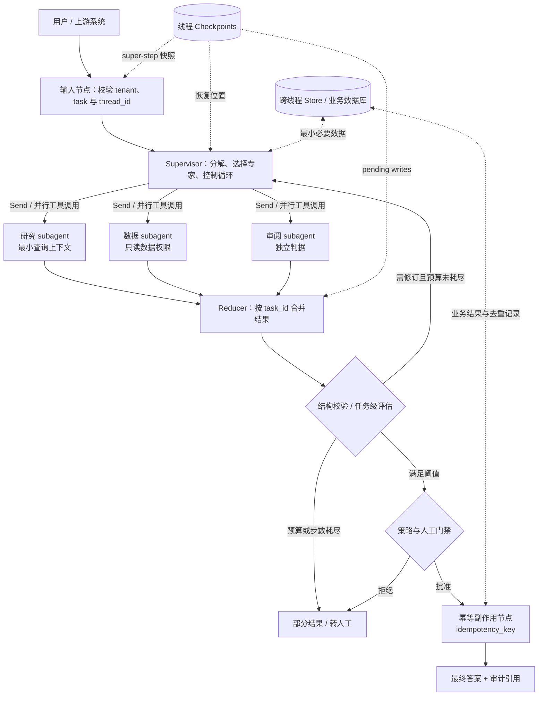
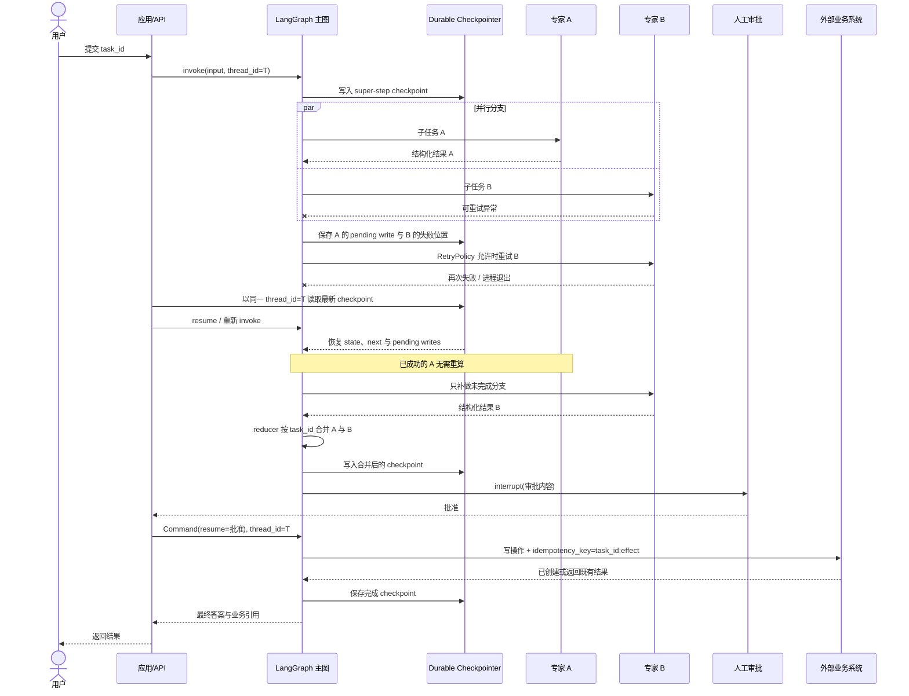

# LangGraph Supervisor：用显式状态构建可恢复的多智能体编排

LangGraph 的关键价值不在于提供一个叫作 “Supervisor” 的固定角色，而在于把多智能体运行表达成可检查的图、显式状态和可持久化步骤。Supervisor 仍可以由模型动态决定调用哪个专家，但任务进度、分支合并、暂停位置与恢复身份不必只存在于模型上下文里。本案例分析这种“agentic 决策 + workflow 状态机”的组合，并严格区分框架已保证的检查点行为与应用必须自行完成的幂等、副作用和安全设计。

## 学习问题

1. Supervisor、subagent、router 与确定性工作流节点分别拥有什么控制权，哪些职责不应互相渗透？
2. 并行分支同时写图状态时，为什么必须显式定义 reducer，怎样避免重复、乱序和覆盖？
3. `thread_id`、checkpoint、Store 和 subgraph state 各自标识或保存什么，哪些数据并不会自动共享？
4. 节点失败、进程退出或人工中断后，LangGraph 能恢复到哪里，副作用为何仍需幂等键或补偿？
5. 什么时候应该使用工作流图、Router 或 Supervisor，什么时候单智能体加普通工具更简单可靠？

## 一页摘要

**已证实事实**：LangChain 官方把 subagents 模式描述为一个维护对话上下文的主智能体（Supervisor）通过工具调用无状态 subagent；主智能体决定调用谁、传什么输入以及怎样合并结果。Router 则通常是一次分类或分解步骤，把请求发给零个、一个或多个专家，可用 `Command` 做单路路由、用 `Send` 做并行扇出。LangGraph 的 `StateGraph` 以 State、Node、Edge 表达运行；同一 super-step 的节点并行执行，每个状态键通过自己的 reducer 应用更新。图以 checkpointer 编译后，checkpoint 按 `thread_id` 组织，可支持线程内记忆、interrupt、状态检查、重放和失败恢复。

**基于证据的推断**：耐久编排的实质是把“已经完成什么、下一步是什么、哪些结果可复用”从模型的自然语言记忆提升为运行时可验证状态。Supervisor 适合保留开放式任务分解；显式图适合固定审批点、并发边界、重试策略和恢复路径。两者可组合，但前提是每个节点只承担可说明的状态转换，并且每条并行写入都有确定的合并语义。

**个人分析**：生产默认不应从“多个智能体”开始，而应从单智能体加工具开始。只有当领域提示、工具权限、上下文窗口或团队所有权确实需要隔离时才引入 subagent；只有当路径、检查点和人工门禁需要被审计或恢复时才引入图。图使控制流更显式，却不会自动使模型正确、工具安全或副作用 exactly-once。

| 选择 | 下一步由谁决定 | 主要状态所有者 | 适合场景 | 首要风险 |
| --- | --- | --- | --- | --- |
| 单智能体 + 工具 | 单个 agent loop | 单一消息历史 | 工具较少、任务边界简单 | 上下文膨胀、工具权限过宽 |
| Router | 分类规则或一次模型调用 | Router 输入/综合状态；可有或无历史 | 垂直领域清晰、一次性并行检索 | 分类错误、分支结果合并不稳定 |
| Supervisor + subagents-as-tools | 主智能体跨轮动态决定 | 主智能体维护对话；subagent 默认每次干净调用 | 多跳委派、主智能体统一最终答案 | 循环、上下文漏传、调用成本放大 |
| 自定义 StateGraph | Node/Edge/`Command` 与局部模型共同决定 | 显式 state + checkpoint | 长任务、审批、恢复、复杂 fan-out/fan-in | 状态 schema、reducer 和迁移复杂度 |

一句话决策：**类别明确且一次分发就结束，用 Router；需要跨轮动态委派，用 Supervisor；需要可恢复的阶段、并发与门禁，用 StateGraph；没有这些需求，就保持单智能体。**

## 事实边界

### 已证实事实

- LangGraph 是面向长运行、有状态 agent 的低层编排框架。图中的 State 是当前应用快照，Node 读取状态并返回局部更新，Edge 决定下一步；节点可以包含 LLM，也可以只是普通代码。
- 图按离散 super-step 执行。同一 super-step 中的节点并行；当一个节点有多个出边时，目标节点会在下一 super-step 并行执行。动态 map-reduce 可由 `Send(node, state)` 为每个任务创建不同输入。
- 每个状态键有独立 reducer。无 reducer 时，新值覆盖旧值；若同一 super-step 的多个并行节点写同一个不可并发更新的键，会出现 `INVALID_CONCURRENT_GRAPH_UPDATE`。官方建议为这类键定义 reducer。
- Reducer 是二元函数：左值为已积累状态，右值为节点新更新。`MessagesState` 的 `messages` 使用 `add_messages`，它不仅追加新消息，也会按 message ID 更新已有消息。
- subagents 模式中，主智能体集中路由，不让 subagent 直接拥有用户对话；subagent 作为工具被调用，主智能体决定输入与输出压缩。官方文档把默认 subagent 描述为无跨调用对话记忆，因此每次调用可获得隔离的上下文窗口。
- subagent 的隔离并非绝对。官方允许显式传完整上下文，也允许为 subagent 开启 continuation/persistence；若 subagent 通过普通工具函数调用，LangGraph 无法静态发现这段嵌套图，`get_state(subgraphs=True)` 也不会自动返回它的内部状态。需要检查嵌套状态时，应把 subgraph 作为自定义图节点调用。
- `langgraph-supervisor-py` 仍提供 `create_supervisor`、handoff 工具、`full_history` / `last_message` 输出模式和多级 supervisor，但其上游 README 已明确：多数场景现在推荐直接用工具实现 supervisor 模式，以获得更细的 context engineering 控制；该库主要继续服务既有代码升级。
- checkpointer 保存线程的图状态快照；Store 保存图状态之外、可跨线程访问的应用数据。`thread_id` 是读取与追加线程 checkpoint 的身份键；复用它会继续同一线程，换一个 ID 会开始空状态的新线程。
- `interrupt()` 会持久化当前位置并暂停；用相同 `thread_id` 和 `Command(resume=...)` 恢复。checkpoint 在 super-step 边界保存，而不是在节点函数的任意一行保存，因此受影响节点恢复时会从函数开头重新执行。
- 当同一 super-step 的一个并行节点失败时，已成功节点的 pending writes 可由 checkpointer 保存，恢复时不必重跑这些成功节点。节点级 `RetryPolicy` 可限制重试异常与次数；较新的 timeout 和 error-handler 能力在官方文档中仍带版本与 alpha 限定，不能不加版本检查地视作所有部署的通用保证。

### 基于证据的推断

- Supervisor 的“上下文所有权”应拆成三层：主对话历史由主智能体管理，子任务工作集由调用参数或 subgraph state 管理，跨线程长期数据由 Store/外部数据库管理。把三者都塞进共享 `messages` 会破坏隔离并放大 token 成本。
- checkpoint 使计算可重放，并不使外部世界回滚。若一个节点先扣款、发邮件或创建工单，随后在 checkpoint 落盘前失败，恢复重跑仍可能再次执行副作用。官方要求节点重执行安全、`interrupt()` 前的副作用幂等，正说明 exactly-once 需要应用级幂等键、去重记录或补偿事务。
- 并行 reducer 不只是类型标注，而是业务一致性规则。列表拼接能避免写冲突，却不能自动去重，也不承诺并行结果的稳定顺序；聚合器应携带 `task_id`、来源、序号和版本，再按业务键归并。

### 个人分析与未知项

- LangGraph 不替应用决定租户隔离、模型与工具权限、checkpoint 保留、序列化加密、数据驻留、RPO/RTO、任务幂等键、补偿策略、总体 token 预算或质量阈值。
- 图可展示预期边，却不能证明模型一定走正确分支。Supervisor 的路由准确率、停止率、工具选择和最终综合质量仍需离线数据集与生产评估。
- 本文访问日期与来源截断日期均为 **2026-07-20**。核对时 `langgraph` 的 `main` 固定为 `49ae27c2ae983cfb92091b0dea9f7bc37a716479`，`langgraph-supervisor-py` 固定为 `88859b34017ac3569bbd4a3092c7e77593a0a960`；后续 API、alpha 功能和推荐模式变化不在本文事实范围内。

## 架构图

下图展示一种可恢复的 Supervisor 工作流。它是基于官方原语的实现选择，不是 LangGraph 强制生成的模板：主图持有业务状态与恢复位置，Supervisor 只负责开放式委派，subagent 获得最小任务输入；并行结果通过显式 reducer 汇合，写操作必须先过策略与人工门禁。



文字等价描述：

1. 应用先验证租户、任务身份与 `thread_id`，再以 durable checkpointer 运行主图。
2. Supervisor 读取主图显式状态，只为当前任务选择必要 subagent；每个 subagent 收到独立、最小化输入，而不是默认复制完整会话。
3. 可独立的子任务并行执行，结果以 `task_id` 为业务键交给 reducer；聚合状态与 checkpoint 都属于主图。
4. 聚合结果先过结构校验、任务级评估和预算/步数上限。不满足时可回到 Supervisor 修订，耗尽预算则降级。
5. 外部写操作在策略或人工批准之后执行，使用幂等键并把业务结果写入权威数据库；checkpoint 只保存恢复位置与图状态。

## 控制权与任务流

### Supervisor 与 subagent 的职责边界

**已证实事实**：官方 subagents 模式由主智能体选择 subagent、构造输入、调用工具并综合返回值。subagent 不直接接管主对话；主智能体可以在同一轮发起多个工具调用以并行执行。名称与描述是主智能体决定是否调用 subagent 的重要提示界面。

**个人分析**：Supervisor 应拥有任务分解、候选专家选择、停止/升级决定和最终叙述；subagent 应拥有窄领域内的推理和工具使用。Supervisor 不应绕过领域权限直接调用高风险工具，subagent 也不应自行改变全局预算、租户、最终发布或其他分支状态。推荐让 subagent 返回结构化信封：`task_id`、`status`、`facts`、`evidence_refs`、`uncertainties`、`usage`，由主图而非自然语言约定负责合并。

### 显式 State 与 reducer

一个并行 Supervisor 的最小状态不应只有 `messages`。可把可恢复控制信息与展示文本分离：

```python
class OrchestrationState(TypedDict):
    messages: Annotated[list[AnyMessage], add_messages]
    task_id: str
    plan: list[Subtask]
    results: Annotated[list[AgentResult], merge_by_task_id]
    attempts: dict[str, int]
    approvals: dict[str, ApprovalDecision]
    budget: BudgetState
    final_answer: str | None
```

这里 `merge_by_task_id` 是实现选择，不是内置保证。它应对同一任务的重试结果做幂等 upsert，明确版本优先级，并在输入相同的情况下产生确定结果。`operator.add` 适合演示累积，但生产中可能把重试结果再次追加。若并行结果展示顺序重要，分支应写入 `{task_id, ordinal, value}`，fan-in 后显式排序；官方文档明确提醒并行 super-step 更新顺序可能不稳定。

### Fan-out / fan-in 与重复风险

- 静态并行可从一个节点添加多条出边；动态任务数可让路由节点返回多个 `Send`。
- fan-in 节点只有在相应并行分支完成后运行；若一个分支失败，当前 super-step 不会把整体更新提交为完成状态。
- 有 checkpointer 时，成功分支的 pending writes 能被保存，恢复时不必重做；这减少重复计算，不等于外部副作用事务化。
- 同一键缺少 reducer 会产生并发更新错误；使用简单追加 reducer 又会带来重复和非稳定顺序。正确做法是先定义业务合并契约，再选择 reducer。
- 并发必须有 `max_concurrency`、每节点截止时间、总体 deadline、fan-out 数量和 token/费用上限。否则“并行降低时延”会变成下游限流、尾时延和费用峰值。

### Router 与 agentic Supervisor

**已证实事实**：官方 Router 指南把 Router 定义为专用路由步骤，常通过一次规则或模型分类把输入发给专家；它通常不维护持续对话，也不做跨轮多跳编排。Supervisor 是一个完整主智能体，维护上下文，并根据不断变化的对话动态决定调用哪个 subagent。Router 可无状态，也可自行实现历史；官方提醒有状态 Router 尤其在切换专家与并行调用时需要自定义历史管理。

**个人分析**：若请求可映射到稳定枚举，Router 的结构化分类更易测试和预算；若任务需要“研究后发现缺口，再调用数据专家，再让审阅者反驳”，Supervisor 的多跳自治更合适。常见组合是：确定性外层 Router 先选安全域，域内 Supervisor 再做开放式委派。不要用 Supervisor 替代访问控制，也不要让 Router 的类别标签兼任长期会话状态。

### 上下文隔离：共享什么，不共享什么

| 数据 | 默认/官方语义 | 推荐生产边界 |
| --- | --- | --- |
| 主对话历史 | 由主智能体维护 | 只保留用户可见事实、已确认决定与必要摘要 |
| subagent 输入 | 由工具 wrapper 构造；可只传 query，也可显式传更多上下文 | 按任务白名单投影，去除无关秘密与指令 |
| subagent 内部历史 | 默认每次调用新鲜；可显式启用 continuation | 仅在领域连续性确有价值时持久化，并使用独立命名空间 |
| 父/子图共享键 | subgraph 作为节点时可共享同名 state channel；wrapper 可映射不同 schema | 接口化映射，禁止把整个父状态作为通用字典透传 |
| checkpoint | 单个 `thread_id` 范围内的图状态 | tenant + conversation/run 的不可猜测映射；设置保留与删除策略 |
| Store / 业务数据库 | 可跨 thread 保存应用定义数据 | 按租户、用户、用途与敏感度授权；图节点只取最小必要项 |

特别注意：输入/输出 schema 限制节点看到什么和 `invoke` 返回什么，但官方 Graph API 文档说明“private” state channel 在默认 values streaming 中仍可能出现。它不是安全隔离边界；需要限制 stream 的 `output_keys`，并在遥测出口再次做脱敏和授权。

## 关键源码导读

建议按“模式语义 → 图状态 → 持久化与重执行 → 中断 → 辅助库实现”的顺序阅读：

1. [Subagents 官方指南](https://docs.langchain.com/oss/python/langchain/multi-agent/subagents)：先确认 Supervisor 通过工具调用 subagent、主对话所有权、默认上下文隔离、同步/异步调用与 checkpoint mode。重点看 context engineering 和 state inspection 限制。
2. [Router 官方指南](https://docs.langchain.com/oss/python/langchain/multi-agent/router)：对照一次分类、多路 `Send`、结果综合与有状态 Router，避免把 Router 和跨轮 Supervisor 混为一谈。
3. [Graph API](https://docs.langchain.com/oss/python/langgraph/graph-api) 与固定版本的 [`StateGraph`](https://github.com/langchain-ai/langgraph/blob/49ae27c2ae983cfb92091b0dea9f7bc37a716479/libs/langgraph/langgraph/graph/state.py)：理解 schema、per-key reducer、super-step、`Send`、`Command`、重执行和幂等性。源码类注释直接说明节点返回 `Partial<State>`，reducer 签名为 `(Value, Value) -> Value`。
4. [Persistence](https://docs.langchain.com/oss/python/langgraph/persistence) 与固定版本的 [`BaseCheckpointSaver`](https://github.com/langchain-ai/langgraph/blob/49ae27c2ae983cfb92091b0dea9f7bc37a716479/libs/checkpoint/langgraph/checkpoint/base/__init__.py)：分清 thread checkpoint 与跨线程 Store，理解 `thread_id` / `checkpoint_id`、state history、pending writes 和 serializer 边界。
5. [Interrupts](https://docs.langchain.com/oss/python/langgraph/interrupts)：阅读 `interrupt()`、`Command(resume=...)`、同一 `thread_id` 恢复，以及节点从头重跑的规则。尤其核对 interrupt 调用顺序、可序列化 payload 与副作用幂等要求。
6. [Fault tolerance](https://docs.langchain.com/oss/python/langgraph/fault-tolerance)：阅读 `RetryPolicy`、失败分类和恢复语义。timeout、error handler 等新能力必须按实际 LangGraph 版本核对其 alpha/语言限制。
7. 固定版本的 [`langgraph` README](https://github.com/langchain-ai/langgraph/blob/49ae27c2ae983cfb92091b0dea9f7bc37a716479/README.md)：把 durable execution、HITL、memory 与 LangSmith 放在生态层理解，不把部署产品能力误认为开源运行时默认配置。
8. [`langgraph-supervisor-py` README](https://github.com/langchain-ai/langgraph-supervisor-py/blob/88859b34017ac3569bbd4a3092c7e77593a0a960/README.md)：先读其“多数场景推荐直接用 tools”的维护说明，再看历史输出、层级 supervisor 和 checkpointer/store 示例。
9. 固定版本的 [`supervisor.py`](https://github.com/langchain-ai/langgraph-supervisor-py/blob/88859b34017ac3569bbd4a3092c7e77593a0a960/langgraph_supervisor/supervisor.py) 与 [`handoff.py`](https://github.com/langchain-ai/langgraph-supervisor-py/blob/88859b34017ac3569bbd4a3092c7e77593a0a960/langgraph_supervisor/handoff.py)：观察 `output_mode`、handoff tool、`Command.PARENT` 与消息处理怎样落实；把它当一个实现参考，而不是框架唯一 Supervisor 语义。

阅读时建议同时画四张表：state key 与 reducer、node 与允许副作用、edge 与停止条件、checkpoint/Store 与数据保留。只看拓扑图会漏掉真正决定恢复正确性的状态与副作用契约。

## 架构决策与权衡

### 工作流图、Supervisor、Router 还是单智能体

| 信号 | 优先选择 | 原因 |
| --- | --- | --- |
| 少量工具、单轮或短对话、无复杂审批 | 单智能体 | 最少模型调用与状态面 |
| 领域分类稳定、一次分发后综合 | Router | 路径短，分类可离线评估 |
| 任务分解随中间结果变化、需要多跳专家协作 | Supervisor | 主智能体能基于新证据继续委派 |
| 长运行、需暂停恢复、并行汇合、固定合规顺序 | 自定义 StateGraph | 状态、节点、门禁和恢复点显式 |
| 同时存在严格外壳与开放式子任务 | Graph 包裹 Supervisor | 代码管边界，模型管局部不确定性 |

**个人分析**：不要把每个函数都升级成 agent。确定性查询、格式校验、权限检查、扣费与写库更适合普通节点或工具；agent 适合需要独立提示、工具集和探索循环的任务。subagent 数量增加后，主智能体必须读取更多工具描述与返回值，路由和综合成本也会增长。

### Checkpointer、Store 与业务数据库

checkpointer 解决“这个 thread 的图执行到哪”；Store 解决“跨 thread 想记住什么”；业务数据库解决“外部世界的权威事实与交易结果是什么”。三者不能互相冒充：

- 不要把 checkpoint 当订单、付款或审批的权威账本；其 schema 服务运行恢复，而非业务交易完整性。
- 不要用 Store 绕开业务数据库的唯一约束、事务与审计。
- 不要在 checkpoint 中无限累积完整文档、工具响应和秘密；长线程需要保留、压缩与删除策略。
- 生产使用持久 checkpointer；`InMemorySaver` 只在进程内保存，进程重启会丢失。

### Graph API 还是 Functional API

Graph API 适合需要显式共享 State、可视拓扑、条件边和 fan-in 的系统；Functional API 适合保留普通控制流并用 `@entrypoint` / `@task` 增加耐久性。**基于证据的推断**：多智能体 Supervisor 若要审计每个专家状态与并行合并，Graph API 通常更直观；若只是一个长函数中若干可缓存 API 调用，Functional API 可能更轻。两者都要求重执行安全。

### 自治、确定性与版本迁移

模型路由提高开放任务适应性，也带来路径方差；静态边与代码门禁更可预测，却需要显式维护新分支。恢复中的 thread 会反序列化既有 state，并按当前编译图继续，因此状态键、节点名、reducer 语义和 interrupt/task 顺序都是兼容性表面。发布时应固定 graph/prompt/model/tool schema 版本，先对历史 checkpoint 做兼容测试，再灰度恢复长线程。

## 生产化分析

### Durable recovery 序列

下图聚焦一个并行分支失败后恢复的过程。它把官方支持的 checkpoint、pending writes、retry/resume 和 interrupt 与应用层幂等设计放在同一时序中；标为“业务去重”的部分不是 LangGraph 自动保证。



文字等价描述：

1. 应用用稳定且租户隔离的 `thread_id` 启动图，checkpointer 在步骤边界保存状态。
2. 两个专家并行执行；A 成功、B 失败时，A 的 pending write 可保存，B 按受限策略重试。
3. 进程退出后，应用以同一 `thread_id` 加载 checkpoint；已完成的 A 不重算，只补做未完成的 B。
4. reducer 按业务任务键合并两条结果并生成新 checkpoint，然后 `interrupt()` 等待人工审批。
5. 审批恢复仍使用同一 thread。外部写操作带应用级幂等键；若业务系统已处理过，就返回既有结果。最后保存完成状态并返回引用。

### 生产失败模式与遏制

| 失败模式 | 后果 | 框架相关机制 | 应用必须补齐 |
| --- | --- | --- | --- |
| 复用错误 `thread_id` | 串话、覆盖另一会话进度 | checkpoint 按 thread 读取 | tenant-scoped ID、授权校验、不可猜测映射 |
| 内存 checkpointer 随进程退出 | 所有恢复点丢失 | `InMemorySaver` 仅进程内 | durable backend、备份、容量与 RPO 测试 |
| 并行分支写同一无 reducer 键 | `INVALID_CONCURRENT_GRAPH_UPDATE` | per-key reducer | 设计 merge contract 与并发测试 |
| 追加 reducer 遇到重试 | 重复结果、顺序漂移 | pending writes 可减少重算 | task_id 去重、版本优先、显式排序 |
| 节点在 checkpoint 前完成外部写入后崩溃 | 重跑产生重复副作用 | 节点从函数开头重跑 | 幂等键、upsert、outbox/inbox 或补偿 |
| Supervisor 不停调用专家 | token、时延和费用失控 | recursion limit / routing state | 总步数、调用数、fan-out、deadline 与费用预算 |
| subagent wrapper 对图不可见 | 无法检查嵌套中断状态 | 工具内子图非静态发现 | 改为自定义图节点或显式上报状态 |
| checkpoint/state schema 不兼容 | 历史 thread 恢复失败或语义改变 | 以当前图读取保存状态 | schema 版本、迁移器、历史恢复回归测试 |
| 工具或模型暂时失败 | 整体任务失败或重复重试 | `RetryPolicy`、pending writes | 异常分类、退避、熔断、降级与人工队列 |
| checkpoint 无限增长 | 存储与读取延迟上升 | 可查询/管理状态 | 保留、归档、摘要、删除和用户数据请求流程 |

### 可观测性与评估

至少为每次运行记录 `tenant_id`、`task_id`、`thread_id`、`run_id`、`checkpoint_id`、graph/prompt/model/tool 版本、节点开始/结束、路由决定、重试次数、interrupt 原因、subagent token/时延/费用、reducer 输入摘要和最终状态。LangGraph 提供 stream 的 updates、values、messages、checkpoints、tasks/debug 等观察面，并可接入 LangSmith tracing；这提供执行证据，不等于质量结论。

评估应分层：Router 看分类 precision/recall 与拒答；Supervisor 看正确专家选择、无效循环、计划完成率；subagent 看领域正确性与引用；fan-in 看覆盖、矛盾处理和重复率；系统看端到端完成率、人工升级率、P50/P95 时延、每成功任务费用和恢复成功率。上线前用故障注入覆盖“并行一支失败”“interrupt 后进程重启”“恢复前代码升级”“副作用响应丢失”等场景。

### 安全与隐私

- 主图、checkpoint、Store、stream 与 trace 都可能含提示、工具结果和个人数据；分别实施加密、最小权限、租户过滤、保留和审计。
- subagent 工具描述是能力暴露面。主智能体只能看到当前用户被授权的 subagent；subagent 内部工具还要再次鉴权，不能依赖提示词声明权限。
- 对共享状态使用输入/输出 schema 不能替代脱敏；private channel 也可能通过 streaming 暴露。
- interrupt payload 只放审批所需摘要与不可变业务引用，不放长期凭证；恢复时重新验证批准人、租户、对象版本与策略。
- checkpoint 反序列化与历史图恢复是信任边界。限制允许的类型与版本，防止把不受信任复杂对象当作普通状态载荷。

### 成本与容量边界

多智能体成本近似为主智能体规划与综合、每个 subagent 的模型/工具调用、失败重试、评估和状态存储之和。并行能降低墙钟时延，却不会降低 token 总量，还可能抬高峰值并发。生产预算应同时限制每 run 的 Supervisor 回合、subagent 调用数、`Send` 数、`max_concurrency`、每节点 token、重试次数、总 deadline、checkpoint 大小与 retention。把“部分结果 + 明确缺口”定义为合法降级，通常比无界自动修复更可靠。

## 可迁移经验

1. **先定义状态所有权，再画 agent 图。** 主对话、子任务工作集、线程 checkpoint、跨线程记忆和业务事实应有不同的 owner 与存储。
2. **Reducer 是并发业务契约。** 为每个可被并行写入的 key 定义结合、去重、顺序和版本规则，并用交换顺序、重复输入和恢复重放测试它。
3. **把恢复单位缩小。** 一个节点只做一个可说明的状态转换；长节点中的外部调用用可 checkpoint 的 task 或拆成节点，避免失败后重做大片工作。
4. **Checkpoint 不是 exactly-once。** 外部写操作仍使用业务幂等键、唯一约束、outbox/inbox 或补偿；在 checkpoint 状态中保存业务引用而非假装事务已跨系统提交。
5. **隔离上下文，而非复制上下文。** subagent 收到完成任务所需的最小输入，返回结构化摘要；只有明确的连续会话需求才启用其持久历史。
6. **将确定性边界放在模型外。** 身份、权限、预算、审批、schema 校验、最大步数和发布门禁由代码执行，模型只在允许空间内分解与路由。
7. **按问题复杂度升级架构。** 单智能体 → Router → Supervisor → durable graph 是能力选择，不是成熟度阶梯；只为被验证的需求增加层次。
8. **同时评估轨迹与结果。** 最终答案正确但调用了越权工具、重复副作用或花费失控，仍是失败；路径正确但综合答案错误也不能上线。
9. **把历史 checkpoint 纳入发布测试。** 用旧 state 恢复新图，验证节点名、schema、reducer、interrupt/task 顺序和工具契约的兼容性。
10. **为不可恢复情形设计出口。** 数据损坏、权限变化、长期下游故障或预算耗尽时，系统要能返回部分结果、转人工或安全失败，而不是无限重试。

## 来源

以下均为官方 LangChain/LangGraph 文档或上游仓库；无二手博客。建议按此顺序阅读：

1. [Subagents](https://docs.langchain.com/oss/python/langchain/multi-agent/subagents)：Supervisor 与 subagent 的控制权、上下文工程、并行与 checkpoint 模式。
2. [Router](https://docs.langchain.com/oss/python/langchain/multi-agent/router)：Router 的一次性分类、多路并行、综合与有状态变体；用于和 Supervisor 对照。
3. [Graph API](https://docs.langchain.com/oss/python/langgraph/graph-api) 与 [Use the Graph API](https://docs.langchain.com/oss/python/langgraph/use-graph-api)：State、Node、Edge、super-step、reducer、`Send`、`Command`、重执行与并行 fan-in。
4. [Persistence](https://docs.langchain.com/oss/python/langgraph/persistence)：checkpointer 与 Store 的范围、`thread_id`、生产持久化和容量问题。
5. [Interrupts](https://docs.langchain.com/oss/python/langgraph/interrupts)：暂停/恢复、`Command(resume=...)`、节点重执行与副作用幂等规则。
6. [Fault tolerance](https://docs.langchain.com/oss/python/langgraph/fault-tolerance)：`RetryPolicy`、失败处理及带版本/成熟度限定的新恢复能力。
7. [`langgraph` 固定仓库快照](https://github.com/langchain-ai/langgraph/tree/49ae27c2ae983cfb92091b0dea9f7bc37a716479)：README、Graph API 与 checkpointer 接口的上游实现，提交 `49ae27c2ae983cfb92091b0dea9f7bc37a716479`。
8. [`langgraph-supervisor-py` 固定仓库快照](https://github.com/langchain-ai/langgraph-supervisor-py/tree/88859b34017ac3569bbd4a3092c7e77593a0a960)：辅助库定位、迁移建议、handoff 与历史管理实现，提交 `88859b34017ac3569bbd4a3092c7e77593a0a960`。

来源访问日期与截断日期：**2026-07-20**。事实陈述限定于上述固定提交与当日官方文档；文中的生产拓扑、`merge_by_task_id`、租户标识、幂等键、指标阈值和部署策略均属于明确标注的实现建议或分析，不是 LangGraph 框架自动保证。
