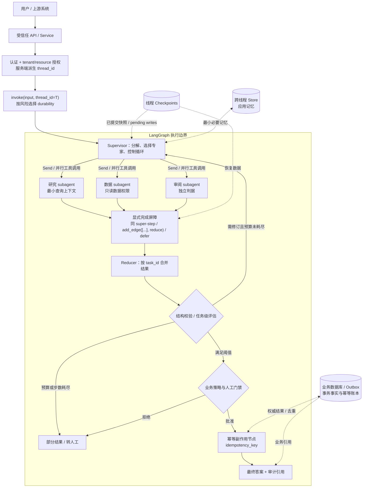
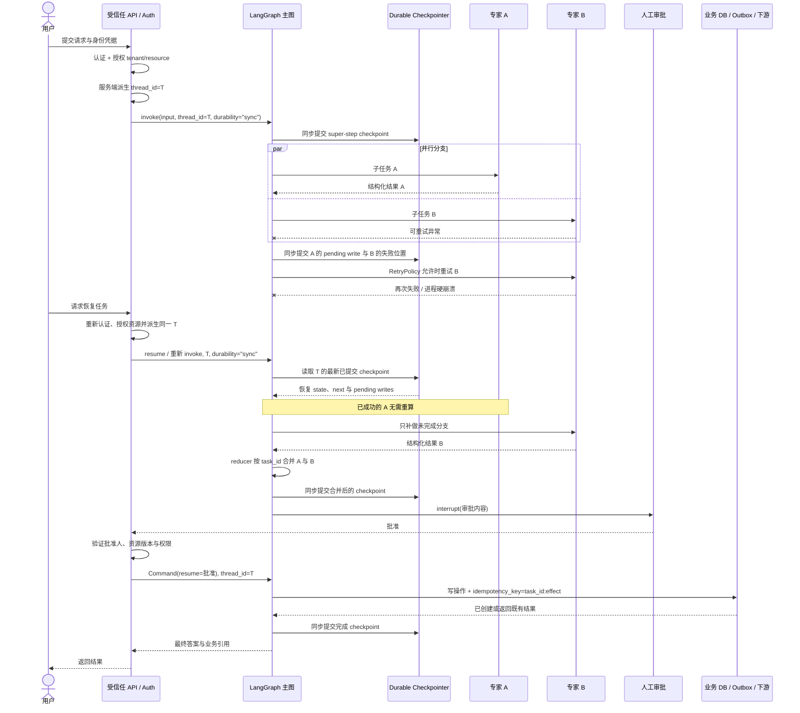

# LangGraph Supervisor：用显式状态构建可恢复的多智能体编排

Supervisor 可以在模型上下文里记住“下一步找谁”，但进程退出后，这句话不足以恢复并行分支、人工审批和已发生的工具写入。LangGraph 的价值，是把这些控制事实拆成 state key、edge、reducer、checkpoint 和 routing policy。

模型仍可动态选择专家，图则显式保存任务进度、分支合并和暂停位置。恢复的关键不再是重新拼出一段相似对话，而是从已提交状态判断哪些节点可以重跑、哪些结果可复用、哪些副作用必须先对账。

固定文档与源码只负责界定 state、edge、reducer 和 checkpoint 的行为。授权、耐久窗口、外部副作用和人工升级仍由正文展开，因为这些边界决定图能否安全恢复。

## 学习问题

1. Supervisor、subagent、router 与确定性工作流节点分别拥有什么控制权，哪些职责不应互相渗透？
2. 并行分支同时写图状态时，为什么必须显式定义 reducer，怎样避免重复、乱序和覆盖？
3. `thread_id`、checkpoint、Store 和 subgraph state 各自标识或保存什么，哪些数据并不会自动共享？
4. 节点失败、进程退出或人工中断后，LangGraph 能恢复到哪里，副作用为何仍需幂等键或补偿？
5. 什么时候应该使用工作流图、Router 或 Supervisor，什么时候单智能体加普通工具更简单可靠？

## 一页摘要

先问一项控制事实能否被直接检查：当前计划、已完成分支、重试次数、批准结果和预算如果只在消息历史里，就很难可靠恢复。

**已证实事实**：`StateGraph` 以 State、Node、Edge 表达运行。同一 super-step 的节点可并行，每个 state key 通过自己的 reducer 接收更新；checkpointer 按 `thread_id` 保存图状态，并支持 interrupt、检查、重放和失败恢复。

**已证实事实**：Supervisor 模式不等于 `langgraph-supervisor` 包。官方 Subagents 文档说明该包已不再积极维护，新项目优先直接采用 subagents-as-tools；本文只把固定仓库快照作为既有 `create_supervisor`、handoff 和历史输出实现的参考。

Supervisor 通过工具调用 subagent，决定传入什么并综合结果；Router 通常只做一次分类或分解。图可用 `Command` 做路由、用 `Send` 扇出任务，但 fan-in、去重、顺序和停止条件仍要由 state schema 与 policy 明确定义。

**基于证据的推断**：耐久编排的实质，是把“已完成什么、下一步是什么、哪些结果可复用”从自然语言记忆提升为运行时状态。Supervisor 保留开放式分解，显式图固定审批、并发、重试和恢复边界。

| 选择 | 下一步由谁决定 | 主要状态所有者 | 适合场景 | 首要风险 |
| --- | --- | --- | --- | --- |
| 单智能体 + 工具 | 单个 agent loop | 单一消息历史 | 工具较少、任务边界简单 | 上下文膨胀、工具权限过宽 |
| Router | 分类规则或一次模型调用 | Router 输入/综合状态；可有或无历史 | 垂直领域清晰、一次性并行检索 | 分类错误、分支结果合并不稳定 |
| Supervisor + subagents-as-tools | 主智能体跨轮动态决定 | 主智能体维护对话；subagent 默认每次干净调用 | 多跳委派、主智能体统一最终答案 | 循环、上下文漏传、调用成本放大 |
| 自定义 StateGraph | Node/Edge/`Command` 与局部模型共同决定 | 显式 state + checkpoint | 长任务、审批、恢复、复杂 fan-out/fan-in | 状态 schema、reducer 和迁移复杂度 |

**个人分析**：类别明确且一次分发就结束时用 Router；需要跨轮动态委派时用 Supervisor；阶段、并发和门禁必须恢复时才使用 StateGraph。图能显式控制流，却不会自动让模型正确、工具安全或副作用 exactly-once。

## 事实边界

LangGraph 保证的是图执行与已配置持久化语义，不是业务事务。判断恢复能力前，必须同时说清 state 合并规则、checkpoint 提交时机和外部副作用去重。

### 已证实事实

State 是应用快照，Node 读取 state 并返回局部更新，Edge 决定下一步。节点既可以调用 LLM，也可以只是普通代码。

图按离散 super-step 执行。同一步的节点可并行，`Send(node, state)` 可为动态任务创建不同输入。每个 state key 有独立 reducer；没有 reducer 时新值覆盖旧值，并行写同一不可合并 key 会触发 `INVALID_CONCURRENT_GRAPH_UPDATE`。

Reducer 以已积累值和新更新为输入。`add_messages` 除了追加消息，还会按 message ID 更新已有消息；普通列表拼接没有自动去重或稳定顺序保证。

Supervisor 通过工具调用 subagent，主智能体保留用户对话并决定输入与结果压缩。默认 subagent 无跨调用历史；显式 continuation/persistence 可以改变这项隔离。

普通工具 wrapper 内调用的子图不能被 LangGraph 静态发现，`get_state(subgraphs=True)` 不会自动返回其内部状态。需要检查嵌套状态时，应把 subgraph 作为自定义图节点。

Checkpointer 保存单个 thread 的图快照，Store 保存图外且可跨 thread 的应用记忆。`thread_id` 只负责寻址 checkpoint，不包含用户或租户授权。

`interrupt()` 持久化暂停位置，用相同 `thread_id` 和 `Command(resume=...)` 恢复。Checkpoint 位于 super-step 边界，节点恢复时从函数开头重执行，而不是从任意代码行继续。

Durability 有 `sync`、默认 `async` 和 `exit` 三种提交时机。`sync` 等持久化完成再开始下一 step；`async` 允许后台写与下一 step 并行；`exit` 只在图退出时保存。

并行分支失败时，已成功节点的 pending writes 可以保存并复用，但只限已按所选 durability 提交的写入。`RetryPolicy` 控制节点重试；timeout 和 error handler 需要 `langgraph>=1.2`，并受当前 Python-only、timeout 只支持 async 节点等限制。

### 基于证据的推断

上下文所有权应分四层：主对话由 Supervisor 管，子任务工作集由调用参数或 subgraph state 管，跨线程记忆由 Store 管，事务事实与去重由业务数据库或 outbox 管。全部塞进 `messages` 会破坏隔离并放大 token。

Checkpoint 使计算可重放，不使外部世界回滚。节点先写外部系统、后在 checkpoint 前失败时，恢复会从节点开头重跑；应用仍需幂等键、结果查询、去重记录或补偿。

Reducer 是业务一致性规则，不只是类型标注。并行结果应携带 `task_id`、来源、序号和版本，再按业务键归并。

`async` 在硬崩溃时存在最近未提交写入窗口，`exit` 在正常退出前没有中间恢复点。配置 checkpointer 不等于每个最新写入都已耐久。

### 个人分析与未知项

LangGraph 不替应用决定租户隔离、工具权限、checkpoint 保留、加密、数据驻留、RPO/RTO、幂等、补偿、token 预算或质量阈值。图也不能证明模型一定走正确分支；路由、停止、工具选择和综合质量仍要评估。

<details className="evidence-card">
  <summary>证据：固定版本、Supervisor 包状态与适用范围</summary>

  - **来源截断：** `2026-07-20`
  - **分支：** 两个仓库核对时均为 `main`
  - **LangGraph：** `langchain-ai/langgraph@49ae27c2ae983cfb92091b0dea9f7bc37a716479`
  - **Supervisor 参考实现：** `langchain-ai/langgraph-supervisor-py@88859b34017ac3569bbd4a3092c7e77593a0a960`
  - **维护边界：** 官方 Subagents 文档说明 `langgraph-supervisor` 包已不再积极维护，新项目优先直接 subagents-as-tools；固定仓库只用于核对既有 `create_supervisor`、handoff、历史输出和多层实现。
  - **边界：** 固定提交与当日文档不支持外推后续 API 或推荐模式。
</details>

## 架构图

读图时先区分三类状态：主图 checkpoint、跨线程 Store 和外部业务账本。它们分别负责执行恢复、应用记忆和权威副作用，不能合成一个“持久化层”。

下图是基于官方原语的实现选择，不是框架模板。受信任服务先授权并派生 `thread_id`；图中的 Barrier 也必须落实为真实同步语义，多条箭头本身不提供通用 join。



文字等价描述：

1. 受信任 API 在图外认证调用者、授权其访问目标 tenant/resource，并从服务端映射或派生 `thread_id`；只有完成这些检查后才可调用 `invoke()`、加载 checkpoint 或恢复 thread。图内输入节点不是这个安全门。
2. 应用按恢复要求选择 durability；最近一步必须经受硬崩溃时使用 `sync`，能接受小型最近写入窗口时才使用默认 `async`。
3. Supervisor 读取主图显式状态，只为当前任务选择必要 subagent；每个 subagent 收到独立、最小化输入，而不是默认复制完整会话。
4. 可独立的子任务并行执行。若分支属于同一 super-step，可在该步完成后汇合；也可用 `add_edge([分支...], "reduce")` 建显式 grouped barrier。非等长或分别激活的路径需要完成计数、命名屏障或 `defer=True` 等设计，不能依赖图上多条箭头。
5. 屏障完成后，reducer 以 `task_id` 为业务键合并结果；聚合状态与 checkpoint 属于主图，跨线程 Store 只保存应用记忆。
6. 聚合结果经过结构校验、任务级评估和预算/步数上限。外部写操作在门禁后执行，以业务数据库/outbox/幂等账本作为事务事实与去重权威；checkpoint 不承担业务账本职责。

## 控制权与任务流

**说明性场景｜Supervisor 并行委派研究、数据与审阅任务，其中一支失败后恢复。** 该场景只组合官方 state、reducer、pending writes、interrupt 与 resume 语义；它不代表真实部署，也不声称 checkpoint 能回滚外部副作用。

主图先为每个子任务写入稳定 `task_id`、批次和预算，Supervisor 再选择 subagent。分支返回结构化结果，不直接改写其他分支或最终发布状态。

同一 super-step 的并行更新通过 reducer 合并。失败分支重试时，已提交的成功 pending write 可以复用；但 append reducer 仍可能接收重复结果，所以业务键与版本优先级必须显式。

完成屏障确认本批任务到齐后，图才进入评估或人工审批。恢复审批时，受信任服务重新验证用户、资源版本和权限；写操作携带业务幂等键，并由外部账本决定是否已发生。

### Supervisor 与 subagent 的职责边界

**已证实事实**：官方 subagents 模式由主智能体选择 subagent、构造输入、调用工具并综合返回值。subagent 不直接接管主对话；主智能体可以在同一轮发起多个工具调用以并行执行。名称与描述是主智能体决定是否调用 subagent 的重要提示界面。

**个人分析**：Supervisor 应拥有任务分解、候选专家选择、停止/升级决定和最终叙述；subagent 应拥有窄领域内的推理和工具使用。Supervisor 不应绕过领域权限直接调用高风险工具，subagent 也不应自行改变全局预算、租户、最终发布或其他分支状态。推荐让 subagent 返回结构化信封：`task_id`、`status`、`facts`、`evidence_refs`、`uncertainties`、`usage`，由主图而非自然语言约定负责合并。

### 显式 State 与 reducer

一个并行 Supervisor 的最小状态不应只有 `messages`。可把可恢复控制信息与展示文本分离：

```python
class OrchestrationState(TypedDict):
    messages: Annotated[list[AnyMessage], add_messages]
    task_id: str
    plan: list[Subtask]
    results: Annotated[list[AgentResult], merge_by_task_id]
    attempts: dict[str, int]
    approvals: dict[str, ApprovalDecision]
    budget: BudgetState
    final_answer: str | None
```

这里 `merge_by_task_id` 是实现选择，不是内置保证。它应对同一任务的重试结果做幂等 upsert，明确版本优先级，并在输入相同的情况下产生确定结果。`operator.add` 适合演示累积，但生产中可能把重试结果再次追加。若并行结果展示顺序重要，分支应写入 `{task_id, ordinal, value}`，fan-in 后显式排序；官方文档明确提醒并行 super-step 更新顺序可能不稳定。

### Fan-out / fan-in 与重复风险

- 静态并行可从一个节点添加多条出边；动态任务数可让路由节点返回多个 `Send`。
- 对同一 super-step 中同时激活的并行节点，后继 fan-in 会在该步的分支完成后运行；静态分支也可用 `add_edge(["research", "data", "review"], "reduce")` 表达 grouped barrier。
- “多条边指向同一个节点”不是所有拓扑的通用 join 保证。非等长分支、循环中不同批次或分别激活的分支可能在不同 super-step 到达；这类 fan-in 需要显式完成计数/批次 ID、命名屏障，或把聚合节点设为 `defer=True`，使其等所有 pending tasks 完成后再运行。
- 若同一 super-step 的一个分支失败，该 super-step 不会提交完整聚合状态；成功分支的 task-level pending writes 是否能在硬崩溃后复用，还取决于相应写入是否已经按 durability mode 持久提交。
- 有 checkpointer 时，成功分支的 pending writes 能被保存，恢复时不必重做；这减少重复计算，不等于外部副作用事务化。
- 同一键缺少 reducer 会产生并发更新错误；使用简单追加 reducer 又会带来重复和非稳定顺序。正确做法是先定义业务合并契约，再选择 reducer。
- 并发必须有 `max_concurrency`、每节点截止时间、总体 deadline、fan-out 数量和 token/费用上限。否则“并行降低时延”会变成下游限流、尾时延和费用峰值。

### Router 与 agentic Supervisor

**已证实事实**：官方 Router 指南把 Router 定义为专用路由步骤，常通过一次规则或模型分类把输入发给专家；它通常不维护持续对话，也不做跨轮多跳编排。Supervisor 是一个完整主智能体，维护上下文，并根据不断变化的对话动态决定调用哪个 subagent。Router 可无状态，也可自行实现历史；官方提醒有状态 Router 尤其在切换专家与并行调用时需要自定义历史管理。

**个人分析**：若请求可映射到稳定枚举，Router 的结构化分类更易测试和预算；若任务需要“研究后发现缺口，再调用数据专家，再让审阅者反驳”，Supervisor 的多跳自治更合适。常见组合是：确定性外层 Router 先选安全域，域内 Supervisor 再做开放式委派。不要用 Supervisor 替代访问控制，也不要让 Router 的类别标签兼任长期会话状态。

### 上下文隔离：共享什么，不共享什么

| 数据 | 默认/官方语义 | 推荐生产边界 |
| --- | --- | --- |
| 主对话历史 | 由主智能体维护 | 只保留用户可见事实、已确认决定与必要摘要 |
| subagent 输入 | 由工具 wrapper 构造；可只传 query，也可显式传更多上下文 | 按任务白名单投影，去除无关秘密与指令 |
| subagent 内部历史 | 默认每次调用新鲜；可显式启用 continuation | 仅在领域连续性确有价值时持久化，并使用独立命名空间 |
| 父/子图共享键 | subgraph 作为节点时可共享同名 state channel；wrapper 可映射不同 schema | 接口化映射，禁止把整个父状态作为通用字典透传 |
| `thread_id` 与 checkpoint | `thread_id` 寻址单个线程的图状态；框架不替应用授权 | 受信任服务先认证并授权 tenant/resource，再从服务端派生 ID，之后才可 `invoke` / `get_state` / resume；设置保留与删除策略 |
| Store | 图状态之外、可跨 thread 访问的应用定义记忆 | 按租户、用户、用途与敏感度授权；图节点只取最小必要记忆，不把它当事务账本 |
| 业务数据库 / Outbox / 幂等账本 | 不属于 LangGraph Store 的自动语义；保存外部世界的权威事实 | 使用唯一约束、事务、幂等键、outbox/inbox 与审计，处理重复执行和下游交付 |

特别注意：输入/输出 schema 限制节点看到什么和 `invoke` 返回什么，但官方 Graph API 文档说明“private” state channel 在默认 values streaming 中仍可能出现。它不是安全隔离边界；需要限制 stream 的 `output_keys`，并在遥测出口再次做脱敏和授权。

## 关键源码导读

源码阅读要验证四项合同：state key 如何合并、node 可以产生什么副作用、edge 怎样停止、checkpoint 何时提交。只看拓扑会漏掉恢复正确性。

最短路径从 Graph API 与 `StateGraph` 开始，再到 Persistence 和 `BaseCheckpointSaver`。只有使用 interrupt、节点重试或旧 supervisor 包时，才继续核对对应文档与固定实现。

<details className="evidence-card">
  <summary>证据：状态、持久化与 Supervisor 的完整阅读路径</summary>

  1. [Subagents](https://docs.langchain.com/oss/python/langchain/multi-agent/subagents) 与 [Router](https://docs.langchain.com/oss/python/langchain/multi-agent/router)：主对话、上下文隔离、一次分类和多路 `Send`。
  2. [Graph API](https://docs.langchain.com/oss/python/langgraph/graph-api)、[Use the Graph API](https://docs.langchain.com/oss/python/langgraph/use-graph-api) 与 [`StateGraph`](https://github.com/langchain-ai/langgraph/blob/49ae27c2ae983cfb92091b0dea9f7bc37a716479/libs/langgraph/langgraph/graph/state.py)：schema、`MessagesState`、per-key reducer、`stream`、super-step、`Send`、`Command` 与重执行。源码注释把节点输出写作 `Partial<State>`，reducer 签名写作 `(Value, Value) -> Value`。
  3. [Persistence](https://docs.langchain.com/oss/python/langgraph/persistence)、[Thinking in LangGraph](https://docs.langchain.com/oss/python/langgraph/thinking-in-langgraph) 与 [`BaseCheckpointSaver`](https://github.com/langchain-ai/langgraph/blob/49ae27c2ae983cfb92091b0dea9f7bc37a716479/libs/checkpoint/langgraph/checkpoint/base/__init__.py)：thread、Store、pending writes 与 durability。
  4. [Interrupts](https://docs.langchain.com/oss/python/langgraph/interrupts)：`interrupt()`、`Command(resume=...)`、节点重跑和副作用幂等。
  5. [Fault tolerance](https://docs.langchain.com/oss/python/langgraph/fault-tolerance)：`RetryPolicy`、失败分类，以及 `langgraph>=1.2` 的 timeout/error-handler 限制。
  6. [`langgraph` README](https://github.com/langchain-ai/langgraph/blob/49ae27c2ae983cfb92091b0dea9f7bc37a716479/README.md)：durable execution、HITL、memory 与生态边界。
  7. [`langgraph-supervisor-py` README](https://github.com/langchain-ai/langgraph-supervisor-py/blob/88859b34017ac3569bbd4a3092c7e77593a0a960/README.md)、[`supervisor.py`](https://github.com/langchain-ai/langgraph-supervisor-py/blob/88859b34017ac3569bbd4a3092c7e77593a0a960/langgraph_supervisor/supervisor.py) 与 [`handoff.py`](https://github.com/langchain-ai/langgraph-supervisor-py/blob/88859b34017ac3569bbd4a3092c7e77593a0a960/langgraph_supervisor/handoff.py)：旧包的 `output_mode`、handoff tool 与 `Command.PARENT`。

  - **边界：** 旧 supervisor 仓库是实现参考，不是当前框架唯一语义或新项目推荐入口。
</details>

## 架构决策与权衡

选择模式时先问控制状态是否需要跨进程恢复。只有分类需要显式时用 Router；任务计划持续变化时用 Supervisor；审批、并发和恢复点必须可查时再引入 durable graph。

### 工作流图、Supervisor、Router 还是单智能体

| 信号 | 优先选择 | 原因 |
| --- | --- | --- |
| 少量工具、单轮或短对话、无复杂审批 | 单智能体 | 最少模型调用与状态面 |
| 领域分类稳定、一次分发后综合 | Router | 路径短，分类可离线评估 |
| 任务分解随中间结果变化、需要多跳专家协作 | Supervisor | 主智能体能基于新证据继续委派 |
| 长运行、需暂停恢复、并行汇合、固定合规顺序 | 自定义 StateGraph | 状态、节点、门禁和恢复点显式 |
| 同时存在严格外壳与开放式子任务 | Graph 包裹 Supervisor | 代码管边界，模型管局部不确定性 |

**个人分析**：不要把每个函数都升级成 agent。确定性查询、格式校验、权限检查、扣费与写库更适合普通节点或工具；agent 适合需要独立提示、工具集和探索循环的任务。subagent 数量增加后，主智能体必须读取更多工具描述与返回值，路由和综合成本也会增长。

### Checkpointer、Store 与业务数据库

checkpointer 解决“这个 thread 的图执行到哪”；Store 解决“跨 thread 想记住什么”；业务数据库、outbox 与幂等账本解决“外部世界的权威事实、事务提交与去重结果是什么”。三者是独立边界，不能在图或部署图中合并成一个泛化的“持久化层”：

- 不要把 checkpoint 当订单、付款或审批的权威账本；其 schema 服务运行恢复，而非业务交易完整性。
- 不要用 Store 绕开业务数据库的唯一约束、事务与审计。
- 不要在 checkpoint 中无限累积完整文档、工具响应和秘密；长线程需要保留、压缩与删除策略。
- 生产使用持久 checkpointer；`InMemorySaver` 只在进程内保存，进程重启会丢失。

### Graph API 还是 Functional API

Graph API 适合需要显式共享 State、可视拓扑、条件边和 fan-in 的系统；Functional API 适合保留普通控制流并用 `@entrypoint` / `@task` 增加耐久性。**基于证据的推断**：多智能体 Supervisor 若要审计每个专家状态与并行合并，Graph API 通常更直观；若只是一个长函数中若干可缓存 API 调用，Functional API 可能更轻。两者都要求重执行安全。

### 自治、确定性与版本迁移

模型路由提高开放任务适应性，也带来路径方差；静态边与代码门禁更可预测，却需要显式维护新分支。恢复中的 thread 会反序列化既有 state，并按当前编译图继续，因此状态键、节点名、reducer 语义和 interrupt/task 顺序都是兼容性表面。发布时应固定 graph/prompt/model/tool schema 版本，先对历史 checkpoint 做兼容测试，再灰度恢复长线程。

## 生产化分析

生产验证要从一次失败后的可解释状态开始：最新提交到哪里、哪条分支可复用、哪个节点会从头重跑、外部世界是否已经改变。

### Durable recovery 序列

下图继续前述说明性场景，聚焦并行分支失败后的恢复。它把 checkpoint、pending writes、retry/resume、interrupt 与应用幂等放在同一时序中。

“硬崩溃后保留最近写入”明确假设 durable backend 和成功的 `durability="sync"` 提交。业务授权、去重和事务提交都不是 LangGraph 自动保证。



文字等价描述：

1. 受信任服务先认证调用者、授权其访问 tenant/resource，并在服务端映射出 `thread_id`；用户不能用任意 ID 触发 checkpoint 读取。
2. 服务以 `durability="sync"` 启动图，checkpointer 在允许下一 step 前同步提交写入。两个专家并行执行；A 成功、B 失败时，A 已提交的 pending write 可复用，B 按受限策略重试。
3. 硬崩溃后，服务再次完成认证与资源授权，再以同一服务端派生的 `thread_id` 调用图；图从最新已提交 checkpoint 恢复，只补做未完成的 B。
4. 完成屏障确认本批分支到齐后，reducer 按业务任务键合并两条结果并同步生成新 checkpoint，然后 `interrupt()` 等待人工审批。
5. 审批恢复前再次验证批准人、对象版本与权限。外部写操作带应用级幂等键，并由业务数据库/outbox/幂等账本判定是否已处理；最后同步保存图完成状态并返回业务引用。

### Durability mode 与硬崩溃窗口

| Mode | 官方提交语义 | 硬崩溃含义 | 适用取舍 |
| --- | --- | --- | --- |
| `sync` | 变更持久化完成后才开始下一 step | 已确认提交的最新 checkpoint/write 可作为恢复依据 | 需要最新写入存活、审批或高价值长任务；代价是每步等待存储 I/O |
| `async`（默认） | 后台持久化与下一 step 并行 | 若进程或主机在后台写完成前硬崩溃，最近未提交写入存在丢失窗口 | 可接受少量重算或最近进度回退，优先吞吐与较低 step 延迟 |
| `exit` | 只在图退出时持久化 | 正常退出前的系统故障没有中间进度可恢复 | 短、可完全重算且不依赖中间恢复的运行 |

**已证实事实**是三种 mode 的提交时机。**基于证据的推断**是对应的硬崩溃窗口：只有已经成功提交到 durable backend 的写入才可能在进程/主机丢失后恢复；选择 `sync` 也不会把节点外部副作用纳入 checkpoint 事务。

### 生产失败模式与遏制

| 失败模式 | 后果 | 框架相关机制 | 应用必须补齐 |
| --- | --- | --- | --- |
| 复用错误 `thread_id` | 串话、覆盖另一会话进度 | checkpoint 按 thread 读取，但不做业务授权 | 任何 checkpoint 查询前先认证并授权资源，再由服务端派生 tenant-scoped ID |
| 内存 checkpointer 随进程退出 | 所有恢复点丢失 | `InMemorySaver` 仅进程内 | durable backend、备份、容量与 RPO 测试 |
| `async` 写入尚未完成即硬崩溃 | 最近 checkpoint/pending write 回退或丢失 | 默认 durability 后台提交 | 高价值流程使用 `sync`；监控提交延迟并测试断电窗口 |
| `exit` 模式在正常退出前系统失败 | 中间进度没有持久恢复点 | 仅退出时持久化 | 只用于短、可全量重算的运行 |
| 并行分支写同一无 reducer 键 | `INVALID_CONCURRENT_GRAPH_UPDATE` | per-key reducer | 设计 merge contract 与并发测试 |
| 非等长分支仅用多条箭头汇合 | reducer 可能过早或分批触发 | 同 super-step join、grouped edge、`defer` | 设计批次 ID、完成屏障或 deferred 聚合 |
| 追加 reducer 遇到重试 | 重复结果、顺序漂移 | pending writes 可减少重算 | task_id 去重、版本优先、显式排序 |
| 节点在 checkpoint 前完成外部写入后崩溃 | 重跑产生重复副作用 | 节点从函数开头重跑 | 幂等键、upsert、outbox/inbox 或补偿 |
| Supervisor 不停调用专家 | token、时延和费用失控 | recursion limit / routing state | 总步数、调用数、fan-out、deadline 与费用预算 |
| subagent wrapper 对图不可见 | 无法检查嵌套中断状态 | 工具内子图非静态发现 | 改为自定义图节点或显式上报状态 |
| checkpoint/state schema 不兼容 | 历史 thread 恢复失败或语义改变 | 以当前图读取保存状态 | schema 版本、迁移器、历史恢复回归测试 |
| 工具或模型暂时失败 | 整体任务失败或重复重试 | `RetryPolicy`、pending writes | 异常分类、退避、熔断、降级与人工队列 |
| checkpoint 无限增长 | 存储与读取延迟上升 | 可查询/管理状态 | 保留、归档、摘要、删除和用户数据请求流程 |

### 可观测性与评估

至少为每次运行记录 `tenant_id`、`task_id`、`thread_id`、`run_id`、`checkpoint_id`、graph/prompt/model/tool 版本、节点开始/结束、路由决定、重试次数和 interrupt 原因。subagent token/时延/费用、reducer 输入摘要和最终状态也要进入同一关联链。

LangGraph 提供 stream 的 updates、values、messages、checkpoints、tasks/debug 等观察面，并可接入 LangSmith tracing；这提供执行证据，不等于质量结论。

评估应分层：Router 看分类 precision/recall 与拒答；Supervisor 看正确专家选择、无效循环、计划完成率；subagent 看领域正确性与引用；fan-in 看覆盖、矛盾处理和重复率；系统看端到端完成率、人工升级率、P50/P95 时延、每成功任务费用和恢复成功率。上线前用故障注入覆盖“并行一支失败”“interrupt 后进程重启”“恢复前代码升级”“副作用响应丢失”等场景。

### 安全与隐私

- 任何 `invoke`、`get_state`、`get_state_history`、`update_state` 或 `Command(resume=...)` 之前，受信任 API 都必须认证调用者、授权目标 tenant/resource，并从服务端映射或派生 `thread_id`。图节点、模型提示和用户提交的 ID 都不是认证授权边界。
- 主图、checkpoint、Store、stream 与 trace 都可能含提示、工具结果和个人数据；分别实施加密、最小权限、租户过滤、保留和审计。
- 业务数据库、outbox 与幂等账本另有事务、访问控制和审计要求；不要因 Store 可跨线程访问就把它提升为业务事实来源。
- subagent 工具描述是能力暴露面。主智能体只能看到当前用户被授权的 subagent；subagent 内部工具还要再次鉴权，不能依赖提示词声明权限。
- 对共享状态使用输入/输出 schema 不能替代脱敏；private channel 也可能通过 streaming 暴露。
- interrupt payload 只放审批所需摘要与不可变业务引用，不放长期凭证；恢复时重新验证批准人、租户、对象版本与策略。
- checkpoint 反序列化与历史图恢复是信任边界。限制允许的类型与版本，防止把不受信任复杂对象当作普通状态载荷。

### 成本与容量边界

多智能体成本近似为主智能体规划与综合、每个 subagent 的模型/工具调用、失败重试、评估和状态存储之和。并行能降低墙钟时延，却不会降低 token 总量，还可能抬高峰值并发。

`sync` durability 会把每步 checkpoint 提交时延放进关键路径；应只在最新写入生存要求值得这项开销时使用，并以真实 backend 测量 P95/P99。

生产预算应同时限制每 run 的 Supervisor 回合、subagent 调用数、`Send` 数、`max_concurrency`、每节点 token、重试次数、总 deadline、checkpoint 大小与 retention。把“部分结果 + 明确缺口”定义为合法降级，通常比无界自动修复更可靠。

## 可迁移经验

迁移这套架构时，先迁移 state 与 policy，而不是先复制 agent 名单。

### 可直接复用的机制

1. **先定义状态所有权。** 主对话、子任务、thread checkpoint、跨线程 Store 与业务账本各有 owner。
2. **把 reducer 当并发合同。** 为并行 key 定义结合、去重、顺序和版本规则，并测试交换顺序、重复输入与恢复重放。
3. **把确定性边界放在模型外。** 进入图、读取 checkpoint 或恢复前完成身份与资源授权；预算、审批、schema 和发布门禁由代码执行。
4. **把历史 checkpoint 纳入发布测试。** 用旧 state 恢复新图，验证节点名、schema、reducer、interrupt/task 顺序和工具契约。

### 只能有限类比的部分

1. **Router、Supervisor 与 Graph 是能力选择。** 单智能体到 durable graph 不是线性成熟度阶梯，只为已验证需求加层次。
2. **Reducer 能合并状态，不能创造业务一致性。** 简单 append 可消除并发写错误，却不提供去重和稳定顺序。
3. **Checkpoint 能重放计算。** 它可以减少已成功分支的重复计算，但不能回滚或事务化外部工具。
4. **Durability 是窗口选择。** `sync`、默认 `async` 与 `exit` 分别交换提交等待、最近进度窗口和重算成本。

### 不应照搬的部分

1. **不要把 `thread_id` 当授权凭证。** 任何 invoke、state 查询或 resume 前，由受信任服务重新授权并派生 ID。
2. **不要复制完整上下文给 subagent。** 只传任务所需输入，返回结构化摘要；持久历史只用于明确的领域连续性。
3. **不要把 checkpoint 当 exactly-once。** 外部写仍使用幂等键、唯一约束、outbox/inbox、结果查询或补偿。
4. **不要无限恢复。** 数据损坏、权限变化、长期下游故障或预算耗尽时，返回部分结果、转人工或安全失败。

## 来源

以下均为官方 LangChain/LangGraph 文档或上游仓库；无二手博客。建议按此顺序阅读：

### 主要架构

1. [Subagents](https://docs.langchain.com/oss/python/langchain/multi-agent/subagents)：Supervisor 与 subagent 的控制权、上下文工程、并行与 checkpoint 模式。
2. [Router](https://docs.langchain.com/oss/python/langchain/multi-agent/router)：Router 的一次性分类、多路并行、综合与有状态变体；用于和 Supervisor 对照。
3. [Graph API](https://docs.langchain.com/oss/python/langgraph/graph-api) 与 [Use the Graph API](https://docs.langchain.com/oss/python/langgraph/use-graph-api)：State、Node、Edge、super-step、reducer、`Send`、`Command`、重执行与并行 fan-in。
4. [Persistence](https://docs.langchain.com/oss/python/langgraph/persistence) 与 [Thinking in LangGraph](https://docs.langchain.com/oss/python/langgraph/thinking-in-langgraph)：checkpointer 与 Store 的范围、`thread_id`、pending writes，以及 `sync`、默认 `async`、`exit` durability 的提交时机与取舍。

### 源码

7. [`langgraph` 固定仓库快照](https://github.com/langchain-ai/langgraph/tree/49ae27c2ae983cfb92091b0dea9f7bc37a716479)：README、Graph API 与 checkpointer 接口的上游实现，提交 `49ae27c2ae983cfb92091b0dea9f7bc37a716479`。
8. [Subagents 的迁移说明](https://docs.langchain.com/oss/python/langchain/multi-agent/subagents) 与 [`langgraph-supervisor-py` 固定仓库快照](https://github.com/langchain-ai/langgraph-supervisor-py/tree/88859b34017ac3569bbd4a3092c7e77593a0a960)：官方说明该包已不再积极维护，新项目优先直接工具/subagent 模式；固定仓库只作为 handoff、历史管理与既有实现参考，提交 `88859b34017ac3569bbd4a3092c7e77593a0a960`。

### 补充说明

5. [Interrupts](https://docs.langchain.com/oss/python/langgraph/interrupts)：暂停/恢复、`Command(resume=...)`、节点重执行与副作用幂等规则。
6. [Fault tolerance](https://docs.langchain.com/oss/python/langgraph/fault-tolerance)：`RetryPolicy` 与失败处理；节点 timeout 和 error handler 要求 `langgraph>=1.2`，并有 Python-only、timeout 仅支持 async 节点等限制。

来源访问日期与截断日期：**2026-07-20**。事实陈述限定于上述固定提交与当日官方文档；文中的生产拓扑、`merge_by_task_id`、租户标识、业务账本设计、durability 选择、幂等键、指标阈值和部署策略均属于明确标注的实现建议或分析，不是 LangGraph 框架自动保证。

一个可恢复的 Supervisor 不是“会继续对话的模型”，而是一组可以回答 owner、version、next 和 effect status 的状态转换。只有这些字段在失败后仍可验证，图上的自治才有可靠的恢复边界。
