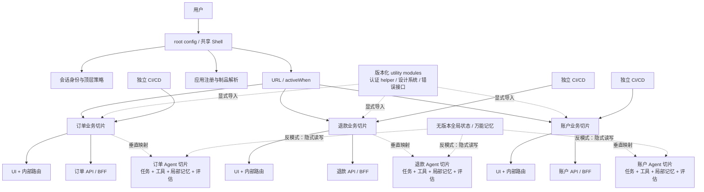
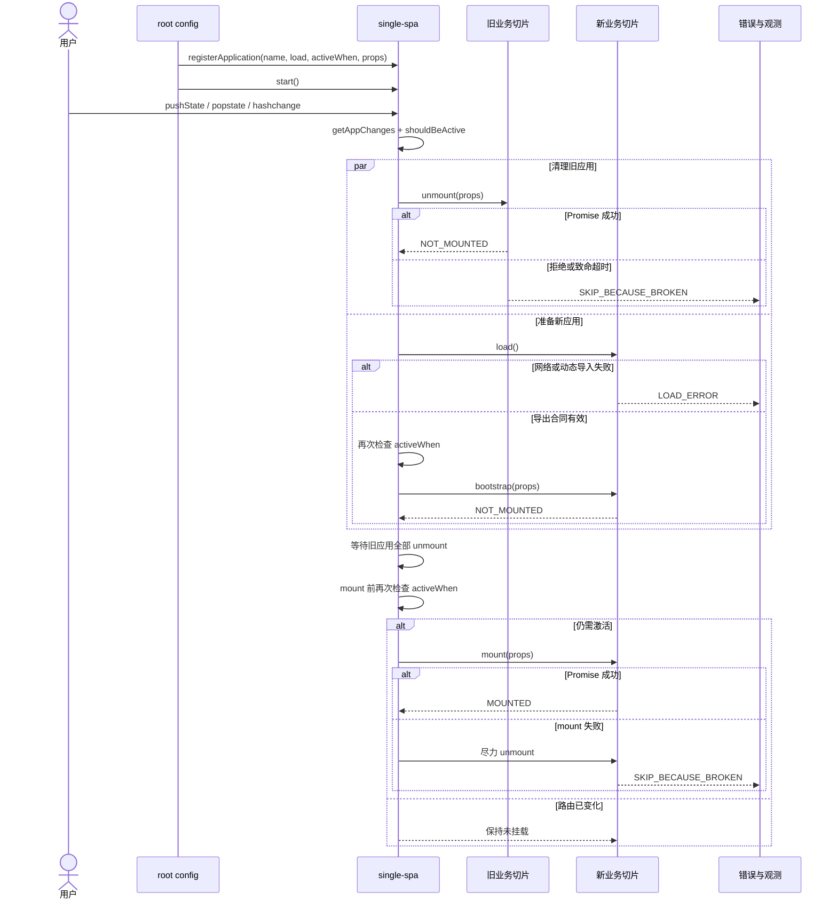

# Micro Frontends + single-spa：用垂直业务切片约束多 Agent 所有权

微前端最难处理的不是“多个框架怎样显示在同一页”，而是独立交付怎样不被隐藏共享状态重新绑成锁步发布。只要一个字段、一个全局 store 或一次 Shell 改动仍要求所有团队同时协调，运行时拆分就只是把单体搬进浏览器。

Cam Jackson 的微前端定义和 single-spa 的运行时契约提供了同一个尺度：先按用户价值划出团队能端到端负责的垂直切片，再决定是否需要运行时组合。微前端解决的是组织独立交付，不是任意拆分组件。一个团队、一个优先级和一个发布节奏时，模块化单体通常更合适。

本文以截至 2026-07-22 的官方文档和 single-spa 6.0.3 固定提交为证据范围，并把它有限类比到多 Agent 所有权。源码路径、版本和完整验证入口收进证据卡；折叠这些卡片，仍可看清控制权、状态、失败与恢复边界。

## 学习问题

1. 为什么微前端首先解决多团队独立交付，而不是框架混搭或组件拆分？
2. 垂直业务切片如何约束 UI、领域逻辑、运行责任和发布权限？
3. root config、激活条件与生命周期分别控制什么，失败后谁有权重试？
4. 共享状态、依赖和通信怎样把独立制品重新变成分布式单体？
5. 将业务切片类比为 Agent、工具与记忆所有权时，哪里必须停止类比？
6. 什么时候模块化单体比运行时拆分更简单、更安全？

## 一页摘要

**已证实事实**：Cam Jackson 将微前端定义为把可独立交付的前端应用组合成整体，主要收益是自治团队、独立部署和增量演进。团队应围绕垂直业务能力组成，从构想到生产持续拥有一块用户价值，而不是按样式、表单或验证等水平技术能力分工。

**已证实事实**：single-spa 的 root config 注册应用、提供激活条件并启动生命周期。`activeWhen` 根据当前位置判断应用是否活跃；`start()` 之前只能加载，启动后才会 bootstrap、mount 或 unmount。应用必须提供 `mount` 与 `unmount`；缺失的 `bootstrap` 或 `unload` 会被标准化为成功的空操作，因此“没有可选钩子”不会被误判成生命周期失败。

**基于证据的推断**：root config 更接近一个确定性的组合控制面，而不是业务超级应用。它应持有“哪些切片可被发现、何时激活、挂载到哪里、通用身份与错误策略是什么”等少量系统职责，不应吸收订单、客户或风控规则。业务团队如果每次改动都要修改 Shell、请求中央团队排期或等待统一发布，名义上的微前端没有产生组织自治。

**个人分析**：映射到多 Agent 系统时，一个切片应拥有完整业务结果，包括领域任务、专用工具、局部记忆、评估、SLO 和发布权限。共享编排 Shell 只做身份、顶层意图路由、预算与策略门禁、结果装配；无版本全局记忆、万能工具网关和同步发布列车会重新制造全局协调。

| 架构对象 | 明确所有者 | 对外合同 | 不应拥有 |
| --- | --- | --- | --- |
| root config / 共享 Shell | 平台或产品集成团队 | 注册清单、激活规则、挂载槽位、顶层导航、错误与观测钩子 | 领域决策、领域数据库写入、各切片内部路由 |
| 垂直业务切片 | 单一业务团队 | 生命周期、公开入口、版本化事件或 API、SLO | 其他切片的 DOM、私有状态和发布流程 |
| 共享依赖与 utility module | 明确的平台维护者 | 最小稳定接口、兼容矩阵、升级/回滚策略 | 无边界的全局业务状态、任意跨域写入 |
| Agent 业务切片 | 单一领域团队 | 任务信封、工具权限、状态模式、评估与结果契约 | 其他 Agent 的私有记忆、凭证和内部推理步骤 |

结论很直接：**微前端的组织目的，是让多个团队在同一产品中以较少协调完成独立交付。** 如果只有一个小团队、一个统一优先级和一个发布节奏，模块化单体通常拥有更低的运行时、测试、安全和治理成本；此时不应拆成微前端，更不应把单个 Agent 系统机械拆成一组远程服务。

## 事实边界

**已证实事实**：single-spa 把微前端分为 application、parcel 与 utility module。application 按路由声明式激活；parcel 命令式嵌入且不拥有路由；utility module 暴露公共 JavaScript 接口。三者共享同一浏览器进程、主线程和 DOM，并不具备后端微服务的隔离。

**已证实事实**：官方建议让一个微前端只修改自己拥有的 DOM 区域，跨微前端尽量少通信。首选机制是显式模块导入；每个微前端应以单一入口控制公开接口。路由型应用通常不需要频繁共享 UI 状态。官方尤其警告不要让所有微前端依赖一个全局 Redux/MobX store，因为状态形状与 action 会迫使调用方同时考虑前后兼容，破坏独立部署。

**已证实事实**：共享依赖是一项选择性优化，不是默认边界。single-spa 推荐对 React 等体积较大的库考虑单实例共享，对较小依赖可接受重复打包，以便各应用独立升级；其文档明确指出，把一切都设为共享依赖会要求所有使用方同时升级。认证/授权、样式系统、API helper 和全局错误处理可以做成 utility module，但这些模块也需要公共接口与独立维护责任。

**基于证据的推断**：运行时组合隔离的是代码库、流水线和责任，不自动隔离 CPU、内存、DOM、Cookie、Web Storage 或网络会话。失控应用仍可阻塞主线程、覆盖全局样式或读取同源令牌。“独立部署”不能被误写成“安全沙箱”；更强隔离需要 iframe、不同 origin、内容安全策略或后端授权边界。

**个人分析**：本文不把 single-spa 当成完整平台。它不替项目决定业务边界、认证协议、数据一致性、制品签名、import map 发布原子性、跨应用契约版本、端到端测试、灰度路由、SLO 或事故响应。它提供注册、激活与生命周期状态机；生产系统仍必须围绕这些接缝建立发布与治理机制。

**个人分析**：将微前端迁移到多 Agent 只能做结构类比。前端 `mount` 成功通常意味着 DOM 已建立，而 Agent 的“激活”可能启动非确定推理、调用外部系统并产生不可逆副作用。Agent 的 `unmount` 不能只停止展示；还要处理租约、在途工具调用、幂等键、检查点、补偿与审计。因此下文把生命周期当作所有权协议，不把浏览器状态机照搬成工作流引擎。

## 架构图

下图将 single-spa 的运行时组合与多 Agent 所有权放在同一张边界图中。实线表示运行时控制流，虚线表示受契约约束的类比，不表示二者具有相同故障模型。

**已证实事实**：single-spa 的 root config 只需要共享 HTML 与注册应用的 JavaScript；官方称其存在目的只是启动应用。应用各自拥有子路由，single-spa 是依据 URL 激活它们的顶层路由器。`activeWhen` 可为函数、路径前缀或组合数组，导航事件与 history API 变更会触发重新计算。

**基于证据的推断**：实际产品可以有常驻导航、登录页和多个同时激活的应用，但共享 Shell 应保持“薄”。它可决定槽位和系统级失败降级，却不应直接导入所有业务内部模块，也不应通过巨型 `customProps` 把可变领域对象广播给每个应用。否则 root config 会成为编译、测试和组织瓶颈。

**个人分析**：Agent 版 Shell 可以维护能力注册、身份、租户、预算、顶层任务路由和最终结果装配，但每个切片要有独立工具允许列表、领域状态存储与评估。全局状态若只是带版本的不可变用户身份快照，可能是合理公共上下文；若任何 Agent 都能写入共享“事实”并期待其他 Agent 立即按特定字段解释，它就是跨边界数据库，所有团队会被迫锁步升级。

## 控制权与任务流

**说明性场景**：用户从订单页切到退款页，又在退款制品加载时返回订单页。这个场景没有声称发生过真实事故，只用 single-spa 已证实的状态机追踪一次控制权交接。

注册后，single-spa 依据状态与 `shouldBeActive` 把应用分为待加载、待挂载、待卸载或待 unmount。新应用的 load/bootstrap 可与旧应用 unmount 并行，但必须等旧应用全部完成清理后才 mount；bootstrap 前和 mount 前还会复核激活条件。因此，迟到的退款应用不会仅凭最初一次导航判断覆盖已经恢复的订单页。

**已证实事实**：生命周期函数可以是函数数组，single-spa 会按顺序等待前一个 Promise 后再调用下一个；函数若不返回类 Promise 对象会失败。`mount` 失败时源码先把状态临时设为 `MOUNTED`，尽力执行 `unmount` 清理，然后进入 `SKIP_BECAUSE_BROKEN`。`unmount` 会先处理子 parcel，即使子 parcel 清理失败仍尝试清理父应用。`unload` 只有显式调用 `unloadApplication` 后才运行；成功会删除缓存的生命周期函数并回到 `NOT_LOADED`，下次重新加载与 bootstrap。

**个人分析**：这组状态转换给 Agent 平台的启示不是函数命名，而是“控制权必须可观察”。Agent 切片至少应暴露 `registered`、`ready`、`active`、`draining`、`inactive`、`load-error` 与 `broken` 等可查询状态；激活前验证任务与权限，停用时拒绝新工作并等待或转移在途任务。一次推理失败不应与制品加载失败混成同一重试策略：前者可能需要业务补偿，后者可能只需回滚制品解析。

## 关键源码导读

阅读源码只需先抓住三条接缝：注册时校验合同，reroute 决定交接顺序，生命周期函数落实状态转换。它们共同证明 single-spa 是带错误状态的路由驱动状态机；它们不证明页面具有事务回滚，也不证明任一应用失败后会自动切到备用实现。

本节只解释 single-spa 6.0.3 固定快照。该版本范围影响状态机与默认超时结论；快照之后的实现不在本文范围内。

  
证据：注册、路由与生命周期源码接缝

- **固定提交：** [`297483c11265050542d7ef107d14c44936c51883`](https://github.com/single-spa/single-spa/tree/297483c11265050542d7ef107d14c44936c51883)，仓库 `package.json` 为 6.0.3；该提交本身只更新资助配置。

| 源码接缝 | 已证实行为 | 合同或错误语义 | Agent 类比提醒 |
| --- | --- | --- | --- |
| [`applications/apps.js`](https://github.com/single-spa/single-spa/blob/297483c11265050542d7ef107d14c44936c51883/src/applications/apps.js) | `registerApplication` 校验并标准化输入，以 `NOT_LOADED` 加入注册表后触发 reroute；同名注册直接抛错 | 名称、加载对象、激活函数、`customProps` 均有边界校验；未调用 `start` 五秒后给出警告 | 能力注册必须拒绝重名、非法入口和无效策略，不能靠运行时猜测 |
| [`applications/app.helpers.js`](https://github.com/single-spa/single-spa/blob/297483c11265050542d7ef107d14c44936c51883/src/applications/app.helpers.js) 与 [`applications/apps.js`](https://github.com/single-spa/single-spa/blob/297483c11265050542d7ef107d14c44936c51883/src/applications/apps.js) | `shouldBeActive` 调用 `activeWhen(location)`；异常则报告并进入 `SKIP_BECAUSE_BROKEN`；`getAppChanges` 按状态分桶 | `LOAD_ERROR` 在满足激活且经过至少 200ms 后可再次尝试 load；broken 应用不再被激活 | 路由谓词必须纯且可审计；策略代码异常不能默认放行 |
| [`navigation/reroute.js`](https://github.com/single-spa/single-spa/blob/297483c11265050542d7ef107d14c44936c51883/src/navigation/reroute.js) | started 前只 load；started 后编排 unload、unmount、load、bootstrap、mount；mount 等待旧应用全部 unmount | 同时发生的 reroute 排队；加载与清理可并行，挂载前两次复核激活条件 | 任务切换需要 drain 屏障与迟到结果检查，不能只在接单时鉴权 |
| [`lifecycles/load.js`](https://github.com/single-spa/single-spa/blob/297483c11265050542d7ef107d14c44936c51883/src/lifecycles/load.js) | 要求 loading function 返回 Promise；验证 `mount`、`unmount` 及可选 `bootstrap` 的导出形式，并展平函数数组 | 用户合同错误进入 `SKIP_BECAUSE_BROKEN`；加载 Promise 拒绝进入 `LOAD_ERROR` 并记录时间 | 区分“制品暂不可达”与“能力合同无效”，两者恢复和告警不同 |
| [`lifecycles/bootstrap.js`](https://github.com/single-spa/single-spa/blob/297483c11265050542d7ef107d14c44936c51883/src/lifecycles/bootstrap.js) 与 [`lifecycles/mount.js`](https://github.com/single-spa/single-spa/blob/297483c11265050542d7ef107d14c44936c51883/src/lifecycles/mount.js) | bootstrap 仅从 `NOT_BOOTSTRAPPED` 进入，成功后为 `NOT_MOUNTED`；mount 仅从 `NOT_MOUNTED` 进入，成功后为 `MOUNTED` | bootstrap 失败进入 broken；mount 失败先尽力 unmount，再进入 broken | 一次性初始化与每次激活要分开；失败清理必须幂等且不掩盖原错误 |
| [`lifecycles/unmount.js`](https://github.com/single-spa/single-spa/blob/297483c11265050542d7ef107d14c44936c51883/src/lifecycles/unmount.js) 与 [`lifecycles/unload.js`](https://github.com/single-spa/single-spa/blob/297483c11265050542d7ef107d14c44936c51883/src/lifecycles/unload.js) | unmount 只处理 `MOUNTED`，先清子 parcel 再清父；unload 只在被请求且已 unmount 或处于 `LOAD_ERROR` 时执行 | 清理失败进入 broken；unload 无论成功或错误都会移除缓存生命周期，成功回到 `NOT_LOADED` | Agent 停用先处理子任务和租约；卸载制品不等于撤销已发生的外部副作用 |
| [`lifecycles/lifecycle.helpers.js`](https://github.com/single-spa/single-spa/blob/297483c11265050542d7ef107d14c44936c51883/src/lifecycles/lifecycle.helpers.js)、[`applications/timeouts.js`](https://github.com/single-spa/single-spa/blob/297483c11265050542d7ef107d14c44936c51883/src/applications/timeouts.js) 与 [`applications/app-errors.js`](https://github.com/single-spa/single-spa/blob/297483c11265050542d7ef107d14c44936c51883/src/applications/app-errors.js) | 生命周期数组串行执行；默认时限会周期告警，只有 `dieOnTimeout` 为真才拒绝 Promise；错误带应用名并先记录失败前状态，再切换新状态 | 默认 bootstrap 4000ms，其他主要生命周期 3000ms，且默认不因超时终止等待 | 生产策略必须显式选择超时后告警、隔离、取消或熔断；默认无限等待不等于恢复 |

**边界：** 这些锚点支持注册校验、状态分桶、清理屏障、失败分类和超时语义，不证明业务效果或 Agent 副作用可以照搬浏览器生命周期。

**基于证据的推断**：状态检查使重复调用趋于无操作，reroute 队列避免多个导航同时改写生命周期。生产 Shell 仍要定义 error boundary、占位 UI、重试、回滚与用户可见降级。

**个人分析**：对 Agent 平台，最值得移植的是注册合同、激活谓词、明确状态、清理屏障和错误分类。不能移植轻量超时语义：工具调用可能产生计费、发信、付款或数据修改。超时后必须用幂等键、状态查询或补偿确认结果。

## 架构决策与权衡

| 决策 | 适用条件 | 收益 | 主要代价与退出信号 |
| --- | --- | --- | --- |
| 模块化前端单体 | 一个小团队、一个产品优先级、一个发布节奏 | 本地重构、原子测试、统一依赖和低运维成本 | 团队互相阻塞、发布队列持续增长且业务边界稳定时再评估拆分 |
| 微前端 + 运行时组合 | 多个稳定业务域由不同团队独立负责，确有独立发布需求 | 缩小变更与发布半径，允许局部技术演进 | 组合、网络、契约、安全、观测与 E2E 复杂度增加 |
| build-time 包组合 | 只需要代码模块化，不要求独立上线 | 依赖去重简单，类型和测试集成直接 | 任一切片发布都需重编译整体；若目标是团队自治，应避免锁步发布 |
| 共享大型依赖 | 体积收益显著，兼容策略成熟 | 降低重复下载和内存占用 | 版本约束变成全局合同；频繁协调升级时应允许局部复制 |
| 跨切片公共状态 | 仅限稳定、最小、只读或版本化上下文 | 减少重复获取身份与环境信息 | 可变全局 store、隐式 action 或任意写入会制造分布式单体 |
| Agent 垂直切片 | 领域任务、工具权限、状态和 SLO 均可由一个团队闭环 | 所有权清晰，可独立评估、发布和回滚 | 若仍共享万能记忆、统一提示词或中央工具实现，就只是表面拆分 |

**已证实事实**：Fowler 文章反对把独立代码库重新汇入一个必须整体编译发布的容器，因为这会在发布阶段重建耦合；同时也承认微前端会造成重复依赖、环境差异与运维治理复杂度。single-spa 推荐的 import map 与浏览器内模块支持独立制品解析，但共享依赖版本仍需要集中管理。

**个人分析**：选择边界的第一问不应是“能否拆”，而是“谁需要不等待别人就把什么用户价值送到生产”。若答案始终是同一个团队、同一批准人和同一发布窗口，拆分只会把函数调用变成运行时协议。即使未来团队可能扩大，也应先在单体内建立领域模块、公开接口和局部状态，再用真实协调成本证明需要物理拆分。

**个人分析**：按“研究 Agent、写作 Agent、工具 Agent”水平拆分，会让一次业务结果跨多个所有者排队。更合理的切片是“退款解决”“合同审查”“客户续约”等业务结果。切片内部可包含研究、推理和行动能力，但由一个团队承担工具权限、记忆质量和事故响应。

## 生产化分析

生产治理要回答的不是“有多少独立仓库”，而是每次发布、交接和失败是否仍能归属到一个明确所有者。制品解析、生命周期、路由、授权、契约和共享依赖各有不同恢复动作；将它们压成一个“页面失败”告警，会让独立交付失去可运维性。

  
证据：生产控制、观测字段与恢复动作

**来源锚点：** [single-spa Applications API](https://single-spa.js.org/docs/api/) 与固定提交的 [`navigation/reroute.js`](https://github.com/single-spa/single-spa/blob/297483c11265050542d7ef107d14c44936c51883/src/navigation/reroute.js) 支持生命周期、路由与失败状态；授权、审计和 Agent 字段是应用补充。

| 生产维度 | 最小控制 | 可观测信号 | 失败处置 |
| --- | --- | --- | --- |
| 制品与组合 | 制品内容哈希、import map 变更审查、原子发布、兼容窗口 | 每个应用的解析 URL、版本、加载耗时、缓存命中 | 回滚映射或固定到上一制品；不要现场覆盖不可追溯文件 |
| 生命周期 | 每阶段时限、幂等 mount/unmount、DOM 槽位所有权 | 状态转换、阶段耗时、拒绝、超时、broken 次数 | 独立降级占位、隔离故障应用、保留其他已挂载切片 |
| 路由 | 顶层前缀归属、冲突检查、404/无应用策略、迟到激活复核 | URL、命中应用集合、路由取消与重定向链 | 回退安全路由；禁止通过宽泛 `activeWhen` 抢占其他域 |
| 认证与授权 | Shell 建立会话，切片/后端按动作重新授权，令牌最小权限 | 身份来源、租户、权限决定、拒绝原因、令牌受众 | 会话失效统一退出；高风险动作不能只信任前端传入角色 |
| 跨应用契约 | 单入口、语义版本或兼容策略、消费者契约测试、废弃期 | 接口版本、调用方、事件模式、未知字段和解析失败 | 双读/适配或回滚；不要要求所有消费者同一时刻升级 |
| 共享依赖 | 最小共享清单、版本负责人、兼容矩阵、紧急回滚 | 实际加载版本、重复字节、运行时冲突 | 可局部复制小依赖；共享升级失败时恢复旧 import map |
| Agent 工具与记忆 | 每切片工具允许列表、局部状态库、模式版本、幂等键 | Agent/提示词/模型/工具版本、状态读写、外部副作用 | 停止接单、排空任务、查询副作用、补偿或转人工 |

**边界：** 表中控制是生产化分析，不是 single-spa 开箱即用的治理能力；尤其服务端授权、制品完整性和 Agent 副作用恢复必须另行实现。

**安全。已证实事实**：single-spa 文档允许把认证 helper 做成 utility module，也允许在 `start()` 前等待登录用户信息；这解决的是共享客户端能力和启动时序，不是服务端授权。所有微前端仍处于同一浏览器环境，能否访问 Cookie、Storage 或全局对象取决于 Web 安全边界，而不是 application 名称。

**安全。个人分析**：生产 Shell 应通过 CSP、受控 origin、SRI 或等价制品完整性、依赖扫描和最小化全局对象减少供应链风险。高风险 API 必须在服务端按用户、租户、资源和动作重新鉴权，令牌限定受众与作用域。不要通过 `customProps` 广播长期凭证，也不要把 import map 更新权交给所有业务流水线。Agent 版还需在工具执行点再次授权，防止共享编排器的高权限凭证被所有切片继承。

**可靠性与性能。已证实事实**：single-spa 提供按激活条件懒加载、生命周期错误处理器、状态查询与可配置超时；源码区分 `LOAD_ERROR` 和 `SKIP_BECAUSE_BROKEN`。但默认超时的 `dieOnTimeout` 为 false，达到最终时限后只报错并继续等待，不会强制取消用户代码。

**可靠性与性能。个人分析**：应分别为网络加载、bootstrap、mount、unmount 设预算，并监测长任务、内存增长、监听器泄漏和主线程阻塞。失败应用要有可访问的占位 UI，不能让 root config 崩溃。共享依赖是否去重应依据真实字节与兼容成本；过度外置会把局部升级变成全局变更。

**可运维性。个人分析**：每条前端遥测至少携带 `app_name`、制品版本、root config 版本、当前 URL、生命周期阶段、correlation ID 和用户可匿名化会话标识；发布看板按切片展示错误率、加载延迟与回滚。端到端测试覆盖关键跨域旅程，切片仓库负责本域组件/契约测试，Shell 仓库负责注册清单、路由冲突和组合烟测。Agent 版还要加入任务 ID、模型/提示词版本、工具调用、记忆模式、预算和人工接管原因。

**独立交付。个人分析**：独立流水线不等于无治理。业务团队可自主发布自己的不可变制品；平台团队维护 Shell、共享策略和兼容门禁；发布系统以原子方式更新制品解析，并支持按用户群或租户灰度。若每次上线仍需中央团队手工合并 root config，说明注册发现机制或组织边界尚未完成，应把频繁变更从 Shell 移回切片可拥有的配置边界。

## 可迁移经验

### 可直接复用的机制

- **按用户价值垂直切片**：让一个团队同时拥有领域任务、Agent 行为、工具适配、局部记忆、评估、SLO 与发布，而不是把模型、提示词、工具和数据分别交给水平团队排队。
- **薄 Shell 与声明式注册**：共享编排层只保存名称、能力入口、激活条件、版本、权限和状态等控制信息；领域逻辑保留在切片内部。
- **显式生命周期合同**：区分制品加载、一次性初始化、每次激活、排空停用与卸载；每个阶段都有前置状态、Promise/完成信号、时限、幂等要求和失败状态。
- **激活条件重复校验**：在任务入队、实际执行和发布结果前复核租户、权限、截止时间和任务是否仍有效，阻止迟到结果污染新上下文。
- **先清理再切换的屏障**：旧所有者停止接收新工作、处理子任务和租约后，新所有者才接管可变资源；该机制适用于工具独占锁、会话主写者和长任务 worker。
- **区分暂态加载失败与合同破损**：依赖不可达可退避重试；接口缺失、返回协议非法或策略函数异常应隔离并阻止再次激活，直到新版本修复。
- **独立制品与回滚**：每个业务切片拥有不可变版本、评估门禁、灰度和回滚，不因其他切片尚未准备好而等待统一发布列车。

### 只能有限类比的部分

- 浏览器 application 共享进程但主要拥有 DOM；Agent 切片通常在服务端拥有队列、工具副作用和持久状态。前端 unmount 可移除监听器，Agent drain 还需确认在途事务、租约和补偿。
- URL 是稳定、可观察的顶层激活信号；自然语言意图分类具有不确定性。Agent 路由应输出置信度、候选能力、策略依据和转人工分支，不能把 `activeWhen` 的布尔模型原样照搬。
- `customProps` 适合传少量生命周期上下文；Agent 任务信封还需租户、预算、截止时间、幂等键、授权引用、数据分类和追踪信息，并避免复制不必要的长期记忆。
- utility module 可共享认证 helper；真正的授权必须由资源端执行。类似地，共享 Agent 工具 SDK 可以统一调用格式，却不能替代工具服务对每次动作的身份与权限校验。
- import map 可在浏览器解析制品版本；Agent 能力注册还要表达模型、提示词、工具模式、数据驻留、评估成绩和容量，且更新必须与在途任务兼容。

### 不应照搬的部分

- 不要因为有多个 Agent 就按 Agent 数量拆多个服务；先证明存在独立团队、独立业务结果、不同伸缩/安全边界或不同发布节奏。
- 不要让所有切片读写一个无版本全局 store、向一个事件总线广播内部状态或依赖隐式事件顺序；这会把本地调用耦合升级为难以追踪的分布式单体。
- 不要把每个库都设为共享依赖，也不要让所有 Agent 共享一个万能提示词、统一模型版本或全局工具实现；共享项越多，锁步升级面越大。
- 不要把 root config 或 Supervisor 变成拥有全部业务逻辑的“超级容器”。它应路由与执行策略，不应绕过领域所有者直接修改其 DOM、记忆或业务数据库。
- 不要把 `SKIP_BECAUSE_BROKEN` 当作自动恢复方案。隔离状态只阻止继续运行；生产系统仍需告警、降级、版本回滚、用户沟通和数据修复。
- 不要认为独立部署自动带来安全隔离。浏览器同源模块共享大量能力，Agent 服务也可能共享凭证、数据库与模型额度；真实故障域由最宽的共享资源决定。
- 不要在一个小团队、一个发布节奏下强行拆分。此时优先采用边界清晰的模块化单体、局部 store、版本化接口和统一测试；当协调等待成为可测瓶颈后再物理拆分。

## 来源

**工程文章（已证实事实）**

- [Cam Jackson, Micro Frontends](https://martinfowler.com/articles/micro-frontends.html)：微前端定义、垂直业务团队、自治团队、独立交付、运行时组合、跨应用通信最小化、共享依赖张力与运维治理代价。发布于 2019-06-19；访问与截断日期：2026-07-22。

**single-spa 官方文档（已证实事实）**

- [Microfrontends Overview](https://single-spa.js.org/docs/microfrontends-concept/) 与 [Microfrontend Types](https://single-spa.js.org/docs/module-types/)：浏览器共享进程/DOM 的边界，application、parcel、utility module 分类，声明式应用与公开接口。访问与截断日期：2026-07-22。
- [Configuring single-spa](https://single-spa.js.org/docs/configuration/)：root config、`registerApplication`、`activeWhen`、`customProps`、顶层/子路由关系以及 `start()` 前后的行为。访问与截断日期：2026-07-22。
- [Building single-spa applications](https://single-spa.js.org/docs/building-applications/) 与 [Applications API](https://single-spa.js.org/docs/api/)：load、bootstrap、mount、unmount、unload、Promise 合同、超时、错误状态、重载与注销语义。访问与截断日期：2026-07-22。
- [The Recommended Setup](https://single-spa.js.org/docs/recommended-setup/)：浏览器内模块、import maps、独立流水线、utility modules、跨应用接口、共享依赖与全局状态反模式。访问与截断日期：2026-07-22。

**single-spa 固定源码（已证实事实）**

- [single-spa 仓库快照 `297483c11265050542d7ef107d14c44936c51883`](https://github.com/single-spa/single-spa/tree/297483c11265050542d7ef107d14c44936c51883)：核对的 HEAD SHA；仓库版本标记为 6.0.3。重点读取 `src/applications/apps.js`、`app.helpers.js`、`app-errors.js`、`timeouts.js`，`src/navigation/reroute.js`，以及 `src/lifecycles/load.js`、`bootstrap.js`、`mount.js`、`unmount.js`、`unload.js`、`lifecycle.helpers.js`。访问与截断日期：2026-07-22。

**证据边界（基于证据的推断）**：组织适用性、Agent/tool/memory 所有权映射、分布式单体判据、生产安全与发布控制，是依据上述官方事实形成的架构推断，不是 single-spa 对多 Agent 系统的官方建议。single-spa HEAD 在本次访问时仍指向 2025-06-19 的提交；后续源码和文档变化不在本案例结论范围内。
