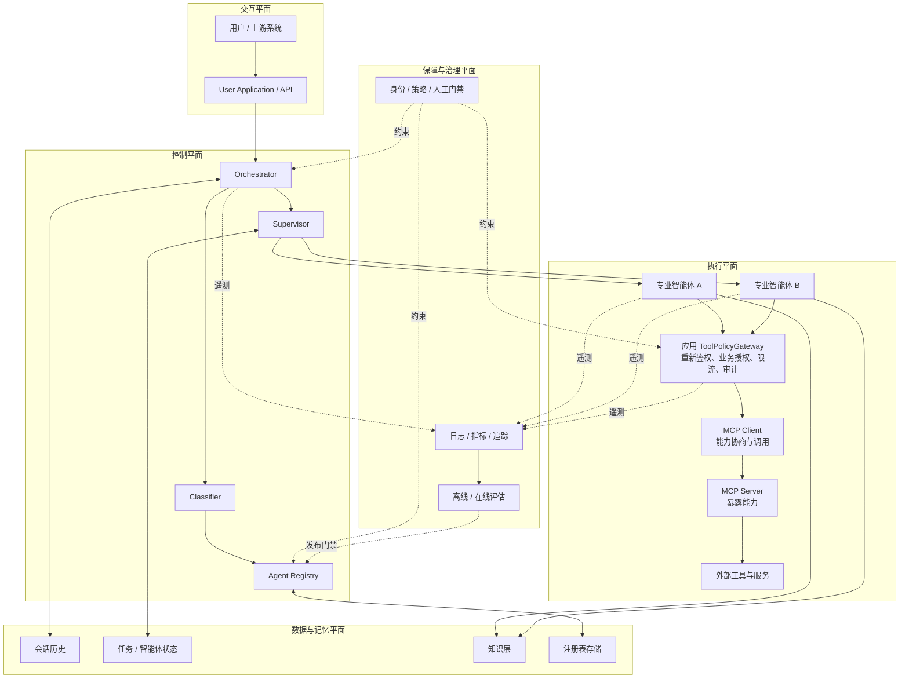
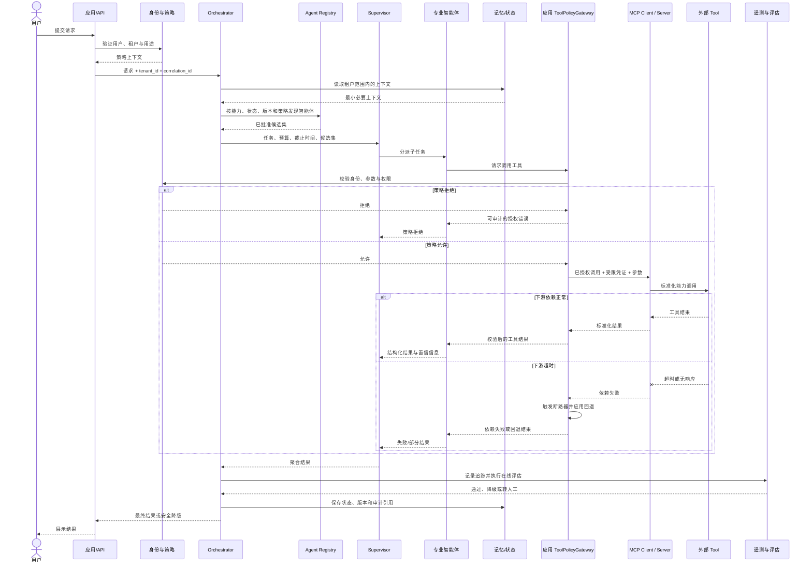

# Microsoft 多智能体参考架构：企业治理下的受控自治

多智能体项目最容易把顺序做反：先挑一个编排框架，再让框架的默认对象决定注册、状态、权限和故障处理。Microsoft 的参考架构给出相反的判断路径——先看任务如何分解、控制权跨越哪些团队与安全域、需要多强的治理，再决定是否需要框架以及需要哪一类框架。

这份材料不是 SDK，也不是可直接部署的系统。它更像一张企业架构问题清单：Orchestrator、Registry、记忆、通信、评估和治理各自承担什么责任，以及这些责任之间应画出哪些边界。

本文据此只把职责分工视为已证实事实，框架选择和运行合同仍是项目决策。提交和文档入口留给证据卡核验；权限、工具副作用、版本兼容、故障恢复与人工升级则在正文中接受架构判断。

## 学习问题

1. 一个企业级多智能体平台，应怎样分离注册、编排、记忆、通信、可观测性、评估、安全与治理？
2. 参考架构中哪些内容与框架无关，哪些仍是项目必须补齐的实现决策？
3. 中央编排、注册准入和策略网关在什么位置限制智能体自治，又换来了哪些可审计性？
4. 租户隔离、全链路审计、版本演进与故障遏制应落在哪些边界？
5. 官方仓库以文档为主时，应按什么顺序阅读，哪些文档相当于“关键模块”？

## 一页摘要

决定是否引入多智能体框架前，先问两个问题：任务是否真的需要多个独立行动域，组织是否需要统一准入、路由、审计和回滚？

**已证实事实**：仓库把自己定义为概念指南，关注多智能体编排、治理和扩展，而不是单个智能体实现。主参考图采用中央 Orchestrator，并配合 Classifier、Agent Registry、Supervisor、专业智能体、知识与持久化层及 MCP 集成层。专题章节再补充通信、可观测性、评估、安全和治理。

**基于证据的推断**：可以把这些职责重组为五个相互约束的平面。官方没有采用这套统一命名；它是把分散章节映射到企业平台职责后的分析模型。

| 平面 | 主要构件 | 主要职责 | 首要生产约束 |
| --- | --- | --- | --- |
| 交互平面 | User Application、API | 身份、会话、输入校验、结果呈现 | 用户身份不能在跨智能体跳转中丢失 |
| 控制平面 | Orchestrator、Classifier、Supervisor、Registry | 分解、路由、准入、聚合、生命周期 | 路由可解释、策略可执行、版本可回滚 |
| 执行平面 | 本地/远程专业智能体、MCP Client/Server、工具适配器 | 领域推理与受控行动 | 最小权限、超时、幂等、熔断 |
| 数据与记忆平面 | Conversation History、Agent State、Registry Storage、Knowledge Layer | 上下文、状态、知识、恢复 | 租户隔离、保留期限、并发一致性 |
| 保障与治理平面 | 日志/指标/追踪、评估、策略、人工审批 | 质量、安全、合规、发布门禁 | 关联 ID、证据留存、持续评估 |

**已证实事实与实现边界**：MCP Client/Server 标准化能力发现、协商与调用，不自动替应用完成最终用户重新鉴权、业务授权、限流或审计。本文的 `ToolPolicyGateway` 是应用控制点；它可以包裹 MCP Client，也可以保护非 MCP 工具。

**个人分析**：框架选择应跟随右侧这些约束，而不是反过来。跨团队、跨安全域、要求审计和独立版本治理时，控制平面的收益可能覆盖额外跳数、费用和故障面；若单智能体加工具已经可靠，最低必要复杂度仍是更好的起点。

## 事实边界

事实范围先回答“这份参考架构能证明什么”。它能证明职责、模式和官方建议，不能证明某个 SDK、云服务或生产拓扑已经替项目完成这些职责。

### 已证实事实

官方 README 明确说明仓库是概念指南，并以框架和技术栈无关为目标。仓库主要由架构文档、图、站点构建文件和文档脚本组成，不是端到端运行时产品。

Building Blocks 把 Orchestrator、Specialized Agents 和 Agent Registry 列为核心构件，默认建议专业智能体经编排器通信。高度耦合的一组智能体可以封装为组合智能体；通信章节也允许请求式、消息驱动式及混合交互。

Registry 可集中或分布部署，承担注册、存储、查询和健康监测，并在注册时加入有效性评估。Memory 区分短期与长期记忆，指出同步、所有权、隐私和一致性是多智能体特有问题。

Observability 要求采集智能体动作、工具调用、模型调用与响应模式，Evaluation 再用这些信号做确定性和语义质量判断。Security 与 Governance 要求身份、权限、加密、工具策略、审计、版本化、回滚、数据分类、红队和人工反馈；官方补充指南还要求超时、重试、输出校验、熔断、检查点和尽可能的计算隔离。

### 基于证据的推断

官方把 Semantic Kernel 写作 Orchestrator 示例，同时强调技术无关，所以“必须采用 Semantic Kernel”不是事实。可替换的是框架；不可省略的是请求生命周期、路由、上下文、错误恢复和策略执行等职责。

中央编排器、Registry、集成层和横切治理共同构成逻辑控制平面。它可以物理分布部署，但准入、身份、策略和审计语义必须一致，否则框架扩展只会放大治理分裂。

官方没有完整 SaaS 多租户蓝图。把 `tenant_id` 贯穿身份、路由、记忆、队列、追踪和评估，并为高敏感租户使用独立存储、密钥或执行池，是由权限传播与故障隔离要求推导出的实现建议。

### 个人分析与未知项

仓库没有替项目决定一致性模型、任务幂等键、消息去重、补偿事务、租户拓扑、数据驻留、密钥层级、SLO 和灾备目标。中央协调与受控直连也可以并存，但必须明确哪些交互允许绕过编排器，以及授权和审计如何继续生效。

  
证据：固定提交、来源截断与仓库形态

  - **来源截断：** `2026-07-20`
  - **分支：** 核对时为 `main`
  - **固定提交：** `microsoft/multi-agent-reference-architecture@ed3613b54b46b595dd223aaff8772def376a8c37`
  - **Commit：** `ed3613b54b46b595dd223aaff8772def376a8c37`
  - **仓库形态：** `docs/`、`components/`、Draw.io/SVG 图、mdBook/站点构建文件与文档脚本。
  - **边界：** 固定提交支持本文的概念职责和文档接缝，不证明后续版本、特定框架或生产部署效果。

## 架构图

阅读下图时先找“框架内”和“框架外”的职责。Orchestrator 与 Supervisor 可以由框架实现，Registry、策略、工具网关、审计和发布门禁却必须形成跨运行的一致合同。下图是对官方构件的平面化重绘，不是逐像素复制。

治理不是边缘的“合规盒子”。它必须能拒绝注册、限制路由、阻止工具调用、隔离数据和回滚版本；只能生成报告的策略层不构成控制边界。

## 控制权与任务流

**说明性场景｜一个请求需要跨两个专业智能体并调用有写副作用的工具。** 该场景只组合官方序列与本文已标注的生产化推断，不代表真实客户、部署或事故。

官方序列先由应用把请求交给 Orchestrator。它加载会话历史并调用 Classifier；Classifier 查询 Registry，Orchestrator 再把请求和可用智能体交给 Supervisor。Supervisor 分解任务、调用专业智能体、聚合结果并持久化交互。

进入生产环境后，请求不能只携带自然语言。应用先固定用户、租户和用途；Registry 只返回策略允许、健康且版本兼容的候选。Supervisor 还要带上预算、截止时间和完成定义，避免专业智能体把“继续推理”当成无限授权。

专业智能体准备调用写工具时，应用 `ToolPolicyGateway` 必须基于最终用户身份和当前参数再次鉴权，并完成业务授权、参数校验、限流和审计。MCP Client/Server 负责标准化能力发现与调用，不自动提供这些应用控制。策略拒绝不会被模型解释为“换一种说法再试”；工具超时也不等于副作用未发生，需要用幂等键、结果查询或人工对账判定真实状态。

聚合结果通过在线评估、内容安全或人工门禁后才发布。评估失败可以降级或转人工，但不应让另一个智能体在更大权限下盲目重试。

下面的序列图把官方主线与租户策略、评估和降级节点放在一起。新增节点属于生产化扩展，不是仓库声称已提供的运行时。

这条任务流中，自治被五个确定性接点限制：

1. **注册准入**：未通过能力、接口、安全和质量验证的智能体不进入可发现集合。
2. **路由约束**：Classifier/Orchestrator 只把任务交给策略允许且健康的版本，而不是让任意智能体自由结盟。
3. **上下文约束**：Orchestrator 决定传播最小必要上下文；记忆按会话、用户和租户分区。
4. **行动约束**：应用 `ToolPolicyGateway` 在工具执行前重新鉴权、校验参数、限流并记录审计，不能只信任上游智能体的判断；MCP Client/Server 只承载标准化能力发现与调用。
5. **发布约束**：在线评估、内容安全或人工审批可阻止结果直接到达用户。

这些约束减少局部智能体的行动自由，却换来撤权、追责、灰度和故障隔离。框架可以优化“领域内部怎样推理”，不可逆行动、跨租户访问、版本准入和结果发布仍应由确定性控制点裁决。

## 关键源码导读

这里的“源码导读”不是逐函数追踪。固定仓库的核心资产是 Markdown、架构图和站点辅助文件；阅读目的，是把参考职责转换成所选 SDK 或平台必须实现的接口合同。

最短路径先看三处：Building Blocks 确认最小角色，Reference Architecture 跟踪端到端序列，Security/Governance 检查哪些控制不能交给模型。只有准备拆服务或开放直连时，再继续阅读设计选项、通信、Registry、Memory、Observability 和 Evaluation。

将文档映射到代码时，至少形成 `AgentDescriptor/Registry`、`TaskEnvelope/Orchestrator`、`StateStore`、`PolicyDecisionPoint`、`ToolGateway`、`TelemetryEmitter` 和 `EvaluationGate`。接口名可变，但任务信封必须携带 `tenant_id`、`correlation_id`、行为包版本、截止时间和授权上下文；否则审计与恢复会失去共同主键。

  
证据：架构文档的完整阅读路径

  1. `README.md` 与 `docs/Introduction.md`：受众、非目标和六项设计原则。
  2. `docs/building-blocks/Building-Blocks.md`：Orchestrator、Specialized Agents 与 Registry。
  3. `docs/reference-architecture/Reference-Architecture.md`：完整构件、存储职责、MCP 集成与端到端序列。
  4. `docs/design-options/Modular-Monolith.md` 与 `Microservices.md`：进程边界、团队自治和运维成本。
  5. `docs/agent-registry/Agent-Registry.md`、`docs/memory/*`、`docs/agents-communication/*`：发现/准入、状态所有权与通信方式。
  6. `docs/observability/Observability.md` 与 `docs/evaluation/Evaluation.md`：遥测与质量判断。
  7. `docs/security/Security.md`、`docs/governance/Governance.md`、`docs/versioning/*`：身份、数据、审计、发布和回滚。
  8. `docs/reference-architecture/Patterns.md` 与 `docs/context-engineering/*`：语义路由、动态注册、上下文和工具暴露。
  9. `SUMMARY.md`：官方阅读地图；`components/` 服务文档渲染与复用，不是业务组件实现。

  - **边界：** 这些文档证明参考职责，不证明任何接口名、部署拓扑或 SDK 默认行为。

## 架构决策与权衡

框架复杂度应由需要集中持有的控制权决定。下面五组选择不是产品排行榜，而是从通信、部署、恢复、准入和治理约束反推实现形态。

### 中央编排还是点对点协作

**已证实事实**：Building Blocks 默认建议通过 Orchestrator 通信；Patterns 同时承认经编排器、受控直连和发布订阅三种交互。中央编排更易追踪、预算和执行策略，但会形成热点与潜在单点故障；点对点减少跳数，却扩大权限传播、协议兼容和因果追踪难度。

**个人分析**：默认采用中央控制、分布执行。只有低延迟或高吞吐证据足够时才开放直连，并要求短期凭证、允许列表、关联 ID、契约版本和完成回报。自治不是绕过控制面，而是在控制面授予的有限能力内运行。

### 模块化单体还是微服务

**已证实事实**：官方同时给出模块化单体和微服务选项。微服务支持独立技术栈、伸缩和部署，但带来网络、安全、注册、健康检查与跨服务可观测性成本。

**个人分析**：早期先用模块化单体验证任务边界和评估指标；当团队所有权、安全域、伸缩曲线或故障隔离确实不同，再拆分远程智能体。按“智能体”名词机械拆服务，会制造分布式单体。

### 请求式还是消息驱动

请求式适合短时、交互式、强反馈链路；消息驱动适合长任务、流量峰值和可恢复工作流。代价是至少一次投递、重复消费、乱序、死信和补偿处理。**个人分析**：无论使用哪种方式，都应把 `task_id` 与幂等键写入任务信封；消息 broker 不能替代工作流状态机。

### 动态注册还是静态配置

动态注册提升可扩展性和运行时发现能力，但注册表成为高价值控制面。官方要求注册验证、健康监测与版本信息。**个人分析**：生产注册应走“提交—扫描/评估—审批—灰度—激活”状态机；自注册只能创建候选记录，不能自动获得生产流量。

### 框架无关部分与实施选择

框架无关的是职责与质量约束：能力发现、任务分解、状态持久化、通信契约、最小权限、端到端追踪、离线/在线评估、生命周期治理和故障隔离。仍需选择的是 SDK、模型、分类器、存储、broker、MCP/A2A 的使用范围、部署平台、租户隔离级别、评估器、策略引擎、审批流程以及 SLO。参考架构提供问题清单，不替代 ADR 和威胁模型。

## 生产化分析

生产化的检查顺序应从“谁能阻止错误动作”开始。租户、版本、故障和评估若只有观测字段、没有拒绝或降级动作，就还没有进入控制平面。

### 租户隔离

**基于证据的推断**：官方明确要求身份传播、权限过滤、按客户或区域路由版本、记忆隐私和数据访问治理，但没有给出统一租户模型。生产系统应把租户作为不可变安全上下文，而不是提示词字段：

- Registry 查询同时过滤租户可用范围、地区、版本和能力；不能让模型从全局候选中自行“遵守租户边界”。
- 会话、长期记忆、向量索引、检查点、缓存、队列主题和遥测都必须带租户分区键；高监管场景采用物理账户/数据库/集群隔离。
- 工具网关基于最终用户身份和租户策略再次鉴权，RAG 检索与生成前都做 security trimming。
- 每租户配置预算、并发、模型/工具允许列表、保留期限和加密密钥；共享模型端点也要纳入噪声邻居与速率限制分析。

### 审计与版本

一次可追责运行至少记录：用户与工作负载身份、租户、关联/任务 ID、路由决策、候选智能体集合、智能体/提示词/模型/工具契约版本、输入输出哈希、策略判定、工具副作用、评估结果和人工批准。敏感正文不应默认复制到日志；哈希、加密引用和受控证据库可以降低泄露面。

版本单位不能只有容器镜像。官方 Security 文档要求对逻辑、提示配置和通信契约版本化并支持共存与回滚。**个人分析**：Registry 记录应指向不可变版本；任务开始时固定依赖版本，长任务通过显式迁移而不是运行中漂移；灰度必须按租户/区域/风险分层，并由在线评估触发自动停流。

### 故障遏制与降级

下表回答故障出现后由谁停止扩散。每项降级都要保留任务真实状态；“返回部分结果”不能掩盖工具写入是否已经发生。

| 故障模式 | 传播路径 | 遏制措施 | 可接受降级 |
| --- | --- | --- | --- |
| Registry 不可用或返回陈旧信息 | 无法路由、调用错误版本 | 只读缓存、签名快照、健康租约、停止新注册 | 使用最后已知安全候选；高风险操作失败关闭 |
| Orchestrator 热点/宕机 | 所有任务阻塞 | 无状态副本、持久检查点、队列缓冲、分区限流 | 转单智能体或人工队列 |
| 专业智能体超时/幻觉 | 聚合结果被污染 | 截止时间、有限重试、熔断、结构校验、置信阈值 | 返回部分结果并标记缺口 |
| 消息重复或乱序 | 重复副作用、状态倒退 | 幂等键、序列号、去重表、状态版本检查 | 隔离到死信队列后重放 |
| 共享模型/知识库限流 | 多智能体同时失败 | 每依赖隔离舱、配额、缓存、备用端点 | 降低并行度或切换低成本模型 |
| 工具被提示注入滥用 | 越权读写或数据外泄 | 参数模式、策略网关、最小权限、人工确认 | 禁用写操作，保留只读回答 |
| 评估器漂移或误判 | 好结果被阻止/坏结果放行 | 固定评估版本、校准集、人工抽检、双轨评估 | 提升人工复核比例 |

### 运行指标与发布门禁

发布门禁要同时回答质量、风险和费用是否仍在预算内。离线金标集负责回归，在线评估负责漂移和风险信号；LLM-as-judge 适合语义质量，不应替代权限、格式、金额上限等确定性断言。

  
证据：每次编排的生产观测字段

  - **质量与路由：** 路由正确率、任务完成率、工具成功率、在线质量评分。
  - **恢复：** 重试、回退、熔断、部分结果与人工升级率。
  - **成本与隔离：** token、费用、上下文膨胀、租户并发与跨租户拒绝。
  - **边界：** 指标只提供门禁输入；权限和不可逆副作用仍由确定性策略与人工批准裁决。

### 适用边界与未决问题

适用：多个真正独立的知识/行动域、不同团队或安全边界、需要独立伸缩与版本治理、任务可分解且收益高于协调成本。限制：低延迟强事务、简单问答、单一权限域、无法建立评估基线的场景。若单智能体加工具可可靠完成工作，优先保留较低复杂度。

上线前仍需回答：租户隔离等级是什么？哪些动作必须人工确认？何处需要强一致？副作用如何补偿？最大迭代/成本/时长是多少？哪个团队拥有 Registry 和策略？审计证据保留多久？区域故障时允许怎样降级？这些均不是官方参考图已经解决的问题。

## 可迁移经验

迁移时不要复制图中的产品名，而要复制控制合同。判断起点始终是：任务复杂度和治理需求是否真的要求新增一个控制平面。

### 可直接复用的机制

1. **先定义控制边界，再选择框架。** 把准入、路由、记忆、工具权限和发布门禁写成接口与 ADR，避免被 SDK 默认值反向塑造架构。
2. **把 Registry 当控制面数据库。** 除能力描述外，还管理所有者、健康、版本、兼容性、安全姿态、评估证据和生命周期。
3. **让自治带预算。** 每次委派携带能力范围、租户、截止时间、最大迭代、费用预算和输出模式；超界由确定性代码终止。
4. **版本化整个行为包。** 代码、提示、模型、工具 schema、策略与评估器共同决定行为，应能固定、灰度、共存和回滚。

### 只能有限类比的部分

1. **中央编排可以物理分布。** 可迁移的是一致的准入、身份和审计语义，不是单进程或单服务拓扑。
2. **请求式与消息驱动可以混用。** broker 提供缓冲和松耦合，却不提供工作流状态、业务去重或副作用补偿。
3. **上下文最小化依赖业务边界。** 摘要、引用和授权上下文可以减少泄露面，但具体保留期、驻留和一致性仍须项目决定。
4. **评估必须与可观测性共同设计。** 语义评估可帮助发现质量漂移，不能替代确定性权限和金额限制。

### 不应照搬的部分

1. **不要因为参考图出现多个智能体就拆成微服务。** 团队所有权、安全域、伸缩或故障隔离没有差异时，模块化单体更容易验证。
2. **不要把自注册等同于生产准入。** 候选记录必须经过扫描、评估、审批和灰度，才能获得生产流量。
3. **不要用无限重试掩盖依赖故障。** 智能体、模型、知识库和工具分别需要超时、并发、熔断、对账和人工升级。
4. **不要把多智能体当成熟度徽章。** 单智能体加工具能够可靠完成任务时，保留较低复杂度。

## 来源

以下均为官方或上游来源。访问日期与来源截断日期：**2026-07-20**。

### 主要架构

- [Microsoft Multi-Agent Reference Architecture 仓库与 README](https://github.com/microsoft/multi-agent-reference-architecture/tree/ed3613b54b46b595dd223aaff8772def376a8c37) — 固定提交下的项目定位、适用人群、框架无关声明与章节入口。
- [Introduction](https://github.com/microsoft/multi-agent-reference-architecture/blob/ed3613b54b46b595dd223aaff8772def376a8c37/docs/Introduction.md) — 关注点分离、安全、可追踪、注册与生命周期、故障隔离、上下文管理等原则。
- [Building Blocks](https://github.com/microsoft/multi-agent-reference-architecture/blob/ed3613b54b46b595dd223aaff8772def376a8c37/docs/building-blocks/Building-Blocks.md) — Orchestrator、专业智能体、Registry 与默认通信控制。
- [Reference Architecture](https://github.com/microsoft/multi-agent-reference-architecture/blob/ed3613b54b46b595dd223aaff8772def376a8c37/docs/reference-architecture/Reference-Architecture.md) — 主架构构件、存储、MCP 集成和官方端到端序列。

### 源码

- [Agent Registry](https://github.com/microsoft/multi-agent-reference-architecture/blob/ed3613b54b46b595dd223aaff8772def376a8c37/docs/agent-registry/Agent-Registry.md) — 集中/分布注册、发现、存储、查询、监测和注册评估。
- [Memory](https://github.com/microsoft/multi-agent-reference-architecture/blob/ed3613b54b46b595dd223aaff8772def376a8c37/docs/memory/Memory.md) — 短期/长期记忆及同步、所有权、隐私、一致性问题。
- [Agents Communication](https://github.com/microsoft/multi-agent-reference-architecture/blob/ed3613b54b46b595dd223aaff8772def376a8c37/docs/agents-communication/Agents-Communication.md) 与 [Message-Driven](https://github.com/microsoft/multi-agent-reference-architecture/blob/ed3613b54b46b595dd223aaff8772def376a8c37/docs/agents-communication/Message-Driven.md) — 请求式、消息驱动与混合通信权衡。
- [Observability](https://github.com/microsoft/multi-agent-reference-architecture/blob/ed3613b54b46b595dd223aaff8772def376a8c37/docs/observability/Observability.md) 与 [Evaluation](https://github.com/microsoft/multi-agent-reference-architecture/blob/ed3613b54b46b595dd223aaff8772def376a8c37/docs/evaluation/Evaluation.md) — 智能体特有遥测、确定性/语义评估及离线/在线阶段。

### 补充说明

- [Security](https://github.com/microsoft/multi-agent-reference-architecture/blob/ed3613b54b46b595dd223aaff8772def376a8c37/docs/security/Security.md) — 身份、能力约束、加密、工具策略、记忆、审计、版本与回滚。
- [Governance](https://github.com/microsoft/multi-agent-reference-architecture/blob/ed3613b54b46b595dd223aaff8772def376a8c37/docs/governance/Governance.md) — 数据来源、输出责任、运行边界、模型监督、RAI 与红队流程。
- [Patterns](https://github.com/microsoft/multi-agent-reference-architecture/blob/ed3613b54b46b595dd223aaff8772def376a8c37/docs/reference-architecture/Patterns.md) — 动态注册、MCP、分层、上下文和智能体通信模式。
- [AI agent orchestration patterns — Azure Architecture Center](https://learn.microsoft.com/en-us/azure/architecture/ai-ml/guide/ai-agent-design-patterns) — 最低必要复杂度、可靠性、安全、可观测、成本和人工参与的官方补充指导。

框架不是这份案例的结论，而是最后一个实现选择。只有当编排复杂度与治理需求已经被写成可执行边界，框架的抽象才有明确的验收对象；否则它只会更快地放大未定义的控制权。
