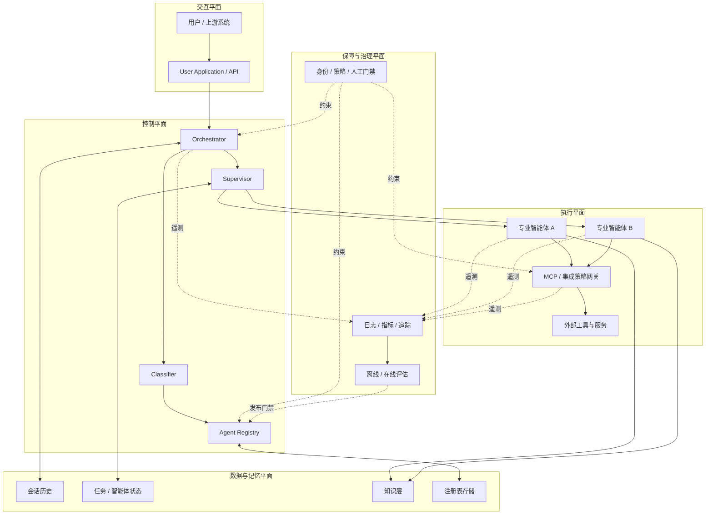
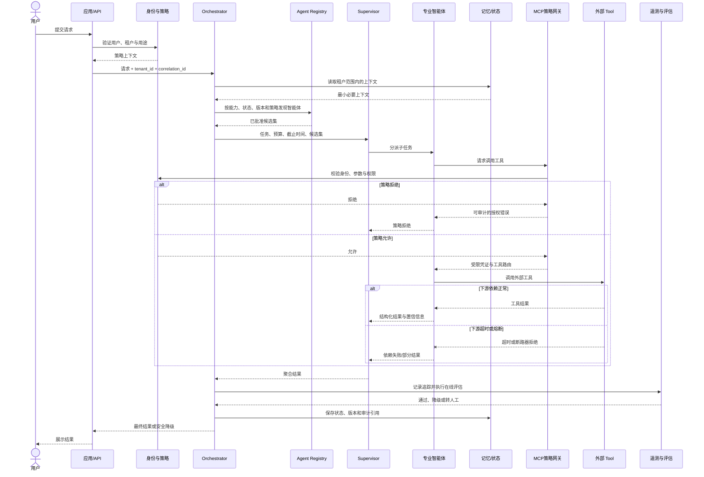

# Microsoft 多智能体参考架构：企业治理下的受控自治

这不是某个 SDK 的快速上手，也不是可直接部署的样例系统。本案例把 Microsoft 的 Multi-Agent Reference Architecture 当作一份企业架构决策材料来读：它给出角色、边界、模式和治理要求，但把大量技术选择留给实施团队。

## 学习问题

1. 一个企业级多智能体平台，应怎样分离注册、编排、记忆、通信、可观测性、评估、安全与治理？
2. 参考架构中哪些内容与框架无关，哪些仍是项目必须补齐的实现决策？
3. 中央编排、注册准入和策略网关在什么位置限制智能体自治，又换来了哪些可审计性？
4. 租户隔离、全链路审计、版本演进与故障遏制应落在哪些边界？
5. 官方仓库以文档为主时，应按什么顺序阅读，哪些文档相当于“关键模块”？

## 一页摘要

**已证实事实**：仓库将自己定义为一份概念指南，关注多智能体的编排、治理和扩展，而不是单个智能体实现。README 同时称其建议既“有立场”又不绑定企业技术栈或智能体框架。主参考图采用中央 Orchestrator，配合 Classifier、Agent Registry、Supervisor、专业智能体、知识与持久化层，以及 MCP 集成层；专题章节再补充通信、可观测性、评估、安全和治理。

**基于证据的推断**：最合适的整体理解不是“一个超级智能体加很多工具”，而是五个相互约束的平面：交互平面、控制平面、执行平面、数据与记忆平面、保障与治理平面。官方没有用这五个平面作为统一命名；这是把分散章节映射到企业平台职责后的分析模型。

**个人分析**：这套架构的核心价值是“受控自治”。专业智能体可以在领域内部推理、调用工具并选择局部策略，但谁能上线、谁能被发现、上下文能传播到哪里、哪些工具可执行、结果能否发布，都应被控制平面和治理策略约束。它适合跨团队、跨安全域、需要审计的系统；若单个智能体已经能可靠完成任务，多智能体带来的额外跳数、成本和故障面可能不值得。

| 平面 | 主要构件 | 主要职责 | 首要生产约束 |
| --- | --- | --- | --- |
| 交互平面 | User Application、API | 身份、会话、输入校验、结果呈现 | 用户身份不能在跨智能体跳转中丢失 |
| 控制平面 | Orchestrator、Classifier、Supervisor、Registry | 分解、路由、准入、聚合、生命周期 | 路由可解释、策略可执行、版本可回滚 |
| 执行平面 | 本地/远程专业智能体、MCP Client/Server、工具适配器 | 领域推理与受控行动 | 最小权限、超时、幂等、熔断 |
| 数据与记忆平面 | Conversation History、Agent State、Registry Storage、Knowledge Layer | 上下文、状态、知识、恢复 | 租户隔离、保留期限、并发一致性 |
| 保障与治理平面 | 日志/指标/追踪、评估、策略、人工审批 | 质量、安全、合规、发布门禁 | 关联 ID、证据留存、持续评估 |

## 事实边界

### 已证实事实

- 官方 README 明确说明该仓库是概念指南，并以框架和技术栈无关为目标；仓库根目录主要由 `docs/`、`components/`、站点构建文件和文档脚本组成，不是一个端到端运行时产品。
- Building Blocks 将 Orchestrator、Specialized Agents 和 Agent Registry 列为核心构件，并建议默认让专业智能体之间的通信经过编排器；若一组智能体高度耦合，可将其封装为一个组合智能体。
- Registry 文档允许集中式或分布式注册表，描述了注册、存储、查询视图和健康监测，并要求在注册过程中加入有效性评估。注册信息至少服务于人类目录查看与运行时发现。
- Memory 文档区分短期记忆与长期记忆，并指出同步、所有权、隐私和一致性是多智能体特有难题。Reference Architecture 进一步给出会话历史、智能体状态和注册表存储的职责。
- Communication 文档并列请求式与消息驱动式通信；前者偏简单和低延迟，后者借助 broker/event bus 获得松耦合、缓冲和故障恢复能力，混合使用也是官方认可的选择。
- Observability 要求在传统日志、指标、追踪之外采集智能体动作、工具调用、模型调用与响应模式；Evaluation 把这些信号用于代码规则、LLM 评审、离线与在线质量判断。
- Security 和 Governance 文档要求身份与权限控制、加密通信、受策略控制的工具调用、审计、版本化、回滚、数据分类、红队与人工反馈。Azure Architecture Center 还要求超时、重试、输出校验、熔断、检查点和尽可能的计算隔离。

### 基于证据的推断

- 官方把 Semantic Kernel 写作 Orchestrator 的示例，同时又反复强调技术无关，因此“必须采用 Semantic Kernel”不是事实。可替换的是编排框架；不可省略的是请求生命周期、路由、上下文、错误恢复和策略执行等职责。
- 图中存在中央编排器、注册表和集成层，专题文档又要求集中日志与治理，因此可以推断企业落地需要一个逻辑上的控制平面。它可以物理分布式部署，但必须保持一致的准入、身份、策略和审计语义。
- 官方没有提供完整的 SaaS 多租户蓝图。将 `tenant_id` 贯穿身份、路由、记忆、队列、追踪和评估，并为高敏感租户采用独立存储/密钥/执行池，是由其数据权限、身份传播和故障隔离要求推导出的实现建议。

### 个人分析与未知项

- 仓库没有替项目决定一致性模型、任务幂等键、消息去重、补偿事务、租户拓扑、数据驻留、密钥层级、SLO 数值和灾备目标；这些不能从参考图自动获得。
- 官方文档在不同章节中同时展示中央协调和直接/发布订阅通信。二者并不矛盾，但项目必须明确：哪些交互只能经编排器，哪些允许直连，以及直连时如何保留授权与审计。
- 文档会持续更新。本分析访问和截断日期均为 2026-07-20，核对的 `main` 分支提交为 `ed3613b54b46b595dd223aaff8772def376a8c37`；后续变化不在本结论范围内。

## 架构图

下图是对官方构件的平面化重绘，不是对原图的逐像素复制。

**个人分析**：治理不应只画成边缘的“合规盒子”。它是覆盖注册、路由、执行、存储和发布的横切平面；如果策略只能生成报告却不能拒绝注册、阻止工具调用或回滚版本，它就没有形成真正的控制边界。

## 控制权与任务流

**已证实事实**：官方参考序列是：应用把请求交给 Orchestrator；后者加载会话历史、调用 Classifier；Classifier 查询 Registry；Orchestrator 把请求和可用智能体信息交给 Supervisor；Supervisor 分解任务并并行调用专业智能体，最后聚合结果并持久化交互。下面加入租户策略、评估和降级节点，属于生产化扩展。

中央治理限制自治的具体位置如下：

1. **注册准入**：未通过能力、接口、安全和质量验证的智能体不进入可发现集合。
2. **路由约束**：Classifier/Orchestrator 只把任务交给策略允许且健康的版本，而不是让任意智能体自由结盟。
3. **上下文约束**：Orchestrator 决定传播最小必要上下文；记忆按会话、用户和租户分区。
4. **行动约束**：MCP/集成层在工具执行前重新鉴权、校验参数、限流并记录审计，不能只信任上游智能体的判断。
5. **发布约束**：在线评估、内容安全或人工审批可阻止结果直接到达用户。

**个人分析**：这些约束减少了局部智能体的行动自由，却使撤销权限、追踪责任、灰度版本和隔离故障成为可能。应保留“领域内部如何推理”的自治，把不可逆行动、跨租户访问、版本准入和结果发布收回到确定性控制点。

## 关键源码导读

严格说，这个仓库没有可供逐函数分析的多智能体运行时“源码”。**已证实事实**：核心资产是 Markdown 文档、Draw.io/SVG 架构图、mdBook 目录和站点构建辅助文件。因此，正确的源码导读是阅读其架构文档图谱，并把实现问题带回所选 SDK 或平台。

建议按以下顺序阅读：

1. `README.md` 与 `docs/Introduction.md`：先确认受众、非目标和六项设计原则，避免把概念指南误当产品承诺。
2. `docs/building-blocks/Building-Blocks.md`：建立 Orchestrator、Specialized Agents、Registry 的最小心智模型。
3. `docs/reference-architecture/Reference-Architecture.md`：看完整构件、存储职责、MCP 集成和端到端序列；这是全仓的主索引。
4. `docs/design-options/Modular-Monolith.md` 与 `Microservices.md`：决定进程边界、团队自治和运维成本，不要默认“多智能体就必须微服务”。
5. `docs/agent-registry/Agent-Registry.md`、`docs/memory/*`、`docs/agents-communication/*`：分别确定发现/准入、状态所有权、请求式或消息式交互。
6. `docs/observability/Observability.md` 与 `docs/evaluation/Evaluation.md`：先定义能采集什么，再定义如何判断质量；两者不能互相替代。
7. `docs/security/Security.md`、`docs/governance/Governance.md`、`docs/versioning/*`：补齐身份、数据、审计、发布、回滚和责任边界。
8. `docs/reference-architecture/Patterns.md` 与 `docs/context-engineering/*`：最后选择语义路由、动态注册、上下文注入和工具暴露策略。
9. `SUMMARY.md`：把它当作官方维护的阅读地图，用来发现新增章节；`components/` 主要服务文档渲染与复用，不应被误读成业务组件实现。

将文档映射到代码时，至少应形成这些模块接口：`AgentDescriptor/Registry`、`TaskEnvelope/Orchestrator`、`StateStore`、`PolicyDecisionPoint`、`ToolGateway`、`TelemetryEmitter`、`EvaluationGate`。**个人分析**：接口名可变，但每个接口都应显式携带 `tenant_id`、`correlation_id`、智能体/提示词/模型版本、截止时间和授权上下文；否则多租户审计和回放会在后期变成高成本补丁。

## 架构决策与权衡

### 中央编排还是点对点协作

**已证实事实**：Building Blocks 默认建议通过 Orchestrator 通信；Patterns 同时承认经编排器、受控直连和发布订阅三种交互。中央编排更易追踪、预算和执行策略，但会形成热点与潜在单点故障；点对点减少跳数，却扩大权限传播、协议兼容和因果追踪难度。

**个人分析**：默认采用中央控制、分布执行。只有低延迟或高吞吐证据足够时才开放直连，并要求短期凭证、允许列表、关联 ID、契约版本和完成回报。自治不是绕过控制面，而是在控制面授予的有限能力内运行。

### 模块化单体还是微服务

**已证实事实**：官方同时给出模块化单体和微服务选项。微服务支持独立技术栈、伸缩和部署，但带来网络、安全、注册、健康检查与跨服务可观测性成本。

**个人分析**：早期先用模块化单体验证任务边界和评估指标；当团队所有权、安全域、伸缩曲线或故障隔离确实不同，再拆分远程智能体。按“智能体”名词机械拆服务，会制造分布式单体。

### 请求式还是消息驱动

请求式适合短时、交互式、强反馈链路；消息驱动适合长任务、流量峰值和可恢复工作流。代价是至少一次投递、重复消费、乱序、死信和补偿处理。**个人分析**：无论使用哪种方式，都应把 `task_id` 与幂等键写入任务信封；消息 broker 不能替代工作流状态机。

### 动态注册还是静态配置

动态注册提升可扩展性和运行时发现能力，但注册表成为高价值控制面。官方要求注册验证、健康监测与版本信息。**个人分析**：生产注册应走“提交—扫描/评估—审批—灰度—激活”状态机；自注册只能创建候选记录，不能自动获得生产流量。

### 框架无关部分与实施选择

框架无关的是职责与质量约束：能力发现、任务分解、状态持久化、通信契约、最小权限、端到端追踪、离线/在线评估、生命周期治理和故障隔离。仍需选择的是 SDK、模型、分类器、存储、broker、MCP/A2A 的使用范围、部署平台、租户隔离级别、评估器、策略引擎、审批流程以及 SLO。参考架构提供问题清单，不替代 ADR 和威胁模型。

## 生产化分析

### 租户隔离

**基于证据的推断**：官方明确要求身份传播、权限过滤、按客户或区域路由版本、记忆隐私和数据访问治理，但没有给出统一租户模型。生产系统应把租户作为不可变安全上下文，而不是提示词字段：

- Registry 查询同时过滤租户可用范围、地区、版本和能力；不能让模型从全局候选中自行“遵守租户边界”。
- 会话、长期记忆、向量索引、检查点、缓存、队列主题和遥测都必须带租户分区键；高监管场景采用物理账户/数据库/集群隔离。
- 工具网关基于最终用户身份和租户策略再次鉴权，RAG 检索与生成前都做 security trimming。
- 每租户配置预算、并发、模型/工具允许列表、保留期限和加密密钥；共享模型端点也要纳入噪声邻居与速率限制分析。

### 审计与版本

一次可追责运行至少记录：用户与工作负载身份、租户、关联/任务 ID、路由决策、候选智能体集合、智能体/提示词/模型/工具契约版本、输入输出哈希、策略判定、工具副作用、评估结果和人工批准。敏感正文不应默认复制到日志；哈希、加密引用和受控证据库可以降低泄露面。

版本单位不能只有容器镜像。官方 Security 文档要求对逻辑、提示配置和通信契约版本化并支持共存与回滚。**个人分析**：Registry 记录应指向不可变版本；任务开始时固定依赖版本，长任务通过显式迁移而不是运行中漂移；灰度必须按租户/区域/风险分层，并由在线评估触发自动停流。

### 故障遏制与降级

| 故障模式 | 传播路径 | 遏制措施 | 可接受降级 |
| --- | --- | --- | --- |
| Registry 不可用或返回陈旧信息 | 无法路由、调用错误版本 | 只读缓存、签名快照、健康租约、停止新注册 | 使用最后已知安全候选；高风险操作失败关闭 |
| Orchestrator 热点/宕机 | 所有任务阻塞 | 无状态副本、持久检查点、队列缓冲、分区限流 | 转单智能体或人工队列 |
| 专业智能体超时/幻觉 | 聚合结果被污染 | 截止时间、有限重试、熔断、结构校验、置信阈值 | 返回部分结果并标记缺口 |
| 消息重复或乱序 | 重复副作用、状态倒退 | 幂等键、序列号、去重表、状态版本检查 | 隔离到死信队列后重放 |
| 共享模型/知识库限流 | 多智能体同时失败 | 每依赖隔离舱、配额、缓存、备用端点 | 降低并行度或切换低成本模型 |
| 工具被提示注入滥用 | 越权读写或数据外泄 | 参数模式、策略网关、最小权限、人工确认 | 禁用写操作，保留只读回答 |
| 评估器漂移或误判 | 好结果被阻止/坏结果放行 | 固定评估版本、校准集、人工抽检、双轨评估 | 提升人工复核比例 |

### 运行指标与发布门禁

除服务延迟、错误率和资源指标外，应按每次编排跟踪路由正确率、任务完成率、重试/回退、工具成功率、token 与费用、上下文膨胀、跨租户拒绝、人工升级率和质量评分。离线金标集负责回归，在线评估负责漂移和风险信号；LLM-as-judge 适合语义质量，不应替代权限、格式、金额上限等确定性断言。

### 适用边界与未决问题

适用：多个真正独立的知识/行动域、不同团队或安全边界、需要独立伸缩与版本治理、任务可分解且收益高于协调成本。限制：低延迟强事务、简单问答、单一权限域、无法建立评估基线的场景。若单智能体加工具可可靠完成工作，优先保留较低复杂度。

上线前仍需回答：租户隔离等级是什么？哪些动作必须人工确认？何处需要强一致？副作用如何补偿？最大迭代/成本/时长是多少？哪个团队拥有 Registry 和策略？审计证据保留多久？区域故障时允许怎样降级？这些均不是官方参考图已经解决的问题。

## 可迁移经验

1. **先定义控制边界，再选择框架。** 把准入、路由、记忆、工具权限和发布门禁写成接口与 ADR，避免被某个 SDK 的默认值反向塑造架构。
2. **把注册表当控制面数据库。** 能力描述之外，还要管理所有者、健康、版本、兼容性、安全姿态、评估证据和生命周期状态。
3. **让自治带预算。** 每次委派携带能力范围、租户、截止时间、最大迭代、费用预算和可接受输出模式；超界由确定性代码终止。
4. **上下文传播遵循最小必要原则。** 传摘要、引用和授权上下文，不默认复制完整会话；记忆所有权与保留期必须显式。
5. **可观测性与评估共同设计。** 先让每次决策和交接可关联，再用确定性测试与语义评估判断质量；没有可回放证据就无法可靠改进。
6. **版本化整个行为包。** 代码、提示、模型、工具 schema、策略与评估器共同决定行为，应能固定、灰度、共存和回滚。
7. **用隔离舱而不是无限重试。** 对智能体、模型、知识库和工具分别设置超时、并发、熔断与降级，防止一个慢依赖拖垮整条任务链。
8. **从最低必要复杂度开始。** 多智能体是跨域或跨边界问题的解法，不是成熟度徽章。

## 来源

以下均为官方或上游来源。访问日期与来源截断日期：**2026-07-20**。

- [Microsoft Multi-Agent Reference Architecture 仓库与 README](https://github.com/microsoft/multi-agent-reference-architecture/tree/ed3613b54b46b595dd223aaff8772def376a8c37) — 固定提交下的项目定位、适用人群、框架无关声明与章节入口。
- [Introduction](https://github.com/microsoft/multi-agent-reference-architecture/blob/ed3613b54b46b595dd223aaff8772def376a8c37/docs/Introduction.md) — 关注点分离、安全、可追踪、注册与生命周期、故障隔离、上下文管理等原则。
- [Building Blocks](https://github.com/microsoft/multi-agent-reference-architecture/blob/ed3613b54b46b595dd223aaff8772def376a8c37/docs/building-blocks/Building-Blocks.md) — Orchestrator、专业智能体、Registry 与默认通信控制。
- [Reference Architecture](https://github.com/microsoft/multi-agent-reference-architecture/blob/ed3613b54b46b595dd223aaff8772def376a8c37/docs/reference-architecture/Reference-Architecture.md) — 主架构构件、存储、MCP 集成和官方端到端序列。
- [Agent Registry](https://github.com/microsoft/multi-agent-reference-architecture/blob/ed3613b54b46b595dd223aaff8772def376a8c37/docs/agent-registry/Agent-Registry.md) — 集中/分布注册、发现、存储、查询、监测和注册评估。
- [Memory](https://github.com/microsoft/multi-agent-reference-architecture/blob/ed3613b54b46b595dd223aaff8772def376a8c37/docs/memory/Memory.md) — 短期/长期记忆及同步、所有权、隐私、一致性问题。
- [Agents Communication](https://github.com/microsoft/multi-agent-reference-architecture/blob/ed3613b54b46b595dd223aaff8772def376a8c37/docs/agents-communication/Agents-Communication.md) 与 [Message-Driven](https://github.com/microsoft/multi-agent-reference-architecture/blob/ed3613b54b46b595dd223aaff8772def376a8c37/docs/agents-communication/Message-Driven.md) — 请求式、消息驱动与混合通信权衡。
- [Observability](https://github.com/microsoft/multi-agent-reference-architecture/blob/ed3613b54b46b595dd223aaff8772def376a8c37/docs/observability/Observability.md) 与 [Evaluation](https://github.com/microsoft/multi-agent-reference-architecture/blob/ed3613b54b46b595dd223aaff8772def376a8c37/docs/evaluation/Evaluation.md) — 智能体特有遥测、确定性/语义评估及离线/在线阶段。
- [Security](https://github.com/microsoft/multi-agent-reference-architecture/blob/ed3613b54b46b595dd223aaff8772def376a8c37/docs/security/Security.md) — 身份、能力约束、加密、工具策略、记忆、审计、版本与回滚。
- [Governance](https://github.com/microsoft/multi-agent-reference-architecture/blob/ed3613b54b46b595dd223aaff8772def376a8c37/docs/governance/Governance.md) — 数据来源、输出责任、运行边界、模型监督、RAI 与红队流程。
- [Patterns](https://github.com/microsoft/multi-agent-reference-architecture/blob/ed3613b54b46b595dd223aaff8772def376a8c37/docs/reference-architecture/Patterns.md) — 动态注册、MCP、分层、上下文和智能体通信模式。
- [AI agent orchestration patterns — Azure Architecture Center](https://learn.microsoft.com/en-us/azure/architecture/ai-ml/guide/ai-agent-design-patterns) — 最低必要复杂度、可靠性、安全、可观测、成本和人工参与的官方补充指导。
