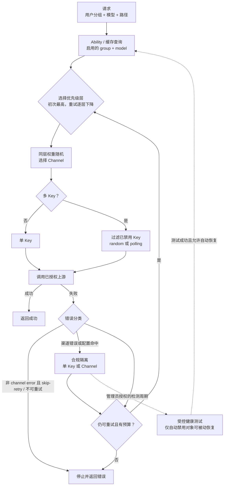

# New API Channel Pool Routing：把模型请求分解为能力、层级与故障隔离

一个模型名可能同时由多条上游渠道提供，但“都能调用”不等于“可以放进同一个随机池”。渠道所属分组、启用状态和模型能力先决定候选资格；优先级再划分故障转移层；只有同一层内，权重才参与选择。

New API 的可迁移价值不在于代理某一种协议，而在于把路由拆成两级资源池：先选渠道，再在渠道内部选凭据。渠道错误、单个 Key 错误与请求本身不可重试的错误因此可以落到不同隔离边界。

**证据范围**：本文以 2026-07-23 为来源截断日期，官方说明用于确认产品概念，机制判断固定到 `QuantumNous/new-api@1721144221ec5c94dd87891a7ae1bee228e7bb63`。本文不提供规避供应商风控的方法；禁用与恢复只指对已授权凭据的合规隔离、检测和重新纳入。

## 学习问题

1. `Ability` 为什么比“渠道支持哪些模型”的配置字段更适合作为请求时索引？
2. 优先级与权重分别控制哪一层决策，为什么不能用权重模拟故障转移？
3. 一次重试如何从当前优先级层转到下一层，它又不保证什么？
4. 多 Key 轮询怎样跳过失效凭据，何时会把整条渠道移出能力池？
5. 自动禁用和恢复如何保持合规隔离，而不是演变为绕过上游风控？

## 一页摘要

**已证实事实**：New API 将渠道可服务的 `(group, model)` 关系展开为 `Ability`。启用的 Ability 进入候选集；内存缓存按分组和模型维护渠道 ID，并跳过非启用渠道。请求路由先查精确模型名，未命中时才尝试规范化模型名。

候选渠道按优先级从高到低分层。初次请求使用最高层，后续可重试轮次使用更低层；同一目标层内再按权重随机选择。选定渠道后，系统才从该渠道的可用 Key 中随机选择或顺序轮询。

**个人分析**：这是一条“资格 → 层级 → 分流 → 凭据”的决策链。Agent 工具网关可以复用该分层，但必须把任务能力、租户授权、数据驻留和副作用等级都放入资格判断，不能只按工具名称建池。

下表回答各配置究竟改变哪一个路由问题：

| 机制 | 回答的问题 | 状态边界 | 不能证明 |
| --- | --- | --- | --- |
| Ability | 这条渠道能否服务该分组与模型？ | group、model、channel、enabled | 上游此刻健康 |
| priority | 先尝试哪一层？ | 同一候选集的离散层级 | 同层流量比例 |
| weight | 同一优先级内选谁？ | 当前进程所见渠道池 | 精确长期配额或延迟最优 |
| multi-key mode | 已选渠道内部用哪个 Key？ | 单渠道内的 Key 状态与游标 | 跨实例全局严格轮询 |
| retry | 失败后是否继续以及进入哪一层？ | 单次请求的有界循环 | exactly-once 或副作用安全 |
| disable/recovery | 哪个故障单元暂时退出或重返候选池？ | 单 Key 或整条渠道 | 供应商授权已经恢复 |

关键判断是：优先级表达故障转移顺序，权重表达同层分流倾向，两者不是可互换的旋钮。

## 事实边界

**已证实事实**：固定提交中的 `Ability` 主键由 group、model 和 channel ID 组成，同时保存 enabled、priority 与 weight。渠道创建或更新时会按其分组和模型组合生成 Ability；渠道整体状态变化时，相关 Ability 的 enabled 状态也会更新。

内存缓存路径与直接查库路径并不完全等价。固定提交的内存路径在同优先级内按渠道权重计算随机选择，并对全零或较小权重做平滑；直接查库路径对每条 Ability 的配置权重额外加 10 后随机。部署是否启用内存缓存会影响精确概率，因而本文只把权重解释为相对选择倾向。

官方渠道文档称多 Key 支持轮询和“加权随机”，而固定提交源码中的枚举与实现是 `polling` 和等概率 `random`，未读取每个 Key 的权重。版本化实现优先于无固定版本的界面说明；不能据文档名称推导该提交具有 Key 级加权算法。

**基于证据的推断**：重试轮次选择的是优先级序号，而非渠道黑名单。一次失败后进入下一优先级层，但当重试序号超过层数时会钳制到最低层；若配置允许更多轮次，最低层可能再次被选择。

**个人分析**：路由成功只说明找到了可调用凭据，不说明响应正确、成本合规或数据可出域。生产设计还需在 Ability 之前加入授权、地域、预算与请求类型约束。

  
证据：固定版本、官方概念与差异边界

  - **源码版本：** [`QuantumNous/new-api@1721144221ec5c94dd87891a7ae1bee228e7bb63`](https://github.com/QuantumNous/new-api/tree/1721144221ec5c94dd87891a7ae1bee228e7bb63)，提交时间 2026-07-21。
  - **官方说明：** [渠道管理](https://docs.newapi.pro/zh/docs/guide/feature-guide/admin/channel)说明优先级、权重、自动禁用与多 Key；[分组管理](https://docs.newapi.pro/zh/docs/guide/feature-guide/admin/group)说明分组隔离与 `auto` 分组。
  - **源码锚点：** [`model/ability.go`](https://github.com/QuantumNous/new-api/blob/1721144221ec5c94dd87891a7ae1bee228e7bb63/model/ability.go#L18-L25)、[`constant/multi_key_mode.go`](https://github.com/QuantumNous/new-api/blob/1721144221ec5c94dd87891a7ae1bee228e7bb63/constant/multi_key_mode.go#L3-L8)。
  - **时间边界：** 访问与来源截断日期为 2026-07-23。
  - **证明边界：** 在线文档支持产品概念；固定提交支持本文的精确控制流。二者不一致处不合并为虚构能力。

## 架构图

先看两个池如何串联。第一层池以 Ability 建立渠道资格，并在优先级层内做权重选择；第二层池只处理已选渠道内部的 Key，单 Key 隔离不会立刻淘汰仍有健康 Key 的渠道。

一次任务流的关键分叉发生在错误分类之后。隔离负责改变未来候选资格，重试负责决定当前请求是否再走一轮；两者可以同时发生，但含义不同。

## 控制权与任务流

**说明性场景**：请求携带分组 `team-a` 与模型 `model-x`。Ability 查询得到三条已启用渠道：A、B 的优先级相同且权重不同，C 位于下一优先级。A 是多 Key 渠道，内部有 K1、K2、K3，其中 K2 已被自动隔离。

首轮路由只在 A、B 所在的最高优先级层按权重随机，假设选中 A。A 的轮询游标从 K2 开始时会跳过它并选择下一个已启用 Key K3，同时把游标推进到后续位置。这里的“轮询”只描述选择顺序，不承诺并发请求或多实例部署下的全局严格交替。

若 K3 返回被配置为渠道故障的错误，错误处理可把 K3 标为自动禁用。因为 K1 仍启用，A 可以保持渠道级启用；如果最后一个可用 Key 也被禁用，A 才转为自动禁用，相关 Ability 退出后续候选集。

当前请求是否继续由重试策略单独判定。若错误允许重试且外层循环仍有次数，下一轮按较低优先级索引选择 C，而不是回到 A、B 同层“换一条再试”。只有错误尚未被分类为 channel error 时，skip-retry 或绑定指定渠道才会在 `shouldRetry` 的相应分支停止重试；channel error 更早返回 true，但仍受外层重试循环约束，渠道亲和失败的专用停止条件则先于它生效。

该场景只组合固定提交支持的机制，不是事故记录，也不声称每次失败都会命中某个渠道。它揭示的设计判断是：同层负载分配、跨层故障转移和渠道内凭据隔离必须分别建模。

恢复不发生在请求重试路径中。自动测试可在启用自动恢复时检测 `auto-disabled` 对象；测试无错误后才调用启用逻辑。手工禁用的渠道被自动测试跳过，避免后台任务推翻管理员明确隔离。

## 关键源码导读

最短阅读路径从 Ability 的物化开始，再进入渠道池选择，随后查看多 Key 取值，最后沿 relay 错误分支抵达禁用和测试恢复。这样可以区分“谁有资格”“这轮选谁”和“失败后改变什么状态”。

**已证实事实**：`InitChannelCache` 只把状态为 enabled 的渠道放入 group/model 索引，并按优先级排序。`GetRandomSatisfiedChannel` 先尝试精确模型名，再尝试规范化模型名；它收集离散优先级，以 retry 作为层级索引，并只在目标层计算权重随机。

`GetNextEnabledKey` 在渠道锁内读取 Key 状态。random 从启用索引中等概率抽取；polling 从保存的游标向后环形扫描，选中后推进游标。没有可用 Key 时返回显式渠道错误，不会回退到已经禁用的第一个 Key。

relay 在每轮重新选渠道并重新设置请求体，成功立即返回。失败后先记录和处理渠道错误，再由 `shouldRetry` 按固定顺序判断：渠道亲和失败的停止条件优先；channel error 随后直接允许继续；仅其余错误再检查 skip-retry、剩余次数、指定渠道和状态码规则。

  
证据：Ability、渠道选择与请求重试源码接缝

  - [`model/ability.go` 18–25](https://github.com/QuantumNous/new-api/blob/1721144221ec5c94dd87891a7ae1bee228e7bb63/model/ability.go#L18-L25)：Ability 的复合键、启用、优先级与权重。
  - [`model/ability.go` 196–234](https://github.com/QuantumNous/new-api/blob/1721144221ec5c94dd87891a7ae1bee228e7bb63/model/ability.go#L196-L234)：从渠道的 group/model 组合生成 Ability。
  - [`model/channel_cache.go` 26–103](https://github.com/QuantumNous/new-api/blob/1721144221ec5c94dd87891a7ae1bee228e7bb63/model/channel_cache.go#L26-L103)：启用渠道的缓存索引、优先级排序与轮询游标保留。
  - [`model/channel_cache.go` 114–208](https://github.com/QuantumNous/new-api/blob/1721144221ec5c94dd87891a7ae1bee228e7bb63/model/channel_cache.go#L114-L208)：模型查找、优先级层与内存路径的权重随机。
  - [`model/ability.go` 63–147](https://github.com/QuantumNous/new-api/blob/1721144221ec5c94dd87891a7ae1bee228e7bb63/model/ability.go#L63-L147)：直接查库路径的优先级与权重选择。
  - [`controller/relay.go` 181–247](https://github.com/QuantumNous/new-api/blob/1721144221ec5c94dd87891a7ae1bee228e7bb63/controller/relay.go#L181-L247)：有界 relay 循环与每轮错误处理。
  - [`controller/relay.go` 293–355](https://github.com/QuantumNous/new-api/blob/1721144221ec5c94dd87891a7ae1bee228e7bb63/controller/relay.go#L293-L355)：选定渠道、设置上下文与重试判定。
  - **证明边界：** 这些接缝证明该提交的选择顺序，不证明随机分布在任意时间窗口内精确达到配置比例。

多 Key 的隔离必须继续读状态写入路径。否则容易误以为任一 Key 失败都会禁用整条渠道，或者误以为渠道自动恢复等同于供应商重新授权。

  
证据：多 Key 隔离、渠道禁用与受控恢复

  - [`model/channel.go` 199–282](https://github.com/QuantumNous/new-api/blob/1721144221ec5c94dd87891a7ae1bee228e7bb63/model/channel.go#L199-L282)：过滤启用 Key、random、polling 与无可用 Key 错误。
  - [`model/channel.go` 647–709](https://github.com/QuantumNous/new-api/blob/1721144221ec5c94dd87891a7ae1bee228e7bb63/model/channel.go#L647-L709)：单 Key 状态、禁用原因与全部 Key 失效后的渠道级禁用。
  - [`model/channel.go` 712–785](https://github.com/QuantumNous/new-api/blob/1721144221ec5c94dd87891a7ae1bee228e7bb63/model/channel.go#L712-L785)：缓存与数据库状态更新以及 Ability 联动。
  - [`service/channel.go` 19–77](https://github.com/QuantumNous/new-api/blob/1721144221ec5c94dd87891a7ae1bee228e7bb63/service/channel.go#L19-L77)：自动禁用、通知与自动启用条件。
  - [`controller/channel-test.go` 903–986](https://github.com/QuantumNous/new-api/blob/1721144221ec5c94dd87891a7ae1bee228e7bb63/controller/channel-test.go#L903-L986)：测试结果触发隔离或恢复。
  - [`controller/channel-test.go` 1018–1029](https://github.com/QuantumNous/new-api/blob/1721144221ec5c94dd87891a7ae1bee228e7bb63/controller/channel-test.go#L1018-L1029)：手工禁用跳过与被动恢复只选自动禁用对象。
  - **合规边界：** 重新启用仅表示平台健康测试通过且本地状态允许恢复；不授权轮换身份、掩盖来源或绕过供应商封禁。

## 架构决策与权衡

第一个决策是物化 Ability，而不是每次解析渠道配置。它把 group/model 资格变成直接索引，也让渠道状态变化能统一移出候选池；代价是渠道与 Ability 之间存在一致性维护和缓存刷新责任。

第二个决策是优先级先于权重。这样可以把稳定主通道与昂贵备用通道分层，同时让同层渠道分担流量；代价是低优先级容量在高层健康时可能长期闲置，且重试降层会改变价格、延迟或供应商语义。

第三个决策是渠道和 Key 两级隔离。单个凭据故障时仍可使用同渠道的其他已授权凭据，减少故障域；代价是需要维护 Key 索引、状态、原因、时间和轮询游标，并避免在日志和管理 API 中泄露密钥。

第四个决策是把禁用和重试解耦。禁用改变未来流量，重试决定当前请求；这种分离能阻止病态凭据继续进入池，却要求错误分类足够保守。把请求格式错误误判为渠道错误会造成健康容量被隔离，把授权错误误判为瞬时错误则会放大失败。

下表给出这些机制适用的前置条件：

| 决策 | 适用条件 | 主要收益 | 必须接受的代价 |
| --- | --- | --- | --- |
| Ability 物化 | 能力可由稳定维度描述 | 快速资格查询、统一启停 | 派生索引一致性 |
| 优先级分层 | 备用层确有成本或可靠性差异 | 明确故障转移顺序 | 备用容量利用率较低 |
| 同层权重 | 候选功能等价但容量不同 | 粗粒度分流 | 随机波动与实现差异 |
| 多 Key 池 | 多个凭据属于同一合规主体与用途 | 缩小凭据故障域 | 状态、审计和密钥治理复杂度 |
| 自动恢复 | 存在受控、低副作用的健康探针 | 缩短人工恢复时间 | 探针可能误判，必须保留人工覆盖 |

不能把权重当并发限制。随机选择不会感知实时排队、剩余额度或尾延迟；这些约束需要独立的令牌桶、并发闸门、配额观察和熔断状态。

## 生产化分析

生产环境首先要验证资格索引的一致性。渠道更新 group、model、priority、weight 或状态后，数据库 Ability 与内存索引应在可接受窗口内一致；监控需要区分“无 Ability”“Ability 已禁用”“缓存尚未刷新”和“选中后上游失败”。

路由观测至少记录请求的 group、原始模型、规范化模型是否命中、目标优先级、渠道 ID、retry index 与结果分类。多 Key 只记录不可逆的 Key 指纹或索引，不能记录完整凭据；禁用原因也应经过敏感信息裁剪。

权重校验应做分布测试而非单次断言。验证目标是同层候选都能被选中、零权重组合不会崩溃、不同缓存模式的差异已被接受；不要把短窗口随机偏差当故障，也不要承诺固定请求比例。

重试预算必须同时约束次数、deadline、请求体可重放性与副作用。聊天补全等读取式调用通常能重新发送，但已开始的流、异步任务创建或带外工具调用可能已产生结果；结果不确定时应标记 `Unknown` 并对账，而不是盲目换渠道。

自动禁用需要单独统计 channel-error、skip-retry、状态码规则和关键字规则命中。关键字匹配容易受上游文案变化影响，适合触发隔离与人工检查，不适合推导永久性账号结论。

恢复路径必须是合规控制面。只对平台自动禁用、仍属于当前主体且用途未变的凭据做受控健康测试；供应商明确撤销授权、账号停用、合规审查或人工禁用时，保持隔离并由管理员处理。禁止通过替换身份、轮换来源、隐藏流量或反复试探来规避上游风控。

**基于证据的推断**：固定提交用进程内 mutex 保护单渠道轮询游标和状态 map；该锁不跨实例。多实例共享数据库时，轮询更接近“每实例观察下的尽力顺序”，不能作为全局公平、配额精算或严格一次轮换的基础。

建议的故障注入包括：最高优先级返回可重试错误、同层渠道权重全零、单 Key 自动禁用、全部 Key 禁用、手工禁用对象进入测试周期、响应成功但本地测试失败。每项都应分别断言当前请求终态、未来候选集与审计记录。

## 可迁移经验

### 可直接复用的机制

1. 用显式 Ability 索引连接租户或分组、能力名、执行通道与启用状态。
2. 先按合规资格过滤，再用优先级表达故障转移层，只在同层做权重分流。
3. 把通道资源池与通道内部凭据池分开，故障状态落在最小可证明的单元。
4. 将隔离、当前请求重试和健康恢复设计成三条独立状态转换。
5. 为手工禁用保留高于自动恢复的控制权，并记录原因、时间和操作者。
6. 在每次重试前重新选择和重新验证资格，同时携带统一预算与 deadline。

### 只能有限类比的部分

1. 模型名是较稳定的能力键；Agent 工具还需参数 schema、权限、数据域与副作用等级。
2. 渠道权重适合粗粒度分流，不等价于容量感知调度、最小延迟或配额保证。
3. Key 轮询适合同一合规主体下的合法凭据，不适用于跨账号规避限制。
4. HTTP 状态与关键字能辅助错误分类，但 Agent 工具还需要结构化结果、幂等键和补偿协议。
5. 自动健康测试能检测连通性，不证明内容质量、政策许可或下游业务正确。

### 不应照搬的部分

1. 不要把优先级数字解释为成功概率，也不要用极大权重绕开资格过滤。
2. 不要假设重试必然换到不同渠道；应显式建模已尝试集合或接受实现语义。
3. 不要把随机选择当严格配额，不要把进程内轮询当跨实例全局顺序。
4. 不要对不可重放、已产生副作用或结果未知的调用自动换渠道重试。
5. 不要让自动恢复覆盖手工隔离、供应商撤权或合规冻结。
6. 不要用多 Key、代理或来源切换规避上游封禁、速率限制、身份校验或使用政策。

## 来源

**官方产品说明（已证实事实）**

- [渠道管理](https://docs.newapi.pro/zh/docs/guide/feature-guide/admin/channel)：渠道优先级、同层权重、自动禁用、多 Key 与管理操作。访问与截断日期：2026-07-23。
- [分组管理](https://docs.newapi.pro/zh/docs/guide/feature-guide/admin/group)：用户、令牌和渠道分组隔离，以及 `auto` 分组概念。访问与截断日期：2026-07-23。

**固定上游源码（已证实事实）**

- [`QuantumNous/new-api@1721144221ec5c94dd87891a7ae1bee228e7bb63`](https://github.com/QuantumNous/new-api/tree/1721144221ec5c94dd87891a7ae1bee228e7bb63)：2026-07-23 解析的固定提交；提交时间 2026-07-21。
- [`model/ability.go`](https://github.com/QuantumNous/new-api/blob/1721144221ec5c94dd87891a7ae1bee228e7bb63/model/ability.go) 与 [`model/channel_cache.go`](https://github.com/QuantumNous/new-api/blob/1721144221ec5c94dd87891a7ae1bee228e7bb63/model/channel_cache.go)：Ability 物化、缓存索引、优先级层与权重选择。
- [`service/channel_select.go`](https://github.com/QuantumNous/new-api/blob/1721144221ec5c94dd87891a7ae1bee228e7bb63/service/channel_select.go) 与 [`controller/relay.go`](https://github.com/QuantumNous/new-api/blob/1721144221ec5c94dd87891a7ae1bee228e7bb63/controller/relay.go)：分组选择、请求循环、错误处理与重试判定。
- [`model/channel.go`](https://github.com/QuantumNous/new-api/blob/1721144221ec5c94dd87891a7ae1bee228e7bb63/model/channel.go) 与 [`service/channel.go`](https://github.com/QuantumNous/new-api/blob/1721144221ec5c94dd87891a7ae1bee228e7bb63/service/channel.go)：多 Key 选择、状态隔离、自动禁用与启用条件。
- [`controller/channel-test.go`](https://github.com/QuantumNous/new-api/blob/1721144221ec5c94dd87891a7ae1bee228e7bb63/controller/channel-test.go)：自动测试、手工禁用边界与被动恢复路径。

**证据边界说明**：`已证实事实` 可由官方说明或固定提交定位；`基于证据的推断` 从实现控制流推导部署含义；`个人分析` 是迁移判断。本文没有虚构客户、事故、指标或供应商保证，也不把平台测试成功解释为供应商授权恢复。
