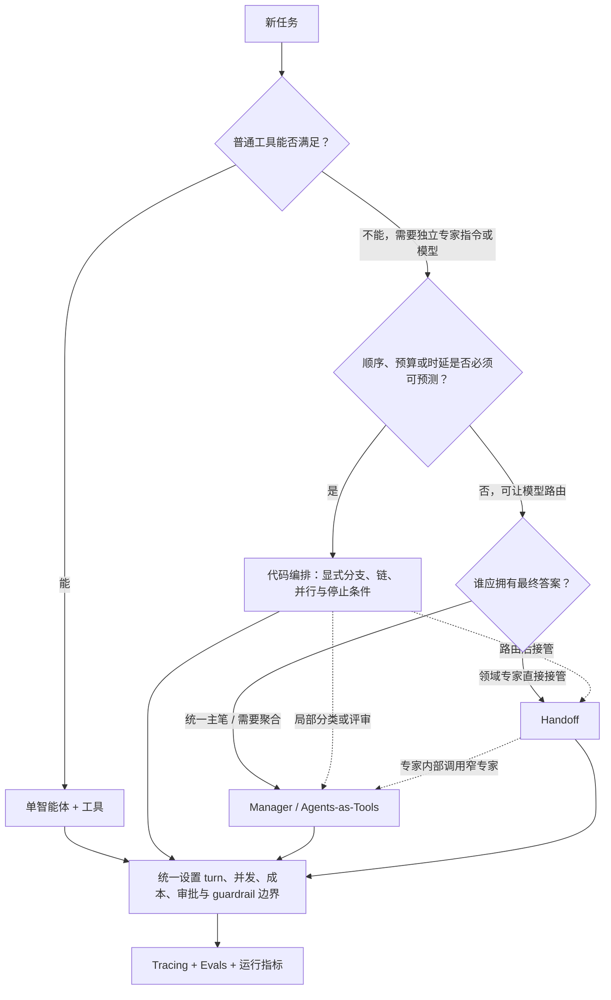

# OpenAI Agents SDK：小型多智能体系统的控制权模型

OpenAI Agents SDK 没有把“多智能体”固化成一种拓扑。官方编排指南把选择压缩成一个更有用的问题：每一步由模型决定，还是由应用代码决定？本案例据此比较 Manager / Agents-as-Tools、Handoff 与 code-driven orchestration，并追踪会话状态、控制状态、最终答案所有权和生产边界。

## 学习问题

1. Manager 调用 specialist 与 Handoff 到 specialist，在用户可见行为上有什么根本差异？
2. 会话历史、当前活动智能体和最终答案分别由谁拥有，怎样跨调用移动？
3. 哪些决策适合交给模型，哪些应保留在确定性代码、guardrail 或人工审批边界？
4. 如何限制 agent loop、评审循环和并行扇出，避免成本、时延与失败范围失控？
5. 什么时候组合多种模式，什么时候一个智能体加工具反而是更好的架构？

## 一页摘要

**已证实事实**：官方 Python SDK 编排指南并列两类控制方式：由 LLM 规划、选择工具或 handoff，以及由代码确定流程。LLM 编排中最常见的两种模式是 Agents-as-Tools 与 Handoff。前者让 manager 把 specialist 当作工具调用，manager 保持父运行中的活动-agent / 对话控制并合成最终答案；后者让分流智能体把这份控制交给 specialist，specialist 成为该次运行后续阶段的活动智能体并直接产出最终答案。官方明确允许混合这些模式。两者都不自动决定跨轮历史存在哪里；持久化仍由本次运行采用的应用历史、session 或服务端 conversation 策略负责。

**基于证据的推断**：这三种模式不是按“智能程度”递增，而是三种控制权配置。Agents-as-Tools 集中答案所有权，Handoff 转移答案所有权，代码编排则把顺序、分支、并发、停止条件和预算的所有权上移到应用层。选择标准应是哪里需要适应性，哪里需要可证明的边界。

**个人分析**：小型多智能体系统的默认起点应是单智能体加普通工具。只有当专家需要独立指令、模型、输出类型或迭代空间时，才把专家建模为 agent；只有当专家确实应接管用户关系时，才使用 Handoff；只有当开放式路由的收益高于额外模型调用、延迟方差和误路由风险时，才让 LLM 持有更多控制权。

| 模式 | 谁选择下一步 | 谁持有活动-agent / 对话控制 | 谁产出最终答案 | 跨轮历史由谁持久化 | 主要优势 | 主要代价 |
| --- | --- | --- | --- | --- | --- | --- |
| Manager / Agents-as-Tools | manager LLM | 父运行中的 manager | manager | 应用选择的历史/session/conversation 策略；嵌套运行默认不继承 | 可聚合多个专家、统一口径和 guardrail | manager 多一次合成调用，嵌套运行增加成本 |
| Handoff | 当前 agent 的 LLM 选择目的地 | receiving agent 成为 `current_agent` | 最后活动的 specialist | 仍由运行与应用所选策略负责，可共享或过滤历史 | 专家提示更聚焦，减少 manager 转述 | 路由错误更直接，历史与 guardrail 边界更复杂 |
| code-driven orchestration | 应用代码；局部可用 LLM 分类 | 应用显式指定 | 应用指定的最后一步或聚合器 | 应用显式选择 | 显式边界可提高顺序、预算与停止条件的可预测性 | 工作流较僵硬；额外调用和并行仍可能增加成本 |

一句话决策：**需要一个统一主笔就用 Agents-as-Tools；需要专家直接接管就用 Handoff；需要显式且可测量的路径与预算边界就让代码编排；没有明确的专业边界就先用单智能体加工具。**

## 事实边界

### 已证实事实

- `Agent` 由 instructions、tools、handoffs 等能力组成；handoff 在模型侧表现为一个转移工具，但 SDK 在执行后会更新当前 agent，而不是像普通工具一样只返回结果。
- `Runner` 的循环会调用当前 agent：若得到最终输出则结束；若发生 handoff 则更新当前 agent 和输入后继续；若产生工具调用则执行工具、追加结果再继续。超过 `max_turns` 会抛出 `MaxTurnsExceeded`；显式传 `None` 才会取消该限制。
- `Agent.as_tool()` 启动一个嵌套 agent run，并把嵌套运行的结果返回给父级 manager。父运行的会话状态不会自动传给嵌套运行；若需要共享客户端管理历史，必须显式传入同一个 session，并且每次运行应选择一种状态策略。
- Handoff 默认让 receiving agent 看到先前完整会话历史；`input_filter` 可以直接改变转交内容。`handoff_history_mapper` 只有在运行或单个 handoff 启用 `nest_handoff_history` 时，才接收规范化历史并替换内置的嵌套历史摘要。官方文档把该嵌套历史行为标为 opt-in beta，并默认关闭。
- SDK 提供四类跨轮状态策略：应用维护的 `result.to_input_list()`、SDK 配合存储的 `session`、OpenAI Conversations API 的 `conversation_id`、Responses API 的 `previous_response_id`。官方建议一次对话选择一种策略，避免重复上下文。
- 官方代码编排示例包括结构化分类与分支、串行链、带 evaluator 的循环，以及用 `asyncio.gather` 并行运行互不依赖的任务。编排指南明确指出代码方式在速度、成本和性能方面更确定、更可预测。
- tracing 默认覆盖 Runner、agent、模型生成、函数工具、guardrail 和 handoff 等事件；`workflow_name`、`trace_id`、`group_id` 与 metadata 可用于关联。模型和函数输入输出可能包含敏感数据，可通过运行配置关闭采集。
- agent 级 input guardrail 只作用于链上的第一个 agent，output guardrail 只作用于最终产出 agent。tool guardrail 只覆盖由 `function_tool` 创建的函数工具，不覆盖 handoff 调用、hosted/built-in tools，也不直接包住 `Agent.as_tool()` 这个 wrapper；这些边界需要各自的校验、策略或审批。需要审批的工具调用可暂停运行，以 `RunState` 持久化、批准或拒绝后再恢复；这一中断面覆盖 handoff 后和嵌套 Agents-as-Tools 内的工具调用。

### 基于证据的推断

- “manager 保持父运行的对话控制”不等于 manager 拥有历史持久化，也不等于 specialist 没有运行状态。嵌套 agent 可以有自己的 session、turn limit 和 trace；区别是其产出回到 manager 的工具结果通道，用户看到的最终叙述仍由 manager 决定。历史保存在哪里由运行与应用选择的状态策略决定。
- Handoff 改变的是运行内的控制指针，不必意味着把请求发送到另一台服务。它可以发生在同一进程的同一 `Runner` 运行中；部署边界是应用架构的另一个选择。
- `max_turns` 只限制一次 Runner 调用中的模型回合，不自动限制应用层 `while` 循环、并行 fan-out、重试次数或多个嵌套 agent 的总 token。生产预算必须同时覆盖这些层级。
- 内置 tracing 提供事件证据，但“可观测”不等于“质量已验证”。要把 trace 与任务级 eval、路由准确率、完成率、成本和人工升级数据关联，才能形成闭环。

### 个人分析与未知项

- SDK 不替应用决定 SLO、模型与 token 预算、重试策略、幂等性、租户隔离、数据保留或人工审批政策。示例证明模式可行，不代表其默认值适合生产。
- 官方并未声称多智能体总是优于单智能体。将一个普通函数包装成 agent 会新增模型调用和不可确定性；若工作只是数据查询、校验或副作用执行，普通工具通常边界更清楚。
- 本文访问日期与来源截断日期均为 **2026-07-20**；官方仓库 `main` 在核对时固定为提交 `2fa463571e76dae8ff267622f1018eaf06ffeb9f`。后续 API 与默认行为变化不在本文事实范围内。

## 架构图

下图不是 SDK 强制拓扑，而是一张“控制权放在哪里”的决策流。虚线框代表可组合关系：一次产品请求可以先由代码做硬分支，再 handoff 给领域 agent，而该 agent 又把窄任务交给 Agents-as-Tools specialist。

对应的文字版决策如下：

1. 先问普通工具是否足够；若工具只需执行确定性函数或 API，不创建第二个 agent。
2. 若专家确实需要独立 instructions、模型或输出契约，再看流程是否有严格的成本、时延、顺序或合规边界；有则把主流程写在代码里。
3. 若允许 LLM 路由，再问最终答案由谁负责：需要统一主笔、对比或聚合多个专家，使用 Agents-as-Tools；需要领域专家直接接管后续对话，使用 Handoff。
4. 模式可以组合，但每层都要有自己的回合、并发、成本、审批和失败边界，并由同一条 trace 与 eval 体系串起来。

## 控制权与任务流

### Manager / Agents-as-Tools

**已证实事实**：manager 的 `tools` 列表包含由 `specialist.as_tool()` 生成的工具。manager LLM 决定调用哪个 specialist；嵌套 Runner 完成后，结果作为工具输出返回父运行；manager 随后继续推理并生成 `final_output`。多个翻译 specialist 的官方示例展示了 manager 可调用多个工具后统一回答。

控制与状态路径可写成：

`用户输入 → manager 会话 → specialist 工具调用参数 → 独立嵌套运行 → specialist 结果 → manager 会话 → manager 最终答案`

specialist 通常对用户保持隐藏：它不是后续对话的 `current_agent`，只是内部能力。应用仍可通过 nested streaming 和 trace 展示其进度，但那是界面选择，不是控制权转移。若 specialist 需要父对话历史，必须显式构建输入或共享合适的 session；默认不能假设它继承父状态。

### Handoff

**已证实事实**：handoff 发生时，Runner 更新当前 agent 与输入并继续循环。receiving agent 默认看到之前的会话历史；官方路由示例在下一轮把 `result.current_agent` 作为起始 agent，因此接管可延续到后续用户轮次。最后活动 agent 的最终输出成为本次运行结果。

控制与状态路径可写成：

`用户输入 → triage agent → handoff 调用与可选元数据 → 更新 current_agent / 过滤或保留历史 → specialist 直接回答 → 后续轮次继续从该 specialist 开始`

specialist 从内部候选变成活动 agent。`input_type` 只为 handoff 调用增加模型生成的结构化元数据，不会替换 receiving agent 的主输入，也不会动态选择不同目的地。历史裁剪应在 `input_filter` 或运行配置中完成，不能把“提供 handoff reason”误当作上下文隔离。

### Code-driven orchestration

**已证实事实**：官方示例用普通 Python 控制流把多个 `Runner.run()` 串起来：结构化 evaluator 输出决定是否继续，`while` 控制改进循环，`asyncio.gather` 并发运行独立候选，再把候选交给 picker。最终答案属于代码明确选定的最后一步或聚合器，而不是由一个隐含的活动 agent 自动决定。

**个人分析**：代码外壳尤其适合分类集合稳定、步骤依赖明确、合规顺序不可变的工作流。模型可以负责“理解输入”和“生成内容”，代码负责“哪些步骤允许发生、最多发生几次、可以并发多少、失败后走哪条路径”。只有当这些显式上限真正替代了自适应或无界路径时，代码编排才可能降低平均成本、收窄 P95/P99 时延与成本方差；额外模型调用、候选生成或并行 fan-out 也可能反向增加成本和尾延迟。因此必须用任务级成本与延迟分布实测，而不能从“流程写在代码里”直接推导性能收益。

### 组合模式

一个稳健的组合可以是：代码先执行身份校验与确定性路由；领域 agent 通过 Handoff 接管用户；领域 agent 再把检索、翻译或审阅作为 Agents-as-Tools 的窄任务；不可逆工具在执行前触发审批。这里的关键不是“用了三种模式”，而是每次控制权转移都有明确所有者、输入契约、预算与失败返回点。

## 关键源码导读

不要从所有示例平铺阅读。建议按“概念 → 运行循环 → 控制转移 → 状态与保障 → 模式示例”的顺序：

1. `docs/multi_agent.md`：先建立 LLM 编排与代码编排、Agents-as-Tools 与 Handoff 的官方分类。这是本案例的决策入口。
2. `docs/running_agents.md` 与 `src/agents/run.py`：理解 `Runner` 的 agent loop、`final_output`、handoff 更新、工具执行、`max_turns`、运行配置和状态策略。控制权最终落实在这里。
3. `docs/tools.md` 与 `src/agents/agent.py` 的 `Agent.as_tool()`：关注嵌套运行如何创建、状态为什么不自动继承、`max_turns`、structured input、输出提取、streaming 与 approval 选项。无需逐行阅读所有工具类型。
4. `docs/handoffs.md` 与 `src/agents/handoffs/__init__.py`：阅读 `Handoff`、`HandoffInputData`、`input_type`、`input_filter`、动态启用和历史嵌套。重点分清“handoff 调用参数”和“receiving agent 的会话输入”。
5. `docs/running_agents.md` 的 state 部分与 `src/agents/run_state.py`：比较 `to_input_list()`、session、`conversation_id`、`previous_response_id`，再看暂停运行如何持久化和恢复。
6. `docs/guardrails.md`、`docs/human_in_the_loop.md`、`docs/tracing.md`：核对 guardrail 实际覆盖边界、run-wide approval interruption、敏感 trace 数据和自定义 trace processor。
7. `examples/agent_patterns/agents_as_tools.py` 与 `routing.py`：用最小示例对照“结果返回 manager”和“specialist 接管”两条路径。
8. `examples/agent_patterns/deterministic.py`、`parallelization.py` 与 `llm_as_a_judge.py`：观察显式链、并行 fan-out 和 evaluator loop。特别检查示例中的退出条件，而不是复制一个无界 `while True`。
9. `examples/agent_patterns/human_in_the_loop.py` 与 `agents_as_tools_conditional.py`：最后阅读动态能力暴露、agent-tool 审批和外层 RunState 恢复，理解安全边界怎样跨嵌套运行传播。

**个人分析**：源码阅读时应画出三个不同对象：`current_agent` 是控制指针，conversation/session 是历史持久化策略，`RunState` 是可暂停与恢复的执行快照。把三者都叫“状态”会导致错误设计，例如误以为 handoff 自动永久改写 session，或误以为共享 session 就等于共享最小必要上下文。

## 架构决策与权衡

### 最终答案所有权

Agents-as-Tools 适合“一个总编辑、多个研究员”：manager 可以比较、纠错、统一风格和隐藏内部组织变化。代价是 specialist 已经生成内容后，manager 还要重新读取并合成，增加 token、延迟与信息损失。

Handoff 适合“前台分诊、专家坐席”：specialist 不必让 manager 转述，提示上下文更专一，也更容易维持领域身份。代价是用户体验、输出 guardrail 和错误恢复都跟随最后活动 agent；错误路由会直接把对话交给不合适的专家。

### 模型自治还是代码控制

模型路由适合开放式任务和难以穷举的意图，能在少量代码下获得适应性；但每个决策都受提示、模型版本和上下文影响。代码路由适合有限枚举、严格顺序、固定审批和可计算预算；代价是新分支必须实现、测试和部署。

**基于证据的推断**：常见最佳点是“确定性骨架 + 局部模型判断”。例如模型输出结构化分类，代码验证枚举后选择 agent；模型生成三个候选，代码限制并行数并交给一次 evaluator；模型建议执行写操作，代码检查策略并触发人工审批。

### 状态共享还是上下文隔离

完整历史有利于连贯，但会增加 token、敏感数据暴露和提示污染。Agents-as-Tools 默认不继承父运行状态，天然鼓励窄输入；Handoff 默认携带完整历史，更适合连续对话，但生产中应根据领域最小化。一次运行只选一种跨轮持久化策略，避免客户端历史与服务端 continuation 重复。

### 串行、并行与循环

- 串行链最容易表达依赖与审计，但各步骤时延相加。
- 并行适合真正独立的子任务或多候选择优；必须设置 fan-out、并发、总截止时间和部分失败策略。
- evaluator loop 可提高质量；必须设置最大轮数、最低改进幅度、总 token/费用预算和降级输出。SDK 的 `max_turns` 不能替代应用循环上限。
- provider 的 parallel tool calls 与 `max_function_tool_concurrency` 是不同控制面：前者影响模型一次响应能否发出多个调用；后者只限制**同一个模型回合发出的、本地执行的函数工具调用**。它不限制应用层 `asyncio.gather`、多个并行 `Runner.run()` 或跨运行 fan-out；这些必须由应用自己的 semaphore / task limit、总 deadline 和取消策略约束。

### Guardrail 与审批边界

agent 输入/输出 guardrail 只覆盖链首与链尾，不能假设每个 handoff agent 都自动执行两端检查。由 `function_tool` 创建的函数工具可使用 tool guardrail 做参数与结果校验；这套 pipeline 不覆盖 handoff 调用、hosted/built-in tools 或 `Agent.as_tool()` wrapper 本身，必须按各自接口补策略或审批。不可逆、付费、外发或高权限工具应在最接近副作用的位置要求审批。`Agent.as_tool()` 本身可要求审批，内部工具还可再次中断；这两层分别控制“是否委派”和“是否行动”。

## 生产化分析

### 可观测性与评估

**已证实事实**：SDK 默认 trace 可记录 agent、generation、function、guardrail 和 handoff span，并能用 `group_id` 关联同一对话的多个 trace。生产命名至少应稳定区分 workflow、路由版本和租户/环境；敏感输入输出不应因默认采集而未经审查进入 trace。

建议把以下指标与 trace 关联：

| 维度 | 指标 | 用途 |
| --- | --- | --- |
| 路由 | handoff / tool-agent 选择准确率、回退率、错误专家率 | 判断是否值得让 LLM 路由 |
| 质量 | 任务完成率、结构化校验通过率、人工纠正率、eval 分数 | 比较模式与提示版本 |
| 成本 | 每任务模型调用数、token、工具费用、嵌套运行占比 | 识别 manager 重复合成与循环膨胀 |
| 时延 | 端到端及各 span P50/P95/P99、队列与审批等待 | 区分模型、工具、并行和人工瓶颈 |
| 安全 | guardrail tripwire、审批拒绝、越权工具尝试、敏感 trace 关闭率 | 验证策略是否真正执行 |

Evals 应包含单步能力测试、路由数据集和端到端任务。仅评最终文本会掩盖“走错专家但碰巧答对”、不必要工具调用和成本退化；仅看 trace 则无法判断回答是否有用。发布门禁应同时比较质量、安全、成本和时延基线。

### 失败模式与遏制

| 失败模式 | 典型表现 | 遏制方式 |
| --- | --- | --- |
| manager 忘记调用或过度调用专家 | 凭空回答、重复嵌套运行 | 明确工具说明、结构化任务、调用计数与 eval；必要时改代码路由 |
| handoff 错路由或来回转移 | 专家不匹配、上下文膨胀、turn 耗尽 | 动态启用候选、记录 reason、限制 handoff 次数、提供安全回退 agent |
| 父子运行状态误配 | 专家缺上下文或重复上下文 | 显式输入契约；每次运行选择一种状态策略；测试多轮恢复 |
| 无界 evaluator loop | 成本与时延失控 | 最大轮数、总预算、截止时间、无改进退出与可接受降级 |
| 并行扇出过大 | 限流、下游拥塞、费用尖峰 | 应用 semaphore/task limit、总 deadline、取消策略与隔离舱；SDK 本地函数工具上限只处理单回合局部并发 |
| guardrail 覆盖误判 | 中间 agent 或 hosted tool 未被检查 | 按官方覆盖边界布置函数工具 guardrail、策略网关与审批 |
| 审批恢复失败 | 重复副作用、旧定义无法反序列化 | 持久化 call ID 与幂等键；保存 agent/SDK 版本；执行前再校验 |
| trace 泄露敏感数据 | 提示、工具参数或结果进入遥测 | 关闭敏感采集、脱敏、自定义 processor、分级保留与访问控制 |

### 适用范围

适合多智能体的信号：领域提示明显冲突；专家使用不同模型或输出类型；需要独立评估和演进；一个主笔必须聚合多个并行研究；或用户确实需要从分诊切换到持续服务的领域坐席。

更适合单智能体加工具的信号：只有一个用户角色与答案口径；“专家”只是查数据库或调用 API；任务路径短；延迟/成本预算紧；团队尚无稳定 eval；或增加 agent 只是在重命名函数。单 agent 仍可使用结构化输出、guardrail、审批、session 和 tracing，不需要为了这些能力引入第二个 agent。

上线前必须回答：最大模型回合、应用循环和 handoff 次数分别是多少？并行 fan-out 与工具并发是多少？谁能看到完整历史？哪些副作用需要人工批准？哪种状态策略是唯一事实源？超时后返回部分结果、回退单 agent 还是转人工？这些答案应落入代码与监控，而不只写在 prompt 中。

## 可迁移经验

1. **把最终答案所有权作为首要架构决策。** 统一主笔用 Agents-as-Tools；专家直接接管用 Handoff；不要仅因 API 写法方便而选择。
2. **把控制指针、会话历史和执行快照分开设计。** `current_agent`、session/conversation 与 `RunState` 解决不同问题。
3. **用确定性代码包住不可协商的边界。** 身份、许可、预算、最大循环、并发、结构校验和副作用顺序不应只靠提示词。
4. **给每一层循环单独设限。** Runner turns、嵌套 agent turns、应用 evaluator rounds、重试和 fan-out 要汇总成一个任务级预算。
5. **最小化跨 agent 上下文。** Agents-as-Tools 用窄结构化输入；Handoff 用 filter 或 history mapper 传最小必要信息。
6. **在副作用处做 guardrail 与审批。** 链首/链尾检查不能替代逐工具授权；委派审批与行动审批是不同边界。
7. **用 trace 解释行为，用 eval 判断质量。** 同时记录路由、成本、时延、安全事件和最终任务结果，才能比较模式。
8. **把多智能体当成本中心而不是成熟度标签。** 若第二个 agent 没有独立推理职责，就删掉它，保留普通工具。

## 来源

以下均为 OpenAI 官方文档或官方上游仓库。访问日期与来源截断日期：**2026-07-20**；仓库链接尽量固定到提交 **`2fa463571e76dae8ff267622f1018eaf06ffeb9f`**。

- [Agent orchestration 官方指南](https://openai.github.io/openai-agents-python/multi_agent/) 与 [固定提交文档](https://github.com/openai/openai-agents-python/blob/2fa463571e76dae8ff267622f1018eaf06ffeb9f/docs/multi_agent.md) — LLM 编排、Agents-as-Tools、Handoff、代码编排及组合原则。
- [OpenAI Agents SDK 官方仓库](https://github.com/openai/openai-agents-python/tree/2fa463571e76dae8ff267622f1018eaf06ffeb9f) — SDK 定位、核心概念、源码与官方示例入口。
- [Tools / Agents as tools](https://github.com/openai/openai-agents-python/blob/2fa463571e76dae8ff267622f1018eaf06ffeb9f/docs/tools.md#agents-as-tools) — manager 模式、嵌套运行状态、turn 限制、结构化输入、输出提取、streaming 与 approval。
- [Handoffs](https://github.com/openai/openai-agents-python/blob/2fa463571e76dae8ff267622f1018eaf06ffeb9f/docs/handoffs.md) — 控制转移、handoff metadata、输入过滤、历史传递和 guardrail 边界。
- [Running agents](https://github.com/openai/openai-agents-python/blob/2fa463571e76dae8ff267622f1018eaf06ffeb9f/docs/running_agents.md) 与 [`Runner` 源码](https://github.com/openai/openai-agents-python/blob/2fa463571e76dae8ff267622f1018eaf06ffeb9f/src/agents/run.py) — 运行循环、`max_turns`、并发工具执行、状态策略与 trace 配置。
- [`Agent.as_tool()` 源码](https://github.com/openai/openai-agents-python/blob/2fa463571e76dae8ff267622f1018eaf06ffeb9f/src/agents/agent.py#L508) 与 [`Handoff` 源码](https://github.com/openai/openai-agents-python/blob/2fa463571e76dae8ff267622f1018eaf06ffeb9f/src/agents/handoffs/__init__.py#L98) — 两种控制模型的实现入口。
- [Guardrails](https://github.com/openai/openai-agents-python/blob/2fa463571e76dae8ff267622f1018eaf06ffeb9f/docs/guardrails.md) — 链首输入、链尾输出、函数工具 guardrail 和并行/阻塞执行差异。
- [Human-in-the-loop](https://github.com/openai/openai-agents-python/blob/2fa463571e76dae8ff267622f1018eaf06ffeb9f/docs/human_in_the_loop.md) 与 [`RunState` 源码](https://github.com/openai/openai-agents-python/blob/2fa463571e76dae8ff267622f1018eaf06ffeb9f/src/agents/run_state.py#L208) — 跨 handoff 与嵌套运行的审批中断、持久化和恢复。
- [Tracing](https://github.com/openai/openai-agents-python/blob/2fa463571e76dae8ff267622f1018eaf06ffeb9f/docs/tracing.md) — 默认 span、对话关联、敏感数据和自定义 processor。
- [Agent patterns 目录](https://github.com/openai/openai-agents-python/tree/2fa463571e76dae8ff267622f1018eaf06ffeb9f/examples/agent_patterns) — [Agents-as-Tools](https://github.com/openai/openai-agents-python/blob/2fa463571e76dae8ff267622f1018eaf06ffeb9f/examples/agent_patterns/agents_as_tools.py)、[Handoff routing](https://github.com/openai/openai-agents-python/blob/2fa463571e76dae8ff267622f1018eaf06ffeb9f/examples/agent_patterns/routing.py)、[deterministic flow](https://github.com/openai/openai-agents-python/blob/2fa463571e76dae8ff267622f1018eaf06ffeb9f/examples/agent_patterns/deterministic.py)、[parallelization](https://github.com/openai/openai-agents-python/blob/2fa463571e76dae8ff267622f1018eaf06ffeb9f/examples/agent_patterns/parallelization.py) 与 [LLM-as-a-judge](https://github.com/openai/openai-agents-python/blob/2fa463571e76dae8ff267622f1018eaf06ffeb9f/examples/agent_patterns/llm_as_a_judge.py) 的可运行示例。
