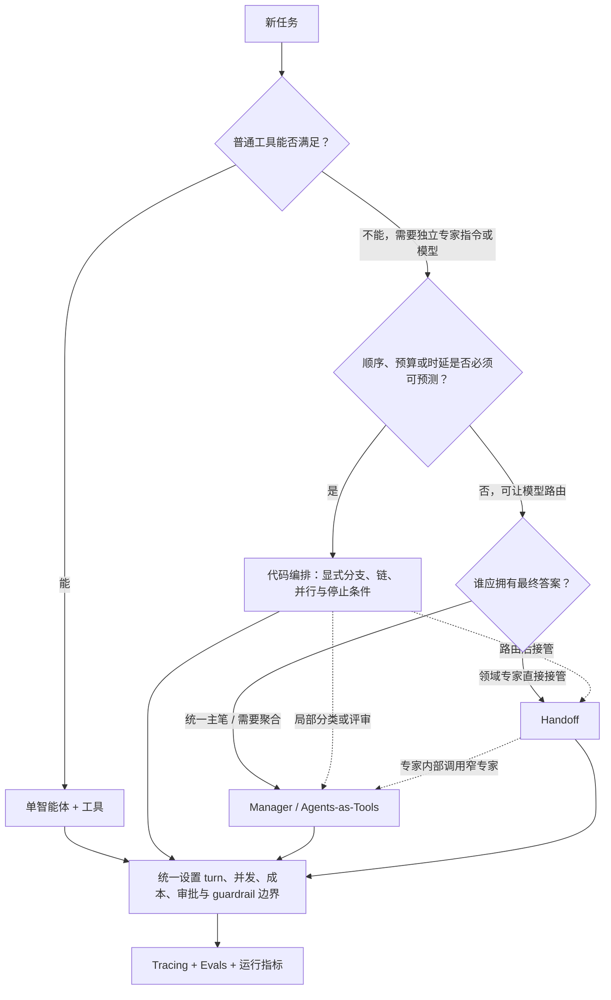

# OpenAI Agents SDK：小型多智能体系统的控制权模型

同一个 specialist，可以被 manager 当成工具调用，也可以通过 handoff 接管对话。两种写法看起来都像“把任务交给专家”，用户关系和失败后果却完全不同：前者把结果送回父运行，后者移动当前活动 agent。

因此，多智能体模式首先是控制权选择。最终答案由谁写、历史传给谁、谁能继续下一轮、哪一层负责停止和审批，应该先于拓扑和 API 便利性决定。

本文固定到一个 SDK 提交解释这些语义。版本、文件与符号进入证据卡；handoff 后果、工具副作用、guardrail 缺口和人工恢复仍在主叙事中展开。

## 学习问题

1. Manager 调用 specialist 与 Handoff 到 specialist，在用户可见行为上有什么根本差异？
2. 会话历史、当前活动智能体和最终答案分别由谁拥有，怎样跨调用移动？
3. 哪些决策适合交给模型，哪些应保留在确定性代码、guardrail 或人工审批边界？
4. 如何限制 agent loop、评审循环和并行扇出，避免成本、时延与失败范围失控？
5. 什么时候组合多种模式，什么时候一个智能体加工具反而是更好的架构？

## 一页摘要

先区分“委派一项工作”和“交出对话”。这正是 Agents-as-Tools 与 Handoff 的分界。

**已证实事实**：Agents-as-Tools 让 manager 调用 specialist 的嵌套运行。结果回到父运行，manager 继续持有活动-agent 指针并合成最终答案。Handoff 则更新 `current_agent`；接收者继续本次运行，并可成为后续用户轮次的起始 agent。

两者都不自动决定跨轮历史存在哪里。应用仍要选择客户端历史、session、conversation 或 response continuation；`current_agent`、历史持久化与可恢复执行快照不能混为一种“状态”。

**基于证据的推断**：代码编排提供第三种控制配置。它把顺序、分支、并发、停止条件和预算上移到应用层，模型只在被允许的局部做分类、生成或评审。

| 模式 | 谁选择下一步 | 谁持有活动-agent / 对话控制 | 谁产出最终答案 | 跨轮历史由谁持久化 | 主要优势 | 主要代价 |
| --- | --- | --- | --- | --- | --- | --- |
| Manager / Agents-as-Tools | manager LLM | 父运行中的 manager | manager | 应用选择的历史/session/conversation 策略；嵌套运行默认不继承 | 可聚合多个专家、统一口径和 guardrail | manager 多一次合成调用，嵌套运行增加成本 |
| Handoff | 当前 agent 的 LLM 选择目的地 | receiving agent 成为 `current_agent` | 最后活动的 specialist | 仍由运行与应用所选策略负责，可共享或过滤历史 | 专家提示更聚焦，减少 manager 转述 | 路由错误更直接，历史与 guardrail 边界更复杂 |
| code-driven orchestration | 应用代码；局部可用 LLM 分类 | 应用显式指定 | 应用指定的最后一步或聚合器 | 应用显式选择 | 显式边界可提高顺序、预算与停止条件的可预测性 | 工作流较僵硬；额外调用和并行仍可能增加成本 |

**个人分析**：需要统一主笔时用 Agents-as-Tools；专家应直接接管时才用 Handoff；路径与预算必须可证明时由代码编排。没有独立专业职责时，单智能体加普通工具仍是默认起点。

## 事实边界

事实边界先把三个容易混淆的对象拆开：活动 agent 是运行内控制指针，session/conversation 是跨轮历史策略，`RunState` 是暂停与恢复快照。它们可以协作，但不会自动互相替代。

### 已证实事实

`Agent` 由 instructions、tools、handoffs 等能力组成。Handoff 在模型侧表现为转移工具，但 Runner 执行后会更新当前 agent；普通工具只把结果追加回原运行。

Runner 得到最终输出就结束，遇到 handoff 就更新 agent 与输入，遇到工具调用则执行并继续。`max_turns` 超限会抛出 `MaxTurnsExceeded`；显式传 `None` 才会取消这项单次运行限制。

`Agent.as_tool()` 启动嵌套运行并把结果返回 manager。父运行的会话状态不会自动传给嵌套运行；共享客户端历史需要显式传同一 session，且一次运行应只选择一种状态策略。

Handoff 默认让 receiving agent 看到此前历史，`input_filter` 可以改变转交内容。嵌套历史摘要是 opt-in beta，默认关闭；启用后才会使用 `handoff_history_mapper` 替换规范化历史。

SDK 支持应用维护的输入列表、session、Conversations API 和 Responses continuation 四类跨轮策略。官方建议一次对话只选一种，避免重复上下文。

Agent 级 input guardrail 只检查链首，output guardrail 只检查链尾。Tool guardrail 只覆盖 `function_tool`，不覆盖 handoff、hosted/built-in tools，也不直接包住 `Agent.as_tool()` wrapper。

需要审批的工具可以暂停运行，以 `RunState` 持久化后批准或拒绝再恢复。这一中断面可以出现在 handoff 之后，也可以出现在嵌套 agent 内；恢复前仍要重新校验权限和副作用状态。

### 基于证据的推断

Manager 保持父运行控制，不等于它拥有历史持久化，也不等于 specialist 没有状态。嵌套 agent 可有自己的 session、turn limit 和 trace；区别在于输出回到工具结果通道，最终叙述仍由 manager 决定。

Handoff 移动的是运行内控制指针，不一定跨服务或进程。部署边界是另一项架构选择，不能从 API 名称推出。

`max_turns` 只约束一次 Runner 调用，不限制应用 `while`、并行 fan-out、重试或多个嵌套 agent 的总 token。生产预算必须覆盖全部层级。

Tracing 能解释行为，不等于质量已验证。只有把 trace 与任务 eval、路由准确率、完成率、成本和人工升级关联，才能形成发布闭环。

### 个人分析与未知项

SDK 不替应用决定 SLO、token 预算、重试、幂等、租户隔离、数据保留或审批政策。示例证明模式存在，不证明默认值适合生产；把普通函数包装成 agent 还会新增模型调用与不确定性。

  
证据：固定版本与官方实现范围

  - **来源截断：** `2026-07-20`
  - **分支：** 核对时为 `main`
  - **固定提交：** `openai/openai-agents-python@2fa463571e76dae8ff267622f1018eaf06ffeb9f`
  - **实现入口：** `src/agents/run.py`、`agent.py`、`handoffs/__init__.py`、`run_state.py`
  - **边界：** 固定提交支持本文的运行语义，不证明后续 API、默认行为或部署效果。

  
证据：代码编排、Tracing 与状态策略的官方覆盖

  - **代码编排示例：** 结构化分支、串行链、evaluator loop 与 `asyncio.gather` 并行独立任务。
  - **跨轮状态：** `result.to_input_list()` / `to_input_list()`、`session`、`conversation_id`、`previous_response_id`。
  - **Handoff 历史：** `nest_handoff_history` 为 opt-in beta；启用后才使用 `handoff_history_mapper`。
  - **Tracing：** Runner、agent、generation、function、guardrail 与 handoff span；可用 `workflow_name`、`trace_id`、`group_id` 和 metadata 关联。
  - **敏感数据：** 模型和函数输入输出可能进入 trace，可通过运行配置关闭采集。
  - **边界：** 示例不提供任务级成本上限、业务幂等或质量保证；trace 也不替代 eval。

## 架构图

下图先问谁应拥有下一句用户可见答复，再问路径是否必须由代码证明。它不是 SDK 强制拓扑；虚线表示模式可以组合，不表示控制权会自动返回。

读图后的决策顺序是：

1. 先问普通工具是否足够；若工具只需执行确定性函数或 API，不创建第二个 agent。
2. 若专家确实需要独立 instructions、模型或输出契约，再看流程是否有严格的成本、时延、顺序或合规边界；有则把主流程写在代码里。
3. 若允许 LLM 路由，再问最终答案由谁负责：需要统一主笔、对比或聚合多个专家，使用 Agents-as-Tools；需要领域专家直接接管后续对话，使用 Handoff。
4. 模式可以组合，但每层都要有自己的回合、并发、成本、审批和失败边界，并由同一条 trace 与 eval 体系串起来。

## 控制权与任务流

**说明性场景｜一个支持请求被识别为领域问题，处理过程中可能调用有写副作用的工具。** 该场景只组合 SDK 已支持的路由、嵌套运行、审批和恢复机制，不代表真实客户或事故。

如果 triage agent 使用 handoff，领域 specialist 成为 `current_agent`，看到经筛选的历史并直接答复。下一轮是否仍从它开始，取决于应用是否把 `result.current_agent` 作为起始 agent；控制不会自动回到 triage。

如果 triage agent 把同一 specialist 作为 tool 调用，嵌套结果回到父运行。Manager 可以再调用其他专家并统一口径，最终答案仍由 manager 生成；specialist 不会因为被调用就接管下一轮。

无论采用哪种模式，写工具都应在副作用附近校验参数、权限和幂等键。审批中断后恢复时，旧调用可能已经产生外部效果；`RunState` 能保存执行快照，不能证明远端操作未发生。

### Manager / Agents-as-Tools

**已证实事实**：manager 的 `tools` 列表包含由 `specialist.as_tool()` 生成的工具。manager LLM 决定调用哪个 specialist；嵌套 Runner 完成后，结果作为工具输出返回父运行；manager 随后继续推理并生成 `final_output`。多个翻译 specialist 的官方示例展示了 manager 可调用多个工具后统一回答。

控制与状态路径可写成：

`用户输入 → manager 会话 → specialist 工具调用参数 → 独立嵌套运行 → specialist 结果 → manager 会话 → manager 最终答案`

Specialist 通常对用户保持隐藏：它不是后续对话的 `current_agent`，只是内部能力。Nested streaming 和 trace 可以展示进度，但那是界面选择，不是控制转移。需要父历史时必须显式构建输入或共享合适 session，不能假设自动继承。

### Handoff

**已证实事实**：handoff 发生时，Runner 更新当前 agent 与输入并继续循环。receiving agent 默认看到之前的会话历史；官方路由示例在下一轮把 `result.current_agent` 作为起始 agent，因此接管可延续到后续用户轮次。最后活动 agent 的最终输出成为本次运行结果。

控制与状态路径可写成：

`用户输入 → triage agent → handoff 调用与可选元数据 → 更新 current_agent / 过滤或保留历史 → specialist 直接回答 → 后续轮次继续从该 specialist 开始`

Specialist 从内部候选变成活动 agent。`input_type` 只给 handoff 调用增加结构化元数据，不会替换 receiving agent 的主输入，也不会动态选择目的地。历史裁剪应在 `input_filter` 或运行配置中完成；handoff reason 不是上下文隔离。

### Code-driven orchestration

**已证实事实**：官方示例用普通 Python 控制流把多个 `Runner.run()` 串起来：结构化 evaluator 输出决定是否继续，`while` 控制改进循环，`asyncio.gather` 并发运行独立候选，再把候选交给 picker。最终答案属于代码明确选定的最后一步或聚合器，而不是由一个隐含的活动 agent 自动决定。

**个人分析**：代码外壳适合分类集合稳定、步骤依赖明确、合规顺序不可变的工作流。模型负责理解和生成，代码负责允许的步骤、轮数、并发和失败路径。

显式上限只有真正替代无界路径时，才可能降低平均成本和尾延迟方差。额外候选或并行 fan-out 也会反向增加成本，所以必须用任务级分布实测，不能从“流程写在代码里”直接推导收益。

### 组合模式

一个稳健的组合可以是：代码先执行身份校验与确定性路由；领域 agent 通过 Handoff 接管用户；领域 agent 再把检索、翻译或审阅作为 Agents-as-Tools 的窄任务；不可逆工具在执行前触发审批。这里的关键不是“用了三种模式”，而是每次控制权转移都有明确所有者、输入契约、预算与失败返回点。

## 关键源码导读

源码阅读只需要追踪三条线：Runner 何时移动 `current_agent`，`Agent.as_tool()` 如何把结果送回父运行，审批中断如何进入 `RunState`。这三条线分别回答接管、委派和恢复。

先读 `docs/multi_agent.md` 建立分类，再从 `src/agents/run.py` 跟随最终输出、handoff 和工具分支。随后对照 `agent.py` 与 `handoffs/__init__.py`；只有需要暂停恢复时才继续到 `run_state.py`、guardrails 和 human-in-the-loop 文档。

读完后应能画出三个对象：`current_agent` 是控制指针，conversation/session 是历史策略，`RunState` 是执行快照。把它们统称为“状态”，会产生 handoff 永久改写 session 或共享 session 等于最小上下文之类的错误设计。

  
证据：完整源码与示例阅读路径

  1. `docs/multi_agent.md`：LLM/代码编排、Agents-as-Tools 与 Handoff 分类。
  2. `docs/running_agents.md`、`src/agents/run.py`：agent loop、`final_output`、handoff、工具、`max_turns` 与状态策略。
  3. `docs/tools.md`、`src/agents/agent.py`：`Agent.as_tool()`、嵌套状态、structured input、streaming 与 approval。
  4. `docs/handoffs.md`、`src/agents/handoffs/__init__.py`：`HandoffInputData`、`input_type`、`input_filter`、动态启用与历史嵌套。
  5. `src/agents/run_state.py` 与 state 文档：输入列表、session、conversation、previous response 与暂停恢复。
  6. `docs/guardrails.md`、`docs/human_in_the_loop.md`、`docs/tracing.md`：覆盖范围、中断、敏感数据与 processor。
  7. `examples/agent_patterns/agents_as_tools.py`、`routing.py`：结果返回 manager 与 specialist 接管。
  8. `examples/agent_patterns/deterministic.py`、`parallelization.py`、`llm_as_a_judge.py`：显式链、fan-out 与 evaluator loop；不要复制无界 `while True`。
  9. `examples/agent_patterns/human_in_the_loop.py`、`agents_as_tools_conditional.py`：动态能力、agent-tool 审批与外层恢复。

  - **边界：** 示例证明 SDK 组合方式，不证明生产退出条件、预算或工具副作用已经安全。

## 架构决策与权衡

每个决策都回到同一问题：控制权移动后，谁负责最终答案、历史、预算与失败恢复？

### 最终答案所有权

Agents-as-Tools 适合“一个总编辑、多个研究员”：manager 可以比较、纠错、统一风格和隐藏内部组织变化。代价是 specialist 已经生成内容后，manager 还要重新读取并合成，增加 token、延迟与信息损失。

Handoff 适合“前台分诊、专家坐席”：specialist 不必让 manager 转述，提示上下文更专一，也更容易维持领域身份。代价是用户体验、输出 guardrail 和错误恢复都跟随最后活动 agent；错误路由会直接把对话交给不合适的专家。

### 模型自治还是代码控制

模型路由适合开放式任务和难以穷举的意图，能在少量代码下获得适应性；但每个决策都受提示、模型版本和上下文影响。代码路由适合有限枚举、严格顺序、固定审批和可计算预算；代价是新分支必须实现、测试和部署。

**基于证据的推断**：常见最佳点是“确定性骨架 + 局部模型判断”。例如模型输出结构化分类，代码验证枚举后选择 agent；模型生成三个候选，代码限制并行数并交给一次 evaluator；模型建议执行写操作，代码检查策略并触发人工审批。

### 状态共享还是上下文隔离

完整历史有利于连贯，但会增加 token、敏感数据暴露和提示污染。Agents-as-Tools 默认不继承父运行状态，天然鼓励窄输入；Handoff 默认携带完整历史，更适合连续对话，但生产中应根据领域最小化。一次运行只选一种跨轮持久化策略，避免客户端历史与服务端 continuation 重复。

### 串行、并行与循环

- 串行链最容易表达依赖与审计，但各步骤时延相加。
- 并行适合真正独立的子任务或多候选择优；必须设置 fan-out、并发、总截止时间和部分失败策略。
- evaluator loop 可提高质量；必须设置最大轮数、最低改进幅度、总 token/费用预算和降级输出。SDK 的 `max_turns` 不能替代应用循环上限。
- provider 的 parallel tool calls 与 `max_function_tool_concurrency` 是不同控制面：前者影响模型一次响应能否发出多个调用；后者只限制**同一个模型回合发出的、本地执行的函数工具调用**。它不限制应用层 `asyncio.gather`、多个并行 `Runner.run()` 或跨运行 fan-out；这些必须由应用自己的 semaphore / task limit、总 deadline 和取消策略约束。

### Guardrail 与审批边界

agent 输入/输出 guardrail 只覆盖链首与链尾，不能假设每个 handoff agent 都自动执行两端检查。由 `function_tool` 创建的函数工具可使用 tool guardrail 做参数与结果校验；这套 pipeline 不覆盖 handoff 调用、hosted/built-in tools 或 `Agent.as_tool()` wrapper 本身，必须按各自接口补策略或审批。不可逆、付费、外发或高权限工具应在最接近副作用的位置要求审批。`Agent.as_tool()` 本身可要求审批，内部工具还可再次中断；这两层分别控制“是否委派”和“是否行动”。

## 生产化分析

生产检查不应只数 agent 和 tool call。首先要能重建控制指针为何移动，再确认副作用是否获权、是否发生，以及失败后由谁接管。

### 可观测性与评估

**已证实事实**：SDK 默认 trace 可记录 agent、generation、function、guardrail 和 handoff span，并能用 `group_id` 关联同一对话的多个 trace。生产命名至少应稳定区分 workflow、路由版本和租户/环境；敏感输入输出不应因默认采集而未经审查进入 trace。

下表回答 trace 之外还要测量什么：

| 维度 | 指标 | 用途 |
| --- | --- | --- |
| 路由 | handoff / tool-agent 选择准确率、回退率、错误专家率 | 判断是否值得让 LLM 路由 |
| 质量 | 任务完成率、结构化校验通过率、人工纠正率、eval 分数 | 比较模式与提示版本 |
| 成本 | 每任务模型调用数、token、工具费用、嵌套运行占比 | 识别 manager 重复合成与循环膨胀 |
| 时延 | 端到端及各 span P50/P95/P99、队列与审批等待 | 区分模型、工具、并行和人工瓶颈 |
| 安全 | guardrail tripwire、审批拒绝、越权工具尝试、敏感 trace 关闭率 | 验证策略是否真正执行 |

Evals 应包含单步能力测试、路由数据集和端到端任务。仅评最终文本会掩盖“走错专家但碰巧答对”、不必要工具调用和成本退化；仅看 trace 则无法判断回答是否有用。发布门禁应同时比较质量、安全、成本和时延基线。

### 失败模式与遏制

Handoff 的失败会改变用户接触的 agent，agent-tool 的失败则返回父运行。两者都可能在内部工具处产生副作用，因此遏制点不能只放在链首和链尾。

| 失败模式 | 典型表现 | 遏制方式 |
| --- | --- | --- |
| manager 忘记调用或过度调用专家 | 凭空回答、重复嵌套运行 | 明确工具说明、结构化任务、调用计数与 eval；必要时改代码路由 |
| handoff 错路由或来回转移 | 专家不匹配、上下文膨胀、turn 耗尽 | 动态启用候选、记录 reason、限制 handoff 次数、提供安全回退 agent |
| 父子运行状态误配 | 专家缺上下文或重复上下文 | 显式输入契约；每次运行选择一种状态策略；测试多轮恢复 |
| 无界 evaluator loop | 成本与时延失控 | 最大轮数、总预算、截止时间、无改进退出与可接受降级 |
| 并行扇出过大 | 限流、下游拥塞、费用尖峰 | 应用 semaphore/task limit、总 deadline、取消策略与隔离舱；SDK 本地函数工具上限只处理单回合局部并发 |
| guardrail 覆盖误判 | 中间 agent 或 hosted tool 未被检查 | 按官方覆盖边界布置函数工具 guardrail、策略网关与审批 |
| 审批恢复失败 | 重复副作用、旧定义无法反序列化 | 持久化 call ID 与幂等键；保存 agent/SDK 版本；执行前再校验 |
| trace 泄露敏感数据 | 提示、工具参数或结果进入遥测 | 关闭敏感采集、脱敏、自定义 processor、分级保留与访问控制 |

### 适用范围

适合多智能体的信号：领域提示明显冲突；专家使用不同模型或输出类型；需要独立评估和演进；一个主笔必须聚合多个并行研究；或用户确实需要从分诊切换到持续服务的领域坐席。

更适合单智能体加工具的信号：只有一个用户角色与答案口径；“专家”只是查数据库或调用 API；任务路径短；延迟/成本预算紧；团队尚无稳定 eval；或增加 agent 只是在重命名函数。单 agent 仍可使用结构化输出、guardrail、审批、session 和 tracing，不需要为了这些能力引入第二个 agent。

上线前必须回答：最大模型回合、应用循环和 handoff 次数分别是多少？并行 fan-out 与工具并发是多少？谁能看到完整历史？哪些副作用需要人工批准？哪种状态策略是唯一事实源？超时后返回部分结果、回退单 agent 还是转人工？这些答案应落入代码与监控，而不只写在 prompt 中。

## 可迁移经验

迁移这套设计时，复制的是“谁持有控制”的判定方法，不是某个示例拓扑。

### 可直接复用的机制

1. **先决定最终答案所有权。** 统一主笔用 Agents-as-Tools；专家直接接管才用 Handoff。
2. **分开设计三种状态。** `current_agent`、session/conversation 与 `RunState` 分别负责控制、历史和恢复。
3. **用确定性代码包住硬边界。** 身份、许可、预算、最大循环、并发、结构校验和副作用顺序不只靠提示。
4. **在副作用处审批。** 委派审批与行动审批是两条边界；恢复前再次核对幂等键和外部状态。

### 只能有限类比的部分

1. **Handoff 是运行内控制转移。** 它可以映射到组织或服务交接，但 API 本身不证明跨进程部署或永久坐席关系。
2. **Agent-tool 是嵌套运行。** 窄输入有利于隔离，但独立 session、turn 和 trace 仍需应用显式设计。
3. **代码编排提高显式性。** 它只有在真的限制分支、轮数和并发时才提高可预测性，额外调用仍可能增加尾延迟。
4. **Trace 与 eval 相互补充。** Trace 解释路径，eval 判断质量；两者都不代替业务授权。

### 不应照搬的部分

1. **不要把完整历史默认交给所有 agent。** Handoff 用 filter/history mapper，agent-tool 用窄结构化输入传最小必要信息。
2. **不要用 `max_turns` 代表总预算。** Runner、嵌套运行、应用 loop、重试与 fan-out 必须汇总到任务级上限。
3. **不要假设 guardrail 自动覆盖中间环节。** Handoff、hosted tool、built-in tool 和 agent-tool wrapper 各自补策略。
4. **不要把第二个模型调用当成专业分工。** 没有独立推理职责时删除第二个 agent，保留普通工具。

## 来源

以下均为 OpenAI 官方文档或官方上游仓库。访问日期与来源截断日期：**2026-07-20**；仓库链接尽量固定到提交 **`2fa463571e76dae8ff267622f1018eaf06ffeb9f`**。

- [Agent orchestration 官方指南](https://openai.github.io/openai-agents-python/multi_agent/) 与 [固定提交文档](https://github.com/openai/openai-agents-python/blob/2fa463571e76dae8ff267622f1018eaf06ffeb9f/docs/multi_agent.md) — LLM 编排、Agents-as-Tools、Handoff、代码编排及组合原则。
- [OpenAI Agents SDK 官方仓库](https://github.com/openai/openai-agents-python/tree/2fa463571e76dae8ff267622f1018eaf06ffeb9f) — SDK 定位、核心概念、源码与官方示例入口。
- [Tools / Agents as tools](https://github.com/openai/openai-agents-python/blob/2fa463571e76dae8ff267622f1018eaf06ffeb9f/docs/tools.md#agents-as-tools) — manager 模式、嵌套运行状态、turn 限制、结构化输入、输出提取、streaming 与 approval。
- [Handoffs](https://github.com/openai/openai-agents-python/blob/2fa463571e76dae8ff267622f1018eaf06ffeb9f/docs/handoffs.md) — 控制转移、handoff metadata、输入过滤、历史传递和 guardrail 边界。
- [Running agents](https://github.com/openai/openai-agents-python/blob/2fa463571e76dae8ff267622f1018eaf06ffeb9f/docs/running_agents.md) 与 [`Runner` 源码](https://github.com/openai/openai-agents-python/blob/2fa463571e76dae8ff267622f1018eaf06ffeb9f/src/agents/run.py) — 运行循环、`max_turns`、并发工具执行、状态策略与 trace 配置。
- [`Agent.as_tool()` 源码](https://github.com/openai/openai-agents-python/blob/2fa463571e76dae8ff267622f1018eaf06ffeb9f/src/agents/agent.py#L508) 与 [`Handoff` 源码](https://github.com/openai/openai-agents-python/blob/2fa463571e76dae8ff267622f1018eaf06ffeb9f/src/agents/handoffs/__init__.py#L98) — 两种控制模型的实现入口。
- [Guardrails](https://github.com/openai/openai-agents-python/blob/2fa463571e76dae8ff267622f1018eaf06ffeb9f/docs/guardrails.md) — 链首输入、链尾输出、函数工具 guardrail 和并行/阻塞执行差异。
- [Human-in-the-loop](https://github.com/openai/openai-agents-python/blob/2fa463571e76dae8ff267622f1018eaf06ffeb9f/docs/human_in_the_loop.md) 与 [`RunState` 源码](https://github.com/openai/openai-agents-python/blob/2fa463571e76dae8ff267622f1018eaf06ffeb9f/src/agents/run_state.py#L208) — 跨 handoff 与嵌套运行的审批中断、持久化和恢复。
- [Tracing](https://github.com/openai/openai-agents-python/blob/2fa463571e76dae8ff267622f1018eaf06ffeb9f/docs/tracing.md) — 默认 span、对话关联、敏感数据和自定义 processor。
- [Agent patterns 目录](https://github.com/openai/openai-agents-python/tree/2fa463571e76dae8ff267622f1018eaf06ffeb9f/examples/agent_patterns) — [Agents-as-Tools](https://github.com/openai/openai-agents-python/blob/2fa463571e76dae8ff267622f1018eaf06ffeb9f/examples/agent_patterns/agents_as_tools.py)、[Handoff routing](https://github.com/openai/openai-agents-python/blob/2fa463571e76dae8ff267622f1018eaf06ffeb9f/examples/agent_patterns/routing.py)、[deterministic flow](https://github.com/openai/openai-agents-python/blob/2fa463571e76dae8ff267622f1018eaf06ffeb9f/examples/agent_patterns/deterministic.py)、[parallelization](https://github.com/openai/openai-agents-python/blob/2fa463571e76dae8ff267622f1018eaf06ffeb9f/examples/agent_patterns/parallelization.py) 与 [LLM-as-a-judge](https://github.com/openai/openai-agents-python/blob/2fa463571e76dae8ff267622f1018eaf06ffeb9f/examples/agent_patterns/llm_as_a_judge.py) 的可运行示例。

判断一个 specialist 应该“接管”还是“返回结果”，要在它第一次运行前完成。控制权归属一旦清楚，历史裁剪、guardrail、审批、预算和恢复位置才有一致答案。
