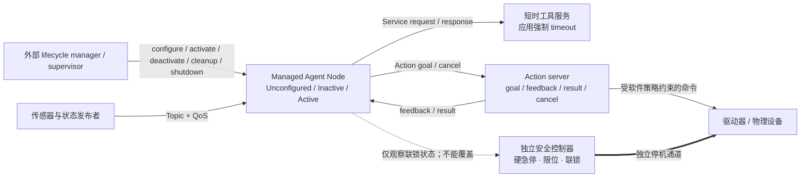

# ROS 2 + DDS Agent Lifecycle：为物理智能体选择通信语义与受管状态

移动机器人还在驶向目标点，调度器却收到撤回任务的请求。此时传感器数据仍要继续流动，配置查询仍要快速返回，长任务则必须报告进度、接受取消并确认真实终态；把三者都当成一种“消息”，会让控制权和失败含义一起消失。

ROS 2 用 Topic、Service、Action 分开表达持续数据、短请求响应和长任务。DDS QoS、Executor、Callback Group 与 Managed Node 再约束交付、调度和运行状态。可迁移的判断不是“选一种 ROS 接口”，而是先问：谁持有任务状态，谁能请求停止，谁能确认物理效果。

本文只讨论固定的 ROS 2 Jazzy Jalisco 证据截面，详细 tag、commit、文件与符号放在证据卡。Action cancel 仍是协作请求，Active 仍不等于获得业务授权；硬急停、独立安全回路、驱动器限位和经过验证的实时控制始终位于 Agent 推理之外。

## 学习问题

1. Topic、Service 与 Action 如何分别承担持续流、短请求和可观察的长任务？

2. Goal 被取消或新 Goal 到来时，谁决定接纳、停止、抢占与终态？

3. QoS 不兼容、deadline missed 或 liveliness lost 后，通信与设备会自动发生什么？

4. Executor 与 Callback Group 能约束哪些并发，又缺少哪些实时保证？

5. Managed Node 如何拆开“进程存活”“配置完成”“开始处理”和“业务获权”？

6. 哪些故障交给 ROS 2 应用恢复，哪些风险必须由独立物理安全链处理？

## 一页摘要

先用一个问题选择接口：接收方需要的是最新数据、一次答复，还是一个有状态且可取消的任务？

**已证实事实**：Topic 是异步发布/订阅数据流，可有多个发布者与订阅者；Service 推荐用于短时请求响应，不提供取消，也不在协议层限制服务端执行时间；Action 面向长任务，具备 Goal、Feedback、Result 与 Cancel 接口。三者不是同一种传输方式的不同命名，而是不同的控制合同。

**基于证据的推断**：对物理 Agent，接口合同还要与 QoS、调度、生命周期和独立安全链一起设计。任何一层的“成功”都不能越级证明设备已经完成动作。

| 层次 | Jazzy 已证实事实 | Agent 迁移解释 | 不能推出 |
| --- | --- | --- | --- |
| Topic | 异步发布/订阅，适合连续数据；同一 Topic 可有多个 publisher 与 subscriber | 传感器、世界状态、心跳和审计事件流 | 每条消息必达、全局顺序或业务事务 |
| Service | 推荐用于短时 request/response；不提供取消，也不保证执行时限 | 应用强制 timeout 的查询、幂等配置检查、短工具调用 | 长任务、可抢占任务或有物理副作用的 exactly-once |
| Action | 长任务含 goal、feedback、result 与 cancel 接口 | 规划、导航、操作臂任务和长工具执行 | cancel 自动完成、抢占自动安全、设备已停止 |
| DDS QoS | 端点按 Request-vs-Offered 匹配；history/depth 管队列，reliability/durability/deadline/liveliness 描述不同交付或时序属性 | 按数据风险和新鲜度定义契约，并监听不兼容、deadline missed、liveliness lost 事件 | “reliable”代表应用正确、deadline 触发停止、liveliness 代表设备安全 |
| Executor / Callback Group | Executor 从 wait set 取 ready entity；Mutually Exclusive 禁止组内并行，Reentrant 允许并行 | 隔离控制回调、推理回调和管理回调，显式配置线程与优先级 | FIFO、无优先级反转、允许并行就必然并行 |
| Managed Node | 外部管理者请求 configure/activate/deactivate/cleanup/shutdown；transition callback 的异常或错误结果由状态机处理 | supervisor 在资源、策略和联锁校验后才激活 Agent | 普通业务 callback 异常自动触发生命周期转换，或 Active 自动等于有业务权限 |

接口名称只解决第一层问题：任务如何被表达。QoS 与 Executor 决定数据怎样到达、callback 何时运行，Lifecycle 决定节点是否参与处理；业务授权与物理安全仍各有自己的裁决者。

## 事实边界

事实范围由四份合同限定：Jazzy 版本、Action 取消、QoS 匹配和 Lifecycle 状态。任何 Agent 映射都只能建立在这些合同之上，不能反向扩大 ROS 2 的物理安全能力。

**已证实事实**：本文只讨论 ROS 2 Jazzy Jalisco。Jazzy 于 2024-05-23 发布，支持到 2029-05；访问与源码截断日期为 2026-07-22。Rolling、Kilted、Lyrical 及其他发行版的新接口或 Executor 行为不进入本文结论。

**已证实事实**：Action server 由应用决定是否接受 Goal 和 Cancel。接受 Cancel 只表示服务器会尝试取消；执行代码仍须观察取消状态、停止工作并提交 canceled 终态。

**基于证据的推断**：Preemption 因而不是 Action 自动施加的安全停止。新 Goal 到来时，应用必须选择拒绝、排队、并行，或先取消旧 Goal；在设备回执确认停稳前，不能把 Cancel Request 记成“动作已停止”。

**已证实事实**：DDS QoS 以 Request-vs-Offered 规则匹配发布与订阅端点。只要任一兼容性策略不满足，端点就不会通信；history 与 depth 决定本地保留方式和上限，不是业务背压协议。

**个人分析**：ROS 2 提供通信、调度与生命周期原语。身份授权、长任务幂等、物理联锁、风险预算、审计和恢复编排仍属于应用与现场安全系统；本文的 Agent 映射不是 ROS 2 官方参考实现。

  
证据：固定 Jazzy 版本与生命周期文档边界

  - **ROS 2 bundle：** `release-jazzy-20260618`，commit `a38203a7da336eb123122bc241f53e78d2a0284f`

  - **rclcpp：** 上述 release 的 `ros2.repos` 固定 tag `28.1.21`，commit `53cf81e42e6530c2ed7a23489d6640966dccd083`

  - **生命周期规范：** Managed Node 设计文档写于 2015-06，最后修改于 2021-02；本文用同批 Jazzy 生命周期接口与实现核对 callback/transition 接缝。

  - **边界：** 设计文档不是 Jazzy release artifact，固定源码也不支持把结论外推到其他发行版。

## 架构图

图中有三把彼此不能替代的“钥匙”。Supervisor 掌握节点状态转换，Action server 掌握长任务接纳与终态，Safety controller 则直接约束设备。确认每把钥匙的作用范围，比追踪某一条消息更重要。

**可访问性说明**：图的 `accTitle` 和 `accDescr` 给出等价文本；实线是 ROS 2/应用控制流，粗线是绕过 Agent 的独立安全停机通道，虚线只表示 Agent 读取安全状态。

一次任务因此会跨过三条不同路径：Topic 持续送入感知，Service 完成短查询，Action 持有长任务状态。生命周期只决定 Agent 节点是否应处理它们，独立安全链则保留最终的物理停止权。

## 控制权与任务流

**说明性场景｜移动机器人运送料箱到工作站。** 这是用已证实接口机制合成的控制流程，不代表真实部署或事故。

1. 外部 lifecycle manager 请求配置节点。节点加载参数、预分配资源并创建通信实体后进入 Inactive；此时进程已存活、配置已完成，但不应发出受管输出。

2. Supervisor 校验策略版本、设备健康、权限、资源余量与物理联锁。业务授权是应用状态，不是 Lifecycle 状态；校验失败时节点保持 Inactive。

3. 激活成功后，激光雷达、位姿、设备健康与审计事件持续走 Topic。Agent 用 Service 查询地图或夹具配置，因为应用预期它快速返回，并设置 timeout；协议本身不限制服务端执行时长。导航与取放则走 Action，因为任务要持有 Goal、反馈、结果与取消状态。

4. Action server 接纳“运送料箱”Goal 后周期发布位置和阶段反馈。执行循环检查资源预算、授权租约、联锁与取消状态，只有真实终态出现后才提交并返回 Result。

5. 操作者发出 Cancel Request。Server 可以接受或拒绝；接受后，应用停止生成新命令、撤销可撤销工具，并等待驱动器回执或安全状态，再提交 canceled 终态。

6. 若新 Goal 此时到来，应用必须按策略拒绝、排队、并行或抢占。涉及同一设备时，应先 fence 旧命令并确认停稳；Action 不会自动把新 Goal 变成安全抢占。

7. 如果软件没有及时停下，硬急停或独立 safety controller 可绕过 Agent 直接约束驱动器。ROS 网络恢复、节点重新 Active 或 Cancel 被接受，都不能代替经过认证的复位条件。

同一物理任务因而同时使用三种接口，却不能共享同一套完成定义。下表把每种接口的适用任务、附加控制和拒绝条件并列起来。

| 通信选择 | 适合的任务 | 必须附加的控制 | 应拒绝的用法 |
| --- | --- | --- | --- |
| Topic | 连续感知、姿态、健康、事件；一对多/多对多流 | schema/version、QoS profile、时间戳、序号、丢弃与陈旧政策 | 需要单次确认、业务事务或可取消长任务 |
| Service | 预期快速完成的查询、计算、幂等配置读取 | 应用强制 timeout、request ID、重试预算、服务端去重、副作用边界 | 预期长时运行、要 feedback/cancel、设备效果不清楚 |
| Action | 导航、操作臂、长推理和多步工具任务 | goal ID、接纳政策、feedback 节奏、cancel checkpoint、终态 receipt | 无法定义安全取消、无法观察结果、把 cancel 当硬急停 |
| Lifecycle | Agent 资源准备、启停和故障恢复 | 外部 manager、授权门、转换超时、失败回滚、审计 | 只靠进程启动就默认执行，或让节点自行扩大权限 |

关键判断是：Topic、Service 与 Action 解决的是信息和任务表达；Lifecycle 解决的是节点受管状态；设备是否安全停机仍由物理状态与独立安全链确认。

## 关键源码导读

固定源码在这里充当三处接口合同的校验尺：Executor 看见什么待处理工作，Action 如何完成协作取消，Lifecycle 接受哪些错误信号。源码不能替业务授权、调度实时性或设备停稳背书。

**已证实事实**：Executor 通过 wait set 等待 ready entity。消息留在 middleware 层，wait set 对每个队列只暴露一个 ready 标志；积压时按 ready entity 做 round-robin，而不是读取完整队列并严格 FIFO 调度。

**已证实事实**：Reentrant Callback Group 允许组内与自身 callback 并行，Mutually Exclusive 禁止组内并行。前者只是许可，后者也只是进程内调度约束；实际并发仍取决于 Executor、线程、锁、其他 ready work 与 OS 调度。

**基于证据的推断**：DDS depth、resource limits、callback 最坏执行时间和 Executor 线程要一起做容量规划。只把 depth 调大可能形成陈旧积压；只换成 Multi-Threaded Executor 可能把共享设备句柄变成竞态。

  
证据：Executor 与 Callback Group 的固定源码接缝

  - [`rclcpp/include/rclcpp/callback_group.hpp`](https://github.com/ros2/rclcpp/blob/53cf81e42e6530c2ed7a23489d6640966dccd083/rclcpp/include/rclcpp/callback_group.hpp)：`CallbackGroupType::Reentrant` 与 `MutuallyExclusive` 的并发合同。

  - [`rclcpp/src/rclcpp/executor.cpp`](https://github.com/ros2/rclcpp/blob/53cf81e42e6530c2ed7a23489d6640966dccd083/rclcpp/src/rclcpp/executor.cpp)：Executor 的等待、ready work 选择与 entity 执行路径。

  - **版本：** 两个文件均固定于 rclcpp commit `53cf81e42e6530c2ed7a23489d6640966dccd083`。

  - **边界：** 这些接缝不证明严格 FIFO、完整队列可见性、优先级、WCET、跨进程互斥或 hard real-time。

  
证据：Action 取消与终态的固定源码接缝

  - [`rclcpp_action/include/rclcpp_action/server.hpp`](https://github.com/ros2/rclcpp/blob/53cf81e42e6530c2ed7a23489d6640966dccd083/rclcpp_action/include/rclcpp_action/server.hpp)：`handle_goal`、`handle_cancel` 与 `handle_accepted` 由应用提供；接受 Cancel 只表示尝试取消。

  - [`rclcpp_action/include/rclcpp_action/server_goal_handle.hpp`](https://github.com/ros2/rclcpp/blob/53cf81e42e6530c2ed7a23489d6640966dccd083/rclcpp_action/include/rclcpp_action/server_goal_handle.hpp)：执行代码用 `is_canceling()` 观察状态，并以 `canceled(result)` 提交终态。

  - **边界：** 源码不提供自动线程中断、工具撤销、抢占策略或物理安全停机。

  
证据：Lifecycle callback 与错误路径的固定源码接缝

  - [`rclcpp_lifecycle/.../lifecycle_node_interface.hpp`](https://github.com/ros2/rclcpp/blob/53cf81e42e6530c2ed7a23489d6640966dccd083/rclcpp_lifecycle/include/rclcpp_lifecycle/node_interfaces/lifecycle_node_interface.hpp)：声明 `on_configure`、`on_activate`、`on_deactivate`、`on_cleanup`、`on_shutdown` 与 `on_error`。

  - [`rclcpp_lifecycle/src/lifecycle_node_interface_impl.cpp`](https://github.com/ros2/rclcpp/blob/53cf81e42e6530c2ed7a23489d6640966dccd083/rclcpp_lifecycle/src/lifecycle_node_interface_impl.cpp) 与 [`lifecycle_node.cpp`](https://github.com/ros2/rclcpp/blob/53cf81e42e6530c2ed7a23489d6640966dccd083/rclcpp_lifecycle/src/lifecycle_node.cpp)：将 transition callback 异常映射为 `CallbackReturn::ERROR`，并暴露转换接缝。

  - **边界：** 这只证明 Lifecycle transition callback 的错误处理；普通 Topic、Service、Action 或 timer callback 异常不会因此自动触发生命周期转换。

## 架构决策与权衡

选择 QoS 时要先声明数据失效条件：可以丢多少、允许多旧、最迟何时到，以及端点不兼容时是否拒绝放行。

| 策略 | 精确语义 | 常见选择 | 风险与控制 |
| --- | --- | --- | --- |
| History / Depth | Keep Last 只保留最近 N 个 sample；depth 仅对 Keep Last 有意义；Keep All 受 middleware resource limits 约束 | 高频传感器常用小 depth 的 Keep Last；不可丢审计不要直接假设 Keep All 足够 | depth 太小会丢历史，太大产生陈旧积压；审计另用持久日志 |
| Reliability | Best Effort 尽力交付可丢；Reliable 重试以保证 DDS sample 交付 | 相机/雷达可容忍新帧覆盖旧帧时选 Best Effort；低频控制状态常选 Reliable | Reliable 会增加等待/带宽，也不保证业务 effect；设置超时和限流 |
| Durability | Volatile 不为 late joiner 保留；Transient Local 由 publisher 为后加入订阅者保留 sample | 配置/静态状态可考虑 Transient Local；实时流常用 Volatile | 迟到数据可能过期；每条消息带时间戳/version 并拒绝陈旧状态 |
| Deadline | 期望连续 sample 间的最大间隔，可产生 missed event | 控制状态和传感器健康设明确 deadline | 事件只是诊断/策略输入，不会自动停机；安全控制器另行 watchdog |
| Liveliness / Lease | publisher 在 lease 内表明仍 alive；Automatic 或 Manual By Topic | 关键 command publisher 可用更严格 liveliness 与 lease | alive 不等于 callback 正常、设备执行或授权有效；联合反馈和设备健康 |
| Compatibility | subscriber 请求最低质量，publisher 提供最高质量；所有兼容策略都满足才连接 | 部署前生成 Topic/Service/Action QoS contract 并在启动时检查 event | 同名同类型仍可能零数据；观测 incompatible QoS 并 fail closed |

Reliable 不是统一答案。高频感知可以让新帧覆盖旧帧，低频控制状态可能更重视交付；每类数据都要明确年龄、丢弃、连接失败与降级政策。

**个人分析**：QoS profile 应成为版本化接口合同。它至少列出 topic/type、history/depth、reliability 与 durability。Deadline、liveliness、lease、最大可接受年龄和过载行为也要进入合同。部署前测试兼容性，运行时把 incompatible、deadline missed 与 liveliness lost 变成显式告警。

**调度隔离：哪些 callback 可以互相等待？** 实时控制 callback 与模型推理 callback 不应共享无界执行队列；前者需要独立互斥组、Executor、受控 OS 调度、预分配内存和 WCET 测量，后者需要并发、CPU/GPU、token 与队列预算。

**个人分析**：需要确定处理顺序时，应评估显式 WaitSet 或更适合实时约束的执行方案。普通 Executor、Multi-Threaded 配置或 Reentrant 许可都不能单独支持 hard real-time 结论。

**生命周期授权：谁能放行节点？** 外部 manager 可以请求 configure、activate、deactivate、cleanup 与 shutdown。`alive/configured/active/authorized` 必须是四个不同判定，不能由前一个状态自动推出后一个状态。

**已证实事实**：Lifecycle transition callback 抛出异常或报告错误时，状态机进入错误路径。前五类转换错误进入 ErrorProcessing；错误处理成功回到 Unconfigured，失败则进入 Finalized。

普通业务 callback 的超时、异常、QoS 事件与设备告警不会自动触发这条路径。应用必须观测它们，再由 Supervisor 按策略请求 deactivate、cleanup、重新 configure 或其他恢复。

## 生产化分析

生产控制表不以“节点在线”为中心，而以失效信号能否触发正确控制动作来验收：拒绝新任务、降级通信、停用节点、核对设备，或让独立安全链接管。

**QoS 不兼容或数据失去新鲜度。** 同名同类型的端点仍可能因 QoS 不兼容而零数据。运行时要观测 incompatible、deadline missed 与 liveliness lost，并按数据风险降级、停收 Goal 或请求 deactivate；这些事件本身不会自动急停，也不证明设备故障。

**Executor 过载。** DDS 队列年龄、callback latency、drop、OOM、Action admission/reject 与 feedback lag 要共同观测。过载时采用有界 Keep Last、按数据类别丢弃、Service 应用限时、Action admission 与发布限速；禁止无界重试，并为安全 callback 保留预算。

**Service 超时或设备效果未知。** 重试要由 Request/Goal UUID、operation ID 与 command sequence 串起。下游 idempotency key 和 terminal receipt 也必须保留。未知效果禁止盲重放；同 ID 应返回既有结果，否则转只读核对或人工处置。

**Cancel 与 success 竞争。** 系统只允许提交一个真实终态，并记录 requested、accepted、observed、canceled 的时间。新 Goal 启动前要 fence 旧命令并确认设备状态；迟到 Cancel 应返回已经发生的真实终态。

**生命周期转换或业务 callback 失败。** Transition callback 的错误由 Lifecycle 状态机处理；普通 Topic、Service、Action、timer callback 故障则由应用上报。Supervisor 保留失败节点的诊断状态，再按 runbook 请求停用、清理或重新配置。

**权限材料失效。** SROS2 keystore 把 identity 与 permission trust chain 分开。Enclave 带有私钥/证书、签名 permissions、domain governance 与 CA 材料；设置 `ROS_SECURITY_STRATEGY=Enforce` 时，可拒绝 permissions 不允许的 Topic 发布或订阅。

**基于证据的推断**：DDS Topic 权限仍不足以授权某个 Action Goal 的参数、风险等级或设备范围。应用必须在 Goal 接纳和每次危险 command 前校验 subject、设备、策略版本、租约、参数包络与联锁；模型不能读取或改写判定所需的密钥和安全策略。

**物理安全触发。** 硬急停、独立 safety PLC/controller、限位、力矩/速度包络与双通道联锁必须直接约束设备。ROS 恢复前仍需人工或经认证的复位流程；Node alive、Active、Action canceled 都不是物理复位证据。

  
证据：生产观测、限额与恢复字段

  - **来源锚点：** [QoS settings](https://docs.ros.org/en/jazzy/Concepts/Intermediate/About-Quality-of-Service-Settings.html)、[Executors](https://docs.ros.org/en/jazzy/Concepts/Intermediate/About-Executors.html) 与 [Access Controls](https://docs.ros.org/en/jazzy/Tutorials/Advanced/Security/Access-Controls.html) 支持通信、调度和权限信号；业务预算与设备 receipt 是应用补充。

  - **身份与授权：** enclave、证书指纹/到期、subject、permission deny、Goal/设备/工具 scope、policy version、authority lease、activation reason。

  - **资源与背压：** Executor 线程、callback WCET、DDS depth/resource limits、CPU/GPU/内存、Action 并发、feedback 频率、queue/sample age、callback latency、drop、OOM、in-flight Goal 与 reject。

  - **幂等与取消：** request/Goal UUID、operation ID、command sequence、idempotency key、base/result version、terminal receipt、Cancel 各阶段时间、旧命令到达。

  - **QoS 与恢复：** deadline miss、liveliness change、设备反馈年龄、Lifecycle state/transition、状态转换耗时、cancel latency、恢复次数。

  - **物理状态：** 急停回路、联锁、驱动器 fault、真实速度/力矩/位置。

  - **边界：** 字段支持诊断和恢复决策，不把通信事件、进程状态或日志 receipt 升级成物理安全事实。

**个人分析**：演练必须同时穿过通信、调度、取消、生命周期与独立安全链。完整故障清单放在证据卡，避免把主叙事变成测试名录。

  
证据：恢复演练的故障覆盖

  - **机制锚点：** [About Actions](https://docs.ros.org/en/jazzy/Concepts/Basic/About-Actions.html)、[Using Callback Groups](https://docs.ros.org/en/jazzy/How-To-Guides/Using-callback-groups.html) 与 [Managed nodes design](https://design.ros2.org/articles/node_lifecycle.html) 分别界定取消、调度与生命周期机制；故障组合和通过条件属于演练设计。

  - **通信：** QoS 不兼容导致零数据、liveliness 丢失、DDS participant 重建。

  - **调度与副作用：** Callback Group 配错导致 deadlock、Executor 过载、Service 超时后的重复副作用。

  - **任务与状态：** Cancel 与 success 竞争、旧 Goal 命令迟到、configure/activate 失败。

  - **物理边界：** 独立安全回路触发后，验证软件恢复不能绕过复位流程。

  - **边界：** 演练证明恢复路径被执行，不证明未观测故障已经被消除。

恢复验收必须同时证明通信、应用状态、授权与物理状态。只看进程 PID、Topic 恢复或节点 Active 都不足以宣布恢复。

## 可迁移经验

### 可直接复用的机制

满足“持续流、短请求、长任务可被清楚区分”时，可以直接复用这些机制：

1. 用 Topic、Service、Action 分开承载持续流、应用限时的短请求响应和长任务。

2. 把 QoS profile 作为版本化合同，明确 history/depth、reliability、durability、deadline 与 liveliness。

3. 保存 Goal ID、Feedback、Result、Cancel 状态与设备 receipt，使长任务可观察、可对账。

4. 用 Callback Group 声明组内并发，用 Executor、线程和 OS 调度实现并发；控制、推理与管理 callback 分池。

5. 用 Managed Node 管理资源准备、处理、停止、清理、关闭与错误恢复。

6. 由外部 Supervisor 执行转换和恢复，不让 Agent 把“活着”自行升级成“获准执行”。

7. 在 DDS 身份与 Topic 权限之上叠加 Goal、工具与设备授权，默认拒绝超范围操作。

这些机制只适用于能区分状态、终态与控制所有者的任务；否则换接口名称也不会形成可靠合同。

### 只能有限类比的部分

这些类比只在保留 ROS 2 特有边界时成立：

1. Topic 像事件流，但 DDS discovery、QoS 匹配、实时数据分发和进程内执行不同于普通 Web pub/sub。

2. Service 可映射短工具调用，但 timeout 不回滚服务端副作用；有副作用仍需 operation ID 与幂等实现。

3. Action 可映射长 Agent 任务，但 Cancel 是协作请求；模型、外部工具与设备都要提供取消点或补偿路径。

4. DDS Reliable 保证的是 sample 交付层次，不是推理正确、工具 exactly-once 或物理目标达成。

5. Deadline 与 liveliness 可发现时序或参与者异常，不替代授权撤销、业务 SLA 或认证安全 watchdog。

6. Reentrant 只允许并行；实际并发取决于 Executor、线程、ready work、锁与 OS 调度。

7. Active 可表示开始处理，却不携带用户、任务、设备与风险授权；应用必须维护独立 authorized 状态。

类比的停止线是：只借用接口与状态结构，不把 DDS、Executor 或 Lifecycle 当成普通 Web 消息、事务或权限模型。

### 不应照搬的部分

以下做法在长任务、有副作用或物理风险时应直接禁止：

1. 不要把所有 Agent 交互都当 Topic，也不要用长 Service 执行导航、操作臂或长推理。

2. 不要把 Cancel acceptance、client timeout 或 preemption request 记录为设备已经停止。

3. 不要假设新 Goal 自动抢占旧 Goal；拒绝、排队、并行或取消后切换必须由应用策略定义。

4. 不要把 Reliable、Transient Local、deadline 或 liveliness 宣称为事务、持久工作流、物理安全或完整恢复方案。

5. 不要因使用 Multi-Threaded Executor 就宣称并行、FIFO 或 hard real-time。

6. 不要把进程 alive、节点 configured、Lifecycle Active 与业务 authorized 合并成一个绿色状态。

7. 不要让 ROS 2 网络、Executor、Agent 模型或 Action Cancel 取代硬急停、独立安全回路、驱动器限位和认证实时控制器。

任务放行的最低门槛是：错误重试、迟到命令和取消竞态都受到约束，独立安全链、设备回执、授权门与恢复流程均可验证。任何一项缺失，Agent 都不应获得物理执行权。

## 来源

以下来源访问于 **2026-07-22**。`已证实事实` 来自官方文档或固定源码；`基于证据的推断` 是对 Agent 控制边界的迁移；`个人分析` 是应用与现场安全系统需要补足的合同。

**主要架构来源**

- [ROS 2 distributions](https://docs.ros.org/en/jazzy/Releases.html) 与 [Jazzy Jalisco release page](https://docs.ros.org/en/jazzy/Releases/Release-Jazzy-Jalisco.html)：Jazzy 发行于 2024-05-23、EOL 为 2029-05，是本文唯一 distribution。

- [Interfaces: Topics, Services, Actions](https://docs.ros.org/en/jazzy/Concepts/Basic/Interfaces-Topics-Services-Actions.html) 与 [About Actions](https://docs.ros.org/en/jazzy/Concepts/Basic/About-Actions.html)：持续数据、短请求响应、长任务、goal/feedback/result/cancel 与 action server 责任。

- [QoS settings](https://docs.ros.org/en/jazzy/Concepts/Intermediate/About-Quality-of-Service-Settings.html)：history/depth、reliability、durability、deadline、liveliness、Request-vs-Offered 兼容和 QoS events。

- [Executors](https://docs.ros.org/en/jazzy/Concepts/Intermediate/About-Executors.html) 与 [Using Callback Groups](https://docs.ros.org/en/jazzy/How-To-Guides/Using-callback-groups.html)：wait set、ready flag、round-robin 非 FIFO、Single/Multi-Threaded Executor、Mutually Exclusive/Reentrant 和实时边界。

- [Security keystore](https://docs.ros.org/en/jazzy/Tutorials/Advanced/Security/The-Keystore.html) 与 [Access Controls](https://docs.ros.org/en/jazzy/Tutorials/Advanced/Security/Access-Controls.html)：DDS identity/permissions trust chain、enclave、governance、签名 permissions 与 topic publish/subscribe 控制。

**源码**

- [`ros2/ros2` 固定 release](https://github.com/ros2/ros2/releases/tag/release-jazzy-20260618)、[固定源码树](https://github.com/ros2/ros2/tree/a38203a7da336eb123122bc241f53e78d2a0284f) 与 [依赖清单](https://github.com/ros2/ros2/blob/a38203a7da336eb123122bc241f53e78d2a0284f/ros2.repos)：本文采用的 Jazzy release bundle；[rclcpp 固定源码树](https://github.com/ros2/rclcpp/tree/53cf81e42e6530c2ed7a23489d6640966dccd083) 与其属于同一 release 语境。
- Executor、Action 与 Lifecycle 的逐文件源码链接已放入对应证据卡，用于核对实现接缝，不用于证明业务效果。

**补充说明**

- [Managed nodes design](https://design.ros2.org/articles/node_lifecycle.html)：Unconfigured、Inactive、Active、Finalized、ErrorProcessing 与外部 supervisory process 的职责。

**证据边界说明**：Agent 通信映射、业务 authority、细粒度授权、资源预算、幂等、Cancel fencing、独立安全回路、观测字段与恢复 runbook，属于“基于证据的推断”或“个人分析”。它们不是 ROS 2 的自动保证。

Rolling、Kilted、Lyrical 和未固定分支源码不支持本文结论。采用本文分层设计的代价是更多显式状态、观测与恢复逻辑；只有任务语义、授权和物理停止都能被独立证明时，系统才应继续执行。
