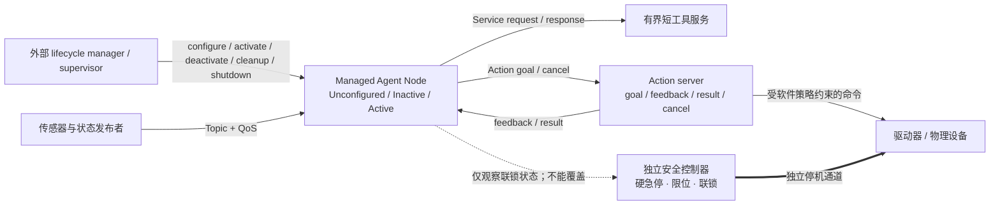

# ROS 2 + DDS Agent Lifecycle：为物理智能体选择通信语义与受管状态

物理智能体的“消息”不是同一种东西：激光雷达帧是持续数据流，读取一次配置是短请求，移动到目标点是有反馈、可请求取消的长任务。ROS 2 以 Topic、Service 与 Action 区分这三类通信语义，再由 DDS/RMW 的 QoS、Executor、Callback Group 和 Managed Node 生命周期约束交付、调度和运行状态。

这组原语仍然没有把安全问题自动解决。Action cancel 是协作式请求，抢占由 action server 或应用策略实现；Node 进程存活、完成配置、处于 Active 和获得业务执行授权是四个不同命题。硬急停、独立安全回路、驱动器限位和经过验证的实时控制必须保留在 ROS 2 通信与 Agent 推理之外的安全边界。

## 学习问题

1. Topic、Service 与 Action 分别适合持续/一对多数据流、有界短请求响应和长任务 goal/result/feedback/cancel 中的哪一种？
2. DDS QoS 的 history、depth、reliability、durability、deadline 与 liveliness 各控制什么，哪些策略不兼容会让端点根本无法通信？
3. Executor 的 wait set 能看到多少队列信息，为什么 Multi-Threaded Executor 加 Reentrant Callback Group 也不等于确定并发或实时保证？
4. Managed Node 的 configure、activate、deactivate、cleanup、shutdown 与 error processing 如何把“活着”“可用”“获准执行”拆开？
5. Agent 取消目标、收到新目标、超时或失去 liveliness 时，谁负责停止推理、撤销工具和让物理设备进入安全状态？

## 一页摘要

| 层次 | Jazzy 已证实事实 | Agent 迁移解释 | 不能推出 |
| --- | --- | --- | --- |
| Topic | 异步发布/订阅，适合连续数据；同一 Topic 可有多个 publisher 与 subscriber | 传感器、世界状态、心跳和审计事件流 | 每条消息必达、全局顺序或业务事务 |
| Service | 有界、短时 request/response；不提供取消 | 快速查询、幂等配置检查、短工具调用 | 长任务、可抢占任务或有物理副作用的 exactly-once |
| Action | 长任务含 goal、feedback、result 与 cancel 接口 | 规划、导航、操作臂任务和长工具执行 | cancel 自动完成、抢占自动安全、设备已停止 |
| DDS QoS | 端点按 Request-vs-Offered 匹配；history/depth 管队列，reliability/durability/deadline/liveliness 描述不同交付或时序属性 | 按数据风险和新鲜度定义契约，并监听不兼容、deadline missed、liveliness lost 事件 | “reliable”代表应用正确、deadline 触发停止、liveliness 代表设备安全 |
| Executor / Callback Group | Executor 从 wait set 取 ready entity；Mutually Exclusive 禁止组内并行，Reentrant 允许并行 | 隔离控制回调、推理回调和管理回调，显式配置线程与优先级 | FIFO、无优先级反转、允许并行就必然并行 |
| Managed Node | 外部管理者请求 configure/activate/deactivate/cleanup/shutdown；错误进入 ErrorProcessing | supervisor 在资源、策略和联锁校验后才激活 Agent | Active 自动等于有业务权限或满足物理安全条件 |

**已证实事实**：本文只讨论 ROS 2 Jazzy Jalisco。Jazzy 于 2024-05-23 发布、支持到 2029-05；源码固定到 `ros2/ros2` 的 `release-jazzy-20260618`（`a38203a7da336eb123122bc241f53e78d2a0284f`）。该 release 的 `ros2.repos` 固定 `ros2/rclcpp` 为 tag `28.1.21`（`53cf81e42e6530c2ed7a23489d6640966dccd083`）。访问日期为 2026-07-22。

**事实边界**：Managed Node 设计文档写于 2015-06、最后修改于 2021-02，不是 Jazzy release artifact；本文只用它解释生命周期合同，并以同批 Jazzy `rclcpp_lifecycle` 接口和实现核对 callback/transition 接缝。Rolling、Kilted、Lyrical 以及其他发行版新增 Executor 或接口行为一律不并入结论。

## 事实边界

**已证实事实**：Jazzy 文档把 Topic 定义为持续、异步、一向的 pub/sub 数据流，允许多个发布者和订阅者；Service 是短时同步 request/response；Action 是长时间运行、可返回周期 feedback 与 result、支持 cancel 的接口。Action 的 goal、result、feedback 语义不等于一个普通 HTTP 请求被拉长。

**已证实事实**：`rclcpp_action::Server` 要求应用提供 goal、cancel 和 accepted 三个 callback。Jazzy `server.hpp` 明确说：接受 cancel 仅表示服务器会“尝试取消”，不表示目标实际已经取消；执行代码还要观察 `is_canceling()`、停止工作并调用 `canceled(result)` 进入终态。

**基于证据的推断**：因此 preemption 不是 Action 自动施加的安全停止。新 goal 到来时，action server/application 必须选择拒绝、排队、并行，或先让旧 goal 进入协作取消并确认设备已停后再执行新 goal。不同业务可以定义不同政策，但不能把“发出 cancel”记录成“物理动作已经停止”。

**已证实事实**：DDS QoS 的 Request-vs-Offered 匹配发生在 publisher/subscription 端点。只要任一影响兼容性的策略不能满足，请求端和提供端就不会建立连接、不会传递消息。history/depth 决定本地保留方式和上限，本身不是业务背压协议。

**个人分析**：ROS 2 提供通信、调度和生命周期原语；身份授权、长任务幂等、物理联锁、风险预算、审计与恢复编排仍属于应用和现场安全系统。本文的 Agent 映射是跨域设计，不是 ROS 2 官方的 Agent 参考实现。

## 架构图

下面的图把数据接口、受管状态与独立安全链放在三个可辨认的平面中；箭头表示控制或信息流，不表示 DDS 自带事务。

**可访问性说明**：图的 `accTitle` 和 `accDescr` 给出等价文本；实线是 ROS 2/应用控制流，粗线是绕过 Agent 的独立安全停机通道，虚线只表示 Agent 读取安全状态。

## 控制权与任务流

1. **发现与身份**：节点进入 DDS domain 前使用 SROS2/DDS Security enclave 的身份材料；governance 和 permissions 控制允许的 domain、publish/subscribe 资源。应用还要把操作者、Agent、goal 与设备身份绑定。
2. **配置但不执行**：外部 lifecycle manager 请求 `configure`。节点加载参数、预分配资源、创建 publishers/subscriptions/action server，并进入 Inactive；此时“进程 alive”和“configured”成立，但不应发出受管输出。
3. **授权检查**：supervisor 检查策略版本、设备健康、权限、资源余量和物理联锁。业务授权是应用状态，不是 ROS lifecycle state；不满足就保持 Inactive。
4. **激活**：`activate` 成功后进入 Active，受管 publisher/处理链可工作。持续传感器与状态走 Topic；短、有界、最好幂等的查询走 Service；长任务走 Action。
5. **Action 执行**：server 接受 goal，周期发布 feedback；执行循环检查 deadline、资源预算、授权租约、联锁与 `is_canceling()`。result 只在真实终态后发布。
6. **协作取消与抢占**：client 请求 cancel；server policy 可接受或拒绝。接受后执行器停止生成新命令、撤销可撤销工具、等待驱动器 receipt/安全状态，再调用 `canceled`。若新 goal 触发 preemption，必须复用这条应用级停止政策，不能并行覆盖旧命令。
7. **失效与恢复**：deadline missed、liveliness lost、QoS incompatible、callback 超时或设备告警进入观测与策略输入。supervisor 可 deactivate、cleanup、重新 configure；callback 抛错或返回 ERROR 时进入 ErrorProcessing，清理成功回 Unconfigured，否则到 Finalized。

| 通信选择 | 适合 | 必须附加的控制 | 拒绝使用的条件 |
| --- | --- | --- | --- |
| Topic | 连续感知、姿态、健康、事件；一对多/多对多流 | schema/version、QoS profile、时间戳、序号、丢弃与陈旧政策 | 需要单次确认、业务事务或可取消长任务 |
| Service | 短时查询、快速计算、幂等配置读取 | timeout、request ID、重试预算、服务端去重、副作用边界 | 运行时间无上界、要 feedback/cancel、设备效果不清楚 |
| Action | 导航、操作臂、长推理和多步工具任务 | goal ID、接纳政策、feedback 节奏、cancel checkpoint、终态 receipt | 无法定义安全取消、无法观察结果、把 cancel 当硬急停 |
| Lifecycle | Agent 资源准备、启停和故障恢复 | 外部 manager、授权门、转换超时、失败回滚、审计 | 只靠进程启动就默认执行，或让节点自行扩大权限 |

## 关键源码导读

| Jazzy 固定接缝 | 已证实行为 | 设计含义 | 不能推出 |
| --- | --- | --- | --- |
| [`ros2.repos`](https://github.com/ros2/ros2/blob/a38203a7da336eb123122bc241f53e78d2a0284f/ros2.repos) | `release-jazzy-20260618` 固定 `rclcpp` tag `28.1.21` | 文档、元发行版和源码属于同一 Jazzy release 语境 | 任意 Rolling HEAD 行为适用于本文 |
| [`callback_group.hpp`](https://github.com/ros2/rclcpp/blob/53cf81e42e6530c2ed7a23489d6640966dccd083/rclcpp/include/rclcpp/callback_group.hpp) | Reentrant 允许自身/组内/组间并行；Mutually Exclusive 禁止自身与组内并行 | 共享设备句柄放互斥组，独立只读处理可放不同组 | 允许并行就一定并行，或互斥组提供跨进程锁 |
| [`executor.cpp`](https://github.com/ros2/rclcpp/blob/53cf81e42e6530c2ed7a23489d6640966dccd083/rclcpp/src/rclcpp/executor.cpp) | Executor 等待 ready work，再选择并执行 entity | callback 何时运行取决于 Executor、线程、ready 状态和组约束 | 完整队列长度、严格 FIFO、优先级和 WCET 保证 |
| [`server.hpp`](https://github.com/ros2/rclcpp/blob/53cf81e42e6530c2ed7a23489d6640966dccd083/rclcpp_action/include/rclcpp_action/server.hpp) | 应用 callback 接受/拒绝 goal 与 cancel；接受 cancel 只表示尝试取消 | cancel/preemption policy 属于 action server/application | 自动中断执行线程、自动撤销工具或安全停止设备 |
| [`server_goal_handle.hpp`](https://github.com/ros2/rclcpp/blob/53cf81e42e6530c2ed7a23489d6640966dccd083/rclcpp_action/include/rclcpp_action/server_goal_handle.hpp) | `canceled(result)` 只可在 canceling 状态调用并进入终态 | 执行循环必须主动观察、清理并提交终态 | cancel request 与 canceled result 同时发生 |
| [`lifecycle_node_interface.hpp`](https://github.com/ros2/rclcpp/blob/53cf81e42e6530c2ed7a23489d6640966dccd083/rclcpp_lifecycle/include/rclcpp_lifecycle/node_interfaces/lifecycle_node_interface.hpp) 与 [`lifecycle_node.cpp`](https://github.com/ros2/rclcpp/blob/53cf81e42e6530c2ed7a23489d6640966dccd083/rclcpp_lifecycle/src/lifecycle_node.cpp) | 暴露 configure/cleanup/shutdown/activate/deactivate/error callbacks 和 transition 触发接口 | lifecycle manager 有统一控制接缝，节点可实现资源准备与清理 | Active 自动通过权限、联锁或安全认证 |

**已证实事实**：Jazzy Executor 文档说明消息留在 middleware 层，wait set 对每个队列只给一个 ready 标志；积压时 Executor 只知道“有消息”，按 round-robin 处理 ready entity，而非严格 FIFO。默认 Executor 还可能出现混合调度、优先级反转和缺少显式执行顺序的问题。

**基于证据的推断**：队列深度、DDS resource limits、callback 最坏执行时间和 Executor 线程必须一起容量规划。仅把 `depth` 调大可能把过载变成长尾和陈旧命令；仅启用 Multi-Threaded Executor 又可能把共享设备句柄变成竞态。

## 架构决策与权衡

**通信与 QoS 决策表**

| 策略 | 精确语义 | 常见选择 | 风险与控制 |
| --- | --- | --- | --- |
| History / Depth | Keep Last 只保留最近 N 个 sample；depth 仅对 Keep Last 有意义；Keep All 受 middleware resource limits 约束 | 高频传感器常用小 depth 的 Keep Last；不可丢审计不要直接假设 Keep All 足够 | depth 太小会丢历史，太大产生陈旧积压；审计另用持久日志 |
| Reliability | Best Effort 尽力交付可丢；Reliable 重试以保证 DDS sample 交付 | 相机/雷达可容忍新帧覆盖旧帧时选 Best Effort；低频控制状态常选 Reliable | Reliable 会增加等待/带宽，也不保证业务 effect；设置超时和限流 |
| Durability | Volatile 不为 late joiner 保留；Transient Local 由 publisher 为后加入订阅者保留 sample | 配置/静态状态可考虑 Transient Local；实时流常用 Volatile | 迟到数据可能过期；每条消息带时间戳/version 并拒绝陈旧状态 |
| Deadline | 期望连续 sample 间的最大间隔，可产生 missed event | 控制状态和传感器健康设明确 deadline | 事件只是诊断/策略输入，不会自动停机；安全控制器另行 watchdog |
| Liveliness / Lease | publisher 在 lease 内表明仍 alive；Automatic 或 Manual By Topic | 关键 command publisher 可用更严格 liveliness 与 lease | alive 不等于 callback 正常、设备执行或授权有效；联合反馈和设备健康 |
| Compatibility | subscriber 请求最低质量，publisher 提供最高质量；所有兼容策略都满足才连接 | 部署前生成 Topic/Service/Action QoS contract 并在启动时检查 event | 同名同类型仍可能零数据；观测 incompatible QoS 并 fail closed |

**个人分析**：对物理 Agent，建议把 QoS profile 当可版本化接口合同，而不是散落在代码中的默认值。profile 包含 topic/type、history/depth、reliability、durability、deadline、liveliness、lease、最大可接受年龄和过载行为；publisher 与 subscriber 在部署前做兼容测试，运行时把 incompatible、deadline missed 和 liveliness lost 变成明确告警。

**个人分析**：实时控制 callback 与模型推理 callback 不应共享无界执行队列。前者放独立 Mutually Exclusive group/Executor 和受控 OS 调度，预分配内存并测量 WCET；后者有并发、CPU/GPU、token 和队列预算。需要确定处理序列时评估 `rclcpp::WaitSet` 或更适合实时约束的执行方案，而不是宣称普通 Executor 已提供 hard real-time。

## 生产化分析

| 生产控制 | 最小机制 | 必须观测 | 失效与恢复 |
| --- | --- | --- | --- |
| 身份与权限 | SROS2/DDS Security identity/permissions CA、签名 governance/permissions、每角色 enclave、default deny；应用层 goal/tool capability | enclave、证书指纹/到期、subject、permission deny、goal/device/tool scope | 撤销并轮换凭证；权限材料无效保持 Inactive；不得回退 permissive |
| 生命周期授权 | 外部 lifecycle manager；`alive/configured/active/authorized` 四态分离；激活前校验策略与联锁 | lifecycle state/transition、policy version、authority lease、activation reason | deactivate → cleanup → configure；失败进 ErrorProcessing/Finalized 并升级人工 |
| 资源限额 | Executor 线程、callback WCET、DDS depth/resource limits、CPU/GPU/内存、Action 并发和 feedback 频率上限 | queue age、callback latency、deadline miss、drop、OOM、goal admission/reject | admission control、丢弃陈旧感知、降级推理；保留安全 callback 预算 |
| Backpressure | 有界 Keep Last/队列、按数据类别丢弃、Service 限时、Action goal admission、发布限速 | DDS backlog 的替代指标、sample age、in-flight goal、reject、feedback lag | 停收新 goal、取消低优先任务、保留最新状态；禁止无界重试 |
| 幂等与效果 | request/goal UUID、operation ID、设备 command sequence、下游 idempotency key、terminal receipt | duplicate、retry、unknown effect、base/result version、最终设备状态 | 同 ID 返回既有结果；unknown effect 禁止盲重放并转人工核对 |
| Cancel race / preemption | 单一终态提交、cancel checkpoint、旧 goal fencing token、新 goal 接纳政策 | cancel requested/accepted/observed/canceled 时间、succeed-vs-cancel race、旧命令到达 | 先 fence 旧命令并确认安全状态，再启动新 goal；迟到 cancel 返回真实终态 |
| Deadline / liveliness | DDS 事件 + 应用 watchdog + 设备 heartbeat；明确 lease 与恢复阈值 | offered/requested deadline miss、liveliness change、设备反馈年龄 | 软件 deactivate/降级；驱动器 watchdog 进入安全状态；不是自动急停 |
| 物理安全 | 硬急停、独立 safety PLC/controller、限位/力矩/速度包络、双通道联锁 | 急停回路、联锁、驱动器 fault、真实速度/力矩/位置 | 独立回路切断/安全停机；ROS 恢复前必须人工或经认证的复位流程 |
| 可观测与恢复 | 统一 trace：goal、callback group、executor、topic sequence、lifecycle transition、device receipt | 端到端 latency、QoS events、状态转换耗时、cancel latency、恢复次数 | 保留失败节点可诊断状态；按 runbook 重启/重配，不以“进程在”宣布恢复 |

**安全。已证实事实**：SROS2 keystore 把 identity 与 permission trust chain 分开；enclave 具有私钥/证书、签名 permissions、domain governance 和 CA 材料。Access Controls 可以限制 DDS topic 的 publish/subscribe，并在 `ROS_SECURITY_STRATEGY=Enforce` 时拒绝不允许的通信。

**安全。基于证据的推断**：DDS topic 权限仍不足以授权某个 Action goal 的参数、风险等级或物理设备范围。应用必须在 goal acceptance 和每次危险 command 前校验 subject、设备、策略版本、租约、参数包络和联锁；模型无法读取或改写用于判定的密钥与安全策略。

**恢复。个人分析**：演练应覆盖 QoS 不兼容导致“节点都在但零数据”、callback group 配错导致 deadlock、Service 超时后的重复副作用、Action cancel 与 success 竞争、旧 goal 命令迟到、liveliness 丢失、lifecycle configure/activate 失败、Executor 过载、DDS participant 重建和安全回路触发。恢复验收要同时证明通信、应用状态、授权和物理状态，而不是只看进程 PID。

## 可迁移经验

### 可直接复用的机制

- 用 Topic、Service、Action 三种接口把持续流、短请求响应和长任务分开，避免所有 Agent 消息都塞进同一种队列或 RPC。
- 把 QoS profile 作为版本化契约，显式选择 history/depth/reliability/durability/deadline/liveliness，并监测兼容性事件。
- 用 goal/feedback/result/cancel 表达长任务；保存 goal ID、进度、终态和设备 receipt，使任务可观察、可对账。
- 用 Callback Group 声明组内并发约束，用 Executor/线程/OS 调度真正实现并发；控制、推理和管理 callback 分池。
- 用 Managed Node 将资源准备、开始处理、停止处理、清理、关闭和错误恢复做成外部可管理状态机。
- 由外部 supervisor/lifecycle manager 执行转换、监控错误和恢复，不让 Agent 自己把“活着”升级成“获准执行”。
- 在 DDS 安全身份与 topic 权限之上叠加应用层 goal/tool/device 授权，默认拒绝超范围操作。

### 只能有限类比的部分

- Topic 像事件流，但 DDS discovery、QoS 匹配、实时数据分发和进程内执行边界不同于普通 Web pub/sub；不能只用“消息总线”概括。
- Service 可以映射短工具调用，但网络重试和客户端 timeout 不会回滚服务端副作用；有副作用仍需 operation ID 与幂等实现。
- Action 可以映射长 Agent 任务，但 cancel 是协作请求；模型调用、外部工具和物理设备必须各自提供取消点或补偿路径。
- DDS Reliable 保证的层次是 sample 交付，不是 Agent 推理正确、工具 exactly-once 或物理目标达成。
- Deadline/liveliness 适合发现时序或参与者异常，但不是授权撤销、业务 SLA 或认证安全 watchdog 的替代品。
- Reentrant Callback Group 只允许并行；实际并发取决于 Executor 类型、线程数、其他 ready work、锁和 OS 调度。
- Active 生命周期可表示开始处理，却不自动携带用户、任务、设备和风险授权；应用必须维持独立 `authorized` 状态。

### 不应照搬的部分

- 不要把所有 Agent 交互都当 Topic。需要单次结果、长任务 feedback/cancel 或生命周期转换时，应使用相应语义并保留边界。
- 不要用长 Service 执行导航、操作臂或长推理；它没有 Action 的 goal 状态、feedback 和 cancel 协议。
- 不要把 cancel acceptance、client timeout 或 preemption request 记录为设备已经停止；只有 action server/application 与设备 receipt 能确认软件终态。
- 不要假设新 goal 自动抢占旧 goal。拒绝、排队、并行、取消旧目标后切换都必须由 action server/application policy 明确定义。
- 不要把 QoS Reliable、Transient Local、deadline 或 liveliness 宣称为业务事务、持久工作流、物理安全或故障恢复的完整方案。
- 不要因使用 Multi-Threaded Executor 就宣称并行、FIFO 或 hard real-time；Callback Group、线程、锁、队列和 OS 优先级共同决定执行。
- 不要把进程 alive、节点 configured、生命周期 Active 与业务 authorized 合并成一个绿色状态。
- 不要让 ROS 2 网络、Executor、Agent 模型或 Action cancel 取代硬急停、独立安全回路、驱动器限位和认证过的实时控制器。

## 来源

**发行版与版本一致性（已证实事实，访问日期 2026-07-22）**

- [ROS 2 distributions](https://docs.ros.org/en/jazzy/Releases.html) 与 [Jazzy Jalisco release page](https://docs.ros.org/en/jazzy/Releases/Release-Jazzy-Jalisco.html)：Jazzy 发行于 2024-05-23、EOL 为 2029-05，是本文唯一 distribution。
- [`ros2/ros2` release `release-jazzy-20260618`](https://github.com/ros2/ros2/releases/tag/release-jazzy-20260618) 与 [固定树 `a38203a7da336eb123122bc241f53e78d2a0284f`](https://github.com/ros2/ros2/tree/a38203a7da336eb123122bc241f53e78d2a0284f)：本文采用的 Jazzy release bundle。
- [该 release 的 `ros2.repos`](https://github.com/ros2/ros2/blob/a38203a7da336eb123122bc241f53e78d2a0284f/ros2.repos)：明确固定 `ros2/rclcpp` 为 `28.1.21`；对应完整 SHA 为 [`53cf81e42e6530c2ed7a23489d6640966dccd083`](https://github.com/ros2/rclcpp/tree/53cf81e42e6530c2ed7a23489d6640966dccd083)。

**Jazzy 官方文档（已证实事实）**

- [Interfaces: Topics, Services, Actions](https://docs.ros.org/en/jazzy/Concepts/Basic/Interfaces-Topics-Services-Actions.html) 与 [About Actions](https://docs.ros.org/en/jazzy/Concepts/Basic/About-Actions.html)：持续数据、短请求响应、长任务、goal/feedback/result/cancel 与 action server 责任。
- [QoS settings](https://docs.ros.org/en/jazzy/Concepts/Intermediate/About-Quality-of-Service-Settings.html)：history/depth、reliability、durability、deadline、liveliness、Request-vs-Offered 兼容和 QoS events。
- [Executors](https://docs.ros.org/en/jazzy/Concepts/Intermediate/About-Executors.html) 与 [Using Callback Groups](https://docs.ros.org/en/jazzy/How-To-Guides/Using-callback-groups.html)：wait set、ready flag、round-robin 非 FIFO、Single/Multi-Threaded Executor、Mutually Exclusive/Reentrant 和实时边界。
- [Security keystore](https://docs.ros.org/en/jazzy/Tutorials/Advanced/Security/The-Keystore.html) 与 [Access Controls](https://docs.ros.org/en/jazzy/Tutorials/Advanced/Security/Access-Controls.html)：DDS identity/permissions trust chain、enclave、governance、签名 permissions 与 topic publish/subscribe 控制。

**生命周期规范与 Jazzy 固定源码（已证实事实）**

- [Managed nodes design](https://design.ros2.org/articles/node_lifecycle.html)：Unconfigured/Inactive/Active/Finalized，configure/activate/deactivate/cleanup/shutdown、ErrorProcessing，以及外部 supervisory process/lifecycle management software 的职责。该文档最后修改于 2021-02，本文以 Jazzy 源码核对实现接缝，不把它伪装成 2026 release note。
- [`callback_group.hpp`](https://github.com/ros2/rclcpp/blob/53cf81e42e6530c2ed7a23489d6640966dccd083/rclcpp/include/rclcpp/callback_group.hpp) 与 [`executor.cpp`](https://github.com/ros2/rclcpp/blob/53cf81e42e6530c2ed7a23489d6640966dccd083/rclcpp/src/rclcpp/executor.cpp)：callback 并发合同与 Executor 等待/选择/执行路径。
- [`rclcpp_action/server.hpp`](https://github.com/ros2/rclcpp/blob/53cf81e42e6530c2ed7a23489d6640966dccd083/rclcpp_action/include/rclcpp_action/server.hpp) 与 [`server_goal_handle.hpp`](https://github.com/ros2/rclcpp/blob/53cf81e42e6530c2ed7a23489d6640966dccd083/rclcpp_action/include/rclcpp_action/server_goal_handle.hpp)：goal/cancel callback、cancel 接受边界、`is_canceling` 与 `canceled` 终态。
- [`lifecycle_node_interface.hpp`](https://github.com/ros2/rclcpp/blob/53cf81e42e6530c2ed7a23489d6640966dccd083/rclcpp_lifecycle/include/rclcpp_lifecycle/node_interfaces/lifecycle_node_interface.hpp) 与 [`lifecycle_node.cpp`](https://github.com/ros2/rclcpp/blob/53cf81e42e6530c2ed7a23489d6640966dccd083/rclcpp_lifecycle/src/lifecycle_node.cpp)：Jazzy 的生命周期 callback 与 transition API。

**证据边界说明**：Agent 通信映射、业务 authority、goal/tool/device 细粒度授权、资源预算、幂等 operation ID、cancel race fencing、独立安全回路、观测字段和恢复 runbook 是依据 Jazzy 原语形成的“基于证据的推断”或“个人分析”，不是 ROS 2 官方的自动保证。Rolling、Kilted、Lyrical 和未固定分支源码不支持本文结论。
