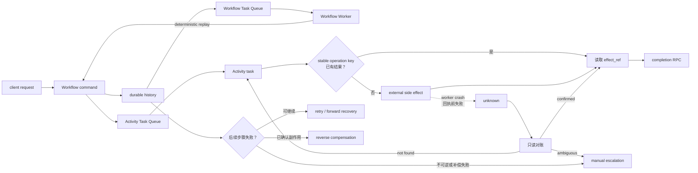

# Temporal Durable Execution + Saga：为长时智能体任务建立可恢复边界

付款已经成功，确认邮件尚未发送，执行器却在这两步之间崩溃。重启之后，系统必须回答的不是“任务要不要再跑一次”，而是“哪一段历史可以重放，哪个外部动作绝不能重复”。

Temporal 用事件历史恢复控制状态，Saga 用新的业务动作补偿已经提交的步骤。前者解决“编排如何继续”，后者解决“部分成功如何收束”；它们都不会自动把付款、邮件、工单、LLM 调用或网络写入变成业务上的恰好一次。

本文以 Temporal 官方文档、1987 年《Sagas》和固定上游源码为证据，详细版本与文件锚点收进证据卡。Workflow 重放契约由官方文档支持。快速取消只在本文核对的服务端能力与 Go/Java SDK 版本组合中成立，不能外推到全部 SDK 或部署。

## 学习问题

1. Event History 如何恢复 Workflow 状态，确定性重放又限制了哪些代码？
2. Workflow、Activity、外部系统与人工分别拥有什么控制权？
3. 为什么 Activity 完成可被重放复用，外部副作用却仍可能发生多次？
4. 超时、重试、取消、对账与 Saga 补偿应在什么条件下分流？
5. 权限、费用、版本和不可逆动作如何成为显式生产边界？
6. 哪些机制能迁移到长时 Agent，哪些类比会制造错误保证？

## 一页摘要

**已证实事实**：Temporal 把 Workflow 的决策记录为有序 Event History。Worker 崩溃后，Workflow 代码以历史输入和已记录结果重建内存状态；同一历史必须产生相同顺序的 Commands，否则可能出现 nondeterminism error。

**已证实事实**：API、LLM、数据库和其他外部交互应放入 Activity。历史已经记录的 Activity 完成结果会在 Workflow replay 时复用；但若外部调用成功、Worker 在 completion RPC 前崩溃，历史中没有完成事件，后续 attempt 仍可能再次执行。

**基于证据的推断**：可靠边界不是“所有动作都重放”。Workflow 重放决策，Activity 重试执行，外部目标按稳定业务键去重，Saga 对已确认的副作用做语义补偿。外部结果为 `unknown` 时必须冻结新写入，先对账或转人工。

这张表回答“崩溃后每一层究竟负责什么”。

| 层 | 保存或执行什么 | 恢复动作 | 不能保证 |
| --- | --- | --- | --- |
| Workflow | 顺序、状态机、定时器、预算、审批、补偿指针 | 从 Event History 确定性重放 | 外部副作用恰好一次 |
| Activity | LLM、工具、API、DB、文件与网络 I/O | 按 timeout/retry 重新执行，或从 heartbeat details 恢复 | 一个 attempt 已停止、调用只发生一次 |
| 外部系统 | 付款、邮件、资源、账本等业务事实 | 以稳定幂等键查询或返回原结果 | 补偿必然可行 |
| Saga/人工 | 已确认步骤、补偿顺序、审批与修复 | 反向补偿、向前恢复或人工处置 | 回到从未发生过的历史 |

结论是：Temporal 的耐久性覆盖控制面；业务效果能否安全恢复，仍取决于 Activity 边界、外部幂等契约和补偿设计。

## 事实边界

这一节区分“Temporal 直接保证的机制”与“应用必须补上的业务契约”。

**已证实事实**

- Workflow Definition、Workflow Type 与 Workflow Execution 是不同概念。执行通过 Commands 与 Events 推进；恢复依据是 Event History，而不是 Worker 内存快照。
- 相同输入与历史必须产生相同顺序的 Temporal API 调用。时钟、随机、网络、数据库、LLM 与工具结果若未通过 Temporal 的重放安全 API 或 Activity 记录，就不能直接参与 Workflow 决策；存量历史上的 Command 变化需要 Workflow Versioning/Patching。
- Activity 可执行非确定性代码，参数和结果可进入历史。失败重试默认从头开始；长任务可把安全进度放进 heartbeat details，供下一个 attempt 恢复。
- Activity 默认有 Retry Policy，Workflow Execution 默认没有。当前文档所列默认退避并不是 Agent 的费用或风险预算，生产系统仍要限制总时间、尝试次数、token、供应商配额和写入次数。
- Task Queue 是 Worker 主动长轮询的持久路由与负载均衡边界。任务可在 Worker 下线时保留，同一队列的任意 Worker 都可能接单，多分区也不承诺全局 FIFO；因此本地内存不能承担幂等或业务总序。
- Saga 允许已提交子事务释放资源，其他事务可能看到中间结果。`Ci` 是对 `Ti` 的语义修复，不是字节级回滚，也不撤销其他参与者已经观察到的事实。

**基于证据的推断**

- Event History 是控制面的真相，不是外部业务系统的真相。`ActivityTaskTimedOut` 不证明付款未发生，“已请求取消”也不证明远端写入已停止。
- `Workflow Run ID + Activity ID` 能为同一 Run 的 attempts 提供稳定身份；跨 Run 恢复还要使用不随 Run 改变的业务键。目标系统必须原子地记录键、请求哈希和结果，才能拒绝“同键不同输入”并复用“同键同输入”的原结果。
- LLM 调用进入 Activity 只解决确定性重放问题。提示、模型、参数、工具 schema、上下文快照和政策版本仍应固定为输入，结果需内容哈希和费用账本；否则重试会放大成本、配额与数据暴露。
- Saga 只应在正向步骤有可对账成功证据后入补偿栈。外部成功与 Workflow 记录成功之间无法仅靠内存标志原子化，必须以目标侧幂等或只读对账处理 `unknown`。

**个人分析**

Temporal 不知道退款是否修复了扣款的会计后果，也不知道收件人是否已经看过错误邮件。补偿动作、可补偿时限、审批人、残余风险和不可逆动作都属于应用契约；补偿失败或结果不明必须成为有 owner、SLA 和权限门的耐久状态。

原始 Saga 论文甚至用“发射导弹”说明某些现实动作不可撤销，也指出确定性代码缺陷会让补偿反复失败。它给出的出路是备选补偿实现或人工修复，而不是无限重试同一缺陷。

模型供应商是否支持请求幂等、结果查询与计费去重，也必须逐 API 验证。本地结果表只能抑制已知成功的重复请求，不能消除“供应商已处理、客户端未收到响应”的窗口。

本文只讨论顺序 Saga。并行分支必须按依赖图计算补偿偏序，不能把 fork/join 结果随意压成一个全局 LIFO 栈。

  
证据：固定版本与适用边界

  - **来源截断：** `2026-07-22`
  - **服务端：** `temporalio/temporal@955948007cc6d9d94fa8ef484225954bd9328451`
  - **Go SDK：** `temporalio/sdk-go@3cebc26908119368df3911df6146f756bad3882b`
  - **Java SDK：** `temporalio/sdk-java@6d09a341c14daeddf9b3795cd43721de770fec2c`
  - **边界：** 官方 Workflow/Event History 文档支持语言级重放契约；固定服务端源码只定位 Command、Activity 状态、重试、计时任务与 Task Queue 接缝。Go/Java SDK 仅核对快速取消 callback，不证明其他 SDK 或版本具有相同行为。

  
证据：当前文档中的默认重试参数

  - **Activity：** 默认 Retry Policy 的初始间隔为 1 秒、系数 2.0、最大间隔 100 秒、尝试次数不限。
  - **Workflow Execution：** 默认不重试。
  - **边界：** 这些是来源截断日的文档默认值，不是费用、安全或业务终止保证；显式生产配置优先。

## 架构图

阅读下图时先找三条路径。Workflow replay 只重建决策，Activity retry 可能再次触碰外部世界，Saga compensation 则创建新的业务事实。

图中的说明性任务流是：

`client request → Workflow command → durable history → Activity task → external side effect → worker crash → replay → retry / compensation / manual escalation`

**个人分析**：外部账本只有与真实副作用处于同一原子边界，或由外部 API 原生实现时，才能消除重复效果。先在本地写“即将发送”再调用不支持幂等的邮件 API，仍有双写窗口。

`planned/submitted/confirmed/failed/unknown/compensated` 能暴露不确定性，却不会凭空创造外部原子性。

## 控制权与任务流

**说明性场景：付款成功后 Worker 崩溃。** 这个场景不声称来自某个真实事故，只用前述机制解释一次恢复。

1. 客户端启动 Workflow。Workflow 生成调度付款 Activity 的 Command，Service 将事件写入 Event History。

2. Activity Worker 以稳定业务键请求支付系统。支付成功并返回付款号，但 Worker 在向 Temporal 报告完成前崩溃。

3. 新 Worker 从历史重放 Workflow。由于历史只有“已调度”而没有“已完成”，Temporal 可以按 Retry Policy 产生新 Activity attempt。

4. 新 attempt 不能直接再扣款。它先用相同业务键查询外部账本：`confirmed` 时返回原付款号，`not_found` 时才允许重试，`ambiguous` 时冻结后续写入并进入人工对账。

5. 付款确认后 Workflow 才把 `effect_ref` 与退款补偿入栈，再调度邮件 Activity。若后续失败，系统按业务条件选择重试、退款补偿或保留付款并人工处理。

这个流程也划清控制权。Workflow 决定状态、顺序、预算、审批与补偿指针；Activity 获得网络、LLM、数据库和工具 capability。外部系统裁定真实业务状态；人工只通过 Signal/Update 等耐久输入改变流程，不直接篡改 Workflow 内部字段。

超时与取消回答的是不同问题：

| 机制 | Temporal 语义 | 业务边界 |
| --- | --- | --- |
| `Schedule-To-Start` | 一次 Task 等待 Worker 的上限；该超时不会因 Retry Policy 在同一队列重试 | 容量不足不是业务失败，需要备用队列/区域或明确重路由 |
| `Start-To-Close` | 单个 attempt 的上限，可触发后续 attempt | 超时不证明旧网络请求已停止，新旧 attempt 可能并存 |
| `Schedule-To-Close` | Activity Execution 连同全部 retries 的总上限 | 应与 SLA、费用、配额和风险预算联动 |
| Heartbeat Timeout | 长 Activity 的心跳间隔上限；heartbeat details 可保存安全进度 | Heartbeat 不是跨系统提交，也不证明外部状态 |
| Cancellation | 协作式停止请求 | Activity 可以决定如何响应；取消不是强杀、补偿或外部回滚 |
| Retry Policy | Activity 默认指数退避，可配置最大尝试与 non-retryable errors | 限流、短暂网络错误、永久输入错误和未知副作用必须分流 |

**已证实事实**：官方 Activity 文档把 heartbeat 作为通用取消交付基线/回退。若 namespace/server 宣告 Worker Commands 能力且 Worker 注册 control queue，本文固定的服务端与 Go/Java SDK 还可发送带 task token 的 `CancelActivityCommand`。

该命令可触发本地 callback，不必等下一次 heartbeat，但只是版本相关的更快通知路径。

取消只能阻止尚未开始的正向工作，或请求运行中代码协作停止。已经取得 `effect_ref` 的动作必须进入补偿判断；补偿 Activity 本身也可能超时、重复执行或永久失败，因此同样需要幂等键、独立预算、最小权限和人工终态。

  
证据：Activity 输入与稳定身份契约

  - **LLM Activity 输入：** `task_id`、`step_id`、业务对象版本、提示/模型/参数/工具 schema 版本、权限和输入快照哈希。
  - **Temporal 身份：** Activity ID 应由稳定步骤键重建，不使用当前时间或随机串；它在一个 Workflow Run 的打开 Activity Executions 中唯一。
  - **外部身份：** 可采用 `tenant_id:business_task_id:step_name:step_version`。相同键与相同输入返回原结果，相同键与不同输入应拒绝冲突。
  - **边界：** `Workflow Run ID + Activity ID` 可稳定标识同一 Run 的重试；跨 Run 仍需不随 Run 改变的业务键，且由目标系统强制。

  
证据：快速取消的固定实现条件

  - **服务端条件：** 已开始 Activity 记录 control queue/clock 后，取消处理可按 queue 汇集 `CancelActivityCommand` 并创建 Worker Commands tasks。
  - **SDK 条件：** 固定 Go SDK 读取 Worker Heartbeats/Commands capabilities 并把 task token 映射到 Activity context cancel callback；固定 Java SDK 仅在 `isWorkerCommands()` 时启动 command worker，并将 token 交给运行上下文。
  - **边界：** 该路径证明“callback 可更早触发”，不证明 Activity 被强杀、远端请求停止或副作用回滚。

## 关键源码导读

源码阅读只需要回答四个问题：Command 在哪里成为持久状态，Activity retry 如何转移，Task 如何路由，快速取消如何到达运行中的 callback。

这些服务端接缝不负责证明业务幂等、补偿正确或 Workflow SDK 的语言级解释器行为。

最短路径是先看 Command 分派与 Activity mutable state，再看 retry timer 和 matching；只有部署依赖快速取消时，才继续核对固定 Go/Java SDK。

  
证据：Command 与 Activity 持久状态接缝

  - [`workflow_task_completed_handler.go` 275–330](https://github.com/temporalio/temporal/blob/955948007cc6d9d94fa8ef484225954bd9328451/service/history/api/respondworkflowtaskcompleted/workflow_task_completed_handler.go#L275-L330)：`handleCommand` 分派 Activity、Timer、Child Workflow、Signal、取消与终止等 Commands。
  - [`workflow_task_completed_handler.go` 467–571](https://github.com/temporalio/temporal/blob/955948007cc6d9d94fa8ef484225954bd9328451/service/history/api/respondworkflowtaskcompleted/workflow_task_completed_handler.go#L467-L571)：校验 Activity 属性、队列和输入，再写 scheduled event；当前重复 Activity ID 会使 Workflow Task 失败。
  - [`mutable_state_impl.go` 4187–4283](https://github.com/temporalio/temporal/blob/955948007cc6d9d94fa8ef484225954bd9328451/service/history/workflow/mutable_state_impl.go#L4187-L4283)：持久化 Activity ID、scheduled event、队列、四类 timeout、cancel 标志、attempt 与 retry policy。
  - **边界：** 这些锚点证明 Temporal 的持久调度状态，不证明目标服务已经按 Activity ID 去重。

  
证据：重试计时与 Task Queue 接缝

  - [`mutable_state_impl.go` 6758–6853](https://github.com/temporalio/temporal/blob/955948007cc6d9d94fa8ef484225954bd9328451/service/history/workflow/mutable_state_impl.go#L6758-L6853)：`RetryActivity` 处理无策略、取消、timeout 与 non-retryable failure，再计算 backoff、增加 attempt 并生成 retry task。
  - [`retry.go` 70–113](https://github.com/temporalio/temporal/blob/955948007cc6d9d94fa8ef484225954bd9328451/service/history/workflow/retry.go#L70-L113)：`nextBackoffInterval` 检查最大 attempts、最大间隔与过期时间。
  - [`timer_queue_active_task_executor.go` 527–615](https://github.com/temporalio/temporal/blob/955948007cc6d9d94fa8ef484225954bd9328451/service/history/timer_queue_active_task_executor.go#L527-L615)：retry timer 以 stamp/attempt/当前状态排除旧任务，再送往 matching。
  - [`matching/handler.go` 175–278](https://github.com/temporalio/temporal/blob/955948007cc6d9d94fa8ef484225954bd9328451/service/matching/handler.go#L175-L278)：Workflow/Activity Task 的添加与长轮询入口。
  - [`matching_engine.go` 583–669](https://github.com/temporalio/temporal/blob/955948007cc6d9d94fa8ef484225954bd9328451/service/matching/matching_engine.go#L583-L669)：task info 包含 namespace、workflow/run、scheduled event、过期时间和优先级，并可 sync match 或持久入队。
  - **边界：** 内部任务去重与恢复分发不认证上一个 Worker 是否已经完成外部写入。

  
证据：Go/Java SDK 的取消 callback 接缝

  - [`workflow_task_completed_handler.go` 670–768](https://github.com/temporalio/temporal/blob/955948007cc6d9d94fa8ef484225954bd9328451/service/history/api/respondworkflowtaskcompleted/workflow_task_completed_handler.go#L670-L768)：取消请求入历史，并在能力条件满足时创建 Worker Commands tasks。
  - [`internal_worker_heartbeat.go` 88–117、172–185、239–327](https://github.com/temporalio/sdk-go/blob/3cebc26908119368df3911df6146f756bad3882b/internal/internal_worker_heartbeat.go#L88-L117) 与 [`internal_task_handlers.go` 2122–2147、2388–2398](https://github.com/temporalio/sdk-go/blob/3cebc26908119368df3911df6146f756bad3882b/internal/internal_task_handlers.go#L2122-L2147)：固定 Go SDK 的 capability、control queue 与 context cancel 路径。
  - [`WorkerFactory.java` 291–349](https://github.com/temporalio/sdk-java/blob/6d09a341c14daeddf9b3795cd43721de770fec2c/temporal-sdk/src/main/java/io/temporal/worker/WorkerFactory.java#L291-L349)、[`WorkerCommandTaskHandler.java` 28–126](https://github.com/temporalio/sdk-java/blob/6d09a341c14daeddf9b3795cd43721de770fec2c/temporal-sdk/src/main/java/io/temporal/internal/worker/WorkerCommandTaskHandler.java#L28-L126)、[`ActivityExecutionContextFactoryImpl.java` 71–80](https://github.com/temporalio/sdk-java/blob/6d09a341c14daeddf9b3795cd43721de770fec2c/temporal-sdk/src/main/java/io/temporal/internal/activity/ActivityExecutionContextFactoryImpl.java#L71-L80) 与 [`HeartbeatContextImpl.java` 239–247](https://github.com/temporalio/sdk-java/blob/6d09a341c14daeddf9b3795cd43721de770fec2c/temporal-sdk/src/main/java/io/temporal/internal/activity/HeartbeatContextImpl.java#L239-L247)：固定 Java SDK 的能力门、handler 与本地取消请求。
  - **边界：** 只证明固定提交中的 callback 路径，不外推到旧版本、其他 SDK 或强制终止。

**基于证据的推断**：服务端的 `ActivityId`、`ScheduledEventId`、`Attempt`、`Stamp` 和 task token 适合组成外部请求证据。只有目标服务在同一原子写中检查稳定幂等键，才能抑制重复业务效果。

## 架构决策与权衡

第一个决策是 Activity 粒度。切点应同时满足：一个主要幂等键、一个可判定成功事实、一组可解释 timeout，以及明确的重试、对账和补偿策略。

| 条件 | 建议边界 | 代价或停止条件 |
| --- | --- | --- |
| 纯状态转移、定时等待、补偿顺序 | Workflow | 必须可确定重放，Command 变化要版本化 |
| LLM、HTTP、DB、文件、工具调用 | Activity | 可重复执行，必须查询或去重外部结果 |
| 单个写入有原生幂等 API | 一个窄 Activity | 核对参数冲突语义与幂等记录保留期 |
| 多个写入只有局部事务 | 多 Activity + Saga | 接受中间可见和弱隔离 |
| 长任务有安全进度 | Heartbeating Activity 或外部 callback/Signal | 人工等待不应占住周级 attempt |
| 副作用不可查询且不可幂等 | 冻结并人工决策 | 耐久编排无法补上外部契约缺口 |

第二个决策是恢复方向。对明确“未发生”的暂时失败重试；对“已经成功但整体意图无法完成”的动作补偿；对“可能成功”的动作先对账。业务允许剩余步骤最终完成时可向前恢复，但必须保证代码和输入可用，并设置终止预算；用户撤回、风险越界或流程不可继续时才向后补偿。

第三个决策是补偿是否能自动化。原始 Saga 的顺序为 `T1...Tj,Cj...C1`，但 `Ci` 只是业务修复。每个补偿都需要原 `effect_ref`、独立幂等键、前置状态、时窗、最小权限、重试上限与成功证据；若 `Cj` 永久失败，不能默认跳过它继续 `Cj-1`。

**个人分析**：人工介入不是耐久执行失败，而是明确的恢复分支。`needs_reconciliation`、`needs_compensation_approval`、`compensation_failed` 应可查询且有 owner/SLA；审批结果作为新历史事件进入 Workflow，而不是运维人员删除历史或修改内部状态。

## 生产化分析

生产检查应从故障动作出发，而不是只看“Workflow 仍在运行”。

**外部结果未知。** 每个步骤至少区分 `not_scheduled`、`running`、`succeeded`、`failed_retryable`、`failed_permanent`、`unknown`、`compensating`、`compensated`、`compensation_failed`。

只有 `succeeded + effect_ref` 可入补偿栈；`unknown` 禁止新写并必须对账。对账 Activity 应只读或使用独立权限，返回 `not_found/confirmed/rejected/pending/ambiguous`，不能在查询路径发起第二次写入。

**外部请求重复。** 原生幂等记录的保留期要长于 Workflow 最长恢复窗口，并返回原请求哈希和资源 ID。

没有原生支持时，应改造目标系统使用 inbox/dedup table 或可查询业务 ID。Worker 本地缓存、“成功后再写一行”和消息消费位点都不能替代目标侧原子去重。

**代码升级撞上旧历史。** Workflow 代码变化要使用 Temporal 版本机制，并以生产 History 做 replay test。Activity 输入/输出 schema 要向后兼容，补偿代码保留时间要覆盖最长可补偿任务。

Continue-As-New 后仍需传递稳定业务键、剩余预算、已成功 `effect_ref` 与补偿指针，不能只复制对话摘要。

**队列拥塞或供应商故障。** 分离 Workflow、只读、LLM、高风险写入和补偿队列，并分别限制并发、派发速率、供应商配额与租户公平性。

紧急停机应先阻止新的正向副作用，保留只读对账和经批准的补偿通道。停掉全部 Worker 可能让业务不一致失去处置能力。

**费用或重试失控。** 主线观测排队时延、attempt 分布、timeout、每任务费用、`unknown` 龄期、补偿成功率与人工队列龄期。完整字段放入下方证据卡。

Activity 内隐藏重试会与 Temporal 重试形成乘法预算。所有重试必须统一计数，并在 Workflow 中设置总门限。

  
证据：生产观测字段

  - **路由与执行：** namespace、task queue、workflow type、activity type、业务租户、Task Queue backlog、schedule-to-start latency、attempt 分布、start-to-close/heartbeat timeout、non-retryable 率、Workflow Task nondeterminism。
  - **业务与费用：** 每成功任务的 token、费用和写次数，`unknown` 停留时间，补偿成功率/耗时，人工队列龄期，重复副作用数。
  - **边界：** 指标要同时覆盖控制面健康与外部不确定性；“Workflow 仍在运行”不等于业务健康。

**权限与敏感数据泄露。** Task Queue 不是授权边界；Worker 凭证、namespace 访问、Activity 参数、租户绑定和目标系统权限必须分别校验。

Event History 会持久化输入、结果和部分失败信息，不应直接保存密钥、完整敏感文档或无界 LLM 上下文。应使用加密 payload/data converter、密钥引用、最小化输入和有保留期的外部 artifact store。补偿 Worker 的 capability 应更窄，并经过审批。

**补偿失败或动作不可逆。** 升级包要覆盖身份与状态、代码/政策版本、已完成步骤和 `effect_ref`、幂等键、外部查询证据、执行时间线、补偿栈、费用预算、风险和可执行选项。

每项必须有 owner、SLA、允许的 Signal/Update 与双人审批门。不得靠重启 Worker 或手动删历史“解决”补偿债务。

  
证据：人工升级包的完整字段

  - **身份与状态：** `workflow_id/run_id`、租户、业务对象、当前状态、代码/政策版本。
  - **执行证据：** 已完成步骤、`effect_ref`、幂等键、外部查询证据、attempt/timeout/cancellation 时间线、待补偿栈。
  - **处置约束：** 费用预算、风险、可执行选项、owner、SLA、允许的 Signal/Update 与双人审批门。
  - **边界：** 证据包支持授权处置，不授权直接删除历史或绕过业务审批。

发布前应注入回执前崩溃、重复 retry timer、LLM 429/超时、取消延迟、队列无 poller、补偿永久失败、人工回复重复投递和 replay 不兼容。

通过条件是每种故障都进入可证明成功、可对账未知或有 owner 的人工状态，并验证没有重复扣款、邮件或工单。

## 可迁移经验

### 可直接复用的机制

当任务跨进程、跨天，或需要等待人工与外部回调时，可以迁移以下机制：

1. 用确定性 Workflow 保存状态、顺序、定时、预算与补偿指针，把 LLM、工具和网络放进 Activity。
2. 用 Event History 重建控制状态，不依赖进程或模型“记得”上一步。
3. 用可重建 Activity ID、跨 Run 业务键、输入哈希与 `effect_ref` 串起所有 attempts。
4. 分开建模单 attempt、总 Activity、队列等待与 heartbeat，不用一个“任务超时”覆盖所有故障。
5. 顺序依赖明确且正向结果可对账时，才按 `Cj...C1` 反向补偿。
6. 不可逆、未知或补偿失败时，把人工决定作为耐久事件，并设置 owner、SLA 与权限门。

迁移条件是目标系统能提供稳定身份、查询证据或明确的人工终态；否则只能获得编排耐久性，不能获得副作用安全。

### 只能有限类比的部分

当团队试图把 Temporal 概念类比成数据库或消息语义时，应保留这些限制：

1. Activity 是 Temporal 的调度/结果单元，不是外部世界的 ACID 事务；它可能部分执行多次。
2. Workflow Execution 可完成一次，但 Workflow Function 会因 replay 多次运行；内联副作用会被放大。
3. Task Queue 可隔离处理器与容量，但不是业务总序、授权、幂等账本或数据驻留策略。
4. Saga compensation 类似修复，不等于 rollback；退款、作废或更正邮件都会留下中间可见事实。
5. Heartbeat 类似 checkpoint，但也只是取消交付基线/回退和进度载体；固定 Go/Java SDK 的快速 callback 同样不提供原子提交或强制终止。
6. LLM Activity 的结果可被历史复用，但费用、配额、数据泄露和后续工具采用使它不能按普通无副作用读取处理。

有限类比成立的条件是只借用控制结构，不把局部机制升级成业务 exactly-once、全局隔离或强制取消保证。

### 不应照搬的部分

以下做法在外部副作用、权限或费用重要时应直接禁止：

1. 不要在 Workflow replay 路径调用 LLM、工具、HTTP、数据库或文件系统。
2. 不要宣称耐久执行提供业务 exactly-once，也不要把 Activity ID 当成目标侧幂等已经完成。
3. 不要把 timeout 或 cancellation 当成旧执行已终止；外部状态未知时先对账。
4. 不要认为 Temporal 会发明正确补偿；顺序、会计/合规语义、时窗和审批权限都由应用设计。
5. 不要无限重试补偿、永久错误或付费 LLM；设置总预算、备选补偿和人工修复。
6. 不要在人工处理期保留无主任务或宽权限 Worker；冻结新副作用，只开放对账和经批准的修复能力。
7. 不要把业务秘密与无界上下文直接写入 Event History。

禁止条件很简单：一旦错误重试可能造成重复付款、错误通知、越权写入、无界费用或无法撤销的现实动作，就必须先建立外部幂等、对账、审批和停止边界。

## 来源

以下来源的访问与截断日期为 **2026-07-22**。证据标签中，`已证实事实` 只陈述论文、官方文档或固定源码直接支持的行为；`基于证据的推断` 用这些机制推导 Agent 边界；`个人分析` 表达官方机制不会自动提供的业务契约。

**主要架构来源**

- [Garcia-Molina & Salem, 《Sagas》（ACM SIGMOD 1987）](https://doi.org/10.1145/38713.38742) — 长事务拆分、子事务交错、`T1...Tj,Cj...C1`、向前/向后恢复、补偿错误与人工修复。
- [Temporal Workflow](https://docs.temporal.io/workflows) 与 [Workflow Definition](https://docs.temporal.io/workflow-definition) — Workflow/Execution、确定性 Command 契约，以及将 API、LLM/AI、DB 与外部交互放入 Activity。
- [Temporal Event History](https://docs.temporal.io/encyclopedia/event-history) — Command、持久 Event 与崩溃后状态重建。
- [Temporal Activity](https://docs.temporal.io/activities)、[Activity Definition](https://docs.temporal.io/activity-definition) 与 [Activity Execution](https://docs.temporal.io/activity-execution) — 非确定性 Activity、结果复用、completion RPC 前崩溃、幂等键、Activity ID 与 heartbeat。

**源码**

- [`temporalio/temporal@955948007cc6d9d94fa8ef484225954bd9328451`](https://github.com/temporalio/temporal/tree/955948007cc6d9d94fa8ef484225954bd9328451) — Command、Activity mutable state、retry/timer 与 matching 的服务端截面。
- [`temporalio/sdk-go@3cebc26908119368df3911df6146f756bad3882b`](https://github.com/temporalio/sdk-go/tree/3cebc26908119368df3911df6146f756bad3882b) 与 [`temporalio/sdk-java@6d09a341c14daeddf9b3795cd43721de770fec2c`](https://github.com/temporalio/sdk-java/tree/6d09a341c14daeddf9b3795cd43721de770fec2c) — 仅证明 Worker Commands 能力条件下的快速取消 callback，不代表所有 SDK/版本。

**补充说明**

- [Temporal Retry Policies](https://docs.temporal.io/encyclopedia/retry-policies) 与 [Detecting Activity Failures](https://docs.temporal.io/encyclopedia/detecting-activity-failures) — 默认重试差异、退避、non-retryable errors、Activity timeout、heartbeat 进度与文档基线取消交付。
- [Temporal Task Queues](https://docs.temporal.io/task-queue) 与 [Temporal Service](https://docs.temporal.io/temporal-service) — 主动轮询、持久任务、负载均衡、队列分区/顺序边界与 Service 组成。
