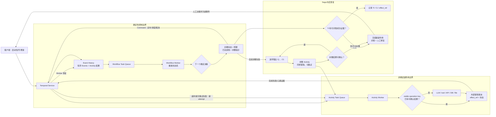

# Temporal Durable Execution + Saga：为长时智能体任务建立可恢复边界

Temporal 与 Saga 解决的不是同一个问题。Temporal 用事件历史和确定性重放恢复工作流决策；Saga 则把已提交的长时业务步骤视为可见事实，在后续失败时以反向、语义级补偿修复业务意图。两者结合后，可以让跨进程、跨天和等待人工的 Agent 任务恢复控制状态，却不会把邮件、支付、工单、LLM 调用或网络写入变成业务上的“恰好一次”。

本案例以 Garcia-Molina 与 Salem 的 1987 年《Sagas》、Temporal 官方概念文档，以及 `temporalio/temporal` 上游提交 `955948007cc6d9d94fa8ef484225954bd9328451` 为证据截面。这个仓库是 Temporal Service 服务端；Workflow 语言级重放由 SDK 完成，因此本文仅用官方 Workflow/Event History 文档证实重放契约，用服务端源码定位 Command 接收、Activity 持久状态、重试计算、计时任务与 Task Queue 匹配等接缝，不把服务端误说成 SDK 解释器。

## 学习问题

1. Event History 如何使 Workflow Worker 在崩溃后通过重放重建状态，为什么这要求 Workflow 对同一历史产生同样的 Commands？
2. 为什么时钟、随机、网络、数据库、LLM 与工具调用不能直接放在确定性 Workflow 路径中？
3. 已完成 Activity 不会因 Workflow replay 重执行，为什么 Activity 的外部副作用仍然可能发生多次？
4. Task Queue、Activity retry、`Schedule-To-Start`、`Start-To-Close`、`Schedule-To-Close`、Heartbeat 与 cancellation 分别约束什么？
5. Saga 为什么要按已成功步骤的反向顺序补偿，而补偿又为什么不是数据库物理回滚？
6. 如何为 LLM/工具步骤定义稳定输入、Activity ID、外部幂等键、结果地址、去重与补偿证据？
7. 当外部结果未知、补偿本身失败、操作不可逆或重试预算耗尽时，为什么必须有可耐久的人工介入状态？

## 一页摘要

**已证实事实**：Temporal 的 Workflow Execution 通过有序 Event History 记录 Events；Workflow 代码在需要恢复时重新执行，并以历史中已记录的结果重建内存状态。同一历史下的 Workflow 必须产生同样的 Temporal API 调用/Commands；无版本管理地改变 Command 顺序或在内联逻辑中使用未记录的随机、时间和网络结果，可以导致 nondeterminism error。

**已证实事实**：Temporal 官方 Workflow Definition 文档直接将 API、LLM/AI、数据库与其他外部交互指向 Activities。Activity 是允许非确定性的普通函数；已记录的完成结果在 Workflow replay 中被复用，不重新调用 Activity。但如果 Activity 已经在外部系统成功，Worker 却在向 Temporal Service 报告完成前崩溃，Event History 没有完成记录，后续 attempt 会再执行 Activity。

**已证实事实**：Temporal 对允许重试的 Activity 提供的准确保证是“Workflow 观察到一次完成”，不是“Activity 只执行一次”。官方文档明确说 Activity 可执行多次、甚至部分完成多次，并建议使用由外部服务强制的幂等键；`Workflow Run ID + Activity ID` 可作为重试间稳定的组合。

**已证实事实**：原始 Saga 论文将长事务拆成可与其他事务交错的 `T1...Tn`，并要求为已提交子事务定义补偿 `C1...Cn-1`。若只执行到 `Tj`，可接受的向后恢复顺序是 `T1...Tj, Cj...C1`。`Ci` 在语义上修正 `Ti`，却不必、往往也不能把数据库恢复成 `Ti` 之前的字节级状态，因为中间已有其他事务观察或修改这些数据。

**基于证据的推断**：Agent 耐久执行的正确分层是：Workflow 保存已授权计划、步骤状态、定时器、审批门、试次预算和补偿栈；Activity 承担 LLM/工具/网络/文件/数据库交互；外部目标以稳定幂等键或结果账本抑制重复效果；Saga 只对“业务已承诺”的步骤入栈，失败时反向调用显式补偿。

**个人分析**：对带副作用的 Agent 任务，“Activity 成功返回”不应是唯一业务事实。Activity 应返回可对账的 `effect_ref`、外部状态和证据摘要；重试前先用同一业务键查询。如果结果处于 `unknown`，应停止新写入并转对账/人工，不应用新的 LLM 采样或重试去“猜”外部世界。

| 责任 | 确定性 Workflow | 可重试 Activity | 外部系统/人工 |
| --- | --- | --- | --- |
| 主要职责 | 排序、状态机、定时器、预算、审批、补偿栈 | LLM、工具、API、DB、文件与网络 I/O | 幂等去重、真实业务状态、账本、审批和修复 |
| 重放/重试 | 对历史重放，不应产生新外部事实 | 可以从头再执行，也可用 heartbeat details 恢复进度 | 必须识别相同业务请求，不得依赖 Worker 内存去重 |
| 稳定身份 | Workflow ID/Run ID、业务版本、步骤键 | 显式 Activity ID、输入哈希、attempt 可观测 | `tenant + operation + business_object + step_version` 等业务幂等键 |
| 不能保证 | 业务副作用恰好一次 | 外部调用只发生一次 | 补偿必然可行或能还原历史状态 |

## 事实边界

**已证实事实**

- Temporal 将 Workflow Definition、Workflow Type 和 Workflow Execution 分开；执行通过 Commands 与 Events 推进，Events 按序记入 Event History。恢复时不是把 Worker 进程内存快照直接装回，而是从 Workflow 代码重建状态；SDK 可以使用缓存优化，但不改变历史是恢复依据的语义。
- Workflow 代码对相同输入与历史必须以相同顺序产生相同 Workflow API 调用。Timer、Activity 调度/取消、Child Workflow、外部 Signal 与 Workflow 终止等都可生成 Commands；对已在运行的历史改变这些顺序，需要使用正式 Workflow Versioning/Patching 机制。
- Activity 参数和返回值可被记入 Workflow Event History。Activity 代码可非确定，在失败重试时默认从初始状态开始；长时 Activity 可将应用进度放入 heartbeat details，供下一个 attempt 恢复。
- Activity 默认带 Retry Policy，Workflow Execution 默认不带。当 Activity Task attempt 失败且策略允许时，Temporal Service 向相应 Activity Task Queue 放入新任务。当前官方文档的默认是初始间隔 1 秒、系数 2.0、最大间隔 100 秒且尝试次数不限；这些默认值不是 Agent 业务的安全预算。
- Task Queue 是 Worker 主动长轮询的路由与负载均衡边界。Workflow 与 Activity Tasks 会持久化，Worker 下线时任务保留；同一队列上的任意 Worker 都可能取任务，所以不能依赖某台 Worker 的本地状态或缓存来保证幂等。多分区 Task Queue 也不承诺整体 FIFO。
- `Schedule-To-Start` 约束单次 Task 等待 Worker 的时间，该超时不会因 Retry Policy 而重试，因为重试仍会放回同一队列；`Start-To-Close` 约束一次 attempt 并帮助服务端检测 Worker 失联；`Schedule-To-Close` 约束整个 Activity Execution 连同所有 retries 的总时间；Heartbeat Timeout 约束长任务心跳间隔。
- Activity cancellation 是协作式请求。Temporal Service 通过 heartbeat 向运行中 Activity 交付取消，不 heartbeat 的 Activity 收不到该请求；Activity 代码还可接受、传播或忽略取消。因此 cancellation 不是强制 kill，更不是外部副作用的回滚。
- Saga 论文允许各子事务提交后释放资源，也因此允许其他事务看到部分 Saga 结果。补偿发生后，系统不会通知或中止曾经看到部分结果的其他事务；Saga 提供的不是全局隔离性。
- 论文专门讨论补偿代码错误：如果补偿既不能完成，重试又将遇到同一缺陷，系统会卡住。原文给出备选实现与人工修复两类办法，也明确承认有些现实动作（例如发射导弹）不可撤销。

**基于证据的推断**

- Event History 是 Temporal 控制面的真相，不是外部业务系统的真相。历史中“ActivityTaskTimedOut”不证明付款未发生，“已发送取消”也不证明远程请求已停止。重试与补偿前需以稳定业务键查询外部账本。
- Activity ID 在一个 Workflow Run 的打开 Activity Executions 中唯一，且官方建议将 `Workflow Run ID + Activity ID` 用作外部幂等键。对业务跨 Run 的重启/重放，还需要不随 Run 变化的业务键；否则“新 Run”可能绕过外部去重。
- LLM 调用本身通常没有可逆副作用，但它消耗费用、供应商配额，输出又可能被后续工具写入采用。将 LLM 放入 Activity 只解决 replay 确定性；还应将提示、模型、参数、工具 schema、上下文快照和政策版本固定为 Activity 输入，对结果建内容哈希和费用账本。
- Saga 补偿必须在正向步骤得到可对账的成功证据后才入栈。若在证据未持久前入栈，可能补偿一个未发生的动作；若外部成功后未入栈，又可能泄漏已发生的副作用。这个不可原子窗口需由外部幂等账本与对账 Activity 弥合，不能靠 Workflow 内存标志消除。

**个人分析与未知项**

- Temporal 不知道“退款”是否能修复“扣款”的所有业务后果，也不知道已收件人是否看到错误邮件。补偿动作、可补偿时限、审批人、会计处理与残余风险都是应用契约。
- 模型提供商是否支持请求级幂等、响应查询和确切计费去重，必须按具体 API 验证。对不支持的供应商，本地结果表只能抑制已知成功的重复调用，无法消除“供应商已处理、客户未收到响应”的不确定窗口。
- 本案例讨论顺序 Saga。并行 Saga 需要根据依赖图和 fork/join 关系计算补偿偏序，不能把多条并行分支随意压成一个全局 LIFO 栈。

## 架构图

下图把“重放”、“Activity 重试”与“Saga 补偿”分成三条路径。Workflow replay 只使用历史重建决策状态；Activity retry 可再次调用外部世界；Saga 补偿是新的、显式记录的业务动作，不是删除旧历史。

**个人分析**：图中的外部幂等账本必须与真实副作用处在同一原子边界，或由外部 API 原生实现。如果 Activity 只在本地数据库先写“即将发邮件”，再调用不支持幂等的邮件 API，这两步之间仍有双写窗口。账本可以将结果从“完全未知”改进为 `planned/submitted/confirmed/failed/unknown/compensated`，但不会凭空创造外部原子性。

## 控制权与任务流

**Workflow 控制权。** **已证实事实**：Workflow Worker 在任务上运行 Workflow 代码，把 Commands 返回 Temporal Service；重放时生成的 Commands 与已有 Event History 匹配。因此“是否进入下一步”、“是否已经获得批准”、“还剩多少尝试/费用预算”与“下一个应补偿哪一步”属于 Workflow。这些决策的输入必须来自历史中的输入、Activity 结果、Signals/Updates 或 Temporal 重放安全 API，不能即时读外部世界。

**Activity 执行权。** **已证实事实**：Activity 可以调用其他服务、写数据库、发邮件或调用 LLM。这是网络与工具 capability 应被授予的边界；同时也是超时、重试、身份、租户、数据分级与幂等契约必须强制的边界。**基于证据的推断**：不同风险和权限的 Activity 应路由到分开的 Task Queues/Worker pools，例如只读检索、LLM 推理、生产写入与补偿，以分离凭证、扩容、限流和紧急停机面。

**稳定输入与身份。** 一个 LLM Activity 的输入应包含 `task_id`、`step_id`、业务对象版本、提示/模型/参数/工具 schema 版本、权限与输入快照哈希；Activity ID 用一个可重建的步骤键，不用当前时间或随机串。外部写入键可以是 `tenant_id:business_task_id:step_name:step_version`，并由目标服务对该键的首次请求参数哈希做约束：相同键相同输入返回原结果，相同键不同输入应冲突，不应默默复用错误结果。

**超时与重试流。**

| 机制 | 已证实的 Temporal 语义 | Agent 配置问题 | 错误解读 |
| --- | --- | --- | --- |
| `Schedule-To-Start` | 一次 Task 在队列等 Worker 的上限；超时不重试 | 是否有备用队列/区域，且有明确重路由计划 | 将 Worker 容量不足当成业务失败 |
| `Start-To-Close` | 一次 Activity Task attempt 的上限；可触发后续 attempt | 设为单次 LLM/工具可能完成的上界 | 认为超时一到，旧网络请求就消失 |
| `Schedule-To-Close` | 整个 Activity Execution 包含所有 attempts 的总上限 | 与业务 SLA、费用和供应商配额联动 | 只设无限次数而不设总时间/成本门 |
| Heartbeat | 报进度，可带下次 attempt 恢复用 payload，又是取消交付点 | 只记录可安全恢复的进度和外部引用 | 把 heartbeat 当作跨系统事务提交 |
| Retry Policy | Activity 默认指数退避；可设最大尝试和不重试错误 | 区分限流/短暂网络错误、永久输入错误、未知副作用 | 对越权、内容拒绝或不可逆结果无限重试 |

**Saga 正向与反向流。** 以“预留额度 `T1` → 生成合同 `T2` → 发出签署邀请 `T3`”为例，仅在 Activity 返回可对账 `effect_ref` 后记录对应补偿。若 `T3` 失败，补偿顺序是 `C2` 后 `C1`；若 `T3` 已发出邀请却回执丢失，先对账，不能直接假设 `T3` 失败并重发。

| 步骤 | 正向成功证据 | 补偿 | 补偿后的残余事实 |
| --- | --- | --- | --- |
| `T1` 预留额度 | 预留号与过期时间 | `C1` 释放该预留号 | 审计记录和短期额度占用曾经存在 |
| `T2` 创建合同草稿 | 版本化合同 ID/内容哈希 | `C2` 作废该版本，不物理删除 | 已作废文档仍需保留供合规审计 |
| `T3` 发签署邀请 | 供应商请求 ID 与收件人 | `C3` 撤销请求或发更正通知 | 收件人可能已读，不能“撤销知识” |

**取消与补偿分流。** Workflow 取消可以停止尚未调度的正向步骤，并请求运行中 Activity 协作停止。但是，已获得 `effect_ref` 的子事务要走补偿路径；取消只表达“不要继续”，补偿才表达“用新业务动作修正已发生的事实”。补偿 Activity 也会超时、重试、重复执行或遭遇永久错误，所以也需幂等键、独立预算和人工终态。

## 关键源码导读

以下链接全部固定到 `temporalio/temporal@955948007cc6d9d94fa8ef484225954bd9328451`。源码展示 Temporal Service 如何接收 Workflow Worker 命令、持久 Activity 调度状态、计算 retry 并与 Task Queue 匹配；它不证明某一语言 SDK 的 replay 实现细节。

| 源码 seam | 已证实行为 | 迁移阅读价值 |
| --- | --- | --- |
| [`workflow_task_completed_handler.go` 275–330](https://github.com/temporalio/temporal/blob/955948007cc6d9d94fa8ef484225954bd9328451/service/history/api/respondworkflowtaskcompleted/workflow_task_completed_handler.go#L275-L330) | `handleCommand` 分派调度/取消 Activity、Timer、Child Workflow、Signal 和终止等 Workflow Commands | Workflow 产生持久控制命令，不在该函数里直接执行 LLM/业务 API |
| [`workflow_task_completed_handler.go` 467–571](https://github.com/temporalio/temporal/blob/955948007cc6d9d94fa8ef484225954bd9328451/service/history/api/respondworkflowtaskcompleted/workflow_task_completed_handler.go#L467-L571) | 校验 Activity 属性、Task Queue 与输入大小，再调用 `AddActivityTaskScheduledEvent`；重复 Activity ID 会成为 Workflow Task 失败原因 | 稳定 Activity ID 是调度身份，不等于外部服务已实现幂等 |
| [`workflow_task_completed_handler.go` 670–745](https://github.com/temporalio/temporal/blob/955948007cc6d9d94fa8ef484225954bd9328451/service/history/api/respondworkflowtaskcompleted/workflow_task_completed_handler.go#L670-L745) | 取消请求先入历史；未开始 Activity 可立即标记取消，已开始者要走 Worker 取消交付路径 | “请求取消”、“Worker 收到”与“外部效果已停止”是三个状态 |
| [`mutable_state_impl.go` 4187–4283](https://github.com/temporalio/temporal/blob/955948007cc6d9d94fa8ef484225954bd9328451/service/history/workflow/mutable_state_impl.go#L4187-L4283) | 按 Activity ID 检测当前重复，写入 scheduled event，并持久队列、四类 timeout、cancel 标志、attempt 与 retry policy | “耐久调度状态”不应与“外部业务事实”混成一个字段 |
| [`mutable_state_impl.go` 6758–6853](https://github.com/temporalio/temporal/blob/955948007cc6d9d94fa8ef484225954bd9328451/service/history/workflow/mutable_state_impl.go#L6758-L6853) | `RetryActivity` 先处理无策略、已取消、timeout 和 non-retryable failure，再计算 backoff、增加 attempt 并生成 retry tasks | 重试是显式状态转移；应用还要把费用、写入次数与风险加入业务门 |
| [`retry.go` 70–113](https://github.com/temporalio/temporal/blob/955948007cc6d9d94fa8ef484225954bd9328451/service/history/workflow/retry.go#L70-L113) | `nextBackoffInterval` 检查最大 attempts、最大间隔与过期时间，返回终止或继续的 retry state | 不要在 Activity 内再隐藏一套无观测重试，否则系统级预算会被乘法放大 |
| [`timer_queue_active_task_executor.go` 527–615](https://github.com/temporalio/temporal/blob/955948007cc6d9d94fa8ef484225954bd9328451/service/history/timer_queue_active_task_executor.go#L527-L615) | retry timer 加载 mutable state，检查 stamp/attempt/当前运行状态，忽略旧或重复 timer，然后向 matching 添加 Activity Task | 内部调度任务去重与外部业务去重必须同时存在 |
| [`matching/handler.go` 175–278](https://github.com/temporalio/temporal/blob/955948007cc6d9d94fa8ef484225954bd9328451/service/matching/handler.go#L175-L278) | Matching handler 分别提供 Activity/Workflow Task 添加与长轮询入口 | Task Queue 是工作分发边界，不是长时业务状态本身 |
| [`matching_engine.go` 583–669](https://github.com/temporalio/temporal/blob/955948007cc6d9d94fa8ef484225954bd9328451/service/matching/matching_engine.go#L583-L669) | Workflow/Activity Task 转换为带 namespace、workflow/run、scheduled event、过期时间与优先级的 task info；Activity 可直接 sync match 给 poller 或持久到队列 | 路由和持久队列可恢复分发，但不认证上一个 Worker 已对外做了什么 |

**基于证据的推断**：服务端源码中的 `ActivityId`、`ScheduledEventId`、`Attempt`、`Stamp` 和 task token 用于 Temporal 内部状态机与任务有效性。它们可以构成很好的外部请求素材，却只有当目标服务在同一原子写中记录并检查幂等键时，才能抑制重复业务效果。

## 架构决策与权衡

**先按副作用边界切 Activity，再按失败与补偿语义切粒度。** 过粗 Activity 可在最后一个小步失败时重做前面的多个写入；过细 Activity 增大 Event History、调度开销和版本面。合适切点是：一个 Activity 有一个主要幂等键、一个可判定成功事实、一组可解释 timeout，并有明确的重试/对账策略。

| 条件 | 建议边界 | 代价/例外 |
| --- | --- | --- |
| 纯状态转移、定时等待、补偿顺序选择 | Workflow | 必须可确定重放，代码变更要版本化 |
| LLM 调用、HTTP、DB、文件、任意工具调用 | Activity | 可多次执行，需幂等/去重/查询外部结果 |
| 一个写入有原生幂等 API | 一个窄 Activity | 还要检查同键不同参数冲突和保留期 |
| 多个写入只有各自局部事务 | 多 Activity + Saga | 部分结果对其他事务可见，要接受弱隔离性 |
| 长时外部任务有可恢复进度 | Heartbeating Activity 或外部 callback/Signal | Heartbeat 会被节流；人工等待通常不应占住一个周级 attempt |
| 副作用结果不可查询且不可幂等 | 冻结 + 人工决策 | 耐久编排无法补上外部契约缺口 |

**重试还是补偿。** 对“未发生且短暂失败”的正向操作重试；对“已成功、后续步骤使整体意图无法完成”的操作补偿；对“可能已成功”的操作先对账。这三个状态若只用 `failed=true` 表达，系统会在最危险的不确定窗口做出自动重放。

**向后还是向前恢复。** 原始论文同时讨论 backward recovery 与 forward recovery。当业务规则允许后续步骤最终完成，向前恢复可避免损失已完成工作；但它需要保证剩余代码与输入可获得，并有终止预算。当用户撤回、不可继续或风险越界，走向后补偿。无论哪一种，“一直重试就会成功”都是需要证明的业务前提，不是 Temporal 属性。

**补偿也是一等工作流。** 每个 `Ci` 应有独立幂等键、输入中的原 `effect_ref`、前置状态、可执行时窗、权限、重试上限、成功证据和人工 owner。已成功补偿也应去重，以允许 Workflow 在中途崩溃后重放补偿顺序而不重复退款。若 `Cj` 失败，不要默默跳过它继续 `Cj-1`；是否可继续必须由业务依赖与风险规则明确决定。

**人工并不是耐久执行的失败。** Saga 原文把手工修复补偿代码/状态视为不优雅但实用的办法。在 Agent 平台中，`needs_reconciliation`、`needs_compensation_approval`、`compensation_failed` 应是可查询、有 owner/SLA/权限的耐久状态；人的决定通过 Signal/Update 成为新历史事件，而不是直接在数据库修改 Workflow 内部字段。

## 生产化分析

**业务不变量与状态模型。** 为每个正向/补偿步骤明确 `not_scheduled`、`running`、`succeeded`、`failed_retryable`、`failed_permanent`、`unknown`、`compensating`、`compensated`、`compensation_failed`。不变量至少包括：只有 `succeeded + effect_ref` 可入补偿栈；`unknown` 禁止新写且必须对账；每个已承诺副作用必须是整体成功的一部分，或最终抵达 `compensated/已批准保留`。

**幂等与对账。** 外部服务有原生幂等键时，保留期要长于 Workflow 最长重试/恢复窗口，返回值应包含原请求哈希和资源 ID。没有原生幂等时，优先改造目标系统为 inbox/dedup table 或使用可查询业务 ID；不得用 Worker 本地缓存、“成功后写一行”或消息队列消费位点代替目标侧去重。对账 Activity 要只读或使用独立权限，返回 `not_found/confirmed/rejected/pending/ambiguous`，不在查询路径偷做第二次写入。

**版本化与长历史。** Workflow 代码变更要对存量历史使用 Temporal 的版本机制，并在发布前用生产 History replay test 验证。Activity 的输入/输出 schema 要向后兼容；补偿代码的保留时间必须覆盖最长可补偿任务。超长 Agent 任务要规划 Continue-As-New/历史大小，但必须在新 Run 中传递稳定业务键、剩余预算、已成功 `effect_ref` 和补偿指针，不能只复制对话摘要。

**可观测性与 SLO。** 按 namespace/task queue/workflow type/activity type/业务租户跟踪：Task Queue backlog 和 schedule-to-start latency、Activity attempt 分布、start-to-close/heartbeat timeout、non-retryable 率、Workflow Task nondeterminism、每成功任务 token/费用/写次数、`unknown` 停留时间、补偿成功率/耗时、人工队列龄期和重复副作用数。Temporal 平台“Workflow 还在运行”不等于业务健康；SLO 必须包含未知外部状态和补偿债务。

**容量、隔离与停机。** 分离 Workflow、读 Activity、LLM Activity、高风险写 Activity 和 compensation Activity 队列；为各队列设并发、派发速率、供应商配额与租户公平性上限。紧急停机时先停止新正向副作用，保留只读对账与经批准补偿通道；不能简单停掉所有 Worker，否则正在扩大的业务不一致将无法止损。

**安全、隐私与滥用。** Workflow History 会持久输入、Activity 结果与部分失败信息，不应直接放密钥、完整敏感文档或无需持久的 LLM 原始上下文；使用加密 payload/data converter、密钥引用、最小化输入与按保留期管理的外部 artifact store。Task Queue 不是授权边界：Worker 凭证、namespace 访问、Activity 参数校验、租户绑定和目标系统授权都要独立强制。防止恶意输入通过可重试 LLM/工具调用放大费用，并为补偿 Worker 使用比正向 Worker 更窄的 capability。

**人工介入运维契约。** 升级包应至少有 `workflow_id/run_id`、租户与业务对象、当前状态、代码/政策版本、已完成步骤和 `effect_ref`、幂等键、外部查询证据、attempt/timeout/cancellation 时间线、待补偿栈、费用预算、风险与可执行选项。每个队列项必须有 owner、SLA、允许的 Signal/Update 操作与双人审批门；不得通过重启 Worker 或手动删历史“解决”补偿债务。

**演练与发布门禁。** 在预发环境注入：Activity 外部成功后 Worker 在报告前崩溃、重复 retry timer、LLM 429/超时、取消延迟、Task Queue 无 poller、补偿永久失败、人工回复重复投递、Workflow 代码版本与旧历史不兼容。验证每一项最终落在可证明的成功、可对账未知或有 owner 的人工状态，并检查无重复扣款/邮件/工单。

## 可迁移经验

### 可直接复用的机制

1. **确定性编排与非确定执行分离。** Workflow 只管状态、顺序、定时、预算与补偿指针；LLM、工具与网络调用放 Activity。
2. **以事件历史恢复控制状态。** 进程重启后不依赖模型“记得”上一步，而从已记录输入和结果重建。
3. **稳定步骤身份。** 用可重建 Activity ID、业务幂等键、输入哈希和外部 `effect_ref` 串起所有 attempts。
4. **将重试与超时声明化。** 对单 attempt、总 Activity、心跳和队列等待分别建模，不用一个“任务超时”混淆所有故障。
5. **顺序 Saga 反向补偿。** 只对有可对账成功证据的步骤入栈，失败时以 `Cj...C1` 反向修复依赖。
6. **把人工决策作为耐久事件。** 不可逆、未知或补偿失败时进入有 owner/SLA 的状态，审批结果再进入历史。

### 只能有限类比的部分

1. **Activity 的“原子单元”。** 对 Temporal 而言它是调度/结果单元；对外部世界而言，一个 Activity 可以部分执行多次，不是分布式 ACID 事务。
2. **Workflow 的“只执行一次”。** 逻辑 Workflow Execution 可最终完成一次，但 Workflow Function 可因重放运行多次；内联副作用会被放大。
3. **Task Queue 作为信息通道。** 可用于隔离容量和处理器，但不是业务总序、授权系统、幂等账本或数据驻留策略。
4. **Saga 补偿类比 rollback。** `Ci` 修复业务语义，并保留中间可见事实；它可能是退款、作废或第二封更正邮件，不是恢复字节快照。
5. **Heartbeat 类比 checkpoint。** 它可保存 Activity 进度，但不代表外部系统与 Temporal 原子提交，也不保证取消立刻送达。
6. **LLM 调用类比普通读 Activity。** 输出可被 Event History 复用，但调用费、配额、数据泄露与后续工具决策使其仍是有风险的外部操作。

### 不应照搬的部分

1. **不要在 Workflow 重放路径直接调 LLM、工具、HTTP、数据库或文件系统。** 一次 Worker 恢复就可能产生新结果或重复写入，并破坏 Command/History 匹配。
2. **不要宣称耐久执行提供业务 exactly-once。** Temporal 可让 Workflow 观察一次 Activity completion，Activity 和其部分副作用仍可执行多次。
3. **不要把 Activity ID 当成外部去重已完成。** 目标服务必须强制幂等键，并为相同键不同参数拒绝冲突。
4. **不要把 timeout 或 cancellation 当成旧执行已终止。** 超时后可与新 attempt 并存，取消又需 heartbeat 协作交付；外部状态未知时先对账。
5. **不要认为 Temporal 会发明正确补偿。** 补偿函数、依赖顺序、会计/合规语义、时窗与人工权限全部由应用设计。
6. **不要无限重试补偿或永久错误。** Saga 论文已指出补偿代码错误会让系统卡住；需备选补偿、限制预算与人工修复。
7. **不要在人工处理期间保留无主任务或宽权限 Worker。** 冻结新副作用，记录 owner/SLA/证据包，只开放对账与经批准的修复能力。
8. **不要将业务秘密与无界 LLM 上下文直接放入 Event History。** 历史是耐久恢复资产，同时也是需要加密、最小化、审计和保留期管理的敏感数据面。

## 来源

以下均为经典论文、Temporal 官方文档或上游源码。访问日期与来源截断日期：**2026-07-22**。`temporalio/temporal` 当日远程 HEAD 解析并固定为 `955948007cc6d9d94fa8ef484225954bd9328451`。

- [Garcia-Molina & Salem, 《Sagas》（ACM SIGMOD 1987）](https://doi.org/10.1145/38713.38742) — 长事务拆分、子事务交错、语义补偿、`T1...Tj,Cj...C1` 执行序列、向前/向后恢复、补偿错误和人工修复。
- [Temporal Workflow](https://docs.temporal.io/workflows) 与 [Workflow Definition](https://docs.temporal.io/workflow-definition) — Workflow/Execution 区分、Event History replay、确定性 Command 契约，以及将 API、LLM/AI、DB 与其他外部交互放入 Activity 的明确指导。
- [Temporal Event History](https://docs.temporal.io/encyclopedia/event-history) — Command 转为持久 Event，Worker 崩溃后以 History 重建 Workflow 状态。
- [Temporal Activity](https://docs.temporal.io/activities)、[Activity Definition](https://docs.temporal.io/activity-definition) 与 [Activity Execution](https://docs.temporal.io/activity-execution) — Activity 非确定性、已完成结果的 replay 复用、Worker 在报告前崩溃导致重执行、幂等键、Activity ID、heartbeat 与协作式 cancellation。
- [Temporal Retry Policies](https://docs.temporal.io/encyclopedia/retry-policies) 与 [Detecting Activity Failures](https://docs.temporal.io/encyclopedia/detecting-activity-failures) — Activity/Workflow 默认重试差异、退避参数、non-retryable errors、四类 Activity timeout 和 heartbeat 进度/取消交付。
- [Temporal Task Queues](https://docs.temporal.io/task-queue) 与 [Temporal Service](https://docs.temporal.io/temporal-service) — Worker 主动轮询、Workflow/Activity Task 持久、负载均衡、队列分区/顺序边界与 Service 组成。
- [`temporalio/temporal` 固定提交](https://github.com/temporalio/temporal/tree/955948007cc6d9d94fa8ef484225954bd9328451) 及上文固定文件 — Workflow Command 分派、Activity mutable state/retry/timer task、Matching add/poll 的实际服务端接缝。

证据标签说明：`已证实事实` 只陈述论文、Temporal 官方文档或固定源码直接支持的行为；`基于证据的推断` 将这些机制映射为 Agent 的状态、幂等、对账与故障边界；`个人分析` 给出官方机制不会自动提供的业务补偿、安全预算、人工修复与运维契约。
