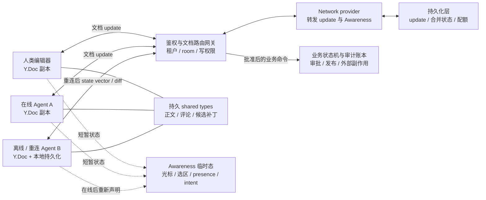

# Yjs CRDT Collaboration：让人和多个 Agent 合并共享工作区状态

两个副本拿到同一组 Yjs update 后可以收敛成相同结构，两个使用者却仍可能对内容含义完全不同意。一个 Agent 写“风险可接受”，另一个补上“必须法务审批”，CRDT 能保留并排列这些修改，却不会替产品判断它们是否矛盾。

Yjs 适合把协同工作区拆成两条数据通道：共享类型保存可合并的正文、评论和候选补丁，Awareness 传播光标、当前关注区和短暂生成状态。权限、事务、语义裁决、审计与外部副作用属于第三条业务控制通道；CRDT 收敛不提供这些保证。

本文以截至 2026-07-22 的官方文档和固定源码快照为范围。快照处于 14.0.0 候选版本，而固定仓库的支持声明仍指向 13.6.x，因此版本与源码只用于解释机制，不构成选型建议；详细 SHA、符号和字段进入证据卡。

## 学习问题

1. shared types 与 document update 能保证什么，普通 JSON 修改为什么不会自动同步？
2. update 收敛为什么不能推广为权限、事务、语义正确或工具副作用幂等？
3. state vector 和 diff 如何让离线副本只交换缺失状态？
4. 持久内容、provider 与 Awareness 各自拥有哪类状态？
5. snapshot、删除集合与 GC 为什么不能替代审计和备份？
6. Agent 重连后，谁有权把离线产物提升为正式结果？

## 一页摘要

**已证实事实**：Yjs shared types 提供 Array、Map、Text 与 XML 类数据结构，接入 `Y.Doc` 后可观察、同步和持久化。修改发生在 transaction 中；显式 transaction 可把多次本地修改合为一次通知和一个 update。普通 JSON 原地修改不会产生 Yjs 事件，可能让副本失去同步。

**已证实事实**：文档变更被编码为 `Uint8Array` update。同一组有效 update 可乱序、重复应用，兼容副本收到全部 update 后收敛。state vector 表达各 client 的下一预期 clock，`encodeStateAsUpdate` 或 `diffUpdate` 可据此只交换缺失结构。

**已证实事实**：provider 不属于 CRDT 合并算法。network provider 转发 update，persistence provider 保存 update；二者可接到同一个 `Y.Doc`，离线端先恢复本地内容，重连后再同步缺失变化。Awareness 独立于文档，适合在线状态与光标等跨会话无须保留的信息。

**边界。个人分析**：update 的代数性质只属于 Yjs 文档集成，不属于模型回答、数据库写入、支付或发信。`Y.Doc.transact` 也不是跨系统事务。持久文档保存以后还要审阅的内容，Awareness 保存会过期的协作提示；权限、语义校验、审批、幂等副作用账本与审计链必须外置。

| 状态或动作 | 建议承载 | 能得到的保证 | 仍需补齐 |
| --- | --- | --- | --- |
| 正文、评论、候选补丁、白板节点 | `Y.Text`、`Y.Array`、`Y.Map`、`Y.Xml*` | 有效 update 最终送达后的文档收敛 | schema 版本、内容校验、权限与语义审阅 |
| 光标、选区、当前段落、短暂生成状态 | Awareness | 在线端之间传播、超时离线 | 不持久、不作锁；断线后重建 |
| 离线草稿 | 同一 `Y.Doc` + 本地 persistence provider | 本地恢复并在联网后交换缺失 update | 存储配额、数据加密、身份重新认证 |
| 审批、付款、发信、发布 | 独立业务状态机与幂等账本 | 由业务系统定义原子性与去重 | 不应由 CRDT update 代替 |

## 事实边界

本案例访问日为 2026-07-22。固定源码快照的 `package.json` 为 `14.0.0-rc.24`，而同一快照的 `SECURITY.md` 仍只把 13.6.x 列为受支持版本。这个差异会改变生产选型结论：本文用候选版快照解释当前实现，不建议据此直接采用候选版。

  
证据：固定快照与支持版本边界

- **固定提交：** 当日 `git ls-remote https://github.com/yjs/yjs.git HEAD` 返回 [`9c1994547d7bc86245a21e1a4c8319f056d05ecf`](https://github.com/yjs/yjs/tree/9c1994547d7bc86245a21e1a4c8319f056d05ecf)。
- **提交时间：** 2026-07-18。
- **仓库版本：** `14.0.0-rc.24`。
- **支持声明：** 同快照 `SECURITY.md` 只列出 13.6.x。
- **边界：** 固定 HEAD 用于说明源码和内部结构；正式支持版本必须在生产选型时另行核对。

**已证实事实**：`INTERNALS.md` 把 Yjs 核心描述为 list CRDT。插入内容由 `(clientID, clock)` 唯一标识，并借助 `origin` 与 `originRight` 排列并发插入。Map 同键条目以最后插入项为可见值，其余标记删除；删除集合随 update 传播，但不记录删除时间或删除者。

**边界。基于证据的推断**：CRDT 的“无合并冲突”只表示算法可以决定结构结果，不表示结果没有产品冲突。比如一个 Agent 把风险等级改为“低”，另一个同时加入“必须法务审批”；Yjs 能收敛字段和文本，却无法判断二者是否矛盾。需要领域约束、审阅者、规则引擎或审批工作流决定语义。

**已证实事实**：Yjs 不规定网络拓扑。y-websocket 用中心端点分发 update 与 Awareness，并可携带认证材料；这是部署接缝，不是自动鉴权。`THREAT_MODEL.md` 把 peer 认证授权、TLS/WSS、服务端访问控制和输入校验列为应用责任。拥有写权限的恶意 peer 仍可破坏文档。

**个人分析**：最安全的权限粒度通常是文档或文档分区，而不是尝试在服务端解析并过滤任意二进制 update。租户、项目、机密级别和“正式文档/建议稿”应映射为不同 room、document 或 fork；只读用户不应获得 update 写入口。细粒度字段权限若不可避免，应通过受信应用命令生成 update，或把高敏感字段移出通用 CRDT 文档。

## 架构图

先看三条通道是否被混在一起：document update 承载持久协同状态，Awareness 承载可丢失的在线提示，业务状态机承载授权与不可逆动作。三者即使关联同一个任务，也不能共享同一套一致性承诺。

**已证实事实**：多个 provider 可以连接同一个 `Y.Doc`。官方示例同时组合 network provider 与 `y-indexeddb` persistence provider；provider 监听 `update` 事件并通过 transaction origin 避免把刚接收的更新无限回送。Awareness 另有编码和应用 API，不支持通过 state vector 计算最小差异。

**基于证据的推断**：图中的鉴权网关、业务状态机和审计账本都不是 Yjs 内置组件。它们被显式画在 CRDT 数据面之外，是为了阻止“文档已收敛”被误读为“动作已授权、事务已提交、结果已审计”。

**个人分析**：Agent 的“我打算改第 3 节”只是一条协作提示。它可以减少人和其他 Agent 的重复劳动，却不能阻止一个掉线或恶意 Agent 同时写入；真正排他操作需要带租约、服务器时间、fencing token 和受信写入口的独立协调机制。Awareness 最多显示软占用，不应成为安全或一致性边界。

## 控制权与任务流

**说明性场景**：一名用户和两个 Agent 共同修改一份方案，其中一个 Agent 离线后继续写草稿。这个流程只组合已证实的 Yjs 机制与明确标注的应用层设计，不是上游生产事故或用户案例。

一个可恢复的编辑回合可以按以下顺序运行：

1. 受信客户端先认证用户或 Agent 身份，由服务端依据租户、文档、角色和动作决定能否加入 room 以及能否写 update。文档 ID 必须由服务端映射，不能直接相信客户端自报路径。

2. 客户端加载本地 persistence provider，再连接 network provider。UI 可以先显示本地已知内容，但在确认远端同步前应标注“本地状态”，高风险提交不得以 `synced` 布尔值替代业务版本检查。

3. Agent 在 Awareness 发布短暂 `actor`、`focus`、`intent`、`status` 与过期信息，例如“正在草拟来源摘要”。这些字段不包含秘密推理、长期凭证或必须审计的批准。

4. 需要保留的草稿文本、评论或候选补丁进入 shared types，并在一个本地 transaction 内成组修改。provider 将产生的 update 持久化并转发，重复和乱序投递不要求调用方手工去重。

5. 重连端发送 state vector，远端计算缺失 diff；双方应用完整 update 集后文档状态收敛。离线期间的旧 Awareness 不回放，客户端按当前任务重新声明。

6. 语义验证器检查必填字段、引用、状态机前置条件和跨字段约束。冲突内容可以被标记、请求人工审阅或写到建议 fork，不能把 CRDT 的结构结果直接升级为“已批准”。

7. 发布、发信或其他副作用使用独立命令、幂等键和业务账本。只有服务端授权并原子记录命令后才执行；Yjs transaction origin 可帮助调试 update 来源，但不是经过认证的身份或不可抵赖审计字段。

**已证实事实**：官方 Awareness API 让每个 client 只推进自己的本地状态 clock；状态为 `null` 表示离线，30 秒未收到更新的远端 client 也会被标记离线，因此客户端需要周期广播。Awareness 状态是无 schema 的 JSON 对象，字段不标准化。

**基于证据的推断**：Agent presence 需要应用级 TTL、任务 ID 和会话实例 ID，且所有消费者都应把它视为提示。进程暂停、设备休眠、网络分区和消息延迟都会制造短暂误判；“在线”也不证明该 Agent 仍拥有任务或有权限写正式文档。

**个人分析**：对长时间离线的 Agent，应在重连后先同步、重新读取当前目标和权限，再决定是否保留其候选补丁。盲目继续旧计划虽可在数据层合并，却可能把已撤销要求重新写回。最稳妥的模型是把离线产物作为可审阅 proposal，并以当前 base/version 与策略重新验证后再提升为正式内容。

## 关键源码导读

最短阅读路径从 `Doc` 的 transaction 边界进入，再看 encoding 如何应用 update 和计算差异，最后用 `Snapshot`、`INTERNALS.md` 与威胁模型检查恢复和安全边界。它能证明结构怎样合并以及哪些历史可能被 GC；它不能证明合并结果有业务权限或语义正确性。

固定源码快照为 [`9c1994547d7bc86245a21e1a4c8319f056d05ecf`](https://github.com/yjs/yjs/tree/9c1994547d7bc86245a21e1a4c8319f056d05ecf)。以下只描述该快照以及 2026-07-22 访问到的官方文档。

  
证据：文档更新、快照与威胁模型接缝

| 源码或文档接缝 | 已证实行为 | 边界 | Agent 协作含义 |
| --- | --- | --- | --- |
| [`src/utils/Doc.js`](https://github.com/yjs/yjs/blob/9c1994547d7bc86245a21e1a4c8319f056d05ecf/src/utils/Doc.js) | `Doc` 持有随机 clientID、shared type map、StructStore、`gc` 与 `gcFilter`；transaction 可记录 origin | `isLoaded` / `isSynced` 依赖 provider 实现，不是业务提交证明 | clientID 不是用户身份；把认证主体和业务版本另存于受信上下文 |
| [`src/utils/encoding.js`](https://github.com/yjs/yjs/blob/9c1994547d7bc86245a21e1a4c8319f056d05ecf/src/utils/encoding.js) | `applyUpdate` 解码并应用 update；`encodeStateAsUpdate` 根据目标 state vector 写缺失结构和删除集合；`encodeStateVector` 编码本地已知 clock | 差异同步减少传输，不验证业务权限或语义 | 重连先算 diff，后做 schema/政策验证；不要把二进制可应用等同于可接受 |
| [`INTERNALS.md`](https://github.com/yjs/yjs/blob/9c1994547d7bc86245a21e1a4c8319f056d05ecf/INTERNALS.md) | 插入以 `(clientID, clock)` 标识；update 包含新插入项与删除项；state vector 用于计算缺失结构 | 文档明确不保存删除者或删除时间，state vector 不追踪业务因果 | 审计必须外置；需要知道“谁为何删除”时不能只存最终 Y.Doc |
| [`src/utils/Snapshot.js`](https://github.com/yjs/yjs/blob/9c1994547d7bc86245a21e1a4c8319f056d05ecf/src/utils/Snapshot.js) | snapshot 由 state vector 与 delete set 构成；`createDocFromSnapshot` 从原文档构造旧状态 | 若 `originDoc.gc` 为真会直接报错，因为旧内容可能已被回收 | 版本查看与恢复策略必须预先设计；默认 snapshot 不能替代备份 |
| [Document Updates](https://docs.yjs.dev/api/document-updates) | update 具交换律、结合律、幂等性；二进制 API 可 merge 与 diff | 只 merge 二进制 update 不会 GC 删除内容，仍需加载 `Y.Doc` 缩减 | 离线队列可重复送达，但要监控文档增长并安排受控 compact |
| [Awareness](https://docs.yjs.dev/api/about-awareness) | 每 client 的 clock + JSON 临时态，超时可标记离线；通常由 provider 维护 | 不进 Yjs 文档、无 state vector、字段无 schema | presence/intent 与正式内容分通道；断线后不回放旧意图 |
| [`THREAT_MODEL.md`](https://github.com/yjs/yjs/blob/9c1994547d7bc86245a21e1a4c8319f056d05ecf/THREAT_MODEL.md) | 协议假定协作写入端受信；恶意 peer 可写破坏性操作或构造大 update、深层结构造成 DoS | 服务端选择性过滤二进制 update 不是可靠安全边界 | 未受信 Agent 使用独立建议 fork；先鉴权，再授予整文档写能力 |

**边界：** 这些锚点证明 update 集成、差异同步、snapshot/GC 限制和受信 peer 假设，不证明 provider 自动实施 ACL，也不证明业务动作具备事务性。

**已证实事实**：源码默认 `gc = true`。`INTERNALS.md` 说明删除项可丢弃内容或被替换为轻量 `GC` 对象，snapshot 则需要 state vector 与删除集合判断过去可见性。固定 `Snapshot.js` 明确拒绝从启用 GC 的 origin document 恢复 snapshot。

**边界。个人分析**：如果产品需要“任意时刻还原原文、查明删除者并形成法律审计”，应保留受控 checkpoint/备份与不可变审计事件，必要时对需要版本回看的文档禁用 GC 并承担增长成本。不能一边默认回收删除内容，一边事后假设 snapshot 能恢复所有历史。

## 架构决策与权衡

| 决策 | 适用条件 | 收益 | 主要代价、风险与退出信号 |
| --- | --- | --- | --- |
| 中心数据库 + 乐观版本 | 主要是表单或离散记录，在线写入，冲突少且业务事务重要 | 权限、约束、审计和事务模型直接 | 离线与字符级并发体验较弱；同一内容频繁冲突时评估 CRDT |
| 一个 Y.Doc 承载协同内容 | 多人/Agent 高频编辑同一小到中型内容，允许最终收敛 | 本地优先、离线编辑、重复/乱序 update 可合并 | 权限半径、文档增长、schema 迁移与语义冲突治理增加 |
| 按租户/项目/文档/敏感级别分区 | 权限、生命周期、容量或保留策略不同 | 缩小泄露与故障半径，可独立限额和 compact | 跨文档原子修改不存在；需要索引与业务编排 |
| 正式文档与建议 fork 分离 | 未受信用户或 Agent 只能提交建议 | 原文档只接受受信写端，建议可审核后提升 | 合并 UX、引用映射和审核成本增加 |
| durable content + Awareness 双通道 | 需要同时显示协作状态和持久产物 | 避免光标、intent 污染历史与离线回放 | Awareness 可能过期或丢失，不能作为锁或任务真相 |
| 保留 update 日志并周期 checkpoint | 需要重放、恢复和低延迟同步 | 审计接缝与灾备更强，冷启动可控 | 日志增长、加密、压缩与 GC 策略复杂；日志仍需受信身份元数据 |
| 对版本回看文档禁用 GC | 明确需要基于 origin document 重建旧 snapshot | 保留恢复旧内容所需结构 | 内存和存储持续增长；若只需合规备份，应优先外部 checkpoint |
| CRDT 外置业务状态机 | 存在审批、额度、发布或不可逆副作用 | 保留原子约束、幂等和可审计授权 | 两套状态需关联；若把业务动作塞回文档，立即失去该边界 |

**基于证据的推断**：文档分区既是扩展决策，也是权限决策。一个巨型 workspace Y.Doc 会让任何有写权限的 client 触达更大状态，并让冷启动、diff、观察者和 GC 共享同一资源预算。以稳定业务边界拆分文档，再用普通索引或引用关联，通常比在一个二进制 update 内做字段级 ACL 更可控。

**个人分析**：是否采用 CRDT 的判断标准不是“有多个 Agent”，而是是否存在同一数据的真实并发编辑、离线要求和可接受的最终一致语义。若任务可以由单一 owner 排队执行，或者每个 Agent 写独立产物再由 reducer 合并，普通数据库版本控制往往更简单。CRDT 不应成为绕过所有权设计的理由。

## 生产化分析

生产边界应沿着三类失败拆开：CRDT 数据能否解码并收敛、主体是否有权写入、收敛内容是否能成为正式业务结果。只监控“所有副本一致”会漏掉恶意 update、语义矛盾、陈旧离线计划和重复外部动作。

  
证据：生产限额、观测字段与恢复动作

| 生产维度 | 最小控制 | 可观测信号 | 失败处置 |
| --- | --- | --- | --- |
| 身份与授权 | WSS、会话认证、服务端派生 tenant/doc、room 级读写 ACL、短期令牌 | 主体、租户、文档、动作、允许/拒绝原因、连接实例 | 拒绝未授权 room；撤销连接与令牌；不要只信 clientID |
| 文档分区 | 按权限、容量、保留期和业务生命周期划界，正式文档与建议 fork 分开 | 每文档字节、结构数、更新率、活跃连接、权限变更 | 隔离热点/异常文档；迁移到新分区；限制跨文档操作 |
| update 接收 | 鉴权后才读写；限制单 update/批次大小、频率、嵌套深度、解码 CPU 和内存 | 接收/拒绝字节、apply 延迟、异常 decoder、重复率、待同步差异 | 断开异常 client、隔离文档、熔断解码；保留取证哈希 |
| persistence 与离线 | 加密本地/服务端存储、配额、checkpoint、备份、最长离线窗口 | 本地加载时间、远端 sync 时间、diff 大小、队列年龄、恢复成功率 | 超限转全量 checkpoint；提示人工审阅陈旧离线草稿 |
| Awareness | 字段白名单、payload/频率上限、TTL、敏感信息禁入 | 在线数、心跳延迟、过期清理、payload 字节、异常频率 | 丢弃超大/高频状态；断线立即显示未知而非锁定 |
| schema 演进 | 文档内 schema version、兼容读、幂等迁移、单一迁移协调者、回滚 checkpoint | 版本分布、未知字段、迁移耗时/失败、旧 client 写入 | 暂停不兼容写端；双读/适配；从 checkpoint 恢复 |
| 语义质量 | 领域验证、引用完整性、审批规则、人工审阅、建议提升流程 | 验证失败、矛盾标记、人工覆盖、proposal 接受率 | 保留双方内容并阻止发布；指定 owner 或规则裁决 |
| 审计 | 独立追加日志记录认证主体、时间、doc、update 哈希/大小、schema、命令结果 | 缺失审计关联、异常删除、回放差异、日志完整性 | 冻结高风险写入、从 checkpoint + 日志调查；不可只看最终状态 |
| GC 与容量 | 明确 `gc` 策略、合并/compact 周期、文档大小预算、保留 checkpoint | tombstone/结构增长、合并后字节、内存峰值、冷启动时延 | 受控加载 Y.Doc compact；拆分或归档文档；避免无限 update 日志 |
| 外部副作用 | 服务端命令、幂等键、fencing/版本检查、原子业务账本、补偿 | 命令状态、重复键、迟到结果、账本/文档关联 | 查询真实结果、拒绝旧 owner、补偿或转人工；不重放 Yjs update 触发动作 |

**边界：** 表中 ACL、审计、schema 迁移、幂等账本和资源治理都是应用层控制，不是 Yjs update 的收敛保证。

**安全。已证实事实**：固定 threat model 明确指出未受信 peer 不应写原始文档，建议只写独立 fork；选择性过滤二进制 update 容易被利用，不是可靠安全边界。它还列出超大 update、深层嵌套和高计算消息导致拒绝服务的风险。y-websocket 文档只提供可接入认证授权的中心端点，生产实现仍须显式完成这些控制。

**安全。个人分析**：Agent 比普通协作者更容易高频、批量地产生结构和文本。除网络层限流外，应为每个主体设置并发文档数、每分钟 update 字节、单 transaction 变更量、最大嵌套深度、Awareness 刷新率和模型生成预算。异常 Agent 先降为 suggestion-only fork，不要让一个错误循环把合法 CRDT update 扩散到所有副本。

**schema 演进。基于证据的推断**：shared types 与 Awareness 都不会替应用强制领域 schema。新旧 Agent 并存时，应保持未知字段可忽略、读路径向后兼容，并把迁移写成可重复执行的受控操作。若多个副本同时运行“把字段 A 改名为 B”的破坏性迁移，CRDT 可以合并这些写入，却不保证只有一次迁移或旧 client 不再写 A。

**审计。已证实事实**：`INTERNALS.md` 明确删除记录不包含删除时间或删除用户。transaction origin 可随本地 update 事件传递，官方文档把它用于识别 provider 来源与调试；它不是协议内认证身份。合规审计必须在可信接入层记录已认证主体、策略决定、时间、update 哈希和业务命令结果，并保护日志免受协作者改写。

**可靠性与容量。个人分析**：为每个文档压测冷启动、增量 sync、长离线 diff、重复 update、断网重连、热点并发和 GC/compact。灾备演练要从 checkpoint 与后续 update 恢复到预期 state vector，并单独验证业务账本；只证明所有 Y.Doc 副本相等，不能证明外部动作正确或审计完整。

## 可迁移经验

### 可直接复用的机制

- **持久内容与临时态双通道**：把正文、评论、候选补丁和结构化产物放入 shared types；把光标、选区、短暂 presence 与“正在生成”意图放入 Awareness。
- **update 的可重复交付**：网络可以重试、乱序和批量传输同一 Yjs document update，不必在调用方为 update 本身设计严格一次投递；仍需验证来源、大小和文档权限。
- **state vector 差异同步**：重连端先表达自己已知的 client clocks，再接收缺失 update，适合人类设备和离线 Agent 恢复共享草稿。
- **network 与 persistence provider 分工**：同一 `Y.Doc` 可同时接网络与本地持久化，应用不必把离线缓存伪装成另一套业务模型。
- **按权限与容量分文档**：租户、项目、敏感级别和正式/建议状态形成独立 room 或 fork，避免字段级二进制过滤成为安全幻觉。
- **明确 snapshot/GC 策略**：需要旧状态浏览时预先决定是否禁用 GC、保留多大历史或改用外部 checkpoint；不要事后才发现删除内容已回收。
- **外置可信审计**：接入层把认证主体、策略结果、时间、update 哈希、schema 版本和业务命令关联到不可变日志，弥补 Yjs 内部不记录删除者与删除时间的边界。

### 只能有限类比的部分

- 人类光标和 Agent intent 都可以进入 Awareness，但 Agent 的“正在处理”可能持续数分钟并跨进程恢复。Awareness 的在线状态与超时只适合 UI 提示，真正任务所有权仍需 durable lease、fencing token 或队列协议。
- 文字与白板节点天然适合 shared types；Agent 计划、记忆和工具结果往往包含生命周期、权限和来源约束。只有可公开合并的投影进入共享文档，私有推理、凭证和受限数据不得因“协作方便”广播。
- Yjs transaction 可以把一组本地 shared-type 变更打成一个 update，但 Agent 工作常跨数据库、模型和外部工具。它只能类比本地批次边界，不能类比端到端原子事务。
- CRDT 能为并发插入选择稳定结构顺序；自然语言段落、方案结论和业务字段仍可能语义矛盾。需要领域验证、审阅与明确决策 owner。
- state vector 描述文档已知结构，而非任务因果、授权版本或审批链。Agent 重连后还要重新加载任务状态、当前策略和权限，不能仅凭 diff 继续旧动作。

### 不应照搬的部分

- 不要宣称 CRDT 提供认证、授权、字段级 ACL、业务事务、exactly-once 副作用或语义冲突解决；这些都不属于 update 收敛保证。
- 不要把 Awareness 当分布式锁、任务租约、在线真相或审计记录。它会超时、丢失、重建，且客户端可自行声明字段。
- 不要让未受信或低权限 Agent 直接写正式 Y.Doc，再试图在服务端过滤二进制 update。使用独立建议 fork，由受信方验证和提升。
- 不要把整个企业工作区塞进一个 Y.Doc。权限、容量、保留期和故障域不同的内容应分区，跨文档一致性由业务编排管理。
- 不要假设保存 snapshot 就能恢复任何旧版本。固定源码从 snapshot 构造旧文档要求 origin document 禁用 GC；备份、审计与保留策略需要独立设计。
- 不要只累计和 `mergeUpdates` 就认为完成 compact。官方文档说明二进制合并不会垃圾回收已删内容，需要加载 `Y.Doc` 才能缩减相应状态。
- 不要让旧 Agent 在长时间离线后无条件回放业务意图。先同步文档、重新鉴权并验证 schema/任务版本，把陈旧结果作为 proposal 审阅。

## 来源

**Yjs 官方文档（已证实事实）**

- [Shared Types](https://docs.yjs.dev/getting-started/working-with-shared-types)：shared types 的连接、观察、嵌套、普通 JSON 原地修改风险与 transaction 事件边界。访问与截断日期：2026-07-22。
- [Document Updates](https://docs.yjs.dev/api/document-updates)：二进制 update 的交换律、结合律、幂等性，`applyUpdate`、state vector、差异同步、binary-only merge/diff 与不执行 GC 的边界。访问与截断日期：2026-07-22。
- [Awareness API](https://docs.yjs.dev/api/about-awareness) 与 [Awareness & Presence](https://docs.yjs.dev/getting-started/adding-awareness)：Awareness 位于 `y-protocols`、不写入 Yjs 文档、每 client clock、JSON 状态、30 秒离线判断和 provider 接缝。访问与截断日期：2026-07-22。
- [Offline Support](https://docs.yjs.dev/getting-started/allowing-offline-editing) 与 [y-indexeddb](https://docs.yjs.dev/ecosystem/database-provider/y-indexeddb)：本地 update 持久化、跨会话加载、离线编辑和与 network provider 组合。访问与截断日期：2026-07-22。
- [y-websocket](https://docs.yjs.dev/ecosystem/connection-provider/y-websocket)：中心端点分发 update/Awareness、同步状态、持久化接缝，以及可承载认证授权的 server 边界。访问与截断日期：2026-07-22。

**Yjs 固定上游源码（已证实事实）**

- [yjs/yjs 快照 `9c1994547d7bc86245a21e1a4c8319f056d05ecf`](https://github.com/yjs/yjs/tree/9c1994547d7bc86245a21e1a4c8319f056d05ecf)：2026-07-22 核对的仓库 HEAD，提交日期 2026-07-18，`package.json` 为 14.0.0-rc.24。重点读取 `src/utils/Doc.js`、`encoding.js`、`Snapshot.js` 与 `src/utils/transaction-helpers.js`。
- [`INTERNALS.md`](https://github.com/yjs/yjs/blob/9c1994547d7bc86245a21e1a4c8319f056d05ecf/INTERNALS.md)：list CRDT、ID、插入顺序、删除集合、transaction update、state vector、snapshot 与 GC 内部边界。
- [`THREAT_MODEL.md`](https://github.com/yjs/yjs/blob/9c1994547d7bc86245a21e1a4c8319f056d05ecf/THREAT_MODEL.md) 与 [`SECURITY.md`](https://github.com/yjs/yjs/blob/9c1994547d7bc86245a21e1a4c8319f056d05ecf/SECURITY.md)：受信写入端假设、恶意 update/DoS、应用层认证授权责任，以及固定 HEAD 与受支持稳定版本的区别。

**证据边界（基于证据的推断）**：人类与 Agent 的双通道映射、文档分区、schema 发布、审计字段、资源预算、suggestion fork 提升流程和外部业务账本，是依据官方机制与威胁模型形成的架构推断，不是 Yjs 对多 Agent 平台的官方设计。快照之后的 Yjs HEAD、provider 实现与官方文档更新均不在本案例结论范围内。
