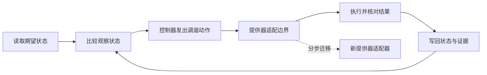

# 架构债与演进式设计

系统变旧不等于欠债，系统持续变化也不等于在做演进式设计。真正需要管理的是某个技术选择如何抬高未来工作的成本，以及这个成本何时会跨越组件、数据所有权或部署边界，变成架构层面的约束。

本文把债务隐喻用于显化未来成本，而不把它当作“重写旧系统”的通行证。[概念目录](/concepts)提供父级入口，[架构思维与表达路径](/paths/architecture-thinking)给出学习顺序；判断偿还优先级时，需要结合[权衡、敏感点与风险](/concepts/fnd-04)。

## 学习问题

- 技术债、架构债与普通遗留问题的边界分别在哪里？
- 一条债务记录至少需要哪些证据，才能进入架构优先级讨论？
- 演进式设计依赖什么反馈与安全网，为什么它不等于“边写边改”？
- 在 Kubernetes 调谐场景中，怎样小步替换结构而不掩盖重试副作用？

## 定义与尺度边界

**技术债**描述一种经济关系：某个设计或构造途径带来短期便利，却使同一类工作以后比现在更昂贵。SEI 的[复杂软件系统技术债管理说明](https://www.sei.cmu.edu/library/managing-technical-debt-in-complex-software-systems/)强调让债务可见、辨别类型并纳入项目规划；它也指出，管理得当的部分债务可以支持设计探索，而未识别、未管理的累积会增加开发和维护成本。

**架构债**是本文对技术债中结构性部分的操作性称呼：其影响穿过局部实现，约束组件职责、依赖方向、数据所有权、部署单元或故障隔离，使多个后续改动共同支付利息。它不是“严重技术债”的同义词；一个很昂贵但完全局部的替换仍可能是实现债，而一个看似很小的共享契约捷径可能成为架构债。

**演进式设计**则是一种设计方式，不是一类债务。Martin Fowler 在[《Is Design Dead?》](https://martinfowler.com/articles/designDead.html)中把它描述为设计随实现一起生长，并把测试、持续集成和重构视为让这种方式可行的支撑实践。它既不是拒绝前期设计，也不是允许临时决定无限堆积；缺少反馈、安全网和持续整理时，所谓“演进”会退化成 code-and-fix。

尺度边界很重要：不是每个遗留问题都是债。过时但稳定、没有增加后续工作成本的模块，可能只是遗留资产；明确违反当前需求的行为首先是缺陷；无法满足可靠性或安全目标的结构首先是架构风险。只有当团队能够说明“当前技术状态—未来活动—额外成本或受限选择”之间的关系时，债务标签才有管理价值。

## 核心机制

债务管理从记录可检验的成本关系开始，而不是先汇总“大家不喜欢的代码”。Ward Cunningham 的 [WyCash 经验报告](https://dl.acm.org/doi/10.1145/157710.157715)奠定了债务隐喻：较早交付可以获得短期价值，但未整理的实现会让后续工作持续支付利息。这个隐喻帮助讨论时机与代价，不提供自动计算偿还顺序的公式。

下面是本站原创的架构债登记表。它要求把当前收益、未来利息、结构影响和触发条件放在同一条记录中：

| 字段 | 要回答的问题 | 可接受的证据 | 边界 |
| --- | --- | --- | --- |
| 债务项与范围 | 哪个具体决定或结构造成约束 | 受影响的契约、组件、数据或部署单元 | 不写“代码很乱”一类笼统评价 |
| 当前收益 | 当时或现在为何保留它 | 交付窗口、兼容约束、迁移顺序或验证成本 | 收益不等于永久合理 |
| 本金 | 消除约束需要哪些工作 | 迁移步骤、测试、数据转换与回退准备 | 估算必须保留不确定性 |
| 利息与暴露 | 哪类未来工作会额外付费 | 变更等待、重复适配、故障恢复困难或发布耦合 | 不把所有维护成本都归因于债务 |
| 触发条件 | 何时复核、偿还或停止扩张 | 需求事件、质量阈值、依赖变更或责任边界变化 | 日期只能提醒，不能替代触发证据 |
| 处置决定 | 接受、限制新增、分步偿还或立即消除 | 决策责任人、验证信号和下一次复核 | 必须允许“不偿还”的明确决定 |

登记后，先用 [FND-04](/concepts/fnd-04) 的权衡与风险视角比较：利息暴露是否触及关键质量属性，偿还本金会不会引入更大的迁移风险，哪些敏感点会改变排序。然后通过 [ADR 生命周期](/methods/mth-03)记录接受或偿还决定、触发条件和证据变化；债务登记册保存经济与结构状态，ADR 保存一次有时效的决策理由，两者不能互相替代。

演进式设计提供的是偿还或避免扩张的路径：保持外部契约可观察，把结构变化切成可验证、可回退的增量，每一步都检查行为与质量属性，而不是承诺一次性重写。若跨数据格式、权限模型或不可逆副作用，必须先建立兼容、迁移和恢复边界；“小步”不能降低这些风险的严重性。

## 常见混淆

第一种混淆是把代码年龄、技术栈年龄或待办数量直接当作债务规模。旧代码可以稳定且低成本，新代码也可能立即制造高利息；缺少未来活动与额外成本的证据时，只能称为维护候选。第二种混淆是把缺陷、架构风险和债务合并进一个榜单。它们可以重叠，但处置逻辑不同：活跃故障需要止损，违反强制要求需要纠正，债务则允许比较本金、利息与机会成本。

第三种混淆是认为所有债都必须尽快偿还。若受影响能力即将退役，偿还本金可能高于剩余利息，明确接受并限制新增依赖更合理。相反，已进入关键变更路径、持续扩大故障域或阻塞必要合规工作的架构债，不能因“暂时还能运行”而无限延期。

第四种混淆是把演进式设计理解为无计划试错。Fowler 讨论的可行性依赖测试、持续集成、重构与简单设计等支撑；没有快速反馈、可观测结果和回退手段时，连续修改只会隐藏失效原因。涉及不可逆数据迁移、安全边界或高代价物理过程时，不应仅靠渐进重构，应先做专门分析、演练与恢复设计。

非使用条件也应明确：没有累积未来成本的局部清理，不必登记为债；正在造成数据损坏、权限越界或服务故障的问题，不应先用债务优先级模型延迟处置；无法建立行为基线和验证信号时，不要把“演进式设计”当作直接修改关键结构的理由。

## 说明性场景

一个平台控制器采用类似 Kubernetes 的调谐循环：读取期望状态，对比观察状态，调用旧资源提供器，再写回状态。为赶上首个交付窗口，控制器直接绑定了提供器协议、重试规则和错误分类。这个选择没有立刻造成缺陷，但每增加一种提供器都要修改同一控制器，并把发布与故障恢复耦合起来，因此团队把它登记为架构债，而不是笼统记为“旧接口问题”。

下面的本站原创流程图展示演进式偿还路径；重点是每一步都保留同一个期望状态与状态回写边界：

团队先在旧调用前建立提供器适配边界，再逐类错误迁移，最后移除控制器中的提供器特例。每一步都验证相同输入是否产生可接受的状态结果，并保留回退路径；债务登记册以“新增提供器不再修改控制器核心”和故障演练结果作为复核证据。这里的结构迁移是原创说明性场景，Kubernetes 本身的机制与证据边界见 [Kubernetes Reconciliation Loop 案例](/cases/kubernetes-reconciliation-loop)。

失败模式在重试边界：若提供器操作不是幂等的，控制器超时后再次调谐可能重复创建外部资源。调谐循环只表达持续收敛意图，不证明副作用安全；迁移必须加入稳定操作标识、结果核对或等效保护，不能用“最终一致”掩盖重复副作用。

## 相邻主题

本文依赖[权衡、敏感点与风险](/concepts/fnd-04)：债务是否值得偿还，取决于本金、利息暴露、质量属性风险和迁移代价的共同判断。完整学习位置见[架构思维与表达路径](/paths/architecture-thinking)，父级术语入口见[概念目录](/concepts)。

相邻的[ADR 生命周期](/methods/mth-03)用于保存接受、限制或偿还债务的决策理由与复核条件，[需求到演进闭环](/methods/mth-06)把这些决定与持续反馈连接起来。[Kubernetes Reconciliation Loop 案例](/cases/kubernetes-reconciliation-loop)可继续检验期望状态、观察状态、重试所有权和副作用边界；它展示可用于演进的控制机制，但不是所有架构债的通用偿还方案。

## 来源

- [Ward Cunningham — The WyCash Portfolio Management System（ACM DOI）](https://dl.acm.org/doi/10.1145/157710.157715)：用于技术债隐喻的历史来源；不据此推导通用利息公式。
- [SEI — Managing Technical Debt in Complex Software Systems](https://www.sei.cmu.edu/library/managing-technical-debt-in-complex-software-systems/)：用于技术债的工作定义、可见化与纳入规划的管理边界。
- [Martin Fowler — Is Design Dead?](https://martinfowler.com/articles/designDead.html)：用于演进式设计及其测试、持续集成、重构等支撑条件；文章讨论的是 XP 与设计语境，不是所有系统的迁移规范。

架构债的尺度定义、债务登记表、调谐迁移流程与说明性场景是本站原创归纳。来源支持技术债与演进式设计的概念边界，不证明每个遗留问题都是债，也不保证渐进修改天然安全。
