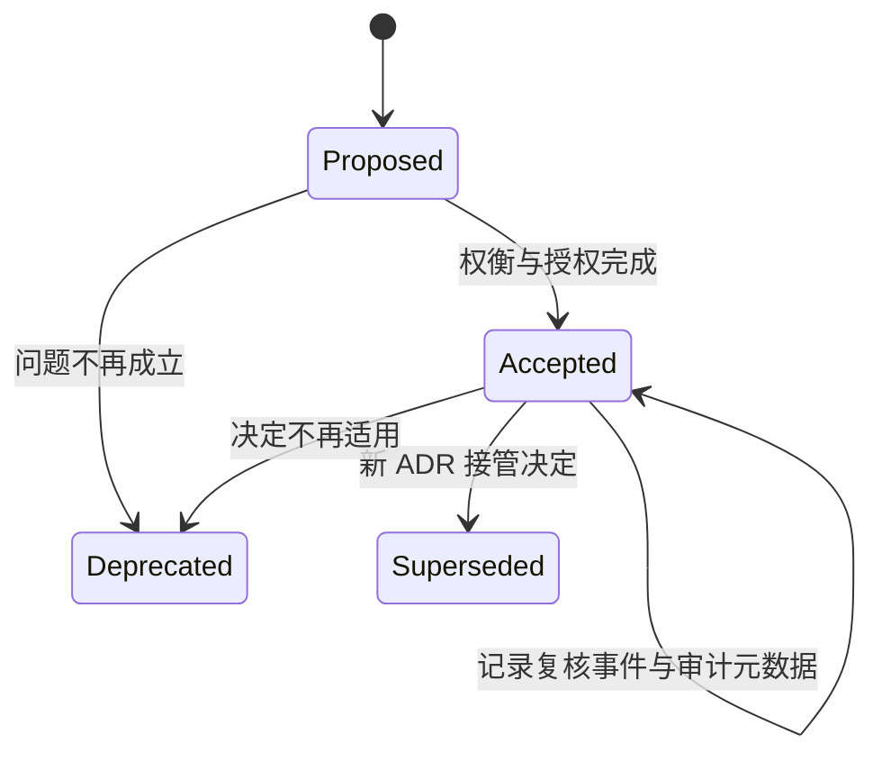

# ADR 生命周期

ADR 的价值不是“存下一份文档”，而是让重要决策的上下文、状态和替代关系可以被后来者复核。[方法目录](/methods)提供其他评审方法，[架构思维与表达路径](/paths/architecture-thinking)给出学习位置；本文把 ADR 当作持续维护的决策记录。

## 学习问题

- 哪些决定值得进入 ADR？
- 接受、替代与废弃分别意味着什么？
- 如何判断一次 ADR 复核已经完成？

## 输入与参与者

输入包括待解决的问题、约束、质量属性场景、候选方案和已知证据。决策所有者对取舍负责，受影响团队提供约束，评审者寻找遗漏与不可逆风险，记录维护者保证状态和链接可追踪。[质量属性场景写法](/quality-attributes/qa-01)可把“更可靠”等口号变成可比较输入。

## 步骤

本文采用的正式状态仅限 `proposed`、`accepted`、`deprecated` 与 `superseded`。先提出 `proposed` 记录，写清上下文、候选、取舍与验证计划；获得授权后转为 `accepted`。当新决定取代旧决定时，新 ADR 指向旧 ADR，旧 ADR 标为 `superseded`；若问题消失且没有替代方案，则标为 `deprecated`。复核是附着在 `accepted` 决定上的审计事件或元数据，不是名为 `reviewed` 的第五个正式状态；它增加日期、证据、当前判断和下一次触发条件，但不覆盖历史状态。

状态图是本文对维护动作的原创归纳，不是要求所有 ADR 工具使用同一字段名。

## 产物

最小产物包含稳定 ID、标题、日期、状态、上下文、候选、决定、后果、验证方式和关联 ADR。已接受 ADR 还应链接实现或监控证据，但不能把代码当前行为误写成决策永远正确。

## 完成判断

`proposed` 的完成条件是问题、上下文、候选、取舍、验证计划和决策责任人齐全；获得明确授权后才能成为 `accepted`。`superseded` 的完成条件是新旧记录双向可追踪，并写明接管范围、迁移与回滚边界。`deprecated` 的完成条件是原问题或决定已不再适用，且没有应由新 ADR 表达的替代决定。对 `accepted` 决定的一次复核事件，只有在记录证据日期、适用前提、复核结论和下一复核触发条件后才完成；只修改“已阅读”不算复核，也不得把它登记成新的正式状态。

## 常见失败

记录每个可逆小选择会淹没真正的架构决定，例如局部变量命名或可随时更换的测试工具不应创建 ADR。另一个失败是接受后原地改写理由，使后来者看不到当时约束。若决定没有跨团队、长期、成本、安全或质量属性影响，轻量 issue 或代码注释通常更合适。

## 与其他方法的衔接

场景评审提供决策输入，风险分析揭示失败后果，ADR 固化被授权的取舍，实施验证再为复核提供证据。[架构债与演进式设计](/concepts/fnd-05)说明为什么决定需要随证据演进，[架构适应度函数](/methods/mth-04)把决定转成持续反馈，[质量属性场景写法](/quality-attributes/qa-01)提供可比较的决策输入。在 [Kubernetes reconciliation loop 案例](/cases/kubernetes-reconciliation-loop)中，可用 ADR 区分“采用声明式期望状态”的决定与具体控制器实现细节。

## 完整演练

以下是本站说明性演练，所有陈旧窗口、时间跨度、编号和复核周期均为假设，不是来源中的生产数据。

输入：团队需要选择订单状态同步方式，要求故障恢复后不丢状态，并允许读取最多陈旧 30 秒。候选是同步双写与事件发布；事件方案需要幂等消费和积压监控。

决策过程：创建 `ADR-017 proposed`，列出两个候选和场景；评审发现同步双写无法在两个存储间提供所需原子性，接受事件方案并记录验证指标，状态转为 `accepted`。六个月后引入事务消息，创建 `ADR-024`，指向 `ADR-017`，写明迁移与回滚；上线验证通过后将 `ADR-017` 标为 `superseded`。季度复核确认积压和陈旧窗口仍满足 30 秒，`ADR-024` 保持 `accepted` 并记录复核日期。

结果：历史理由没有被覆盖，当前决定、替代链和复核证据均可追踪。

## 来源

ADR 的短记录格式与状态思想主要依据 Michael Nygard 的 [Documenting Architecture Decisions](https://cognitect.com/blog/2011/11/15/documenting-architecture-decisions)；替代决定应保留历史并通过链接表达的当前生命周期说明依据 Martin Fowler 的 [Architecture Decision Record](https://martinfowler.com/bliki/ArchitectureDecisionRecord.html)。[Architectural Decision Records 社区索引](https://adr.github.io/)仅作为工具与延伸材料入口，不承担本文核心事实。状态图与演练为原创事实归纳，不复制来源模板。
