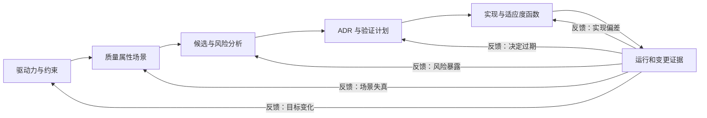

# 从需求到演进的架构闭环

架构方法不是固定瀑布。驱动力、质量场景、风险、决定、实现和运行证据形成一个反馈系统；工作顺序可变，但每次跳转都要说明输入与证据如何改变。[方法目录](/methods)提供父级入口，[架构思维与表达路径](/paths/architecture-thinking)给出完整学习位置。

## 学习问题

- 如何把模糊需求连接到可验证的架构决定？
- 为什么闭环的活动顺序可以调整，但证据链不能省略？
- 运行反馈如何触发场景、决定或实现的复核？
- 什么时候不应套用完整闭环？

## 输入与参与者

输入包括业务目标、硬约束、关键功能、质量属性场景、候选架构、风险、已有 ADR、实现与运行证据。业务与产品负责人解释价值和期限，架构与开发人员维护场景、候选和决定，安全与运维人员补充风险及运行反馈，决策责任人授权取舍。[架构债与演进式设计](/concepts/fnd-05)提供演进成本边界。

## 步骤

1. 从驱动力中筛出会塑造架构的约束与质量目标，用工作坊形成可排序场景。
2. 对候选架构做权衡与风险分析，记录敏感点、假设、风险和需要补证的未知项。
3. 用 ADR 保存被授权的决定、后果、验证计划与复核触发。
4. 实现最小可验证增量，把适应度函数接到开发、交付或运行反馈。
5. 根据证据决定继续、调整实现、替代决定、重写场景或重新排序驱动力。

**Atlas synthesis 1：可变序入口。** 新系统可能从驱动力和场景开始；遗留系统也可能先从事故、监控或架构债进入。顺序可以调整，但必须补齐当前决定所依赖的场景、风险与授权，不能用“敏捷”跳过证据。

以下是本站绘制的原创闭环：

**Atlas synthesis 2：反馈路由。** 不是所有异常都要重做全部活动：需求变化回到驱动力，度量口径错误回到场景，新增故障链回到风险分析，前提失效回到 ADR，代码漂移则回到实现与适应度函数。

## 产物

闭环产物是一条可追踪链：驱动力与约束、场景、候选与风险、ADR、验证机制、实现证据、运行结果、反馈分类和下一动作。每个节点要有负责人、日期和前后链接；图表本身不能替代这些记录。

## 完成判断

闭环没有“永久完成”，但一次演进增量可以完成：关键驱动力已连接到场景和决定，主要风险有处置，决定有验证证据，反馈已分类并进入下一动作，且残余风险由有权者接受。若只能展示文档数量，却无法从运行证据追到被影响的决定，本轮未闭合。

**Atlas synthesis 3：停止条件。** 当反馈未改变驱动力、场景、风险、决定或实现，且残余风险在授权边界内，本轮停止；新证据出现时再开启，而不是让架构会议无限循环。

## 常见失败

常见失败是把闭环画成阶段门瀑布，要求所有项目按同一顺序推进；相反的误用是声称顺序可变便可以跳过场景或授权。另一种失效是收集大量 monitor 和 metric，却不定义反馈应该修改哪个变量。只更新实现、不更新 ADR，或只改需求、不复核验证函数，都会切断证据链。

非使用条件：局部、可逆、没有跨边界影响且现有测试已充分覆盖的代码调整，不应启动完整架构闭环。正在发生的安全越权或数据损坏不可等待闭环会议，应先止损并保全证据。

## 与其他方法的衔接

[架构适应度函数](/methods/mth-04)把决定转成持续信号，[风险风暴与事前验尸](/methods/mth-05)补充风险入口，[架构债与演进式设计](/concepts/fnd-05)帮助判断何时接受或偿还结构成本。工作坊、ATAM 和 [ADR 生命周期](/methods/mth-03)分别提供场景、取舍与决定记录。在 [Microsoft 多智能体参考架构案例](/cases/microsoft-multi-agent-reference-architecture)中，可把协议、编排与可观测性主张转成待验证场景，但参考架构不等于本地决定。

## 完整演练

以下是虚构演练，所有数字为说明性数值。团队要为客服系统增加 4 个专用 agent，业务目标是将人工转交率降低 20%，硬约束是敏感数据不能离开指定区域。质量工作坊得到“高峰期 1,000 个并发会话下，95% 的路由决定在 800 毫秒内完成”场景。候选 A 使用中央编排，候选 B 使用分层路由；风险分析发现中央组件既是延迟敏感点，也是故障域。

团队用 ADR 接受分层路由，验证计划包括依赖规则 test、路由延迟 metric 和失败转交 monitor。第一次压测只有 89% 达到 800 毫秒，于是反馈先回到实现：批处理后达到 96%。随后 GameDay 显示区域故障时人工转交率升到 48%，暴露的不是代码漂移，而是原场景漏掉恢复环境。

团队补写故障场景、重新评估风险，并用新 ADR 替代原路由降级决定。第二次演练在 6 分钟内恢复，敏感数据边界测试持续通过。最后，证据没有再改变目标、场景、风险、决定或实现，本轮停止并约定季度复核，而不是宣称架构永久正确。

## 来源

- [SEI — Quality Attribute Workshops (QAWs), Third Edition](https://www.sei.cmu.edu/library/quality-attribute-workshops-qaws-third-edition/)：用于从利益相关者输入发现并排序质量属性场景。
- [SEI — The Architecture Tradeoff Analysis Method](https://www.sei.cmu.edu/library/the-architecture-tradeoff-analysis-method/)：用于候选架构的敏感点、权衡与风险分析。
- [Michael Nygard — Documenting Architecture Decisions](https://cognitect.com/blog/2011/11/15/documenting-architecture-decisions)：用于上下文、决定和后果的可追踪记录。
- [Thoughtworks — Fitness function-driven development](https://www.thoughtworks.com/en-us/insights/articles/fitness-function-driven-development)：用于把架构目标连接到持续反馈。

闭环、反馈路由和停止条件是本站原创综合；来源分别支持局部方法，不主张存在一个由这些来源共同规定的固定流程。
