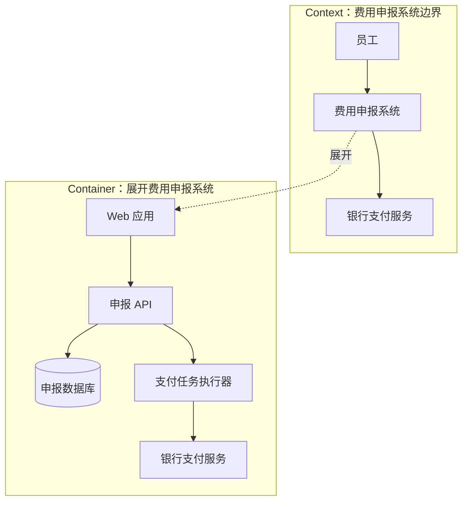

# C4 Context 与 Container

Context 图回答“系统与谁协作”，Container 图回答“系统内部有哪些可运行或存储单元”。它们用于沟通静态边界，不是运行时序列或部署证明。[建模目录](/modeling)提供其他模型入口。

## 学习问题

- Context 与 Container 分别回答什么问题？
- 如何从系统边界推导两个层级？
- 什么情况下 C4 图会产生伪精确？

## 建模目标与输入

输入是明确命名的目标系统、主要用户或外部系统、关键职责，以及可部署或可运行单元。先声明受众与问题：如果评审关心责任和依赖，Context/Container 合适；如果关心毫秒级调用顺序、物理节点或故障切换，必须使用其他模型补充。

## 参与者与步骤

由系统负责人确认边界，业务代表确认用户与外部系统，交付团队确认真实运行单元。步骤是：圈定目标系统；列出边界外参与者与关系；再只展开目标系统，列出容器职责、技术角色、数据所有权与容器间关系；最后让不参与绘图的人复述。

## 模型产物

下面是原创的 Context→Container 两层映射，箭头只表达关系，不声称调用顺序：

Context 层保留系统整体，Container 层只展开目标系统；外部银行仍在边界外。

## 完成判断

图中每个元素有名称、类型、职责，每条关系能用动词说明；系统边界与外部参与者无歧义；Container 与真实部署/运行单元一致。评审者应能指出数据由谁拥有、变化由谁负责，以及图没有表达哪些事实。

## 常见失败

把类、进程、集群和团队混在同一层会产生伪精确；只画技术盒子而不写职责也无法评审边界。不要用 C4 Context/Container 证明运行时先后、网络拓扑、容量或故障切换，因为关系箭头不提供这些证据。若问题是一次请求如何跨组件，应改用序列图或动态视图。

## 与其他模型的衔接

[架构风格比较框架](/styles/sty-00)帮助解释容器为何采用某种连接器与数据边界；部署图补物理节点和冗余；动态视图补关键场景的时间顺序；ADR 记录为什么选择这些边界。模型之间应共享名称，但不互相冒充。

## 完整演练

输入：费用申报系统供员工提交费用，审批后调用外部银行；团队已知有 Web 应用、申报 API、申报数据库和支付任务执行器。

决策：Context 层只保留员工、费用申报系统和银行，说明提交与付款关系。Container 层展开系统，将员工入口分配给 Web，业务与数据所有权分配给 API/数据库，将异步付款分配给任务执行器；银行保持外部。结果：两层图回答不同问题，并明确“审批顺序与重试机制未由本图证明”。若要评审 Agent 系统边界，可把同一方法用于 [Microsoft multi-agent reference architecture 案例](/cases/microsoft-multi-agent-reference-architecture)，但仍需单独验证运行时协作。

## 来源

层级、元素与关系方法依据 [C4 Model](https://c4model.com/)；文档结构与跨视图一致性参考 [arc42](https://arc42.org/)。本文图示与练习原创，未复刻来源图或目录结构。
