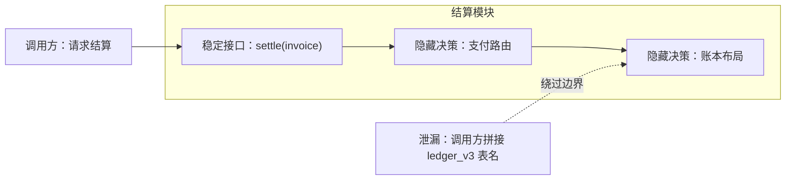

# 信息隐藏与封装

信息隐藏保护的不是某个字段不被读取，而是让一个可能变化的设计决策只由一个边界负责。入口可从[原则目录](/principles)继续浏览；本文用变化传播来判断边界是否真的成立。

## 学习问题

- 信息隐藏保护的是哪类变化？
- 为什么 `private` 不能自动形成架构边界？
- 如何识别泄漏的设计决策？

## 要保护的性质

模块应隐藏那些未来可能改变、且不应迫使使用者同步改变的决策，例如存储布局、缓存策略或第三方协议映射。稳定接口表达使用者需要的能力；实现细节仍可替换。这个判断源自 Parnas 以“困难设计决策”组织模块的论证，而不是从语言可见性规则反推架构。

## 冲突与适用上下文

隐藏越彻底，局部替换成本通常越低，但调试时可观察到的内部状态也可能减少。跨团队边界尤其要权衡：开放原始表结构能让消费方快速交付，却把生产方的迁移节奏交给所有消费方；提供语义化查询接口增加了维护工作，却保留了决策所有权。

不应把所有细节都藏进一个“万能模块”。如果调用方必须组合细粒度能力、性能分析确实需要稳定的低层契约，或边界内外共同拥有同一决策，就应明确公开较低层接口及其兼容承诺。

## 机制

先列出变化假设，再把每项决策分配给唯一所有者，最后以最小能力接口和契约测试固定边界。下图是原创的泄漏检查图：箭头越过边界时只应携带业务意图，不应携带内部表、供应商错误码或缓存键。

检查结论是：`settle` 把意图交给所有者，表名泄漏却让调用方共同承担布局变化。

## 误用与反原则

把字段标成 `private` 只限制直接访问；若 getter 暴露同样的数据布局，决策仍然泄漏。另一个反例是把 DTO 包进对象但要求所有调用方理解内部状态机。封装是实现手段，信息隐藏的验收标准则是“决策改变时，哪些边界外的代码必须一起修改”。

## 适用尺度

函数可隐藏算法选择，模块可隐藏数据结构，服务可隐藏持久化与供应商协议，团队边界可隐藏发布节奏。尺度越大，接口越需要表达长期稳定的业务能力；但不可把网络服务当作默认答案，小型同部署模块用进程内边界往往更简单。

## 相邻原则

[架构风格比较框架](/styles/sty-00)把边界、数据所有权和部署单元放到同一尺度。信息隐藏回答“变化由谁承担”，风格比较再回答“这个边界需要什么连接器与故障隔离”。

## 说明性场景

输入：两个前端团队共享同一个构建时依赖，团队 A 准备升级其路由库。比较两种分解：

1. 按页面分解但导出路由对象，升级会穿过共享对象影响团队 B。
2. 按决策所有权分解，只导出 `navigate(destination)`，路由对象留在团队 A 的适配层。

决策：选择第二种边界，并用契约测试验证已声明的目的地。结果：路由库升级局限在一个模块；若团队 B 确实需要底层路由能力，则另建有版本承诺的低层接口，而不是读取内部对象。[Micro-Frontend 案例](/cases/micro-frontends-single-spa)可用于继续检查共享依赖如何把独立部署重新耦合起来。

## 来源

定义与历史边界依据 [Parnas 的模块分解论文](https://dl.acm.org/doi/10.1145/361598.361623)；架构尺度与权衡用 [SEI Software Architecture: Principles and Practices](https://www.sei.cmu.edu/training/software-architecture-principles-practices/)交叉核对。本文只作事实归纳，图、练习与表述均为原创。
