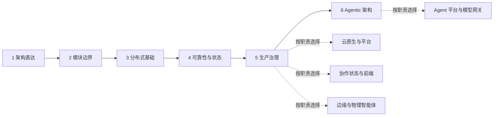

# Multi-Article Learning Roadmap Implementation Plan

> **For agentic workers:** REQUIRED SUB-SKILL: Use superpowers:subagent-driven-development (recommended) or superpowers:executing-plans to implement this plan task-by-task. Steps use checkbox (`- [ ]`) syntax for tracking.

**Goal:** Replace the single long learning-path page with one overview, six main-stage articles, four topic articles, a generated visual roadmap, an exact Mermaid roadmap, and a unified source registry.

**Architecture:** Keep Docusaurus docs as the content boundary. `/paths` becomes a lightweight navigator; ten focused MDX documents own the detailed learning material; `/references` is the single registry for every external source used by the learning path. Tests parse front matter and Markdown directly so the content contract is enforced without a new runtime dependency.

**Tech Stack:** Docusaurus 3.10.2, MDX, Mermaid, Node.js test runner, built-in ImageGen, TypeScript.

## Global Constraints

- Preserve the published `/paths` URL.
- Create exactly six main-stage articles and four topic articles under `content/paths/`.
- Topic articles are readable learning entrances, not empty placeholders.
- Main-stage required reading uses official sources, recognized textbooks, or foundational papers; community indexes and third-party articles are limited to supplementary or advanced reading.
- Every external URL used by a learning-path article must be registered in `content/references/index.mdx`.
- Store the generated project image under `static/img/paths/`; do not reference an ImageGen default output path.
- Use one generated overview image only; do not generate one image per article.
- Do not add dependencies or rewrite existing case articles.
- Preserve unrelated navigation and Kong case commits already present on `main`.

---

## File Structure

### Learning-path content

- Modify `content/paths/index.mdx`: overview, generated image, Mermaid, stage and topic entrances.
- Create `content/paths/01-architecture-thinking.mdx`: stage 1.
- Create `content/paths/02-module-boundaries.mdx`: stage 2.
- Create `content/paths/03-distributed-systems.mdx`: stage 3.
- Create `content/paths/04-reliability-state.mdx`: stage 4.
- Create `content/paths/05-production-governance.mdx`: stage 5.
- Create `content/paths/06-agentic-architecture.mdx`: stage 6.
- Create `content/paths/07-cloud-native-platform.mdx`: cloud-native and platform topic.
- Create `content/paths/08-collaborative-state-frontend.mdx`: collaborative state and frontend topic.
- Create `content/paths/09-edge-physical-agents.mdx`: edge and physical-agent topic.
- Create `content/paths/10-agent-platform-gateway.mdx`: agent platform and model-gateway topic.

Numeric file prefixes lock the autogenerated sidebar order. Published slugs remain semantic and contain no numeric prefix.

### Source registry and assets

- Modify `content/references/index.mdx`: unified categorized source registry.
- Create `static/img/paths/software-architecture-learning-roadmap.png`: generated overview image.

### Tests

- Modify `tests/learning-path.test.mjs`: multi-article structure, navigation, source registration, image, Mermaid, and case coverage.
- Modify `tests/content-validation.test.mjs` only if current metadata validation rejects the planned path metadata; do not weaken existing case validation.

---

### Task 1: Define the multi-article roadmap contract

**Files:**
- Modify: `tests/learning-path.test.mjs`
- Test: `tests/learning-path.test.mjs`

**Interfaces:**
- Consumes: `parseFrontMatter`, `extractMarkdownBody`, and `requiredCaseSlugs`.
- Produces: a test-level contract for `roadmapDocuments`, ordered stage slugs, ordered topic slugs, required article headings, source registration, and the overview visual elements.

- [ ] **Step 1: Replace the single-file fixture with an ordered document manifest**

Add these constants:

```js
const pathDirectory = fileURLToPath(
  new URL('../content/paths/', import.meta.url),
);
const referencesFile = fileURLToPath(
  new URL('../content/references/index.mdx', import.meta.url),
);
const roadmapImageFile = fileURLToPath(
  new URL(
    '../static/img/paths/software-architecture-learning-roadmap.png',
    import.meta.url,
  ),
);

const mainStages = [
  ['01-architecture-thinking.mdx', '/paths/architecture-thinking'],
  ['02-module-boundaries.mdx', '/paths/module-boundaries'],
  ['03-distributed-systems.mdx', '/paths/distributed-systems'],
  ['04-reliability-state.mdx', '/paths/reliability-state'],
  ['05-production-governance.mdx', '/paths/production-governance'],
  ['06-agentic-architecture.mdx', '/paths/agentic-architecture'],
];

const topicPaths = [
  ['07-cloud-native-platform.mdx', '/paths/cloud-native-platform'],
  ['08-collaborative-state-frontend.mdx', '/paths/collaborative-state-frontend'],
  ['09-edge-physical-agents.mdx', '/paths/edge-physical-agents'],
  ['10-agent-platform-gateway.mdx', '/paths/agent-platform-gateway'],
];

const commonArticleHeadings = [
  '## 为什么学',
  '## 前置能力与跳过条件',
  '## 核心问题',
  '## 推荐学习顺序',
  '## 必读起点',
  '## 查漏补缺',
  '## 深入拓展',
  '## 用本站案例深化',
  '## 实践产出',
  '## 检查点',
  '## 继续学习',
];
```

- [ ] **Step 2: Add tests for overview, article structure, and stable slugs**

Add tests that:

1. Read all ten files.
2. Assert each file's `slug` equals the manifest value.
3. Assert main stages use `sidebar_position` 2 through 7.
4. Assert topics use `sidebar_position` 8 through 11.
5. Assert all common headings occur in order.
6. Assert topic articles also contain `## 当前已覆盖` and `## 后续待补`.
7. Assert the overview uses `sidebar_position: 1`, references `/img/paths/software-architecture-learning-roadmap.png`, and contains a Mermaid block.

Use this ordered-heading helper:

```js
function assertHeadingsInOrder(source, headings, label) {
  let previousOffset = -1;
  for (const heading of headings) {
    const offset = source.indexOf(heading);
    assert.ok(offset > previousOffset, `${heading} is missing or out of order in ${label}`);
    previousOffset = offset;
  }
}
```

- [ ] **Step 3: Add source-registry and case-coverage tests**

For every learning-path body:

```js
const externalLinks = [...body.matchAll(/\[[^\]]+\]\((https:\/\/[^)\s]+)\)/g)]
  .map(([, href]) => href);
```

Assert every extracted URL is present in the references body. Combine all eleven path bodies and assert every `requiredCaseSlugs` entry occurs at least once.

Add a main-stage source policy check. Within each `## 必读起点` section, reject Markdown list items that explicitly contain either `GitHub 索引` or `第三方教程`. This tests the editorial label rather than trying to infer ownership from a hostname.

- [ ] **Step 4: Add navigation and generated-asset tests**

Assert:

- Stage 1 links to stage 2.
- Stages 2–5 link to both adjacent stage slugs.
- Stage 6 links back to stage 5 and to `/paths`.
- Every topic links back to `/paths`.
- `stat(roadmapImageFile)` succeeds and the file size is greater than 50 KB.

- [ ] **Step 5: Run the focused test and verify RED**

Run:

```bash
node --test tests/learning-path.test.mjs
```

Expected: FAIL because the ten article files and generated image do not exist and the overview lacks the new visual contract.

- [ ] **Step 6: Commit the failing contract**

```bash
git add tests/learning-path.test.mjs
git commit -m "test: define multi-article roadmap contract"
```

---

### Task 2: Split the six main stages and reduce the overview

**Files:**
- Modify: `content/paths/index.mdx`
- Create: `content/paths/01-architecture-thinking.mdx`
- Create: `content/paths/02-module-boundaries.mdx`
- Create: `content/paths/03-distributed-systems.mdx`
- Create: `content/paths/04-reliability-state.mdx`
- Create: `content/paths/05-production-governance.mdx`
- Create: `content/paths/06-agentic-architecture.mdx`
- Test: `tests/learning-path.test.mjs`

**Interfaces:**
- Consumes: existing six-stage prose from `content/paths/index.mdx`.
- Produces: six semantic routes and an overview that links to them.

- [ ] **Step 1: Create stage front matter with stable order**

Each stage uses the existing path metadata vocabulary and the following unique fields:

```yaml
title: 架构思维与表达
slug: /paths/architecture-thinking
sidebar_position: 2
content_type: path
status: reviewed
difficulty: intermediate
analyzed_at: 2026-07-23
source_cutoff: 2026-07-23
confidence: high
```

Use positions 3–7 and the corresponding slugs for the remaining stages. Keep `domains`, `agent_patterns`, `protocols`, `quality_attributes`, `tags`, and `official_sources` scoped to the article instead of copying the full overview list into every file.

- [ ] **Step 2: Migrate each stage into the common article contract**

Move the current stage's motivation, questions, external resources, cases, checkpoint, and next step into its own article. Add:

- `前置能力与跳过条件`: observable criteria, not time estimates.
- `推荐学习顺序`: three to five numbered actions.
- `实践产出`: one artifact the reader can retain.
- `继续学习`: explicit adjacent links.

Required artifact mapping:

| Stage | Practice artifact |
| --- | --- |
| Architecture thinking | context diagram plus one ADR |
| Module boundaries | module map with ownership and dependency direction |
| Distributed systems | cross-service failure-window trace |
| Reliability and state | long-running-task state machine |
| Production governance | isolation and degradation worksheet |
| Agentic architecture | control, state, permission, and recovery comparison |

- [ ] **Step 3: Replace the overview body with navigation content**

The overview must contain:

- The current reader definition and skip rule.
- An image element using `/img/paths/software-architecture-learning-roadmap.png`.
- A Mermaid `flowchart LR` containing nodes `S1` through `S6` and topic nodes `T1` through `T4`.
- Six linked stage summaries with their practice artifacts.
- Four linked topic summaries.
- A compact list of retained artifacts.

The Mermaid relationship must be:



- [ ] **Step 4: Run the focused test**

Run:

```bash
node --test tests/learning-path.test.mjs
```

Expected: stage structure and navigation assertions pass; topic, source-registry, and image assertions still fail.

- [ ] **Step 5: Commit the main-stage split**

```bash
git add content/paths/index.mdx content/paths/0[1-6]-*.mdx
git commit -m "docs: split architecture roadmap into stages"
```

---

### Task 3: Add four readable topic entrances

**Files:**
- Create: `content/paths/07-cloud-native-platform.mdx`
- Create: `content/paths/08-collaborative-state-frontend.mdx`
- Create: `content/paths/09-edge-physical-agents.mdx`
- Create: `content/paths/10-agent-platform-gateway.mdx`
- Test: `tests/learning-path.test.mjs`

**Interfaces:**
- Consumes: topic summaries and case links from the old overview.
- Produces: four stable topic routes with present coverage and bounded expansion lists.

- [ ] **Step 1: Create topic front matter**

Use `content_type: path`, `status: reviewed`, and positions 8–11. Use these slugs:

```text
/paths/cloud-native-platform
/paths/collaborative-state-frontend
/paths/edge-physical-agents
/paths/agent-platform-gateway
```

- [ ] **Step 2: Write the cloud-native and collaboration topic entrances**

The cloud-native article must teach this order:

1. container and deployment model
2. service and network boundary
3. reconciliation, scaling, and release
4. observability and SLO
5. GitOps, infrastructure, and platform ownership
6. security and isolation

Use Kubernetes Basics as required reading. Use CNCF Curriculum and relevant Awesome Software Architecture sections as supplementary indexes. Map Kubernetes reconciliation, AWS cell architecture, Cloudflare Durable Objects, and Microsoft reference architecture as local cases.

The collaboration article must teach this order:

1. state ownership
2. transport and reconnect
3. OT/CRDT convergence
4. semantic conflicts and authorization
5. runtime composition and team ownership

Use Yjs documentation as required reading. Use Awesome Front-end System Design and the Awesome Software Architecture micro-frontend section as supplementary indexes. Map Yjs and single-spa as local cases.

- [ ] **Step 3: Write the edge and agent-platform topic entrances**

The edge article must teach this order:

1. cloud-edge responsibility
2. offline autonomy
3. delivery and synchronization semantics
4. node lifecycle and real-time constraints
5. independent physical safety chain

Use KubeEdge and ROS 2 official concepts as required reading. Map the KubeEdge and ROS 2 cases.

The agent-platform article must teach this order:

1. model and capability routing
2. identity, virtual keys, quotas, and cost
3. guardrail placement
4. stateful orchestration and protocol boundaries
5. evaluation, observability, and isolation

Use LiteLLM, OpenAI Agents SDK, A2A, and MCP official documentation as required reading. Use Envoy AI Gateway and community agentic-engineering indexes for supplementary comparison. Map New API, LiteLLM, Kong AI Gateway, OpenAI Agents SDK, LangGraph, Google ADK/A2A, and Microsoft reference architecture.

- [ ] **Step 4: Make topic limits explicit**

For each topic:

- `当前已覆盖` names the mechanisms supported by present local cases.
- `后续待补` names three to six concrete content gaps.
- The gap list must not imply that an unresearched mechanism is already recommended.
- `继续学习` links to `/paths` and the most relevant main stage.

- [ ] **Step 5: Run the focused test**

Run:

```bash
node --test tests/learning-path.test.mjs
```

Expected: all article existence, heading, slug, sidebar-position, and navigation assertions pass; source registration and generated image still fail.

- [ ] **Step 6: Commit the topic entrances**

```bash
git add content/paths/0[7-9]-*.mdx content/paths/10-agent-platform-gateway.mdx
git commit -m "docs: add architecture topic learning entrances"
```

---

### Task 4: Turn the references page into the unified source registry

**Files:**
- Modify: `content/references/index.mdx`
- Test: `tests/learning-path.test.mjs`

**Interfaces:**
- Consumes: every HTTPS Markdown link in the eleven learning-path documents.
- Produces: one human-readable registry in which the exact URL string of every path source appears.

- [ ] **Step 1: Preserve the evidence policy and replace the launch-only inventory**

Keep the current source priority, publication date, access date, and inference-boundary guidance. Replace `五个首发案例的一手来源族` with:

1. `## 如何使用资料库`
2. `## 官方文档`
3. `## 官方仓库`
4. `## 论文与工程演讲`
5. `## GitHub 索引`
6. `## 工程博客与第三方教程`

- [ ] **Step 2: Use one entry format consistently**

Each entry uses:

```md
### C4 Model

- **来源类型**：官方文档
- **适用范围**：架构思维与表达
- **用途**：必读起点；区分系统、容器、组件和代码层级。
- **核查日期**：2026-07-23
- **使用边界**：提供表达模型，不替代质量属性分析或架构决策记录。
- **入口**：[C4 Model](https://c4model.com/)
```

For GitHub indexes and third-party sources, state that they are navigation or explanation aids and are not the sole evidence for architecture facts.

- [ ] **Step 3: Register the core main-stage sources**

At minimum register the exact URLs used for:

- Awesome Software Architecture and selected internal pages
- System Design Primer
- roadmap.sh Software Architect
- C4 Model
- arc42
- Google SRE Workbook
- CNCF Curriculum

- [ ] **Step 4: Register the four-topic sources**

At minimum register the exact URLs used for:

- Kubernetes Basics
- Yjs documentation
- KubeEdge documentation
- ROS 2 Jazzy concepts
- LiteLLM virtual keys
- OpenAI Agents SDK multi-agent guide
- LangGraph overview
- Google ADK multi-agent guide
- A2A documentation
- MCP introduction
- Envoy AI Gateway
- Awesome Front-end System Design
- Awesome Agentic Engineering Resources

If a learning article uses a more specific URL than this list, register that exact URL rather than relying on the domain root.

- [ ] **Step 5: Run the focused test and resolve every missing registration**

Run:

```bash
node --test tests/learning-path.test.mjs
```

Expected: source registration and editorial source policy pass; only the missing generated image assertion fails.

- [ ] **Step 6: Commit the source registry**

```bash
git add content/references/index.mdx
git commit -m "docs: centralize architecture learning sources"
```

---

### Task 5: Generate and integrate the visual roadmap

**Files:**
- Create: `static/img/paths/software-architecture-learning-roadmap.png`
- Modify: `content/paths/index.mdx` only if the generated composition requires revised alt text or caption.
- Test: `tests/learning-path.test.mjs`

**Interfaces:**
- Consumes: the approved six-stage and four-topic structure.
- Produces: a repository-owned raster overview asset used by `/paths`.

- [ ] **Step 1: Generate one project-bound image with built-in ImageGen**

Use this prompt:

```text
Use case: infographic-diagram
Asset type: wide website learning-roadmap illustration
Primary request: visualize the growth of an experienced software developer who is learning software architecture systematically, moving from local code and modules through distributed systems, reliability, production governance, and agentic architecture, then opening into four optional directions: cloud platforms, collaborative applications, edge robotics, and AI model gateways
Scene/backdrop: clean light neutral background suitable for a technical documentation website
Style/medium: polished editorial infographic illustration, vector-like geometric forms, restrained technical aesthetic
Composition/framing: wide landscape flow from left to right; six clearly separated milestones on one main path; four smaller branches at the right; generous margins; readable at desktop and mobile crop widths
Color palette: deep navy, slate, teal, warm amber accents; sufficient contrast in light and dark page frames
Constraints: no paragraphs; no small labels; use simple symbolic architecture imagery instead of detailed UI; no logos; no trademarks; no watermark
Avoid: photorealism, decorative clutter, illegible generated text, circuit-board clichés, futuristic city scenes
```

Use the built-in ImageGen tool, not CLI fallback.

- [ ] **Step 2: Inspect the generated result**

Verify:

- one dominant left-to-right route
- six visually distinct milestones
- four secondary branches
- no broken or prominent generated text
- no brand marks or watermarks
- enough negative space for responsive display

If one condition fails, make one targeted ImageGen iteration that changes only the failing property.

- [ ] **Step 3: Copy the selected output into the repository**

Create `static/img/paths/` if absent. Copy the selected built-in output to:

```text
static/img/paths/software-architecture-learning-roadmap.png
```

Do not overwrite any unrelated asset.

- [ ] **Step 4: Run the focused test and verify GREEN**

Run:

```bash
node --test tests/learning-path.test.mjs
```

Expected: all learning-path tests pass.

- [ ] **Step 5: Commit the generated asset**

```bash
git add static/img/paths/software-architecture-learning-roadmap.png content/paths/index.mdx
git commit -m "docs: add visual architecture learning roadmap"
```

---

### Task 6: Validate content metadata and generated navigation

**Files:**
- Modify: `tests/content-validation.test.mjs` only if a metadata regression test is needed.
- Modify: path MDX files only to correct validation or broken-link defects.
- Test: `tests/content-validation.test.mjs`
- Test: `tests/learning-path.test.mjs`

**Interfaces:**
- Consumes: all content documents and Docusaurus autogenerated sidebar behavior.
- Produces: valid metadata, unique slugs, and buildable navigation.

- [ ] **Step 1: Run focused content validation**

Run:

```bash
npm run validate:content
```

Expected: all content documents validate. If `sidebar_position` is rejected, add a test proving path documents may use a positive integer and update validation narrowly; do not relax required case metadata.

- [ ] **Step 2: Run catalog verification**

Run:

```bash
npm run check:catalog
```

Expected: generated case catalog remains unchanged by path and reference additions.

- [ ] **Step 3: Run the learning-path and content-validation tests together**

Run:

```bash
node --test tests/learning-path.test.mjs tests/content-validation.test.mjs
```

Expected: all tests pass with zero failures.

- [ ] **Step 4: Commit any validation-only corrections**

If no files changed, skip the commit. Otherwise:

```bash
git add tests/content-validation.test.mjs content/paths content/references/index.mdx
git commit -m "test: validate roadmap document metadata"
```

---

### Task 7: Full verification and rendered-page review

**Files:**
- Modify: only files needed to fix verified defects in the learning-path scope.

**Interfaces:**
- Consumes: the complete implementation.
- Produces: evidence that tests, content validation, type checking, production build, links, and responsive rendering work.

- [ ] **Step 1: Run the full repository verification**

Run:

```bash
npm run verify
```

Expected:

- Node tests report zero failures.
- Content validation succeeds.
- Catalog check succeeds.
- TypeScript typecheck succeeds.
- Docusaurus production build succeeds.

- [ ] **Step 2: Serve the production build**

Run:

```bash
npm run serve -- --host 127.0.0.1
```

Keep the process running in a reusable terminal session.

- [ ] **Step 3: Review desktop rendering**

Inspect at 1440px width:

- `/agentic-architecture-atlas/paths`
- all six main-stage routes
- all four topic routes
- `/agentic-architecture-atlas/references`

Confirm the image is clear, the Mermaid graph renders, sidebar order is 1–11, adjacent links work, and no console errors appear.

- [ ] **Step 4: Review mobile rendering**

Inspect `/agentic-architecture-atlas/paths` and one representative main-stage and topic article at 390px width. Confirm:

- no page-level horizontal overflow
- image scales within the article column
- Mermaid remains scrollable or scaled without widening the page
- sidebar and article navigation remain usable

- [ ] **Step 5: Verify changed-file scope**

Run:

```bash
git status --short
git diff --check
git diff --stat origin/main...HEAD
```

Confirm there are no generated build artifacts, temporary ImageGen files, or unrelated changes.

- [ ] **Step 6: Commit final verified corrections**

If verification required changes:

```bash
git add content/paths content/references/index.mdx static/img/paths tests/learning-path.test.mjs tests/content-validation.test.mjs
git commit -m "fix: polish multi-article learning roadmap"
```

- [ ] **Step 7: Re-run the full verification after the final commit**

Run:

```bash
npm run verify
```

Expected: zero failures and a successful production build from the committed state.

