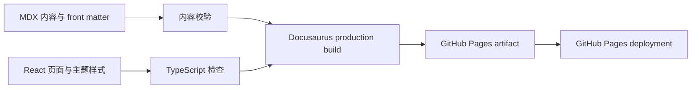

# Agentic Architecture Atlas 设计规格

**日期：** 2026-07-20  
**状态：** 已通过书面审阅
**仓库：** `sealday/agentic-architecture-atlas`  
**本地根目录：** `/Users/seal/projects/tego-arch`
**站点：** `https://sealday.github.io/agentic-architecture-atlas/`

## 1. 目标

建立一个中文、公开、可持续扩展的 AI 智能体架构案例学习网站。首版深入分析五个跨生态多智能体案例，使用统一模板解释控制权、上下文、状态、容错、安全、观测和评测等架构问题，并通过模式、设计题、学习路径和资料库为未来上百个案例保留稳定扩展边界。

首版的成功标准：

- GitHub 上存在公开仓库 `sealday/agentic-architecture-atlas`。
- Docusaurus 网站通过 GitHub Actions 自动发布到 GitHub Pages。
- 五个首发案例均有独立、可导航的中文分析页面。
- 每个案例包含 Mermaid 架构图、关键源码导读和可追溯来源。
- 案例、模式、设计题、学习路径和资料使用稳定的内容目录与 URL。
- 本地内容校验、类型检查和生产构建全部通过后才允许部署。

## 2. 非目标

首版不建设：

- 用户账号、评论、收藏或学习进度后端。
- 数据库、知识图谱服务或服务端搜索。
- 中英双语内容。
- 每个案例的可运行 Demo。
- 博客、文档版本化、排行榜或社区积分。
- 对所有多智能体框架进行产品选型排名。

这些能力只有在真实内容量或协作需求出现后再评估。

## 3. 受众与使用方式

主要受众是希望通过真实开源项目学习 AI 智能体系统架构的中文开发者和架构师。

典型使用路径：

1. 从首页选择一个精选案例。
2. 先阅读学习问题和一页摘要，再查看系统边界及架构图。
3. 沿核心流程理解 Agent 的控制权、上下文和状态变化。
4. 通过源码导读进入上游仓库的关键实现。
5. 查看决策、权衡、生产化风险和可迁移经验。
6. 从案例跳转到相关架构模式、协议、设计题或学习路径。

## 4. 首发五个案例

### 4.1 Microsoft Multi-Agent Reference Architecture

学习主线：企业级多智能体的组件边界、Agent Registry、记忆、通信、治理、安全、评测与可观测性。

主要来源：[Microsoft Multi-Agent Reference Architecture](https://github.com/microsoft/multi-agent-reference-architecture)。

### 4.2 OpenAI Agents SDK

学习主线：Manager（Agents as Tools）和 Handoff 两种控制权模型，以及何时使用代码驱动的确定性编排。

主要来源：[OpenAI Agents SDK Multi-Agent Guide](https://openai.github.io/openai-agents-python/multi_agent/)。

### 4.3 LangGraph Supervisor

学习主线：显式状态图、Supervisor、上下文隔离、检查点、恢复，以及 Fan-out/Fan-in 并行协作。

主要来源：[LangGraph](https://github.com/langchain-ai/langgraph) 与 [LangChain Subagents 文档](https://docs.langchain.com/oss/python/langchain/multi-agent/subagents)。

### 4.4 Google ADK + A2A

学习主线：层级 Agent、顺序/并行/循环工作流，以及通过 A2A 进行跨框架 Agent 通信。

主要来源：[Google Agent Development Kit](https://github.com/google/adk-python) 与 [A2A Protocol](https://github.com/a2aproject/A2A)。

### 4.5 AWS CLI Agent Orchestrator

学习主线：面向编码任务的 Supervisor-Worker、任务分派、进程隔离、生命周期和 MCP 工具接入。

主要来源：[AWS CLI Agent Orchestrator](https://github.com/awslabs/cli-agent-orchestrator) 与 [Model Context Protocol](https://github.com/modelcontextprotocol/modelcontextprotocol)。

五个案例分别承担企业参考架构、轻量控制权模型、持久化运行时、跨系统协议和编码 Agent 编排的代表角色。首版不增加第六个案例。

## 5. 信息架构

五个案例是第一期精选集合，而不是系统边界。稳定的顶层导航为：

- 首页
- 案例库
- 架构模式
- 设计题
- 学习路径
- 资料库
- GitHub

正式发布内容位于：

```text
content/
├── intro.mdx
├── cases/
├── patterns/
├── questions/
├── paths/
└── references/
```

内容类型职责：

- `cases/`：真实项目案例，是事实和分析的主入口。
- `patterns/`：从多个案例归纳的架构模式，不脱离案例凭空给出最佳实践。
- `questions/`：设计题和思考题，可引用多个案例与模式。
- `paths/`：按学习目标、难度或主题组合已有内容，不复制正文。
- `references/`：记录仓库、官方文档、论文和工程博客的来源属性及可信度。

首版为所有内容类型提供可用入口，但完整正文范围只承诺五个案例。其他栏目提供方法说明、分类方式和与首发案例有关的种子索引。

## 6. 可扩展性设计

系统保留七个明确扩展口：

1. **内容扩展：** 新增案例只增加 MDX 文件和资源，不修改顶层导航。
2. **分类扩展：** 通过 front matter 增加领域、模式、协议、难度和质量属性标签。
3. **题库扩展：** 设计题是独立内容类型，可反向引用多个案例。
4. **专题扩展：** 学习路径只保存内容引用和顺序，可自由组合案例、模式和题目。
5. **搜索扩展：** 先保证稳定 URL 与结构化元数据，内容达到数十篇后再接入搜索。
6. **协作扩展：** 统一模板、内容状态和证据等级支持未来外部贡献与审核。
7. **技术扩展：** 若 Docusaurus 原生索引不足，可增加构建期索引生成器，而不迁移 MDX 内容。

导航不列出全部案例。首页只展示精选集合，案例库通过目录、标签和未来筛选页发现内容，因此案例增长不会导致顶层导航线性膨胀。

## 7. 内容模型

每篇正式内容使用结构化 front matter。案例至少包含：

```yaml
title: LangGraph Supervisor
slug: /cases/langgraph-supervisor
content_type: case
status: reviewed
difficulty: intermediate
analyzed_at: 2026-07-20
source_cutoff: 2026-07-20
confidence: high
domains:
  - agent-runtime
agent_patterns:
  - supervisor
  - fan-out-fan-in
protocols: []
quality_attributes:
  - recoverability
  - observability
tags:
  - LangGraph
  - 多智能体
```

必填字段由内容校验测试维护。枚举值集中定义，避免出现 `multi-agent`、`multi_agent` 和 `multiagent` 等重复分类。

所有重要结论在正文中区分：

- **已证实事实：** 可由上游仓库、官方文档或原始资料直接支持。
- **基于证据的推断：** 由多个事实推导，明确说明推断关系。
- **个人分析：** 用于学习的判断、建议或迁移思考，不冒充项目官方结论。

## 8. 案例页面模板

每个首发案例采用相同结构：

1. 学习问题
2. 一页摘要
3. 事实边界与证据等级
4. 系统与 Agent 边界
5. Mermaid 架构图
6. 控制权、上下文和任务流
7. 关键源码导读
8. 架构决策与权衡
9. 状态、容错、安全、观测和评测分析
10. 可迁移经验、适用条件和失效条件
11. 未知项与进一步问题
12. 来源与访问日期

源码导读不复制大段上游代码，只提供模块定位、关键类型或函数、调用关系和阅读顺序，并链接到上游固定文件或文档页面。

## 9. 视觉设计

采用 **Research Notebook** 方向：

- 暖白背景模拟研究纸张，而不是默认纯白文档站。
- 砖红色作为链接、标签和重点提示的主强调色。
- 中文正文采用系统无衬线字体以保证长文清晰；标题使用适合中英文混排的衬线字体栈。
- 卡片、引用和事实标签使用细线边框与轻量纸张层次，不使用高饱和渐变和大面积阴影。
- 案例编号、分析日期和证据等级形成稳定的研究档案视觉语言。
- 同时支持深色模式，但首版以浅色阅读体验为主要验收对象。

首页结构：

1. 品牌标题和一句价值主张。
2. 五个首发案例的精选集合。
3. 建议学习路径。
4. 架构模式、设计题和资料库入口。
5. 方法论说明与 GitHub 贡献入口。

响应式要求：案例卡片在桌面端使用多列网格，在窄屏变为单列；正文行宽保持适合中文长文阅读；表格允许横向滚动；Mermaid 图不得撑破内容区域。

## 10. 技术架构

- Docusaurus 3，classic 模板。
- TypeScript 与 React。
- npm 与锁文件保证可重复安装。
- MDX 承载正文和少量交互式展示。
- Docusaurus Mermaid 主题渲染架构图。
- 单个 Docusaurus docs 内容插件读取 `content/`，通过目录与侧边栏组织不同内容类型。
- 首页和必要的索引交互放在 `src/`，不把正文硬编码进 React 组件。
- 精选集合使用轻量 TypeScript 数据文件保存文档 URL、摘要和展示顺序。
- 图片与 `.nojekyll` 放在 `static/`。

预期代码结构：

```text
agentic-architecture-atlas/
├── .github/workflows/
│   └── deploy.yml
├── content/
│   ├── cases/
│   ├── patterns/
│   ├── questions/
│   ├── paths/
│   └── references/
├── docs/superpowers/
│   ├── specs/
│   └── plans/
├── scripts/
│   └── validate-content.mjs
├── src/
│   ├── components/
│   ├── css/
│   ├── data/
│   └── pages/
├── static/
│   ├── img/
│   └── .nojekyll
├── docusaurus.config.ts
├── sidebars.ts
├── package.json
└── tsconfig.json
```

Docusaurus 当前要求 Node.js 20 或更高；本机 Node.js 24 满足要求。官方推荐使用 classic 模板，并支持将生产构建输出发布到 GitHub Pages。参考：[Docusaurus Installation](https://docusaurus.io/docs/installation) 与 [Docusaurus Deployment](https://docusaurus.io/docs/deployment)。

## 11. 构建与发布数据流



本地开发读取 `content/`、`src/` 和配置文件。生产构建先运行内容校验和类型检查，再由 Docusaurus 生成静态文件。GitHub Actions 仅在这些步骤全部成功后上传并部署 Pages artifact。

## 12. GitHub 与部署设计

- 所有者：`sealday`
- 仓库：`agentic-architecture-atlas`
- 可见性：public
- 默认分支：`main`
- Pages 类型：project site
- `url`：`https://sealday.github.io`
- `baseUrl`：`/agentic-architecture-atlas/`
- `organizationName`：`sealday`
- `projectName`：`agentic-architecture-atlas`
- `trailingSlash`：`false`，避免 GitHub Pages 自动补斜杠造成路由差异。
- 通过官方 `actions/upload-pages-artifact` 与 `actions/deploy-pages` 工作流部署。
- GitHub Pages 使用 Actions 作为构建来源。

仓库创建、首次推送和 Pages 配置通过 GitHub CLI 完成。远程仓库创建属于实施阶段，不在设计阶段提前执行。

## 13. 错误处理

- 缺少必填 front matter：内容校验失败并阻止构建。
- 分类枚举不存在：内容校验给出文件名、字段和值。
- 内部链接失效：Docusaurus production build 失败。
- TypeScript 类型错误：类型检查失败。
- Mermaid 语法错误：构建或页面冒烟检查必须暴露问题；修复前不部署。
- GitHub Actions 构建失败：deploy job 不运行，线上版本保持不变。
- Pages 配置失败：使用 `gh api` 读取仓库 Pages 状态和 Actions 日志定位，不反复盲目推送。
- 上游来源失效：正文保留访问日期，后续内容审阅将其标记为待复核，不静默删除历史结论。

## 14. 测试与验证

首版验证分四层：

1. **内容测试**
   - 五个首发案例文件全部存在。
   - 每个案例包含所有必填 front matter。
   - `content_type`、`status`、`difficulty` 和分类字段使用允许值。
   - 每个案例至少包含一个官方来源链接。

2. **静态检查**
   - TypeScript `tsc --noEmit` 通过。
   - 格式和配置文件可被工具解析。

3. **生产构建**
   - `npm run build` 成功。
   - Docusaurus 不报告失效内部链接或路由冲突。

4. **部署冒烟验证**
   - GitHub Actions workflow 成功。
   - Pages URL 返回成功状态。
   - 首页、五个案例路由、一个 Mermaid 图和窄屏布局可访问。

配置、脚手架和生成文件本身不强行套用单元测试；自定义内容校验器和自定义 React 行为遵循先写失败测试、再实现的顺序。

## 15. 无障碍与内容质量

- 文字与背景满足常规对比度要求。
- 键盘可以访问导航、链接和交互控件。
- 不依赖颜色单独表达事实、推断或个人分析状态。
- Mermaid 图附近提供文字解释，避免图成为唯一信息载体。
- 标题层级连续，链接文本描述目标，不使用大量“点击这里”。
- 页面提供来源日期和分析日期，避免将旧资料呈现为当前事实。

## 16. 首版验收清单

- [ ] 本地仓库使用 `main` 分支并包含设计与实施记录。
- [ ] Docusaurus TypeScript 项目位于仓库根目录。
- [ ] Research Notebook 视觉在桌面和移动宽度下可阅读。
- [ ] 顶层导航包含首页、案例库、架构模式、设计题、学习路径、资料库和 GitHub。
- [ ] 五个首发案例使用统一模板并包含架构图和源码导读。
- [ ] 内容目录和 front matter 支持未来扩展到上百案例。
- [ ] 内容校验、类型检查和生产构建通过。
- [ ] 公开 GitHub 仓库创建并完成首次推送。
- [ ] GitHub Pages Actions 部署成功，线上 URL 可访问。

## 17. 后续演进触发条件

- 案例达到约 30 篇且浏览困难时，引入基于 front matter 的构建期筛选索引。
- 内容达到约 50–100 篇或站内查找成为主要需求时，引入全文搜索。
- 外部贡献稳定出现时，增加贡献指南、内容审阅状态和自动来源检查。
- 同一主题出现至少三个高质量案例后，再建立独立的深度模式页面。
- 只有在静态构建时间、内容关系或协作流程出现实证瓶颈时，才考虑数据库或后端服务。
