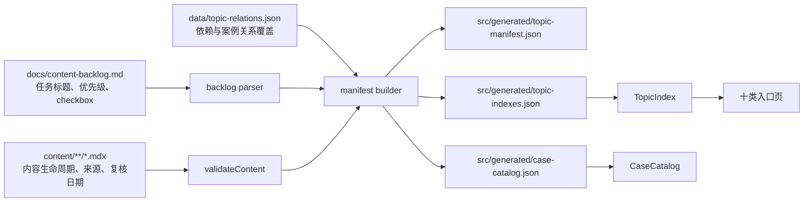

# 内容平台核心设计

**日期：** 2026-07-23
**范围：** `docs/content-backlog.md` 的 E0-01、E0-02
**目标读者：** 后续内容作者、内容平台维护者与实现本方案的工程代理

## 1. 目标

本次改造建立后续知识页的最小内容平台，不创作具体知识正文。完成后：

1. 内容校验器认识 `concept`、`principle`、`quality-attribute`、`method`、`modeling`、`style` 六类知识页。
2. 每类知识页有明确的必需元数据和有序章节契约。
3. 仓库存在一个确定性生成、机器可读的主题 manifest。
4. manifest 覆盖主题 ID、类型、slug、优先级、状态、依赖、主要来源、相关案例和最近复核日期。
5. 十类内容入口从 manifest 的生成索引读取主题清单；尚未发布的主题只显示为计划项，不产生 404 链接。
6. `docs/content-backlog.md` 仍是唯一人工任务状态来源，manifest 不允许形成第二套手工进度。
7. 现有 18 篇案例、学习路线、案例筛选和公开 URL 保持兼容。

## 2. 约束与边界

- 不新增 npm 依赖。解析、生成和测试使用 Node.js 内置模块。
- 不把 `docs/content-backlog.md` 改造成 JSON 或 CMS。
- 不要求本故事一次补齐全部主题之间的依赖和案例关系；字段必须存在，允许计划主题使用空数组。
- 已发布主题必须有至少一个 HTTPS 主要来源和合法复核日期；计划主题可以等待研究后补充来源和复核日期。
- 不为尚未撰写的主题生成空文章。索引将其显示为不可点击的计划项，并在有来源时提供外部学习入口。
- 不替换现有 `CaseCatalog` 的筛选体验。案例目录继续使用兼容 JSON，但该 JSON 与各类型索引由同一份 manifest 快照生成。
- 本次不处理 E0-03 全站 source ledger、E0-04 五类 fixture、E0-06 模式分组和 E0-07 案例分类扩展性；平台为这些故事提供契约和生成边界。

## 3. 现状

当前 `scripts/content-schema.mjs` 只允许：

```text
case, pattern, question, path, reference
```

所有内容共享一组基础字段，只有案例拥有专属元数据和严格的十段式章节校验。`scripts/validate-content.mjs` 同时承担基础字段、案例字段、案例章节、slug 唯一性和案例集合覆盖检查。

案例目录由：

```text
content/*.mdx
  -> validateContent()
  -> scripts/generate-case-catalog.mjs
  -> src/generated/case-catalog.json
  -> CaseCatalog
```

生成。其余入口是手写 MDX；六个新知识类型还没有目录。侧栏使用 Docusaurus 根目录自动生成。

`docs/content-backlog.md` 已明确：

- checkbox 是唯一人工任务状态；
- manifest 的任务状态必须由 backlog 生成只读投影；
- 内容生命周期状态可以存在，但不能表达任务完成进度。

## 4. 比较过的方案

### 方案 A：手工维护一个完整 manifest

在 `data/topic-manifest.json` 直接维护所有字段，包括 `status`，索引读取该文件。

优点：

- 实现最简单；
- manifest 直观，编辑器和其他脚本都容易消费；
- 不需要解析 backlog。

缺点：

- `status` 会与 backlog checkbox 形成双写；
- 标题、优先级和任务完成状态容易漂移；
- 恢复时无法判断 backlog 还是 manifest 才是真实来源。

结论：不采用。它违反已经发布的唯一进度源约束。

### 方案 B：只扫描已发布 MDX

manifest 完全由 front matter 生成，状态使用文章的 `draft/reviewed/revisited`。

优点：

- 与当前案例目录生成方式一致；
- 不需要解析 backlog；
- 每个 manifest 条目都对应真实页面。

缺点：

- 无法展示计划主题、依赖和优先级；
- 不能支撑 backlog 中尚未内化的知识地图；
- “唯一主题清单”会退化为“已发布页面清单”。

结论：不采用。它无法满足 E0-02 的规划与导航用途。

### 方案 C：从 backlog 与内容生成投影式 manifest

以 backlog 产生计划主题和任务状态，以已校验 MDX 提供已发布页面、来源与复核信息，再应用不包含任务状态的关系覆盖，合成为唯一的生成 manifest。

优点：

- backlog 继续单写任务状态；
- 已发布内容仍以 front matter 为内容事实；
- 索引可以同时展示已发布和计划主题；
- 生成结果可以做 stale check，适合 CI；
- 后续 E0-03、E0-13 和 E0-14 可以直接扩展来源、关系和复核规则。

代价：

- 需要一个受测试保护的 backlog 解析器；
- 必须明确处理已发布内容与 backlog 条目的合并；
- status 不能再是含义不明的字符串。

**推荐方案：C。** 它在不引入 CMS 的前提下保持单一人工状态源，并给后续内容工程提供稳定接口。

## 5. 总体架构



生成器只读取三类人工输入：

1. backlog：任务 ID、标题、P0–P3、checkbox；
2. 内容 front matter：已发布页面和内容生命周期；
3. 关系覆盖：依赖与相关案例，不包含任务状态、优先级或标题。

生成文件只由命令写入，不允许手工修复。

## 6. 内容类型契约

### 6.1 基础类型

`allowedValues.content_type` 扩展为：

```js
[
  'case',
  'concept',
  'principle',
  'quality-attribute',
  'method',
  'modeling',
  'style',
  'pattern',
  'question',
  'path',
  'reference',
]
```

当前基础字段保持兼容。六个新知识类型额外要求：

```text
summary
topic_id
priority
depends_on
related_cases
```

字段含义：

- `summary`：索引卡片使用的一句话说明，非空字符串；
- `topic_id`：与 backlog 条目匹配的稳定 ID，例如 `FND-01`；
- `priority`：`P0`、`P1`、`P2`、`P3`；
- `depends_on`：主题 ID 数组；
- `related_cases`：站内 `/cases/...` slug 数组。

`official_sources` 继续是内容页的一手来源字段。manifest 将它投影为 `primary_sources`。`analyzed_at` 投影为 `reviewed_at`，避免新增同义日期字段。

### 6.2 六类有序章节

章节契约只检查 H2，并要求精确顺序。E0-04 会用 fixture 进一步校准内容密度和模板细节。

#### Concept

```text
## 学习问题
## 定义与尺度边界
## 核心机制
## 常见混淆
## 说明性场景
## 相邻主题
## 来源
```

#### Principle

```text
## 学习问题
## 要保护的性质
## 冲突与适用上下文
## 机制
## 误用与反原则
## 适用尺度
## 相邻原则
## 说明性场景
## 来源
```

#### Quality attribute

```text
## 学习问题
## 定义与业务目标
## 质量属性场景
## 架构策略
## 测量信号与阈值
## 权衡与失败模式
## 相邻质量属性
## 说明性场景
## 来源
```

`## 质量属性场景` 下必须按顺序包含：

```text
### Source
### Stimulus
### Environment
### Artifact
### Response
### Response measure
```

#### Method

```text
## 学习问题
## 输入与参与者
## 步骤
## 产物
## 完成判断
## 常见失败
## 与其他方法的衔接
## 完整演练
## 来源
```

#### Modeling

```text
## 学习问题
## 建模目标与输入
## 参与者与步骤
## 模型产物
## 完成判断
## 常见失败
## 与其他模型的衔接
## 完整演练
## 来源
```

#### Style

```text
## 学习问题
## 组件、连接器与约束
## 边界与控制流
## 数据所有权与一致性
## 部署单元与故障域
## 团队拓扑
## 质量属性收益与成本
## 迁移路径
## 禁用条件
## 对比案例
## 来源
```

## 7. 主题 manifest

### 7.1 输出位置

```text
src/generated/topic-manifest.json
```

顶层结构：

```json
{
  "schema_version": 1,
  "topics": []
}
```

不写入生成时间，避免相同输入产生无意义 diff。

### 7.2 主题记录

```json
{
  "id": "FND-01",
  "type": "concept",
  "title": "软件架构、应用设计与代码设计的尺度边界",
  "slug": "/concepts/fnd-01",
  "priority": "P0",
  "status": {
    "scope": "backlog-projection",
    "value": "pending",
    "source": "docs/content-backlog.md"
  },
  "dependencies": [],
  "primary_sources": [],
  "related_cases": [],
  "reviewed_at": null,
  "published": false
}
```

已发布且不对应 backlog 条目的兼容记录：

```json
{
  "id": "DOC-CASE-OPENAI-AGENTS-SDK",
  "type": "case",
  "title": "OpenAI Agents SDK",
  "slug": "/cases/openai-agents-sdk",
  "priority": "P1",
  "status": {
    "scope": "content-lifecycle",
    "value": "reviewed",
    "source": "content/cases/openai-agents-sdk.mdx"
  },
  "dependencies": [],
  "primary_sources": [
    "https://openai.github.io/openai-agents-python/multi_agent/"
  ],
  "related_cases": [],
  "reviewed_at": "2026-07-20",
  "published": true
}
```

`status.scope` 消除字符串歧义：

- `backlog-projection` 的 `pending/complete` 只由 checkbox 计算；
- `content-lifecycle` 的 `draft/reviewed/revisited` 只描述内容审阅状态。

任何人工输入文件都不能写 `backlog-projection` 的 value。

### 7.3 backlog 解析范围

解析器只接受形如：

```md
- [ ] **FND-01 P0｜标题**。
- [x] **E0-08 P0｜标题**：说明。
```

的行。E0 内容工程任务、里程碑复盘 checkbox 和通用执行闭环步骤不进入主题 manifest。进入 manifest 的前缀与类型映射固定为：

| 前缀 | 类型 |
| --- | --- |
| `FND`、`DST` | `concept` |
| `PR` | `principle` |
| `QA` | `quality-attribute` |
| `MTH` | `method` |
| `MOD` | `modeling` |
| `STY` | `style` |
| `DDD`、`APP`、`DP`、`PAT-DC`、`PAT-IN`、`REL`、`OPS`、`SEC`、`ANTI` | `pattern` |
| `CASE` | `case` |
| `QST` | `question` |
| `CLD`、`FE`、`EDGE`、`AGT` | `path` |

计划 slug 使用稳定 ID：

```text
/<type-route>/<id-lowercase>
```

例如 `QA-01` 得到 `/quality-attributes/qa-01`。发布文章可以用 `topic_id` 与计划项合并，并用文章 front matter 的语义 slug 取代计划 slug。

### 7.4 合并规则

1. 先读取 backlog 主题。
2. 再读取通过 `validateContent()` 的文档。
3. 新知识页必须使用 `topic_id` 与 backlog 合并。
4. 旧内容类型没有 `topic_id` 时，以稳定 slug 派生 `DOC-...` ID。
5. 相同 `topic_id` 对应多个文件是错误。
6. 已发布页面的 `type`、`priority`、`depends_on` 必须与 backlog/关系覆盖一致；不一致时生成失败，不静默选边。
7. 已发布记录使用真实 slug、`official_sources` 和 `analyzed_at`。
8. backlog checkbox 始终决定匹配主题的任务 status，即使内容页 front matter 是 `reviewed`。

## 8. 关系覆盖

位置：

```text
data/topic-relations.json
```

格式：

```json
{
  "FND-02": {
    "dependencies": ["FND-01"],
    "related_cases": []
  },
  "QA-01": {
    "dependencies": ["FND-02", "QA-00"],
    "related_cases": []
  }
}
```

此文件只允许 `dependencies` 和 `related_cases`。它不允许保存 title、priority、slug 或 status，因此不能成为第二份任务清单。

关系验证：

- key 与 dependency ID 必须存在于合并后的 manifest；
- dependency 不能指向自身；
- dependency 图不能有环；
- related case 必须是 manifest 中已发布的 `case` slug；
- 数组排序和输出由生成器规范化。

首版只登记已经明确的主干依赖。没有研究完成的关系保持空数组，不凭主题顺序自动推断。

## 9. 索引生成与呈现

### 9.1 生成产物

```text
src/generated/topic-indexes.json
```

结构按十类可导航内容分组：

```json
{
  "concept": [],
  "principle": [],
  "quality-attribute": [],
  "method": [],
  "modeling": [],
  "style": [],
  "pattern": [],
  "case": [],
  "question": [],
  "path": []
}
```

每组按：

1. `priority`：P0 → P3；
2. 依赖图中的最长前置路径深度；
3. `id`

稳定排序。`reference` 是站点支持内容，不是知识主题，不进入主题索引。

### 9.2 TopicIndex

`src/components/TopicIndex/index.tsx` 接收：

```ts
type TopicIndexProps = {
  type: TopicType;
  plannedOnly?: boolean;
};
```

呈现规则：

- `published: true`：标题链接到站内 slug，显示优先级、复核日期和依赖；
- `published: false`：标题不生成站内链接，显示“计划主题”；
- 计划主题有 `primary_sources` 时显示第一个“外部起点”链接；
- 空来源不渲染空链接；
- status scope 用不同中文标签展示，但不提供编辑或进度交互。

### 9.3 十类入口

新增：

```text
content/concepts/index.mdx
content/principles/index.mdx
content/quality-attributes/index.mdx
content/methods/index.mdx
content/modeling/index.mdx
content/styles/index.mdx
```

现有：

```text
content/patterns/index.mdx
content/cases/index.mdx
content/questions/index.mdx
content/paths/index.mdx
```

六个新入口直接使用 `<TopicIndex type="..."/>`。现有模式、题目和路线入口在保留编辑性内容后增加 TopicIndex。案例页保留 `CaseCatalog` 展示已发布案例，并增加 `<TopicIndex type="case" plannedOnly />` 展示 backlog 候选，避免重复卡片。

### 9.4 兼容案例目录

统一生成命令从同一 manifest 构建快照写出：

```text
src/generated/topic-manifest.json
src/generated/topic-indexes.json
src/generated/case-catalog.json
```

`CaseCatalog` 无需在本故事重写。现有 `case-catalog.json` 字段和排序保持逐字节兼容。

## 10. 错误处理

生成器聚合错误后一次报告，格式：

```text
docs/content-backlog.md:123: unknown topic prefix "XYZ"
content/concepts/example.mdx: topic_id "FND-01" has type "style"; expected "concept"
data/topic-relations.json: dependency cycle FND-01 -> FND-02 -> FND-01
```

以下情况必须非零退出：

- backlog 行符合任务外形但 ID/优先级无法解析；
- manifest ID 或 slug 重复；
- 已发布新类型缺少专属元数据或章节；
- 关系引用不存在、自引用或成环；
- 已发布主题没有 HTTPS 来源或合法复核日期；
- 生成文件与当前输入不一致的 `--check`；
- JSON 输入语法错误或生成目录不可写。

尚未研究的计划主题使用空来源、空关系和 `reviewed_at: null` 是合法状态。

## 11. 包命令和 CI

新增：

```json
"generate:content": "node scripts/generate-content-platform.mjs --write",
"check:content": "node scripts/generate-content-platform.mjs --check"
```

保留兼容别名：

```json
"generate:catalog": "npm run generate:content",
"check:catalog": "npm run check:content"
```

`npm run verify` 在内容校验之后执行 `check:content`，保证提交的三个生成文件没有漂移。

## 12. 测试策略

### 单元测试

- 六种内容类型与专属元数据；
- 六类有序 H2；
-质量属性六字段 H3；
- backlog 任务行解析、非主题 checkbox 排除、未知前缀失败；
- status 来源与 scope；
- 旧文档 ID 派生；
- 合并冲突；
- 关系缺失、自引用与环；
- 确定性排序和序列化。

### 生成测试

- 同一输入重复生成字节一致；
- 三个输出来自一次已校验文档快照；
- stale/missing 输出被 `--check` 捕获；
- 现有 case catalog 字节保持兼容。

### UI 与内容测试

- 十类索引全部存在；
- 新目录的 slug 和 sidebar 顺序稳定；
- 计划主题不渲染内部链接；
- 已发布主题渲染内部链接；
- 案例页不重复已发布案例；
- Docusaurus build 不出现 broken link。

### 全量门槛

```bash
npm run verify
```

必须通过 tests、内容校验、生成文件 stale check、typecheck 和生产 build。

## 13. 迁移与发布

1. 先以测试定义六类 schema 和 backlog 解析行为。
2. 实现 manifest builder，并生成首版三份 JSON。
3. 新增 TopicIndex 与六个入口，接入四个现有入口。
4. 调整侧栏位置，不改变现有 slug。
5. 全量验证后提交到 `main`。
6. 推送并检查 GitHub Pages。
7. 部署成功后将 E0-01、E0-02 checkbox 和发布基线作为单独证据提交更新。

生成器引入前的 `generate:catalog`、`check:catalog` 命令保持可用，避免本地习惯和外部自动化同时失效。

## 14. 完成标准

- 六种内容类型的合法 fixture 通过，缺字段、错顺序和缺六字段场景的 fixture 失败。
- manifest 对 backlog 中每个知识主题和已发布非 reference 文档恰好产生一个条目。
- 所有 `backlog-projection` status 与 checkbox 一致，没有人工状态输入。
- 三个生成 JSON 的 `--check` 通过且重复生成字节一致。
- 十类入口可构建，计划项不产生 404 链接。
- 现有案例筛选与 18 篇案例 URL 不变。
- `npm run verify` 通过。
- 线上至少检查 `/concepts`、`/quality-attributes`、`/cases`、`/paths`。

## 15. 后续故事接口

- E0-03 扩展 `primary_sources` 为全站 source ledger ID，而不是改变 manifest 身份。
- E0-04 为五类模板增加真实 fixture，并可收紧章节内语义检查。
- E0-06 使用 manifest type 与 tags 拆分通用模式和 Agent 模式。
- E0-07 可以移除 `caseCatalogManifest` 硬编码，让 case catalog 全面由 manifest 和 front matter 驱动。
- E0-13 在现有 dependencies、related_cases 上增加上位入口和相邻主题关系检查。
- E0-14 使用 `reviewed_at` 和来源版本建立复核到期报告。
