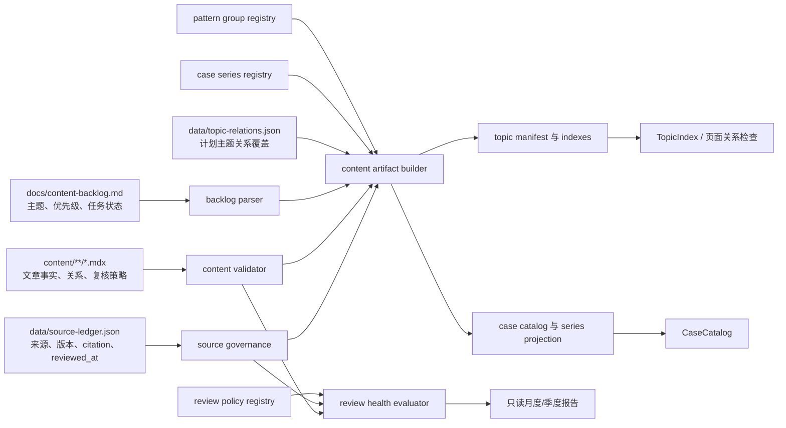
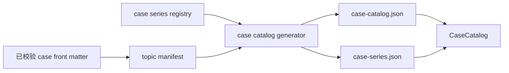

# 内容分类、页面关系与周期复核设计

**日期：** 2026-07-24
**范围：** `docs/content-backlog.md` 的 E0-04、E0-06、E0-07、E0-13、E0-14
**状态：** 设计语义已冻结
**目标读者：** 内容平台维护者、内容作者和后续实现本设计的工程代理

## 1. 目标

本次改造在现有内容平台和 source ledger 之上补齐五项能力：

1. 用六篇真实生产文章校准原则、模式、风格、方法、建模和质量属性六种独立契约。
2. 把通用模式与 Agent 控制模式拆成可扩展的导航分组。
3. 让案例 series 由单一注册表和案例 front matter 驱动，不再要求新增案例时同步修改多份硬编码枚举。
4. 把知识页与上位入口、相邻主题、案例或练习的关系变成可执行发布门槛。
5. 用确定性的月度与季度报告识别新增来源、失效链接和需要重新核对版本的内容。

完成后，内容作者仍以 Markdown/MDX、backlog 和 source ledger 工作。注册表只定义稳定分类和复核策略，
不形成新的任务状态源，也不替代文章中的事实证据。

## 2. 固定约束

- 不新增 npm 依赖；解析、验证、生成和报告继续使用 Node.js 内置模块。
- 保持所有现有公开 URL，不重命名现有案例、路线、入口页或已发布文章 slug。
- `docs/content-backlog.md` checkbox 继续是唯一人工任务状态源。
- `data/source-ledger.json` 继续是来源身份、版本、引用、许可证和文档审查信息的唯一真源。
- `community-index`、awesome list、学习路线索引和第三方聚合页只能承担 discovery/learning；
  它们不能满足定义、机制、运行事实、方法或案例事实的证据门槛。
- 六篇 fixture 必须像正式文章一样满足 source ledger、版权、引用、内容密度和页面关系约束，
  不能成为仅为测试存在的薄页。
- E0-04 按“五类文章家族、六种独立契约”落真实 fixture：`principle`、`pattern`、`style`、
  `method`、`modeling`、`quality-attribute`。方法/建模是一个内容家族，但保持两种生产契约。
- fixture 发布只表示页面已经进入生产内容集合，不自动勾选对应 backlog topic。只有正文达到该
  主题自身的完成标准并通过事实、版权、关系和渲染审查后，才单独更新 checkbox。
- `related_questions` 是知识页的可选关系字段。页面关系门禁接受至少一个
  `related_cases` 或至少一个 `related_questions`，不要求两个字段同时非空。
- 生成文件只由内容平台生成事务写入，不允许手工修复。
- 默认验证保持离线可重复；只有现有定时 live link workflow 执行网络探测。

## 3. 非目标

本设计不做以下事情：

- 不建立 CMS、数据库或远程内容服务。
- 不统一重写全部知识类型契约。
- 不为全部 backlog 主题一次性创作正文。
- 不把案例 series、模式分组或复核状态写回 backlog。
- 不改变 source ledger 的证据角色、版权矩阵或“索引不等于证据”规则。
- 不把所有内容关系改造成通用知识图谱。
- 不要求相邻主题关系强制双向；关系表示当前页面推荐的下一跳，反向关系可由另一页独立声明。
- 不自动修改文章、接受重定向、更新来源版本、勾选 backlog 或创建 PR。
- 不在本设计中规定实现任务顺序、命令级操作或逐文件编码步骤。

## 4. 现状与问题

### 4.1 文章契约只有合成测试

`scripts/content-schema.mjs` 已为 `principle`、`quality-attribute`、`method`、`modeling` 和
`style` 定义有序章节契约，并为质量属性场景定义 Source、Stimulus、Environment、Artifact、
Response 和 Response measure 六个字段。现有测试使用临时文档证明校验器能接受这些结构，
但仓库尚无真实知识文章验证内容密度、来源治理、内部链接和渲染效果。

`pattern` 已是允许的 `content_type`，却不在知识文章契约集合中。当前
`content/patterns/index.mdx` 同时承担模式入口、Agent 控制模式说明和计划主题索引，
因此不能作为单篇模式文章的 fixture。

### 4.2 模式分类没有机器边界

backlog 中 DDD、企业应用、代码设计、数据一致性、集成、可靠性、运维、安全和反模式主题都投影为
`type: pattern`。manifest 和 `TopicIndex` 只能按类型取列表，不能表达通用设计、集成、可靠性、
数据、迁移和 Agent 控制六个分组。

现有 Agent 模式是入口页中的手写章节，不是 backlog 中的独立主题。单靠 topic ID 前缀又不能正确
分类所有主题：例如 `ANTI-*` 同时包含可靠性和代码设计反模式，未来迁移模式也没有稳定前缀。

### 4.3 案例 series 被多处重复定义

案例 series 同时出现在内容 schema、18 篇案例硬编码 manifest、前端 TypeScript union、中文标签、
筛选排序和首页分组中。生成器已经能从已校验文章和 topic manifest 发现案例，但完整性校验仍依赖
冻结的 slug 列表和按位置切片。

New API、LiteLLM 和 Kong 已形成清晰的 Agent 平台/模型网关案例簇，却只能继续归入
`ai-native`。新增 series 会要求同步修改多处代码和测试。

### 4.4 关系存在于数据中，未成为页面门禁

知识页已有 `depends_on` 和 `related_cases`，topic manifest 能检查依赖目标、相关案例和依赖环。
但系统尚未表达：

- 当前类型的上位入口；
- 不等同于前置依赖的相邻主题；
- 可选的练习关系；
- 关系是否在正文中形成用户可点击的站内链接。

因此 manifest 中存在关系并不保证读者能从页面继续学习。

### 4.5 外链有月度探测，内容没有到期报告

现有 workflow 每月执行 live link 检查并上传报告，默认 `npm run verify` 使用离线缓存。
source ledger 已记录 source `checked_at`、`version` 和 document `reviewed_at`，文章记录
`analyzed_at` 与 `source_cutoff`。这些日期尚未组合成内容复核到期判断，也没有区分版本敏感内容。

## 5. 比较过的方案

### 方案 A：最小硬编码补丁

为六篇文章补内容；在 `TopicIndex` 中按 ID 前缀分组；把新 case series 同步加入现有枚举；在
`validate-content` 中直接匹配几个链接；另写一个季度日期检查。

优点：

- 初始改动最少；
- 可以快速满足单个页面的表面验收；
- 不需要新增注册表格式。

缺点：

- 模式分组、series 标签和排序继续散落在多个文件；
- 前缀不能表达 `ANTI-*` 等例外，也不能自然容纳 Agent 和迁移模式；
- 新增分类仍要求改验证器、生成器、前端和测试；
- 复核策略会和日期算法耦合在命令入口中。

结论：不采用。它会把 E0-06 和 E0-07 要消除的维护债继续扩大。

### 方案 B：注册表驱动的增量扩展

分别为模式分组、案例 series 和复核策略建立小型、受 schema 保护的注册表。backlog 和内容继续
提供主题与文章事实，source ledger 继续提供来源事实；生成器把这些输入合成为现有 manifest、
索引、案例目录和只读复核报告。

优点：

- 每类事实只有一个人工维护位置；
- 保持现有 content type、slug、backlog 和 source ledger 边界；
- 可以按 E0 故事独立启用和发布；
- 注册表可被 Node 校验器、生成器和前端共同消费；
- 错误可以在生成前 fail closed，而不是在页面渲染时静默遗漏。

代价：

- 需要定义三个很小的 registry schema；
- 首次迁移要给现有模式主题分组，并把案例 series 的标签和顺序迁入注册表；
- 生成 artifact 的消费者需要接受 registry 投影。

**推荐方案：B。** 它解决当前明确存在的重复硬编码，同时不引入统一知识图谱或 CMS。

### 方案 C：统一内容 ontology 与关系图

用一个通用 ontology 描述 content type、模式分类、series、关系、证据和复核周期，再由图生成全部
导航和报告。

优点：

- 长期表达能力最强；
- 分类、关系和策略可以共享一套查询模型；
- 可以进一步支持图谱导航与依赖分析。

缺点：

- 会改变现有 manifest 和 source ledger 的职责边界；
- 迁移全部内容和前端消费者的风险远高于五个 E0 故事；
- 通用图 schema 会在实际查询需求出现前引入大量抽象；
- 难以保持小批次、可回滚发布。

结论：不采用。当前问题需要三个清晰注册表和两类验证器，不需要新的内容平台范式。

## 6. 总体架构



三类人工事实保持分离：

1. backlog 负责计划主题和任务状态；
2. MDX 负责已发布文章、页面关系和版本敏感性；
3. source ledger 负责来源身份、版本、引用和来源审查。

注册表只定义允许的分类值、展示顺序和复核周期。它们不能覆盖文章标题、slug、任务状态、来源证据
或 citation 用途。

## 7. 注册表设计

三个注册表的规范文件固定为：

- `data/pattern-groups.json`；
- `data/case-series.json`；
- `data/review-policies.json`。

它们各自包含 `schema_version: 1`，只接受本节列出的字段。注册表之间不互相嵌套，也不复制
backlog topic、案例 front matter 或 source ledger 的事实。

### 7.1 模式分组注册表

模式分组使用稳定 ID：

| ID | 展示名称 | 用途 |
| --- | --- | --- |
| `general-design` | 通用设计模式 | DDD、企业应用、代码级责任与结构模式 |
| `integration` | 集成模式 | 服务、消息、网关与协议边界 |
| `reliability` | 可靠性与生产治理模式 | 超时、重试、隔离、观测与安全控制 |
| `data` | 数据与一致性模式 | 事务消息、复制视图、事件与一致性协作 |
| `migration` | 迁移模式 | Strangler、并行变更、兼容窗口与渐进替换 |
| `agent-control` | Agent 控制与协作模式 | Router、Supervisor、Handoff、A2A、MCP 等现有内容 |

注册表为每组定义 `id`、`label`、`description`、`order` 和显式 `topic_ids`。显式 topic ID 是
规范分类；ID 前缀只能用于生成初稿或测试提示，不能成为运行时分类真源。这样 `ANTI-*` 等主题可按
语义分组，未来迁移主题也不需要先创造新 content type。

每个 backlog 或已发布 `pattern` 主题必须恰好属于一个组：

- 未分组失败；
- 同时属于多个组失败；
- 注册表引用未知 topic ID 失败；
- 非 `pattern` topic ID 出现在模式分组中失败。

`agent-control` 保留当前入口页中的内容，但从通用主题清单中分离为独立导航区。它可以继续是一个
reference-style 概览，而不为 Router、Supervisor 等现有章节伪造 backlog 任务。未来这些章节若
转成独立文章，再用真实 topic ID 加入该组。

`migration` 在没有独立 backlog 主题时仍显示稳定分组和“计划中”状态，不生成占位文章或 404
链接。新增第一个迁移主题后，注册表分类和现有 URL 规则即可直接接管。

### 7.2 案例 series 注册表

案例 series 注册表定义：

- 稳定 `id`；
- 中文 `label`；
- 数值 `order`；
- 是否进入首页迁移/专题分组的展示标志；
- 可选的简短说明。

现有四个 series ID 保持不变，新增：

```text
agent-platform-gateway
```

其展示名固定为“Agent 平台与模型网关”。以下三个案例迁入该 series，slug 和全局
`catalog_order` 不变：

- `/cases/new-api-channel-pool-routing`
- `/cases/litellm-virtual-keys-governance`
- `/cases/kong-ai-gateway-routing-resilience`

AWS CLI Agent Orchestrator 继续留在 `ai-native`。它是本地编排与 worker 隔离案例，不因为同属
Agent 生态就自动归入平台/网关 series。

案例 front matter 继续声明自身 `series`。注册表只声明允许值、标签与顺序，不维护案例 slug
成员清单。这样案例归属仍与文章事实同文件维护，不形成第二份目录。

案例完整性改为以下不变量：

- 所有被内容扫描器发现并成功校验的已发布 case 都必须进入 catalog；
- slug、`catalog_order` 各自唯一；
- `series` 必须存在于注册表；
- `featured` 决定首发/重点展示，不再使用 `slice(0, 5)`；
- 页面分组按 registry `order`，案例组内按既有全局 `catalog_order`；
- 新增合法 series 不要求修改 TypeScript union、标签 map、筛选顺序或首页枚举。

现有 case catalog 数组可以保持兼容；series 注册表另生成只读前端投影，避免为了分类扩展破坏案例
目录消费者。

### 7.3 复核策略注册表

首版只定义一个需要内容到期门禁的策略：

```text
quarterly-version-sensitive
```

其周期语义是从 `source_cutoff` 起增加三个日历月，不使用固定 90 天近似。文章可在 front matter
声明：

```text
review_policy: quarterly-version-sensitive
```

未声明策略的文章仍接受每月链接健康检查，但不会仅因时间流逝进入季度内容复核门禁。

如果已发布文章的事实 citation 使用 `link_policy: floating` 且角色属于 definition、method、
runtime-fact、case-evidence 或 implementation，文章必须显式声明
`quarterly-version-sensitive`。只有 discovery/learning/navigation-only 的索引来源不能触发
版本敏感判断，也不能帮助文章满足事实证据门槛。

策略注册表固定 `id`、`label`、`calendar_months` 和适用说明。报告算法只消费注册表，不在命令
入口复制“三个月”常量。

## 8. E0-04：五类家族、六篇真实 fixture

### 8.1 固定文章

首批真实生产 fixture 固定为：

| 类型 | Topic | 选择理由 |
| --- | --- | --- |
| `principle` | `PR-01` 信息隐藏与封装 | 能验证原则、机制、误用、尺度与案例迁移的完整结构 |
| `pattern` | `REL-02` Retry、Exponential Backoff 与 Jitter | 能验证模式上下文、运行机制、失败放大和可靠性权衡 |
| `style` | `STY-00` 架构风格比较框架 | 为后续全部风格页提供同一比较尺度 |
| `method` | `MTH-03` ADR 生命周期 | 能验证输入、步骤、产物、完成判断和完整演练 |
| `modeling` | `MOD-02` C4 Context 与 Container | 能验证建模目标、参与者、模型产物和系统边界演练 |
| `quality-attribute` | `QA-01` 质量属性场景写法 | 直接验证六字段场景和可测量阈值 |

六篇文章作为一个内容基线集合发布，彼此可以提供已发布的相邻主题，不需要链接到尚未存在的页面。
建议关系是：

- `PR-01` 与 `STY-00` 相邻；
- `STY-00` 与 `PR-01` 相邻；
- `QA-01` 与 `MTH-03` 相邻；
- `MTH-03` 与 `QA-01` 相邻；
- `REL-02` 与 `QA-01` 相邻；
- `MOD-02` 与 `STY-00` 相邻。

每篇还必须链接所属入口和至少一个现有案例。关系可为定向推荐，不要求所有相邻关系成对出现。
文章发布后，manifest 可以同时表达 `published: true` 和 backlog `pending`。发布动作本身不改变
checkbox；只有某篇正文已经覆盖该 topic 在 backlog 中定义的全部停止条件，才由发布审查单独确认
是否完成该主题。

### 8.2 Pattern 文章契约

`pattern` 加入知识文章契约，使用以下有序 H2：

```text
## 学习问题
## 问题与适用上下文
## 约束与驱动力
## 结构与协作关系
## 运行机制
## 失败模式与误用
## 质量属性权衡
## 实现与迁移提示
## 相邻模式与反模式
## 说明性场景
## 来源
```

该契约描述单篇模式文章，不适用于 `content/patterns/index.mdx`。入口页继续作为聚合导航，不因
`content_type: pattern` 被误当成知识文章 fixture；知识文章校验以非 index 页面和 `topic_id`
为边界。

### 8.3 Method 与 Modeling 的边界

方法和建模属于 backlog 所说的同一文章家族，但不是同一种页面结构。`MTH-03` 只验证 method
契约，`MOD-02` 只验证 modeling 契约，禁止用一个 topic 或双重 `content_type` 代替两篇生产
样板。两种契约都继续保留合法、缺章节、乱序和元数据错误的合成测试，真实文章再额外验证内容密度、
来源、关系和渲染。

### 8.4 来源与证据

每篇 fixture 必须：

- 在 source ledger 中有 document 记录和完整 citations；
- 至少有一个可以承担该文章事实门槛的 primary 或 first-party 来源；
- 把可见正文外链与 citation 一一闭合；
- 对 awesome list、博客索引和社区路线图只使用 discovery/learning 或 navigation-only；
- 不复刻来源目录结构、图示或长段表述；
- 保留 `source_cutoff`、`analyzed_at` 和版权审查字段。

## 9. E0-06：模式导航

`/patterns` 保持总览 URL，负责解释模式分类尺度并渲染六个分组。通用分组从生成的 pattern index
按 registry group 读取；Agent 控制模式使用独立区块或子入口展示现有 Router、Supervisor、
Agents as Tools、Handoff、Fan-out/Fan-in、Evaluator-Optimizer、Hierarchical Teams、A2A 和
MCP 内容。

导航遵守以下规则：

- 已发布 topic 显示站内链接；
- 计划 topic 只显示标题、优先级和可用的外部学习起点；
- 空分组显示明确的“计划中”，不制造空文章；
- pattern group 不改变 topic slug，`/patterns/<topic-id>` 规则保持不变；
- Agent 概览与通用 topic 卡片不能重复渲染同一个 topic ID；
- 分组顺序只来自 registry；
- 外部学习起点继续受 source ledger 和“索引不等于证据”约束。

## 10. E0-07：案例分类

生成数据流调整为：



内容扫描器发现的已发布案例集合是 catalog 覆盖真源。代码中不再维护完整 slug manifest，也不按
数组位置推导“首发五篇”“经典十篇”或“第二批案例”。历史 URL 和 `catalog_order` 保持不变，
因此现有深链和全站展示顺序不会漂移。

前端运行时同时校验 catalog 与 series 投影：

- catalog 引用了未知 series 时拒绝渲染；
- registry 有重复 ID、label 空白或 order 冲突时生成失败；
- 一个 registry series 暂无案例时不进入筛选选项，但可以保留为合法未来分类；
- 首页是否展示某个 series 读取 registry 标志，不再维护第二个 series 数组。

## 11. E0-13：页面关系门禁

### 11.1 关系模型

知识页关系扩展为：

```text
depends_on
adjacent_topics
related_cases
related_questions
```

其中：

- `depends_on` 是学习前置，继续参与依赖环检查；
- `adjacent_topics` 是推荐的同级或跨类型下一跳，不参与依赖深度和环检查；
- `related_cases` 是已发布 case slug 数组；
- `related_questions` 是可选的已发布 question topic slug 数组。

`related_questions` 缺省为空数组。知识页发布门禁要求
`related_cases.length + related_questions.length >= 1`。

上位入口不写入 front matter。它由 content type 确定：

| content type | 上位入口 |
| --- | --- |
| `concept` | `/concepts` |
| `principle` | `/principles` |
| `quality-attribute` | `/quality-attributes` |
| `method` | `/methods` |
| `modeling` | `/modeling` |
| `style` | `/styles` |
| `pattern` | `/patterns` |

这样不会在每篇文章复制恒定关系，也不会允许文章声明错误入口。

### 11.2 目标合法性

对已发布知识页：

- 至少有一个 `adjacent_topics`；
- 至少一个相邻目标必须是已发布、非自身的知识 topic；
- 每个 `related_cases` 必须解析到已发布 case；
- 每个 `related_questions` 必须解析到已发布 question topic；
- 关系数组不允许空字符串、重复值或自身引用；
- planned topic 的 relation override 可以指向 planned topic，但不能帮助已发布页面满足可点击关系门禁。

相邻关系不强制双向。若 B 没有把 A 作为推荐下一跳，A → B 仍是合法的定向导航关系。

### 11.3 正文可见链接

元数据合法还不够。校验器从同一份已读取 MDX snapshot 中提取可见站内链接，忽略 front matter、
代码围栏和 HTML 注释。每篇已发布知识页正文必须实际包含：

1. 推导出的上位入口链接；
2. 至少一个满足门禁的已发布相邻 topic 链接；
3. 至少一个元数据中声明的已发布 case 或 question 链接。

内部链接提取与 source ledger 的 HTTPS 外链提取分离：前者验证站内学习导航，后者验证来源引用。
两者共享同一 document snapshot，但不能把站内关系误登记为外部 source。

## 12. E0-14：月度与季度复核

### 12.1 日期和版本语义

- source `checked_at`：该来源记录最近一次核对日期；
- source `version`：本次核对对应的版本、commit、标准版本或“current page checked on date”；
- ledger document `reviewed_at`：citation、版权和发布审查日期；
- article `analyzed_at`：文章分析或实质修订日期；
- article `source_cutoff`：文章事实最后覆盖的来源与版本边界。

这些字段含义不同，报告可以并列展示，不能互相回写或自动替代。

source ledger 为 source 增加 `registered_at` 日历日期，表示首次进入 canonical ledger 的日期。
现有迁移来源统一使用 canonical ledger 建立日 `2026-07-24`，不伪造更早日期。以后新增 source
必须填写真实登记日。

### 12.2 月度报告

月度 workflow 在每月第一天生成上一完整自然月报告，手工触发时允许注入 `as_of`。报告包含：

- `registered_at` 落在窗口内的新增来源；
- `checked_at` 落在窗口内的重新核对来源；
- 新来源被哪些文档引用、承担哪些 roles、是否只是 discovery/learning；
- 当前 live link 报告中的失效、意外重定向、登录墙和 retired 结果；
- source ledger 中已登记但没有 document citation 的孤立来源。

“新增来源”和“重新核对来源”分开统计，避免把 `checked_at` 更新误报为首次登记。

定时任务保持 `contents: read`，只上传 JSON 和 Markdown artifact。它不改 ledger，不自动接受
redirect，也不创建 commit 或 PR。

### 12.3 季度到期判断

对声明 `quarterly-version-sensitive` 的已发布文章，以下任一条件使其进入 due：

1. `source_cutoff` 加三个日历月不晚于 `as_of`；
2. 任一承担事实角色的 floating source 的 `checked_at` 晚于文章 `source_cutoff`；
3. 任一承担事实角色的 source 缺失非空 `version`；
4. ledger document `reviewed_at` 早于文章 `source_cutoff`，说明文章事实边界晚于 citation/版权审查。

报告为每篇 due 文章列出：

- article slug、policy、`analyzed_at`、`source_cutoff` 和 ledger `reviewed_at`；
- 触发原因；
- 相关 source ID、当前 `version`、`checked_at` 和 link policy；
- 需要人工确认的最小来源集合。

到期并不自动表示文章事实错误；它表示现有证据边界不足以继续无审查地声明“已复核”。

### 12.4 离线与 live 边界

默认验证只读取内容、registries、source ledger 和已审 link-health cache。日期算法接受注入式
`as_of`，测试不依赖系统时钟。

- registry、日期格式、缺版本、策略缺失和已到期内容在离线检查中 fail closed；
- 30 天内即将到期内容只进入 warning/report，不阻断发布；
- 新增来源清单本身不失败；
- live 网络错误继续由现有月度 link workflow 判断；
- 月度复核报告可以合并 live link artifact 的摘要，但不能把网络结果写回 source ledger。

## 13. 数据流与生成事务

内容平台每次读取一份一致 snapshot：

1. 读取 backlog、MDX、关系覆盖、三个 registries、source ledger 和离线 link cache；
2. 校验 registry schema 和交叉引用；
3. 校验内容结构、source governance、页面关系和复核策略；
4. 构建 topic manifest、topic indexes、case catalog、series projection 和公开 source ledger；
5. 在临时 staging 中完成 digest 检查；
6. 按现有可恢复事务替换生成文件。

复核报告是只读检查产物，不加入公开生成事务，也不提交到仓库。这样报告失败不会留下半更新的
manifest，重跑也不会覆盖人工内容。

topic manifest 可增加 `pattern_group`、`adjacent_topics`、`related_questions` 和
`review_policy` 投影，但不投影 source ledger 的版权检查或任务状态。case series label/order
进入独立生成投影，避免污染每个 topic 的核心身份。

## 14. 错误处理

所有验证一次收集错误，按文件、topic ID 或 source ID 确定排序后输出。诊断必须包含事实来源：

- registry schema：
  `data/pattern-groups.json: group "data" contains duplicate topic "PAT-DC-01"`；
- case series：
  `content/cases/...mdx: series "agent-gateway" is not registered`；
- relation target：
  `content/principles/...mdx: adjacent topic "PR-99" does not exist`；
- visible link：
  `content/principles/...mdx: missing visible parent link "/principles"`；
- OR gate：
  `content/...mdx: requires at least one published related case or question`；
- review policy：
  `content/...mdx: factual floating source "source-id" requires review_policy "quarterly-version-sensitive"`；
- due report：
  `content/...mdx: quarterly review due since 2026-10-24 (source_cutoff 2026-07-24)`。

以下情况必须 fail closed：

- registry 未知字段、重复 ID、重复 order 或悬空 topic；
- 已发布 pattern 没有且只有一个分组；
- case 使用未知 series；
- 关系目标不存在、类型错误或不能解析到已发布页面；
- 可见正文缺少关系链接；
- 日期不是合法日历日期；
- 版本敏感文章缺少 policy；
- 到期文章仍参与正式发布验证。

网络超时不由默认离线验证重新解释。live workflow 使用现有 transport 诊断和 artifact 机制。

## 15. 测试设计

### 15.1 文章契约与 fixture

- 六篇真实文章分别通过对应章节顺序和元数据契约；
- 每种类型各有缺章节、乱序和错误元数据 RED fixture；
- `QA-01` 精确验证六字段质量属性场景；
- `REL-02` 精确验证新增 pattern H2 契约；
- `MTH-03` 与 `MOD-02` 分别通过 method 和 modeling 契约，不能相互替代；
- 六篇文章全部通过 source ledger、版权、内容密度、生成和 Docusaurus build；
- fixture 发布不自动改变 backlog checkbox，published/pending 的组合有回归测试。

### 15.2 模式分组

- 每个 backlog/published pattern 恰好属于一组；
- 未分组、多组、未知 topic、非 pattern topic 和重复 group order 均失败；
- `/patterns` 保持不变；
- 空 migration 分组不产生 404；
- Agent 概览与通用列表无重复 topic ID；
- planned topic 不渲染站内链接。

### 15.3 案例 series

- registry schema、唯一 ID/order、非空 label；
- catalog 发现集合等于已发布 case 文档集合；
- 新 series 自动进入筛选、标签和排序；
- New API、LiteLLM、Kong 属于 `agent-platform-gateway`；
- 18 个现有 slug 和 `catalog_order` 不变；
- `featured` 而非数组切片决定重点案例；
- 未知 series 在生成阶段失败，空 series 不污染筛选项。

### 15.4 页面关系

- parent route 按 type 推导正确；
- adjacent target 的存在性、已发布状态、自引用和重复值；
- related case 与 related question 分别验证目标类型；
- case 非空、question 为空时通过；
- case 为空、question 非空时通过；
- 两者都为空时失败；
- 元数据有关系但正文无可见链接时失败；
- front matter、代码块或注释中的伪链接不能满足门禁；
- adjacent relation 不参与 dependency cycle。

### 15.5 周期复核

- 注入式时钟覆盖月末、闰日和“加三个日历月”边界；
- `registered_at` 与 `checked_at` 分别进入新增/重新核对列表；
- floating factual source 晚于 cutoff 时提前 due；
- stable 固定版本来源不会仅因重新探测提前 due；
- discovery-only community index 不触发版本敏感事实门槛；
- 缺失版本、坏日期、未知 policy 和到期文章失败；
- approaching-due 只报告不失败；
- workflow 保持只读权限、固定 action SHA，并总是上传报告；
- 默认 `verify` 不发网络请求。

### 15.6 回归与发布验证

- `npm run verify`；
- `git diff --check`；
- 生成事务中断恢复和 stale artifact 检查；
- 线上 smoke 至少覆盖 `/patterns`、六篇 fixture、`/cases`、`/references`；
- 逐一检查既有 18 篇案例 URL 与 10 条学习路线 URL。

## 16. 分批发布边界

五个故事按独立、可回滚的发布单元组织，而不是等待全部完成：

### 发布单元 A：E0-04 真实内容基线

包含 pattern 文章契约、六篇 fixture、对应 source ledger citations 和生成索引。该单元不依赖新
导航 UI 或周期报告即可独立发布。六篇文章在发布时已经写好未来关系门禁所需的可见链接，但不因
“fixture”身份自动勾选 backlog topic。

### 发布单元 B：E0-06 模式分类导航

包含 pattern group registry、manifest 分组投影和 `/patterns` 分组展示。保持所有既有 URL，
能单独回滚到原单列表。

### 发布单元 C：E0-07 案例 series

包含 case series registry、`agent-platform-gateway`、三个案例归类和前端 registry 消费。
catalog 集合、slug 和 order 不变，因此可独立验证和发布。

### 发布单元 D：E0-13 页面关系门禁

包含 `adjacent_topics`、可选 `related_questions`、目标合法性和可见正文链接检查。先用发布单元
A 的六篇真实文章证明门禁，再扩展到后续知识页。

### 发布单元 E：E0-14 周期复核

包含 review policy registry、source `registered_at`、离线 due evaluator 和只读月度 workflow
artifact。它只增加发布门禁与维护报告，不改变公开 URL 或页面正文。

每个单元必须独立通过完整 verify、构建和线上 smoke 后再更新 backlog 与发布基线。任何单元失败
时只回滚该单元，不回退已经发布且验证通过的前置单元。

## 17. 兼容性与迁移原则

- 六篇 fixture 使用 backlog 既有稳定 topic ID 和自动 slug 规则。
- fixture 的发布状态与 backlog checkbox 分离；只有达到 topic 自身停止条件才标记任务完成。
- pattern 分组只改变列表组织，不改变 topic type 或 slug。
- Agent 控制内容保留，不因导航拆分删除或改名。
- 三个网关案例只改 series；slug、标题、目录顺序和引用保持不变。
- 删除硬编码 case manifest 后，完整性由内容发现集合、唯一 slug 和唯一 order 共同保证。
- `related_questions` 缺省为空，现有知识契约可以渐进迁移；新发布知识页立即执行 OR 门禁。
- `registered_at` 的历史迁移值使用 canonical ledger 建立日，并在设计和数据中明确其含义。
- review policy 只标记版本敏感文章，不把全部稳定知识页强制纳入季度重写。
- source ledger、citation 角色和 copyright checks 的现有语义不变。

## 18. 自审结论

- **占位符检查：** 文档没有占位符、未决选项或未命名字段。
- **一致性检查：** backlog 仍是任务状态真源，MDX 是文章与关系真源，source ledger 是来源真源；
  三个注册表只定义分类与策略，没有形成相互竞争的数据源。
- **范围检查：** 设计只覆盖 E0-04、E0-06、E0-07、E0-13、E0-14；没有扩展到 CMS、统一知识图谱、
  全量内容创作或自动修订。
- **歧义检查：** 六篇 fixture 已精确到 topic；method 与 modeling 分别有真实生产样板；
  `related_questions` 明确可选且与 `related_cases` 使用 OR 门禁；相邻关系明确为非强制双向；
  版本敏感和季度日期算法均有确定定义。
- **兼容性检查：** 所有现有公开 URL、18 篇案例顺序、10 条学习路线、source ledger 治理和
  “索引不等于证据”约束保持不变。
- **发布检查：** 五项能力有独立验证和发布边界，不要求等到全部完成再上线。
